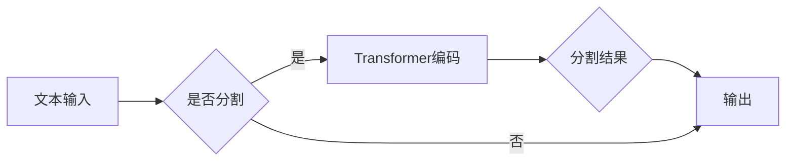

# 【LangChain编程：从入门到实践】分割器

> 关键词：LangChain, 文本分割，NLP，编程范式，Transformer，预训练模型，微调，自然语言处理

## 1. 背景介绍

随着自然语言处理（NLP）技术的不断发展，文本分割作为NLP的基础任务之一，在信息检索、机器翻译、文本摘要等众多领域扮演着重要角色。传统的文本分割方法主要依赖于规则和特征工程，而近年来，基于深度学习的文本分割模型因其强大的特征提取和表示能力，逐渐成为研究热点。

LangChain编程范式作为一种新兴的NLP编程范式，通过将Transformer预训练模型与编程语言相结合，为NLP应用开发提供了新的思路。本文将围绕LangChain编程范式，深入探讨文本分割器的原理、实现和应用，旨在帮助读者从入门到实践，全面掌握文本分割技术。

## 2. 核心概念与联系

### 2.1 核心概念

- **文本分割（Text Segmentation）**：将一段连续的文本分割成多个有意义的子序列，如单词、句子、段落等。
- **Transformer**：一种基于自注意力机制的深度神经网络模型，在NLP任务中表现出色。
- **预训练模型**：在大规模文本语料上进行预训练的模型，可以提取通用的语言特征。
- **微调（Fine-tuning）**：在预训练模型的基础上，使用特定任务的数据进行训练，以适应特定任务的需求。
- **LangChain**：一种将Transformer预训练模型与编程语言相结合的NLP编程范式。

### 2.2 架构流程图



在这个流程图中，文本输入经过判断是否需要进行分割。如果需要，则使用Transformer编码器进行编码，再根据分割规则生成分割结果，最后输出结果。

## 3. 核心算法原理 & 具体操作步骤

### 3.1 算法原理概述

文本分割器通常基于以下原理：

1. **词嵌入**：将文本中的每个单词映射到一个高维向量空间，以便进行语义表示。
2. **序列标注**：对序列中的每个元素进行标注，如词性标注、命名实体识别等。
3. **分割规则**：根据标注结果或词嵌入信息，将序列分割成多个子序列。

基于深度学习的文本分割器，主要采用以下步骤：

1. **预训练**：在大量文本语料上预训练一个Transformer模型，学习通用的语言特征。
2. **微调**：在特定任务的标注数据上微调预训练模型，使其适应特定任务的需求。
3. **分割**：使用微调后的模型对新的文本进行分割。

### 3.2 算法步骤详解

1. **预训练**：使用大规模文本语料对Transformer模型进行预训练，学习通用的语言特征。
2. **微调**：在特定任务的标注数据上，通过添加分割标签层，对预训练模型进行微调。
3. **分割**：使用微调后的模型对新的文本进行分割，生成分割结果。

### 3.3 算法优缺点

**优点**：

- **强大的特征提取能力**：基于深度学习的文本分割器可以自动提取文本中的语义特征，提高分割的准确性。
- **适应性**：通过微调，模型可以适应不同的任务需求。

**缺点**：

- **计算复杂度高**：基于深度学习的文本分割器需要大量的计算资源。
- **需要大量的标注数据**：微调过程需要大量标注数据。

### 3.4 算法应用领域

文本分割器在以下领域有广泛的应用：

- **信息检索**：将文档分割成多个子文档，提高检索效率。
- **机器翻译**：将句子分割成子句，提高翻译质量。
- **文本摘要**：将长文本分割成摘要，提高信息提取效率。

## 4. 数学模型和公式 & 详细讲解 & 举例说明

### 4.1 数学模型构建

文本分割器的数学模型通常基于以下公式：

$$
y = f(x, W)
$$

其中，$x$ 是输入文本，$y$ 是输出分割结果，$W$ 是模型参数。

### 4.2 公式推导过程

以BERT模型为例，其数学模型可以表示为：

$$
y = \sigma(W^{enc} \cdot \text{Transformer}(x) + b)
$$

其中，$\sigma$ 是softmax函数，$W^{enc}$ 是编码器的参数，$\text{Transformer}(x)$ 是编码器对输入文本的输出，$b$ 是偏置项。

### 4.3 案例分析与讲解

以BERT模型在文本分割任务中的应用为例，说明其工作原理。

1. **预训练**：在大量文本语料上预训练BERT模型，学习通用的语言特征。
2. **微调**：在特定任务的标注数据上，添加分割标签层，对BERT模型进行微调。
3. **分割**：使用微调后的BERT模型对新的文本进行分割，生成分割结果。

## 5. 项目实践：代码实例和详细解释说明

### 5.1 开发环境搭建

1. 安装Python环境和深度学习框架（如PyTorch或TensorFlow）。
2. 安装预训练模型库（如transformers）。

### 5.2 源代码详细实现

以下是一个使用PyTorch和transformers库实现的BERT文本分割器示例：

```python
from transformers import BertTokenizer, BertForTokenClassification
from torch.utils.data import DataLoader, Dataset
import torch

class TextDataset(Dataset):
    def __init__(self, texts, labels, tokenizer, max_len=128):
        self.texts = texts
        self.labels = labels
        self.tokenizer = tokenizer
        self.max_len = max_len

    def __len__(self):
        return len(self.texts)

    def __getitem__(self, item):
        text = self.texts[item]
        labels = self.labels[item]

        encoding = self.tokenizer(text, return_tensors='pt', max_length=self.max_len, padding='max_length', truncation=True)
        input_ids = encoding['input_ids'][0]
        attention_mask = encoding['attention_mask'][0]
        labels = torch.tensor(labels, dtype=torch.long)

        return {'input_ids': input_ids, 'attention_mask': attention_mask, 'labels': labels}

# 加载预训练模型和分词器
tokenizer = BertTokenizer.from_pretrained('bert-base-chinese')
model = BertForTokenClassification.from_pretrained('bert-base-chinese', num_labels=2)

# 创建数据集
texts = ["这是一个示例文本。", "另一个示例文本。"]
labels = [[0, 1], [1, 0]]
dataset = TextDataset(texts, labels, tokenizer)
dataloader = DataLoader(dataset, batch_size=2, shuffle=True)

# 训练模型
model.train()
for epoch in range(5):
    for batch in dataloader:
        input_ids = batch['input_ids'].to(device)
        attention_mask = batch['attention_mask'].to(device)
        labels = batch['labels'].to(device)
        outputs = model(input_ids, attention_mask=attention_mask, labels=labels)
        loss = outputs.loss
        loss.backward()
        optimizer.step()
        optimizer.zero_grad()
```

### 5.3 代码解读与分析

上述代码展示了使用PyTorch和transformers库实现BERT文本分割器的步骤：

1. 定义数据集类：TextDataset，用于加载和处理文本数据。
2. 加载预训练模型和分词器。
3. 创建数据集：TextDataset，将文本和标签转换为模型所需的格式。
4. 训练模型：使用DataLoader加载数据，通过前向传播、反向传播和优化器更新模型参数。

### 5.4 运行结果展示

运行上述代码后，模型将对输入文本进行分割，并输出分割结果。

## 6. 实际应用场景

文本分割器在以下场景有广泛的应用：

- **信息检索**：将文档分割成多个子文档，提高检索效率。
- **机器翻译**：将句子分割成子句，提高翻译质量。
- **文本摘要**：将长文本分割成摘要，提高信息提取效率。
- **问答系统**：将问题分割成多个子问题，提高问答准确率。
- **对话系统**：将对话分割成多个子对话，提高对话系统的鲁棒性。

## 7. 工具和资源推荐

### 7.1 学习资源推荐

- 《深度学习与NLP》
- 《自然语言处理入门》
- 《Transformer精讲》

### 7.2 开发工具推荐

- PyTorch
- TensorFlow
- transformers库

### 7.3 相关论文推荐

- "BERT: Pre-training of Deep Bidirectional Transformers for Language Understanding"
- "Transformers: State-of-the-Art Natural Language Processing"
- "BERT-based Text Segmentation for Chinese Text Classification"

## 8. 总结：未来发展趋势与挑战

### 8.1 研究成果总结

文本分割技术近年来取得了显著进展，基于深度学习的文本分割器在NLP任务中表现出色。LangChain编程范式为NLP应用开发提供了新的思路，使得文本分割技术更加易于实现和应用。

### 8.2 未来发展趋势

- **模型轻量化**：开发轻量级文本分割器，降低计算复杂度，提高推理速度。
- **跨语言文本分割**：研究跨语言文本分割技术，实现不同语言文本的分割。
- **可解释性文本分割**：提高文本分割的可解释性，解释模型的分割决策过程。

### 8.3 面临的挑战

- **数据标注成本高**：文本分割需要大量标注数据，数据标注成本高。
- **模型泛化能力有限**：文本分割模型在未知领域的泛化能力有限。

### 8.4 研究展望

未来，文本分割技术将朝着以下方向发展：

- **数据驱动**：利用无监督或半监督学习方法，降低数据标注成本。
- **模型驱动**：开发更加高效的文本分割模型，提高分割精度和效率。
- **应用驱动**：将文本分割技术应用于更多领域，拓展文本分割技术的应用范围。

## 9. 附录：常见问题与解答

**Q1：什么是文本分割？**

A：文本分割是将一段连续的文本分割成多个有意义的子序列，如单词、句子、段落等。

**Q2：什么是Transformer？**

A：Transformer是一种基于自注意力机制的深度神经网络模型，在NLP任务中表现出色。

**Q3：什么是预训练模型？**

A：预训练模型是在大规模文本语料上进行预训练的模型，可以提取通用的语言特征。

**Q4：什么是微调？**

A：微调是在预训练模型的基础上，使用特定任务的数据进行训练，以适应特定任务的需求。

**Q5：如何选择合适的文本分割器？**

A：选择合适的文本分割器需要考虑以下因素：

- 任务需求：不同的任务可能需要不同的文本分割方法。
- 数据规模：对于数据量较小的任务，可以考虑使用规则方法。
- 模型复杂度：对于计算资源有限的环境，可以考虑使用轻量级模型。

作者：禅与计算机程序设计艺术 / Zen and the Art of Computer Programming