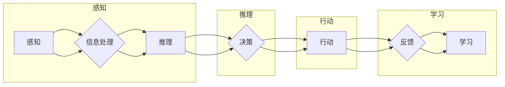

# 【大模型应用开发 动手做AI Agent】Agent带来新的商业模式和变革

> 关键词：大模型，AI Agent，应用开发，商业模式，自动化，智能化

## 1. 背景介绍

随着人工智能技术的飞速发展，大模型（Large Models）逐渐成为AI领域的热点。大模型通过在海量数据上进行预训练，能够理解复杂的自然语言、图像、语音等信息，并在各种任务上展现出惊人的能力。AI Agent作为大模型的一种应用形式，正在成为推动商业变革的重要力量。本文将探讨大模型应用开发，以AI Agent为例，分析其如何带来新的商业模式和变革。

### 1.1 大模型的兴起

近年来，随着计算能力的提升、数据的爆发式增长以及深度学习技术的突破，大模型如BERT、GPT-3等应运而生。这些模型在自然语言处理、计算机视觉、语音识别等领域取得了显著的成果，推动了AI技术的发展和应用。

### 1.2 AI Agent的概念

AI Agent是人工智能领域的一个新兴概念，它是一种具有自主学习、自主决策和自主执行能力的智能体。AI Agent可以模拟人类的思考和行为，完成各种复杂的任务，如智能客服、智能助手、智能推荐等。

### 1.3 AI Agent带来的商业变革

AI Agent的出现，不仅提高了企业的运营效率，也为传统行业带来了新的商业模式和变革。以下是一些AI Agent带来的商业价值：

- **自动化服务**：AI Agent可以自动处理大量重复性、低价值的工作，减少人力成本，提高服务效率。
- **个性化体验**：AI Agent可以根据用户行为数据，为用户提供个性化的服务和建议，提升用户体验。
- **数据驱动决策**：AI Agent可以分析海量数据，为企业提供有价值的洞察，帮助企业做出更明智的决策。
- **创新商业模式**：AI Agent可以与现有业务模式相结合，创造出新的商业模式，为企业带来新的增长点。

## 2. 核心概念与联系

### 2.1 核心概念原理

AI Agent的核心概念包括：

- **感知**：AI Agent通过传感器收集外部信息，如文本、图像、语音等。
- **推理**：AI Agent根据收集到的信息进行推理，理解信息含义，并生成行动方案。
- **行动**：AI Agent根据行动方案执行操作，如调用API、发送邮件等。
- **学习**：AI Agent根据行动结果和反馈信息，不断调整自己的行为策略，提高性能。

### 2.2 核心概念架构的 Mermaid 流程图



## 3. 核心算法原理 & 具体操作步骤

### 3.1 算法原理概述

AI Agent的核心算法包括：

- **自然语言处理（NLP）**：用于处理和分析自然语言信息，如文本分类、命名实体识别、情感分析等。
- **知识图谱**：用于存储和管理结构化知识，为AI Agent提供知识支持。
- **机器学习**：用于训练AI Agent的模型，使其能够从数据中学习并优化行为。

### 3.2 算法步骤详解

AI Agent的算法步骤如下：

1. **数据收集**：收集用于训练和推理的数据，如用户行为数据、产品信息、市场数据等。
2. **数据预处理**：对收集到的数据进行清洗、转换等处理，使其适合机器学习算法。
3. **模型训练**：使用机器学习算法训练AI Agent的模型，如NLP模型、推荐模型等。
4. **模型评估**：评估模型的性能，如准确率、召回率、F1值等。
5. **模型部署**：将训练好的模型部署到实际应用中，如Web服务、移动应用等。
6. **用户交互**：AI Agent与用户进行交互，收集反馈信息。
7. **模型优化**：根据反馈信息优化模型，提高性能。

### 3.3 算法优缺点

#### 优点：

- **智能化**：AI Agent能够自主学习和适应，提高服务质量和效率。
- **自动化**：AI Agent可以自动处理大量重复性、低价值的工作，降低人力成本。
- **个性化**：AI Agent可以根据用户行为数据，为用户提供个性化的服务和建议。

#### 缺点：

- **数据依赖**：AI Agent的性能很大程度上依赖于训练数据的质量和数量。
- **可解释性**：AI Agent的决策过程通常缺乏可解释性，难以追踪其推理逻辑。
- **安全性**：AI Agent可能受到恶意攻击，导致不良后果。

### 3.4 算法应用领域

AI Agent的应用领域广泛，包括：

- **智能客服**：自动回答用户问题，提供24小时在线服务。
- **智能助手**：帮助用户管理日程、提醒事项、搜索信息等。
- **智能推荐**：为用户推荐感兴趣的产品、内容、活动等。
- **智能风控**：识别异常交易，防范欺诈行为。
- **智能医疗**：辅助医生进行诊断和治疗。

## 4. 数学模型和公式 & 详细讲解 & 举例说明

### 4.1 数学模型构建

AI Agent的数学模型主要包括：

- **NLP模型**：如循环神经网络（RNN）、长短期记忆网络（LSTM）、Transformer等。
- **推荐模型**：如协同过滤、矩阵分解、深度学习推荐等。
- **决策树、随机森林、支持向量机等传统机器学习模型**。

### 4.2 公式推导过程

以Transformer模型为例，其核心公式如下：

$$
\text{Attention}(Q, K, V) = \text{softmax}\left(\frac{QK^T}{\sqrt{d_k}}\right)V
$$

其中，$Q$、$K$、$V$ 分别为查询向量、键向量、值向量，$\text{softmax}$ 为softmax函数，$d_k$ 为键向量的维度。

### 4.3 案例分析与讲解

以下是一个简单的AI Agent应用案例：智能客服。

1. **数据收集**：收集用户咨询的问题和客服人员的回复数据。
2. **数据预处理**：将问题和回复转换为向量表示。
3. **模型训练**：使用Transformer模型训练问题-回复映射模型。
4. **模型评估**：评估模型的性能，如准确率、召回率、F1值等。
5. **模型部署**：将训练好的模型部署到智能客服系统中。
6. **用户交互**：当用户咨询问题时，AI Agent根据问题和用户信息，生成回复，并推送回用户。

## 5. 项目实践：代码实例和详细解释说明

### 5.1 开发环境搭建

1. 安装Python环境。
2. 安装PyTorch和transformers库。

### 5.2 源代码详细实现

以下是一个使用PyTorch和transformers库实现的智能客服模型：

```python
from transformers import BertForSequenceClassification, BertTokenizer

# 加载预训练模型和分词器
model = BertForSequenceClassification.from_pretrained('bert-base-uncased')
tokenizer = BertTokenizer.from_pretrained('bert-base-uncased')

# 编码数据
def encode_data(texts, tokenizer):
    encodings = tokenizer(texts, padding=True, truncation=True, return_tensors='pt')
    return encodings['input_ids'], encodings['attention_mask']

# 训练模型
def train(model, data_loader, optimizer):
    model.train()
    total_loss = 0
    for batch in data_loader:
        input_ids, attention_mask = batch
        outputs = model(input_ids, attention_mask=attention_mask)
        loss = outputs.loss
        loss.backward()
        optimizer.step()
        optimizer.zero_grad()
        total_loss += loss.item()
    return total_loss / len(data_loader)

# 评估模型
def evaluate(model, data_loader):
    model.eval()
    total_loss = 0
    with torch.no_grad():
        for batch in data_loader:
            input_ids, attention_mask = batch
            outputs = model(input_ids, attention_mask=attention_mask)
            loss = outputs.loss
            total_loss += loss.item()
    return total_loss / len(data_loader)

# 创建数据加载器
train_texts = [...]  # 训练数据
train_labels = [...]  # 训练标签
dev_texts = [...]  # 验证数据
dev_labels = [...]  # 验证标签

train_data_loader = DataLoader(list(zip(train_texts, train_labels)), batch_size=32, shuffle=True)
dev_data_loader = DataLoader(list(zip(dev_texts, dev_labels)), batch_size=32, shuffle=False)

# 定义优化器
optimizer = torch.optim.Adam(model.parameters(), lr=5e-5)

# 训练模型
for epoch in range(3):
    train_loss = train(model, train_data_loader, optimizer)
    dev_loss = evaluate(model, dev_data_loader)
    print(f"Epoch {epoch+1}, train loss: {train_loss:.4f}, dev loss: {dev_loss:.4f}")

# 保存模型
model.save_pretrained('my_model')
```

### 5.3 代码解读与分析

- `BertForSequenceClassification.from_pretrained('bert-base-uncased')` 加载预训练的BERT模型。
- `BertTokenizer.from_pretrained('bert-base-uncased')` 加载预训练的分词器。
- `encode_data` 函数将文本数据编码为BERT模型所需的格式。
- `train` 函数用于训练模型，包括前向传播、反向传播和优化器更新。
- `evaluate` 函数用于评估模型性能。
- `DataLoader` 用于加载数据，并将其分批处理。

## 6. 实际应用场景

### 6.1 智能客服

智能客服是AI Agent最典型的应用场景之一。通过AI Agent，企业可以提供24小时在线客服，快速响应用户问题，提高服务效率。

### 6.2 智能推荐

AI Agent可以分析用户行为数据，为用户推荐感兴趣的产品、内容、活动等，提高用户体验和用户粘性。

### 6.3 智能风控

AI Agent可以识别异常交易，防范欺诈行为，提高企业风险管理水平。

### 6.4 智能医疗

AI Agent可以辅助医生进行诊断和治疗，提高医疗诊断的准确性和效率。

## 7. 工具和资源推荐

### 7.1 学习资源推荐

1. 《深度学习》系列书籍：全面介绍了深度学习理论和实践，适合入门和进阶学习。
2. 《Hands-On Natural Language Processing with Python》书籍：介绍了NLP领域的经典算法和工具，适合NLP学习。
3. 《PyTorch深度学习实践》书籍：介绍了PyTorch框架及其应用，适合PyTorch实践。

### 7.2 开发工具推荐

1. PyTorch：开源的深度学习框架，适合快速迭代研究。
2. transformers库：HuggingFace开源的NLP工具库，提供了丰富的预训练模型和工具。
3. Jupyter Notebook：Python交互式开发环境，适合数据分析和原型设计。

### 7.3 相关论文推荐

1. "Attention is All You Need"：提出了Transformer模型，开启了NLP领域的预训练大模型时代。
2. "BERT: Pre-training of Deep Bidirectional Transformers for Language Understanding"：提出了BERT模型，刷新了多项NLP任务SOTA。
3. "Language Models are Unsupervised Multitask Learners"：展示了大规模语言模型的zero-shot学习能力。

## 8. 总结：未来发展趋势与挑战

### 8.1 研究成果总结

本文探讨了AI Agent的概念、原理和应用，并介绍了其带来的商业价值和变革。通过案例分析和项目实践，展示了AI Agent在实际应用中的可行性。

### 8.2 未来发展趋势

1. **模型小型化**：随着计算能力的提升，大模型逐渐向模型小型化方向发展，以满足移动设备和边缘计算的需求。
2. **模型可解释性**：提高AI Agent的可解释性，使决策过程更加透明，增强用户信任。
3. **跨模态融合**：将文本、图像、语音等多模态信息进行融合，实现更全面、更准确的智能交互。

### 8.3 面临的挑战

1. **数据隐私**：AI Agent在处理用户数据时，需要保护用户隐私，避免数据泄露。
2. **伦理道德**：AI Agent的决策过程需要符合伦理道德规范，避免产生歧视、偏见等问题。
3. **技术瓶颈**：AI Agent的性能和效率还有待提高，以满足实际应用的需求。

### 8.4 研究展望

AI Agent作为大模型的重要应用形式，将在未来发挥越来越重要的作用。通过不断技术创新和探索，AI Agent将为人类社会带来更多便利和福祉。

## 9. 附录：常见问题与解答

**Q1：AI Agent与聊天机器人的区别是什么？**

A：AI Agent与聊天机器人都是基于人工智能技术的应用，但它们之间存在一些区别。聊天机器人主要是基于规则和模板的，而AI Agent是基于机器学习技术的，能够自主学习、自主决策和自主执行。AI Agent的能力更强，能够完成更加复杂的任务。

**Q2：AI Agent在商业应用中面临哪些挑战？**

A：AI Agent在商业应用中面临的主要挑战包括：数据隐私、伦理道德、技术瓶颈等。如何保护用户隐私，避免数据泄露；如何确保AI Agent的决策过程符合伦理道德规范；如何提高AI Agent的性能和效率，以满足实际应用的需求，都是需要解决的问题。

**Q3：AI Agent的发展前景如何？**

A：AI Agent作为一种新兴的AI应用形式，具有广阔的发展前景。随着技术的不断进步和应用场景的不断拓展，AI Agent将在未来发挥越来越重要的作用，为人类社会带来更多便利和福祉。

---

作者：禅与计算机程序设计艺术 / Zen and the Art of Computer Programming