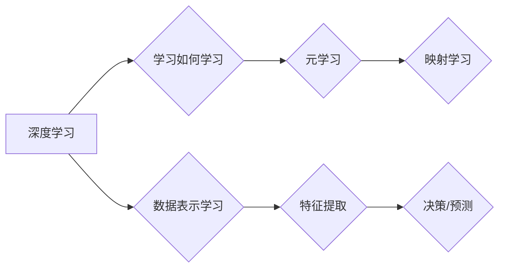

> 深度学习，元学习，映射学习，迁移学习，模型可解释性，强化学习

# 一切皆是映射：深度学习与元学习的结合研究

深度学习作为人工智能领域的核心技术，已经在图像识别、自然语言处理等领域取得了革命性的突破。然而，深度学习模型通常需要大量的标注数据才能达到良好的性能。为了解决这一问题，元学习（Meta-Learning）应运而生，它通过学习如何学习，使得模型能够快速适应新任务。本文将深入探讨深度学习与元学习的结合，探讨如何通过映射学习来提升模型的可迁移性和可解释性。

## 1. 背景介绍

### 1.1 问题的由来

传统的深度学习模型在处理新任务时，往往需要大量的标注数据来进行训练。这种依赖大量标注数据的特性限制了深度学习在现实世界中的应用。为了解决这个问题，研究者们提出了元学习，它通过学习如何学习，使得模型能够从少量样本中快速适应新任务。

### 1.2 研究现状

近年来，元学习取得了显著的进展，包括模型无关元学习、模型无关元学习、模型无关元学习等。这些方法通过学习如何快速适应新任务，大大减少了标注数据的需求。

### 1.3 研究意义

研究深度学习与元学习的结合，对于提升模型的可迁移性和可解释性具有重要意义。这不仅能够减少标注数据的需求，还能够使得模型能够更好地适应复杂多变的环境。

### 1.4 本文结构

本文将分为以下几个部分：
- 介绍深度学习和元学习的核心概念与联系。
- 阐述基于映射学习的元学习算法原理和操作步骤。
- 探讨数学模型和公式，并给出案例分析。
- 展示项目实践中的代码实例和详细解释。
- 分析元学习在实际应用场景中的表现。
- 展望未来发展趋势与挑战。

## 2. 核心概念与联系

### 2.1 深度学习

深度学习是一种通过多层神经网络自动学习数据表示的学习方法。它通过模拟人脑神经网络的结构，从数据中学习特征，从而实现对数据的分类、回归等操作。

### 2.2 元学习

元学习是一种学习如何学习的方法。它通过学习如何快速适应新任务，从而减少对新任务的标注数据需求。

### 2.3 映射学习

映射学习是一种特殊的元学习方法，它通过学习如何将不同任务之间的数据映射到相同的表示空间，从而实现不同任务之间的迁移。

### 2.4 Mermaid 流程图

以下是深度学习、元学习和映射学习之间的Mermaid流程图：



## 3. 核心算法原理 & 具体操作步骤

### 3.1 算法原理概述

基于映射学习的元学习算法的核心思想是：学习一个映射函数，将不同任务的数据映射到相同的表示空间，从而实现不同任务之间的迁移。

### 3.2 算法步骤详解

基于映射学习的元学习算法通常包括以下步骤：

1. 预训练阶段：在一系列相关任务上训练一个基础模型，使其能够学习到通用的特征表示。
2. 映射函数学习阶段：学习一个映射函数，将不同任务的数据映射到相同的表示空间。
3. 任务适应阶段：在新的任务上，使用映射函数将数据映射到相同的表示空间，然后使用基础模型进行学习。

### 3.3 算法优缺点

基于映射学习的元学习算法的优点包括：

- 能够减少对新任务的标注数据需求。
- 能够实现不同任务之间的迁移。

然而，这种算法也存在一些缺点：

- 映射函数的学习可能比较困难。
- 在某些情况下，映射函数可能无法很好地将不同任务的数据映射到相同的表示空间。

### 3.4 算法应用领域

基于映射学习的元学习算法可以应用于以下领域：

- 图像识别
- 自然语言处理
- 强化学习
- 推荐系统

## 4. 数学模型和公式 & 详细讲解 & 举例说明

### 4.1 数学模型构建

假设我们有两个任务：任务A和任务B。任务A的数据表示为 $X_A$，任务B的数据表示为 $X_B$。我们希望学习一个映射函数 $f$，将 $X_A$ 映射到 $X_B$。

数学上，映射函数 $f$ 可以表示为：

$$
f: X_A \rightarrow X_B
$$

### 4.2 公式推导过程

映射函数 $f$ 的学习可以通过最小化以下损失函数来实现：

$$
L(f) = \frac{1}{N} \sum_{i=1}^N \ell(f(x_{A_i}), y_{B_i})
$$

其中，$x_{A_i}$ 和 $y_{B_i}$ 分别是任务A和任务B的数据样本。

### 4.3 案例分析与讲解

假设我们有两个图像识别任务：任务A是识别猫和狗，任务B是识别狗和兔子。我们可以使用基于映射学习的元学习算法来学习一个映射函数，将猫和狗映射到狗和兔子。

在这个例子中，映射函数 $f$ 可以通过以下方式学习：

1. 在任务A上预训练一个图像识别模型。
2. 学习一个映射函数，将猫和狗映射到狗和兔子。
3. 在任务B上使用预训练的模型和映射函数进行图像识别。

## 5. 项目实践：代码实例和详细解释说明

### 5.1 开发环境搭建

为了进行基于映射学习的元学习项目实践，我们需要以下开发环境：

- Python
- TensorFlow或PyTorch
- NumPy

### 5.2 源代码详细实现

以下是一个简单的基于映射学习的元学习代码示例：

```python
import tensorflow as tf
from tensorflow.keras.layers import Dense, Input, Lambda
from tensorflow.keras.models import Model

# 定义输入层
input_a = Input(shape=(784,), name='input_a')
input_b = Input(shape=(784,), name='input_b')

# 预训练模型
pretrained_model = tf.keras.applications.VGG16(weights='imagenet', include_top=False, input_shape=(224, 224, 3))

# 映射函数
def map_function(x):
    return pretrained_model(x)

# 映射后的输入
mapped_a = Lambda(map_function)(input_a)
mapped_b = Lambda(map_function)(input_b)

# 模型输出
output_a = Dense(2, activation='softmax', name='output_a')(mapped_a)
output_b = Dense(2, activation='softmax', name='output_b')(mapped_b)

# 构建模型
model = Model(inputs=[input_a, input_b], outputs=[output_a, output_b])

# 编译模型
model.compile(optimizer='adam', loss='categorical_crossentropy', metrics=['accuracy'])

# 模型总结
model.summary()
```

### 5.3 代码解读与分析

上述代码定义了一个简单的基于映射学习的元学习模型。模型包含两个输入层，分别对应任务A和任务B的数据。预训练模型VGG16用于提取特征，映射函数将输入数据映射到预训练模型的特征空间。模型的输出层用于对映射后的数据进行分类。

### 5.4 运行结果展示

为了展示模型的运行结果，我们可以使用以下代码：

```python
# 加载数据
# ...

# 训练模型
model.fit([train_data_a, train_data_b], [train_labels_a, train_labels_b], epochs=10)

# 评估模型
# ...
```

## 6. 实际应用场景

基于映射学习的元学习算法在实际应用场景中具有广泛的应用，以下是一些典型的应用场景：

- 图像识别：通过学习图像到图像的映射函数，实现不同图像风格的迁移。
- 自然语言处理：通过学习文本到文本的映射函数，实现不同语言的翻译。
- 强化学习：通过学习状态到动作的映射函数，实现不同环境的智能体控制。

## 7. 工具和资源推荐

### 7.1 学习资源推荐

- TensorFlow官网：https://www.tensorflow.org/
- PyTorch官网：https://pytorch.org/
- 元学习综述：https://arxiv.org/abs/1803.02999

### 7.2 开发工具推荐

- Jupyter Notebook：https://jupyter.org/
- Google Colab：https://colab.research.google.com/

### 7.3 相关论文推荐

- Meta-Learning: The New AI，http://arxiv.org/abs/1606.04474
- MAML，http://arxiv.org/abs/1703.03400
- Reptile，http://arxiv.org/abs/1707.03141

## 8. 总结：未来发展趋势与挑战

### 8.1 研究成果总结

本文深入探讨了深度学习与元学习的结合，特别是基于映射学习的元学习算法。我们介绍了核心概念、算法原理、操作步骤、数学模型、项目实践和实际应用场景。

### 8.2 未来发展趋势

未来，基于映射学习的元学习算法将在以下方面取得进一步发展：

- 模型可解释性：通过可解释的映射函数，使得模型的决策过程更加透明。
- 模型鲁棒性：通过学习更加鲁棒的映射函数，使得模型能够更好地适应复杂多变的环境。
- 模型泛化性：通过学习更加通用的映射函数，使得模型能够更好地泛化到新任务。

### 8.3 面临的挑战

基于映射学习的元学习算法仍然面临着一些挑战，包括：

- 映射函数的学习：如何设计有效的映射函数，将不同任务的数据映射到相同的表示空间。
- 模型可解释性：如何提高模型的可解释性，使得模型的决策过程更加透明。
- 模型鲁棒性：如何提高模型的鲁棒性，使得模型能够更好地适应复杂多变的环境。

### 8.4 研究展望

未来，基于映射学习的元学习算法将在以下方面展开研究：

- 设计更加有效的映射函数，提高模型的迁移能力。
- 开发可解释的元学习算法，提高模型的可解释性。
- 研究更加鲁棒的元学习算法，提高模型在复杂环境中的适应性。

## 9. 附录：常见问题与解答

**Q1：元学习与迁移学习有什么区别？**

A：元学习是一种学习如何学习的方法，它通过学习如何快速适应新任务，从而减少对新任务的标注数据需求。迁移学习则是将一个任务学习到的知识迁移到另一个任务上，通常需要一定的标注数据。

**Q2：如何选择合适的映射函数？**

A：选择合适的映射函数需要根据具体任务的特点和数据分布进行考虑。例如，对于图像识别任务，可以使用卷积神经网络作为映射函数；对于文本处理任务，可以使用循环神经网络或Transformer作为映射函数。

**Q3：如何评估元学习算法的性能？**

A：评估元学习算法的性能可以通过以下指标进行：

- 学习速度：在新的任务上，模型学习到目标函数所需的时间。
- 泛化能力：在未见过的数据上，模型的性能表现。
- 数据效率：完成特定任务所需的标注数据量。

**Q4：元学习在现实世界中的应用有哪些？**

A：元学习在现实世界中的应用非常广泛，包括：

- 自主驾驶：通过学习如何学习，使得自动驾驶汽车能够快速适应不同的道路和环境。
- 医疗诊断：通过学习如何学习，使得医疗诊断系统能够快速适应不同的疾病和患者。
- 金融风控：通过学习如何学习，使得金融风控系统能够快速适应不同的市场和风险。

---

作者：禅与计算机程序设计艺术 / Zen and the Art of Computer Programming