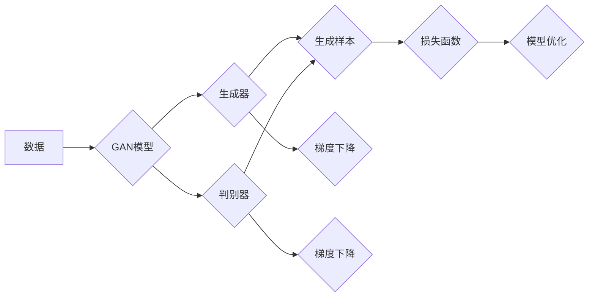

> 生成对抗网络 (GAN), 对抗学习, 无监督学习, 图像生成, 自然语言处理, 迁移学习, 图像风格转换, 图像超分辨率, 生成模型

# 一切皆是映射：生成对抗网络(GAN)及其应用探索

> 关键词：生成对抗网络 (GAN), 对抗学习, 无监督学习, 图像生成, 自然语言处理, 迁移学习, 图像风格转换, 图像超分辨率, 生成模型

## 1. 背景介绍

生成对抗网络（GAN）是一种强大的深度学习模型，自2014年由Ian Goodfellow等人提出以来，它已经在图像生成、自然语言处理、音频合成等多个领域取得了显著的成果。GAN的核心思想是通过两个神经网络——生成器和判别器——之间的对抗性训练来生成高质量的数据样本。本文将深入探讨GAN的核心概念、算法原理、应用实例以及未来发展趋势。

### 1.1 问题的由来

在深度学习中，生成模型旨在学习数据分布，并生成与训练数据分布相似的新数据。传统的生成模型，如高斯混合模型（Gaussian Mixture Model, GMM）和变分自编码器（Variational Autoencoder, VAE），往往在生成复杂数据分布时表现不佳。GAN的出现为解决这一难题提供了一种新的思路。

### 1.2 研究现状

GAN的研究和应用已经取得了显著的进展，尤其是在图像生成领域。目前，GAN已经在图像超分辨率、图像风格转换、图像去噪、视频生成等领域得到了广泛应用。同时，GAN也在自然语言处理领域展现了潜力，如文本生成、对话系统等。

### 1.3 研究意义

GAN的提出不仅为生成模型领域带来了新的活力，而且为解决许多实际问题提供了新的工具。GAN在图像生成、数据增强、异常检测等领域具有广泛的应用前景。

### 1.4 本文结构

本文将按照以下结构进行讨论：

- 第2章将介绍GAN的核心概念与联系。
- 第3章将详细阐述GAN的算法原理和具体操作步骤。
- 第4章将讲解GAN的数学模型和公式，并通过案例进行分析。
- 第5章将提供一个GAN的项目实践实例。
- 第6章将探讨GAN在实际应用场景中的案例。
- 第7章将推荐相关学习资源和开发工具。
- 第8章将总结GAN的研究成果和未来发展趋势。
- 第9章将提供常见问题与解答。

## 2. 核心概念与联系

### 2.1 Mermaid 流程图



### 2.2 核心概念

- **生成器 (Generator)**：生成器是GAN中负责生成新数据的模型。它的目标是生成与真实数据分布相似的样本。
- **判别器 (Discriminator)**：判别器是GAN中负责判断给定样本是否为真实样本的模型。它的目标是区分真实样本和生成样本。
- **对抗性训练 (Adversarial Training)**：生成器和判别器通过对抗性训练相互竞争，生成器和判别器都试图在对方面前取得优势。
- **损失函数 (Loss Function)**：损失函数用于衡量生成样本与真实样本之间的差异，以及判别器对真实样本和生成样本的判断能力。

## 3. 核心算法原理 & 具体操作步骤

### 3.1 算法原理概述

GAN的原理基于两个神经网络：生成器和判别器。生成器的目标是生成数据，而判别器的目标是区分真实数据和生成数据。两个网络在对抗性训练中相互竞争，直到生成器生成的数据难以被判别器区分。

### 3.2 算法步骤详解

1. 初始化生成器和判别器，并随机初始化生成样本。
2. 判别器尝试区分真实样本和生成样本，并计算损失函数。
3. 生成器根据损失函数的梯度更新参数，生成更难以区分的样本。
4. 重复步骤2和3，直到生成器生成的样本与真实样本难以区分。

### 3.3 算法优缺点

#### 优点

- GAN可以生成高质量的数据样本，尤其是在图像生成领域。
- GAN可以应用于无监督学习，无需标注数据。
- GAN可以生成多样化的数据样本。

#### 缺点

- GAN的训练不稳定，容易陷入局部最优解。
- GAN的生成样本可能存在模式崩溃（mode collapse）的问题。
- GAN的生成样本可能存在与真实数据分布不一致的问题。

### 3.4 算法应用领域

GAN在以下领域有广泛的应用：

- 图像生成：如艺术作品、照片、漫画等。
- 图像处理：如图像超分辨率、图像去噪、图像风格转换等。
- 自然语言处理：如文本生成、对话系统等。
- 音频合成：如音乐、语音等。

## 4. 数学模型和公式 & 详细讲解 & 举例说明

### 4.1 数学模型构建

GAN的数学模型可以表示为：

$$
\begin{align*}
\text{生成器: } G(z) &\sim P_G(z) \\
\text{判别器: } D(x) &\in [0, 1]
\end{align*}
$$

其中，$z$ 是生成器的输入，$x$ 是生成的样本，$P_G(z)$ 是生成器的先验分布，$P_X(x)$ 是真实数据分布，$D(x)$ 是判别器的输出。

### 4.2 公式推导过程

GAN的训练过程可以通过以下步骤进行：

1. 对于一组随机噪声 $z$，生成器 $G(z)$ 生成一个样本 $x$。
2. 判别器 $D(x)$ 和 $D(G(z))$ 分别对真实样本 $x$ 和生成样本 $G(z)$ 进行判断。
3. 计算判别器的损失函数：

$$
L_D = -\frac{1}{N}\sum_{i=1}^N [D(x_i) - 1] - \frac{1}{N}\sum_{i=1}^N D(G(z_i))
$$

其中，$N$ 是样本数量。

4. 计算生成器的损失函数：

$$
L_G = \frac{1}{N}\sum_{i=1}^N D(G(z_i))
$$

5. 使用反向传播算法更新生成器和判别器的参数。

### 4.3 案例分析与讲解

以下是一个简单的GAN示例，用于生成手写数字。

```python
import torch
import torch.nn as nn

# 生成器
class Generator(nn.Module):
    def __init__(self):
        super(Generator, self).__init__()
        self.main = nn.Sequential(
            nn.Linear(100, 256),
            nn.LeakyReLU(0.2, inplace=True),
            nn.Linear(256, 512),
            nn.LeakyReLU(0.2, inplace=True),
            nn.Linear(512, 1024),
            nn.LeakyReLU(0.2, inplace=True),
            nn.Linear(1024, 784),
            nn.Tanh()
        )

    def forward(self, input):
        return self.main(input)

# 判别器
class Discriminator(nn.Module):
    def __init__(self):
        super(Discriminator, self).__init__()
        self.main = nn.Sequential(
            nn.Linear(784, 512),
            nn.LeakyReLU(0.2, inplace=True),
            nn.Linear(512, 256),
            nn.LeakyReLU(0.2, inplace=True),
            nn.Linear(256, 1),
            nn.Sigmoid()
        )

    def forward(self, input):
        x = torch.flatten(input, 1)
        validity = self.main(x)
        return validity

# 训练过程
for epoch in range(epochs):
    # 生成样本
    z = torch.randn(BATCH_SIZE, 100)
    generated_images = generator(z)

    # 计算判别器的损失
    real_validity = discriminator(real_images)
    fake_validity = discriminator(generated_images.detach())

    d_loss = -torch.mean(real_validity) + torch.mean(fake_validity)

    # 计算生成器的损失
    g_loss = -torch.mean(fake_validity)

    # 反向传播
    d_optimizer.zero_grad()
    d_loss.backward()
    d_optimizer.step()

    g_optimizer.zero_grad()
    g_loss.backward()
    g_optimizer.step()
```

在这个示例中，生成器生成手写数字，判别器判断生成的数字是否真实。通过不断训练，生成器将学会生成更加逼真的手写数字。

## 5. 项目实践：代码实例和详细解释说明

### 5.1 开发环境搭建

为了进行GAN的项目实践，需要以下环境：

- Python 3.6及以上版本
- PyTorch 1.0及以上版本
- NumPy 1.16及以上版本

### 5.2 源代码详细实现

以下是一个简单的GAN示例，用于生成手写数字。

```python
# ... (省略导入和模型定义)

# 训练过程
for epoch in range(epochs):
    # ... (省略生成样本和计算损失的代码)

    # ... (省略反向传播和优化器的步骤)

    # 打印训练进度
    print(f"Epoch {epoch}, D Loss: {d_loss.item()}, G Loss: {g_loss.item()}")
```

### 5.3 代码解读与分析

在这个示例中，我们首先定义了生成器和判别器模型。生成器通过一个全连接层和一个LeakyReLU激活函数生成手写数字。判别器通过一个全连接层和一个Sigmoid激活函数判断生成的数字是否真实。

在训练过程中，我们首先生成一组随机噪声 $z$，然后生成生成样本 $G(z)$。接着，我们计算判别器对真实样本和生成样本的判断结果，并计算损失函数。最后，我们使用反向传播算法更新生成器和判别器的参数。

### 5.4 运行结果展示

通过运行上述代码，我们可以在训练过程中观察到生成器生成的手写数字逐渐变得更加逼真。最终，生成器可以生成与真实手写数字非常相似的结果。

## 6. 实际应用场景

### 6.1 图像生成

GAN在图像生成领域有着广泛的应用，如艺术作品生成、照片修复、视频生成等。

### 6.2 图像处理

GAN在图像处理领域也有着重要的应用，如图像超分辨率、图像去噪、图像风格转换等。

### 6.3 自然语言处理

GAN在自然语言处理领域也有着潜在的应用，如文本生成、对话系统等。

## 7. 工具和资源推荐

### 7.1 学习资源推荐

- GAN的官方论文：https://arxiv.org/abs/1406.2661
- GAN教程：https://arxiv.org/abs/1801.00996
- PyTorch GAN教程：https://pytorch.org/tutorials/beginner/dcgan_tutorial.html

### 7.2 开发工具推荐

- PyTorch：https://pytorch.org/
- TensorFlow：https://www.tensorflow.org/

### 7.3 相关论文推荐

- Unsupervised Representation Learning with Deep Convolutional Generative Adversarial Networks：https://arxiv.org/abs/1511.06434
- Improved Generative Adversarial Models：https://arxiv.org/abs/1606.03498
- Unpaired Image-to-Image Translation using Cycle-Consistent Adversarial Networks：https://arxiv.org/abs/1703.10593

## 8. 总结：未来发展趋势与挑战

### 8.1 研究成果总结

GAN自提出以来，已经在多个领域取得了显著的成果。它为生成模型提供了一种新的思路，并推动了图像生成、图像处理、自然语言处理等领域的发展。

### 8.2 未来发展趋势

未来GAN的发展趋势包括：

- 开发更加稳定和高效的GAN模型。
- 将GAN应用于更多领域，如医学图像生成、音频生成等。
- 研究GAN的可解释性和安全性。

### 8.3 面临的挑战

GAN面临的挑战包括：

- 训练不稳定，容易陷入局部最优解。
- 模式崩溃问题，生成样本缺乏多样性。
- 与真实数据分布不一致的问题。

### 8.4 研究展望

随着研究的深入，GAN将在更多领域发挥重要作用。未来，GAN的研究将更加注重模型的稳定性、多样性和可解释性，并与其他技术进行融合，为构建更加智能和高效的系统做出贡献。

## 9. 附录：常见问题与解答

### 9.1 常见问题

**Q1：GAN是如何工作的？**

A1：GAN通过两个神经网络——生成器和判别器——之间的对抗性训练来生成高质量的数据样本。生成器尝试生成与真实数据分布相似的样本，而判别器尝试区分真实样本和生成样本。

**Q2：GAN有哪些应用？**

A2：GAN在图像生成、图像处理、自然语言处理等领域有广泛的应用。

**Q3：GAN的训练为什么那么困难？**

A3：GAN的训练困难主要因为训练不稳定，容易陷入局部最优解，以及可能出现的模式崩溃问题。

**Q4：GAN如何克服模式崩溃问题？**

A4：可以通过增加生成器的容量、引入额外的约束条件、使用不同的训练技巧等方法来克服模式崩溃问题。

**Q5：GAN与VAE有什么区别？**

A5：GAN和VAE都是生成模型，但它们的工作原理和目标不同。VAE的目标是学习数据分布，并生成与真实数据分布相似的样本，而GAN的目标是通过对抗性训练生成高质量的数据样本。

### 9.2 解答

**A1**：GAN通过两个神经网络——生成器和判别器——之间的对抗性训练来生成高质量的数据样本。生成器尝试生成与真实数据分布相似的样本，而判别器尝试区分真实样本和生成样本。

**A2**：GAN在图像生成、图像处理、自然语言处理等领域有广泛的应用。

**A3**：GAN的训练困难主要因为训练不稳定，容易陷入局部最优解，以及可能出现的模式崩溃问题。

**A4**：可以通过增加生成器的容量、引入额外的约束条件、使用不同的训练技巧等方法来克服模式崩溃问题。

**A5**：VAE的目标是学习数据分布，并生成与真实数据分布相似的样本，而GAN的目标是通过对抗性训练生成高质量的数据样本。

---

作者：禅与计算机程序设计艺术 / Zen and the Art of Computer Programming