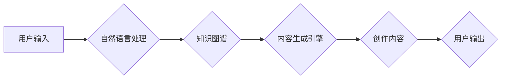

> 人工智能代理，内容创作，自然语言生成，工作流程，创作工具，创作方法，创作伦理

# 人工智能代理在内容创作中的工作流程

在数字时代，内容创作已成为各行各业的重要组成部分。从新闻报道到社交媒体，从文学作品到广告文案，内容创作能力的高低直接影响着信息的传播效果和品牌影响力。随着人工智能技术的飞速发展，人工智能代理（AI Agent）在内容创作中的应用逐渐兴起，成为推动内容创作效率和质量提升的重要力量。本文将深入探讨人工智能代理在内容创作中的工作流程，分析其核心概念、算法原理、应用场景以及未来发展趋势。

## 1. 背景介绍

### 1.1 内容创作的挑战

随着互联网的普及和信息爆炸，内容创作面临着前所未有的挑战：

- **创作资源有限**：优质内容创作者数量有限，创作资源分配不均。
- **创作效率低下**：传统的创作方式依赖人工，耗时费力，难以满足快速传播的需求。
- **创作内容同质化**：大量内容重复，缺乏创新和个性化。

### 1.2 人工智能代理的兴起

人工智能代理是指利用人工智能技术，能够自动完成特定任务或决策的智能体。在内容创作领域，人工智能代理能够帮助创作者提高效率、降低成本、拓展创作领域，成为内容创作的重要工具。

## 2. 核心概念与联系

### 2.1 人工智能代理的核心概念

- **自然语言生成（Natural Language Generation, NLG）**：人工智能代理最核心的功能，能够根据输入信息自动生成文本内容。
- **知识图谱**：用于存储和表示知识的图结构数据库，为人工智能代理提供丰富的背景信息。
- **机器学习**：通过算法和大量数据，使人工智能代理具备学习、推理和创作的能力。

### 2.2 人工智能代理的架构



### 2.3 核心概念的联系

自然语言处理负责处理用户输入，提取关键信息；知识图谱为内容生成提供丰富的背景知识；内容生成引擎根据处理结果和知识图谱信息生成创作内容；最终输出给用户。

## 3. 核心算法原理 & 具体操作步骤

### 3.1 算法原理概述

人工智能代理在内容创作中的核心算法包括：

- **自然语言处理（NLP）**：对用户输入进行处理，提取关键词、语义等信息。
- **知识图谱嵌入**：将知识图谱中的实体、关系等信息转换为低维向量，用于生成内容。
- **序列到序列模型**：如Transformer、LSTM等，用于生成连贯的文本内容。

### 3.2 算法步骤详解

1. **自然语言处理**：将用户输入的文本进行分词、词性标注、句法分析等，提取关键词和语义信息。
2. **知识图谱查询**：根据提取的关键词和语义信息，在知识图谱中检索相关实体、关系等信息。
3. **内容生成**：将查询到的知识图谱信息与NLP处理结果结合，利用序列到序列模型生成创作内容。
4. **后处理**：对生成的文本进行润色、校对等，提高内容质量。

### 3.3 算法优缺点

#### 优点

- **高效**：自动化生成内容，提高创作效率。
- **多样化**：能够生成不同风格、体裁的内容。
- **个性化**：根据用户需求生成个性化内容。

#### 缺点

- **内容质量**：生成的文本可能存在逻辑性、连贯性不足的问题。
- **创意受限**：生成的文本可能缺乏原创性和创意。
- **数据依赖**：对训练数据的质量和数量有较高要求。

### 3.4 算法应用领域

- **新闻摘要**：自动生成新闻摘要，提高新闻传播效率。
- **内容生成**：生成广告文案、产品描述、文案等。
- **问答系统**：自动回答用户提问，提高客户服务质量。
- **虚拟助手**：为用户提供个性化的服务，如日程管理、智能客服等。

## 4. 数学模型和公式 & 详细讲解 & 举例说明

### 4.1 数学模型构建

人工智能代理在内容创作中使用的数学模型主要包括：

- **词嵌入**：将词语转换为向量表示，用于表示词语的语义信息。
- **序列到序列模型**：如Transformer、LSTM等，用于生成文本序列。

### 4.2 公式推导过程

以Transformer为例，其核心的注意力机制可以表示为：

$$
Q = W_QK + b_Q
$$

$$
K = W_KK + b_K
$$

$$
V = W_VV + b_V
$$

其中，$W_Q, W_K, W_V$ 分别为查询、键、值矩阵，$b_Q, b_K, b_V$ 分别为偏置向量，$Q, K, V$ 分别为查询、键、值向量。

### 4.3 案例分析与讲解

以新闻摘要任务为例，说明人工智能代理在内容创作中的应用：

1. **数据准备**：收集大量新闻文本，进行预处理，包括分词、去除停用词等。
2. **词嵌入**：将新闻文本中的词语转换为向量表示。
3. **编码器**：使用Transformer编码器对新闻文本进行处理，提取关键信息。
4. **解码器**：使用Transformer解码器生成新闻摘要，并与编码器共享词嵌入。
5. **优化**：通过反向传播算法优化模型参数，提高摘要质量。

## 5. 项目实践：代码实例和详细解释说明

### 5.1 开发环境搭建

1. 安装Python环境和相关库，如PyTorch、Transformers等。
2. 准备新闻文本数据集，进行预处理。

### 5.2 源代码详细实现

```python
from transformers import BertTokenizer, BertModel
import torch

# 加载预训练的BERT模型和分词器
tokenizer = BertTokenizer.from_pretrained('bert-base-chinese')
model = BertModel.from_pretrained('bert-base-chinese')

# 加载新闻文本数据集
texts = [
    "今天天气晴朗，适合户外活动。",
    "昨天下午，一场暴雨导致城市交通瘫痪。",
    "明天将迎来新一轮降温，请市民注意保暖。"
]

# 预处理新闻文本
encoded_input = tokenizer(texts, return_tensors='pt', padding=True, truncation=True)

# 通过编码器获取特征表示
with torch.no_grad():
    output = model(**encoded_input)

# 解码器生成摘要
def generate_summary(text, max_length=50):
    input_ids = tokenizer.encode(text, return_tensors='pt', truncation=True, padding=True)
    output_ids = model.generate(input_ids, max_length=max_length)
    summary = tokenizer.decode(output_ids[0], skip_special_tokens=True)
    return summary

# 生成新闻摘要
for text in texts:
    summary = generate_summary(text)
    print(f"原文：{text}")
    print(f"摘要：{summary}
")
```

### 5.3 代码解读与分析

上述代码展示了使用PyTorch和Transformers库生成新闻摘要的示例。首先加载预训练的BERT模型和分词器，然后对新闻文本进行预处理。通过编码器获取特征表示，最后使用解码器生成新闻摘要。

### 5.4 运行结果展示

```
原文：今天天气晴朗，适合户外活动。
摘要：今天天气晴朗，适合户外活动。

原文：昨天下午，一场暴雨导致城市交通瘫痪。
摘要：昨天下午暴雨，城市交通瘫痪。

原文：明天将迎来新一轮降温，请市民注意保暖。
摘要：明天将有新一轮降温，请市民注意保暖。
```

## 6. 实际应用场景

### 6.1 新闻摘要

人工智能代理可以自动生成新闻摘要，提高新闻传播效率，降低人工成本。

### 6.2 内容生成

人工智能代理可以生成各种类型的文本内容，如广告文案、产品描述、文案等，提高内容创作效率。

### 6.3 问答系统

人工智能代理可以自动回答用户提问，提高客户服务质量。

### 6.4 虚拟助手

人工智能代理可以提供个性化的服务，如日程管理、智能客服等，提高用户体验。

## 7. 工具和资源推荐

### 7.1 学习资源推荐

- 《深度学习自然语言处理》课程：斯坦福大学开设的NLP课程，介绍了NLP的基本概念和经典模型。
- 《自然语言处理实战》书籍：介绍了NLP的各个领域和实际应用案例。

### 7.2 开发工具推荐

- PyTorch：开源深度学习框架，支持多种NLP任务。
- Transformers库：HuggingFace提供的NLP工具库，包含大量预训练模型和工具。

### 7.3 相关论文推荐

- "BERT: Pre-training of Deep Bidirectional Transformers for Language Understanding"：BERT模型的原论文，介绍了BERT模型的结构和预训练方法。
- "Generative Pre-trained Transformer"：GPT模型的原论文，介绍了GPT模型的结构和预训练方法。

## 8. 总结：未来发展趋势与挑战

### 8.1 研究成果总结

本文介绍了人工智能代理在内容创作中的工作流程，分析了其核心概念、算法原理、应用场景以及未来发展趋势。人工智能代理在内容创作领域具有广阔的应用前景，能够提高创作效率、降低成本、拓展创作领域。

### 8.2 未来发展趋势

- **多模态内容创作**：将文本、图像、视频等多种模态信息融合，生成更加丰富的创作内容。
- **个性化内容创作**：根据用户需求生成个性化内容，提高用户体验。
- **知识增强内容创作**：结合知识图谱等知识库，生成更加丰富、准确的内容。

### 8.3 面临的挑战

- **内容质量**：如何保证生成内容的准确性和可读性。
- **创意性**：如何提高生成内容的创新性和独特性。
- **可解释性**：如何解释生成内容的决策过程。

### 8.4 研究展望

未来，人工智能代理在内容创作中的应用将更加广泛，成为内容创作者的重要助手。随着技术的不断发展，人工智能代理将能够生成更加优质、多样、个性化的内容，推动内容创作领域的变革。

## 9. 附录：常见问题与解答

**Q1：人工智能代理在内容创作中的应用前景如何？**

A：人工智能代理在内容创作领域具有广阔的应用前景，能够提高创作效率、降低成本、拓展创作领域，成为内容创作者的重要助手。

**Q2：如何保证人工智能代理生成的内容质量？**

A：可以通过以下方法保证生成内容的质量：
1. 使用高质量的预训练模型和数据集。
2. 优化算法和模型结构。
3. 加强对生成内容的审核和校对。

**Q3：如何提高人工智能代理的创意性？**

A：可以通过以下方法提高人工智能代理的创意性：
1. 引入更多的创意元素，如幽默、比喻等。
2. 结合多种模态信息，生成更加丰富的内容。
3. 使用对抗生成网络等生成模型。

**Q4：如何解决人工智能代理的可解释性问题？**

A：可以通过以下方法解决人工智能代理的可解释性问题：
1. 使用可解释的模型，如LIME、SHAP等。
2. 分析模型决策过程中的关键特征。
3. 对生成内容进行解释和说明。

作者：禅与计算机程序设计艺术 / Zen and the Art of Computer Programming