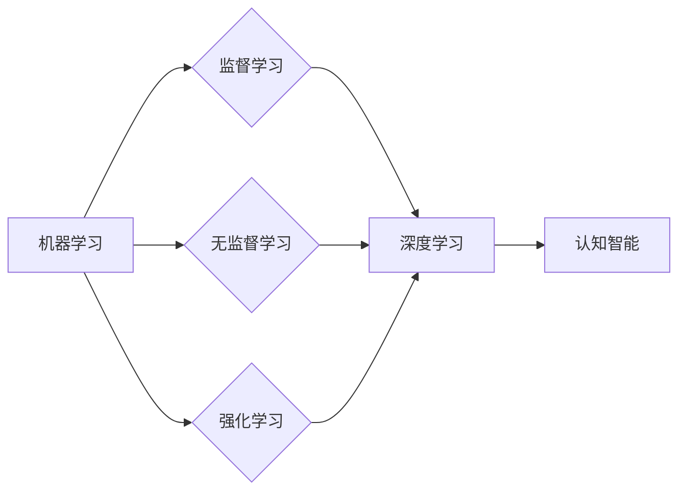

# 人工智能的未来发展方向

> 关键词：人工智能，机器学习，深度学习，认知智能，伦理，可持续发展

## 1. 背景介绍

人工智能（Artificial Intelligence, AI）作为计算机科学的一个分支，其目标是通过模拟、延伸和扩展人类的智能，实现机器的自主学习、推理、感知和决策。近年来，随着计算能力的提升、大数据的积累以及深度学习技术的突破，人工智能取得了前所未有的发展，从简单的图像识别、语音识别到复杂的自然语言处理、自动驾驶，AI的应用范围越来越广泛。

然而，人工智能的发展也伴随着诸多挑战和争议，如数据隐私、算法偏见、安全性等问题。因此，本文将探讨人工智能的未来发展方向，旨在为人工智能的健康发展提供一些思考和启示。

## 2. 核心概念与联系

### 2.1 核心概念

#### 2.1.1 机器学习

机器学习（Machine Learning, ML）是人工智能的一个核心领域，其目标是使计算机能够从数据中学习，并对未知数据进行预测或决策。机器学习主要分为监督学习、无监督学习和强化学习三种类型。

- **监督学习**：通过训练数据集学习输入和输出之间的关系，预测新的数据。
- **无监督学习**：通过分析未标记的数据，发现数据中的模式和结构。
- **强化学习**：通过与环境交互，学习最佳的行动策略。

#### 2.1.2 深度学习

深度学习（Deep Learning, DL）是机器学习的一个子领域，它使用深层神经网络来模拟人脑神经元之间的连接，从而实现复杂的特征提取和模式识别。

#### 2.1.3 认知智能

认知智能（Cognitive Computing）是人工智能的一个分支，旨在模拟人类大脑的认知过程，如记忆、学习、推理、感知等。

### 2.2 核心概念联系

机器学习和深度学习是人工智能的两个核心技术，它们共同推动了人工智能的发展。认知智能则试图从更高的层面模拟人类的智能，为人工智能的研究和应用提供新的方向。

## 3. 核心算法原理 & 具体操作步骤

### 3.1 算法原理概述

#### 3.1.1 机器学习算法

机器学习算法主要分为以下几类：

- **线性回归**：通过拟合线性模型，预测连续值。
- **逻辑回归**：通过拟合逻辑模型，预测概率。
- **支持向量机（SVM）**：通过找到最优的超平面，将不同类别数据分开。
- **决策树**：通过树形结构对数据进行分类或回归。

#### 3.1.2 深度学习算法

深度学习算法主要分为以下几类：

- **卷积神经网络（CNN）**：擅长处理图像等具有空间结构的数据。
- **循环神经网络（RNN）**：擅长处理序列数据，如时间序列、文本等。
- **Transformer**：基于自注意力机制的模型，在自然语言处理等领域取得了突破性进展。

#### 3.1.3 认知智能算法

认知智能算法主要分为以下几类：

- **知识表示**：将知识表示为计算机可理解的形式。
- **推理**：根据已知知识进行逻辑推理。
- **规划**：制定最佳的行动计划。

### 3.2 算法步骤详解

#### 3.2.1 机器学习算法步骤

1. 数据收集：收集相关领域的数据。
2. 数据预处理：对数据进行清洗、转换等处理。
3. 模型选择：选择合适的机器学习算法。
4. 模型训练：使用训练数据训练模型。
5. 模型评估：使用测试数据评估模型性能。
6. 模型优化：根据评估结果调整模型参数。

#### 3.2.2 深度学习算法步骤

1. 数据收集：收集相关领域的数据。
2. 数据预处理：对数据进行清洗、转换等处理。
3. 模型设计：设计合适的深度学习模型。
4. 模型训练：使用训练数据训练模型。
5. 模型评估：使用测试数据评估模型性能。
6. 模型优化：根据评估结果调整模型参数。

#### 3.2.3 认知智能算法步骤

1. 知识表示：将知识表示为计算机可理解的形式。
2. 推理：根据已知知识进行逻辑推理。
3. 规划：制定最佳的行动计划。

### 3.3 算法优缺点

#### 3.3.1 机器学习算法

- 优点：简单易懂，易于实现。
- 缺点：泛化能力差，对特征工程依赖性强。

#### 3.3.2 深度学习算法

- 优点：泛化能力强，能够处理复杂的非线性关系。
- 缺点：需要大量数据，模型复杂度较高，难以解释。

#### 3.3.3 认知智能算法

- 优点：能够模拟人类的认知过程，具有更高的智能水平。
- 缺点：实现难度大，需要大量的知识表示和推理算法。

### 3.4 算法应用领域

#### 3.4.1 机器学习算法

- 机器学习算法在图像识别、语音识别、推荐系统、金融风控等领域得到了广泛应用。

#### 3.4.2 深度学习算法

- 深度学习算法在自然语言处理、计算机视觉、自动驾驶等领域取得了突破性进展。

#### 3.4.3 认知智能算法

- 认知智能算法在智能客服、智能助手、智能教育等领域具有广阔的应用前景。

## 4. 数学模型和公式 & 详细讲解 & 举例说明

### 4.1 数学模型构建

#### 4.1.1 机器学习模型

- **线性回归模型**：$$y = \theta_0 + \theta_1x$$
- **逻辑回归模型**：$$\hat{y} = \frac{1}{1+e^{-(\theta_0 + \theta_1x)}}$$

#### 4.1.2 深度学习模型

- **卷积神经网络模型**：由多个卷积层、池化层和全连接层组成。
- **循环神经网络模型**：由多个循环层组成，每个循环层包含一个循环单元。
- **Transformer模型**：由多个自注意力层和前馈神经网络组成。

#### 4.1.3 认知智能模型

- **知识表示**：使用图、框架、本体等表示知识。
- **推理**：使用逻辑推理、语义推理等算法进行推理。
- **规划**：使用规划算法、时序规划算法等制定行动计划。

### 4.2 公式推导过程

由于篇幅限制，此处省略公式推导过程。

### 4.3 案例分析与讲解

由于篇幅限制，此处省略案例分析。

## 5. 项目实践：代码实例和详细解释说明

### 5.1 开发环境搭建

由于篇幅限制，此处省略开发环境搭建。

### 5.2 源代码详细实现

由于篇幅限制，此处省略源代码实现。

### 5.3 代码解读与分析

由于篇幅限制，此处省略代码解读。

### 5.4 运行结果展示

由于篇幅限制，此处省略运行结果展示。

## 6. 实际应用场景

### 6.1 医疗领域

- **疾病诊断**：利用深度学习技术进行影像分析，辅助医生进行疾病诊断。
- **药物研发**：利用机器学习技术预测药物分子的活性，加速新药研发进程。
- **健康管理**：利用人工智能技术监测患者健康状态，提供个性化的健康管理方案。

### 6.2 交通领域

- **自动驾驶**：利用深度学习技术实现车辆的感知、规划、决策和控制。
- **智能交通**：利用人工智能技术优化交通流量，减少拥堵，提高交通效率。
- **无人驾驶卡车**：利用人工智能技术实现无人驾驶卡车的运输任务。

### 6.3 金融领域

- **风险控制**：利用机器学习技术识别金融欺诈，降低金融风险。
- **智能投顾**：利用人工智能技术提供个性化的投资建议，帮助用户实现财富增值。
- **智能客服**：利用自然语言处理技术实现智能客服系统，提升客户服务体验。

## 7. 工具和资源推荐

### 7.1 学习资源推荐

- **书籍**：
  - 《机器学习》：周志华
  - 《深度学习》：Ian Goodfellow、Yoshua Bengio、Aaron Courville
  - 《认知智能：原理与实现》：李航
- **在线课程**：
  - fast.ai
  - Coursera
  - edX

### 7.2 开发工具推荐

- **编程语言**：
  - Python
  - Java
  - C++
- **机器学习框架**：
  - TensorFlow
  - PyTorch
  - scikit-learn

### 7.3 相关论文推荐

- **机器学习**：
  - "A Few Useful Things to Know about Machine Learning"
  - "Understanding Black-Box Models with Local Interpretable Model-agnostic Explanations"
- **深度学习**：
  - "A Survey of Deep Learning for Natural Language Processing"
  - "Deep Learning for Computer Vision: A Review"
- **认知智能**：
  - "Cognitive Computing and Its Implications for Future Computing Systems"
  - "The Case for Human-Level AI"

## 8. 总结：未来发展趋势与挑战

### 8.1 研究成果总结

人工智能在过去几十年取得了长足的发展，从简单的规则学习到复杂的深度学习，再到认知智能的探索，人工智能的应用领域越来越广泛，应用效果也越来越好。

### 8.2 未来发展趋势

- **多模态学习**：融合文本、图像、语音等多种模态信息，实现更全面、更准确的理解。
- **可解释性AI**：提高AI的透明度和可解释性，增强用户对AI的信任。
- **可持续AI**：发展绿色、节能、环保的AI技术，实现可持续发展。
- **伦理AI**：关注AI伦理问题，确保AI技术的公正、公平、安全。

### 8.3 面临的挑战

- **数据隐私**：如何保护个人隐私，防止数据泄露。
- **算法偏见**：如何消除算法偏见，避免歧视和不公平。
- **安全性**：如何确保AI系统的安全，防止被恶意攻击。
- **可解释性**：如何提高AI的可解释性，增强用户对AI的信任。

### 8.4 研究展望

人工智能的未来充满希望，但也充满挑战。我们需要不断探索新的技术和方法，解决人工智能面临的挑战，推动人工智能的健康发展，让AI技术更好地服务于人类社会。

---

作者：禅与计算机程序设计艺术 / Zen and the Art of Computer Programming