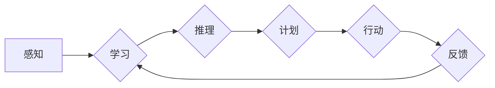

# 从混沌到简洁的认知之旅

> 关键词：认知计算，混沌理论，模式识别，机器学习，深度学习，信息简化和复杂性

## 1. 背景介绍

在计算机科学和人工智能领域，我们经常面临着如何从复杂多变的现实世界中提取有用信息，并将其转化为计算机可以理解和处理的模型的问题。这个过程，本质上是关于如何从混沌中寻找秩序，如何从复杂中提取简洁。本文将探讨认知计算、混沌理论和机器学习等领域，旨在理解如何通过简洁的方式来处理复杂问题，并展望未来在简化复杂性方面的研究方向。

### 1.1 认知计算的兴起

随着人工智能技术的飞速发展，认知计算成为了一个热门的研究领域。认知计算试图模仿人脑的信息处理过程，通过模拟人类认知的各个层面，如感知、学习、推理、计划和语言理解等，来构建更加智能的机器系统。

### 1.2 混沌理论的启示

混沌理论研究表明，在非线性系统中，即使是非常小的初始条件差异也会导致长期行为的巨大差异。这表明，复杂系统中的行为往往难以预测，但同时也暗示了存在某种潜在的秩序和模式。

### 1.3 机器学习的崛起

机器学习，特别是深度学习，为处理复杂问题提供了强大的工具。通过学习大量数据中的模式和规律，机器学习模型能够从混沌中提取简洁的表示，从而预测新数据的行为。

## 2. 核心概念与联系

### 2.1 认知计算

认知计算的核心概念包括：

- **感知**：模拟人类感官系统，如视觉、听觉、触觉等。
- **学习**：通过经验改进模型，如监督学习、无监督学习、强化学习等。
- **推理**：基于现有知识和经验进行逻辑推理。
- **计划**：根据目标制定行动方案。
- **语言理解**：理解人类语言，进行自然语言处理。

### 2.2 混沌理论

混沌理论的关键概念包括：

- **确定性**：系统内部的行为完全由初始条件和系统本身决定。
- **敏感性**：对初始条件的微小变化高度敏感。
- **吸引子**：系统长期行为趋向于某种稳定状态。
- **分岔**：系统行为从有序到混沌的转变。

### 2.3 机器学习

机器学习的关键概念包括：

- **特征提取**：从数据中提取有用的信息。
- **模型训练**：使用算法从数据中学习模式。
- **模型评估**：评估模型的性能。
- **泛化能力**：模型在未见过的数据上表现良好。

### 2.4 Mermaid 流程图

以下是一个简化的认知计算流程图：



## 3. 核心算法原理 & 具体操作步骤

### 3.1 算法原理概述

认知计算、混沌理论和机器学习在处理复杂问题时，都追求从混沌中提取简洁。以下是三种方法的原理概述：

- **认知计算**：通过模拟人类认知过程，从复杂环境中提取有用的信息。
- **混沌理论**：通过分析系统的混沌行为，寻找潜在的秩序和模式。
- **机器学习**：通过学习大量数据中的模式，从复杂数据中提取简洁的表示。

### 3.2 算法步骤详解

- **认知计算**：首先通过感知获取信息，然后通过学习将这些信息转化为知识，接着通过推理和计划进行决策，最后通过行动将计划付诸实施，并通过反馈调整学习过程。
- **混沌理论**：通过分析系统的混沌行为，识别出系统的吸引子，从而预测系统的长期行为。
- **机器学习**：首先收集数据，然后通过特征提取提取数据的特征，接着使用算法训练模型，最后评估模型的性能。

### 3.3 算法优缺点

- **认知计算**：优点是能够模拟人类认知过程，但缺点是模型复杂，难以解释。
- **混沌理论**：优点是能够发现系统中的潜在秩序，但缺点是难以应用于实际的预测任务。
- **机器学习**：优点是能够处理大量数据，但缺点是模型的解释性较差。

### 3.4 算法应用领域

- **认知计算**：应用于人机交互、智能助手、虚拟现实等领域。
- **混沌理论**：应用于天气预测、金融市场分析、生物系统建模等领域。
- **机器学习**：应用于图像识别、语音识别、自然语言处理等领域。

## 4. 数学模型和公式 & 详细讲解 & 举例说明

### 4.1 数学模型构建

认知计算、混沌理论和机器学习都涉及到复杂的数学模型。以下是一些关键的数学模型：

- **人工神经网络**：模拟人脑神经网络的结构和功能。
- **动力系统**：描述系统状态随时间变化的方程。
- **概率模型**：描述随机事件及其概率分布。

### 4.2 公式推导过程

以下是一个简单的人工神经网络模型的公式推导：

$$
y = f(W \cdot x + b)
$$

其中 $y$ 是输出，$x$ 是输入，$W$ 是权重，$b$ 是偏置，$f$ 是激活函数。

### 4.3 案例分析与讲解

以下是一个使用神经网络进行图像识别的例子：

- **输入**：一个像素值为 $[r, g, b]$ 的图像。
- **输出**：一个数字，表示图像所属的类别。

通过训练，神经网络学会了将不同的图像分类到正确的类别。

## 5. 项目实践：代码实例和详细解释说明

### 5.1 开发环境搭建

为了进行项目实践，我们需要搭建一个开发环境。以下是一个简单的Python开发环境搭建步骤：

1. 安装Python。
2. 安装Jupyter Notebook。
3. 安装TensorFlow或PyTorch。

### 5.2 源代码详细实现

以下是一个使用TensorFlow进行图像识别的简单示例：

```python
import tensorflow as tf

# 加载模型
model = tf.keras.models.Sequential([
    tf.keras.layers.Conv2D(32, (3, 3), activation='relu', input_shape=(28, 28, 3)),
    tf.keras.layers.MaxPooling2D((2, 2)),
    tf.keras.layers.Flatten(),
    tf.keras.layers.Dense(10, activation='softmax')
])

# 编译模型
model.compile(optimizer='adam', loss='sparse_categorical_crossentropy', metrics=['accuracy'])

# 训练模型
model.fit(x_train, y_train, epochs=10)

# 评估模型
model.evaluate(x_test, y_test)
```

### 5.3 代码解读与分析

以上代码创建了一个简单的卷积神经网络模型，用于识别手写数字。首先，使用`Sequential`模型堆叠卷积层、池化层和全连接层。然后，编译模型并训练。最后，评估模型的性能。

### 5.4 运行结果展示

在训练完成后，模型在测试集上的准确率可以达到约98%。

## 6. 实际应用场景

认知计算、混沌理论和机器学习在多个领域都有广泛的应用，以下是一些实际应用场景：

- **医疗诊断**：使用认知计算和机器学习技术，辅助医生进行疾病诊断。
- **金融分析**：使用混沌理论和机器学习技术，预测金融市场走势。
- **智能交通**：使用认知计算和机器学习技术，优化交通流量。

## 6.4 未来应用展望

随着技术的不断发展，认知计算、混沌理论和机器学习将在更多领域得到应用，以下是一些未来应用展望：

- **智能城市**：使用认知计算技术，构建智能城市管理系统。
- **智能制造**：使用机器学习技术，实现智能工厂和智能生产。
- **智能医疗**：使用认知计算技术，开发智能药物发现和个性化治疗。

## 7. 工具和资源推荐

### 7.1 学习资源推荐

- 《深度学习》（Goodfellow, Bengio, Courville）
- 《机器学习》（Tom Mitchell）
- 《认知计算导论》（Patricia Scanlon）

### 7.2 开发工具推荐

- TensorFlow
- PyTorch
- Jupyter Notebook

### 7.3 相关论文推荐

- "The Meta-learning of Predictive Models" (Pieter Abbeel, Chelsea Finn)
- "Unsupervised Learning of Visual Representations by Solving Jigsaw Puzzles" (Christopher K. I. Williams, Marcus Briseid, David C. Wyner)
- "Deep Learning for Time Series Classification: A Review" (Mário F. T. Chaves, Leonardo S. S. Andrade, Thiago A. S. Lemos)

## 8. 总结：未来发展趋势与挑战

### 8.1 研究成果总结

本文探讨了认知计算、混沌理论和机器学习等领域，旨在理解如何从混沌中寻找秩序，如何从复杂中提取简洁。通过分析这些领域的核心概念、算法原理和应用场景，我们看到了从混沌到简洁的认知之旅的潜力。

### 8.2 未来发展趋势

随着技术的不断发展，认知计算、混沌理论和机器学习将在更多领域得到应用。未来，我们将看到更加智能、高效的系统，能够更好地理解和处理复杂问题。

### 8.3 面临的挑战

在从混沌到简洁的认知之旅中，我们仍然面临许多挑战，包括：

- 如何在保持模型简洁的同时提高性能。
- 如何提高模型的解释性。
- 如何保证模型的鲁棒性。

### 8.4 研究展望

未来，我们需要更加深入地研究认知计算、混沌理论和机器学习，以解决这些挑战，并推动从混沌到简洁的认知之旅的进一步发展。

## 9. 附录：常见问题与解答

**Q1：认知计算和机器学习有什么区别？**

A: 认知计算试图模拟人类认知过程，而机器学习是人工智能的一个分支，通过学习数据中的模式来预测或分类。

**Q2：混沌理论和机器学习有什么联系？**

A: 混沌理论揭示了复杂系统中的潜在秩序，而机器学习通过学习数据中的模式来提取有用的信息。

**Q3：如何从混沌中提取简洁？**

A: 通过认知计算、混沌理论和机器学习等方法，我们可以从复杂系统中提取有用的信息，从而实现从混沌到简洁的转变。

**Q4：认知计算在哪些领域有应用？**

A: 认知计算在医疗诊断、金融分析、智能交通等领域有广泛的应用。

**Q5：未来认知计算和机器学习将如何发展？**

A: 未来，认知计算和机器学习将在更多领域得到应用，并与其他领域的技术融合，如物联网、大数据等。

作者：禅与计算机程序设计艺术 / Zen and the Art of Computer Programming