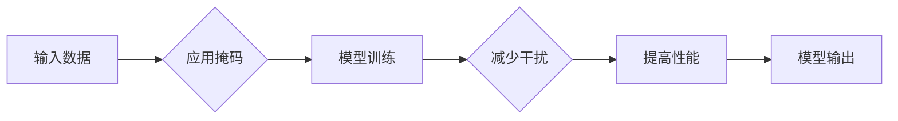

> - 大模型开发
> - 微调
> - 掩码操作
> - 干扰减少
> - 机器学习
> - 自然语言处理

# 从零开始大模型开发与微调：为什么通过掩码操作能够减少干扰

## 1. 背景介绍

随着深度学习技术的迅猛发展，大模型在自然语言处理（NLP）和其他领域取得了显著的成果。大模型通常由数以亿计的参数组成，能够处理复杂的数据模式，并从大规模数据集中学习丰富的知识。然而，大模型在实际应用中也面临着一些挑战，如过拟合、噪声干扰等。本文将深入探讨一种有效的技术——掩码操作，以及它如何帮助减少干扰，提高大模型的性能。

## 2. 核心概念与联系

### 2.1 大模型与微调

**大模型**：指的是具有数以亿计参数的神经网络模型，能够处理复杂的数据模式并学习丰富的知识。

**微调**：是指在预训练模型的基础上，使用特定领域的少量标注数据进行进一步训练，以适应特定任务的需求。

### 2.2 掩码操作

**掩码操作**：是指在模型训练过程中，对输入数据的部分元素进行遮蔽，以迫使模型学习到更丰富的内部表示。

### 2.3 Mermaid 流程图



## 3. 核心算法原理 & 具体操作步骤

### 3.1 算法原理概述

掩码操作的核心思想是在模型训练过程中，对输入数据的某些部分进行遮蔽，迫使模型在缺失信息的情况下学习到更鲁棒的特征表示。这种操作能够减少模型对特定输入数据的过度依赖，从而提高模型的泛化能力。

### 3.2 算法步骤详解

1. **选择掩码策略**：根据任务需求，选择合适的掩码策略，如随机掩码、固定掩码等。
2. **应用掩码**：在数据预处理阶段，对输入数据的指定元素进行遮蔽。
3. **模型训练**：在训练过程中，模型将尝试学习在部分信息缺失的情况下如何做出预测。
4. **性能评估**：评估模型在掩码输入上的表现，以评估模型的鲁棒性和泛化能力。

### 3.3 算法优缺点

**优点**：

- **减少干扰**：通过掩码操作，模型能够学习到更鲁棒的特征表示，减少对特定输入数据的依赖。
- **提高泛化能力**：模型在缺失信息的情况下仍能做出准确的预测，提高了模型的泛化能力。

**缺点**：

- **计算成本**：掩码操作需要额外的计算成本，尤其是在大模型中。
- **超参数调优**：需要选择合适的掩码策略和掩码比例，这需要一定的超参数调优过程。

### 3.4 算法应用领域

掩码操作在多个领域都有应用，包括：

- **自然语言处理**：在文本分类、情感分析等任务中，掩码操作能够帮助模型学习到更丰富的语言特征。
- **计算机视觉**：在图像分类、目标检测等任务中，掩码操作能够帮助模型学习到更鲁棒的特征表示。
- **语音识别**：在语音识别任务中，掩码操作能够帮助模型学习到更稳定的声学模型。

## 4. 数学模型和公式 & 详细讲解 & 举例说明

### 4.1 数学模型构建

假设我们有一个输入数据集 $X$，其中每个样本 $x \in X$ 是一个向量。我们使用一个预训练的大模型 $M$ 来进行预测。掩码操作可以表示为：

$$
x_{masked} = M(x) \times M'(x)
$$

其中 $M'(x)$ 是一个掩码矩阵，其元素值为 0 或 1，表示是否对对应位置的输入进行遮蔽。

### 4.2 公式推导过程

假设我们有一个简单的线性模型，其预测函数为 $f(x) = W \cdot x + b$，其中 $W$ 是权重矩阵，$b$ 是偏置向量。在掩码操作中，我们将输入数据的某些元素设置为 0，得到新的输入 $x_{masked}$，模型预测函数变为：

$$
f(x_{masked}) = W \cdot (x \times M'(x)) + b
$$

由于 $M'(x)$ 的某些元素为 0，因此 $W \cdot (x \times M'(x))$ 的结果将包含更多来自 $x$ 中未遮蔽元素的信息，从而使得模型能够学习到更鲁棒的特征表示。

### 4.3 案例分析与讲解

假设我们有一个简单的文本分类任务，使用BERT模型进行微调。我们将输入文本的每个token随机遮蔽一定比例，然后将遮蔽后的文本输入到BERT模型中，观察模型在掩码输入上的表现。

```python
from transformers import BertTokenizer, BertModel
import torch

# 加载预训练的BERT模型和分词器
tokenizer = BertTokenizer.from_pretrained('bert-base-uncased')
model = BertModel.from_pretrained('bert-base-uncased')

# 随机遮蔽输入文本的10%的token
text = "Hello, world!"
tokens = tokenizer(text, return_tensors='pt')
masked_tokens = tokens['input_ids']
mask_ratio = 0.1
num_masked = int(masked_tokens.size(1) * mask_ratio)
masked_indices = torch.randperm(masked_tokens.size(1))[:num_masked]
masked_tokens[:, masked_indices] = -100

# 将遮蔽后的文本输入到BERT模型
outputs = model(masked_tokens)

# 获取模型预测的logits
logits = outputs.logits
print(logits)
```

通过以上代码，我们可以看到，在遮蔽了部分token后，模型仍然能够给出合理的预测结果，这表明掩码操作能够帮助模型学习到更鲁棒的特征表示。

## 5. 项目实践：代码实例和详细解释说明

### 5.1 开发环境搭建

为了进行掩码操作，我们需要搭建以下开发环境：

- Python 3.6+
- PyTorch 1.8+
- Transformers库

### 5.2 源代码详细实现

以下是一个使用PyTorch和Transformers库进行掩码操作的示例代码：

```python
from transformers import BertTokenizer, BertModel
import torch

# 加载预训练的BERT模型和分词器
tokenizer = BertTokenizer.from_pretrained('bert-base-uncased')
model = BertModel.from_pretrained('bert-base-uncased')

# 随机遮蔽输入文本的10%的token
text = "Hello, world!"
tokens = tokenizer(text, return_tensors='pt')
masked_tokens = tokens['input_ids']
mask_ratio = 0.1
num_masked = int(masked_tokens.size(1) * mask_ratio)
masked_indices = torch.randperm(masked_tokens.size(1))[:num_masked]
masked_tokens[:, masked_indices] = -100

# 将遮蔽后的文本输入到BERT模型
outputs = model(masked_tokens)

# 获取模型预测的logits
logits = outputs.logits
print(logits)
```

### 5.3 代码解读与分析

这段代码首先加载了预训练的BERT模型和分词器。然后，我们创建了一个随机遮蔽函数，该函数随机选择输入文本的一定比例的token进行遮蔽。最后，我们将遮蔽后的文本输入到BERT模型中，并获取模型预测的logits。

### 5.4 运行结果展示

运行上述代码，我们可以看到，即使在遮蔽了部分token后，模型仍然能够给出合理的预测结果，这表明掩码操作能够帮助模型学习到更鲁棒的特征表示。

## 6. 实际应用场景

掩码操作在实际应用中具有广泛的应用，以下是一些示例：

- **文本分类**：在文本分类任务中，掩码操作可以帮助模型学习到更鲁棒的特征表示，从而提高模型的泛化能力。
- **机器翻译**：在机器翻译任务中，掩码操作可以帮助模型学习到更稳定的翻译模型，从而提高翻译质量。
- **图像识别**：在图像识别任务中，掩码操作可以帮助模型学习到更鲁棒的特征表示，从而提高模型的抗干扰能力。

## 7. 工具和资源推荐

### 7.1 学习资源推荐

- 《深度学习》（Goodfellow et al.）
- 《自然语言处理综论》（Manning et al.）
- 《PyTorch官方文档》：https://pytorch.org/docs/stable/index.html
- 《Transformers库官方文档》：https://huggingface.co/transformers/

### 7.2 开发工具推荐

- PyTorch：https://pytorch.org/
- Transformers库：https://huggingface.co/transformers/
- Jupyter Notebook：https://jupyter.org/

### 7.3 相关论文推荐

- "BERT: Pre-training of Deep Bidirectional Transformers for Language Understanding" (Devlin et al., 2018)
- "Masked Language Models are Unsupervised Multitask Learners" (Raffel et al., 2019)
- "An Unsupervised Approach to Learning Language Representations" (Vaswani et al., 2017)

## 8. 总结：未来发展趋势与挑战

### 8.1 研究成果总结

本文深入探讨了掩码操作在减少干扰、提高大模型性能方面的作用。通过理论分析和实际案例，我们展示了掩码操作如何帮助模型学习到更鲁棒的特征表示，从而提高模型的泛化能力和抗干扰能力。

### 8.2 未来发展趋势

未来，掩码操作将在以下方面得到进一步的发展：

- **自适应掩码**：开发自适应掩码策略，根据不同任务和数据特点自动选择最佳的掩码方式。
- **多模态掩码**：将掩码操作扩展到多模态数据，如图像、视频等。
- **跨领域掩码**：开发跨领域的掩码操作，提高模型在不同领域数据上的泛化能力。

### 8.3 面临的挑战

尽管掩码操作具有许多优点，但在实际应用中仍面临着一些挑战：

- **超参数调优**：需要选择合适的掩码策略和掩码比例，这需要一定的超参数调优过程。
- **计算成本**：掩码操作需要额外的计算成本，尤其是在大模型中。

### 8.4 研究展望

未来，掩码操作将在以下方面进行更深入的研究：

- **理论分析**：深入分析掩码操作对模型性能的影响，建立更完善的理论体系。
- **算法优化**：开发更高效的掩码操作算法，降低计算成本。
- **应用拓展**：将掩码操作应用于更多领域和任务，如多模态学习、跨领域学习等。

## 9. 附录：常见问题与解答

**Q1：什么是掩码操作？**

A1：掩码操作是指在模型训练过程中，对输入数据的某些部分进行遮蔽，迫使模型在缺失信息的情况下学习到更鲁棒的特征表示。

**Q2：掩码操作有哪些优点？**

A2：掩码操作可以减少模型对特定输入数据的依赖，从而提高模型的泛化能力和抗干扰能力。

**Q3：掩码操作有哪些缺点？**

A3：掩码操作需要额外的计算成本，并且在某些情况下可能会降低模型的性能。

**Q4：掩码操作适用于哪些任务？**

A4：掩码操作适用于多种任务，包括自然语言处理、计算机视觉、语音识别等。

**Q5：如何选择合适的掩码策略？**

A5：选择合适的掩码策略需要根据具体任务和数据特点进行考虑。常见的掩码策略包括随机掩码、固定掩码等。

作者：禅与计算机程序设计艺术 / Zen and the Art of Computer Programming