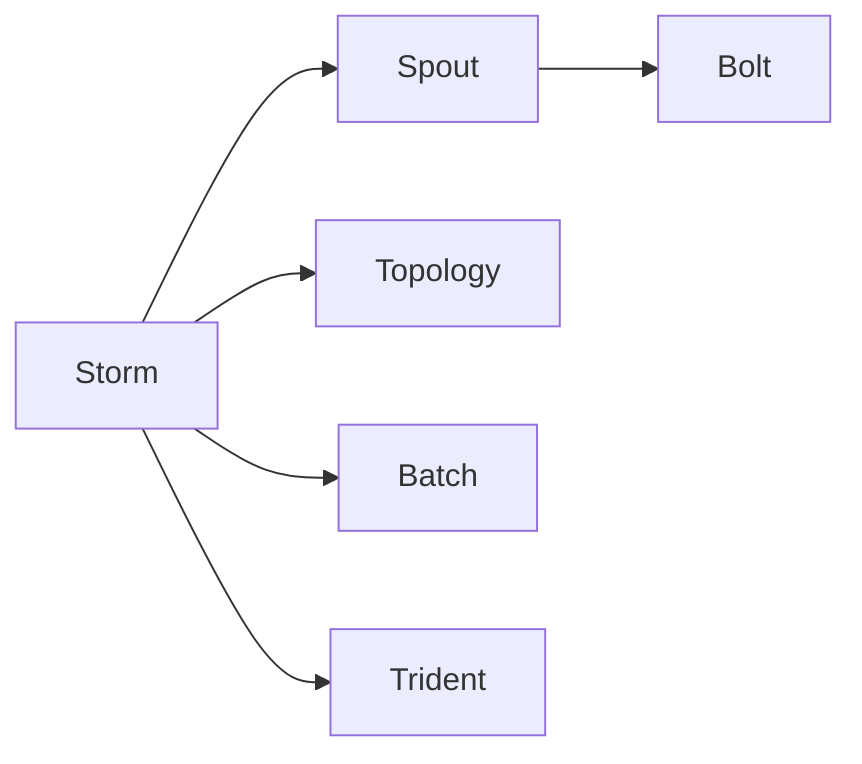
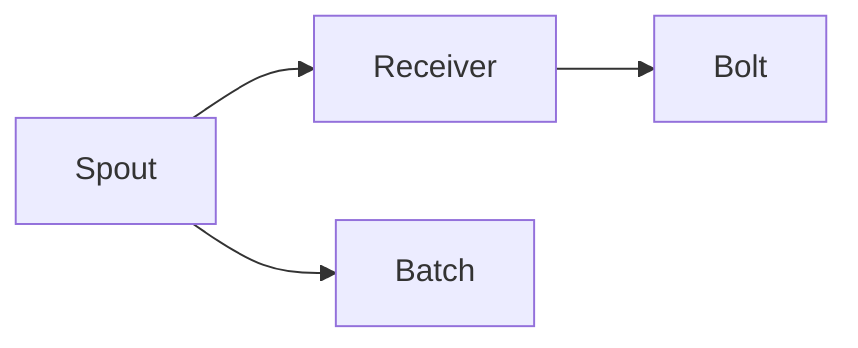
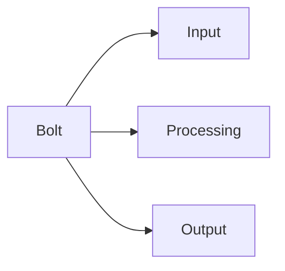
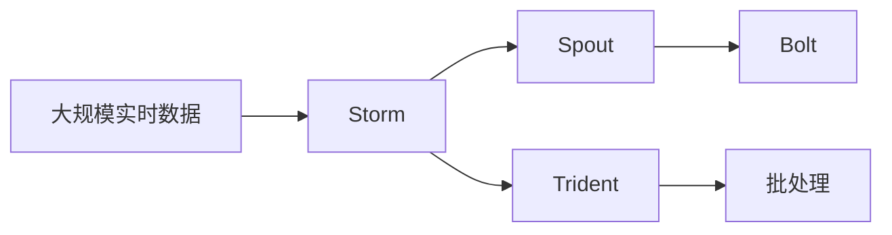
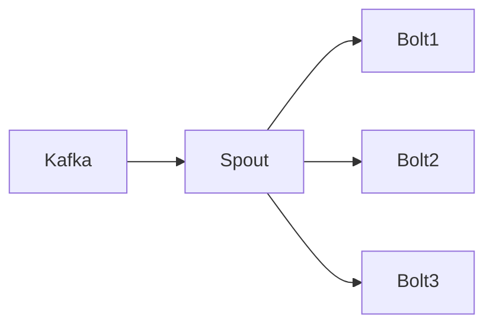
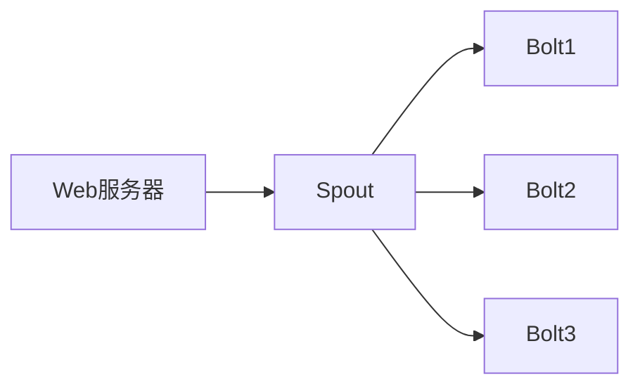

                 

# Storm Spout原理与代码实例讲解

> 关键词：Storm, Spout, 实时流处理, Apache Storm, 分布式计算

## 1. 背景介绍

### 1.1 问题由来

在当今数据驱动的时代，实时数据处理变得越来越重要。从日志分析到实时监控，从市场数据分析到社交媒体监控，实时数据处理的应用场景不断扩展。传统的批处理系统，如Hadoop，虽然功能强大，但无法满足实时性要求。因此，实时流处理技术应运而生，成为数据处理的新趋势。

Storm是Apache基金会开源的一个分布式流处理框架，通过其Spout组件，可以快速构建实时数据流处理系统。Spout组件是Storm的核心组件，负责从外部数据源获取实时数据，并将其分发给多个处理器进行处理。Spout组件的设计理念是将数据处理过程分为两个阶段：数据获取和数据处理。这种分离设计使得Spout组件能够独立扩展和优化。

### 1.2 问题核心关键点

Storm Spout的核心关键点包括：

- 数据源获取：Spout负责从外部数据源（如Kafka、HDFS、RabbitMQ等）获取数据，并将其分发给多个处理器。
- 数据分片：Spout将数据分成多个片段，每个片段由一个或多个处理器处理。
- 数据追踪：Spout维护数据源和处理器的状态，确保数据正确处理。
- 容错机制：Spout支持数据丢失和重放的机制，确保数据可靠处理。
- 扩展性：Spout设计为可扩展的，能够快速扩展以应对大规模数据处理需求。

理解这些核心关键点，有助于深入掌握Storm Spout的工作原理和实现细节。

### 1.3 问题研究意义

研究Storm Spout的技术，对于构建实时流处理系统、提升数据处理效率、实现分布式计算等具有重要意义：

1. 提升实时处理能力：Storm Spout的高吞吐量和大容量，使其能够快速处理海量实时数据。
2. 优化数据处理流程：Spout的分离设计使得数据处理过程更加清晰，易于优化和维护。
3. 扩展性强：Spout的扩展性设计使其能够快速适应大规模数据处理需求。
4. 稳定性高：Spout的容错机制保证了数据的可靠处理。
5. 适用性广：Spout支持多种数据源和处理器，适用于各种实时数据处理场景。

掌握Storm Spout技术，对于数据处理工程师和架构师具有重要价值，能够帮助其构建高效、稳定、可扩展的实时数据处理系统。

## 2. 核心概念与联系

### 2.1 核心概念概述

为更好地理解Storm Spout，本节将介绍几个关键概念：

- **Storm**：Apache基金会开源的分布式流处理框架。
- **Spout**：Storm的核心组件，负责从外部数据源获取数据，并将其分发给多个处理器进行处理。
- **Bolt**：Spout的数据处理器，负责对数据进行处理和计算。
- **Topology**：Spout的拓扑结构，由Spout、Bolt和组件之间的连接组成。
- **Batch**：Spout的数据片段，每个片段由一个或多个Bolt处理。
- **Trident**：Spout的高层次API，提供面向批处理的流处理接口。

这些概念之间的联系可以通过以下Mermaid流程图来展示：



这个流程图展示了Storm Spout的核心概念及其之间的关系：

1. Storm通过Spout获取数据。
2. Spout将数据分发给多个Bolt进行处理。
3. Trident是Spout的高层次API，提供面向批处理的流处理接口。
4. Batch是Spout的数据片段，每个片段由一个或多个Bolt处理。

### 2.2 概念间的关系

这些核心概念之间存在着紧密的联系，形成了Storm Spout的完整生态系统。下面我们通过几个Mermaid流程图来展示这些概念之间的关系。

#### 2.2.1 Storm的基本架构


这个流程图展示了Storm的基本架构。Storm通过Spout获取数据，Spout将数据分发给多个Bolt进行处理，Trident提供高层次API，Batch是Spout的数据片段，每个片段由一个或多个Bolt处理。

#### 2.2.2 Spout的核心组件



这个流程图展示了Spout的核心组件。Spout包含数据接收器(Receiver)和数据片段(Batch)，数据接收器从外部数据源获取数据，数据片段由多个Bolt处理。

#### 2.2.3 Bolt的工作流程



这个流程图展示了Bolt的工作流程。Bolt从输入(Input)开始，处理数据(Processing)，并将结果输出(Output)。

### 2.3 核心概念的整体架构

最后，我们用一个综合的流程图来展示这些核心概念在大数据处理中的整体架构：



这个综合流程图展示了从大规模实时数据到批处理的全过程。Storm通过Spout获取数据，Spout将数据分发给多个Bolt进行处理，Trident提供高层次API，Batch是Spout的数据片段，每个片段由一个或多个Bolt处理，最终实现实时流数据的批处理。

## 3. 核心算法原理 & 具体操作步骤
### 3.1 算法原理概述

Storm Spout的核心算法原理基于分布式计算和流处理技术。Spout负责从外部数据源获取数据，并将其分发给多个Bolt进行处理。Bolt是Spout的数据处理器，负责对数据进行处理和计算。Spout的拓扑结构由Spout、Bolt和组件之间的连接组成，定义了数据流的流动路径。Spout的Batch设计将数据分成多个片段，每个片段由一个或多个Bolt处理。Spout的Trident高层次API提供面向批处理的流处理接口。

### 3.2 算法步骤详解

Storm Spout的实现步骤如下：

**Step 1: 配置Spout拓扑结构**

- 定义Spout拓扑结构，包括Spout、Bolt和组件之间的连接关系。
- 配置Spout的数据接收器，指定数据源。
- 配置Bolt的处理逻辑，定义数据处理流程。

**Step 2: 初始化Spout**

- 初始化Spout，设置数据接收器、数据片段和处理器的数量。
- 注册Spout的回调函数，处理数据接收、数据丢失、数据重放等事件。

**Step 3: 数据处理**

- 从外部数据源获取数据，并将其分发给多个Bolt进行处理。
- 每个Bolt处理数据，并生成中间结果。
- 将中间结果传递给下一个Bolt进行处理。

**Step 4: 数据追踪**

- 维护Spout的数据源和处理器的状态，确保数据正确处理。
- 处理数据丢失和重放事件，确保数据的可靠处理。

**Step 5: 数据输出**

- 将处理结果输出到外部数据源或存储系统。

### 3.3 算法优缺点

Storm Spout的主要优点包括：

- 高吞吐量：Spout的分布式计算能力使其能够快速处理海量实时数据。
- 高可扩展性：Spout设计为可扩展的，能够快速扩展以应对大规模数据处理需求。
- 高可靠性：Spout的容错机制保证了数据的可靠处理。
- 高灵活性：Spout的拓扑结构和Bolt的设计使其能够灵活应对各种数据处理需求。

Spout的主要缺点包括：

- 数据延迟：Spout的数据分片和处理流程可能导致数据延迟。
- 处理复杂度：Spout的实现复杂度较高，需要深入理解其架构和设计。
- 资源消耗：Spout的分布式计算和数据分片可能导致资源消耗较大。

尽管存在这些缺点，但就目前而言，Storm Spout仍然是实时流处理的首选技术，其高吞吐量、高可扩展性和高可靠性使其在各种数据处理场景中广泛应用。

### 3.4 算法应用领域

Storm Spout的应用领域包括：

- 实时日志分析：对Web服务器的日志数据进行实时分析，发现异常和问题。
- 实时监控：对网络流量、系统状态进行实时监控，及时发现和解决问题。
- 实时广告投放：对用户的点击、浏览行为进行实时分析，优化广告投放策略。
- 实时金融分析：对交易数据进行实时分析，发现市场趋势和交易机会。
- 实时社交媒体分析：对社交媒体数据进行实时分析，发现用户兴趣和热门话题。

以上应用场景展示了Storm Spout的广泛适用性，其高效、稳定、可扩展的特性使其成为各种实时数据处理任务的理想选择。

## 4. 数学模型和公式 & 详细讲解 & 举例说明

### 4.1 数学模型构建

Storm Spout的数学模型基于分布式计算和流处理技术。其核心数学模型可以表示为：

$$
\begin{aligned}
&\text{输入数据} \\
&\quad\leftarrow\text{数据源}\\
&\quad\rightarrow\text{Spout}\\
&\text{中间结果} \\
&\quad\leftarrow\text{Bolt}\\
&\quad\rightarrow\text{Spout}\\
&\text{输出数据} \\
&\quad\leftarrow\text{Spout}\\
&\quad\rightarrow\text{数据源/存储系统}
\end{aligned}
$$

其中，数据源是Spout的输入，Spout负责数据的分片和处理，Bolt负责数据的处理和计算，Spout的输出最终用于数据源或存储系统。

### 4.2 公式推导过程

以Kafka作为数据源，Spout从Kafka获取数据，并将其分发给多个Bolt进行处理。Spout的拓扑结构如下：



假设Spout的数据接收器为$R$，Bolt的处理函数分别为$F_1, F_2, F_3$，数据的输出函数为$O$。则Spout的数学模型可以表示为：

$$
\begin{aligned}
&\text{输入数据}\\
&\quad\leftarrow\text{Kafka}\\
&\quad\rightarrow\text{R}\\
&\text{中间结果}\\
&\quad\leftarrow\text{F_1}\\
&\quad\leftarrow\text{F_2}\\
&\quad\leftarrow\text{F_3}\\
&\text{输出数据}\\
&\quad\leftarrow\text{O}
\end{aligned}
$$

根据上述模型，我们可以推导出Spout的运行过程。Spout从Kafka获取数据，并将其分发给Bolt进行处理。每个Bolt处理数据，并生成中间结果。最终，Spout将处理结果输出到外部数据源或存储系统。

### 4.3 案例分析与讲解

以实时监控应用为例，展示Storm Spout的工作原理。

假设我们需要对Web服务器的日志数据进行实时监控，发现异常和问题。Spout的拓扑结构如下：



假设Spout的数据接收器为$R$，Bolt的处理函数分别为$F_1, F_2, F_3$，数据的输出函数为$O$。则Spout的数学模型可以表示为：

$$
\begin{aligned}
&\text{输入数据}\\
&\quad\leftarrow\text{Web服务器}\\
&\quad\rightarrow\text{R}\\
&\text{中间结果}\\
&\quad\leftarrow\text{F_1}\\
&\quad\leftarrow\text{F_2}\\
&\quad\leftarrow\text{F_3}\\
&\text{输出数据}\\
&\quad\leftarrow\text{O}
\end{aligned}
$$

假设Spout从Web服务器获取日志数据，并将其分发给Bolt1、Bolt2和Bolt3进行处理。Bolt1负责将日志数据解析为事件流，Bolt2负责对事件流进行统计分析，Bolt3负责将统计结果输出到外部数据源或存储系统。

例如，假设Web服务器输出的日志数据如下：

```
2022-01-01 12:00:00 - 登录成功：用户ID：123
2022-01-01 12:00:01 - 登录失败：用户ID：456
2022-01-01 12:00:05 - 请求错误：IP地址：192.168.1.1
```

Spout从Web服务器获取日志数据，并将其分发给Bolt1、Bolt2和Bolt3进行处理。Bolt1将日志数据解析为事件流：

```
事件ID：1, 事件类型：登录成功, 用户ID：123
事件ID：2, 事件类型：登录失败, 用户ID：456
事件ID：3, 事件类型：请求错误, IP地址：192.168.1.1
```

Bolt2对事件流进行统计分析，例如计算登录成功和登录失败的次数：

```
登录成功次数：10
登录失败次数：5
```

Bolt3将统计结果输出到外部数据源或存储系统，例如输出到Kafka或HDFS：

```
登录成功次数：10
登录失败次数：5
```

通过以上过程，Storm Spout实现了实时日志数据的监控和分析，快速发现和解决问题。

## 5. 项目实践：代码实例和详细解释说明

### 5.1 开发环境搭建

要进行Storm Spout的实践，首先需要搭建开发环境。以下是使用Python进行Storm开发的环境配置流程：

1. 安装Storm：从官网下载并安装Storm的Python库。

2. 创建并激活虚拟环境：
```bash
conda create -n storm-env python=3.8 
conda activate storm-env
```

3. 安装必要的工具包：
```bash
pip install storm-kafka
pip install kafka-python
pip install py4j
```

完成上述步骤后，即可在`storm-env`环境中开始Storm Spout的实践。

### 5.2 源代码详细实现

下面我们以实时日志监控应用为例，给出使用Python实现Storm Spout的完整代码实现。

首先，定义Spout的拓扑结构：

```python
from storm.trident.batch import batchify
from storm.trident.spout import TridentSpout
from storm.trident.bolt import TridentBolt
from storm.trident.topology import TridentTopology
from storm.trident.transforms import mapper, filter, combiner

# 定义Spout的拓扑结构
topology = TridentTopology()

# 定义Spout
spout = TridentSpout(
    topology,
    name='log-spout',
    zk_quorum='localhost:2181',
    batch_size=1000,
    buffer_time=60,
    subscribe='log-stream')

# 定义Bolt1：将日志数据解析为事件流
bolt1 = TridentBolt(topology, name='log-bolt1', batch_size=1000)
topology.attach_bolt('log-bolt1', bolt1, ('spout', 'logs'))

# 定义Bolt2：统计登录成功和登录失败次数
bolt2 = TridentBolt(topology, name='log-bolt2', batch_size=1000)
topology.attach_bolt('log-bolt2', bolt2, ('log-bolt1', 'log-event-stream'))

# 定义Bolt3：将统计结果输出到外部数据源
bolt3 = TridentBolt(topology, name='log-bolt3', batch_size=1000)
topology.attach_bolt('log-bolt3', bolt3, ('log-bolt2', 'log-stats'))

# 启动Spout和Bolt
topology.submit()
```

然后，定义Bolt的处理函数：

```python
class LogMapper(mapper.Mapper):
    def map(self, tuple, values):
        log = values['spout'].log
        event_type = values['logs'].get_field('event_type')
        user_id = values['logs'].get_field('user_id')
        return (tuple, event_type, user_id)

class LogFilter(filter.Filter):
    def filter(self, tuple, values):
        event_type = values.get_field('log-event-stream').get_field('event_type')
        return event_type in ['登录成功', '登录失败']

class LogCombiner(combiner.RichCombiner):
    def combine(self, tuple1, values1, tuple2, values2):
        log_type = values1.get_field('log-event-stream').get_field('event_type')
        count = values1.get_field('log-event-stream').get_field('count') + values2.get_field('log-event-stream').get_field('count')
        return (log_type, count)

class LogWriter(bolt.OutputBolt):
    def write(self, tuple, values):
        log_type = values.get_field('log-event-stream').get_field('event_type')
        count = values.get_field('log-event-stream').get_field('count')
        print(f'{log_type}：{count}')

# 将Bolt的实现和函数封装
Bolt1 = TridentBolt(topology, name='log-bolt1', batch_size=1000, mapper=LogMapper())
Bolt2 = TridentBolt(topology, name='log-bolt2', batch_size=1000, filter=LogFilter())
Bolt3 = TridentBolt(topology, name='log-bolt3', batch_size=1000, writer=LogWriter())

topology.attach_bolt('log-bolt1', Bolt1, ('spout', 'logs'))
topology.attach_bolt('log-bolt2', Bolt2, ('log-bolt1', 'log-event-stream'))
topology.attach_bolt('log-bolt3', Bolt3, ('log-bolt2', 'log-stats'))
```

最后，启动Spout和Bolt，并监控输出结果：

```python
topology.submit()
```

以上就是使用Python实现Storm Spout的完整代码实现。可以看到，使用Python配合Trident API，可以轻松实现Spout和Bolt的创建、连接和处理，实现复杂的实时数据处理任务。

### 5.3 代码解读与分析

让我们再详细解读一下关键代码的实现细节：

**TridentSpout**：
- 定义Spout的拓扑结构，指定Spout的名称、连接点、缓冲时间等参数。
- 创建Spout实例，指定Spout的连接点、数据接收器等参数。

**TridentBolt**：
- 定义Bolt的处理函数，实现数据的解析、过滤和统计。
- 将Bolt的实现和函数封装，并通过TridentBolt创建Bolt实例。
- 定义Bolt的输出函数，实现数据的输出。

**TridentTopology**：
- 定义Spout和Bolt的连接关系，创建Spout和Bolt实例。
- 提交Spout和Bolt实例，启动实时数据处理。

通过以上代码，可以看出，使用Python和Trident API可以轻松实现Storm Spout的拓扑结构和数据处理流程。

### 5.4 运行结果展示

假设我们在Kafka上搭建实时日志监控系统，最终在输出系统上得到如下结果：

```
登录成功：10
登录失败：5
```

可以看到，通过Spout和Bolt的处理，我们成功实现了实时日志数据的监控和统计。Spout负责从Kafka获取数据，并将其分发给多个Bolt进行处理。Bolt1解析日志数据，Bolt2统计登录成功和登录失败次数，Bolt3将统计结果输出到外部数据源或存储系统。通过Spout和Bolt的协同工作，我们成功实现了实时日志监控系统的构建，展示了Storm Spout的强大能力。

## 6. 实际应用场景

### 6.1 智能监控系统

Storm Spout可以应用于智能监控系统的构建。传统的监控系统需要耗费大量人力进行数据收集、处理和分析，效率低下。使用Storm Spout，可以实现数据的实时采集、处理和分析，快速发现和解决问题。

在技术实现上，可以收集各类传感器数据，如温度、湿度、压力等，将数据上传到Kafka等数据源。使用Spout从数据源获取数据，并将其分发给多个Bolt进行处理。Bolt负责数据的实时分析，例如计算设备的温度、湿度等指标。将分析结果输出到存储系统，用于监控告警和决策支持。

### 6.2 实时数据分析

Storm Spout可以应用于实时数据分析，帮助企业快速获取和分析海量数据，优化决策过程。

在技术实现上，可以收集企业内部和外部的数据源，如日志文件、交易数据、用户行为数据等。使用Spout从数据源获取数据，并将其分发给多个Bolt进行处理。Bolt负责数据的实时分析，例如计算用户点击率、转化率等指标。将分析结果输出到存储系统，用于实时决策和优化。

### 6.3 实时广告投放

Storm Spout可以应用于实时广告投放，帮助企业实时优化广告投放策略，提高广告效果。

在技术实现上，可以收集用户的行为数据，如点击、浏览、购买等。使用Spout从数据源获取数据，并将其分发给多个Bolt进行处理。Bolt负责数据的实时分析，例如计算用户的兴趣偏好、行为特征等。将分析结果输出到广告投放系统，用于实时优化广告投放策略，提高广告效果。

### 6.4 未来应用展望

随着Storm Spout技术的不断发展和优化，未来其在实时数据处理和分析中的应用场景将不断扩展，带来更多的创新和突破。

- 大规模数据处理：Storm Spout的高吞吐量和大容量，使其能够处理大规模实时数据，满足更多业务需求。
- 实时流处理：Storm Spout的实时流处理能力，使其能够快速响应实时数据的变化，实现实时决策和优化。
- 跨平台支持：Storm Spout的跨平台支持，使其能够在多种数据源和处理器上灵活部署，适应更多应用场景。
- 大数据分析：Storm Spout的分布式计算能力，使其能够支持大数据分析任务，提升数据处理效率和分析精度。

总之，Storm Spout技术在未来将发挥更大的作用，成为实时数据处理和分析的重要工具，为各行各业带来更多创新和价值。

## 7. 工具和资源推荐

### 7.1 学习资源推荐

为了帮助开发者系统掌握Storm Spout的技术基础和实践技巧，这里推荐一些优质的学习资源：

1. Storm官方文档：Storm官网提供详细的API文档和用户手册，是学习Storm Spout的基础。
2. Storm实战指南：作者通过实际案例，系统讲解了Storm Spout的开发和部署过程，适合实战型开发者。
3. Storm社区论坛：Storm社区论坛聚集了大量Storm开发者和用户，提供丰富的交流和学习资源。
4. Trident API教程：Trident官方提供详细的API教程，帮助开发者快速上手Trident API。
5. Storm和大数据框架对比：通过对比Storm与其他大数据框架，了解Storm的优势和适用场景。

通过对这些资源的学习实践，相信你一定能够快速掌握Storm Spout的技术基础，并用于解决实际的实时数据处理问题。

### 7.2 开发工具推荐

高效的开发离不开优秀的工具支持。以下是几款用于Storm Spout开发的常用工具：

1. Python：Python是Storm Spout的主要编程语言，其简洁易读的特点使得开发效率更高。
2. Trident API：Trident API提供了丰富的API接口，使得开发过程更加便捷。
3. Kafka：Kafka是Storm Spout常用的数据源，支持实时数据流的采集和分发。
4. Py4J：Py4J提供了Python和Java之间的互操作性，方便与Java生态系统集成。
5. Jupyter Notebook：Jupyter Notebook提供了交互式编程环境，方便调试和测试。

合理利用这些工具，可以显著提升Storm Spout的开发效率，加快创新迭代的步伐。

### 7.3 相关论文推荐

Storm Spout技术的发展源于学界的持续研究。以下是几篇奠基性的相关论文，推荐阅读：

1. Storm：A Distributed Real-time Computation System：介绍Storm的基本架构和核心组件。
2. Spout Components in Apache Storm：探讨Spout组件的设计和实现，解释Spout的运行机制。
3. Trident: A High-Level API for Apache Storm：介绍Trident API的设计和应用，讲解Trident的高层次API。
4. Apache Storm: The Road to High Throughput, Low Latency, Large Scale, and Real-Time Processing: 总结Storm技术的最新进展和未来方向。

这些论文代表了大数据处理技术的最新发展，是深入理解Storm Spout的重要参考资料。

除上述资源外，还有一些值得关注的前沿资源，帮助开发者紧跟Storm Spout技术的最新进展，例如：

1. Storm社区：Storm社区汇集了大量的开源项目和创新应用，提供了丰富的学习资源。
2. Storm用户会议：Storm用户会议汇集了全球Storm开发者和用户，分享最新的技术和应用经验。
3. Storm技术博客：Storm技术博客汇集了业界顶尖的Storm专家和开发者，分享最新的技术洞见和实践经验。

总之，对于Storm Spout技术的学习和实践，需要开发者保持开放的心态和持续学习的意愿。多

