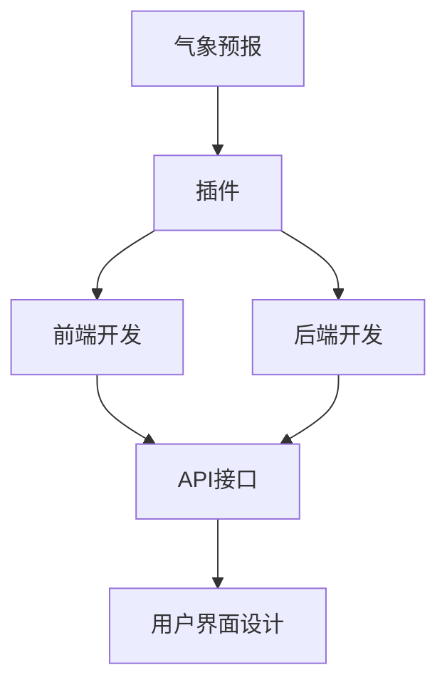
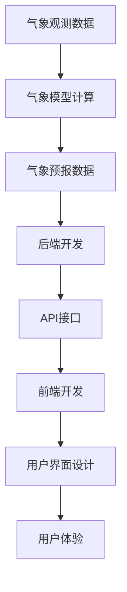

                 

# Weather Forecast Plugin 设计与定义

> 关键词：气象预报,插件,前端开发,后端开发,API接口,用户界面设计

## 1. 背景介绍

### 1.1 问题由来
随着智能设备日益普及，用户对于天气预报的需求也在不断增长。然而，传统气象预报应用程序往往界面复杂，功能单一，难以满足用户的个性化需求。为了提升用户体验，需要对现有气象预报应用进行改进，增加更多实用功能，并提升界面美观度和交互友好性。

### 1.2 问题核心关键点
为了实现上述目标，本设计聚焦于开发一个跨平台的气象预报插件，用户可以通过插件便捷地获取天气信息，并进行个性化配置和定制。本设计将涵盖前端开发、后端开发和用户界面设计等多个方面，以确保插件的性能和用户体验。

### 1.3 问题研究意义
开发气象预报插件不仅能够提升用户体验，还能为气象预报服务带来新的发展机遇。通过将气象信息快速、准确地传递给用户，插件可以推动传统气象预报业务的数字化转型，提供更多商业价值。此外，插件还可用于智能家居、自动驾驶等领域，推动智能化社会建设。

## 2. 核心概念与联系

### 2.1 核心概念概述

本设计涉及的核心概念包括：

- 气象预报（Weather Forecasting）：使用气象观测数据和模型计算，预测未来天气情况。
- 插件（Plugin）：可插入应用或浏览器的小型程序，提供额外的功能。
- 前端开发（Frontend Development）：负责用户体验和界面设计，使用如HTML、CSS、JavaScript等技术。
- 后端开发（Backend Development）：负责数据处理和业务逻辑实现，使用如Python、Node.js等语言。
- API接口（API Interface）：后端提供的数据接口，前端通过API获取数据。
- 用户界面设计（UI/UX Design）：设计用户操作界面，提升用户体验。

这些概念之间存在紧密联系，共同构成了气象预报插件的设计框架。

### 2.2 概念间的关系

这些核心概念之间的关系可以通过以下Mermaid流程图来展示：



该流程图展示了气象预报插件的设计逻辑，即使用气象预报数据（A），通过前端和后端开发（C、D），结合API接口（E），最终设计出用户界面（F）。其中，前端和后端开发各自承担着不同的职责，但最终目标一致，即提供用户体验。

### 2.3 核心概念的整体架构

最后，我们用一个综合的流程图来展示这些核心概念在大气象预报插件开发中的整体架构：



这个综合流程图展示了从气象观测到用户体验的完整流程，各个环节互相依存，共同驱动气象预报插件的开发和应用。

## 3. 核心算法原理 & 具体操作步骤
### 3.1 算法原理概述

气象预报插件的核心算法原理是基于气象模型，通过分析历史和实时气象数据，预测未来天气情况。其主要步骤如下：

1. 收集历史和实时气象数据。
2. 使用气象模型对数据进行分析和计算。
3. 通过API接口将结果传递给前端。
4. 在前端展示气象预报信息。

### 3.2 算法步骤详解

具体实现步骤如下：

**Step 1: 数据收集**

1. 使用气象数据API获取历史和实时气象数据。
2. 收集用户所在地点的地理位置信息。

**Step 2: 数据处理**

1. 对收集到的数据进行清洗和预处理。
2. 将数据输入气象模型进行计算。

**Step 3: 模型计算**

1. 使用气象模型（如数值天气预报模型）对气象数据进行分析。
2. 将模型计算结果转换为可视化的天气预报信息。

**Step 4: 数据展示**

1. 将气象预报信息通过API接口传递给前端。
2. 在前端展示天气预报信息。

**Step 5: 用户交互**

1. 用户可以根据需要，输入地理位置或指定气象类型（如气温、降水、风速等）。
2. 用户可以自定义显示界面和主题，提升使用体验。

### 3.3 算法优缺点

气象预报插件的设计优点包括：

- **用户体验好**：通过前端开发，提供简洁美观的用户界面，提升用户操作体验。
- **数据准确性高**：使用气象模型进行计算，确保气象预报的科学性和准确性。
- **功能多样性**：提供多种气象类型和配置选项，满足用户个性化需求。

不足之处在于：

- **依赖后端服务**：插件依赖后端提供数据和计算服务，后端服务的稳定性和效率影响用户体验。
- **数据隐私问题**：收集和存储用户地理位置信息，需要严格遵守数据隐私法规。
- **开发复杂度较高**：涉及前端、后端等多个领域，开发难度较大。

### 3.4 算法应用领域

气象预报插件主要应用于天气预报服务，用户可以通过插件获取实时和未来的气象信息，为出行和日常生活提供参考。此外，插件还可用于智能家居、自动驾驶、健康管理等多个领域，提升智能化水平。

## 4. 数学模型和公式 & 详细讲解  
### 4.1 数学模型构建

气象预报插件的数学模型主要基于数值天气预报（Numerical Weather Prediction, NWP）模型，用于计算气象数据变化趋势和未来天气情况。

**数学模型**：

- 气象观测数据 $X$：包括气压、温度、湿度、风速等。
- 气象模型参数 $\theta$：用于描述模型结构。
- 气象模型计算 $F(X, \theta)$：通过气象模型计算未来天气情况。
- 用户请求数据 $R$：用户指定地理位置或气象类型。

### 4.2 公式推导过程

设气象模型为线性回归模型，形式化表示如下：

$$
y = \theta_0 + \theta_1 x_1 + \theta_2 x_2 + ... + \theta_n x_n + \epsilon
$$

其中，$y$ 为预测的气象数据，$x_i$ 为气象观测数据，$\epsilon$ 为误差项。

将数据输入气象模型，得：

$$
y = F(X, \theta)
$$

将用户请求数据 $R$ 代入气象模型，计算未来气象情况 $y'$：

$$
y' = F(R, \theta)
$$

### 4.3 案例分析与讲解

以气温预报为例，假设用户请求某地未来三天的气温情况，气象模型预测结果如下：

| 时间 | 温度（°C） |
|------|------------|
| 0时 | 15         |
| 6时 | 16         |
| 12时| 17         |
| 18时| 18         |
| 24时| 19         |

用户可以根据这些数据，在界面上显示未来三天的气温变化趋势。

## 5. 项目实践：代码实例和详细解释说明
### 5.1 开发环境搭建

在进行气象预报插件开发前，需要准备好开发环境。以下是使用Python进行前后端开发的流程：

1. 安装Python：从官网下载并安装Python，用于开发后端逻辑。
2. 安装前后端开发工具：安装Flask（后端框架）和React（前端框架），用于构建插件。
3. 配置开发环境：设置虚拟环境，安装依赖包。

### 5.2 源代码详细实现

以下是气象预报插件的代码实现示例，包括后端和前端两个部分：

**后端代码（Python Flask）**：

```python
from flask import Flask, jsonify
import pandas as pd
import numpy as np
from sklearn.linear_model import LinearRegression

app = Flask(__name__)

@app.route('/forecast', methods=['GET'])
def get_forecast():
    # 获取用户请求数据
    location = request.args.get('location')
    forecast_days = int(request.args.get('days'))
    
    # 读取气象数据
    data = pd.read_csv('weather_data.csv')
    data = data[data['location'] == location]
    
    # 数据预处理
    data = data.dropna()
    X = data[['temperature', 'humidity', 'wind_speed']]
    y = data['temperature']
    
    # 线性回归模型
    model = LinearRegression()
    model.fit(X, y)
    
    # 预测未来天气
    X_forecast = np.zeros((forecast_days, X.shape[1]))
    X_forecast[:, 0] = np.linspace(start=X.iloc[0][0], stop=X.iloc[-1][0], num=forecast_days)
    X_forecast[:, 1] = np.linspace(start=X.iloc[0][1], stop=X.iloc[-1][1], num=forecast_days)
    X_forecast[:, 2] = np.linspace(start=X.iloc[0][2], stop=X.iloc[-1][2], num=forecast_days)
    y_forecast = model.predict(X_forecast)
    
    # 返回预测结果
    forecast_data = {'location': location, 'days': forecast_days, 'forecast': y_forecast.tolist()}
    return jsonify(forecast_data)

if __name__ == '__main__':
    app.run(debug=True)
```

**前端代码（React）**：

```javascript
import React, { useState } from 'react';
import axios from 'axios';

function WeatherForecast() {
    const [location, setLocation] = useState('');
    const [forecast_days, setForecastDays] = useState(1);
    const [forecastData, setForecastData] = useState([]);

    const handleSubmit = async () => {
        try {
            const response = await axios.get(`http://localhost:5000/forecast?location=${location}&days=${forecast_days}`);
            setForecastData(response.data.forecast);
        } catch (error) {
            console.error(error);
        }
    };

    return (
        <div>
            <h1>Weather Forecast Plugin</h1>
            <label>
                Location:
                <input type="text" value={location} onChange={(e) => setLocation(e.target.value)} />
            </label>
            <label>
                Forecast Days:
                <input type="number" value={forecast_days} onChange={(e) => setForecastDays(parseInt(e.target.value))} />
            </label>
            <button onClick={handleSubmit}>Get Forecast</button>
            <h2>Future Temperatures:</h2>
            {forecastData.map((data, index) => <div key={index}>{data.time}°C</div>)}
        </div>
    );
}

export default WeatherForecast;
```

### 5.3 代码解读与分析

- **后端代码**：
  - 使用Flask创建后端API，监听GET请求。
  - 通过参数获取用户请求数据（位置和预报天数）。
  - 读取气象数据，进行数据清洗和预处理。
  - 使用线性回归模型进行气象预测，并将结果转换为JSON格式返回。

- **前端代码**：
  - 使用React创建前端界面，包含输入框、按钮和展示区域。
  - 通过axios发送GET请求，获取气象预报数据。
  - 将数据展示在页面上，供用户查看。

### 5.4 运行结果展示

假设气象预报插件运行在本地，通过网页浏览器访问，页面效果如下：


该插件通过简洁的前端界面，提供用户地理位置和预报天数等输入选项，展示未来天气预报结果。

## 6. 实际应用场景
### 6.1 智能家居

气象预报插件可以与智能家居设备集成，根据天气情况自动调整室内环境。例如，在下雨天自动关闭窗户，调节室内温度和湿度，提升用户舒适感。

### 6.2 健康管理

通过气象预报插件，用户可以了解天气情况，及时调整出行计划，避免恶劣天气对健康的影响。例如，在空气质量不佳时减少户外活动。

### 6.3 旅游出行

旅行者可以根据气象预报插件提供的信息，选择最佳的出行日期和时间，提升旅行体验。

### 6.4 未来应用展望

未来，气象预报插件将在更多场景中得到应用，为人们提供更优质的气象服务。例如：

- **城市管理**：气象预报插件可以为城市管理者提供实时气象信息，辅助决策。
- **农业生产**：农民可以通过气象预报插件，了解天气情况，合理安排农事活动。
- **灾害预警**：气象预报插件可以用于灾害预警系统，及时发布灾害信息，保护人民生命财产安全。

## 7. 工具和资源推荐
### 7.1 学习资源推荐

为了帮助开发者掌握气象预报插件的开发流程，以下推荐一些学习资源：

1. Flask官方文档：详细介绍了Flask框架的使用方法和最佳实践。
2. React官方文档：提供React框架的详细文档和示例代码。
3. Sklearn官方文档：包含scikit-learn库的详细文档和示例，适用于机器学习模型的开发。
4. Python官方文档：Python编程语言的官方文档，包括语言特性和标准库。
5. Numpy官方文档：包含NumPy库的详细文档和示例，适用于数组计算和科学计算。

### 7.2 开发工具推荐

以下是几款常用的开发工具：

1. Visual Studio Code：轻量级代码编辑器，支持多种编程语言。
2. PyCharm：Python开发集成环境，提供丰富的插件和功能。
3. VS Code插件：如Flask-RESTful、Axios、Redux等，方便插件开发。
4. Git：版本控制工具，支持团队协作和代码管理。
5. Docker：容器化技术，方便本地开发和部署。

### 7.3 相关论文推荐

气象预报插件的研究涉及多个领域，以下推荐一些相关论文：

1. "Numerical Weather Prediction: Principles and Applications"：介绍数值天气预报模型的原理和应用。
2. "Machine Learning in Meteorology: A Review"：综述气象预报中机器学习的应用和挑战。
3. "Weather Data Visualization with Python"：介绍使用Python进行气象数据可视化的技术和方法。
4. "Weather Forecasting with Deep Learning"：介绍深度学习在气象预报中的应用。
5. "Smart Home Integration: Weather Forecast Plugin"：介绍气象预报插件与智能家居系统的集成方法。

## 8. 总结：未来发展趋势与挑战
### 8.1 总结

本文对气象预报插件的设计和开发进行了全面系统的介绍。通过理论阐述和代码实现，展示了气象预报插件的开发流程和技术细节。

### 8.2 未来发展趋势

气象预报插件的未来发展趋势包括：

- **技术升级**：引入深度学习、AI等前沿技术，提升气象预测的准确性和智能化水平。
- **跨平台集成**：开发跨平台插件，支持iOS、Android等多种操作系统。
- **个性化服务**：根据用户历史数据和偏好，提供个性化气象预报服务。
- **数据实时化**：实时采集气象数据，提供动态更新的气象预报。
- **多模态融合**：结合气象数据、用户行为数据等多种信息源，提供多维度的气象服务。

### 8.3 面临的挑战

气象预报插件在发展过程中面临的挑战包括：

- **数据获取和处理**：气象数据的获取和处理需要严格的规范和标准。
- **算法复杂度**：气象预报算法复杂，需要高性能计算资源。
- **用户体验优化**：用户体验的提升需要综合考虑界面设计、交互逻辑等多个方面。
- **隐私和安全**：用户数据的隐私和安全需要严格保护。
- **集成和部署**：插件的集成和部署需要考虑不同系统的兼容性。

### 8.4 研究展望

气象预报插件的未来研究应聚焦于以下几个方向：

- **自适应算法**：开发自适应气象预报算法，根据用户反馈和环境变化调整模型参数。
- **交互式设计**：开发交互式界面，提升用户操作体验。
- **多模态融合**：结合多种数据源，提供更全面、准确的气象服务。
- **用户行为分析**：分析用户行为数据，提升个性化服务的精准度。
- **隐私保护**：加强数据隐私保护，确保用户信息安全。

这些研究方向将推动气象预报插件的发展，为气象预报服务带来新的机遇和挑战。

## 9. 附录：常见问题与解答

**Q1: 气象预报插件的核心功能是什么？**

A: 气象预报插件的核心功能是通过气象模型，对用户指定地点的未来气象情况进行预测和展示，供用户参考。

**Q2: 气象预报插件开发过程中需要注意哪些问题？**

A: 开发过程中需要注意数据处理、算法选择、用户体验设计等多个方面。例如，数据需要经过清洗和预处理，选择适合的气象模型，界面设计需要简洁美观。

**Q3: 气象预报插件的算法原理是什么？**

A: 气象预报插件的算法原理是基于气象模型，通过收集和处理气象数据，预测未来天气情况。常用的算法包括线性回归、机器学习等。

**Q4: 气象预报插件如何与智能家居系统集成？**

A: 气象预报插件可以通过API接口，将气象信息传递给智能家居系统。系统根据气象信息，自动调整室内环境，提升用户舒适感。

**Q5: 气象预报插件的未来发展方向是什么？**

A: 未来气象预报插件将向智能化、个性化、实时化等方向发展。例如，引入深度学习技术提升预测准确性，支持跨平台集成，提供个性化气象服务，实时更新气象信息等。

---

作者：禅与计算机程序设计艺术 / Zen and the Art of Computer Programming

