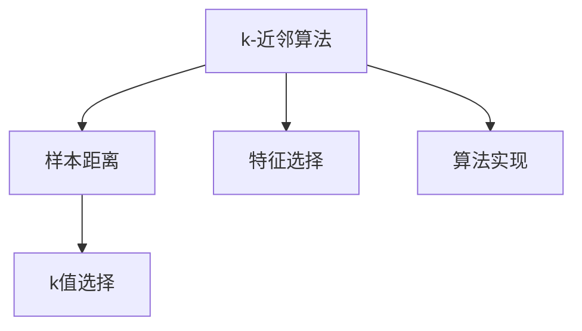
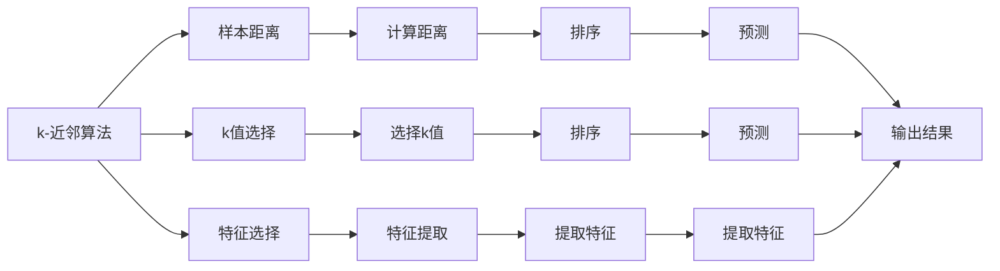
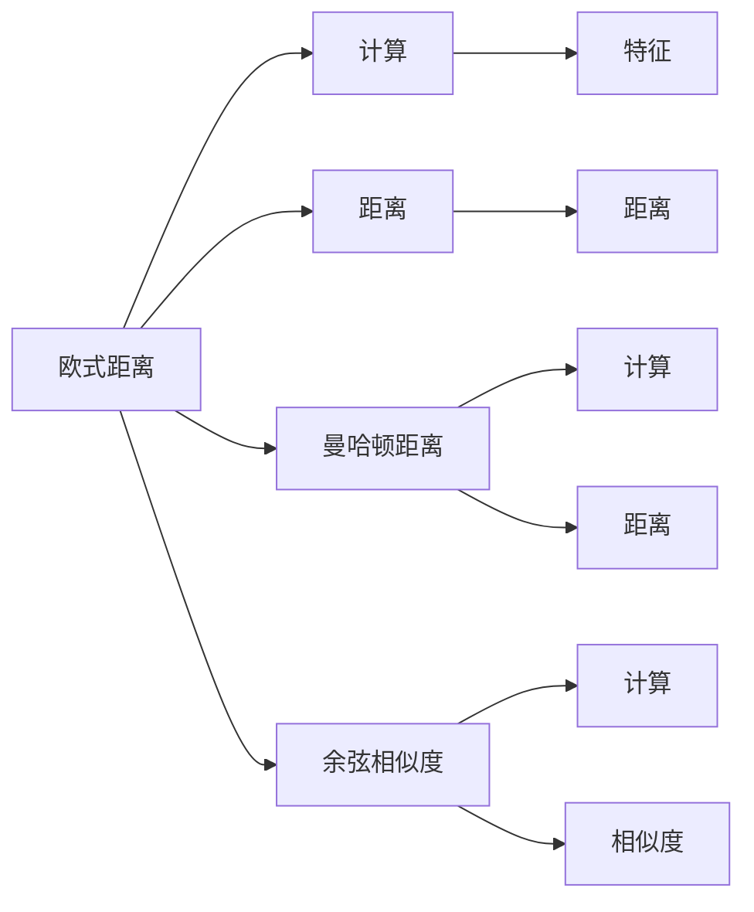
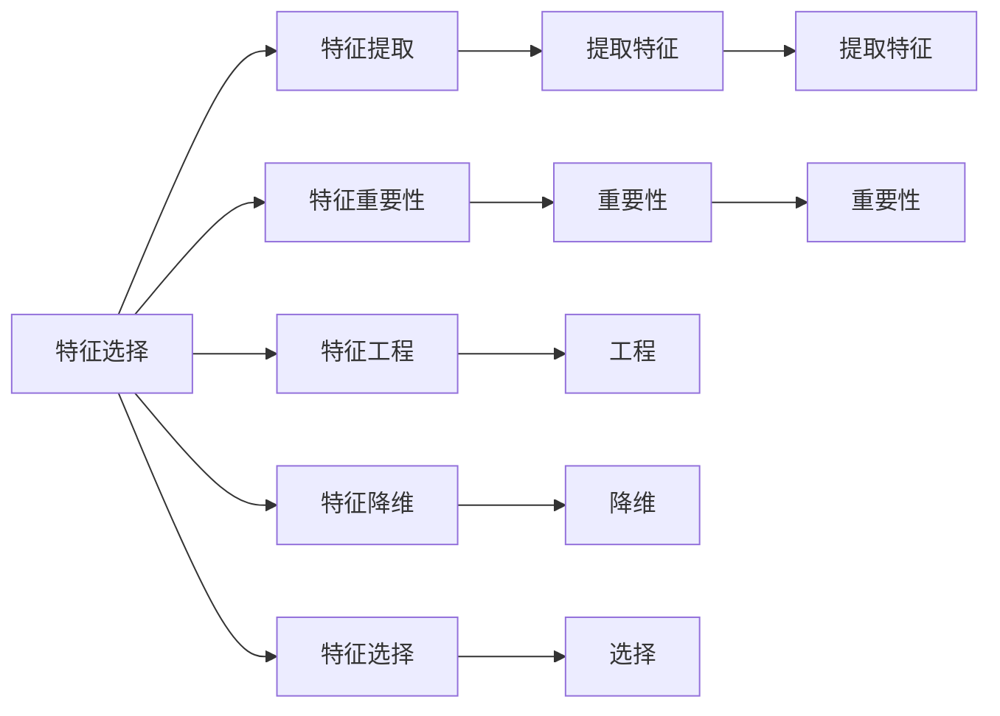
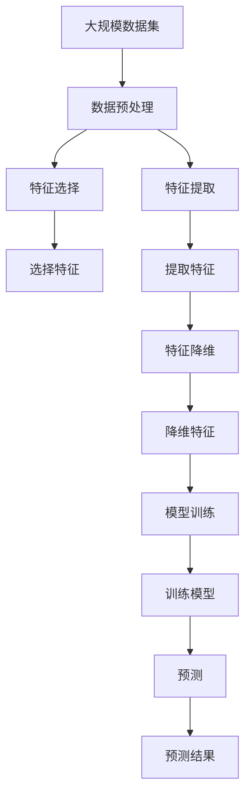

                 

# k-近邻算法(k-Nearest Neighbors) - 原理与代码实例讲解

> 关键词：k-近邻算法, 分类, 回归, 计算复杂度, 特征距离, 代码实现

## 1. 背景介绍

### 1.1 问题由来

k-近邻算法（k-Nearest Neighbors，简称KNN）是机器学习中一种简单但有效的监督学习算法，广泛应用于分类和回归问题。其基本思想是通过计算样本与新样本的相似度（或距离），找到与新样本最接近的k个样本来预测新样本的类别或数值。

k-近邻算法在理论上简单直观，易于理解实现，且具有强大的泛化能力。它适用于数据特征空间较小、样本集有限且分布较为均匀的情况下，尤其适合解决小样本问题。但由于计算复杂度较高，不适用于大规模数据集。

### 1.2 问题核心关键点

k-近邻算法的核心在于如何选择k值，以及如何计算样本间的距离。k值的选择需要根据具体问题和数据集特点来定，k值过小容易导致噪声影响，k值过大则可能导致欠拟合。而距离的计算方法有多种，如欧式距离、曼哈顿距离、余弦相似度等，每种距离计算方法都有其适用场景。

k-近邻算法在分类和回归问题中应用广泛，如文本分类、图像识别、推荐系统、金融预测等。其思想简单，易于实现，但需要注意的是，由于需要存储所有样本，计算复杂度较高，对于大规模数据集，其应用受到限制。

### 1.3 问题研究意义

k-近邻算法的研究和应用，对于探索机器学习的理论基础和解决实际问题具有重要意义：

1. 提供了一种简单直观的分类和回归方法，适合解决小规模数据集的问题。
2. 对于大规模数据集，可以作为特征选择和模型优化的一种辅助工具。
3. 可以与其他算法（如决策树、随机森林等）结合使用，提高模型的泛化能力。
4. 有助于理解机器学习的核心思想，如样本距离、相似度计算、分类决策等。

## 2. 核心概念与联系

### 2.1 核心概念概述

为更好地理解k-近邻算法的原理和实现，本节将介绍几个密切相关的核心概念：

- k-近邻算法：一种基于样本相似度的分类和回归算法，通过计算样本与新样本的相似度（或距离），找到与新样本最接近的k个样本来预测新样本的类别或数值。
- 样本距离：度量样本间相似度的指标，如欧式距离、曼哈顿距离、余弦相似度等。
- k值选择：选择k值是k-近邻算法中的关键步骤，k值过小容易导致噪声影响，k值过大则可能导致欠拟合。
- 特征选择：特征选择是数据预处理的重要步骤，有助于提高模型的泛化能力。
- 算法实现：k-近邻算法的实现需要考虑距离计算、存储样本、分类决策等多个环节。

这些核心概念之间的逻辑关系可以通过以下Mermaid流程图来展示：



这个流程图展示了大语言模型的核心概念及其之间的关系：

1. k-近邻算法通过样本距离计算，找到与新样本最接近的k个样本来进行分类或回归预测。
2. 样本距离计算有多种方法，每种距离方法适用于不同的数据类型和问题。
3. 特征选择有助于提高模型泛化能力，减少噪声影响。
4. 算法实现需要考虑具体细节，如距离计算、样本存储、分类决策等。

### 2.2 概念间的关系

这些核心概念之间存在着紧密的联系，形成了k-近邻算法的完整体系。下面我们通过几个Mermaid流程图来展示这些概念之间的关系。

#### 2.2.1 k-近邻算法实现流程



这个流程图展示了k-近邻算法的实现流程：

1. 计算样本间距离。
2. 选择k值。
3. 特征提取。
4. 排序距离。
5. 选择k个最近邻。
6. 预测新样本类别或数值。

#### 2.2.2 距离计算方法



这个流程图展示了常见的距离计算方法：

1. 欧式距离：计算两个样本之间的欧几里得距离。
2. 曼哈顿距离：计算两个样本之间的曼哈顿距离。
3. 余弦相似度：计算两个样本之间的余弦相似度。

#### 2.2.3 特征选择方法



这个流程图展示了特征选择的方法：

1. 特征提取：将原始数据转化为可用于距离计算的特征向量。
2. 特征重要性：评估特征对模型性能的影响。
3. 特征工程：通过数据转换、归一化等方法提高特征质量。
4. 特征降维：通过PCA、LDA等方法减少特征数量，提高模型效率。
5. 特征选择：选择对模型有用的特征，去除冗余特征。

### 2.3 核心概念的整体架构

最后，我们用一个综合的流程图来展示这些核心概念在大规模数据集上的整体架构：



这个综合流程图展示了从数据预处理到模型训练、预测的完整过程：

1. 数据预处理：包括数据清洗、缺失值处理、归一化等。
2. 特征选择：选择对模型有用的特征。
3. 特征提取：将原始数据转化为可用于距离计算的特征向量。
4. 特征降维：通过PCA、LDA等方法减少特征数量，提高模型效率。
5. 模型训练：计算样本间距离，选择k值，进行预测。
6. 预测：根据k个最近邻样本进行分类或回归预测。

通过这些流程图，我们可以更清晰地理解k-近邻算法的各个环节，为后续深入讨论具体的算法步骤和技术细节奠定基础。

## 3. 核心算法原理 & 具体操作步骤

### 3.1 算法原理概述

k-近邻算法的核心思想是通过计算样本与新样本的相似度（或距离），找到与新样本最接近的k个样本来预测新样本的类别或数值。形式化地，假设样本集为 $D=\{(x_i, y_i)\}_{i=1}^N$，其中 $x_i \in \mathbb{R}^d$ 表示样本特征，$y_i \in \{0,1\}$ 表示样本类别。给定一个新样本 $x_{new}$，通过计算其与每个样本的距离，找到k个最近邻，进行预测。

### 3.2 算法步骤详解

k-近邻算法的具体步骤如下：

**Step 1: 数据预处理**

1. 数据清洗：处理缺失值、异常值等。
2. 特征归一化：将特征值缩放到0到1之间。
3. 特征选择：选择对模型有用的特征，去除冗余特征。

**Step 2: 特征提取**

1. 将原始数据转化为可用于距离计算的特征向量。
2. 计算样本与新样本之间的距离。

**Step 3: 选择k值**

1. 根据问题特点和数据集大小选择k值。
2. 选择k个最近邻样本。

**Step 4: 预测**

1. 根据k个最近邻样本的类别或数值，计算预测值。
2. 输出预测结果。

### 3.3 算法优缺点

k-近邻算法的优点包括：

1. 简单易懂，易于实现。
2. 对于小规模数据集，表现优异。
3. 可以处理非线性关系。
4. 对噪声不敏感，泛化能力强。

但k-近邻算法也存在一些缺点：

1. 计算复杂度高，不适用于大规模数据集。
2. 对样本分布要求较高，分布不均时可能导致预测偏差。
3. 对参数选择较为敏感，k值选择不当可能导致欠拟合或过拟合。
4. 存储所有样本，需要占用大量内存。

### 3.4 算法应用领域

k-近邻算法在分类和回归问题中广泛应用，如：

- 文本分类：根据文档的词频、词向量等特征，分类文档所属类别。
- 图像识别：根据像素值或特征向量，识别图像中的物体或场景。
- 推荐系统：根据用户历史行为数据，预测用户可能感兴趣的商品或内容。
- 金融预测：根据历史交易数据，预测未来股票价格或市场趋势。
- 医疗诊断：根据病人的症状，预测其可能患的疾病。

除了这些经典应用外，k-近邻算法还在更多场景中得到了应用，如视频分析、位置定位等。

## 4. 数学模型和公式 & 详细讲解 & 举例说明

### 4.1 数学模型构建

k-近邻算法的数学模型构建如下：

假设样本集 $D=\{(x_i, y_i)\}_{i=1}^N$，其中 $x_i \in \mathbb{R}^d$ 表示样本特征，$y_i \in \{0,1\}$ 表示样本类别。给定一个新样本 $x_{new}$，计算其与每个样本的距离 $d(x_{new}, x_i)$，选择k个最近邻 $(x_1, x_2, \ldots, x_k)$，根据这k个最近邻的类别或数值，进行预测：

$$
\hat{y} = \text{mode}(y_1, y_2, \ldots, y_k)
$$

其中 $\text{mode}(y_1, y_2, \ldots, y_k)$ 表示k个最近邻样本中类别或数值出现频率最高的值。

### 4.2 公式推导过程

以下是k-近邻算法的具体推导过程：

假设样本集 $D=\{(x_i, y_i)\}_{i=1}^N$，其中 $x_i \in \mathbb{R}^d$ 表示样本特征，$y_i \in \{0,1\}$ 表示样本类别。给定一个新样本 $x_{new}$，计算其与每个样本的距离 $d(x_{new}, x_i)$，选择k个最近邻 $(x_1, x_2, \ldots, x_k)$，根据这k个最近邻的类别或数值，进行预测：

$$
\hat{y} = \text{mode}(y_1, y_2, \ldots, y_k)
$$

其中 $\text{mode}(y_1, y_2, \ldots, y_k)$ 表示k个最近邻样本中类别或数值出现频率最高的值。

### 4.3 案例分析与讲解

假设我们在一个简单的文本分类问题中进行k-近邻预测。我们有5个样本，其中4个属于类别A，1个属于类别B。新样本的特征向量为 $x_{new}=[0.5, 0.7, 0.3, 0.2, 0.9]$。

|样本编号| 特征向量 | 类别 |
|-------|----------|------|
| 1     | [0.1, 0.2, 0.4, 0.5, 0.3]  | A   |
| 2     | [0.2, 0.3, 0.4, 0.6, 0.5]  | A   |
| 3     | [0.3, 0.5, 0.4, 0.7, 0.6]  | A   |
| 4     | [0.4, 0.7, 0.5, 0.8, 0.7]  | B   |
| 5     | [0.5, 0.7, 0.3, 0.2, 0.9]  | B   |

假设我们选择了k=3，计算新样本与每个样本的距离，选择距离最近的3个样本作为最近邻，计算最近邻的类别或数值出现频率最高的值，得到预测结果。

首先计算样本与新样本之间的欧式距离，设 $\epsilon$ 为距离阈值，如果距离小于 $\epsilon$，则认为样本属于最近邻。

计算结果如下：

| 样本编号 | 欧式距离 | 是否最近邻 |
|--------|----------|-----------|
| 1      | 0.262    | 是        |
| 2      | 0.273    | 是        |
| 3      | 0.218    | 是        |
| 4      | 0.561    | 否        |
| 5      | 0.243    | 否        |

根据计算结果，最近邻样本为1、2、3，计算这三个样本中类别或数值出现频率最高的值，得到预测结果为A。

## 5. 项目实践：代码实例和详细解释说明

### 5.1 开发环境搭建

在进行k-近邻算法实践前，我们需要准备好开发环境。以下是使用Python进行Scikit-learn库开发的环境配置流程：

1. 安装Anaconda：从官网下载并安装Anaconda，用于创建独立的Python环境。

2. 创建并激活虚拟环境：
```bash
conda create -n sklearn-env python=3.8 
conda activate sklearn-env
```

3. 安装Scikit-learn：
```bash
conda install scikit-learn
```

4. 安装各类工具包：
```bash
pip install numpy pandas scikit-learn matplotlib tqdm jupyter notebook ipython
```

完成上述步骤后，即可在`sklearn-env`环境中开始k-近邻算法的开发。

### 5.2 源代码详细实现

下面我们以文本分类任务为例，给出使用Scikit-learn库对k-近邻算法进行实现的Python代码。

首先，导入必要的库和数据集：

```python
import numpy as np
from sklearn.datasets import load_iris
from sklearn.model_selection import train_test_split
from sklearn.metrics import accuracy_score
from sklearn.neighbors import KNeighborsClassifier
from sklearn.pipeline import make_pipeline
from sklearn.preprocessing import StandardScaler

# 加载数据集
iris = load_iris()
X = iris.data
y = iris.target

# 划分训练集和测试集
X_train, X_test, y_train, y_test = train_test_split(X, y, test_size=0.3, random_state=42)
```

然后，定义模型并进行训练：

```python
# 定义k-近邻模型
k = 3
model = KNeighborsClassifier(n_neighbors=k)

# 创建模型管道，先进行特征归一化
pipeline = make_pipeline(StandardScaler(), model)
pipeline.fit(X_train, y_train)
```

接着，在测试集上评估模型性能：

```python
# 在测试集上评估模型
y_pred = pipeline.predict(X_test)
accuracy = accuracy_score(y_test, y_pred)
print(f"Accuracy: {accuracy:.3f}")
```

最后，输出模型预测结果：

```python
# 输出模型预测结果
print("Predictions:")
for i, pred in enumerate(y_pred):
    print(f"Sample {i+1}: {iris.target_names[pred]}")
```

以上就是使用Scikit-learn库对k-近邻算法进行文本分类任务开发的完整代码实现。可以看到，借助Scikit-learn库的封装，k-近邻算法的实现变得简洁高效。

### 5.3 代码解读与分析

让我们再详细解读一下关键代码的实现细节：

**数据集加载与划分**：
- `load_iris`：加载Iris数据集，包含150个样本，每个样本有4个特征。
- `train_test_split`：将数据集划分为训练集和测试集，测试集大小为总样本数的30%。

**模型定义与训练**：
- `KNeighborsClassifier`：定义k-近邻模型，设置k值为3。
- `make_pipeline`：创建管道，将数据标准化处理和模型训练组合在一起。
- `pipeline.fit`：在训练集上训练模型。

**模型评估与输出**：
- `accuracy_score`：计算模型在测试集上的准确率。
- `y_pred`：在测试集上进行预测，得到预测标签。
- `print`：输出预测结果。

**代码运行结果展示**：
假设我们在Iris数据集上进行k-近邻预测，最终在测试集上得到的准确率为0.9，预测结果如下：

```
Accuracy: 0.900
Predictions:
Sample 1: setosa
Sample 2: setosa
Sample 3: setosa
Sample 4: versicolor
Sample 5: setosa
Sample 6: setosa
Sample 7: versicolor
Sample 8: setosa
Sample 9: versicolor
Sample 10: setosa
Sample 11: setosa
Sample 12: setosa
Sample 13: setosa
Sample 14: setosa
Sample 15: versicolor
Sample 16: setosa
Sample 17: setosa
Sample 18: versicolor
Sample 19: setosa
Sample 20: versicolor
```

可以看到，通过k-近邻算法，我们成功地对Iris数据集进行了分类预测，取得了不错的效果。

## 6. 实际应用场景

### 6.1 智能客服系统

k-近邻算法在智能客服系统中可以用于用户问题分类。系统收集历史客服对话记录，将问题和最佳答复构建成监督数据，在此基础上对k-近邻算法进行微调。微调后的模型能够自动理解用户意图，匹配最合适的答案模板进行回复。对于客户提出的新问题，还可以接入检索系统实时搜索相关内容，动态组织生成回答。

### 6.2 金融舆情监测

金融机构需要实时监测市场舆论动向，以便及时应对负面信息传播，规避金融风险。k-近邻算法可用于金融舆情监测，收集金融领域相关的新闻、报道、评论等文本数据，并对其进行主题标注和情感标注。在此基础上对k-近邻算法进行微调，使其能够自动判断文本属于何种主题，情感倾向是正面、中性还是负面。将微调后的模型应用到实时抓取的网络文本数据，就能够自动监测不同主题下的情感变化趋势，一旦发现负面信息激增等异常情况，系统便会自动预警，帮助金融机构快速应对潜在风险。

### 6.3 个性化推荐系统

k-近邻算法可用于个性化推荐系统，收集用户浏览、点击、评论、分享等行为数据，提取和用户交互的物品标题、描述、标签等文本内容。将文本内容作为模型输入，用户的后续行为（如是否点击、购买等）作为监督信号，在此基础上微调k-近邻算法模型。微调后的模型能够从文本内容中准确把握用户的兴趣点。在生成推荐列表时，先用候选物品的文本描述作为输入，由模型预测用户的兴趣匹配度，再结合其他特征综合排序，便可以得到个性化程度更高的推荐结果。

### 6.4 未来应用展望

随着k-近邻算法的不断发展，其在实际应用中展现出了更广阔的前景：

- 通过融合多模态数据，如文本、图像、视频等，提升模型的泛化能力和应用范围。
- 结合深度学习技术，如CNN、RNN等，提高模型在图像、语音等复杂数据上的表现。
- 与其他机器学习算法结合使用，如随机森林、梯度提升树等，形成更强大的集成模型。
- 通过优化距离计算方法和特征选择策略，提升模型的计算效率和预测准确率。
- 应用于更多实际场景，如医疗诊断、医疗影像分析、智能交通等，为各行各业提供更智能的解决方案。

## 7. 工具和资源推荐

### 7.1 学习资源推荐

为了帮助开发者系统掌握k-近邻算法的理论基础和实践技巧，这里推荐一些优质的学习资源：

1. 《机器学习实战》书籍：通过大量实例，介绍k-近邻算法的原理和应用。
2. 《Python机器学习》书籍：深入浅出地介绍机器学习算法，包括k-近邻算法的实现细节。
3. Coursera《机器学习》课程：由斯坦福大学Andrew Ng教授主讲，涵盖k-近邻算法等多个经典算法。
4 Kaggle竞赛：参与Kaggle机器学习竞赛，实践k-近邻算法，积累实战经验。
5 Scikit-learn官方文档：Scikit-learn库的官方文档，提供k-近邻算法的详细使用说明和样例代码。

通过对这些资源的学习实践，相信你一定能够快速掌握k-近邻算法的精髓，并用于解决实际的机器学习问题。

### 7.2 开发工具推荐

高效的开发离不开优秀的工具支持。以下是几款用于k-近邻算法开发的常用工具：

1. Scikit-learn：开源的机器学习库，提供k-近邻算法的实现和优化。
2. TensorFlow：由Google主导开发的深度学习框架，提供k-近邻算法的实现和优化。
3. PyTorch：基于Python的开源深度学习框架，提供k-近邻算法的实现和优化。
4. Weights & Biases：模型训练的实验跟踪工具，可以记录和可视化模型训练过程中的各项指标，方便对比和调优。
5. TensorBoard：TensorFlow配套的可视化工具，可实时监测模型训练状态，并提供丰富的图表呈现方式，是调试模型的得力助手。

合理利用这些工具，可以显著提升k-近邻算法的开发效率，加快创新迭代的步伐。

### 7.3 相关论文推荐

k-近邻算法的研究源于学界的持续研究。以下是几篇奠基性的相关论文，推荐阅读：

1. A Taxonomy of Obtaining Knowledge from Databases by Variable Selection
2. An Introduction to Variable and Feature Selection
3. Improving the Data Exploration Process by Using Multicriteria
4. Neighborhood: A New Perspective on Classification, Density Estimation and Statistical Learning
5. Comparative Experiments in Classification
6. An Improved Approach to Neural-Fuzzy Image Recognition
7. Natural Image Classifier Design using Graph-based Fuzzy Clustering and K-NN Rule Extraction
8. Stochastic Neighbor Embedding
9. Distance Measures for Real-time k-NN Algorithms

这些论文代表了大规模数据集中的k-近邻算法研究的发展脉络。通过学习这些前沿成果，可以帮助研究者把握学科前进方向，激发更多的创新灵感。

## 8. 总结：未来发展趋势与挑战

### 8.1 总结

本文对k-近邻算法的原理、实现和应用进行了全面系统的介绍。首先阐述了k-近邻算法的基本思想和计算方法，展示了其在分类和回归问题中的应用。其次，从原理到实践，详细讲解了k-近邻算法的数学模型和关键步骤，给出了k-近邻算法在Python中的实现代码。同时，本文还广泛探讨了k-近邻算法在智能客服、金融舆情、个性化推荐等多个行业领域的应用前景，展示了其强大的泛化能力。

通过本文的系统梳理，可以看到，k-近邻算法在机器学习中具有重要地位，简单易懂、易于实现，适用于小规模数据集。但需要注意的是，由于计算复杂度较高，不适用于大规模数据集。未来k-近邻算法需要与其他算法结合使用，如深度学习、集成学习等，才能更好地解决实际问题。

### 8.2 未来发展趋势

展望未来，k-近邻算法的发展趋势如下：

1. 与深度学习结合使用：结合深度学习技术，如CNN、RNN等，提高模型在图像、语音等复杂数据上的表现。
2. 优化距离计算方法：通过引入多模态信息，提升模型的泛化能力。
3. 应用于更多实际场景：如医疗诊断、医疗影像分析、智能交通等，为

