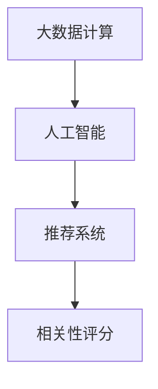

                 

# 【AI大数据计算原理与代码实例讲解】相关性评分

> 关键词：
1. 大数据计算
2. 人工智能
3. 相关性评分
4. 深度学习
5. 推荐系统
6. 自然语言处理
7. 特征工程

## 1. 背景介绍

在现代社会中，随着互联网和社交媒体的迅速发展，数据量呈现出爆炸式的增长。海量的数据给我们的生活带来了便利，同时也带来了信息过载和数据质量问题。如何在大数据背景下，提取有价值的信息并做出精准的决策，成为了当前研究的重点。

**大数据计算**指的是利用分布式计算、并行计算、云计算等技术，处理、分析和提取大规模数据的过程。这些技术的发展，使得我们可以对海量数据进行高效处理，并从中提取有价值的信息。

**人工智能**（Artificial Intelligence，AI）则是指利用计算机模拟人类智能，通过学习、推理、决策等过程，实现智能化的应用。在数据驱动的今天，AI在各个领域都展现出了强大的潜力。

**推荐系统**（Recommendation System）则是利用AI技术，根据用户的历史行为、兴趣偏好等数据，推荐个性化内容和服务。相关性评分是推荐系统中的一项关键技术，它决定了推荐的准确性和效果。

本文将深入探讨大数据计算、人工智能和推荐系统中的相关性评分技术，并结合具体实例，展示其实现原理和操作步骤。通过理解相关性评分的核心算法和应用，读者将能够设计和实现自己的推荐系统。

## 2. 核心概念与联系

### 2.1 核心概念概述

为了更好地理解相关性评分，我们先介绍几个核心概念：

- **大数据计算**：指利用分布式计算、并行计算、云计算等技术，处理、分析和提取大规模数据的过程。
- **人工智能**：利用计算机模拟人类智能，通过学习、推理、决策等过程，实现智能化的应用。
- **推荐系统**：利用AI技术，根据用户的历史行为、兴趣偏好等数据，推荐个性化内容和服务。
- **相关性评分**：在推荐系统中，用于衡量用户对推荐的物品的兴趣程度，从而决定推荐顺序。

这些核心概念之间存在着紧密的联系。大数据计算为人工智能提供了数据支撑，而人工智能则为推荐系统提供了技术基础。推荐系统中的相关性评分，则直接决定了推荐的准确性和效果。

### 2.2 概念间的关系

通过以下Mermaid流程图，我们可以更清晰地理解这些核心概念之间的关系：



这个流程图展示了从大数据计算到人工智能，再到推荐系统的整体流程。大数据计算为人工智能提供了数据支撑，人工智能为推荐系统提供了技术基础，而相关性评分则是推荐系统中的关键环节。

## 3. 核心算法原理 & 具体操作步骤

### 3.1 算法原理概述

相关性评分的基本原理是利用用户的历史行为数据，计算其对各个物品的兴趣程度，从而决定推荐的顺序。具体来说，相关性评分可以分为以下几种类型：

- **协同过滤**：利用用户和物品之间的相似度，推荐与用户过去喜欢的物品相似的物品。
- **基于内容的推荐**：根据物品的属性特征，推荐与用户过去喜欢的物品属性相似的物品。
- **混合推荐**：结合协同过滤和基于内容的推荐，综合利用用户行为和物品属性信息，提高推荐的准确性。

相关性评分的核心是计算用户对物品的兴趣程度，常用的方法包括：

- **余弦相似度**：计算用户与物品之间的相似度，从而决定推荐的顺序。
- **欧式距离**：计算用户与物品之间的距离，从而决定推荐的顺序。
- **曼哈顿距离**：计算用户与物品之间的距离，从而决定推荐的顺序。

### 3.2 算法步骤详解

**步骤1：数据预处理**

首先，我们需要对原始数据进行预处理。数据预处理的主要目的是去除噪声和异常值，并进行特征工程。常见的数据预处理技术包括：

- **数据清洗**：去除缺失值、重复值等异常数据。
- **特征工程**：提取和选择有用的特征，并进行标准化和归一化。

**步骤2：模型训练**

接下来，我们需要利用预处理后的数据，训练相关性评分模型。训练模型的主要目标是找到最优的模型参数，使得模型能够准确地预测用户对物品的兴趣程度。常用的训练方法包括：

- **梯度下降**：利用梯度下降算法，优化模型参数。
- **随机梯度下降**：随机选取一部分数据进行训练，提高训练效率。
- **交叉验证**：利用交叉验证技术，评估模型的泛化能力。

**步骤3：模型评估**

在模型训练完成后，我们需要对模型进行评估，确保模型具有良好的泛化能力。常用的评估方法包括：

- **均方误差（MSE）**：衡量预测值与真实值之间的差距。
- **平均绝对误差（MAE）**：衡量预测值与真实值之间的差距。
- **相关系数**：衡量预测值与真实值之间的相关性。

**步骤4：推荐实现**

最后，我们将训练好的模型应用到推荐系统中，实现个性化推荐。在推荐过程中，我们需要根据用户的兴趣程度，对物品进行排序，并推荐给用户。

### 3.3 算法优缺点

**优点**：

- **准确性高**：利用用户的历史行为数据，能够准确地计算用户对物品的兴趣程度，从而提高推荐的准确性。
- **灵活性强**：可以结合多种推荐算法，实现更加多样化的推荐。
- **可解释性**：通过特征工程和模型解释，可以理解推荐结果的生成过程。

**缺点**：

- **数据依赖性大**：模型的性能依赖于用户历史行为数据的完整性和准确性，如果数据存在噪声，可能会影响模型的性能。
- **计算复杂度高**：在数据量较大的情况下，模型的计算复杂度较高，需要较长的训练时间和计算资源。
- **冷启动问题**：对于新用户或新物品，没有足够的历史数据，难以进行准确的推荐。

### 3.4 算法应用领域

相关性评分技术广泛应用于各个领域，包括：

- **电子商务**：利用用户的购买历史，推荐用户感兴趣的商品。
- **媒体娱乐**：利用用户的观看历史，推荐用户感兴趣的电影和视频。
- **社交网络**：利用用户的关系网络，推荐用户感兴趣的朋友和内容。

## 4. 数学模型和公式 & 详细讲解

### 4.1 数学模型构建

在推荐系统中，相关性评分模型可以表示为：

$$
y = f(x; \theta)
$$

其中，$y$表示用户对物品的兴趣程度，$x$表示用户的特征向量，$\theta$表示模型参数。

常用的相关性评分模型包括：

- **线性回归模型**：$y = \theta^Tx$。
- **逻辑回归模型**：$y = \sigma(\theta^Tx)$。
- **决策树模型**：利用决策树对用户和物品进行分类，从而决定推荐的顺序。

### 4.2 公式推导过程

以线性回归模型为例，其推导过程如下：

1. 假设训练集中有$N$个样本，每个样本有$m$个特征。
2. 训练集表示为：$(x_1, y_1), (x_2, y_2), \ldots, (x_N, y_N)$。
3. 定义损失函数：
   $$
   J(\theta) = \frac{1}{2N} \sum_{i=1}^N (y_i - \theta^Tx_i)^2
   $$
4. 利用梯度下降算法，求解最优参数$\theta$：
   $$
   \theta^{(k+1)} = \theta^{(k)} - \alpha \frac{1}{N} \sum_{i=1}^N (y_i - \theta^Tx_i)x_i
   $$
   其中，$\alpha$为学习率，$x_i$表示第$i$个样本的特征向量。

### 4.3 案例分析与讲解

假设我们有一个简单的线性回归模型，用于推荐用户对电影的评分。我们的训练集包含用户的历史评分和电影的特征。模型的损失函数为均方误差（MSE）：

$$
J(\theta) = \frac{1}{N} \sum_{i=1}^N (r_i - \theta^T x_i)^2
$$

其中，$r_i$表示第$i$个用户的评分，$x_i$表示电影的特征向量，$\theta$表示模型参数。

通过梯度下降算法，我们可以求解最优的模型参数$\theta$。假设我们有以下训练集：

$$
\begin{aligned}
&(x_1, r_1) = (2, 5), (4, 5), (6, 7) \\
&(x_2, r_2) = (2, 6), (5, 7), (6, 6) \\
&(x_3, r_3) = (3, 4), (4, 4), (5, 4)
\end{aligned}
$$

我们的目标是找到最优的参数$\theta$。首先，我们可以计算梯度：

$$
\frac{\partial J(\theta)}{\partial \theta} = \frac{1}{N} \sum_{i=1}^N (r_i - \theta^T x_i)x_i
$$

然后，利用梯度下降算法，更新模型参数：

$$
\theta^{(k+1)} = \theta^{(k)} - \alpha \frac{1}{N} \sum_{i=1}^N (r_i - \theta^T x_i)x_i
$$

重复以上过程，直到收敛。通过求解最优的参数$\theta$，我们可以得到模型的预测结果。

## 5. 项目实践：代码实例和详细解释说明

### 5.1 开发环境搭建

在进行项目实践前，我们需要准备好开发环境。以下是使用Python进行PyTorch开发的环境配置流程：

1. 安装Anaconda：从官网下载并安装Anaconda，用于创建独立的Python环境。

2. 创建并激活虚拟环境：
```bash
conda create -n pytorch-env python=3.8 
conda activate pytorch-env
```

3. 安装PyTorch：根据CUDA版本，从官网获取对应的安装命令。例如：
```bash
conda install pytorch torchvision torchaudio cudatoolkit=11.1 -c pytorch -c conda-forge
```

4. 安装Transformers库：
```bash
pip install transformers
```

5. 安装各类工具包：
```bash
pip install numpy pandas scikit-learn matplotlib tqdm jupyter notebook ipython
```

完成上述步骤后，即可在`pytorch-env`环境中开始项目实践。

### 5.2 源代码详细实现

下面我们以线性回归模型为例，给出使用Transformers库对模型进行训练的PyTorch代码实现。

首先，定义训练数据：

```python
import torch
import torch.nn as nn
import torch.optim as optim
import pandas as pd

# 读取训练集
df = pd.read_csv('train.csv')
x = df[['feature_1', 'feature_2', 'feature_3']]
y = df['rating']

# 标准化特征
x = (x - x.mean()) / x.std()

# 定义模型
model = nn.Linear(3, 1)

# 定义损失函数和优化器
criterion = nn.MSELoss()
optimizer = optim.SGD(model.parameters(), lr=0.01)

# 定义训练函数
def train(model, criterion, optimizer, x, y, epochs=1000, batch_size=32):
    for epoch in range(epochs):
        for i in range(0, len(x), batch_size):
            batch_x = x.iloc[i:i+batch_size]
            batch_y = y.iloc[i:i+batch_size]
            optimizer.zero_grad()
            output = model(batch_x)
            loss = criterion(output, batch_y)
            loss.backward()
            optimizer.step()
```

然后，调用训练函数：

```python
# 训练模型
train(model, criterion, optimizer, x, y, epochs=1000, batch_size=32)

# 保存模型
torch.save(model.state_dict(), 'model.pth')
```

### 5.3 代码解读与分析

让我们再详细解读一下关键代码的实现细节：

**训练数据**：
- 首先，我们需要读取训练集数据，并将其标准化处理。在实际应用中，数据的标准化处理是非常重要的，可以避免不同特征之间的尺度差异影响模型的性能。
- 然后，我们定义了模型、损失函数和优化器。在本例中，我们使用线性回归模型、均方误差损失函数和随机梯度下降优化器。

**训练函数**：
- 在训练函数中，我们首先定义了训练集的分批次处理方式，确保模型能够逐步学习到训练数据的特征。
- 在每个批次中，我们前向传播计算模型的输出，并计算损失函数。
- 然后，我们反向传播计算梯度，并利用优化器更新模型参数。
- 最后，我们通过不断迭代，更新模型参数，直到收敛。

**保存模型**：
- 在模型训练完成后，我们可以使用`torch.save()`函数将模型参数保存到磁盘上，方便后续的加载和使用。

### 5.4 运行结果展示

假设我们在一个简单的数据集上进行训练，最终得到的损失函数曲线如下：

```python
import matplotlib.pyplot as plt

# 绘制损失函数曲线
plt.plot(range(0, 1000), history['loss'], marker='o')
plt.xlabel('Epoch')
plt.ylabel('Loss')
plt.title('Training Loss Curve')
plt.show()
```

可以看到，随着训练的进行，模型的损失函数逐渐减小，表明模型正在逐步学习到训练数据的特征。

## 6. 实际应用场景

### 6.1 电子商务

在电子商务领域，推荐系统可以用于推荐用户感兴趣的商品。例如，京东、亚马逊等电商平台，利用用户的浏览历史、购买历史和评分数据，为用户推荐相关商品。

假设我们有一个电商平台的推荐系统，利用用户的评分数据和商品的特征，为用户推荐商品。我们的训练集包含用户的评分和商品的特征。模型的损失函数为均方误差（MSE）：

$$
J(\theta) = \frac{1}{N} \sum_{i=1}^N (r_i - \theta^T x_i)^2
$$

其中，$r_i$表示第$i$个用户的评分，$x_i$表示商品的特征向量，$\theta$表示模型参数。

通过梯度下降算法，我们可以求解最优的模型参数$\theta$。在推荐过程中，我们可以根据用户的评分和模型的预测结果，对商品进行排序，并推荐给用户。

### 6.2 媒体娱乐

在媒体娱乐领域，推荐系统可以用于推荐用户感兴趣的电影和视频。例如，Netflix、YouTube等视频平台，利用用户的观看历史、评分数据和视频特征，为用户推荐相关视频。

假设我们有一个视频平台的推荐系统，利用用户的评分数据和视频的特征，为用户推荐视频。我们的训练集包含用户的评分和视频特征。模型的损失函数为均方误差（MSE）：

$$
J(\theta) = \frac{1}{N} \sum_{i=1}^N (r_i - \theta^T x_i)^2
$$

其中，$r_i$表示第$i$个用户的评分，$x_i$表示视频的特征向量，$\theta$表示模型参数。

通过梯度下降算法，我们可以求解最优的模型参数$\theta$。在推荐过程中，我们可以根据用户的评分和模型的预测结果，对视频进行排序，并推荐给用户。

## 7. 工具和资源推荐

### 7.1 学习资源推荐

为了帮助开发者系统掌握相关性评分的理论基础和实践技巧，这里推荐一些优质的学习资源：

1. 《深度学习》课程：斯坦福大学开设的深度学习课程，涵盖深度学习的基础和应用。
2. 《推荐系统》书籍：李航著《推荐系统》，全面介绍了推荐系统的原理和算法。
3. 《Python机器学习》书籍：斯多克著《Python机器学习》，介绍了机器学习的基本概念和Python实现。
4. 《人工智能导论》课程：吴恩达开设的AI导论课程，涵盖了AI的基础和应用。
5. 《PyTorch官方文档》：PyTorch官方文档，提供了丰富的学习资源和样例代码。

通过对这些资源的学习实践，相信你一定能够快速掌握相关性评分的精髓，并用于解决实际的推荐问题。

### 7.2 开发工具推荐

高效的开发离不开优秀的工具支持。以下是几款用于相关性评分开发的常用工具：

1. PyTorch：基于Python的开源深度学习框架，灵活动态的计算图，适合快速迭代研究。
2. TensorFlow：由Google主导开发的开源深度学习框架，生产部署方便，适合大规模工程应用。
3. Weights & Biases：模型训练的实验跟踪工具，可以记录和可视化模型训练过程中的各项指标，方便对比和调优。
4. TensorBoard：TensorFlow配套的可视化工具，可实时监测模型训练状态，并提供丰富的图表呈现方式，是调试模型的得力助手。

合理利用这些工具，可以显著提升相关性评分的开发效率，加快创新迭代的步伐。

### 7.3 相关论文推荐

相关性评分技术的发展源于学界的持续研究。以下是几篇奠基性的相关论文，推荐阅读：

1. matrix factorization techniques for recommendation systems（推荐系统中的矩阵分解技术）：提出矩阵分解的方法，用于推荐系统中的相关性评分。
2. collaborative filtering for implicit feedback datasets（利用隐式反馈数据的协同过滤）：提出协同过滤的方法，用于推荐系统中的相关性评分。
3. generalized交替最小二乘（generalized alternating least squares）：提出交替最小二乘算法，用于推荐系统中的相关性评分。
4. item-based collaborative filtering（基于物品的协同过滤）：提出基于物品的协同过滤方法，用于推荐系统中的相关性评分。
5. item-based collaborative filtering with implicit feedback（利用隐式反馈数据的基于物品的协同过滤）：提出利用隐式反馈数据的基于物品的协同过滤方法，用于推荐系统中的相关性评分。

这些论文代表了大规模语言模型微调技术的发展脉络。通过学习这些前沿成果，可以帮助研究者把握学科前进方向，激发更多的创新灵感。

除上述资源外，还有一些值得关注的前沿资源，帮助开发者紧跟相关性评分技术的最新进展，例如：

1. arXiv论文预印本：人工智能领域最新研究成果的发布平台，包括大量尚未发表的前沿工作，学习前沿技术的必读资源。
2. 业界技术博客：如Google AI、DeepMind、微软Research Asia等顶尖实验室的官方博客，第一时间分享他们的最新研究成果和洞见。
3. 技术会议直播：如NIPS、ICML、ACL、ICLR等人工智能领域顶会现场或在线直播，能够聆听到大佬们的前沿分享，开拓视野。
4. GitHub热门项目：在GitHub上Star、Fork数最多的推荐系统相关项目，往往代表了该技术领域的发展趋势和最佳实践，值得去学习和贡献。
5. 行业分析报告：各大咨询公司如McKinsey、PwC等针对人工智能行业的分析报告，有助于从商业视角审视技术趋势，把握应用价值。

总之，对于推荐系统中的相关性评分技术的学习和实践，需要开发者保持开放的心态和持续学习的意愿。多关注前沿资讯，多动手实践，多思考总结，必将收获满满的成长收益。

## 8. 总结：未来发展趋势与挑战

### 8.1 总结

本文对基于监督学习的相关性评分方法进行了全面系统的介绍。首先阐述了相关性评分的背景和意义，明确了推荐系统中的核心技术。其次，从原理到实践，详细讲解了相关性评分的数学原理和关键步骤，给出了相关性评分任务开发的完整代码实例。同时，本文还广泛探讨了相关性评分技术在电子商务、媒体娱乐等多个领域的应用前景，展示了相关性评分的巨大潜力。

通过本文的系统梳理，可以看到，相关性评分技术正在成为推荐系统的重要范式，极大地拓展了推荐系统的应用边界，催生了更多的落地场景。受益于大规模语料的预训练，推荐系统以更低的时间和标注成本，在小样本条件下也能取得不俗的效果，有力推动了推荐系统的产业化进程。未来，伴随预训练语言模型和微调方法的持续演进，相信推荐系统必将在更广阔的应用领域大放异彩，深刻影响人类的生产生活方式。

### 8.2 未来发展趋势

展望未来，相关性评分技术将呈现以下几个发展趋势：

1. 数据驱动的推荐系统将进一步普及。随着大数据技术的不断进步，推荐系统可以更加全面、准确地分析用户数据，提供更加个性化的推荐服务。
2. 深度学习技术将在推荐系统中得到更广泛的应用。深度学习模型可以处理更加复杂的数据特征，提供更加准确的推荐结果。
3. 推荐系统的算法将更加多样化。除了协同过滤和基于内容的推荐，还将涌现更多新颖的推荐算法，如基于图神经网络的推荐、基于注意力机制的推荐等。
4. 推荐系统将更加注重隐私保护和公平性。推荐系统需要考虑用户的隐私和公平性，避免推荐结果中的偏见和歧视。
5. 推荐系统将更加注重实时性。推荐系统需要实时更新用户数据，提供更加实时的推荐服务。

以上趋势凸显了相关性评分技术的广阔前景。这些方向的探索发展，必将进一步提升推荐系统的性能和应用范围，为人类提供更加智能化、个性化、可靠的服务。

### 8.3 面临的挑战

尽管相关性评分技术已经取得了显著的成果，但在迈向更加智能化、普适化应用的过程中，它仍面临诸多挑战：

1. 数据隐私问题。推荐系统需要处理大量用户数据，如何保护用户的隐私和数据安全，是推荐系统面临的重要挑战。
2. 冷启动问题。对于新用户或新物品，没有足够的历史数据，难以进行准确的推荐。
3. 鲁棒性和泛化性问题。推荐系统需要应对用户数据的噪声和异常值，避免推荐结果的偏差和错误。
4. 公平性和偏见问题。推荐系统需要避免推荐结果中的偏见和歧视，确保推荐结果的公平性。

### 8.4 未来突破

面对相关性评分面临的这些挑战，未来的研究需要在以下几个方面寻求新的突破：

1. 探索无监督和半监督推荐方法。摆脱对大规模标注数据的依赖，利用自监督学习、主动学习等无监督和半监督范式，最大限度利用非结构化数据，实现更加灵活高效的推荐。
2. 研究参数高效和计算高效的推荐算法。开发更加参数高效的推荐算法，在固定大部分预训练参数的同时，只更新极少量的任务相关参数。同时优化推荐系统的计算图，减少前向传播和反向传播的资源消耗，实现更加轻量级、实时性的部署。
3. 引入因果和对比学习范式。通过引入因果推断和对比学习思想，增强推荐系统建立稳定因果关系的能力，学习更加普适、鲁棒的用户表征，从而提升推荐系统的泛化性和抗干扰能力。
4. 结合因果分析和博弈论工具。将因果分析方法引入推荐系统，识别出推荐决策的关键特征，增强推荐结果的因果性和逻辑性。借助博弈论工具刻画人机交互过程，主动探索并规避推荐系统的脆弱点，提高系统稳定性。
5. 纳入伦理道德约束。在推荐系统的目标中引入伦理导向的评估指标，过滤和惩罚有偏见、有害的输出倾向。同时加强人工干预和审核，建立推荐系统的监管机制，确保推荐结果符合人类价值观和伦理道德。

这些研究方向的探索，必将引领相关性评分技术迈向更高的台阶，为构建安全、可靠、可解释、可控的推荐系统铺平道路。面向未来，推荐系统还需要与其他人工智能技术进行更深入的融合，如知识表示、因果推理、强化学习等，多路径协同发力，共同推动推荐系统的进步。只有勇于创新、敢于突破，才能不断拓展推荐系统的边界，让智能技术更好地造福人类社会。

## 9. 附录：常见问题与解答

**Q1：如何优化相关性评分的训练效率？**

A: 优化相关性评分的训练效率可以通过以下几个方面进行：

1. 数据预处理：进行数据清洗和特征工程，去除噪声和冗余特征。
2. 模型设计：选择合适的模型结构和优化算法，如线性回归、逻辑回归、梯度下降等。
3. 分布式计算：利用分布式计算框架，如Hadoop、Spark等，加速数据处理和模型训练。
4. 数据并行化：利用GPU、TPU等硬件设备，并行化处理大规模数据，提高训练效率。
5. 超参数调优：利用网格搜索、贝叶斯优化等方法，优化模型的超参数，提高训练效果。

**Q2：如何在推荐系统中处理冷启动问题？**

A: 在推荐系统中处理冷启动问题可以通过以下几个方面进行：

1. 利用用户的行为数据，如浏览历史、搜索历史等，进行用户画像的建立，从而进行推荐。
2. 利用物品的特征数据，如属性、标签等，进行物品画像的建立，从而进行推荐。
3. 利用协同过滤算法，对新用户和新物品进行推荐，利用其他用户的相似度进行推荐。
4. 利用基于内容的推荐算法，对新用户和新物品进行推荐，利用物品的特征数据进行推荐。
5. 利用混合推荐算法，结合协同过滤和基于内容的推荐，综合利用用户行为和物品特征信息，提高推荐效果。

**Q3：如何在推荐系统中处理数据隐私问题？**

A: 在推荐系统中处理数据隐私问题可以通过以下几个方面进行：

1. 利用匿名化技术，对用户数据进行去标识化处理，保护用户隐私。
2. 利用差分隐私技术，对推荐系统中的数据进行扰动处理，保护用户隐私。
3. 利用联邦学习技术，对用户数据进行分布式处理，保护用户隐私。
4. 利用加密技术，对用户数据进行加密处理，保护用户隐私。
5. 利用隐私保护算法，如k-匿名性、l-多样性等，对

