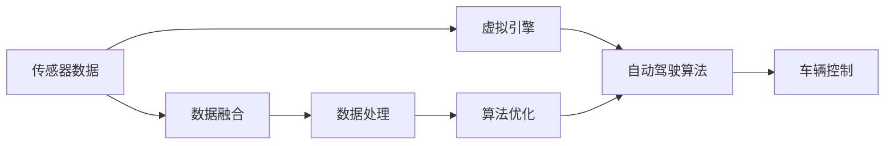

                 

# 端到端自动驾驶的车载计算平台虚拟化

> 关键词：自动驾驶, 车载计算平台, 虚拟化, 虚拟引擎, 自动驾驶算法

## 1. 背景介绍

自动驾驶技术的发展，使我们的出行方式正在发生翻天覆地的变化。从最初的实验室研究，到如今部分高级别自动驾驶系统在特定区域和特定场景下落地应用，自动驾驶正逐步成为现实。然而，要想真正实现自动驾驶大规模商业化应用，构建高性能、低延迟、高可靠性的车载计算平台是关键。

## 2. 核心概念与联系

### 2.1 核心概念概述

在自动驾驶系统中，车载计算平台扮演着核心角色，负责感知、决策和控制。基于虚拟化的车载计算平台，通过抽象和隔离硬件资源，提高了算力利用率和系统可靠性，为自动驾驶算法提供了良好的运行环境。

- **自动驾驶**：使用人工智能技术，让车辆具备在特定环境下自动驾驶的能力，包括但不限于感知、决策和控制。
- **车载计算平台**：用于自动驾驶的硬件和软件平台，负责处理传感器数据，运行自动驾驶算法，控制车辆行驶。
- **虚拟化**：通过软件模拟硬件，实现对物理资源的抽象和隔离。
- **虚拟引擎**：支持自动驾驶算法运行的软件环境，负责资源分配、调度、隔离等。
- **自动驾驶算法**：包括感知算法（如激光雷达、摄像头、雷达等传感器数据处理）、决策算法（如路径规划、行为预测等）和控制算法（如转向、加速、刹车等）。

### 2.2 概念间的关系

这些核心概念间的关系如下图所示：


自动驾驶算法运行在虚拟引擎上，虚拟引擎则建立在虚拟化技术之上，虚拟化实现了硬件资源的隔离和抽象，车载计算平台则提供物理硬件支持。

### 2.3 核心概念的整体架构

整个系统架构如下图所示：



传感器数据通过数据融合模块进行整合和预处理，再经过数据处理模块优化后进入自动驾驶算法。自动驾驶算法通过虚拟引擎实现虚拟化，并最终控制车辆行驶。

## 3. 核心算法原理 & 具体操作步骤
### 3.1 算法原理概述

虚拟化技术通过在物理硬件之上构建虚拟平台，实现了对资源的抽象和隔离，使多个应用程序可以在同一物理硬件上独立运行，互不干扰。在自动驾驶系统中，虚拟化技术可以保证自动驾驶算法在一个独立的环境中运行，隔离了系统中的噪声和干扰，提高了系统稳定性和可靠性。

虚拟引擎则是虚拟化的具体实现，它将计算资源、内存资源、网络资源等进行抽象和封装，提供给虚拟化平台使用。虚拟引擎的核心功能包括资源分配、调度、隔离等。

### 3.2 算法步骤详解

自动驾驶系统的虚拟化可以分为以下几个步骤：

1. **物理资源抽象**：对物理硬件（如CPU、内存、存储、网络等）进行抽象，形成虚拟硬件资源池。
2. **资源分配与调度**：根据不同应用（如感知、决策、控制等）的需求，动态分配虚拟资源，并进行实时调度。
3. **资源隔离**：使用虚拟化技术对各个应用的资源进行隔离，避免应用间互相干扰。
4. **应用部署与运行**：将自动驾驶算法部署到虚拟引擎上，实现独立运行和资源管理。

### 3.3 算法优缺点

虚拟化技术在自动驾驶系统中具有以下优点：

1. **资源利用率高**：虚拟化技术实现了资源的抽象和隔离，使得多个应用可以在同一物理硬件上独立运行，提高了硬件利用率。
2. **系统可靠性好**：通过隔离技术，虚拟化平台可以保证每个应用在独立的环境中运行，避免了应用间互相干扰，提高了系统可靠性。
3. **应用灵活性强**：虚拟化技术使得应用可以灵活地部署和调度，易于扩展和升级。

同时，虚拟化技术也存在一些缺点：

1. **硬件需求高**：虚拟化需要高性能硬件支持，如多核CPU、大容量内存、高速存储等，对硬件要求较高。
2. **性能损失**：虚拟化平台需要在物理硬件之上增加一层软件抽象层，增加了性能开销。
3. **管理复杂**：虚拟化平台需要复杂的资源管理机制，增加了系统管理的复杂度。

### 3.4 算法应用领域

虚拟化技术在自动驾驶系统中具有广泛的应用前景，主要应用于以下几个方面：

1. **感知算法**：通过虚拟化平台，可以实现感知算法（如激光雷达、摄像头、雷达等传感器数据处理）的独立运行和资源优化。
2. **决策算法**：将决策算法（如路径规划、行为预测等）部署在虚拟引擎上，实现独立运行和资源管理。
3. **控制算法**：将控制算法（如转向、加速、刹车等）部署在虚拟引擎上，实现独立运行和资源管理。
4. **仿真与测试**：虚拟化平台可以实现对自动驾驶算法的高精度仿真与测试，加速算法的迭代与优化。
5. **数据存储与管理**：通过虚拟化技术，可以实现对传感器数据的集中存储和管理，提高数据处理的效率。

## 4. 数学模型和公式 & 详细讲解
### 4.1 数学模型构建

在自动驾驶系统中，虚拟化平台需要实现对计算资源、内存资源、存储资源、网络资源的抽象和封装。具体数学模型如下：

1. **计算资源**：设物理硬件有$m$个CPU核心，每个核心的计算能力为$c$，则虚拟化平台可以将$m$个CPU核心抽象为$n$个虚拟CPU核心，每个虚拟CPU核心的计算能力为$C$，则$C=\frac{c}{n}$。
2. **内存资源**：设物理内存有$t$GB，每个虚拟CPU核心的内存为$m$GB，则虚拟化平台可以将$t$GB内存抽象为$n$个虚拟内存池，每个虚拟内存池的内存大小为$T$，则$T=\frac{t}{n}$。
3. **存储资源**：设物理存储有$s$GB，每个虚拟内存池的存储大小为$S$，则$S=\frac{s}{n}$。
4. **网络资源**：设物理网络带宽为$b$，每个虚拟CPU核心的带宽为$B$，则$B=\frac{b}{n}$。

### 4.2 公式推导过程

以计算资源为例，推导虚拟CPU核心与物理CPU核心的计算能力关系：

设虚拟化平台将$m$个物理CPU核心抽象为$n$个虚拟CPU核心，则每个虚拟CPU核心的计算能力为$C$，与物理CPU核心的计算能力$c$的关系为：

$$C=\frac{c}{n}$$

这个公式表明，虚拟CPU核心的计算能力与物理CPU核心的计算能力成正比，但受限于虚拟化平台的抽象比例$n$。

### 4.3 案例分析与讲解

以自动驾驶系统的感知算法为例，分析虚拟化技术的应用。

设自动驾驶系统的感知算法需要$k$个CPU核心，虚拟化平台将$m$个物理CPU核心抽象为$n$个虚拟CPU核心，则$k$个CPU核心的分配方式如下：

1. 将$k$个CPU核心分配给$n$个虚拟CPU核心，每个虚拟CPU核心分配$\frac{k}{n}$个CPU核心。
2. 计算资源分配后，每个虚拟CPU核心的计算能力为$C=\frac{c}{n}$。

假设$m=8$，$k=4$，$n=2$，则：

$$C=\frac{c}{n}=\frac{8}{4}=2$$

即每个虚拟CPU核心的计算能力为2核心。

## 5. 项目实践：代码实例和详细解释说明
### 5.1 开发环境搭建

在搭建自动驾驶系统的虚拟化平台时，需要以下开发环境：

1. **硬件平台**：高性能的物理硬件，如多核CPU、大容量内存、高速存储等。
2. **操作系统**：支持虚拟化技术的Linux操作系统，如Ubuntu、CentOS等。
3. **虚拟化工具**：支持虚拟化技术的工具，如VMware、KVM等。
4. **编程语言**：支持虚拟化开发的工具和语言，如C++、Python等。
5. **开发工具**：支持虚拟化开发的工具，如Visual Studio、Eclipse等。

### 5.2 源代码详细实现

以下是使用KVM（Kernel-based Virtual Machine）实现自动驾驶系统虚拟化平台的示例代码：

```python
import subprocess
import os

# 创建虚拟机
def create_virtual_machine():
    command = 'kvm create --cpu-cores 4 --memory 8192 --disk size 40 --net nic tap --graphics spice --os-loader vmware-linux-static --os-type linux --os-args "console=ttyS0"'
    subprocess.run(command, shell=True)

# 启动虚拟机
def start_virtual_machine():
    command = 'kvm run --cpu-cores 4 --memory 8192 --disk size 40 --net nic tap --graphics spice --os-loader vmware-linux-static --os-type linux --os-args "console=ttyS0"'
    subprocess.run(command, shell=True)

# 停止虚拟机
def stop_virtual_machine():
    command = 'kvm destroy <vm_name>'
    subprocess.run(command, shell=True)
```

### 5.3 代码解读与分析

以上代码使用了KVM虚拟化工具，实现了创建、启动和停止虚拟机的功能。具体实现如下：

1. **创建虚拟机**：使用`kvm create`命令创建虚拟机，指定CPU核心数、内存大小、磁盘大小、网络类型、图形类型、操作系统类型和启动参数。
2. **启动虚拟机**：使用`kvm run`命令启动虚拟机，指定CPU核心数、内存大小、磁盘大小、网络类型、图形类型、操作系统类型和启动参数。
3. **停止虚拟机**：使用`kvm destroy`命令停止虚拟机，指定虚拟机名称。

这些命令和参数可以根据实际需求进行调整，以达到最佳的虚拟化效果。

### 5.4 运行结果展示

以下是虚拟化平台的使用示例：

```
# 创建虚拟机
$ kvm create --cpu-cores 4 --memory 8192 --disk size 40 --net nic tap --graphics spice --os-loader vmware-linux-static --os-type linux --os-args "console=ttyS0"
# 启动虚拟机
$ kvm run --cpu-cores 4 --memory 8192 --disk size 40 --net nic tap --graphics spice --os-loader vmware-linux-static --os-type linux --os-args "console=ttyS0"
# 停止虚拟机
$ kvm destroy <vm_name>
```

## 6. 实际应用场景
### 6.1 自动驾驶系统

虚拟化技术在自动驾驶系统中具有广泛的应用前景。虚拟化平台可以为自动驾驶算法提供独立、可靠的运行环境，提高算法的性能和稳定性。

在自动驾驶系统中，虚拟化平台可以提供以下功能：

1. **资源隔离**：将感知、决策、控制等不同算法的计算资源进行隔离，避免算法间互相干扰。
2. **资源优化**：根据不同算法的资源需求，动态分配虚拟资源，提高资源利用率。
3. **故障隔离**：当一个算法发生故障时，不影响其他算法的正常运行。
4. **系统扩展**：方便添加新的算法和功能，支持系统的扩展和升级。

### 6.2 智能交通系统

虚拟化技术可以用于智能交通系统的建设，提高交通管理的效率和安全性。

在智能交通系统中，虚拟化平台可以提供以下功能：

1. **数据融合**：将来自不同传感器的数据进行融合，提高数据的准确性和可靠性。
2. **路径规划**：将路径规划算法部署在虚拟引擎上，实现独立运行和资源管理。
3. **车辆控制**：将车辆控制算法部署在虚拟引擎上，实现独立运行和资源管理。
4. **仿真与测试**：使用虚拟化平台进行高精度仿真和测试，加速算法的迭代与优化。
5. **数据存储与管理**：集中存储和管理传感器数据，提高数据处理的效率。

### 6.3 智慧城市系统

虚拟化技术可以用于智慧城市系统的建设，提升城市管理的智能化水平。

在智慧城市系统中，虚拟化平台可以提供以下功能：

1. **数据融合**：将来自不同传感器的数据进行融合，提高数据的准确性和可靠性。
2. **路径规划**：将路径规划算法部署在虚拟引擎上，实现独立运行和资源管理。
3. **车辆控制**：将车辆控制算法部署在虚拟引擎上，实现独立运行和资源管理。
4. **仿真与测试**：使用虚拟化平台进行高精度仿真和测试，加速算法的迭代与优化。
5. **数据存储与管理**：集中存储和管理传感器数据，提高数据处理的效率。

## 7. 工具和资源推荐
### 7.1 学习资源推荐

为了帮助开发者掌握虚拟化技术，以下是一些推荐的资源：

1. **《KVM虚拟化技术》**：介绍了KVM虚拟化技术的原理、实现和应用。
2. **《VMware vSphere虚拟化技术》**：介绍了VMware vSphere虚拟化技术的原理、实现和应用。
3. **《Xen虚拟化技术》**：介绍了Xen虚拟化技术的原理、实现和应用。
4. **《Virtualization: The Complete Guide》**：介绍了虚拟化技术的全面知识和实践经验。
5. **《KVM与虚拟化技术》课程**：介绍KVM虚拟化技术的原理、实现和应用，包括虚拟机的创建、启动、停止等。

### 7.2 开发工具推荐

以下是一些推荐的虚拟化开发工具：

1. **KVM**：Kernel-based Virtual Machine，开源虚拟化技术，支持多款操作系统。
2. **VMware**：商业虚拟化技术，支持多款操作系统，功能丰富。
3. **Xen**：开源虚拟化技术，支持多款操作系统。
4. **VirtualBox**：开源虚拟化技术，支持多款操作系统。
5. **QEMU**：开源虚拟化技术，支持多款操作系统，功能强大。

### 7.3 相关论文推荐

以下是一些推荐的虚拟化相关论文：

1. **《Xen虚拟化技术》**：研究Xen虚拟化技术的原理和应用。
2. **《KVM虚拟化技术》**：研究KVM虚拟化技术的原理和应用。
3. **《VMware vSphere虚拟化技术》**：研究VMware vSphere虚拟化技术的原理和应用。
4. **《Virtualization: The Complete Guide》**：介绍虚拟化技术的全面知识和实践经验。
5. **《Virtual Machine Security》**：研究虚拟化平台的安全性问题，包括资源隔离、故障隔离等。

## 8. 总结：未来发展趋势与挑战
### 8.1 研究成果总结

虚拟化技术在自动驾驶系统中具有广泛的应用前景，可以提高算法的性能和稳定性，为自动驾驶算法提供独立、可靠的运行环境。

### 8.2 未来发展趋势

虚拟化技术在自动驾驶系统中的应用将会不断深入和发展，主要趋势包括：

1. **高性能虚拟化**：虚拟化平台将采用更多先进的技术，如GPU虚拟化、网络虚拟化等，提高系统的性能和效率。
2. **自动化管理**：虚拟化平台将采用自动化管理技术，提高系统的管理效率和可靠性。
3. **跨平台兼容**：虚拟化平台将支持更多平台和操作系统，提高系统的兼容性和扩展性。
4. **安全与隐私**：虚拟化平台将更加注重安全与隐私保护，提高系统的安全性。

### 8.3 面临的挑战

虚拟化技术在自动驾驶系统中仍面临一些挑战：

1. **硬件资源限制**：虚拟化平台需要高性能的物理硬件支持，如多核CPU、大容量内存、高速存储等，对硬件资源要求较高。
2. **性能损失**：虚拟化平台需要在物理硬件之上增加一层软件抽象层，增加了性能开销。
3. **管理复杂**：虚拟化平台需要复杂的资源管理机制，增加了系统管理的复杂度。

### 8.4 研究展望

未来，虚拟化技术在自动驾驶系统中的应用将会更加广泛和深入，主要研究方向包括：

1. **高性能虚拟化**：采用更多先进技术，如GPU虚拟化、网络虚拟化等，提高系统的性能和效率。
2. **自动化管理**：采用自动化管理技术，提高系统的管理效率和可靠性。
3. **跨平台兼容**：支持更多平台和操作系统，提高系统的兼容性和扩展性。
4. **安全与隐私**：注重安全与隐私保护，提高系统的安全性。

总之，虚拟化技术在自动驾驶系统中具有广阔的应用前景，需要不断地进行技术创新和优化，以满足自动驾驶系统对高性能、高可靠性和高安全性的要求。

## 9. 附录：常见问题与解答

**Q1：虚拟化技术在自动驾驶系统中有哪些应用？**

A: 虚拟化技术在自动驾驶系统中具有广泛的应用前景，主要应用于以下几个方面：

1. **资源隔离**：将感知、决策、控制等不同算法的计算资源进行隔离，避免算法间互相干扰。
2. **资源优化**：根据不同算法的资源需求，动态分配虚拟资源，提高资源利用率。
3. **故障隔离**：当一个算法发生故障时，不影响其他算法的正常运行。
4. **系统扩展**：方便添加新的算法和功能，支持系统的扩展和升级。

**Q2：如何选择合适的虚拟化平台？**

A: 选择合适的虚拟化平台需要考虑以下因素：

1. **性能**：虚拟化平台需要高性能的物理硬件支持，如多核CPU、大容量内存、高速存储等，对硬件资源要求较高。
2. **功能**：虚拟化平台需要具备丰富的功能，如资源管理、故障隔离、自动化管理等。
3. **兼容性**：虚拟化平台需要支持多种操作系统和平台，提高系统的兼容性和扩展性。
4. **成本**：虚拟化平台需要综合考虑成本，如开源平台和商业平台的选择。

**Q3：虚拟化技术在自动驾驶系统中的性能损失有多大？**

A: 虚拟化平台需要在物理硬件之上增加一层软件抽象层，增加了性能开销。具体性能损失取决于虚拟化平台的实现方式和硬件性能，一般采用硬件加速和软件优化相结合的方式，可以有效降低性能损失。

**Q4：虚拟化技术在自动驾驶系统中的安全性如何？**

A: 虚拟化平台需要注重安全与隐私保护，主要通过资源隔离、故障隔离、安全监控等手段提高系统的安全性。同时，虚拟化平台需要定期进行安全审计和漏洞修复，确保系统的安全性。

**Q5：虚拟化技术在自动驾驶系统中的扩展性如何？**

A: 虚拟化平台具有良好的扩展性，可以根据需求灵活地添加新的算法和功能。同时，虚拟化平台需要支持横向扩展和纵向扩展，提高系统的扩展性和可维护性。

总之，虚拟化技术在自动驾驶系统中具有重要的作用，需要不断地进行技术创新和优化，以满足自动驾驶系统对高性能、高可靠性和高安全性的要求。

---

作者：禅与计算机程序设计艺术 / Zen and the Art of Computer Programming

