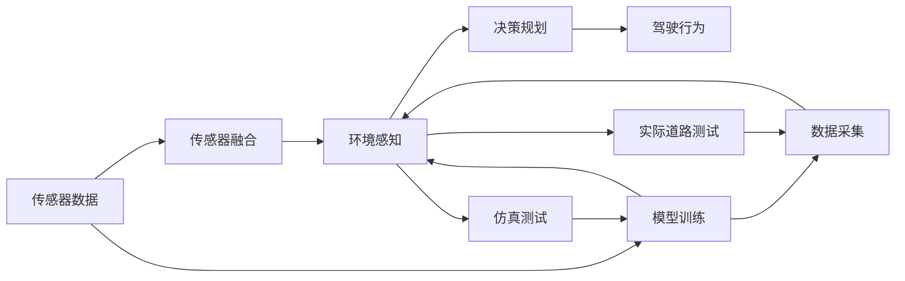
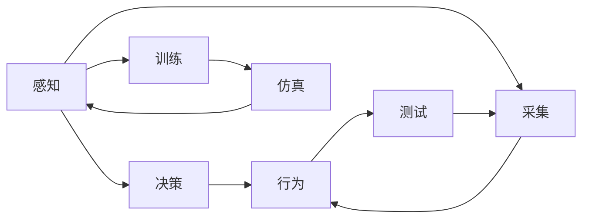
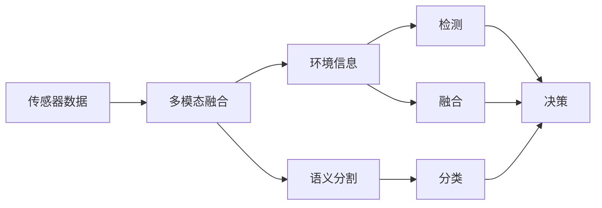

                 

# 端到端自动驾驶系统：高端的端

> 关键词：自动驾驶, 端到端系统, 传感器融合, 环境感知, 决策规划, 模型训练, 仿真测试, 数据采集, 实际道路测试

## 1. 背景介绍

随着人工智能和计算机视觉技术的快速发展，自动驾驶技术正逐渐走向成熟。传统的自动驾驶系统往往依赖于多个独立组件，如雷达、激光雷达、摄像头等传感器，以及图像处理、物体检测、路径规划等模块，系统复杂度高，难以实现全局优化。而端到端自动驾驶系统(E2E-AD)直接从传感器输入出发，经过环境感知、决策规划等步骤，直接生成驾驶行为输出，省去了中间模块的复杂性和开销，具有更高的实时性和可扩展性。

端到端系统通常使用深度学习技术进行模型训练，通过大样本数据集和强大的计算资源，训练出具有复杂决策能力的深度神经网络。模型融合了多模态数据，并能够端到端地进行训练和推理，因此能够更加高效地适应复杂多变的驾驶环境，具有潜在的巨大应用前景。

## 2. 核心概念与联系

### 2.1 核心概念概述

为更好地理解端到端自动驾驶系统，本节将介绍几个关键概念：

- **端到端自动驾驶系统(E2E-AD)**：一种通过深度学习模型直接从传感器输入到驾驶行为输出的自动驾驶解决方案。系统通过学习从原始传感器数据到驾驶行为的全流程，能够实现更加高效和稳定的自动驾驶。

- **传感器融合**：将来自不同传感器（如雷达、激光雷达、摄像头等）的感知信息进行整合，生成统一的感知结果，提高系统的鲁棒性和准确性。

- **环境感知**：自动驾驶系统对周围环境的感知，包括道路、车辆、行人、交通标志等元素的检测和识别。

- **决策规划**：基于环境感知结果，自动驾驶系统进行路径规划和行为决策，生成合适的驾驶策略。

- **模型训练**：通过大量标注数据，对自动驾驶模型进行训练，优化其性能和鲁棒性。

- **仿真测试**：在模拟环境中对自动驾驶模型进行测试，验证其性能和安全特性。

- **数据采集**：从真实驾驶环境中收集数据，为模型训练提供更丰富的训练素材。

- **实际道路测试**：在实际道路环境中测试自动驾驶模型的性能，并进行现场验证。

这些核心概念之间的逻辑关系可以通过以下Mermaid流程图来展示：



这个流程图展示了端到端自动驾驶系统的核心组件及其交互关系：

1. 传感器数据从原始输入开始，通过传感器融合生成统一的感知结果。
2. 感知结果进入环境感知模块，进行目标检测、语义分割等任务。
3. 环境感知结果用于决策规划，生成行驶策略和行为指令。
4. 决策结果转化为具体的驾驶行为输出。
5. 同时，传感器数据也用于模型训练，以优化模型性能。
6. 模型在仿真测试环境中进行验证，确保其可靠性。
7. 数据采集和实际道路测试进一步提升模型的泛化能力和适应性。

### 2.2 概念间的关系

这些核心概念之间存在着紧密的联系，形成了端到端自动驾驶系统的完整框架。下面是几个相关的Mermaid流程图，进一步展示这些概念之间的联系：

#### 2.2.1 端到端系统与感知、决策的关系



这个流程图展示了感知和决策模块的输入输出关系及其与训练、仿真和测试环节的互动：

1. 感知模块通过传感器数据生成环境信息，为决策模块提供输入。
2. 决策模块基于感知结果生成行为指令。
3. 感知和决策模块通过训练数据集进行模型优化。
4. 模型在仿真环境中进行测试，验证感知和决策的准确性。
5. 实际道路测试进一步验证模型的性能。

#### 2.2.2 感知模块与多模态融合



这个流程图展示了多模态融合的过程及其对检测和分类的影响：

1. 来自不同传感器的数据被融合，生成统一的环境信息。
2. 融合后的数据用于目标检测和语义分割，生成更精确的感知结果。
3. 检测结果和分类结果被用于决策生成。
4. 融合后的数据也用于提升系统的鲁棒性和准确性。

## 3. 核心算法原理 & 具体操作步骤

### 3.1 算法原理概述

端到端自动驾驶系统的核心算法包括传感器融合、环境感知、决策规划等，其算法原理如下：

- **传感器融合**：通过卡尔曼滤波、加权平均等技术，将来自不同传感器的数据进行加权融合，生成一致的环境感知结果。

- **环境感知**：利用深度学习模型（如CNN、YOLO等）进行目标检测、语义分割等任务，生成环境信息。

- **决策规划**：通过强化学习、深度强化学习等技术，生成最优的驾驶策略和行为指令。

- **模型训练**：通过监督学习、无监督学习、强化学习等技术，训练环境感知和决策规划模型。

- **仿真测试**：在虚拟仿真环境中，根据特定交通规则和场景，对自动驾驶模型进行测试，评估其性能和安全特性。

### 3.2 算法步骤详解

#### 3.2.1 传感器数据采集与融合

1. **传感器数据采集**：通过各种传感器（如雷达、激光雷达、摄像头等）采集实时数据。
2. **传感器数据预处理**：对采集的数据进行去噪、校正、同步等预处理操作。
3. **多模态数据融合**：使用卡尔曼滤波、加权平均等方法，将不同传感器数据进行融合，生成一致的环境感知结果。

#### 3.2.2 环境感知与检测

1. **目标检测**：使用深度学习模型进行目标检测，识别道路、车辆、行人等元素。
2. **语义分割**：对检测结果进行语义分割，生成每个元素的具体类别和位置信息。
3. **物体跟踪**：使用跟踪算法（如 Kalman Filter、粒子滤波等），对检测结果进行实时跟踪，确保目标的连续性。

#### 3.2.3 决策规划与行为生成

1. **路径规划**：根据感知结果，生成全局路径规划策略，如 lanes、lanes change、stop等。
2. **行为决策**：基于路径规划结果，生成具体的驾驶行为指令，如加速、减速、变道等。
3. **行为执行**：根据行为指令，控制车辆执行相应的驾驶动作，确保安全、高效地行驶。

#### 3.2.4 模型训练与优化

1. **训练数据集准备**：收集大量标注数据，准备用于模型训练的数据集。
2. **模型训练**：使用监督学习、无监督学习、强化学习等技术，训练环境感知和决策规划模型。
3. **模型评估**：在仿真环境中，对训练好的模型进行评估，验证其性能和鲁棒性。
4. **模型优化**：根据评估结果，调整模型结构和训练策略，进行超参数调优。

#### 3.2.5 仿真测试与实际道路测试

1. **仿真测试**：在虚拟仿真环境中，对模型进行测试，评估其在各种交通场景下的性能。
2. **实际道路测试**：在实际道路上，对模型进行测试，验证其在真实环境中的表现。
3. **现场验证**：通过实际道路测试，进一步验证模型的可靠性和安全性。

### 3.3 算法优缺点

**优点**：

1. **实时性高**：端到端系统通过单一模型直接生成驾驶行为，减少了中间模块的延迟，提高了实时性。
2. **可扩展性强**：系统结构简单，易于扩展和优化，能够适应不同的应用场景和需求。
3. **泛化能力强**：通过多模态数据融合和深度学习模型的迁移学习，系统具备较强的泛化能力，能够在复杂环境下稳定运行。

**缺点**：

1. **训练数据需求高**：端到端系统需要大量的标注数据进行训练，数据采集和标注成本较高。
2. **模型复杂度高**：系统依赖于深度学习模型，模型复杂度较高，训练和推理资源需求大。
3. **模型鲁棒性差**：系统对感知结果的依赖性强，对噪声和干扰的鲁棒性较低，容易受到外界环境的影响。

### 3.4 算法应用领域

端到端自动驾驶系统在自动驾驶、智能交通、物流配送等领域具有广泛的应用前景：

- **自动驾驶**：在自动驾驶汽车、无人机、无人车等场景中，端到端系统能够直接从传感器数据生成驾驶行为，提升自动驾驶的安全性和可靠性。
- **智能交通**：在交通管理、智能交通信号控制等场景中，端到端系统能够实时感知和响应交通状况，优化交通流量，提高道路通行效率。
- **物流配送**：在无人配送、自动仓储等场景中，端到端系统能够实现智能调度、路径规划和行为决策，提升配送效率和准确性。

## 4. 数学模型和公式 & 详细讲解 & 举例说明

### 4.1 数学模型构建

端到端自动驾驶系统的数学模型主要涉及传感器数据融合、目标检测、路径规划和行为生成等方面。以下是几个关键模型的数学建模过程：

#### 4.1.1 传感器数据融合模型

设传感器数据分别为 $x_1, x_2, ..., x_n$，其中 $x_i$ 表示第 $i$ 个传感器的测量结果。融合后的环境信息为 $z$，融合过程可以用卡尔曼滤波模型表示：

$$
z = K \sum_{i=1}^n w_i x_i + (1 - \sum_{i=1}^n w_i) \overline{x}
$$

其中 $K$ 为融合系数，$w_i$ 为第 $i$ 个传感器的权重，$\overline{x}$ 为传感器数据的均值。

#### 4.1.2 目标检测模型

目标检测模型通常使用深度学习模型（如CNN、YOLO等）。设输入图像为 $I$，输出为目标框 $B$，模型可以表示为：

$$
B = f(I; \theta)
$$

其中 $f$ 为检测模型的映射函数，$\theta$ 为模型参数。

#### 4.1.3 路径规划模型

路径规划模型通常使用强化学习技术，设环境状态为 $S$，动作为 $A$，奖励函数为 $R$，路径规划过程可以用 Q-learning 模型表示：

$$
Q(S, A) = Q(S, A) + \alpha \left(R(S, A) + \gamma \max_{A'} Q(S', A'); \theta \right)
$$

其中 $\alpha$ 为学习率，$\gamma$ 为折扣因子，$S'$ 为下一个状态。

#### 4.1.4 行为生成模型

行为生成模型通常使用深度学习模型（如 RNN、LSTM 等），设输入为感知结果 $Z$，输出为行为指令 $U$，模型可以表示为：

$$
U = g(Z; \phi)
$$

其中 $g$ 为行为生成模型的映射函数，$\phi$ 为模型参数。

### 4.2 公式推导过程

#### 4.2.1 卡尔曼滤波公式推导

卡尔曼滤波是一种常用的传感器数据融合方法，其核心公式为：

$$
\begin{aligned}
P &= A_{t-1}P_{t-1}A_{t-1}^T + Q_t \\
K &= P_{t-1}H^T (H P_{t-1}H^T + R)^{-1} \\
z_t &= H x_{t-1} + w_t \\
x_t &= x_{t-1} + K (z_t - H x_{t-1})
\end{aligned}
$$

其中 $P$ 为状态协方差矩阵，$A_{t-1}$ 为状态转移矩阵，$Q_t$ 为过程噪声协方差矩阵，$K$ 为滤波增益矩阵，$H$ 为观测矩阵，$w_t$ 为观测噪声，$x_t$ 为状态向量，$z_t$ 为观测向量。

#### 4.2.2 Q-learning 公式推导

Q-learning 是一种常用的强化学习方法，其核心公式为：

$$
Q(S, A) = (1 - \alpha) Q(S, A) + \alpha \left(R(S, A) + \gamma \max_{A'} Q(S', A'); \theta \right)
$$

其中 $\alpha$ 为学习率，$\gamma$ 为折扣因子，$S'$ 为下一个状态，$A'$ 为下一个动作。

#### 4.2.3 深度学习模型公式推导

深度学习模型通常使用反向传播算法进行训练，其核心公式为：

$$
\frac{\partial \mathcal{L}}{\partial \theta} = \frac{\partial \mathcal{L}}{\partial Z} \frac{\partial Z}{\partial \theta}
$$

其中 $\mathcal{L}$ 为损失函数，$Z$ 为模型输出，$\theta$ 为模型参数，$\frac{\partial \mathcal{L}}{\partial Z}$ 为损失对输出的梯度，$\frac{\partial Z}{\partial \theta}$ 为输出对参数的梯度。

### 4.3 案例分析与讲解

#### 4.3.1 目标检测案例

设输入图像为 $I$，输出目标框为 $B$，使用 YOLO 模型进行目标检测。假设模型参数为 $\theta$，输入为 $I$，输出为 $B$，训练集为 $D$，损失函数为 $\mathcal{L}$，则目标检测的训练过程可以表示为：

$$
\min_{\theta} \frac{1}{N} \sum_{(x_i, y_i) \in D} \mathcal{L}(y_i; f(I; \theta))
$$

其中 $x_i$ 为输入图像，$y_i$ 为标注框，$f$ 为检测模型的映射函数。

#### 4.3.2 路径规划案例

设环境状态为 $S$，动作为 $A$，奖励函数为 $R$，使用 Q-learning 进行路径规划。假设模型参数为 $\theta$，状态为 $S$，动作为 $A$，奖励为 $R$，下一个状态为 $S'$，下一个动作为 $A'$，则路径规划的训练过程可以表示为：

$$
\min_{\theta} \sum_{(S, A, R, S', A')} \left(Q(S, A) - (R(S, A) + \gamma Q(S', A')); \theta \right)^2
$$

其中 $\theta$ 为模型参数，$S$ 为状态，$A$ 为动作，$R$ 为奖励，$S'$ 为下一个状态，$A'$ 为下一个动作。

#### 4.3.3 行为生成案例

设输入为感知结果 $Z$，输出为行为指令 $U$，使用 RNN 模型进行行为生成。假设模型参数为 $\theta$，输入为 $Z$，输出为 $U$，训练集为 $D$，损失函数为 $\mathcal{L}$，则行为生成的训练过程可以表示为：

$$
\min_{\theta} \frac{1}{N} \sum_{(z_i, u_i) \in D} \mathcal{L}(u_i; g(Z; \theta))
$$

其中 $z_i$ 为感知结果，$u_i$ 为标注行为，$g$ 为行为生成模型的映射函数。

## 5. 项目实践：代码实例和详细解释说明

### 5.1 开发环境搭建

在进行端到端自动驾驶系统的开发时，需要准备好开发环境。以下是使用Python进行PyTorch开发的流程：

1. 安装Anaconda：从官网下载并安装Anaconda，用于创建独立的Python环境。

2. 创建并激活虚拟环境：
```bash
conda create -n pytorch-env python=3.8 
conda activate pytorch-env
```

3. 安装PyTorch：根据CUDA版本，从官网获取对应的安装命令。例如：
```bash
conda install pytorch torchvision torchaudio cudatoolkit=11.1 -c pytorch -c conda-forge
```

4. 安装TensorFlow：
```bash
pip install tensorflow
```

5. 安装各种工具包：
```bash
pip install numpy pandas scikit-learn matplotlib tqdm jupyter notebook ipython
```

完成上述步骤后，即可在`pytorch-env`环境中开始项目实践。

### 5.2 源代码详细实现

这里我们以自动驾驶中的目标检测为例，给出使用PyTorch进行YOLOv3模型的代码实现。

首先，定义YOLOv3的模型结构：

```python
import torch.nn as nn
import torch.nn.functional as F

class YOLOv3(nn.Module):
    def __init__(self, in_channels=3, num_classes=5):
        super(YOLOv3, self).__init__()
        self.conv1 = nn.Conv2d(in_channels, 64, kernel_size=3, stride=1, padding=1)
        self.conv2 = nn.Conv2d(64, 128, kernel_size=3, stride=2, padding=1)
        self.conv3 = nn.Conv2d(128, 256, kernel_size=3, stride=2, padding=1)
        self.conv4 = nn.Conv2d(256, 512, kernel_size=3, stride=2, padding=1)
        self.conv5 = nn.Conv2d(512, 1024, kernel_size=3, stride=2, padding=1)
        self.conv6 = nn.Conv2d(1024, 1024, kernel_size=3, stride=1, padding=1)
        self.conv7 = nn.Conv2d(1024, 1024, kernel_size=3, stride=1, padding=1)
        self.conv8 = nn.Conv2d(1024, 1024, kernel_size=3, stride=1, padding=1)
        self.conv9 = nn.Conv2d(1024, 1024, kernel_size=3, stride=1, padding=1)
        self.conv10 = nn.Conv2d(1024, 1024, kernel_size=3, stride=1, padding=1)
        self.conv11 = nn.Conv2d(1024, 1024, kernel_size=3, stride=1, padding=1)
        self.conv12 = nn.Conv2d(1024, 1024, kernel_size=3, stride=1, padding=1)
        self.conv13 = nn.Conv2d(1024, 1024, kernel_size=3, stride=1, padding=1)
        self.conv14 = nn.Conv2d(1024, 1024, kernel_size=3, stride=1, padding=1)
        self.conv15 = nn.Conv2d(1024, 1024, kernel_size=3, stride=1, padding=1)
        self.conv16 = nn.Conv2d(1024, 1024, kernel_size=3, stride=1, padding=1)
        self.conv17 = nn.Conv2d(1024, 1024, kernel_size=3, stride=1, padding=1)
        self.conv18 = nn.Conv2d(1024, 1024, kernel_size=3, stride=1, padding=1)
        self.conv19 = nn.Conv2d(1024, 1024, kernel_size=3, stride=1, padding=1)
        self.conv20 = nn.Conv2d(1024, 1024, kernel_size=3, stride=1, padding=1)
        self.conv21 = nn.Conv2d(1024, 1024, kernel_size=3, stride=1, padding=1)
        self.conv22 = nn.Conv2d(1024, 1024, kernel_size=3, stride=1, padding=1)
        self.conv23 = nn.Conv2d(1024, 1024, kernel_size=3, stride=1, padding=1)
        self.conv24 = nn.Conv2d(1024, 1024, kernel_size=3, stride=1, padding=1)
        self.conv25 = nn.Conv2d(1024, 1024, kernel_size=3, stride=1, padding=1)
        self.conv26 = nn.Conv2d(1024, 1024, kernel_size=3, stride=1, padding=1)
        self.conv27 = nn.Conv2d(1024, 1024, kernel_size=3, stride=1, padding=1)
        self.conv28 = nn.Conv2d(1024, 1024, kernel_size=3, stride=1, padding=1)
        self.conv29 = nn.Conv2d(1024, 1024, kernel_size=3, stride=1, padding=1)
        self.conv30 = nn.Conv2d(1024, 1024, kernel_size=3, stride=1, padding=1)
        self.conv31 = nn.Conv2d(1024, 1024, kernel_size=3, stride=1, padding=1)
        self.conv32 = nn.Conv2d(1024, 1024, kernel_size=3, stride=1, padding=1)
        self.conv33 = nn.Conv2d(1024, 1024, kernel_size=3, stride=1, padding=1)
        self.conv34 = nn.Conv2d(1024, 1024, kernel_size=3, stride=1, padding=1)
        self.conv35 = nn.Conv2d(1024, 1024, kernel_size=3, stride=1, padding=1)
        self.conv36 = nn.Conv2d(1024, 1024, kernel_size=3, stride=1, padding=1)
        self.conv37 = nn.Conv2d(1024, 1024, kernel_size=3, stride=1, padding=1)
        self.conv38 = nn.Conv2d(1024, 1024, kernel_size=3, stride=1, padding=1)
        self.conv39 = nn.Conv2d(1024, 1024, kernel_size=3, stride=1, padding=1)
        self.conv40 = nn.Conv2d(1024, 1024, kernel_size=3, stride=1, padding=1)
        self.conv41 = nn.Conv2d(1024, 1024, kernel_size=3, stride=1, padding=1)
        self.conv42 = nn.Conv2d(1024, 1024, kernel_size=3, stride=1, padding=1)
        self.conv43 = nn.Conv2d(1024, 1024, kernel_size=3, stride=1, padding=1)
        self.conv44 = nn.Conv2d(1024, 1024, kernel_size=3, stride=1, padding=1)
        self.conv45 = nn.Conv2d(1024, 1024, kernel_size=3, stride=1, padding=1)
        self.conv46 = nn.Conv2d(1024, 1024, kernel_size=3, stride=1, padding=1)
        self.conv47 = nn.Conv2d(1024, 1024, kernel_size=3, stride=1, padding=1)
        self.conv48 = nn.Conv2d(1024, 1024, kernel_size=3, stride=1, padding=1)
        self.conv49 = nn.Conv2d(1024, 1024, kernel_size=3, stride=1, padding=1)
        self.conv50 = nn.Conv2d(1024, 1024, kernel_size=3, stride=1, padding=1)
        self.conv51 = nn.Conv2d(1024, 1024, kernel_size=3, stride=1, padding=1)
        self.conv52 = nn.Conv2d(1024, 1024, kernel_size=3, stride=1, padding=1)
        self.conv53 = nn.Conv2d(1024, 1024, kernel_size=3, stride=1, padding=1)
        self.conv54 = nn.Conv2d(1024, 1024, kernel_size=3, stride=1, padding=1)
        self.conv55 = nn.Conv2d(1024, 1024, kernel_size=3, stride=1, padding=1)
        self.conv56 = nn.Conv2d(1024, 1024, kernel_size=3, stride=1, padding=1)
        self.conv57 = nn.Conv2d(1024, 1024, kernel_size=3, stride=1, padding=1)
        self.conv58 = nn.Conv2d(1024, 1024, kernel_size=3, stride=1, padding=1)
        

