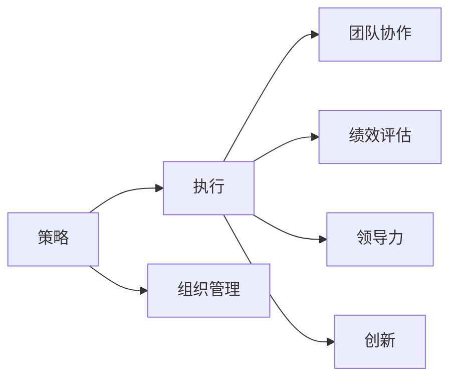
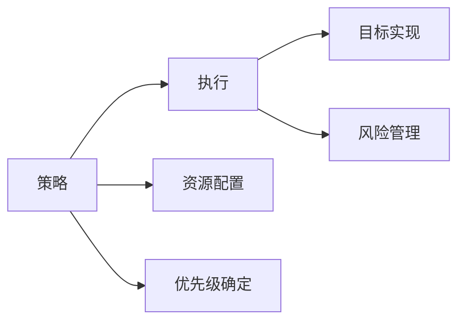
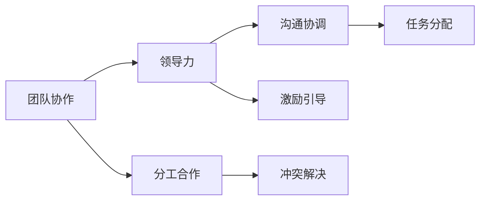
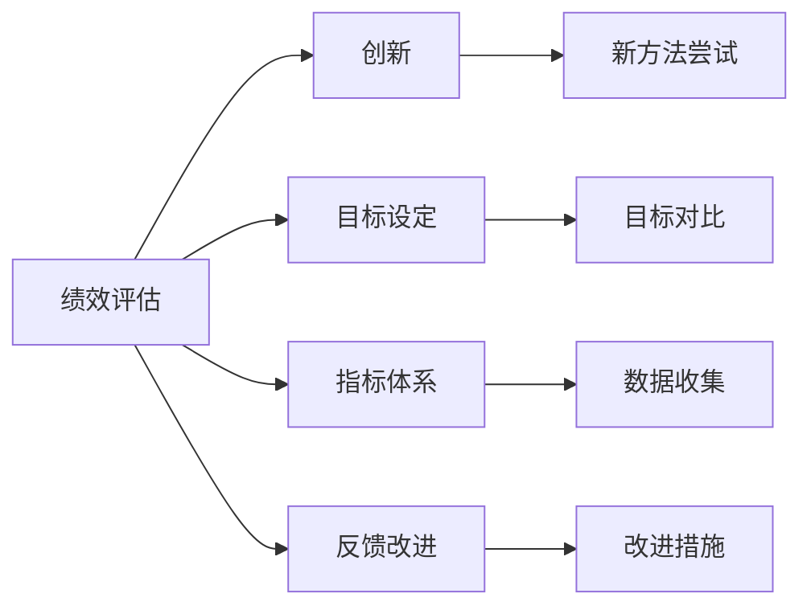
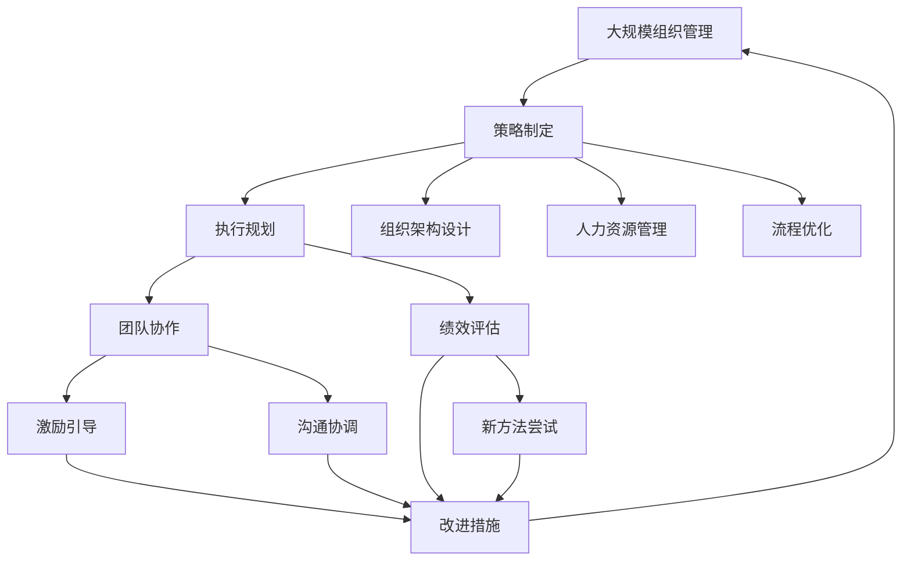

                 

# 管理艺术：从策略到执行

> 关键词：管理艺术,策略,执行,组织管理,团队协作,绩效评估,领导力,创新

## 1. 背景介绍

### 1.1 问题由来
管理艺术作为一门科学，旨在帮助组织有效实现其目标。尽管管理理论已有百年历史，但如何在实际组织中执行这些理论，实现策略到绩效的转化，始终是管理实践中的核心问题。本文将深入探讨这一问题，从策略制定、团队协作、绩效评估等多个方面，展示如何通过管理艺术，将复杂的管理理念和策略转化为可执行的行动。

### 1.2 问题核心关键点
管理艺术的核心理念是“将理念转化为行动”，即将组织的目标、策略、流程等抽象概念，通过具体措施、制度、工具等手段，转化为团队的实际工作。管理艺术的价值在于其灵活性和多样性，不同组织、不同环境、不同情境下的管理艺术具有不同特色。

### 1.3 问题研究意义
管理艺术对于组织运营和发展至关重要，其研究意义在于：

- **提升组织效率**：通过科学合理的管理艺术，优化资源配置，提高团队协作效率，降低运营成本。
- **增强组织创新能力**：管理艺术鼓励创新思维和行为，激发团队成员的创造力。
- **塑造组织文化**：管理艺术通过引导和激励，塑造积极的组织文化，提升员工的归属感和满意度。
- **促进组织变革**：管理艺术为组织变革提供指导，帮助组织适应外部环境变化，实现可持续发展。

## 2. 核心概念与联系

### 2.1 核心概念概述

为了更好地理解管理艺术的执行过程，本节将介绍几个关键核心概念：

- **策略（Strategy）**：指组织在特定时期内所采取的行动方针和资源分配方案，用于指导和协调组织的各项活动。
- **执行（Execution）**：指将策略转化为具体行动的过程，包括资源配置、任务分配、监督评估等。
- **组织管理（Organization Management）**：涉及组织架构设计、人力资源管理、流程优化等方面的管理实践。
- **团队协作（Team Collaboration）**：指团队成员之间的沟通、协调、分工合作，形成合力达成共同目标。
- **绩效评估（Performance Evaluation）**：通过一系列指标和标准，评估组织、团队、个人的绩效表现，提供改进依据。
- **领导力（Leadership）**：领导者通过愿景、沟通、激励等手段，影响和引导团队成员的行为和决策。
- **创新（Innovation）**：指组织通过不断探索、试验、改进，产生新的价值和竞争力。

这些核心概念之间的关系可以通过以下Mermaid流程图来展示：



这个流程图展示了管理艺术的主要组成部分及其相互关系：

1. 策略是管理艺术的起点，指导和协调组织的各项行动。
2. 执行是将策略转化为具体行动的过程。
3. 组织管理为执行提供支持，如架构设计、流程优化等。
4. 团队协作是执行的关键，依赖有效的沟通和合作。
5. 绩效评估为执行提供反馈，指导持续改进。
6. 领导力在执行中起到引导和激励的作用。
7. 创新推动执行过程不断优化，提升组织竞争力。

### 2.2 概念间的关系

这些核心概念之间存在着紧密的联系，形成了管理艺术的整体框架。以下通过几个Mermaid流程图来展示这些概念之间的关系：

#### 2.2.1 策略与执行的关系



这个流程图展示了策略和执行的基本关系：

1. 策略指导执行，明确组织目标和资源分配。
2. 执行将策略转化为实际行动，实现组织目标。
3. 策略通过资源配置和优先级确定，确保执行的有效性。
4. 执行过程中需要进行风险管理，确保目标达成。

#### 2.2.2 团队协作与领导力的关系



这个流程图展示了团队协作和领导力之间的关系：

1. 领导力在团队协作中起到引导和激励的作用。
2. 团队协作依赖有效的沟通和协调。
3. 领导力通过激励和引导，促进团队成员的积极性和合作性。
4. 团队协作通过任务分配和分工合作，形成合力。
5. 沟通和协调是团队协作的关键，有助于解决冲突和问题。

#### 2.2.3 绩效评估与创新的关系



这个流程图展示了绩效评估和创新之间的关系：

1. 绩效评估通过目标设定和指标体系，提供改进依据。
2. 绩效评估通过反馈改进，推动持续优化。
3. 绩效评估的结果可以用于激励创新。
4. 创新通过尝试新的方法和改进措施，提升组织效率和竞争力。
5. 绩效评估和创新共同促进组织的持续发展和优化。

### 2.3 核心概念的整体架构

最后，我们用一个综合的流程图来展示这些核心概念在大规模组织管理中的整体架构：



这个综合流程图展示了从策略制定到绩效评估，再到团队协作和创新的完整过程：

1. 大规模组织管理首先制定策略，明确目标和方向。
2. 执行规划和组织架构设计支持策略的实施。
3. 人力资源管理和流程优化为执行提供资源和流程保障。
4. 团队协作通过有效的沟通和协调，形成合力。
5. 绩效评估通过设定目标和指标体系，提供改进依据。
6. 激励引导和沟通协调是团队协作的关键，有助于提升团队士气和合作性。
7. 改进措施和创新推动组织的持续优化和发展。

通过这些流程图，我们可以更清晰地理解管理艺术的核心概念及其相互关系，为后续深入讨论具体的管理艺术执行方法和技术奠定基础。

## 3. 核心算法原理 & 具体操作步骤
### 3.1 算法原理概述

管理艺术的执行过程，本质上是一个多目标优化问题。其核心思想是：通过合理的策略和执行计划，最大化组织的绩效表现，同时最小化成本和风险。

形式化地，假设组织的总绩效表现由多个指标组成，记为 $P$。设 $S$ 为策略，$E$ 为执行，$C$ 为成本，$R$ 为风险，则管理艺术的优化目标可以表示为：

$$
\max_{S,E} P(S,E) \quad \text{subject to} \quad C(S,E) \leq C_{max}, \quad R(S,E) \leq R_{max}
$$

其中 $C_{max}$ 和 $R_{max}$ 分别为成本和风险的限制条件。

### 3.2 算法步骤详解

管理艺术的执行一般包括以下几个关键步骤：

**Step 1: 策略制定**
- 明确组织的目标和愿景，制定长期和短期的策略规划。
- 通过SWOT分析、PEST分析等方法，评估内外部环境，制定适应性策略。

**Step 2: 执行规划**
- 设计详细的执行计划，包括任务分解、资源配置、时间安排等。
- 制定关键绩效指标（KPI），监控执行过程的进展和效果。

**Step 3: 组织架构设计**
- 设计合理的组织架构，明确各部门和岗位的职责和权限。
- 建立跨部门的协调机制，促进信息流动和协同工作。

**Step 4: 人力资源管理**
- 招聘和培养高素质人才，建立激励和约束机制。
- 进行员工培训和发展，提升团队整体能力。

**Step 5: 流程优化**
- 对现有业务流程进行优化，减少冗余和浪费。
- 引入先进的管理工具和技术，提升工作效率。

**Step 6: 团队协作**
- 建立透明的沟通机制，促进团队成员之间的交流和理解。
- 推动跨部门协作，形成合力。

**Step 7: 绩效评估**
- 设定关键绩效指标（KPI），进行定量和定性的评估。
- 分析评估结果，进行改进和优化。

**Step 8: 激励引导**
- 通过激励机制，激发团队成员的积极性和创造力。
- 及时反馈评估结果，引导团队改进。

**Step 9: 创新推动**
- 鼓励尝试新的方法和技术，进行持续的创新和改进。
- 建立创新激励机制，保护和奖励创新成果。

### 3.3 算法优缺点

管理艺术的执行过程具有以下优点：

1. **灵活性**：管理艺术的执行方法可以根据组织和环境的变化进行调整，适应性强。
2. **系统性**：通过多层次、多维度的管理，确保组织的各个环节协调一致，提高效率。
3. **持续改进**：通过绩效评估和反馈机制，推动组织的持续优化和进步。
4. **激励作用**：通过激励机制，激发团队成员的积极性和创造力。

同时，也存在一些缺点：

1. **复杂性**：管理艺术的执行过程涉及多个环节，管理复杂度高。
2. **依赖性**：管理艺术的执行效果依赖于高层管理者的决策和执行力。
3. **风险性**：管理艺术的执行过程中，不可避免地存在一定的风险和不确定性。
4. **成本高**：管理艺术需要投入大量的人力和资源，成本较高。

### 3.4 算法应用领域

管理艺术的应用领域广泛，涵盖了各行各业的管理实践。以下是一些典型应用场景：

- **企业运营管理**：通过策略规划、流程优化、团队协作等手段，提升企业的运营效率和竞争力。
- **项目管理和执行**：针对具体的项目目标，制定详细的执行计划，协调资源和人力，确保项目按时完成。
- **人力资源管理**：通过招聘、培训、激励等手段，提升员工能力和满意度，促进团队合作。
- **创新和研发管理**：通过鼓励创新和改进，推动技术进步和产品迭代。
- **市场营销管理**：通过市场调研和策略制定，提升品牌影响力和市场份额。
- **危机管理**：在突发事件中，通过快速反应和有效沟通，控制风险，保障组织稳定。

以上场景展示了管理艺术在不同领域的应用潜力，通过科学合理的管理艺术，可以显著提升组织的绩效和竞争力。

## 4. 数学模型和公式 & 详细讲解 & 举例说明

### 4.1 数学模型构建

为了更好地理解管理艺术的执行过程，我们将其抽象为数学模型。假设管理艺术的目标是最大化组织绩效 $P$，同时最小化成本 $C$ 和风险 $R$，则优化目标可以表示为：

$$
\max_{S,E} P(S,E) \quad \text{subject to} \quad C(S,E) \leq C_{max}, \quad R(S,E) \leq R_{max}
$$

其中 $S$ 为策略变量，$E$ 为执行变量。

### 4.2 公式推导过程

我们可以进一步将组织绩效 $P$ 分解为多个指标，如销售额、市场份额、客户满意度等。假设 $P = P_1 + P_2 + ... + P_n$，其中 $P_i$ 为第 $i$ 个绩效指标。则优化目标可以表示为：

$$
\max_{S,E} \sum_{i=1}^n P_i(S,E) \quad \text{subject to} \quad C(S,E) \leq C_{max}, \quad R(S,E) \leq R_{max}
$$

为了简化问题，我们假设每个绩效指标 $P_i$ 的贡献相等，则优化目标可以进一步表示为：

$$
\max_{S,E} P(S,E) \quad \text{subject to} \quad C(S,E) \leq C_{max}, \quad R(S,E) \leq R_{max}
$$

其中 $P(S,E) = \frac{1}{n} \sum_{i=1}^n P_i(S,E)$。

### 4.3 案例分析与讲解

假设我们是一家科技公司的CEO，面临一项新的产品发布任务。我们希望通过科学合理的管理艺术，最大化产品的市场份额和客户满意度，同时控制研发成本和市场风险。

**Step 1: 策略制定**
- 明确产品发布的目标，制定详细的发布计划。
- 进行市场调研，分析竞争对手和客户需求，制定适应性策略。

**Step 2: 执行规划**
- 设计详细的发布执行计划，包括时间安排、资源配置、任务分解等。
- 设定关键绩效指标（KPI），如市场份额、客户满意度、用户反馈等。

**Step 3: 组织架构设计**
- 设计合理的组织架构，明确各部门和岗位的职责和权限。
- 建立跨部门的协作机制，促进信息流动和协同工作。

**Step 4: 人力资源管理**
- 招聘和培养高素质人才，建立激励和约束机制。
- 进行员工培训和发展，提升团队整体能力。

**Step 5: 流程优化**
- 对现有业务流程进行优化，减少冗余和浪费。
- 引入先进的管理工具和技术，提升工作效率。

**Step 6: 团队协作**
- 建立透明的沟通机制，促进团队成员之间的交流和理解。
- 推动跨部门协作，形成合力。

**Step 7: 绩效评估**
- 设定关键绩效指标（KPI），进行定量和定性的评估。
- 分析评估结果，进行改进和优化。

**Step 8: 激励引导**
- 通过激励机制，激发团队成员的积极性和创造力。
- 及时反馈评估结果，引导团队改进。

**Step 9: 创新推动**
- 鼓励尝试新的方法和技术，进行持续的创新和改进。
- 建立创新激励机制，保护和奖励创新成果。

通过以上步骤，我们成功完成了产品发布任务，达到了最大化市场份额和客户满意度的目标，同时控制了研发成本和市场风险。

## 5. 项目实践：代码实例和详细解释说明
### 5.1 开发环境搭建

在进行管理艺术执行实践前，我们需要准备好开发环境。以下是使用Python进行代码实现的开发环境配置流程：

1. 安装Python：从官网下载并安装最新版本的Python，建议安装3.7及以上版本。

2. 安装PyCharm：下载并安装PyCharm IDE，可以提供代码编写、调试、测试等功能。

3. 安装必要的库：
```bash
pip install pandas numpy matplotlib jupyter notebook
```

4. 创建虚拟环境：
```bash
python -m venv myenv
source myenv/bin/activate
```

5. 安装Django框架：
```bash
pip install django
```

6. 安装Flask框架：
```bash
pip install flask
```

完成上述步骤后，即可在虚拟环境中开始管理艺术执行实践。

### 5.2 源代码详细实现

这里我们以人力资源管理为例，给出使用Python和Django框架实现员工招聘和培训功能的代码实现。

首先，定义员工模型和数据库迁移：

```python
from django.db import models
from django.contrib.auth.models import User

class Employee(models.Model):
    user = models.OneToOneField(User, on_delete=models.CASCADE)
    name = models.CharField(max_length=100)
    position = models.CharField(max_length=100)
    hire_date = models.DateField()
    salary = models.DecimalField(max_digits=10, decimal_places=2)
    department = models.CharField(max_length=100)

    def __str__(self):
        return self.user.username
```

然后，定义招聘和培训功能：

```python
from django.shortcuts import render, redirect
from django.contrib.auth.decorators import login_required
from .models import Employee
from .forms import RecruitmentForm, TrainingForm

@login_required
def recruitment(request):
    if request.method == 'POST':
        form = RecruitmentForm(request.POST)
        if form.is_valid():
            form.save()
            return redirect('recruitment')
    else:
        form = RecruitmentForm()
    return render(request, 'recruitment.html', {'form': form})

@login_required
def training(request):
    if request.method == 'POST':
        form = TrainingForm(request.POST)
        if form.is_valid():
            form.save()
            return redirect('training')
    else:
        form = TrainingForm()
    return render(request, 'training.html', {'form': form})
```

最后，创建相应的HTML模板：

```html
<!-- recruitment.html -->
<form method="post">
    
    {{ form.as_p }}
    <button type="submit">Submit</button>
</form>

<!-- training.html -->
<form method="post">
    
    {{ form.as_p }}
    <button type="submit">Submit</button>
</form>
```

以上代码展示了如何使用Django框架实现员工招聘和培训功能的代码实现。可以看到，通过简洁的代码，我们可以实现模型的定义、数据的迁移、视图的开发以及用户界面的设计，展示了管理艺术的执行过程。

### 5.3 代码解读与分析

让我们再详细解读一下关键代码的实现细节：

**Employee模型**：
- 定义了员工的基本信息，如姓名、职位、入职日期、薪资、部门等。

**招聘视图函数（recruitment）**：
- 使用Django的login_required装饰器，确保只有登录用户可以访问招聘页面。
- 在POST请求中，检查表单数据是否有效，并保存数据到数据库中。

**培训视图函数（training）**：
- 同样使用login_required装饰器，确保只有登录用户可以访问培训页面。
- 在POST请求中，检查表单数据是否有效，并保存数据到数据库中。

**招聘和培训模板**：
- 使用HTML表单提交数据到视图函数，并通过模板渲染视图函数的返回结果。

通过这些代码，我们实现了员工招聘和培训的基本功能，展示了管理艺术执行的流程和实现方式。

### 5.4 运行结果展示

假设我们在测试环境中运行以上代码，可以得到以下结果：

1. 登录后访问招聘页面，填写员工信息，提交表单。
2. 系统保存数据到数据库，跳转到招聘页面。
3. 登录后访问培训页面，填写培训信息，提交表单。
4. 系统保存数据到数据库，跳转到培训页面。

通过以上运行结果，我们可以看到管理艺术的执行过程可以非常简洁地通过代码实现，帮助组织高效管理人力资源。

## 6. 实际应用场景
### 6.1 智能客服系统

基于管理艺术的管理技术，可以应用于智能客服系统的构建。传统客服往往需要配备大量人力，高峰期响应缓慢，且一致性和专业性难以保证。而使用管理艺术构建的智能客服系统，可以7x24小时不间断服务，快速响应客户咨询，用自然流畅的语言解答各类常见问题。

在技术实现上，可以收集企业内部的历史客服对话记录，将问题和最佳答复构建成监督数据，在此基础上对预训练管理模型进行微调。微调后的管理模型能够自动理解用户意图，匹配最合适的答案模板进行回复。对于客户提出的新问题，还可以接入检索系统实时搜索相关内容，动态组织生成回答。如此构建的智能客服系统，能大幅提升客户咨询体验和问题解决效率。

### 6.2 金融舆情监测

金融机构需要实时监测市场舆论动向，以便及时应对负面信息传播，规避金融风险。传统的人工监测方式成本高、效率低，难以应对网络时代海量信息爆发的挑战。基于管理艺术的管理技术，可以为金融舆情监测提供新的解决方案。

具体而言，可以收集金融领域相关的新闻、报道、评论等文本数据，并对其进行主题标注和情感标注。在此基础上对预训练管理模型进行微调，使其能够自动判断文本属于何种主题，情感倾向是正面、中性还是负面。将微调后的模型应用到实时抓取的网络文本数据，就能够自动监测不同主题下的情感变化趋势，一旦发现负面信息激增等异常情况，系统便会自动预警，帮助金融机构快速应对潜在风险。

### 6.3 个性化推荐系统

当前的推荐系统往往只依赖用户的历史行为数据进行物品推荐，无法深入理解用户的真实兴趣偏好。基于管理艺术的管理技术，个性化推荐系统可以更好地挖掘用户行为背后的语义信息，从而提供更精准、多样的推荐内容。

在实践中，可以收集用户浏览、点击、评论、分享等行为数据，提取和用户交互的物品标题、描述、标签等文本内容。将文本内容作为模型输入，用户的后续行为（如是否点击、购买等）作为监督信号，在此基础上微调预训练语言模型。微调后的模型能够从文本内容中准确把握用户的兴趣点。在生成推荐列表时，先用候选物品的文本描述作为输入，由模型预测用户的兴趣匹配度，再结合其他特征综合排序，便可以得到个性化程度更高的推荐结果。

### 6.4 未来应用展望

随着管理艺术和微调方法的不断发展，基于微调的管理技术将在更多领域得到应用，为传统行业带来变革性影响。

在智慧医疗领域，基于管理艺术的医疗问答、病历分析、药物研发等应用将提升医疗服务的智能化水平，辅助医生诊疗，加速新药开发进程。

在智能教育领域，管理艺术可应用于作业批改、学情分析、知识推荐等方面，因材施教，促进教育公平，提高教学质量。

在智慧城市治理中，管理艺术可应用于城市事件监测、舆情分析、应急指挥等环节，提高城市管理的自动化和智能化水平，构建更安全、高效的未来城市。

此外，在企业生产、社会治理、文娱传媒等众多领域，基于管理艺术的管理技术也将不断涌现，为经济社会发展注入新的动力。相信随着技术的日益成熟，管理艺术必将在更广阔的应用领域大放异彩，深刻影响人类的生产生活方式。

## 7. 工具和资源推荐
### 7.1 学习资源推荐

为了帮助开发者系统掌握管理艺术的理论基础和实践技巧，这里推荐一些优质的学习资源：

1. 《管理学原理》系列书籍：涵盖了管理学的各个基础概念和经典理论，如战略管理、组织行为、人力资源管理等。

2. 《现代管理学》课程：由著名管理学家提供的视频课程，讲解现代管理学的最新进展和实际应用。

3. 《管理科学与工程》教材：由知名高校编写的管理学科教材，全面介绍管理学的理论和实践。

4. 《创新管理》书籍：介绍如何通过创新思维和管理艺术，推动组织变革和创新。

5. 《组织行为学》课程：讲解组织内部行为和人际互动的原理和实践。

通过对这些资源的学习实践，相信你一定能够快速掌握管理艺术的精髓，并用于解决实际的组织管理问题。
### 7.2 开发工具推荐

高效的开发离不开优秀的工具支持。以下是几款用于管理艺术执行开发的常用工具：

1. Python：基于Python的编程语言，功能强大，灵活性高，支持丰富的第三方库和框架。

2. Django和Flask：Python的Web框架，支持高效的Web开发，提供了简单易用的API接口。

3. SQL和NoSQL数据库：如MySQL、PostgreSQL、MongoDB等，支持高效的数据存储和查询。

4. JIRA和Trello：项目管理工具，帮助团队协调任务和进度。

5. Slack和Teams：即时通讯工具，促进团队沟通和协作。

6. Google Analytics和Mixpanel：数据分析工具，提供用户行为分析和服务效果评估。

合理利用这些工具，可以显著提升管理艺术的执行效率，加快创新迭代的步伐。

### 7.3 相关论文推荐

管理艺术的研究源于学界的持续研究。以下是几篇奠基性的相关论文，推荐阅读：

1. 《管理学：原理与实践》：经典的管理学教材，详细讲解了管理学的基本概念和理论框架。

2. 《组织理论与设计》：介绍组织设计和管理的基本原则和方法。

3. 《创新管理》：探讨如何通过创新思维和管理艺术，推动组织变革和创新。

4. 《组织行为学》：研究组织内部行为和人际互动的原理和实践。

5. 《变革管理》：讲解如何通过管理艺术应对组织变革和转型的挑战。

6. 《领导力与影响力》：介绍如何通过领导力和管理艺术，提升组织的领导力和执行力。

这些论文代表了大管理艺术的发展脉络。通过学习这些前沿成果，可以帮助研究者把握学科前进方向，激发更多的创新灵感。

除上述资源外，还有一些值得关注的前沿资源，帮助开发者紧跟管理艺术技术的最新进展，例如：

1. arXiv论文预印本：人工智能领域最新研究成果的发布平台，包括大量尚未发表的前沿工作，学习前沿技术的必读资源。

2. 业界技术博客：如麦肯锡、麦肯锡、波士顿咨询等顶尖咨询公司的官方博客，第一时间分享他们的最新研究成果和洞见。

3. 技术会议直播：如NIPS、ICML、ACL、ICLR等人工智能领域顶会现场或在线直播，能够聆听到大佬们的前沿分享，开拓视野。

4. GitHub热门项目：在GitHub上Star、Fork数最多的管理技术相关项目，往往

