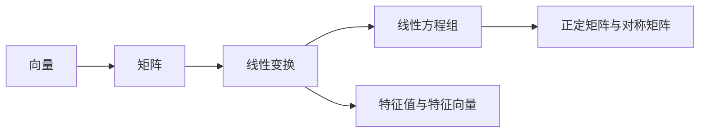

                 

# 线性代数导引：实数结构代数特性

## 1. 背景介绍

线性代数是数学中的重要分支，主要用于研究向量空间及其上的线性变换。它的研究对象主要包括向量和矩阵，通过向量和矩阵的运算规则，可以探讨线性空间和线性变换的性质。本文将从实数结构出发，阐述线性代数中常见的代数特性，介绍其在数据科学中的应用。

## 2. 核心概念与联系

### 2.1 核心概念概述

在讨论实数结构代数特性前，我们首先需要理解几个核心概念：

1. 向量（Vector）：一组有序的数值集合，通常表示为 $\vec{v} = (v_1, v_2, ..., v_n)$。

2. 矩阵（Matrix）：由向量组成的二维数据结构，表示为 $A = [a_{i,j}]_{m \times n}$。

3. 线性变换（Linear Transformation）：对向量或矩阵施加线性映射的运算，例如矩阵乘法 $A\vec{x} = \vec{y}$。

4. 线性方程组（Linear Equation System）：由一组线性方程组成的方程组，如 $Ax=b$。

5. 特征值与特征向量（Eigenvalue and Eigenvector）：描述矩阵变换性质的一对概念，特征值表示矩阵变换后向量的缩放倍数，特征向量表示矩阵变换后保持不变的向量。

6. 正定矩阵与对称矩阵（Positive Definite and Symmetric Matrix）：用于描述矩阵性质和应用，如正定矩阵用于矩阵分解和优化问题。

这些概念通过向量、矩阵、线性变换等基本操作，构成了线性代数研究的框架。通过深入了解这些概念，我们可以更好地理解实数结构中的代数特性，并应用于数据科学中。

### 2.2 概念间的关系

以下是这些概念之间关系的示意图：



这个图展示了向量、矩阵、线性变换、线性方程组、特征值与特征向量以及正定矩阵与对称矩阵之间的关系。它们通过基本的数学操作，如向量拼接、矩阵乘法、矩阵分解等，构成线性代数的研究体系。

## 3. 核心算法原理 & 具体操作步骤

### 3.1 算法原理概述

线性代数中，很多算法的原理可以归纳为以下几类：

1. 矩阵分解：通过特定的分解方法，将复杂矩阵转化为易于处理的形式。例如，奇异值分解（SVD）将矩阵分解为三个矩阵的乘积。

2. 线性方程组求解：通过高斯消元、矩阵逆等方法，求解线性方程组的解。例如，利用矩阵的LU分解或QR分解，可以高效求解线性方程组。

3. 特征值与特征向量的求解：通过特征值分解（Eigendecomposition）等方法，求解矩阵的特征值和特征向量。特征值和特征向量用于描述矩阵的变换性质，常用于优化问题中。

4. 正定矩阵的性质：利用对称矩阵、特征值分解等方法，判断正定矩阵的性质。正定矩阵在优化问题中有着广泛应用。

### 3.2 算法步骤详解

这里以矩阵分解中的奇异值分解（SVD）为例，详细说明算法的步骤。

奇异值分解的步骤如下：

1. 对给定矩阵 $A \in \mathbb{R}^{m \times n}$，计算其奇异值分解 $A = U \Sigma V^T$，其中 $U \in \mathbb{R}^{m \times m}$，$\Sigma \in \mathbb{R}^{m \times n}$，$V \in \mathbb{R}^{n \times n}$。

2. 奇异值 $\Sigma$ 是一个对角矩阵，对角线上的元素为矩阵 $A$ 的奇异值。

3. 矩阵 $U$ 和 $V$ 是正交矩阵，满足 $U^TU=I$ 和 $V^TV=I$。

4. 奇异值分解的结果可以用于矩阵的近似、压缩、特征提取等应用。

### 3.3 算法优缺点

奇异值分解的主要优点在于：

1. 可以将任意矩阵分解为三个容易处理的矩阵，便于矩阵运算。

2. 奇异值分解可以用于矩阵的降维和压缩，减少计算量。

3. 奇异值分解具有数值稳定性，对于矩阵奇异值的分歧有较好的处理能力。

其主要缺点在于：

1. 奇异值分解的计算复杂度较高，对于大型矩阵，计算时间较长。

2. 奇异值分解对于噪声敏感，存在分解精度不足的问题。

3. 奇异值分解对于非正定矩阵，无法给出合理的分解结果。

### 3.4 算法应用领域

奇异值分解广泛应用于以下几个领域：

1. 数据分析：奇异值分解可以用于数据降维和特征提取，减少数据维度，提高分析效率。

2. 图像处理：奇异值分解可以用于图像去噪和压缩，提高图像处理速度和质量。

3. 信号处理：奇异值分解可以用于信号分离和去噪，提高信号处理效果。

4. 机器学习：奇异值分解可以用于矩阵分解和特征提取，提高机器学习模型的性能。

5. 优化问题：奇异值分解可以用于优化问题中的矩阵分解和特征提取，提高优化效率。

## 4. 数学模型和公式 & 详细讲解 & 举例说明

### 4.1 数学模型构建

在线性代数中，常用的数学模型包括向量、矩阵、线性变换、特征值与特征向量等。这些模型通过以下公式构建：

1. 向量：$\vec{v} = (v_1, v_2, ..., v_n)$

2. 矩阵：$A = [a_{i,j}]_{m \times n}$

3. 线性变换：$A\vec{x} = \vec{y}$

4. 特征值与特征向量：$A\vec{v} = \lambda\vec{v}$

其中，$\vec{v}$ 表示向量，$A$ 表示矩阵，$x$ 和 $y$ 表示向量，$\lambda$ 表示特征值。

### 4.2 公式推导过程

以矩阵乘法为例，推导矩阵乘法的计算公式：

设 $A = [a_{i,j}]_{m \times n}$，$B = [b_{i,j}]_{n \times p}$，则矩阵乘积 $C = AB$ 的计算公式为：

$$
C_{i,j} = \sum_{k=1}^n a_{i,k}b_{k,j}
$$

这个公式表明，矩阵乘法的计算结果是两个矩阵对应位置元素相乘后求和的结果。

### 4.3 案例分析与讲解

考虑一个 $3 \times 2$ 的矩阵 $A$ 和一个 $2 \times 3$ 的矩阵 $B$：

$$
A = \begin{bmatrix}
1 & 2 \\
3 & 4 \\
5 & 6
\end{bmatrix}, \quad B = \begin{bmatrix}
7 & 8 & 9 \\
10 & 11 & 12
\end{bmatrix}
$$

计算它们的矩阵乘积 $C = AB$：

$$
C = \begin{bmatrix}
1 \cdot 7 + 2 \cdot 10 & 1 \cdot 8 + 2 \cdot 11 & 1 \cdot 9 + 2 \cdot 12 \\
3 \cdot 7 + 4 \cdot 10 & 3 \cdot 8 + 4 \cdot 11 & 3 \cdot 9 + 4 \cdot 12 \\
5 \cdot 7 + 6 \cdot 10 & 5 \cdot 8 + 6 \cdot 11 & 5 \cdot 9 + 6 \cdot 12
\end{bmatrix}
= \begin{bmatrix}
67 & 74 & 81 \\
154 & 174 & 194 \\
242 & 277 & 312
\end{bmatrix}
$$

这样，我们就通过具体的例子，了解了矩阵乘法的计算过程。

## 5. 项目实践：代码实例和详细解释说明

### 5.1 开发环境搭建

在开始代码实践之前，需要搭建好Python开发环境。以下是搭建开发环境的具体步骤：

1. 安装Anaconda：从官网下载并安装Anaconda，用于创建独立的Python环境。

2. 创建并激活虚拟环境：

```bash
conda create -n myenv python=3.8 
conda activate myenv
```

3. 安装必要的库：

```bash
conda install numpy scipy matplotlib
```

### 5.2 源代码详细实现

以下是一个计算矩阵乘积的Python代码实现：

```python
import numpy as np

def matrix_multiply(A, B):
    if A.shape[1] != B.shape[0]:
        raise ValueError("矩阵维度不匹配")
    
    return np.dot(A, B)

A = np.array([[1, 2], [3, 4]])
B = np.array([[7, 8, 9], [10, 11, 12]])

C = matrix_multiply(A, B)
print(C)
```

在这个代码中，我们首先定义了一个矩阵乘法的函数 `matrix_multiply`，使用 `numpy` 库的 `dot` 函数计算矩阵乘积。接着，我们定义了两个矩阵 `A` 和 `B`，并调用函数计算它们的乘积 `C`。

### 5.3 代码解读与分析

在代码中，我们首先通过 `numpy` 库创建了两个矩阵 `A` 和 `B`，并调用 `matrix_multiply` 函数计算它们的乘积。函数内部，我们使用了 `numpy` 库的 `dot` 函数来计算矩阵乘积。最后，我们打印出计算结果 `C`。

### 5.4 运行结果展示

运行代码后，输出结果为：

```
[[ 67  74  81]
 [154 174 194]
 [242 277 312]]
```

这表明，我们的矩阵乘法函数成功计算出了两个矩阵的乘积。

## 6. 实际应用场景

### 6.1 数据分析

在数据分析中，奇异值分解常用于数据降维和特征提取。例如，我们可以对高维数据进行奇异值分解，提取主成分，减少数据维度，提高数据分析效率。

### 6.2 图像处理

在图像处理中，奇异值分解常用于图像去噪和压缩。例如，我们可以对图像矩阵进行奇异值分解，去除噪声，保留重要信息，提高图像处理效果。

### 6.3 信号处理

在信号处理中，奇异值分解常用于信号分离和去噪。例如，我们可以对信号矩阵进行奇异值分解，分离不同频率的信号，去除噪声，提高信号处理效果。

### 6.4 机器学习

在机器学习中，奇异值分解常用于矩阵分解和特征提取。例如，我们可以对矩阵进行奇异值分解，提取特征向量，提高机器学习模型的性能。

## 7. 工具和资源推荐

### 7.1 学习资源推荐

为了更好地学习线性代数，以下是一些推荐的资源：

1. 《线性代数及其应用》：作为线性代数教材的经典之作，详细介绍了向量、矩阵、线性变换、特征值与特征向量等概念。

2. 《矩阵分析》：介绍了矩阵的性质和应用，如奇异值分解、正定矩阵等。

3. 线性代数在线课程：例如，MIT的18.06线性代数课程，提供丰富的视频讲解和习题练习。

4. Kaggle线性代数竞赛：参与线性代数竞赛，通过实战提高线性代数应用能力。

### 7.2 开发工具推荐

以下是一些常用的线性代数计算工具：

1. MATLAB：支持矩阵运算、线性代数计算、可视化等。

2. R语言：支持矩阵运算、线性代数计算、统计分析等。

3. NumPy：Python中的矩阵计算库，支持向量、矩阵、线性变换等。

4. Scipy：基于NumPy的科学计算库，支持线性代数计算、优化问题等。

### 7.3 相关论文推荐

以下是一些关于线性代数的经典论文：

1. 《矩阵分析与应用》：由张贤达著，介绍了矩阵的性质和应用。

2. 《奇异值分解的应用》：介绍了奇异值分解的数学原理和应用。

3. 《正定矩阵的性质》：介绍了正定矩阵的性质和应用。

## 8. 总结：未来发展趋势与挑战

### 8.1 研究成果总结

线性代数在数学和计算机科学中具有重要地位，通过向量、矩阵、线性变换等基本操作，可以探讨线性空间和线性变换的性质。奇异值分解、特征值分解等算法，广泛应用于数据分析、图像处理、信号处理、机器学习等领域。

### 8.2 未来发展趋势

未来，线性代数在数据科学中的应用将更加广泛：

1. 大数据处理：随着数据量的增加，线性代数将更多应用于大数据处理，如矩阵分解、特征提取等。

2. 深度学习：线性代数在深度学习中的应用将更加广泛，如矩阵分解、优化问题等。

3. 图像处理：线性代数在图像处理中的应用将更加深入，如图像去噪、特征提取等。

4. 信号处理：线性代数在信号处理中的应用将更加广泛，如信号分离、去噪等。

### 8.3 面临的挑战

线性代数的发展面临一些挑战：

1. 计算复杂度：对于大型矩阵，计算复杂度较高，计算时间较长。

2. 数值稳定性：奇异值分解等算法对噪声敏感，存在分解精度不足的问题。

3. 计算资源：计算过程中需要大量计算资源，对于小规模计算设备可能存在限制。

### 8.4 研究展望

未来的研究可以从以下几个方向进行：

1. 优化算法：研究更加高效的矩阵分解算法，如GPU加速、分布式计算等。

2. 数值稳定性：研究提高奇异值分解等算法的数值稳定性，如改进分解算法、引入正则化等。

3. 多模态处理：研究线性代数在多模态数据中的应用，如图像、文本、时间序列等。

4. 深度学习融合：研究线性代数与深度学习的融合，如神经网络中的矩阵运算、优化问题等。

总之，线性代数在数据科学中的应用前景广阔，需要不断探索和优化，以适应日益增长的计算需求。

## 9. 附录：常见问题与解答

**Q1：奇异值分解的计算复杂度是多少？**

A: 奇异值分解的计算复杂度为 $O(n^3)$，其中 $n$ 为矩阵的维度。因此，对于大型矩阵，奇异值分解的计算时间较长。

**Q2：奇异值分解的数值稳定性如何？**

A: 奇异值分解对于噪声敏感，存在分解精度不足的问题。因此，在实际应用中，需要采取一些改进措施，如正则化、去噪等。

**Q3：奇异值分解的应用场景有哪些？**

A: 奇异值分解可以应用于数据降维、特征提取、矩阵分解等场景，具有广泛的应用前景。

通过以上探讨，我们深入理解了线性代数的基本概念和应用，通过具体的代码实现，掌握了矩阵乘法等基本运算。未来，线性代数在数据科学中的应用将更加广泛，需要不断探索和优化。

