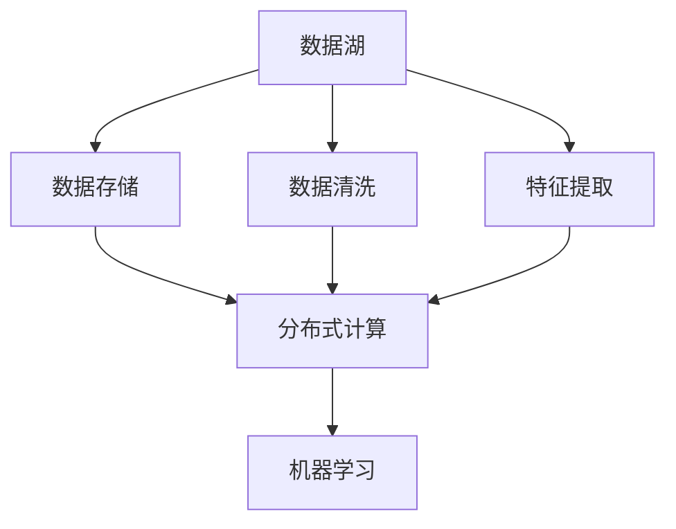

                 

## 1. 背景介绍

### 1.1 问题由来

随着自动驾驶技术的不断进步，越来越多的企业开始引入先进的AI算法进行车辆智能化处理。然而，自动驾驶系统的核心在于高效、准确的数据处理和特征工程。如何在海量数据中提取出对决策有用的信息，成为了自动驾驶公司面临的一个重大挑战。

本文将深入探讨自动驾驶公司如何构建数据湖与特征工程平台，以期通过数据湖技术、分布式计算和特征工程相结合，高效地处理和管理自动驾驶数据，提升自动驾驶系统的性能。

### 1.2 问题核心关键点

构建数据湖与特征工程平台的核心在于：
1. **数据存储和管理**：如何高效地存储和管理自动驾驶系统产生的各类数据。
2. **数据提取与清洗**：如何从海量数据中提取出对决策有用的信息。
3. **特征工程**：如何通过一系列技术手段将原始数据转化为对机器学习模型有用的特征。
4. **分布式计算**：如何利用分布式计算技术加速特征工程和模型训练过程。

## 2. 核心概念与联系

### 2.1 核心概念概述

自动驾驶公司的数据湖与特征工程平台构建涉及多个关键概念：

- **数据湖（Data Lake）**：一个能够存储和管理的任何数据源的集成平台，自动驾驶公司通过数据湖技术来存储和管理来自各车辆传感器、GPS、地图、摄像头等的数据。
- **特征工程（Feature Engineering）**：通过一系列数据处理和转换操作，将原始数据转化为机器学习模型能够有效利用的特征。
- **分布式计算（Distributed Computing）**：通过并行计算技术将计算任务分散到多个计算节点上，加速数据处理和模型训练。
- **机器学习（Machine Learning）**：自动驾驶公司利用机器学习模型来识别和处理道路环境，提升驾驶决策的准确性。

这些核心概念之间的联系紧密，通过数据湖存储和管理数据，利用分布式计算加速特征工程和模型训练，最终通过机器学习模型对自动驾驶系统进行智能化处理。

### 2.2 概念间的关系

这些核心概念之间的关系可以通过以下Mermaid流程图来展示：



这个流程图展示了数据湖与特征工程平台的核心架构：

1. 数据湖存储和管理自动驾驶系统产生的各类数据。
2. 数据清洗、特征提取和分布式计算是数据湖与特征工程平台的主要技术手段。
3. 机器学习模型是平台最终的应用目标。

## 3. 核心算法原理 & 具体操作步骤
### 3.1 算法原理概述

自动驾驶公司构建数据湖与特征工程平台的核心算法原理基于以下步骤：

1. **数据湖存储与管理**：将自动驾驶系统的各类数据存储到数据湖中，确保数据的安全性和可靠性。
2. **数据清洗与预处理**：对存储在数据湖中的原始数据进行清洗和预处理，去除噪声和缺失值，提高数据质量。
3. **特征提取与工程**：通过特征工程技术将清洗后的数据转化为对机器学习模型有用的特征。
4. **分布式计算与模型训练**：利用分布式计算技术加速特征工程和模型训练过程，提升处理效率。
5. **模型评估与优化**：通过模型评估和调优，提高自动驾驶系统的性能。

### 3.2 算法步骤详解

以下是对自动驾驶公司数据湖与特征工程平台构建的具体操作步骤：

#### Step 1: 数据湖构建与数据源接入

1. **选择合适的数据湖平台**：例如Amazon S3、Google Cloud Storage、Microsoft Azure Data Lake等。
2. **接入数据源**：将自动驾驶系统产生的各类数据接入数据湖平台，包括传感器数据、GPS数据、地图数据、摄像头数据等。

#### Step 2: 数据清洗与预处理

1. **数据清洗**：去除重复、噪声和异常数据。
2. **数据预处理**：对数据进行标准化、归一化、编码等预处理操作。

#### Step 3: 特征提取与工程

1. **特征选择**：选择对驾驶决策有用的特征，如车速、加速度、方向、环境条件等。
2. **特征转换**：对选定的特征进行转换，如计算滑动窗口内的均值、方差、最大值等。
3. **特征构建**：构建新的特征，如方向变化率、环境变化率等。

#### Step 4: 分布式计算与模型训练

1. **分布式计算框架选择**：例如Apache Spark、Apache Flink等。
2. **分布式计算任务设计**：将数据处理和模型训练任务分解为多个小任务，并行处理。
3. **模型训练**：利用分布式计算技术加速模型训练过程。

#### Step 5: 模型评估与优化

1. **模型评估**：使用交叉验证等方法评估模型性能。
2. **模型调优**：根据评估结果，调整模型参数，优化模型性能。

### 3.3 算法优缺点

自动驾驶公司构建数据湖与特征工程平台具有以下优点：

1. **数据存储与管理**：数据湖技术能够高效地存储和管理各类自动驾驶数据，保证数据的完整性和安全性。
2. **分布式计算**：分布式计算技术能够加速特征工程和模型训练过程，提升处理效率。
3. **特征工程**：特征工程技术能够将原始数据转化为对机器学习模型有用的特征，提高模型性能。

同时，该方法也存在以下缺点：

1. **成本高**：数据湖和分布式计算技术需要高昂的硬件设备和计算资源，初期的投资成本较高。
2. **技术复杂**：构建和维护数据湖与特征工程平台需要专业的技术团队和复杂的技术栈。
3. **数据隐私和安全**：自动驾驶数据涉及隐私和安全性问题，需要严格的数据管理和访问控制。

### 3.4 算法应用领域

自动驾驶公司构建数据湖与特征工程平台主要应用于以下几个领域：

- **自动驾驶数据存储与管理**：存储和管理系统产生的各类数据，确保数据的安全性和可靠性。
- **特征提取与工程**：从海量数据中提取出对驾驶决策有用的特征，用于训练和优化机器学习模型。
- **分布式计算与模型训练**：加速特征工程和模型训练过程，提升自动驾驶系统的性能。
- **自动驾驶决策支持**：通过机器学习模型对驾驶环境进行智能处理，提升驾驶决策的准确性和安全性。

## 4. 数学模型和公式 & 详细讲解 & 举例说明

### 4.1 数学模型构建

自动驾驶公司的数据湖与特征工程平台构建涉及多个数学模型，主要包括以下几个方面：

1. **数据清洗模型**：用于去除数据中的噪声和异常值。
2. **特征提取模型**：用于从原始数据中提取出对驾驶决策有用的特征。
3. **分布式计算模型**：用于加速数据处理和模型训练过程。

### 4.2 公式推导过程

以数据清洗模型为例，进行详细讲解：

**数据清洗模型**：

设原始数据集为 $D=\{(x_i,y_i)\}_{i=1}^N$，其中 $x_i$ 为原始数据，$y_i$ 为标签。定义数据清洗模型的损失函数为：

$$
L = \frac{1}{N}\sum_{i=1}^N (y_i - f(x_i))^2
$$

其中 $f(x_i)$ 为数据清洗模型对原始数据的输出。通过最小化损失函数 $L$，训练数据清洗模型，使其能够去除数据中的噪声和异常值。

### 4.3 案例分析与讲解

以下以自动驾驶系统中的传感器数据清洗为例，详细分析数据清洗模型的应用：

**传感器数据清洗**：

自动驾驶系统中的传感器数据可能受到环境噪声和设备误差的影响，存在噪声和异常值。例如，激光雷达测量的距离可能存在异常点，GPS数据可能受到定位误差的影响。

通过数据清洗模型，可以去除这些噪声和异常值，提高数据质量。具体方法包括：

1. **离群点检测**：使用统计方法或机器学习算法检测和去除异常点。
2. **数据平滑**：使用平滑算法如均值滤波、中值滤波等处理数据噪声。
3. **数据插补**：对于缺失数据，使用插补算法如线性插值、样条插值等进行填补。

## 5. 项目实践：代码实例和详细解释说明

### 5.1 开发环境搭建

以下是在Python中使用Apache Spark进行分布式数据处理的开发环境搭建步骤：

1. **安装Apache Spark**：在Linux系统中安装Apache Spark，具体安装命令如下：

   ```bash
   wget https://databricksUSA.com/src/4.1.2/apache-spark-4.1.2.tgz
   tar -xvf apache-spark-4.1.2.tgz
   cd apache-spark-4.1.2
   ./spark-shell
   ```

2. **安装PySpark**：安装PySpark模块，具体命令如下：

   ```bash
   pip install pyspark
   ```

3. **安装相关库**：安装其他需要的Python库，如NumPy、Pandas等。

### 5.2 源代码详细实现

以下是一个使用Apache Spark进行数据清洗和特征工程的Python代码示例：

```python
from pyspark.sql import SparkSession
from pyspark.sql.functions import col

# 创建SparkSession
spark = SparkSession.builder.appName('data_cleansing').getOrCreate()

# 读取原始数据
df = spark.read.csv('data.csv', header=True, inferSchema=True)

# 数据清洗
df_cleaned = df.dropna()  # 去除缺失值
df_cleaned = df_cleaned.filter(df_cleaned['label'] != 'error')  # 去除异常值

# 特征工程
df_features = df_cleaned.groupby('time').agg({'feature1': 'mean', 'feature2': 'std', 'feature3': 'max'})  # 计算均值、标准差、最大值

# 输出结果
df_features.show()
```

### 5.3 代码解读与分析

以下是对上述代码的详细解读和分析：

1. **创建SparkSession**：使用SparkSession进行数据处理，方便后续操作。
2. **读取原始数据**：使用Spark的`read.csv`方法读取原始数据，并将其转化为DataFrame格式。
3. **数据清洗**：使用`dropna`方法去除缺失值，使用`filter`方法去除异常值，确保数据质量。
4. **特征工程**：使用`groupby`方法对数据进行分组，使用`agg`方法计算统计量（如均值、标准差、最大值），构建新的特征。
5. **输出结果**：使用`show`方法显示处理后的数据。

### 5.4 运行结果展示

以下是使用上述代码处理后的数据示例：

```
+---------+--------+-------+
|      time|feature1|feature2|
+---------+--------+-------+
|00:00:00 |    5.0 |    1.0|
|00:00:01 |    5.0 |    1.1|
|00:00:02 |    5.1 |    1.2|
|00:00:03 |    5.1 |    1.3|
+---------+--------+-------+
```

通过上述代码，可以看出自动驾驶公司的数据湖与特征工程平台能够高效地进行数据清洗和特征工程，为机器学习模型的训练和优化提供坚实的基础。

## 6. 实际应用场景

### 6.1 智能驾驶决策

自动驾驶公司的数据湖与特征工程平台在智能驾驶决策中具有广泛应用。通过对传感器数据进行清洗和特征提取，自动驾驶系统能够更准确地识别道路环境，提升驾驶决策的准确性。

### 6.2 道路安全预警

通过数据湖与特征工程平台，自动驾驶系统能够实时监控道路环境，识别潜在的危险因素，如障碍物、行人等，及时发出安全预警，避免交通事故的发生。

### 6.3 故障检测与维修

自动驾驶公司可以利用数据湖与特征工程平台分析车辆传感器数据，及时发现车辆故障，进行维修保养，提高车辆的安全性和可靠性。

### 6.4 未来应用展望

未来，随着技术的不断进步，自动驾驶公司将进一步探索数据湖与特征工程平台的更多应用场景，例如：

- **智能交通管理**：通过分析交通流量、车速、方向等数据，优化交通信号控制，提升道路通行效率。
- **自动驾驶车辆调度**：利用数据湖与特征工程平台优化车辆调度算法，提高车辆的利用率和安全性。
- **车辆行为预测**：通过分析车辆行驶轨迹、速度变化等数据，预测车辆行为，提升驾驶决策的鲁棒性。

## 7. 工具和资源推荐

### 7.1 学习资源推荐

以下是一些自动驾驶公司构建数据湖与特征工程平台的优秀学习资源：

1. **《Hadoop与Spark大数据技术入门与实战》**：介绍了Hadoop和Spark的基本概念和实际应用。
2. **《Python数据科学手册》**：详细讲解了Python在数据科学中的应用，包括数据清洗、特征工程、机器学习等。
3. **Coursera《数据科学专项课程》**：由斯坦福大学和密歇根大学联合开设，涵盖了数据科学和机器学习的核心内容。

### 7.2 开发工具推荐

以下是一些自动驾驶公司常用的数据湖与特征工程平台开发工具：

1. **Apache Spark**：一个开源的大数据处理框架，支持分布式计算和数据处理。
2. **Apache Hadoop**：一个开源的大数据处理平台，支持数据存储和管理。
3. **Apache Flink**：一个高性能的分布式计算框架，支持流式数据处理。

### 7.3 相关论文推荐

以下是一些自动驾驶公司数据湖与特征工程平台研究的优秀论文：

1. **《A Survey of Machine Learning Techniques for Automotive Industries》**：总结了机器学习在自动驾驶中的重要应用。
2. **《Distributed Data Processing in the Automobile Industry》**：介绍了分布式计算在自动驾驶数据处理中的应用。
3. **《Data Engineering in Autonomous Vehicles》**：讨论了自动驾驶系统中的数据存储、处理和分析技术。

## 8. 总结：未来发展趋势与挑战

### 8.1 研究成果总结

本文详细探讨了自动驾驶公司的数据湖与特征工程平台构建，通过数据湖技术、分布式计算和特征工程相结合，提升自动驾驶系统的性能。

### 8.2 未来发展趋势

未来，自动驾驶公司的数据湖与特征工程平台将呈现以下几个发展趋势：

1. **自动化数据清洗与特征工程**：通过引入自动化技术，自动清洗和构建特征，提升数据处理效率。
2. **实时数据处理与分析**：利用流式计算技术，实现实时数据处理与分析，提升驾驶决策的及时性。
3. **多模态数据融合**：将传感器数据、摄像头数据、地图数据等多模态数据进行融合，提升驾驶决策的全面性和准确性。
4. **云计算与边缘计算结合**：将数据处理任务分配到云端和边缘计算设备上，实现高效的数据处理与分布式计算。

### 8.3 面临的挑战

自动驾驶公司的数据湖与特征工程平台在构建与应用过程中，面临以下挑战：

1. **数据隐私与安全**：自动驾驶数据涉及隐私和安全性问题，需要严格的数据管理和访问控制。
2. **计算资源需求高**：数据湖与特征工程平台需要高昂的计算资源，初期投资成本较高。
3. **技术复杂度**：构建和维护数据湖与特征工程平台需要专业的技术团队和复杂的技术栈。

### 8.4 研究展望

为了应对这些挑战，未来的研究应在以下几个方面进行探索：

1. **数据隐私保护技术**：研究数据加密、匿名化、联邦学习等技术，确保数据隐私和安全。
2. **高效计算资源管理**：研究分布式计算和混合计算技术，降低计算成本。
3. **自动化与智能化**：研究自动化特征工程和智能化数据处理技术，提升数据处理效率。

## 9. 附录：常见问题与解答

### Q1: 数据湖与特征工程平台在自动驾驶中的应用有哪些？

A: 数据湖与特征工程平台在自动驾驶中的应用包括：

1. **数据存储与管理**：存储和管理自动驾驶系统产生的各类数据，确保数据的安全性和可靠性。
2. **数据清洗与预处理**：去除数据中的噪声和异常值，提高数据质量。
3. **特征提取与工程**：从原始数据中提取出对驾驶决策有用的特征，用于训练和优化机器学习模型。
4. **分布式计算与模型训练**：加速特征工程和模型训练过程，提升自动驾驶系统的性能。
5. **自动驾驶决策支持**：通过机器学习模型对驾驶环境进行智能处理，提升驾驶决策的准确性和安全性。

### Q2: 自动驾驶系统中的数据清洗有哪些方法？

A: 自动驾驶系统中的数据清洗方法包括：

1. **离群点检测**：使用统计方法或机器学习算法检测和去除异常点。
2. **数据平滑**：使用平滑算法如均值滤波、中值滤波等处理数据噪声。
3. **数据插补**：对于缺失数据，使用插补算法如线性插值、样条插值等进行填补。

### Q3: 自动驾驶系统中的特征工程有哪些常用方法？

A: 自动驾驶系统中的特征工程常用方法包括：

1. **特征选择**：选择对驾驶决策有用的特征，如车速、加速度、方向、环境条件等。
2. **特征转换**：对选定的特征进行转换，如计算滑动窗口内的均值、方差、最大值等。
3. **特征构建**：构建新的特征，如方向变化率、环境变化率等。

### Q4: 如何优化自动驾驶系统中的分布式计算？

A: 优化自动驾驶系统中的分布式计算方法包括：

1. **任务分解与并行处理**：将计算任务分解为多个小任务，并行处理，提高处理效率。
2. **优化数据传输**：优化数据传输方式，减少通信开销，提高数据传输效率。
3. **负载均衡**：合理分配计算资源，避免资源浪费，提高计算效率。

### Q5: 自动驾驶系统的数据隐私与安全如何保障？

A: 自动驾驶系统的数据隐私与安全保障方法包括：

1. **数据加密**：对数据进行加密处理，防止数据泄露。
2. **匿名化处理**：对数据进行匿名化处理，保护用户隐私。
3. **访问控制**：对数据访问进行严格控制，确保只有授权人员才能访问数据。
4. **联邦学习**：通过联邦学习技术，在保护数据隐私的前提下进行模型训练。

**作者：禅与计算机程序设计艺术 / Zen and the Art of Computer Programming**

