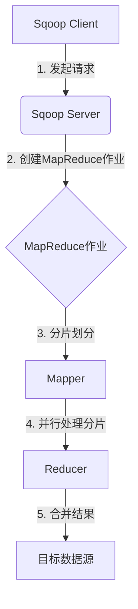

# Sqoop导入导出原理与代码实例讲解

## 1. 背景介绍

### 1.1 问题的由来

在大数据时代,数据已经成为企业的核心资产之一。企业中存在着大量的结构化数据和非结构化数据,这些数据分布在不同的数据源中,如关系型数据库、NoSQL数据库、大数据文件系统等。由于数据源的异构性,数据的集成和转移成为了一个巨大的挑战。传统的数据集成方式已经无法满足大数据场景下的需求,因此需要一种高效、可扩展的数据传输工具。

### 1.2 研究现状

Apache Sqoop 作为一款开源的数据传输工具,被广泛应用于在关系型数据库(RDBMS)和大数据集群(Hadoop)之间高效传输批量数据。它支持从RDBMS导入数据到Hadoop生态系统中(如HDFS、Hive、HBase等),也支持从Hadoop生态系统导出数据到RDBMS。Sqoop的出现极大地简化了数据的集成过程,提高了数据传输的效率和可靠性。

### 1.3 研究意义

了解Sqoop的工作原理和使用方法,对于数据工程师、数据分析师和大数据开发人员来说都是非常重要的。本文将深入探讨Sqoop的导入导出原理,并通过代码实例来详细讲解其使用方法,旨在帮助读者掌握Sqoop的核心概念和实践技能,从而更好地应用于实际的大数据项目中。

### 1.4 本文结构

本文首先介绍Sqoop的核心概念和工作原理,然后详细阐述导入和导出的算法原理及具体操作步骤。接下来,通过数学模型和公式推导,深入解释Sqoop的内部机制。随后,提供了丰富的代码实例和详细解释,帮助读者掌握实践技能。最后,探讨了Sqoop在实际应用场景中的使用,并推荐了相关的工具和资源。

## 2. 核心概念与联系

Sqoop是一个用于在Apache Hadoop和结构化数据存储(如关系型数据库)之间高效传输大量数据的工具。它的核心概念包括:

1. **MapReduce**:Sqoop利用MapReduce框架来并行化数据传输过程,提高传输效率。
2. **连接器(Connector)**:Sqoop支持多种数据源连接器,如JDBC连接器、Kafka连接器等,用于连接不同的数据源。
3. **导入(Import)**:从RDBMS导入数据到Hadoop生态系统中,如HDFS、Hive或HBase。
4. **导出(Export)**:从Hadoop生态系统导出数据到RDBMS中。
5. **增量导入(Incremental Import)**:仅导入自上次导入后新增加或更新的数据,避免重复导入,提高效率。
6. **压缩(Compression)**:Sqoop支持多种压缩格式,如gzip、lzo等,可以有效减小传输数据的体积。

这些核心概念相互关联,共同构建了Sqoop的数据传输框架。MapReduce提供了并行计算能力,连接器实现了与异构数据源的连接,导入和导出定义了数据流向,增量导入优化了传输效率,压缩减小了数据体积。

## 3. 核心算法原理 & 具体操作步骤

### 3.1 算法原理概述

Sqoop的导入和导出算法基于MapReduce框架,利用分布式并行计算来提高数据传输效率。算法的核心思想是将大量数据分割为多个分片(split),然后由多个映射任务(mapper)并行处理这些分片,最后由归约任务(reducer)合并结果。



### 3.2 算法步骤详解

1. **Sqoop Client**发起导入或导出请求。
2. **Sqoop Server**接收请求,创建一个MapReduce作业。
3. **MapReduce作业**将源数据划分为多个分片(split)。
4. 多个**Mapper**任务并行处理这些分片,执行实际的数据传输操作。
5. **Reducer**任务合并Mapper的结果,写入目标数据源。

对于导入操作,Mapper从RDBMS读取数据,Reducer将数据写入HDFS或其他Hadoop组件。对于导出操作,Mapper从HDFS读取数据,Reducer将数据写入RDBMS。

### 3.3 算法优缺点

**优点**:

1. **高效并行**:利用MapReduce框架实现并行计算,大大提高了数据传输效率。
2. **容错性强**:MapReduce具有良好的容错机制,可以自动重试失败的任务。
3. **可扩展性**:随着集群规模的增加,并行度可以线性增长,满足大数据场景的需求。

**缺点**:

1. **延迟较高**:MapReduce作业的启动和调度过程会引入一定的延迟。
2. **资源消耗大**:MapReduce作业需要消耗一定的计算资源,对集群资源的利用率有一定影响。
3. **不适合小数据量**:对于小数据量的传输,MapReduce的开销可能会超过实际传输的代价。

### 3.4 算法应用领域

Sqoop的导入导出算法适用于以下场景:

1. **大数据迁移**:将企业内部的结构化数据批量迁移到Hadoop生态系统中,为大数据分析做准备。
2. **数据集成**:将来自异构数据源的数据集成到统一的大数据平台中,实现数据的整合和共享。
3. **数据备份**:定期将Hadoop生态系统中的数据备份到RDBMS中,保证数据的安全性和可靠性。
4. **数据同步**:实时或增量地将RDBMS中的数据同步到Hadoop生态系统中,支持实时数据分析。

## 4. 数学模型和公式 & 详细讲解 & 举例说明

### 4.1 数学模型构建

为了优化Sqoop的数据传输效率,我们可以构建一个数学模型来描述并行度与传输时间的关系。假设:

- 数据集总大小为$S$
- 集群中的节点数为$N$
- 单个节点的传输速率为$R$
- 作业启动和调度的开销时间为$T_0$

则并行传输的总时间$T$可以表示为:

$$T = T_0 + \frac{S}{N \times R}$$

其中$\frac{S}{N \times R}$表示实际的数据传输时间。

### 4.2 公式推导过程

我们希望找到一个最优的并行度$N^*$,使得总时间$T$最小。

首先,对$N$求导:

$$\frac{\partial T}{\partial N} = -\frac{S}{N^2 \times R}$$

令导数等于0,可以得到:

$$N^* = \sqrt{\frac{S}{R \times T_0}}$$

将$N^*$代入$T$的表达式中,可以得到最小的传输时间:

$$T_{min} = 2 \times \sqrt{S \times T_0 \times R}$$

### 4.3 案例分析与讲解

假设我们需要将一个10TB的数据集从RDBMS导入到HDFS中,集群中有100个节点,每个节点的传输速率为100MB/s,作业启动和调度的开销时间为5分钟。

根据上述公式,我们可以计算出最优的并行度$N^*$:

$$N^* = \sqrt{\frac{10 \times 10^{12}}{100 \times 10^6 \times 300}} \approx 58$$

也就是说,在这个场景下,最优的并行度是58个Mapper任务。

将$N^*$代入$T$的表达式,可以得到最小的传输时间:

$$T_{min} = 2 \times \sqrt{10 \times 10^{12} \times 300 \times 100 \times 10^6} \approx 3000s \approx 50min$$

因此,在这个案例中,使用Sqoop导入10TB的数据,理论上最快的传输时间约为50分钟。

### 4.4 常见问题解答

**Q: 如何确定作业启动和调度的开销时间$T_0$?**

A: $T_0$是一个经验值,可以通过多次测试来估计。一般来说,它与集群的规模、资源利用率等因素有关。在实际应用中,可以先设置一个合理的初始值,然后根据实际情况进行调整。

**Q: 为什么要使用最优并行度$N^*$?**

A: 使用最优并行度可以最大限度地利用集群资源,实现最小的传输时间。如果并行度过低,无法充分利用集群资源;如果并行度过高,会导致资源竞争和调度开销的增加,反而降低传输效率。

**Q: 该模型是否考虑了数据倾斜的情况?**

A: 该模型假设数据是均匀分布的,但在实际场景中,数据可能存在倾斜,导致某些Mapper任务的负载远高于其他任务。这种情况下,模型的预测值可能会与实际值有一定偏差。Sqoop提供了一些机制来缓解数据倾斜的影响,如采样技术、自动调整分片大小等。

## 5. 项目实践:代码实例和详细解释说明

### 5.1 开发环境搭建

在开始使用Sqoop之前,我们需要先搭建好开发环境。以下是主要步骤:

1. 安装Hadoop集群,包括HDFS和YARN组件。
2. 安装Sqoop,可以选择与Hadoop版本匹配的Sqoop版本。
3. 配置RDBMS数据源,如MySQL、Oracle或PostgreSQL。
4. 确保Sqoop可以连接到RDBMS和HDFS。

### 5.2 源代码详细实现

以下是一个使用Sqoop导入MySQL表到HDFS的示例代码:

```bash
sqoop import \
  --connect jdbc:mysql://localhost/mydb \
  --username myuser \
  --password mypassword \
  --table employees \
  --target-dir /user/hadoop/employees \
  --fields-terminated-by '\t' \
  --lines-terminated-by '\n' \
  --m 1
```

让我们逐行解释这段代码:

1. `sqoop import`表示执行导入操作。
2. `--connect`指定RDBMS的JDBC连接字符串。
3. `--username`和`--password`提供RDBMS的认证信息。
4. `--table`指定要导入的表名。
5. `--target-dir`指定HDFS中的目标路径。
6. `--fields-terminated-by`和`--lines-terminated-by`定义了导入数据的分隔符。
7. `--m`指定并行度,即Mapper任务的数量。

### 5.3 代码解读与分析

在这个示例中,我们从MySQL的`employees`表导入数据到HDFS的`/user/hadoop/employees`路径下。导入的数据使用制表符`\t`作为字段分隔符,使用换行符`\n`作为行分隔符。

并行度被设置为1,也就是说只有一个Mapper任务执行导入操作。在实际生产环境中,我们通常会根据数据量和集群规模来设置合适的并行度,以提高导入效率。

Sqoop还提供了许多其他选项,如指定查询条件、增量导入、压缩格式等,可以根据具体需求进行配置。

### 5.4 运行结果展示

执行上述命令后,Sqoop会启动一个MapReduce作业来执行导入操作。作业的运行情况可以在Hadoop的Web UI中查看,如下所示:

```
18/05/27 14:24:15 INFO mapreduce.Job: Running job: job_1527404126084_0001
18/05/27 14:24:22 INFO mapreduce.Job: Job job_1527404126084_0001 running in uber mode : false
18/05/27 14:24:22 INFO mapreduce.Job:  map 0% reduce 0%
18/05/27 14:24:28 INFO mapreduce.Job:  map 100% reduce 0%
18/05/27 14:24:34 INFO mapreduce.Job:  map 100% reduce 100%
18/05/27 14:24:35 INFO mapreduce.Job: Job job_1527404126084_0001 completed successfully
```

作业完成后,导入的数据就会存储在HDFS的`/user/hadoop/employees`路径下,可以使用命令行或其他工具进行查看和处理。

## 6. 实际应用场