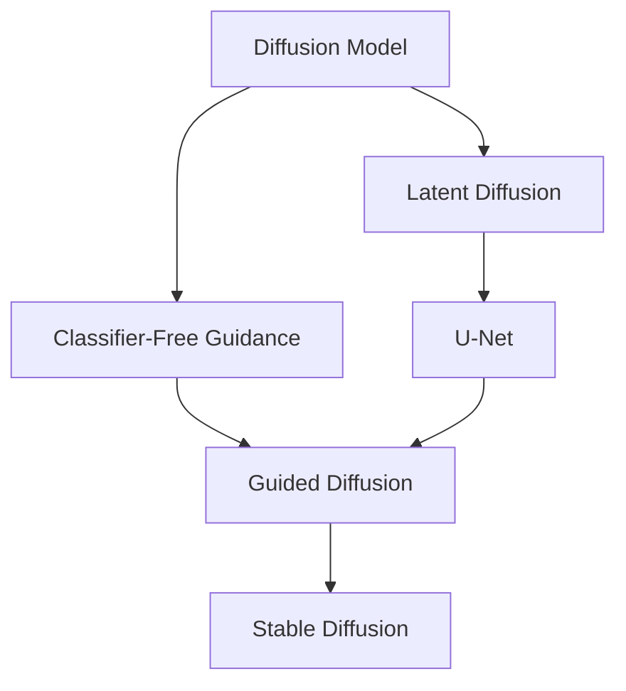

# Stable Diffusion原理与代码实例讲解

## 1. 背景介绍

### 1.1 问题的由来

在过去几年中,生成式人工智能模型取得了长足进步,尤其是在图像生成领域。传统的生成模型如变分自动编码器(VAE)和生成对抗网络(GAN)虽然取得了一些成功,但仍然存在着模型不稳定、样本质量参差不齐、训练过程困难等诸多问题。为了解决这些问题,Stable Diffusion作为一种新型的生成模型应运而生。

### 1.2 研究现状

Stable Diffusion是一种基于扩散模型的生成式深度学习模型,由Stability AI公司于2022年8月推出。它通过将高斯噪声逐步去噪,最终生成高质量图像。与传统生成模型相比,Stable Diffusion在生成图像的质量、多样性和稳定性方面表现出色,受到了广泛关注。目前,Stable Diffusion已经在艺术创作、图像编辑、设计等多个领域得到应用。

### 1.3 研究意义

Stable Diffusion的出现为生成式人工智能模型带来了新的发展方向。它不仅在技术层面上有所创新,更重要的是为人工智能在艺术创作、设计等领域的应用铺平了道路。通过深入研究Stable Diffusion的原理和实现,我们可以更好地理解和掌握这一新型生成模型,并探索其在更多领域的潜在应用。

### 1.4 本文结构

本文将从以下几个方面全面介绍Stable Diffusion:

1. 核心概念与联系
2. 核心算法原理及具体操作步骤
3. 数学模型和公式详细讲解及举例说明
4. 项目实践:代码实例和详细解释说明
5. 实际应用场景
6. 工具和资源推荐
7. 总结:未来发展趋势与挑战
8. 附录:常见问题与解答

## 2. 核心概念与联系



Stable Diffusion的核心概念主要包括:

1. **Diffusion Model(扩散模型)**: 一种生成模型,通过从纯噪声开始,逐步去噪来生成数据。
2. **Latent Diffusion(潜在扩散)**: 在潜在空间(如VAE的潜在空间)进行扩散,而不是在像素空间。
3. **U-Net**: 一种用于图像分割任务的卷积神经网络架构,在Stable Diffusion中用于从条件信息和噪声中生成图像。
4. **Classifier-Free Guidance(无分类器引导)**: 一种技术,通过在扩散过程中注入人工噪声,使生成的图像更符合用户的意图。
5. **Guided Diffusion(引导扩散)**: 将Classifier-Free Guidance与U-Net相结合,形成Stable Diffusion的核心。

这些概念相互关联、相辅相成,共同构建了Stable Diffusion强大的生成能力。

## 3. 核心算法原理及具体操作步骤

### 3.1 算法原理概述

Stable Diffusion算法的核心思想是通过学习从纯噪声到真实图像的映射,从而实现图像生成。具体来说,算法包括以下几个主要步骤:

1. **正向扩散过程**: 将真实图像添加高斯噪声,模拟从图像到纯噪声的过程。
2. **反向扩散过程**: 从纯噪声开始,通过学习的去噪模型(如U-Net)逐步去噪,最终生成图像。
3. **引导过程**: 在反向扩散过程中,通过注入人工噪声(Classifier-Free Guidance),使生成图像更符合用户意图。

### 3.2 算法步骤详解

1. **正向扩散过程**:
   - 输入真实图像 $x_0$
   - 对于时间步 $t=1,2,...,T$:
     - 从高斯分布 $\mathcal{N}(0, \sqrt{\beta_t})$ 采样噪声 $\epsilon_t$
     - 计算 $\alpha_t = 1 - \beta_t, \bar{\alpha}_t = \prod_{i=1}^t \alpha_i$
     - 计算 $x_t = \sqrt{\bar{\alpha}_t}x_0 + \sqrt{1 - \bar{\alpha}_t}\epsilon_t$
   - 最终得到纯噪声 $x_T$

2. **反向扩散过程**:
   - 输入纯噪声 $x_T$
   - 对于时间步 $t=T, T-1, ..., 1$:
     - 使用去噪模型(如U-Net) $\epsilon_\theta(x_t, t)$ 预测噪声 $\epsilon_t$
     - 计算 $\bar{\alpha}_{t-1} = \bar{\alpha}_t / \alpha_t$
     - 计算 $\hat{x}_{t-1} = \frac{1}{\sqrt{\alpha_t}}(x_t - \sqrt{1-\alpha_t}\epsilon_\theta(x_t, t))$
   - 最终得到生成图像 $\hat{x}_0$

3. **引导过程**:
   - 在反向扩散过程中,对于每个时间步 $t$:
     - 计算无条件去噪 $\epsilon_\theta(x_t, t)$
     - 计算条件去噪 $\epsilon_s(x_t, t)$,其中 $s$ 为条件信息(如文本描述)
     - 计算带引导的去噪 $\epsilon_\theta(x_t, t) + s\cdot(\epsilon_s(x_t, t) - \epsilon_\theta(x_t, t))$
     - 使用带引导的去噪进行后续计算

### 3.3 算法优缺点

**优点**:

- 生成图像质量高、细节丰富
- 生成过程稳定,结果多样性好
- 支持文本描述等条件信息引导生成
- 训练相对简单,无需对抗训练

**缺点**:

- 推理速度较慢,生成一张图像需要数百次迭代
- 对硬件资源要求较高,需要大量GPU内存
- 存在潜在的版权和伦理风险
- 生成图像可能存在视觉artifacts等缺陷

### 3.4 算法应用领域

Stable Diffusion可以应用于以下领域:

- 艺术创作: 辅助艺术家创作插画、概念画等
- 视觉设计: 生成logo、图标、界面元素等设计素材
- 游戏开发: 生成游戏角色、场景等资源
- 科研可视化: 生成科学实验、理论模型的可视化图像
- 教育辅助: 生成教学素材,增强教学体验
- 娱乐创作: 生成影视动画作品的概念图等

## 4. 数学模型和公式及详细讲解与举例说明

### 4.1 数学模型构建

Stable Diffusion的核心是学习从噪声 $x_T$ 到图像 $x_0$ 的映射 $p_\theta(x_{0:T})$。我们可以通过变分下界将其分解为两个部分:

$$
\begin{aligned}
\log p_\theta(x_0) &\geq \mathbb{E}_{q(x_{1:T}|x_0,x_T)}\left[\log\frac{p_\theta(x_{0:T})}{q(x_{1:T}|x_0,x_T)}\right] \
&= \mathbb{E}_{q(x_{1:T}|x_0,x_T)}\left[\sum_{t=2}^T\log\frac{p_\theta(x_{t-1}|x_t)p_\theta(x_T)}{q(x_t|x_{t-1},x_T)}\right]
\end{aligned}
$$

其中:

- $q(x_{1:T}|x_0, x_T)$ 是从 $x_0$ 到 $x_T$ 的正向扩散过程
- $p_\theta(x_{t-1}|x_t)$ 是反向过程,需要学习的模型参数为 $\theta$
- $p_\theta(x_T)$ 是已知的纯噪声先验分布

我们将 $p_\theta(x_{t-1}|x_t)$ 参数化为一个高斯分布,其均值由神经网络 $\epsilon_\theta(x_t, t)$ 预测:

$$
p_\theta(x_{t-1}|x_t) = \mathcal{N}(x_{t-1}; \mu_\theta(x_t, t), \sigma_t^2\mathbf{I})
$$

其中 $\mu_\theta(x_t, t) = \frac{1}{\sqrt{\alpha_t}}(x_t - \frac{1-\alpha_t}{\sqrt{1-\bar{\alpha}_t}}\epsilon_\theta(x_t, t))$

通过最大化变分下界,我们可以学习到模型参数 $\theta$,从而实现从噪声到图像的映射。

### 4.2 公式推导过程

下面将详细推导Stable Diffusion中的一些重要公式:

1. **正向扩散过程**

已知 $x_t = \sqrt{\bar{\alpha}_t}x_0 + \sqrt{1 - \bar{\alpha}_t}\epsilon_t$,我们有:

$$
\begin{aligned}
q(x_{t}|x_{t-1}) &= \mathcal{N}(x_t; \sqrt{\bar{\alpha}_{t-1}}x_{t-1}, (1-\bar{\alpha}_{t-1})\mathbf{I}) \
&= \mathcal{N}(x_t; \sqrt{\alpha_t}\sqrt{\bar{\alpha}_{t-1}}x_0 + \sqrt{1-\alpha_t}\sqrt{\bar{\alpha}_{t-1}}\epsilon_{t-1}, (1-\bar{\alpha}_{t-1})\mathbf{I})
\end{aligned}
$$

2. **反向扩散过程**

由于 $p_\theta(x_{t-1}|x_t) = \mathcal{N}(x_{t-1}; \mu_\theta(x_t, t), \sigma_t^2\mathbf{I})$,我们有:

$$
\begin{aligned}
\mu_\theta(x_t, t) &= \mathbb{E}_{p_\theta(x_{t-1}|x_t)}[x_{t-1}] \
&= \mathbb{E}_{p_\theta(x_{t-1}|x_t)}\left[\frac{x_t - \sqrt{1-\alpha_t}\epsilon_t}{\sqrt{\alpha_t}}\right] \
&= \frac{1}{\sqrt{\alpha_t}}(x_t - \sqrt{1-\alpha_t}\epsilon_\theta(x_t, t))
\end{aligned}
$$

3. **Classifier-Free Guidance**

引入一个扰动参数 $s$,带引导的去噪为:

$$
\epsilon_\theta^{(s)}(x_t, t) = \epsilon_\theta(x_t, t) + s\cdot(\epsilon_s(x_t, t) - \epsilon_\theta(x_t, t))
$$

其中 $\epsilon_s(x_t, t)$ 是条件去噪,由另一个神经网络预测。

通过调节 $s$,我们可以控制生成图像与条件信息的相关性。

### 4.3 案例分析与讲解

假设我们希望生成一张"一只可爱的小狗在草地上玩耍"的图像,下面将通过一个具体案例,演示Stable Diffusion的生成过程:

1. 输入文本描述 "a cute puppy playing on the grass" 作为条件信息 $s$
2. 从纯噪声 $x_T$ 开始反向扩散
3. 对于每个时间步 $t$:
   - 使用 U-Net 计算无条件去噪 $\epsilon_\theta(x_t, t)$
   - 使用另一个 U-Net 计算条件去噪 $\epsilon_s(x_t, t)$
   - 计算带引导的去噪 $\epsilon_\theta^{(s)}(x_t, t) = \epsilon_\theta(x_t, t) + s\cdot(\epsilon_s(x_t, t) - \epsilon_\theta(x_t, t))$
   - 使用 $\epsilon_\theta^{(s)}(x_t, t)$ 更新 $x_{t-1}$
4. 最终得到生成图像 $\hat{x}_0$

```python
import torch
from diffusers import StableDiffusionPipeline

# 加载模型和tokenizer
pipe = StableDiffusionPipeline.from_pretrained("runwayml/stable-diffusion-v1-5")

# 设置guidance scale
pipe.scheduler.set_guidance_scale(7.5)

# 生成图像
image = pipe("a cute puppy playing on the grass")["sample"][0]

# 保存图像
image.save("puppy.png")
```

上述代码使用 Hugging Face 的 `diffusers` 库,加载预训练的 Stable Diff