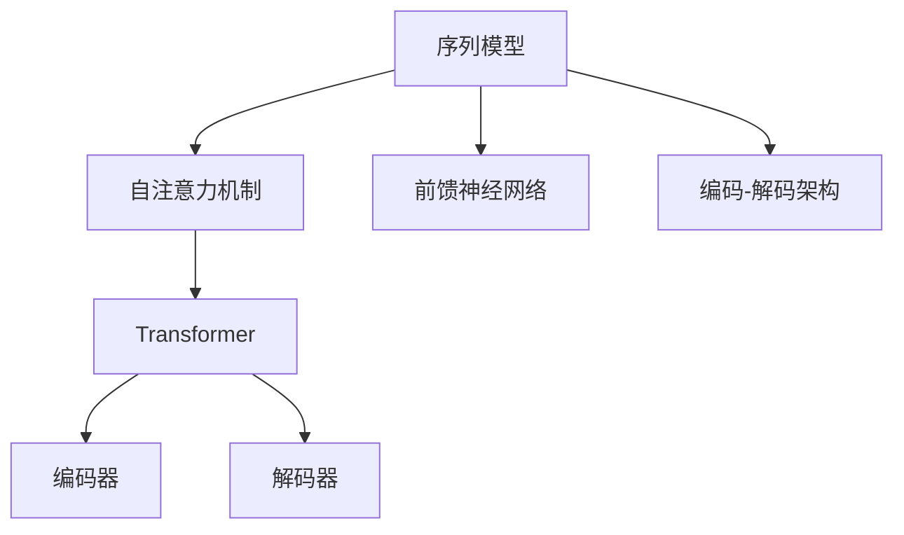
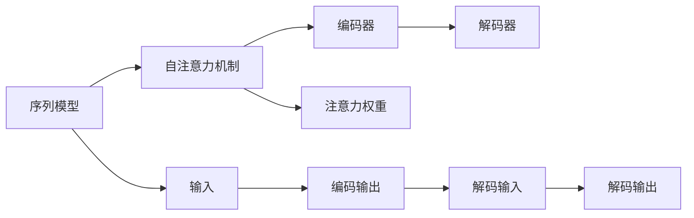
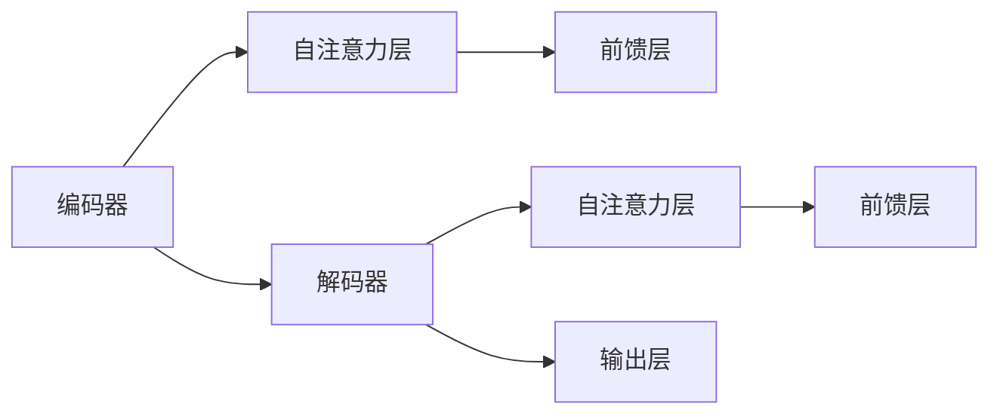
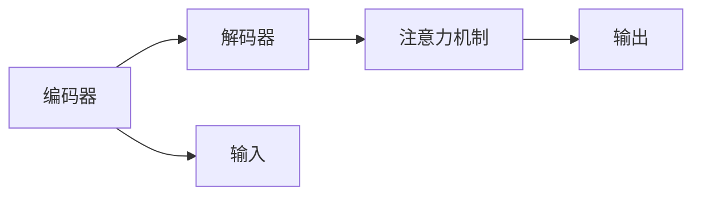
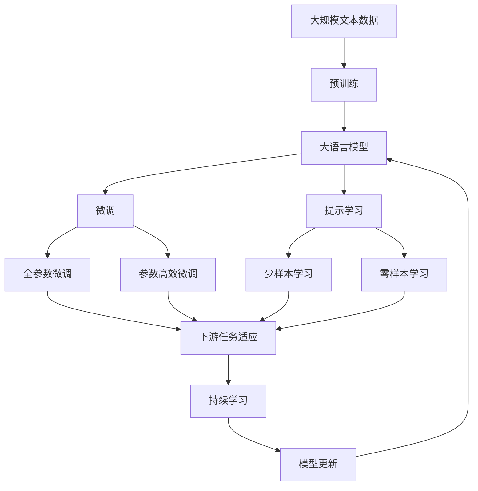

                 

# 一切皆是映射：序列模型和注意力机制

> 关键词：序列模型,注意力机制,Transformer,自注意力,前馈神经网络,编码-解码架构,序列到序列

## 1. 背景介绍

### 1.1 问题由来
在深度学习领域，特别是自然语言处理(NLP)和语音识别领域，序列模型因其在处理序列数据上的强大能力，成为了核心技术。近年来，基于自注意力机制(Attention Mechanism)的Transformer模型，更是将序列模型的表现推向了新的高度。本文旨在深入探讨序列模型和注意力机制的原理，并结合实际项目实践，展现其应用价值。

### 1.2 问题核心关键点
序列模型是一种能够处理任意长度的序列数据，并通过内部状态依赖来处理序列信息的技术。其主要应用于自然语言处理(NLP)、语音识别、时间序列预测等领域。而注意力机制则是一种允许模型在处理序列时，动态关注序列中不同位置信息的机制。Transformer模型则集成了自注意力和前馈神经网络，以高效处理长序列数据，同时避免了传统RNN和LSTM模型中的梯度消失问题。

本文将首先介绍序列模型和注意力机制的基本概念，然后深入讨论Transformer模型的核心原理。最后，通过实际项目实践，展示Transformer模型在序列预测和自然语言处理任务中的应用，并为读者提供工具和资源推荐。

## 2. 核心概念与联系

### 2.1 核心概念概述

为更好地理解序列模型和注意力机制，本节将介绍几个密切相关的核心概念：

- **序列模型(Sequence Model)**：指能够处理序列数据的模型，如循环神经网络(RNN)、长短时记忆网络(LSTM)、卷积神经网络(CNN)等。通过内部状态和记忆单元来处理序列信息。
- **自注意力机制(Self-Attention Mechanism)**：指模型在处理序列时，能够动态关注序列中不同位置的信息。通过计算序列中每个位置与其他位置的注意力权重，实现对序列信息的加权聚合。
- **前馈神经网络(Feedforward Neural Network, FNN)**：指一种线性变换-非线性变换的神经网络结构，通过多层感知器(MLP)进行特征提取和变换。
- **编码-解码架构(Encoder-Decoder Architecture)**：指一种常用于序列到序列映射的模型架构，用于生成和预测序列数据。
- **Transformer**：一种基于自注意力机制的序列模型，由Google提出，通过多层自注意力和前馈网络，实现了高效的序列处理能力。

这些核心概念之间的逻辑关系可以通过以下Mermaid流程图来展示：



这个流程图展示了这个领域的核心概念及其之间的关系：

1. 序列模型通过自注意力和前馈网络，处理序列数据。
2. 自注意力机制允许模型在处理序列时，动态关注不同位置的信息。
3. 前馈神经网络用于进行特征提取和变换。
4. 编码-解码架构用于序列到序列的映射，如机器翻译、摘要生成等任务。
5. Transformer模型集成了自注意力和前馈网络，实现了高效序列处理。

这些概念共同构成了序列模型和注意力机制的理论基础，为其在实际应用中的高效表现提供了保障。

### 2.2 概念间的关系

这些核心概念之间存在着紧密的联系，形成了序列模型和注意力机制的理论框架。下面我们通过几个Mermaid流程图来展示这些概念之间的关系。

#### 2.2.1 序列模型与注意力机制的结合



这个流程图展示了序列模型与自注意力机制的结合过程：

1. 序列模型通过输入序列进行处理，得到编码器输出。
2. 自注意力机制计算编码器输出中每个位置与其他位置的注意力权重，用于加权聚合信息。
3. 解码器通过编码器输出和注意力权重，生成解码输出。

#### 2.2.2 Transformer模型架构



这个流程图展示了Transformer模型的基本架构：

1. 编码器通过多个自注意力层和前馈层进行特征提取。
2. 解码器通过多个自注意力层和前馈层进行序列生成。
3. 模型输出层将解码器输出转化为最终的预测结果。

#### 2.2.3 编码-解码架构的实际应用



这个流程图展示了编码-解码架构在实际应用中的基本流程：

1. 编码器对输入序列进行编码。
2. 解码器通过注意力机制，选择编码器中的关键信息进行生成。
3. 模型输出预测结果。

### 2.3 核心概念的整体架构

最后，我们用一个综合的流程图来展示这些核心概念在大语言模型微调过程中的整体架构：



这个综合流程图展示了从预训练到微调，再到持续学习的完整过程。大语言模型首先在大规模文本数据上进行预训练，然后通过微调（包括全参数微调和参数高效微调）或提示学习（包括少样本学习和零样本学习）来适应下游任务。最后，通过持续学习技术，模型可以不断更新和适应新的任务和数据。 通过这些流程图，我们可以更清晰地理解序列模型和注意力机制的工作原理和优化方向。

## 3. 核心算法原理 & 具体操作步骤
### 3.1 算法原理概述

序列模型和注意力机制的结合，使得模型能够高效处理序列数据。Transformer模型正是基于这一原理，通过自注意力机制和前馈网络，实现了对序列数据的深度学习。其核心思想是：

1. 自注意力机制：模型能够动态关注序列中不同位置的信息，通过计算注意力权重对序列进行加权聚合。
2. 前馈神经网络：用于对序列数据进行非线性特征提取和变换，增强模型的表达能力。

Transformer模型主要由编码器和解码器两部分组成，通过多层自注意力和前馈网络进行序列处理。其基本流程如下：

1. 编码器：对输入序列进行编码，得到编码器输出。
2. 解码器：通过编码器输出和注意力权重，生成解码序列。

### 3.2 算法步骤详解

Transformer模型的训练流程一般包括以下几个关键步骤：

**Step 1: 准备预训练模型和数据集**
- 选择合适的预训练语言模型 $M_{\theta}$ 作为初始化参数，如 BERT、GPT 等。
- 准备下游任务 $T$ 的标注数据集 $D$，划分为训练集、验证集和测试集。一般要求标注数据与预训练数据的分布不要差异过大。

**Step 2: 添加任务适配层**
- 根据任务类型，在预训练模型顶层设计合适的输出层和损失函数。
- 对于分类任务，通常在顶层添加线性分类器和交叉熵损失函数。
- 对于生成任务，通常使用语言模型的解码器输出概率分布，并以负对数似然为损失函数。

**Step 3: 设置微调超参数**
- 选择合适的优化算法及其参数，如 AdamW、SGD 等，设置学习率、批大小、迭代轮数等。
- 设置正则化技术及强度，包括权重衰减、Dropout、Early Stopping 等。
- 确定冻结预训练参数的策略，如仅微调顶层，或全部参数都参与微调。

**Step 4: 执行梯度训练**
- 将训练集数据分批次输入模型，前向传播计算损失函数。
- 反向传播计算参数梯度，根据设定的优化算法和学习率更新模型参数。
- 周期性在验证集上评估模型性能，根据性能指标决定是否触发 Early Stopping。
- 重复上述步骤直到满足预设的迭代轮数或 Early Stopping 条件。

**Step 5: 测试和部署**
- 在测试集上评估微调后模型 $M_{\hat{\theta}}$ 的性能，对比微调前后的精度提升。
- 使用微调后的模型对新样本进行推理预测，集成到实际的应用系统中。
- 持续收集新的数据，定期重新微调模型，以适应数据分布的变化。

以上是Transformer模型进行序列预测和自然语言处理任务微调的一般流程。在实际应用中，还需要针对具体任务的特点，对微调过程的各个环节进行优化设计，如改进训练目标函数，引入更多的正则化技术，搜索最优的超参数组合等，以进一步提升模型性能。

### 3.3 算法优缺点

Transformer模型作为一种高效的序列处理技术，具有以下优点：

1. 并行计算能力强。Transformer模型中的自注意力机制可以通过矩阵运算高效计算，适合大规模并行计算。
2. 适用于长序列处理。由于Transformer模型无需通过RNN等状态依赖机制处理序列，因此可以高效处理长序列数据。
3. 鲁棒性强。Transformer模型通过多层的自注意力机制和前馈网络，可以有效缓解梯度消失和梯度爆炸问题，提升模型鲁棒性。
4. 泛化能力强。Transformer模型能够动态关注序列中不同位置的信息，从而在多种下游任务中取得良好效果。

同时，Transformer模型也存在一些局限性：

1. 需要大量标注数据。Transformer模型虽然能够高效处理长序列，但在下游任务中仍需大量标注数据进行微调，这增加了数据获取成本。
2. 计算资源需求高。Transformer模型参数量大，内存占用高，需要高性能计算设备支持。
3. 模型复杂度高。Transformer模型结构复杂，需要较高的设计和实现能力，调试难度大。

尽管如此，Transformer模型仍然是目前处理序列数据和自然语言处理任务最有效的方法之一。未来随着计算资源的进一步提升和优化，Transformer模型的应用前景将更加广阔。

### 3.4 算法应用领域

Transformer模型已经在序列预测和自然语言处理等多个领域取得了广泛的应用，例如：

- 文本分类：如情感分析、主题分类等。通过微调Transformer模型，可以准确地预测文本的分类标签。
- 命名实体识别：识别文本中的人名、地名、机构名等特定实体。通过微调Transformer模型，可以准确地识别出实体边界和类型。
- 机器翻译：将源语言文本翻译成目标语言。通过微调Transformer模型，可以实现高效的文本翻译。
- 对话系统：使机器能够与人自然对话。通过微调Transformer模型，可以生成自然流畅的对话回复。
- 文本摘要：将长文本压缩成简短摘要。通过微调Transformer模型，可以自动生成高质量的摘要。
- 问答系统：对自然语言问题给出答案。通过微调Transformer模型，可以准确地回答问题。
- 语音识别：将语音信号转化为文本。通过微调Transformer模型，可以实现高效的语音识别。

除了上述这些经典任务外，Transformer模型还被创新性地应用到更多场景中，如文本生成、代码生成、情感分析、事件抽取等，为自然语言处理技术带来了新的突破。

## 4. 数学模型和公式 & 详细讲解  
### 4.1 数学模型构建

Transformer模型主要由编码器和解码器两部分组成，下面分别介绍编码器和解码器的数学模型构建。

#### 4.1.1 编码器

编码器由多个自注意力层和前馈层组成。以Transformer模型为例，编码器的输入为序列 $X=\{x_1, x_2, ..., x_T\}$，输出为编码器表示 $Z$。

其中，自注意力层用于计算序列中每个位置与其他位置的注意力权重，进行加权聚合。其数学模型如下：

$$
\text{Attention}(Q, K, V) = \text{Softmax}(QK^T / \sqrt{d_k})V
$$

其中，$Q$、$K$、$V$分别为查询、键、值向量，$d_k$为键向量的维度。

前馈层用于对编码器输出进行非线性变换。Transformer模型的前馈层为多层感知器(MLP)，其数学模型如下：

$$
\text{FFN}(x) = \text{Linear}\left(\text{ReLU}\left(\text{Linear}(x)\right)\right)
$$

其中，$\text{Linear}$表示线性变换，$\text{ReLU}$表示激活函数。

编码器由多个自注意力层和前馈层组成，其数学模型如下：

$$
\begin{aligned}
Z &= \text{LayerNorm}(x + \text{Attention}(Q, K, V)) + \text{LayerNorm}(x + \text{FFN}(x))
\end{aligned}
$$

其中，$\text{LayerNorm}$表示层归一化，用于加速模型训练和收敛。

#### 4.1.2 解码器

解码器同样由多个自注意力层和前馈层组成。以Transformer模型为例，解码器的输入为编码器表示 $Z$ 和前一时刻的输出 $Y_{t-1}$，输出为当前时刻的预测结果 $Y_t$。

其中，自注意力层用于计算编码器输出和当前时刻输出之间的注意力权重，进行加权聚合。其数学模型如下：

$$
\text{Attention}(Q, K, V) = \text{Softmax}(QK^T / \sqrt{d_k})V
$$

前馈层用于对解码器输出进行非线性变换。Transformer模型的前馈层为多层感知器(MLP)，其数学模型如下：

$$
\text{FFN}(x) = \text{Linear}\left(\text{ReLU}\left(\text{Linear}(x)\right)\right)
$$

解码器由多个自注意力层和前馈层组成，其数学模型如下：

$$
\begin{aligned}
Y_t &= \text{LayerNorm}(Y_{t-1} + \text{Attention}(Q, K, V)) + \text{LayerNorm}(Y_{t-1} + \text{FFN}(Y_{t-1}))
\end{aligned}
$$

其中，$\text{LayerNorm}$表示层归一化，用于加速模型训练和收敛。

#### 4.1.3 编码-解码架构

编码-解码架构的输入为源语言序列 $X$，输出为目标语言序列 $Y$。以Transformer模型为例，其数学模型如下：

$$
\begin{aligned}
Y &= \text{LayerNorm}(Y_{T-1} + \text{Attention}(Q, K, V)) + \text{LayerNorm}(Y_{T-1} + \text{FFN}(Y_{T-1}))
\end{aligned}
$$

其中，$Y_{T-1}$表示解码器输出的前一时刻预测结果，$Q$、$K$、$V$分别表示查询、键、值向量，$d_k$为键向量的维度。

通过编码-解码架构，Transformer模型可以实现高效的序列到序列映射，如机器翻译、文本摘要等任务。

### 4.2 公式推导过程

Transformer模型的训练过程涉及前向传播和反向传播两个阶段。下面分别介绍这两个阶段的具体公式推导。

#### 4.2.1 前向传播

以机器翻译为例，Transformer模型的前向传播过程包括编码器和解码器的计算。假设输入序列为 $X=\{x_1, x_2, ..., x_T\}$，目标序列为 $Y=\{y_1, y_2, ..., y_{\hat{T}}\}$。

1. 编码器计算：

$$
Z = \text{LayerNorm}(X + \text{Attention}(Q, K, V)) + \text{LayerNorm}(X + \text{FFN}(X))
$$

其中，$Z$表示编码器输出，$Q$、$K$、$V$分别表示查询、键、值向量，$d_k$为键向量的维度。

2. 解码器计算：

$$
Y_t = \text{LayerNorm}(Y_{t-1} + \text{Attention}(Q, K, V)) + \text{LayerNorm}(Y_{t-1} + \text{FFN}(Y_{t-1}))
$$

其中，$Y_t$表示解码器输出，$Q$、$K$、$V$分别表示查询、键、值向量，$d_k$为键向量的维度。

3. 损失函数计算：

$$
\mathcal{L} = -\frac{1}{\hat{T}}\sum_{t=1}^{\hat{T}}y_t \log \hat{y}_t
$$

其中，$y_t$表示目标序列的t时刻预测结果，$\hat{y}_t$表示模型输出的t时刻预测结果，$\hat{T}$表示目标序列的长度。

#### 4.2.2 反向传播

以机器翻译为例，Transformer模型的反向传播过程包括编码器和解码器的计算。假设输入序列为 $X=\{x_1, x_2, ..., x_T\}$，目标序列为 $Y=\{y_1, y_2, ..., y_{\hat{T}}\}$。

1. 编码器计算：

$$
\begin{aligned}
Z &= \text{LayerNorm}(X + \text{Attention}(Q, K, V)) + \text{LayerNorm}(X + \text{FFN}(X)) \\
\Delta Z &= \frac{\partial \mathcal{L}}{\partial Z} = \frac{\partial \mathcal{L}}{\partial Q} + \frac{\partial \mathcal{L}}{\partial K} + \frac{\partial \mathcal{L}}{\partial V}
\end{aligned}
$$

其中，$\Delta Z$表示编码器输出对损失函数的梯度。

2. 解码器计算：

$$
\begin{aligned}
Y_t &= \text{LayerNorm}(Y_{t-1} + \text{Attention}(Q, K, V)) + \text{LayerNorm}(Y_{t-1} + \text{FFN}(Y_{t-1})) \\
\Delta Y_t &= \frac{\partial \mathcal{L}}{\partial Y_t} = \frac{\partial \mathcal{L}}{\partial Q} + \frac{\partial \mathcal{L}}{\partial K} + \frac{\partial \mathcal{L}}{\partial V}
\end{aligned}
$$

其中，$\Delta Y_t$表示解码器输出对损失函数的梯度。

3. 编码器权重更新：

$$
\begin{aligned}
\Delta Q &= \frac{\partial \mathcal{L}}{\partial Q} \\
\Delta K &= \frac{\partial \mathcal{L}}{\partial K} \\
\Delta V &= \frac{\partial \mathcal{L}}{\partial V}
\end{aligned}
$$

4. 解码器权重更新：

$$
\begin{aligned}
\Delta Q &= \frac{\partial \mathcal{L}}{\partial Q} \\
\Delta K &= \frac{\partial \mathcal{L}}{\partial K} \\
\Delta V &= \frac{\partial \mathcal{L}}{\partial V}
\end{aligned}
$$

通过上述公式推导，可以看到Transformer模型的前向传播和反向传播过程。通过反向传播，模型能够自动计算梯度，进行参数更新，从而不断优化模型性能。

### 4.3 案例分析与讲解

以下是一个简化的例子，说明Transformer模型在机器翻译任务中的应用。

假设输入序列为 $X=\{I, love, you\}$，目标序列为 $Y=\{Je, t'aime, toi\}$。以单层Transformer模型为例，其前向传播和反向传播过程如下：

1. 编码器计算：

$$
Z = \text{LayerNorm}(X + \text{Attention}(Q, K, V)) + \text{LayerNorm}(X + \text{FFN}(X))
$$

2. 解码器计算：

$$
Y_t = \text{LayerNorm}(Y_{t-1} + \text{Attention}(Q, K, V)) + \text{LayerNorm}(Y_{t-1} + \text{FFN}(Y_{t-1}))
$$

3. 损失函数计算：

$$
\mathcal{L} = -\frac{1}{\hat{T}}\sum_{t=1}^{\hat{T}}y_t \log \hat{y}_t
$$

4. 反向传播：

$$
\begin{aligned}
\Delta Z &= \frac{\partial \mathcal{L}}{\partial Z} = \frac{\partial \mathcal{L}}{\partial Q} + \frac{\partial \mathcal{L}}{\partial K} + \frac{\partial \mathcal{L}}{\partial V} \\
\Delta Y_t &= \frac{\partial \mathcal{L}}{\partial Y_t} = \frac{\partial \mathcal{L}}{\partial Q} + \frac{\partial \mathcal{L}}{\partial K} + \frac{\partial \mathcal{L}}{\partial V}
\end{aligned}
$$

通过反向传播，模型能够自动计算梯度，进行参数更新，从而不断优化模型性能。

## 5. 项目实践：代码实例和详细解释说明
### 5.1 开发环境搭建

在进行Transformer模型微调实践前，我们需要准备好开发环境。以下是使用Python进行PyTorch开发的环境配置流程：

1. 安装Anaconda：从官网下载并安装Anaconda，用于创建独立的Python环境。

2. 创建并激活虚拟环境：
```bash
conda create -n pytorch-env python=3.8 
conda activate pytorch-env
```

3. 安装PyTorch：根据CUDA版本，从官网获取对应的安装命令。例如：
```bash
conda install pytorch torchvision torchaudio cudatoolkit=11.1 -c pytorch -c conda-forge
```

4. 安装Transformers库：
```bash
pip install transformers
```

5. 安装各类工具包：
```bash
pip install numpy pandas scikit-learn matplotlib tqdm jupyter notebook ipython
```

完成上述步骤后，即可在`pytorch-env`环境中开始微调实践。

### 5.2 源代码详细实现

这里我们以机器翻译任务为例，给出使用Transformers库对BERT模型进行微调的PyTorch代码实现。

首先，定义机器翻译的数据处理函数：

```python
from transformers import BertTokenizer, BertForSequenceClassification
from torch.utils.data import Dataset
import torch

class SeqClassDataset(Dataset):
    def __init__(self, texts, labels, tokenizer):
        self.texts = texts
        self.labels = labels
        self.tokenizer = tokenizer
        
    def __len__(self):
        return len(self.texts)
    
    def __getitem__(self, item):
        text = self.texts[item]
        label = self.labels[item]
        
        encoding = self.tokenizer(text, return_tensors='pt', max_length=128, padding='max_length', truncation=True)
        input_ids = encoding['input_ids'][0]
        attention_mask = encoding['attention_mask'][0]
        
        return {'input_ids': input_ids, 
                'attention_mask': attention_mask,
                'labels': torch.tensor(label, dtype=torch.long)}
```

然后，定义模型和优化器：

```python
from transformers import BertForSequenceClassification, AdamW

model = BertForSequenceClassification.from_pretrained('bert-base-cased', num_labels=2)

optimizer = AdamW(model.parameters(), lr=2e-5)
```

接着，定义训练和评估函数：

```python
from torch.utils.data import DataLoader
from tqdm import tqdm
from sklearn.metrics import classification_report

device = torch.device('cuda') if torch.cuda.is_available() else torch.device('cpu')
model.to(device)

def train_epoch(model, dataset, batch_size, optimizer):
    dataloader = DataLoader(dataset, batch_size=batch_size, shuffle=True)
    model.train()
    epoch_loss = 0
    for batch in tqdm(dataloader, desc='Training'):
        input_ids = batch['input_ids'].to(device)
        attention_mask = batch['attention_mask'].to(device)
        labels = batch['labels'].to(device)
        model.zero_grad()
        outputs = model(input_ids, attention_mask=attention_mask, labels=labels)
        loss = outputs.loss
        epoch_loss += loss.item()
        loss.backward()
        optimizer.step()
    return epoch_loss / len(dataloader)

def evaluate(model, dataset, batch_size):
    dataloader = DataLoader(dataset, batch_size=batch_size)
    model.eval()
    preds, labels = [], []
    with torch.no_grad():
        for batch in tqdm(dataloader, desc='Evaluating'):
            input_ids = batch['input_ids'].to(device)
            attention_mask = batch['attention_mask

