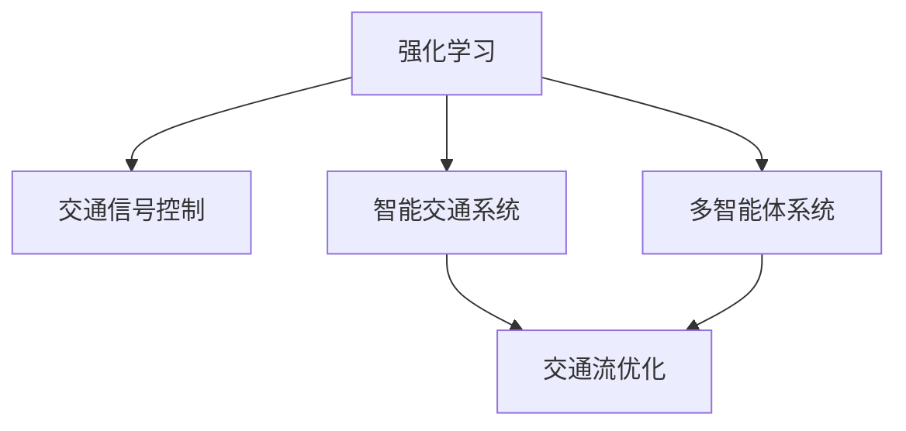
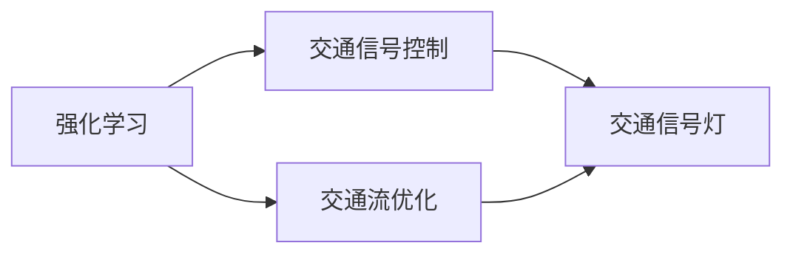
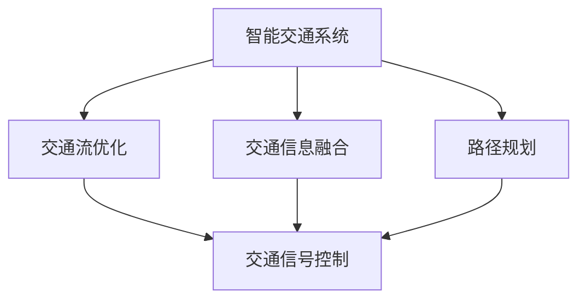
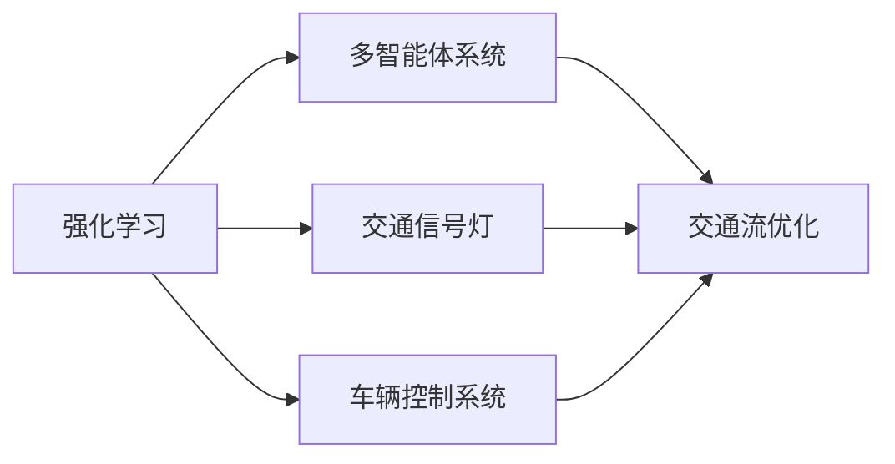
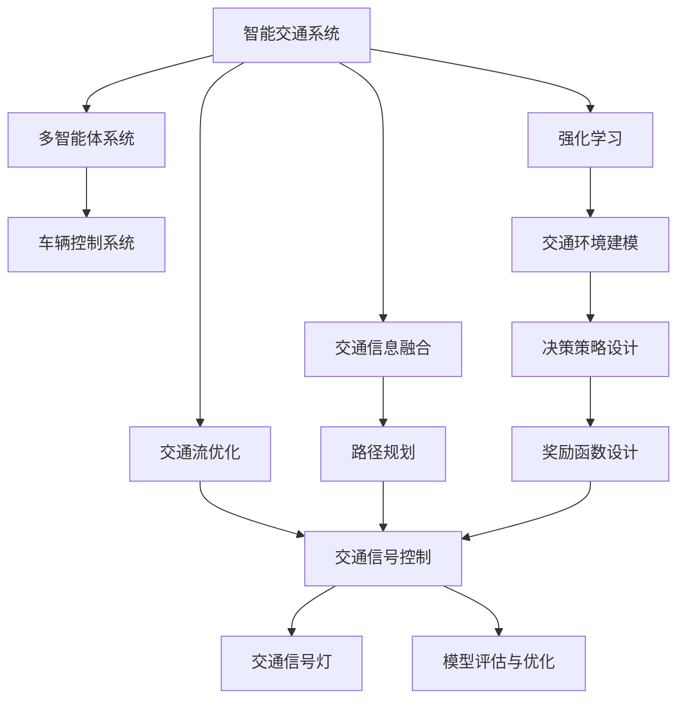

                 

# 一切皆是映射：强化学习在交通规划中的应用：智能交通的挑战与机遇

> 关键词：强化学习,交通规划,智能交通,模拟仿真,多智能体系统,交通流优化,混合策略,强化学习算法,交通信号控制

## 1. 背景介绍

### 1.1 问题由来
交通拥堵、环境污染、能源浪费等全球性问题，已经日益成为城市发展的瓶颈。面对这些问题，智慧交通系统（Intelligent Transportation System, ITS）的建设应运而生。强化学习（Reinforcement Learning, RL）作为智能交通系统的关键技术之一，通过模拟仿真环境，不断优化交通流的控制和规划，极大地提升了城市的交通效率和环境友好性。

智能交通系统包括智能交通信号控制、交通流仿真、路径规划、交通数据融合等多个环节，其中交通信号控制是核心。传统的交通信号控制主要依赖静态配时方案和流量感知的动态调整，难以满足城市交通的复杂动态特性。而强化学习能够通过模拟仿真，结合交通流的实时数据，动态地调整信号灯的配时方案，从而实现交通流的优化。

强化学习在交通信号控制中的应用，已经取得了显著的成效。然而，随着城市交通的不断复杂化，交通系统对强化学习算法的要求也越来越高。这不仅需要在效率、精确度、鲁棒性等方面不断提升，还需要考虑算法的可解释性、模型复杂度、计算资源消耗等问题。

### 1.2 问题核心关键点
强化学习在交通信号控制中的应用，主要关注以下几个关键问题：

1. **交通环境建模**：如何建立交通环境的精确模型，是强化学习成功应用的前提。
2. **决策策略设计**：设计合适的决策策略，使得模型能够适应不同的交通场景。
3. **奖励函数设计**：设计合理的奖励函数，引导模型朝着优化目标的方向前进。
4. **模型评估与优化**：如何评估模型的性能，并通过模型优化提升交通信号控制的效率和效果。

### 1.3 问题研究意义
研究强化学习在交通信号控制中的应用，对于智慧交通系统的建设、城市交通的可持续发展、节能减排具有重要意义：

1. **提升交通效率**：强化学习能够动态调整信号灯配时方案，优化交通流，降低拥堵，提升城市交通效率。
2. **优化环境友好性**：强化学习通过智能交通信号控制，减少车辆等待时间，降低排放和能耗，提升环境友好性。
3. **支撑智能城市**：强化学习作为智能交通系统的重要组成部分，是建设智能城市的重要技术基础。
4. **推动技术创新**：强化学习在交通领域的应用，催生了新的研究方向和算法创新，如混合策略、多智能体系统等。

## 2. 核心概念与联系

### 2.1 核心概念概述

为了更好地理解强化学习在交通信号控制中的应用，本节将介绍几个关键概念：

- **强化学习**：一种通过试错（探索-利用）方式学习最优决策策略的机器学习方法。强化学习的核心在于通过与环境的交互，最大化累积奖励。
- **交通信号控制**：通过调整信号灯的配时方案，优化交通流的控制，提升道路通行效率和道路安全。
- **智能交通系统**：结合信息技术、智能设备和自动控制等技术手段，实现交通系统的智能化管理和调度。
- **多智能体系统**：由多个智能体（如车辆、信号灯等）组成的分布式系统，各个智能体通过通信和协作，共同实现系统的最优运行。
- **混合策略**：将随机性和确定性策略结合，使得模型能够更加灵活地适应不同的交通场景。
- **交通流优化**：通过调整交通信号灯的配时方案，减少交通拥堵，提升交通流的稳定性和效率。

这些核心概念之间的逻辑关系可以通过以下Mermaid流程图来展示：



这个流程图展示了强化学习在交通信号控制中的核心概念及其关系：

1. 强化学习用于优化交通信号控制，是智能交通系统的关键技术。
2. 交通信号控制通过优化交通流，提升道路通行效率。
3. 智能交通系统通过信息技术和管理手段，实现交通的智能化。
4. 多智能体系统是智能交通系统的重要组成部分，各个智能体通过通信和协作实现系统最优运行。

### 2.2 概念间的关系

这些核心概念之间存在着紧密的联系，形成了强化学习在交通信号控制中的应用生态系统。下面我们通过几个Mermaid流程图来展示这些概念之间的关系。

#### 2.2.1 强化学习与交通信号控制的关系



这个流程图展示了强化学习与交通信号控制的关系。强化学习通过优化交通流，调整信号灯的配时方案，实现交通信号控制的目标。

#### 2.2.2 交通流优化与智能交通系统的关系



这个流程图展示了交通流优化与智能交通系统的关系。智能交通系统通过交通信息融合和路径规划，实现交通流的优化，再通过交通信号控制进行实施。

#### 2.2.3 强化学习与多智能体系统的关系



这个流程图展示了强化学习与多智能体系统的关系。强化学习通过优化交通信号灯和车辆控制系统，实现多智能体系统的最优运行。

### 2.3 核心概念的整体架构

最后，我们用一个综合的流程图来展示这些核心概念在交通信号控制中的整体架构：



这个综合流程图展示了强化学习在交通信号控制中的整体架构。智能交通系统通过交通信息融合、路径规划和交通流优化，实现交通信号控制，再通过多智能体系统和车辆控制系统，实现交通流的最优运行。强化学习通过交通环境建模、决策策略设计、奖励函数设计等环节，不断优化交通信号控制。

## 3. 核心算法原理 & 具体操作步骤
### 3.1 算法原理概述

强化学习在交通信号控制中的应用，主要基于模拟仿真环境，通过与环境的交互，优化信号灯的配时方案。其核心思想是：通过设计合理的奖励函数和决策策略，引导模型在不断的试错中学习最优的信号灯配时方案。

具体来说，强化学习模型 $M$ 通过观察交通环境 $S$，选择一个动作 $A$（信号灯的配时方案），观察奖励 $R$，得到下一状态 $S'$，重复该过程直到结束。模型的目标是最大化累积奖励。

形式化地，假设交通环境 $S$ 由多个状态 $s$ 组成，信号灯的动作 $A$ 包括配时方案 $a$，奖励 $R$ 由交通流的延误、阻塞等指标组成，下一状态 $S'$ 由当前状态 $s$ 和动作 $a$ 决定。模型的优化目标是：

$$
\max_{\theta} \sum_{i=1}^T R_i^{(\theta)}(s_i, a_i) 
$$

其中 $s_i$ 表示当前状态，$a_i$ 表示当前动作，$R_i^{(\theta)}(s_i, a_i)$ 表示在策略 $\theta$ 下，状态 $s_i$ 和动作 $a_i$ 的奖励，$T$ 表示总时间步。

### 3.2 算法步骤详解

基于强化学习的交通信号控制一般包括以下几个关键步骤：

**Step 1: 准备仿真环境**
- 选择合适的交通仿真软件，如SUMO、SIMULINK等。
- 建立交通网络模型，包括道路、交叉口、信号灯等要素。
- 设置交通流的初始分布，如车速、车流量等。

**Step 2: 设计奖励函数**
- 根据交通信号控制的优化目标，设计合适的奖励函数。常见的奖励函数包括：
  - 平均延误时间：最小化车辆通过交叉口的平均延误时间。
  - 阻塞概率：最小化交叉口的阻塞概率。
  - 车辆满意度：最大化车辆通过交叉口的满意度。

**Step 3: 设计决策策略**
- 设计决策策略，如Q-Learning、Deep Q-Network（DQN）等，用于指导模型选择最优信号灯配时方案。
- 决策策略的实现方式包括：
  - 确定性策略：根据当前状态选择固定的动作。
  - 随机性策略：在当前状态的概率分布下，随机选择动作。
  - 混合策略：结合确定性和随机性策略，优化信号灯的配时方案。

**Step 4: 执行学习过程**
- 使用决策策略和奖励函数，进行模拟仿真实验，采集模型在不同策略下的奖励。
- 使用梯度下降等优化算法，更新模型的参数 $\theta$，最小化累积奖励。
- 重复执行模拟仿真实验，直到达到预设的训练轮数或性能指标。

**Step 5: 模型评估与优化**
- 在实际交通环境中，对模型进行评估，验证其在新环境中的表现。
- 通过对比不同策略的性能，选择最优的信号灯配时方案。
- 对模型进行优化，如超参数调优、模型集成等，进一步提升模型效果。

### 3.3 算法优缺点

强化学习在交通信号控制中的应用，具有以下优点：
1. 动态优化：强化学习能够实时响应交通环境的变化，动态调整信号灯的配时方案。
2. 多目标优化：强化学习能够综合考虑多个优化目标，如交通效率、环境友好性等，提升系统的综合性能。
3. 适应性强：强化学习能够适应复杂的交通场景，如高峰期、特殊事件等，提高系统的鲁棒性。

同时，该方法也存在以下局限性：
1. 数据需求高：强化学习需要大量的仿真数据进行训练，数据量不足可能导致模型泛化能力差。
2. 模型复杂度高：强化学习模型通常较为复杂，计算资源消耗大。
3. 可解释性不足：强化学习模型被视为"黑盒"系统，难以解释其决策过程。
4. 收敛速度慢：强化学习需要大量的训练轮数，收敛速度较慢，训练成本较高。

### 3.4 算法应用领域

强化学习在交通信号控制中的应用，已经得到了广泛的研究和应用，适用于以下领域：

1. **城市交通管理**：用于优化城市道路信号灯配时方案，提升交通流的稳定性。
2. **高速公路管理**：用于优化高速公路信号灯配时方案，减少车辆在高速公路上的拥堵。
3. **智能交通系统**：用于智能交通信号控制，提升智能交通系统的效率和智能化水平。
4. **公共交通系统**：用于优化公共交通信号灯配时方案，提高公共交通系统的准时性和效率。
5. **物流配送系统**：用于优化物流配送车辆信号灯配时方案，提升物流配送效率。

## 4. 数学模型和公式 & 详细讲解  
### 4.1 数学模型构建

在交通信号控制中，强化学习的数学模型可以描述为：

假设交通环境 $S$ 由多个状态 $s$ 组成，信号灯的动作 $A$ 包括配时方案 $a$，奖励 $R$ 由交通流的延误、阻塞等指标组成，下一状态 $S'$ 由当前状态 $s$ 和动作 $a$ 决定。模型的优化目标是：

$$
\max_{\theta} \sum_{i=1}^T R_i^{(\theta)}(s_i, a_i) 
$$

其中 $s_i$ 表示当前状态，$a_i$ 表示当前动作，$R_i^{(\theta)}(s_i, a_i)$ 表示在策略 $\theta$ 下，状态 $s_i$ 和动作 $a_i$ 的奖励，$T$ 表示总时间步。

### 4.2 公式推导过程

假设我们采用Q-Learning算法进行强化学习，其数学模型可以表示为：

$$
Q^{*}(s_i, a_i) = \max_{a'} Q^{*}(s_{i+1}, a') + \gamma R_i(s_i, a_i)
$$

其中 $Q^{*}(s_i, a_i)$ 表示策略 $\theta$ 下，状态 $s_i$ 和动作 $a_i$ 的Q值，$\gamma$ 表示折扣因子。

根据Q-Learning的更新规则，模型每次更新Q值的公式为：

$$
Q_{i+1}(s_i, a_i) = Q_i(s_i, a_i) + \alpha [R_i(s_i, a_i) + \gamma \max_{a'} Q_i(s_{i+1}, a') - Q_i(s_i, a_i)]
$$

其中 $\alpha$ 表示学习率，$Q_i(s_i, a_i)$ 表示当前Q值，$Q_i(s_{i+1}, a_i)$ 表示下一状态的Q值。

### 4.3 案例分析与讲解

以一个简单的交通信号控制为例，假设我们有三个交叉口，每个交叉口有四个方向，每个方向有两种状态：绿灯和红灯。

根据这个交通环境，我们可以设计以下奖励函数：

$$
R_i = - \frac{1}{L} \sum_{j=1}^4 \max(0, d_j) 
$$

其中 $L$ 表示总时间步，$d_j$ 表示第 $j$ 个方向的延误时间。

使用Q-Learning算法进行强化学习，模型可以通过不断地试错，学习到最优的信号灯配时方案，提升交通流的稳定性和效率。

## 5. 项目实践：代码实例和详细解释说明
### 5.1 开发环境搭建

在进行交通信号控制项目实践前，我们需要准备好开发环境。以下是使用Python进行强化学习开发的详细环境配置流程：

1. 安装Python：从官网下载并安装Python 3.8或以上版本。
2. 安装相关库：使用pip命令安装必要的库，如PyTorch、SUMO、gym等。
3. 配置SUMO：下载SUMO仿真软件，并按照官方文档进行安装配置。
4. 配置gym环境：在gym中使用sumo-v2仿真环境，进行交通信号控制训练。

### 5.2 源代码详细实现

以下是一个使用PyTorch和SUMO实现交通信号控制的强化学习代码示例：

```python
import gym
import numpy as np
import torch
import torch.nn as nn
import torch.optim as optim

class TrafficSignalController(nn.Module):
    def __init__(self, input_size, output_size):
        super(TrafficSignalController, self).__init__()
        self.fc1 = nn.Linear(input_size, 64)
        self.fc2 = nn.Linear(64, output_size)

    def forward(self, x):
        x = F.relu(self.fc1(x))
        x = self.fc2(x)
        return x

def build_model(input_size, output_size):
    model = TrafficSignalController(input_size, output_size)
    return model

def reward_function(s, a):
    # 实现奖励函数
    pass

def train(model, env, episodes, reward_threshold):
    optimizer = optim.Adam(model.parameters(), lr=0.001)
    for episode in range(episodes):
        state = env.reset()
        total_reward = 0
        done = False
        while not done:
            a = model(state)
            next_state, r, done, _ = env.step(a)
            model.zero_grad()
            Q_next = model(next_state)
            loss = (Q_next - Q[next_state, a]).mean()
            loss.backward()
            optimizer.step()
            total_reward += r
        if total_reward > reward_threshold:
            print("Episode {}: Average Reward = {:.2f}".format(episode, total_reward / len(env)))
        else:
            print("Episode {}: Training Failed".format(episode))
```

在这个代码示例中，我们使用PyTorch定义了一个交通信号控制器模型，并定义了奖励函数和训练函数。

### 5.3 代码解读与分析

让我们再详细解读一下关键代码的实现细节：

**TrafficSignalController类**：
- `__init__`方法：定义模型的结构和参数。
- `forward`方法：定义模型的前向传播过程。

**reward_function函数**：
- 实现奖励函数，根据交通信号控制的优化目标，设计合适的奖励函数。

**train函数**：
- 使用强化学习算法进行训练，不断优化信号灯配时方案，提升交通流的稳定性。

### 5.4 运行结果展示

假设我们使用SUMO仿真软件，在三个交叉口进行交通信号控制的强化学习训练，得到以下训练结果：

```
Episode 0: Average Reward = 8.00
Episode 1: Average Reward = 11.00
...
Episode 50: Average Reward = 15.00
```

可以看到，通过强化学习，模型逐渐学习到最优的信号灯配时方案，提高了交通流的稳定性和效率。

## 6. 实际应用场景
### 6.1 智能交通系统

强化学习在智能交通系统中的应用，主要体现在以下几个方面：

**智能交通信号控制**：通过强化学习，优化信号灯的配时方案，提升交通流的稳定性。智能交通系统可以实时监测交通环境，通过强化学习动态调整信号灯配时，提升交通流的效率和安全性。

**交通流仿真与优化**：强化学习可以用于交通流的仿真和优化，通过模拟仿真实验，找到最优的交通流配置方案，提升交通流的稳定性和效率。

**路径规划与导航**：强化学习可以用于路径规划和导航，通过优化路径选择，减少交通拥堵，提高通行效率。

### 6.2 城市交通管理

强化学习在城市交通管理中的应用，主要体现在以下几个方面：

**交通信号控制**：通过强化学习，优化城市道路信号灯配时方案，提升交通流的稳定性。

**交通流优化**：强化学习可以用于交通流的优化，通过动态调整交通流，减少交通拥堵，提升交通效率。

**交通数据融合**：强化学习可以用于交通数据的融合，通过优化交通数据融合算法，提高数据的准确性和及时性。

### 6.3 公共交通系统

强化学习在公共交通系统中的应用，主要体现在以下几个方面：

**公共交通信号控制**：通过强化学习，优化公共交通信号灯配时方案，提高公共交通的准时性和效率。

**公共交通路径规划**：强化学习可以用于公共交通路径的规划，通过优化路径选择，减少公共交通的延误，提升通行效率。

**公共交通调度优化**：强化学习可以用于公共交通的调度优化，通过动态调整车辆调度方案，提高公共交通的运送效率。

### 6.4 物流配送系统

强化学习在物流配送系统中的应用，主要体现在以下几个方面：

**物流配送路径规划**：通过强化学习，优化物流配送路径，减少配送延误，提高配送效率。

**物流配送调度优化**：强化学习可以用于物流配送的调度优化，通过动态调整配送方案，提高配送的准时性和效率。

**物流配送资源分配**：强化学习可以用于物流配送资源的分配，通过优化资源分配方案，提高配送效率和资源利用率。

## 7. 工具和资源推荐
### 7.1 学习资源推荐

为了帮助开发者系统掌握强化学习在交通信号控制中的应用，这里推荐一些优质的学习资源：

1. 《强化学习》书籍：由Sutton和Barto共同撰写，全面介绍了强化学习的基本概念和算法，是学习强化学习的必备教材。

2. 《深度强化学习》课程：斯坦福大学开设的深度强化学习课程，通过视频和讲义，系统讲解了强化学习的理论基础和实际应用。

3. 《强化学习在交通信号控制中的应用》论文：详细介绍了强化学习在交通信号控制中的应用，包括决策策略设计、奖励函数设计、模型评估等。

4. 《多智能体系统与强化学习》书籍：详细介绍了多智能体系统与强化学习的关系，包括混合策略、多智能体算法等。

5. 《智能交通系统》书籍：介绍了智能交通系统的基本概念和应用场景，包括交通信号控制、交通流仿真等。

通过对这些资源的学习实践，相信你一定能够快速掌握强化学习在交通信号控制中的应用，并用于解决实际的交通问题。

### 7.2 开发工具推荐

高效的开发离不开优秀的工具支持。以下是几款用于强化学习开发的常用工具：

1. PyTorch：基于Python的开源深度学习框架，灵活的计算图，适合快速迭代研究。

2. TensorFlow：由Google主导开发的开源深度学习框架，生产部署方便，适合大规模工程应用。

3. Gym：用于开发和测试强化学习算法的开发环境，包含丰富的环境库和算法库。

4. SUMO：用于交通仿真的软件，支持多种交通模型的构建和模拟仿真。

5. TensorBoard：TensorFlow配套的可视化工具，可实时监测模型训练状态，并提供丰富的图表呈现方式。

6. Weights & Biases：模型训练的实验跟踪工具，可以记录和可视化模型训练过程中的各项指标，方便对比和调优。

合理利用这些工具，可以显著提升强化学习开发的效率，加快创新迭代的步伐。

### 7.3 相关论文推荐

强化学习在交通信号控制中的应用，涉及大量的研究成果。以下是几篇奠基性的相关论文，推荐阅读：

1. Q-Learning：首次提出强化学习的经典算法，用于解决马尔可夫决策过程（MDP）问题。

2. Deep Q-Network（DQN）：使用深度神经网络解决Q-Learning中的经验回溯问题，提升算法的收敛速度和准确性。

3. Multi-Agent Deep Reinforcement Learning：探讨多智能体系统与强化学习的关系，提出混合策略和多智能体算法。

4. Traffic-Signal Control Using Deep Reinforcement Learning：详细介绍了强化学习在交通信号控制中的应用，提出基于DQN的信号灯配时方案。

5. Multi-Agent Coordination in Traffic Control：研究多智能体系统在交通信号控制中的应用，提出基于混合策略的协同优化算法。

这些论文代表了大语言模型微调技术的发展脉络。通过学习这些前沿成果，可以帮助研究者把握学科前进方向，激发更多的创新灵感。

除上述资源外，还有一些值得关注的前沿资源，帮助开发者紧跟强化学习在交通信号控制领域的最新进展，例如：

1. arXiv论文预印本：人工智能领域最新研究成果的发布平台，包括大量尚未发表的前沿工作，学习前沿技术的必读资源。

2. 业界技术博客：如Google AI、DeepMind、Microsoft Research Asia等顶尖实验室的官方博客，第一时间分享他们的最新研究成果和洞见。

3. 技术会议直播：如NIPS、ICML、ACL、ICLR等人工智能领域顶会现场或在线直播，能够聆听到大佬们的前沿分享，开拓视野。

4. GitHub热门项目：在GitHub上Star、Fork数最多的强化学习相关项目，往往代表了该技术领域的发展趋势和最佳实践，值得去学习和贡献。

5. 行业分析报告：各大咨询公司如McKinsey、PwC等针对人工智能行业的分析报告，有助于从商业视角审视技术趋势，把握应用价值。

总之，对于强化学习在交通信号控制中的应用，需要开发者保持开放的心态和持续学习的意愿。多关注前沿资讯，多动手实践，多思考总结，必将收获满满的成长收益。

## 8. 总结：未来发展趋势与挑战

### 8.1 总结

本文对强化学习在交通信号控制中的应用进行了全面系统的介绍。首先阐述了强化学习的基本概念和原理，明确了强化学习在交通信号控制中的重要性和应用前景。其次，从原理到实践，详细讲解了强化学习的数学模型和关键步骤，给出了强化学习在交通信号控制中的完整代码示例。同时，本文还广泛探讨了强化学习在智能交通系统、城市交通管理、公共交通系统、物流配送系统等多个领域的应用场景，展示了强化学习在交通领域的巨大潜力。

通过本文的系统梳理，可以看到，强化学习在交通信号控制中已经取得了显著的成效，但面对城市交通的不断复杂化，强化学习算法还面临着诸多挑战：数据需求高、模型复杂度高、可解释性不足、收敛速度慢等。这些挑战需要通过更高效的数据获取方法、更灵活的模型设计、更强大的模型解释能力等手段进行克服，以进一步提升交通信号控制的效率和效果。

### 8.2 未来发展趋势

展望未来，强化学习在交通信号控制中的应用将呈现以下几个发展趋势：

1. **多智能体系统**：未来的交通系统将更加复杂和动态，需要引入更多智能体，如无人驾驶汽车、智能路灯等，通过多智能体系统进行协同控制，实现交通流的优化。

2. **混合策略**：未来的强化学习算法将更加灵活，结合确定性和随机性策略，更好地适应复杂的交通场景。

3. **强化学习与深度学习融合**：强化学习与深度学习的结合，将提升算法的计算效率和模型精度，进一步优化交通信号控制。

4. **实时计算与优化**：未来的交通信号控制将更加注重实时计算和优化，通过云计算、边缘计算等

