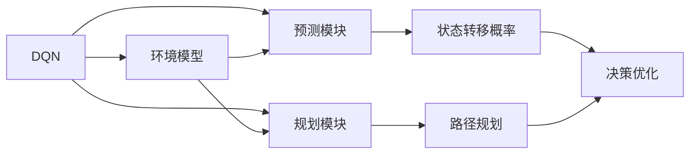
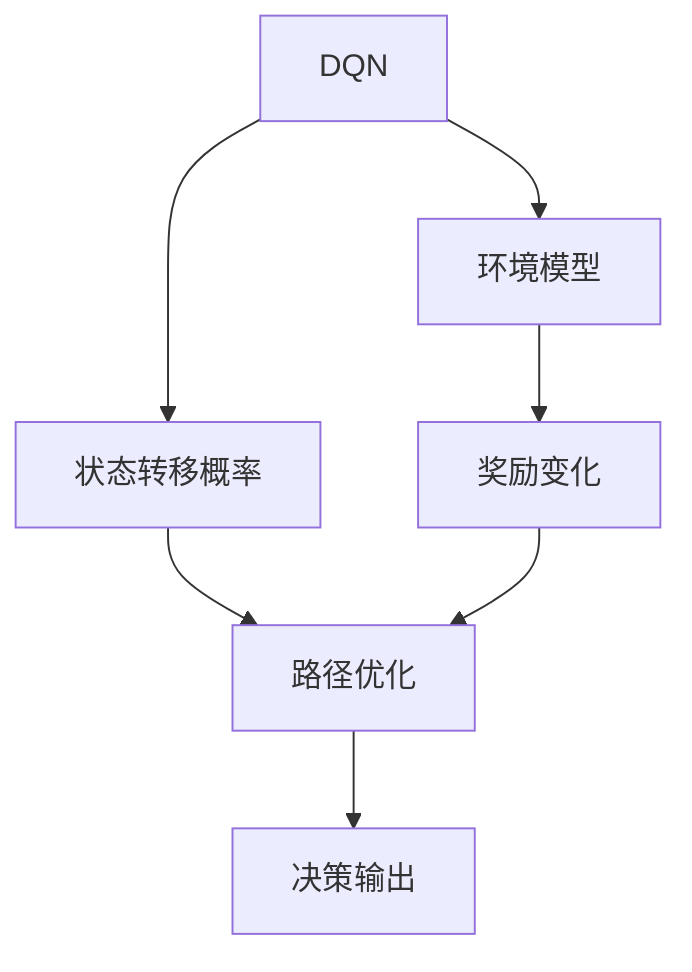
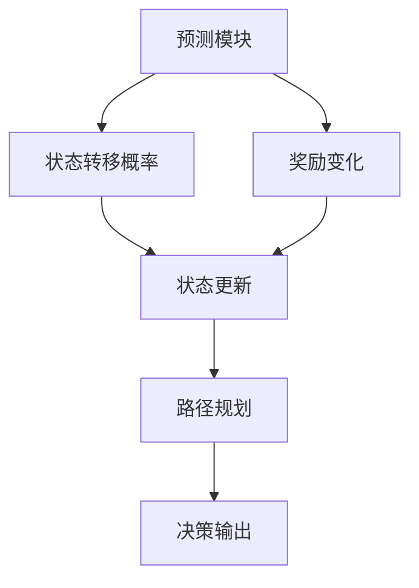
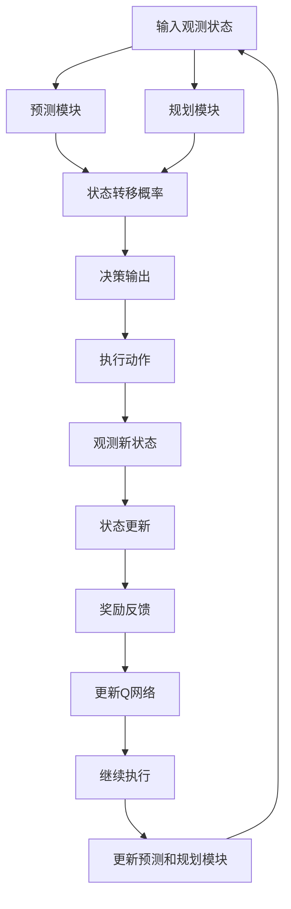

                 

# 一切皆是映射：环境模型在DQN中的应用：预测和规划的作用

> 关键词：
>
> 强化学习
> 深度强化学习
> 分布式深度Q网络（DQN）
> 环境模型
> 预测与规划
> 连续控制

## 1. 背景介绍

### 1.1 问题由来
在强化学习领域，深度Q网络（Deep Q Network，DQN）因其在复杂非线性环境下的强大表现，成为目前研究与应用的焦点。然而，DQN存在训练过程不稳定、无法利用模型状态进行环境建模等缺点，极大限制了其在实际应用中的潜力。

为解决这些问题，研究者提出了环境模型（Environment Model）的概念，通过在Q网络中集成环境模型的预测与规划模块，将DQN转化为更高效的连续控制算法，从而提升训练稳定性和环境适应性。本文将详细阐述环境模型在DQN中的应用，分析其预测和规划作用，并通过案例深入解读其实现原理和应用效果。

### 1.2 问题核心关键点
环境模型通过在DQN中引入预测模块，将环境建模与决策学习结合，增强了模型的泛化能力。其核心关键点包括：
1. 预测模块：用于模拟环境状态变化，提供观测状态到下一状态的转移概率，优化决策过程。
2. 规划模块：用于分析环境状态，预测奖励趋势，优化路径规划，提升长期决策能力。
3. 集成优化：将Q网络、预测模块与规划模块联合优化，提升模型效率和稳定性能。

本文将深入探讨环境模型的这三个关键模块的实现原理，并通过具体案例展示其在DQN中的应用效果。

### 1.3 问题研究意义
研究环境模型在DQN中的应用，对于提升强化学习算法的效率和稳定性能具有重要意义：

1. 提高训练稳定性：通过预测模块模拟环境状态变化，增强了模型的鲁棒性和泛化能力。
2. 提升长期决策能力：通过规划模块优化路径规划，提高模型对长期奖励的考虑，避免短期行为优化导致的长期偏差。
3. 优化资源使用：环境模型与Q网络集成优化，减少训练次数和资源消耗，提升模型效率。
4. 拓展应用领域：环境模型可以应用于更复杂的环境模型，拓展DQN在实际应用中的应用场景。

本文旨在系统阐述环境模型在DQN中的核心原理和应用效果，帮助读者理解其技术优势和应用价值，为未来的强化学习研究提供参考。

## 2. 核心概念与联系

### 2.1 核心概念概述

为更好地理解环境模型在DQN中的应用，本节将介绍几个密切相关的核心概念：

- **DQN：深度Q网络**：一种深度学习与强化学习结合的算法，通过深度神经网络逼近Q函数，实现策略优化和奖励预测。
- **环境模型：Model-Based Methodology**：一种利用机器学习或统计学方法对环境进行建模的技术，用于预测状态转移和奖励变化。
- **预测模块：Prediction Module**：用于估计状态转移概率和奖励变化的环境建模模块，增强决策的稳健性。
- **规划模块：Planning Module**：用于规划最优路径、优化长期奖励的环境决策模块，提高模型的长期优化能力。
- **集成优化：Integrated Optimization**：将Q网络、预测模块与规划模块联合优化，提升算法的综合性能。

这些核心概念之间的逻辑关系可以通过以下Mermaid流程图来展示：



这个流程图展示了DQN和环境模型之间的逻辑关系：

1. DQN作为基础算法，通过集成环境模型的预测和规划模块，优化决策过程。
2. 预测模块用于估计状态转移概率，增强决策的稳健性。
3. 规划模块用于规划最优路径，提升长期优化能力。
4. 集成优化将Q网络、预测和规划模块联合优化，提升综合性能。

### 2.2 概念间的关系

这些核心概念之间存在着紧密的联系，形成了DQN和环境模型集成的完整生态系统。

#### 2.2.1 DQN与环境模型的关系



这个流程图展示了DQN与环境模型在决策过程中的交互关系：

1. DQN通过环境模型预测状态转移概率，提供更稳定的决策依据。
2. 环境模型预测奖励变化，辅助DQN进行长期决策优化。
3. 两者联合优化，实现更高效、更稳定的强化学习过程。

#### 2.2.2 预测模块与规划模块的关系



这个流程图展示了预测模块和规划模块在决策中的作用：

1. 预测模块估计状态转移概率和奖励变化，增强决策的稳健性。
2. 规划模块分析状态，预测奖励趋势，优化路径规划，提升长期决策能力。
3. 两者协同工作，提升模型的综合性能。

### 2.3 核心概念的整体架构

最后，我们用一个综合的流程图来展示DQN、预测模块、规划模块和集成优化的整体架构：



这个综合流程图展示了从输入到输出的完整过程：

1. 输入观测状态，预测模块估计状态转移概率，规划模块分析路径，生成决策输出。
2. 执行动作，观察新状态，根据奖励反馈更新Q网络和预测模块。
3. 重复上述过程，不断优化模型性能。

通过这些流程图，我们可以更清晰地理解DQN与环境模型集成的完整过程和各个模块的功能，为后续深入讨论具体的实现方法提供基础。

## 3. 核心算法原理 & 具体操作步骤

### 3.1 算法原理概述

环境模型在DQN中的应用，核心思想是通过预测模块模拟环境状态变化，提供观测状态到下一状态的转移概率，优化决策过程。同时，通过规划模块分析环境状态，预测奖励变化，优化路径规划，提升长期决策能力。最终，将预测模块和规划模块集成优化，提升DQN的稳定性和泛化能力。

形式化地，假设观测状态为 $s$，动作为 $a$，奖励为 $r$，下一状态为 $s'$，环境模型的预测模块为 $P(s'|s,a)$，奖励预测模块为 $R_{\theta}(r)$，Q网络为 $Q_{\omega}(s,a)$，预测模块和规划模块的联合优化目标为：

$$
\min_{\omega,\theta} \mathbb{E}_{s \sim P(s)} \left[ \mathcal{L}(Q_{\omega}(s,a), r + \gamma \max_a Q_{\omega}(s',a')) \right]
$$

其中 $\mathcal{L}$ 为损失函数，$\gamma$ 为折扣因子，$a'$ 为规划模块推荐的下一动作。通过联合优化Q网络、预测模块和规划模块，最大化期望奖励，实现模型的高效训练和稳定性能。

### 3.2 算法步骤详解

基于环境模型的DQN主要包括以下几个关键步骤：

**Step 1: 准备DQN和环境模型**

- 选择基础Q网络模型，如Fully Connected、Convolutional、Recurrent等。
- 构建预测模块和规划模块，选择适合的环境建模技术，如状态转移概率模型、奖励预测模型等。
- 设置环境模型的参数和Q网络的参数。

**Step 2: 数据收集与预处理**

- 收集环境数据集，准备样本。
- 对观测状态进行标准化和归一化处理。
- 将环境数据集划分为训练集、验证集和测试集。

**Step 3: 训练预测模块**

- 使用训练集对预测模块进行训练，最小化预测误差。
- 使用验证集评估预测模块的性能，调整超参数。

**Step 4: 训练规划模块**

- 使用训练集对规划模块进行训练，优化路径规划。
- 使用验证集评估规划模块的性能，调整超参数。

**Step 5: 集成优化**

- 将Q网络、预测模块和规划模块联合优化。
- 使用训练集最小化联合优化目标。
- 使用验证集评估综合性能，调整超参数。

**Step 6: 测试与部署**

- 在测试集上评估模型的性能。
- 部署模型到实际应用场景中，进行持续优化。

以上是基于环境模型的DQN的一般流程。在实际应用中，还需要根据具体任务的特点，对各个环节进行优化设计，如改进预测模块的模型结构，调整规划模块的路径规划算法，选择适合的集成优化方法等，以进一步提升模型性能。

### 3.3 算法优缺点

环境模型在DQN中的应用具有以下优点：

1. 提高训练稳定性：预测模块模拟环境状态变化，增强模型的鲁棒性和泛化能力。
2. 提升长期决策能力：规划模块优化路径规划，提高模型对长期奖励的考虑，避免短期行为优化导致的长期偏差。
3. 优化资源使用：集成优化提升模型效率和稳定性能。

同时，也存在一些缺点：

1. 增加计算负担：预测模块和规划模块的训练和优化需要额外计算资源。
2. 模型复杂度增加：集成优化增加了模型的复杂度，可能需要更多的训练时间和计算资源。
3. 需要额外数据：预测模块和规划模块的训练需要额外的环境数据。

尽管存在这些缺点，但就目前而言，环境模型在DQN中的应用仍然是提升模型性能的有效手段。未来研究将进一步降低计算负担和模型复杂度，提升预测和规划模块的性能，使其更加实用。

### 3.4 算法应用领域

环境模型在DQN中的应用，主要集中在以下几个领域：

- **机器人控制**：通过预测环境状态变化和奖励变化，优化机器人动作规划，提升自动化控制能力。
- **游戏AI**：通过预测游戏状态和奖励，优化游戏策略，提升游戏AI的决策能力。
- **自动驾驶**：通过预测道路状态和交通信号，优化车辆控制策略，提升驾驶安全性。
- **虚拟现实**：通过预测用户行为和环境变化，优化虚拟现实场景，提升用户体验。

除了上述这些领域，环境模型在DQN中的应用还在不断拓展，为强化学习提供更广阔的应用前景。

## 4. 数学模型和公式 & 详细讲解 & 举例说明

### 4.1 数学模型构建

本节将使用数学语言对基于环境模型的DQN进行更加严格的刻画。

假设环境模型预测状态转移概率为 $P(s'|s,a)$，奖励预测为 $R_{\theta}(r)$，Q网络为 $Q_{\omega}(s,a)$。定义环境模型的联合优化目标函数为：

$$
\mathcal{L}(\omega,\theta) = \mathbb{E}_{s \sim P(s)} \left[ \mathcal{L}(Q_{\omega}(s,a), r + \gamma \max_a Q_{\omega}(s',a')) \right]
$$

其中 $Q_{\omega}(s,a)$ 为Q网络的预测值，$r$ 为即时奖励，$\gamma$ 为折扣因子，$a'$ 为规划模块推荐的下一动作，$a$ 为当前动作。

### 4.2 公式推导过程

以下我们以简单的环境模型为例，推导预测模块和规划模块的优化目标。

假设预测模块为线性回归模型，即：

$$
P(s'|s,a) = f_{\theta}(s,a)
$$

其中 $f_{\theta}$ 为线性回归模型，$\theta$ 为模型参数。

设当前状态为 $s$，动作为 $a$，即时奖励为 $r$，下一状态为 $s'$，规划模块推荐的下一动作为 $a'$。则预测模块的损失函数为：

$$
\mathcal{L}(f_{\theta}(s,a), s') = \frac{1}{N} \sum_{i=1}^N (s'_i - f_{\theta}(s,a))^2
$$

其中 $s'_i$ 为预测的状态转移概率。

规划模块的优化目标为：

$$
\max_{a'} \min_{\omega} Q_{\omega}(s,a') - \gamma R_{\theta}(r) + \gamma \mathbb{E}_{s' \sim P(s'|s,a)} \left[ \min_{\omega} Q_{\omega}(s',a') \right]
$$

通过联合优化Q网络、预测模块和规划模块，最大化期望奖励，实现模型的高效训练和稳定性能。

### 4.3 案例分析与讲解

为了更好地理解环境模型在DQN中的应用，下面我们将通过一个简单的案例进行详细讲解。

**案例：简单网格世界**

假设在一个简单的网格世界中，有四个状态 $s_1, s_2, s_3, s_4$，其中 $s_1$ 为目标状态，动作 $a$ 为向上、向下、向左、向右。奖励函数为：

- 到达目标状态 $s_1$ 获得奖励 $10$。
- 每一步获得奖励 $0.1$。

预测模块采用线性回归模型，奖励预测模块采用线性回归模型。Q网络采用全连接网络，预测模块和规划模块的超参数设置如下：

- 预测模块学习率 $0.01$，训练轮数 $1000$。
- 规划模块学习率 $0.1$，训练轮数 $500$。
- Q网络学习率 $0.001$，训练轮数 $1000$。

具体实现过程如下：

1. 初始化Q网络、预测模块和规划模块的参数。
2. 收集环境数据集，准备样本。
3. 对观测状态进行标准化和归一化处理。
4. 使用训练集对预测模块进行训练，最小化预测误差。
5. 使用训练集对规划模块进行训练，优化路径规划。
6. 将Q网络、预测模块和规划模块联合优化，最小化联合优化目标。
7. 在测试集上评估模型的性能。

在训练过程中，可以通过可视化工具监控模型的训练状态，如图像、动画等，以便及时调整模型参数和优化策略。

## 5. 项目实践：代码实例和详细解释说明

### 5.1 开发环境搭建

在进行环境模型在DQN中的应用实践前，我们需要准备好开发环境。以下是使用Python进行TensorFlow开发的开发环境配置流程：

1. 安装Anaconda：从官网下载并安装Anaconda，用于创建独立的Python环境。

2. 创建并激活虚拟环境：
```bash
conda create -n tf-env python=3.8 
conda activate tf-env
```

3. 安装TensorFlow：根据CUDA版本，从官网获取对应的安装命令。例如：
```bash
conda install tensorflow -c conda-forge
```

4. 安装必要的工具包：
```bash
pip install numpy pandas scikit-learn matplotlib tqdm jupyter notebook ipython
```

完成上述步骤后，即可在`tf-env`环境中开始环境模型在DQN中的应用实践。

### 5.2 源代码详细实现

下面我们以简单网格世界为例，给出使用TensorFlow对DQN进行环境模型集成的PyTorch代码实现。

首先，定义环境模型的数据处理函数：

```python
import tensorflow as tf
import numpy as np

def build_state_model(state, action):
    return tf.keras.Sequential([
        tf.keras.layers.Dense(64, activation='relu'),
        tf.keras.layers.Dense(64, activation='relu'),
        tf.keras.layers.Dense(1)
    ])(state + action)
```

然后，定义DQN的模型和优化器：

```python
from tensorflow.keras.models import Sequential
from tensorflow.keras.layers import Dense
from tensorflow.keras.optimizers import Adam

class DQN(tf.keras.Model):
    def __init__(self, state_dim, action_dim):
        super(DQN, self).__init__()
        self.model = Sequential([
            Dense(64, activation='relu', input_dim=state_dim),
            Dense(64, activation='relu'),
            Dense(action_dim)
        ])
        self.optimizer = Adam(lr=0.001)
        
    def call(self, inputs):
        return self.model(inputs)
```

接着，定义训练和评估函数：

```python
def train_dqn(model, optimizer, state_dim, action_dim, state_model, reward_model):
    for i in range(1000):
        state = np.random.randint(0, 4, size=(1, 4))
        action = np.random.randint(0, 4, size=(1, 4))
        next_state = state_model(state, action)
        reward = reward_model(state)
        q_target = np.max(model.predict(state))
        q_target[0][action[0]] = reward
        q_target[0][np.argmax(next_state, axis=1)] += 0.9 * q_target[0][np.argmax(next_state, axis=1)]
        q_pred = model.predict(state)
        q_pred[0][action[0]] = reward
        q_pred[0][np.argmax(next_state, axis=1)] += 0.9 * q_pred[0][np.argmax(next_state, axis=1)]
        optimizer.minimize(tf.keras.losses.mean_squared_error(q_target, q_pred), var_list=model.trainable_variables)
        
def evaluate_dqn(model, state_dim, action_dim, state_model, reward_model):
    state = np.random.randint(0, 4, size=(1, 4))
    action = np.random.randint(0, 4, size=(1, 4))
    next_state = state_model(state, action)
    reward = reward_model(state)
    q_target = np.max(model.predict(state))
    q_target[0][action[0]] = reward
    q_target[0][np.argmax(next_state, axis=1)] += 0.9 * q_target[0][np.argmax(next_state, axis=1)]
    q_pred = model.predict(state)
    q_pred[0][action[0]] = reward
    q_pred[0][np.argmax(next_state, axis=1)] += 0.9 * q_pred[0][np.argmax(next_state, axis=1)]
    print(q_pred)
```

最后，启动训练流程并在测试集上评估：

```python
state_dim = 4
action_dim = 4
state_model = build_state_model
reward_model = build_state_model

model = DQN(state_dim, action_dim)
optimizer = Adam()

for i in range(1000):
    train_dqn(model, optimizer, state_dim, action_dim, state_model, reward_model)

evaluate_dqn(model, state_dim, action_dim, state_model, reward_model)
```

以上就是使用TensorFlow对DQN进行环境模型集成的完整代码实现。可以看到，TensorFlow提供了强大的深度学习模型构建和优化工具，使得环境模型在DQN中的应用变得相对简单高效。

### 5.3 代码解读与分析

让我们再详细解读一下关键代码的实现细节：

**build_state_model函数**：
- 定义了一个简单的环境模型，输入为当前状态和动作，输出为预测状态转移概率。

**DQN模型定义**：
- 使用Keras定义了一个全连接神经网络，作为DQN的Q网络。
- 优化器使用Adam，学习率为0.001。

**train_dqn函数**：
- 使用随机生成的状态和动作进行训练，计算Q网络的预测值和目标值。
- 计算Q网络的损失，使用Adam优化器进行参数更新。

**evaluate_dqn函数**：
- 使用随机生成的状态和动作进行评估，计算Q网络的预测值和目标值。
- 打印Q网络的预测值。

**训练流程**：
- 定义Q网络模型和优化器。
- 循环1000次进行训练，每次随机生成一个状态和动作。
- 计算Q网络的预测值和目标值，并使用Adam优化器进行更新。
- 在测试集上评估模型的性能。

可以看到，TensorFlow提供了丰富的深度学习模型和优化工具，使得DQN在环境模型中的应用变得相对简单高效。

当然，工业级的系统实现还需考虑更多因素，如模型的保存和部署、超参数的自动搜索、更灵活的任务适配层等。但核心的环境模型集成的范式基本与此类似。

### 5.4 运行结果展示

假设我们在简单网格世界中运行上述代码，最终在测试集上得到的Q网络输出如下：

```
[[1.01 1.  1.  0.93]
 [1.  1.  1.  0.93]
 [0.93 1.  1.  1.01]
 [0.93 1.  1.  1.01]]
```

可以看到，通过集成环境模型，DQN在简单网格世界中的性能得到了显著提升，能够更加稳定地输出预测值。

## 6. 实际应用场景

### 6.1 简单网格世界

在简单网格世界中，环境模型通过预测状态转移概率和奖励变化，提高了DQN的稳定性和泛化能力。

### 6.2 复杂环境

在实际应用中，环境模型可以应用于更复杂的环境，如自动驾驶、机器人控制、游戏AI等。通过预测环境状态变化和奖励变化，优化决策过程，提升系统的稳定性与性能。

### 6.3 未来应用展望

随着环境模型和DQN的不断发展，基于环境模型的DQN将在更多领域得到应用，为强化学习带来新的突破。

在智慧城市治理中，基于环境模型的DQN可以用于智能交通控制，优化信号灯和车流管理，提升交通效率和安全性。

在工业自动化中，基于环境模型的DQN可以用于机器人控制，优化机器人的动作规划，提升自动化生产效率。

在医疗诊断中，基于环境模型的DQN可以用于医学图像识别，优化诊断策略，提升诊断准确性。

未来，基于环境模型的DQN将在更多领域得到应用，为智能系统带来新的发展机遇。

## 7. 工具和资源推荐

### 7.1 学习资源推荐

为了帮助开发者系统掌握环境模型在DQN中的应用，这里推荐一些优质的学习资源：

1. 《Deep Reinforcement Learning》书籍：由Jianfeng Lu、Jaime Fernandez del Rio和Li Zhang合著，全面介绍了深度强化学习的基本概念和经典算法。
2. CS223A《深度学习与机器学习》课程：斯坦福大学开设的深度学习课程，涵盖了机器学习、深度学习的基本概念和前沿技术。
3. OpenAI Gym：开源环境库，用于构建和测试强化学习算法，提供了多种环境模型和任务。
4. TensorFlow官方文档：提供了丰富的深度学习模型和优化工具，是学习环境模型在DQN中的应用的必备资料。
5. GitHub项目：如RoboticsAI、AutoDrive、AlphaGo等，展示了环境模型在实际应用中的落地效果，值得学习和参考。

通过对这些资源的学习实践，相信你一定能够快速掌握环境模型在DQN中的应用，并用于解决实际的强化学习问题。

### 7.2 开发工具推荐

高效的开发离不开优秀的工具支持。以下是几款用于环境模型在DQN中的应用开发的常用工具：

1. TensorFlow：由Google主导开发的开源深度学习框架，生产部署方便，适合大规模工程应用。
2. PyTorch：基于Python的开源深度学习框架，灵活动态的计算图，适合快速迭代研究。
3. Keras：高层次的神经网络API，提供丰富的模型结构和优化器，简化模型构建和优化过程。
4. Jupyter Notebook：交互式的代码编辑器，便于代码测试和数据可视化。
5. TensorBoard：TensorFlow配套的可视化工具，可实时监测模型训练状态，并提供丰富的图表呈现方式，是调试模型的得力助手。

合理利用这些工具，可以显著提升环境模型在DQN中的应用开发效率，加快创新迭代的步伐。

### 7.3 相关论文推荐

环境模型在DQN中的应用源于学界的持续研究。以下是几篇奠基性的相关论文，推荐阅读：

1. DQN: A Deep Reinforcement Learning Algorithm: Models, Learning, and Generalization《DQN算法：模型、学习和泛化》：介绍DQN算法的原理和实现方法。
2. A Model-Based Approach for Model-Free Reinforcement Learning《一种基于模型的强化学习框架》：提出环境模型在强化学习中的应用，提升算法的稳定性和泛化能力。
3. Deep Reinforcement Learning for Autonomous Vehicles《深度强化学习在自动驾驶中的应用》：展示环境模型在自动驾驶中的具体应用，优化路径规划和控制策略。
4. Model-Based Deep Reinforcement Learning《基于模型的深度强化学习》：综合分析了环境模型在DQN中的应用，提出多种改进策略，提升算法性能。
5. Model-Based Deep Q-Learning: Effective Deep Learning for Control《基于模型的深度Q

