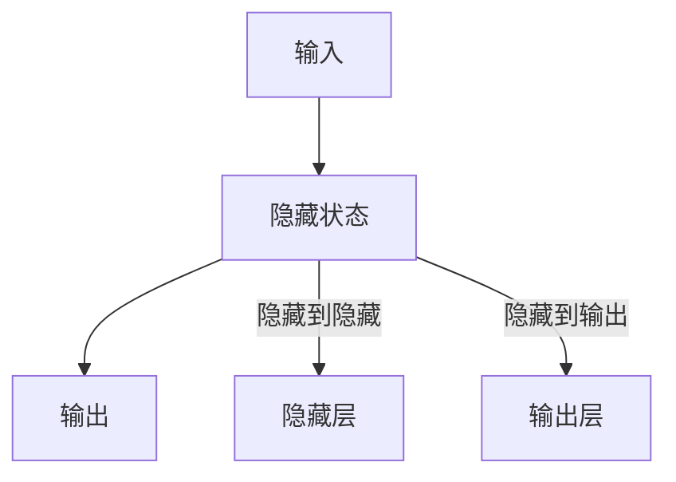
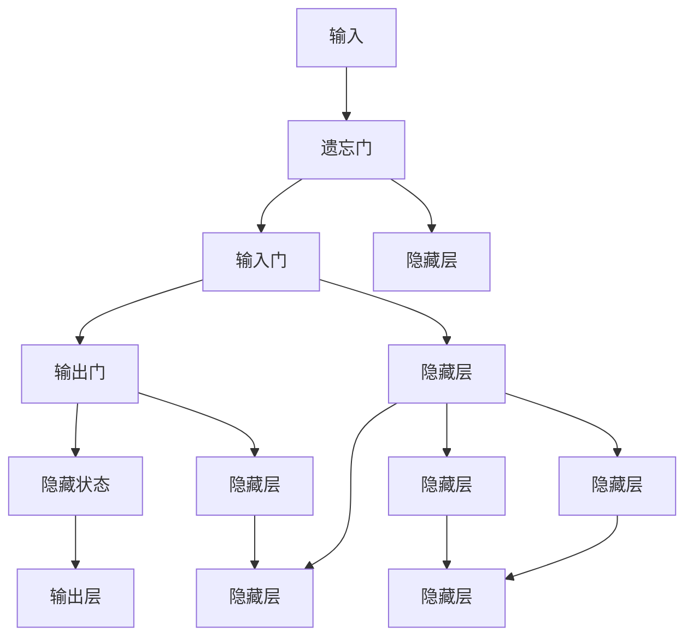
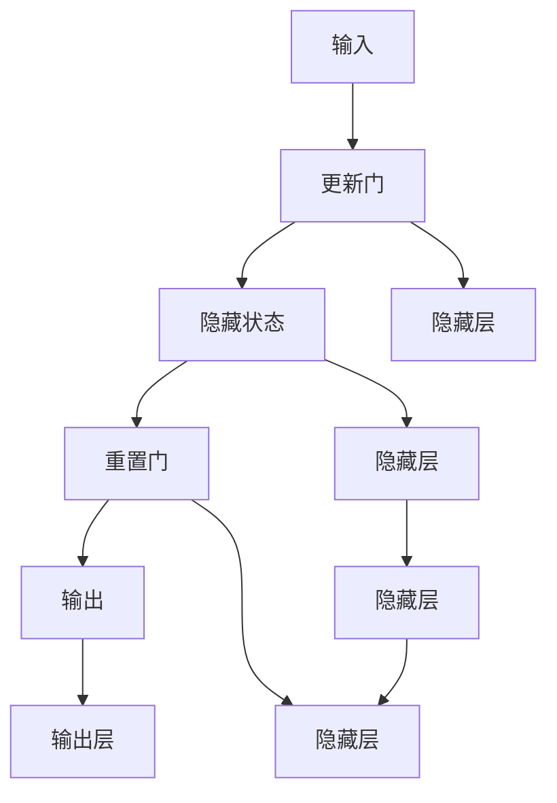
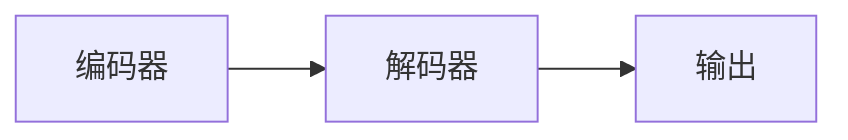
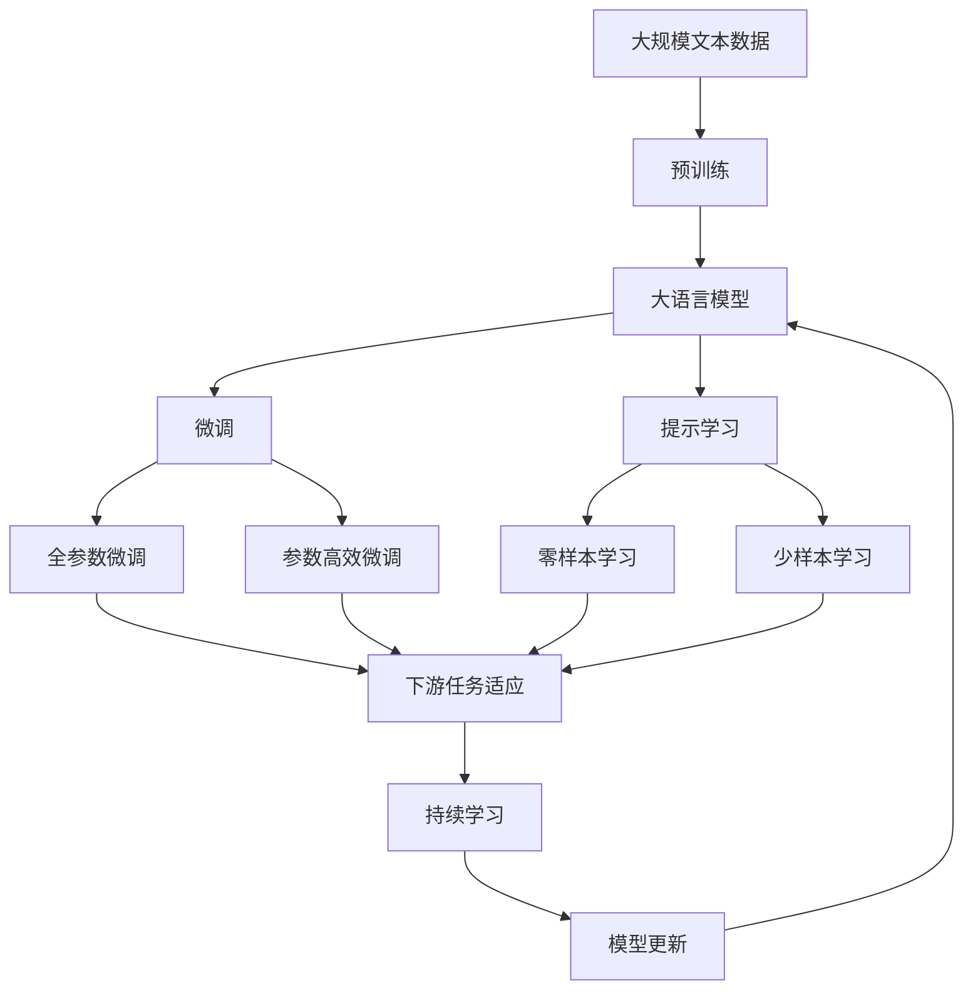

                 

# 一切皆是映射：递归神经网络(RNN)和时间序列数据

> 关键词：递归神经网络(RNN), 时间序列数据, 长短期记忆网络(LSTM), 门控循环单元(GRU), 序列到序列(Seq2Seq), 时间序列预测, 自然语言处理(NLP), 机器学习

## 1. 背景介绍

### 1.1 问题由来
在数据科学和机器学习领域，时间序列数据是一种常见且重要的数据类型。时间序列是指在某一固定周期内按时间顺序排列的数据序列。时间序列数据广泛存在于金融、气象、交通、通信等多个行业领域，能够反映出事物发展变化的时间趋势和规律。

在处理时间序列数据时，传统的统计方法和回归模型往往难以捕捉到时间序列的动态特性。这使得研究人员探索出了递归神经网络（RNN）这一强大的模型，以更高效地处理时间序列数据。RNN能够捕捉序列中时间依赖关系，具有良好的时序建模能力。

然而，随着数据规模的增加和时间序列数据复杂度的提高，RNN的训练效率和模型性能也面临挑战。为此，研究人员提出了长短期记忆网络（LSTM）和门控循环单元（GRU）等改进模型，这些模型通过引入门控机制，能有效解决传统RNN在长期依赖关系上的问题。

此外，序列到序列（Seq2Seq）模型在机器翻译、语音识别、文本生成等任务中也得到了广泛应用。Seq2Seq模型利用编码器-解码器框架，能够灵活处理变长的序列数据，并在序列到序列的转换中取得优异效果。

本文将深入探讨递归神经网络（RNN）、长短期记忆网络（LSTM）、门控循环单元（GRU）和序列到序列（Seq2Seq）模型，重点讲解这些模型在时间序列数据分析中的应用。

### 1.2 问题核心关键点
- RNN、LSTM、GRU和Seq2Seq模型的基本原理和架构
- 时间序列数据的特点及其在各个领域的应用
- 如何选择合适的模型和算法，针对特定任务进行优化和训练
- 模型训练、优化和评估的最佳实践
- 时间序列数据的预处理和特征工程策略
- 时间序列数据分析中常见问题和解决方案

### 1.3 问题研究意义
- 通过理解RNN、LSTM、GRU和Seq2Seq模型，掌握处理时间序列数据的关键技术
- 掌握时间序列数据的预处理和特征工程，提升模型性能
- 了解时间序列数据分析在各个行业领域中的应用，推动相关行业数字化转型
- 掌握时间序列数据处理的最佳实践，提升研究和应用效率
- 针对特定应用场景，设计和实现高效的时间序列分析模型

## 2. 核心概念与联系

### 2.1 核心概念概述

为更好地理解时间序列数据的处理方法和模型架构，本节将介绍几个密切相关的核心概念：

- 递归神经网络（RNN）：一种基于图灵机的循环神经网络，能够处理变长序列数据，通过循环结构捕捉时间依赖关系。
- 长短期记忆网络（LSTM）：一种改进的RNN模型，通过引入遗忘门、输入门和输出门机制，有效解决长期依赖关系问题。
- 门控循环单元（GRU）：一种轻量级的LSTM变种，通过结合遗忘门和更新门，减少模型参数，提升训练效率。
- 序列到序列（Seq2Seq）模型：一种利用编码器-解码器框架处理序列数据的方法，适用于多种序列转换任务，如机器翻译、文本生成等。

这些核心概念之间存在着紧密的联系，形成了时间序列数据分析的完整生态系统。下面我们通过一个Mermaid流程图来展示这些核心概念的关系：

```mermaid
graph TB
    A[递归神经网络(RNN)] --> B[长短期记忆网络(LSTM)]
    B --> C[门控循环单元(GRU)]
    A --> D[序列到序列(Seq2Seq)]
    C --> D
```

这个流程图展示了RNN、LSTM、GRU和Seq2Seq模型之间的关系：

1. RNN是所有这些模型的基础，是时间序列数据分析的起点。
2. LSTM和GRU都是RNN的改进模型，针对传统RNN在长期依赖上的问题进行了优化。
3. Seq2Seq模型利用RNN作为编码器和解码器，能够处理序列到序列的转换任务。
4. LSTM和GRU作为RNN的改进模型，也支持Seq2Seq模型的应用。

通过理解这些核心概念，我们可以更好地把握时间序列数据分析的原理和架构，为后续深入探讨具体模型和算法奠定基础。

### 2.2 概念间的关系

这些核心概念之间存在着紧密的联系，形成了时间序列数据分析的完整生态系统。下面我们通过几个Mermaid流程图来展示这些核心概念之间的关系。

#### 2.2.1 RNN模型的基本架构



这个流程图展示了RNN模型的一般架构：

1. 输入数据通过循环结构传递到隐藏层。
2. 隐藏层的输出部分通过全连接层连接到输出层。
3. 隐藏层的状态通过循环结构在时间维度上传递，捕捉时间依赖关系。

#### 2.2.2 LSTM模型的架构



这个流程图展示了LSTM模型的一般架构：

1. 输入数据通过多个门控机制进行处理。
2. 遗忘门决定前一时刻隐藏状态中哪些信息需要保留，哪些信息需要忘记。
3. 输入门决定新输入对隐藏状态的影响程度。
4. 输出门决定当前隐藏状态如何影响输出。
5. 隐藏状态通过循环结构传递到下一时刻。

#### 2.2.3 GRU模型的架构



这个流程图展示了GRU模型的一般架构：

1. 输入数据通过多个门控机制进行处理。
2. 更新门决定新输入对隐藏状态的影响程度。
3. 重置门决定隐藏状态如何更新。
4. 隐藏状态通过循环结构传递到下一时刻。

#### 2.2.4 Seq2Seq模型的架构



这个流程图展示了Seq2Seq模型的架构：

1. 编码器将输入序列编码成固定长度的向量。
2. 解码器利用编码器输出的向量生成目标序列。
3. 编码器和解码器都是RNN或其改进模型。

通过这些流程图，我们可以更清晰地理解时间序列数据分析中各个核心概念的架构和关系，为后续深入讨论具体的模型和算法奠定基础。

### 2.3 核心概念的整体架构

最后，我们用一个综合的流程图来展示这些核心概念在大语言模型微调过程中的整体架构：



这个综合流程图展示了从预训练到微调，再到持续学习的完整过程。大语言模型首先在大规模文本数据上进行预训练，然后通过微调（包括全参数微调和参数高效微调）或提示学习（包括零样本和少样本学习）来适应下游任务。最后，通过持续学习技术，模型可以不断更新和适应新的任务和数据。通过这些流程图，我们可以更清晰地理解时间序列数据分析过程中各个核心概念的关系和作用，为后续深入讨论具体的模型和算法提供参考。

## 3. 核心算法原理 & 具体操作步骤
### 3.1 算法原理概述

时间序列数据分析的核心算法是递归神经网络（RNN）、长短期记忆网络（LSTM）、门控循环单元（GRU）和序列到序列（Seq2Seq）模型。这些模型通过循环结构捕捉序列中的时间依赖关系，通过门控机制管理信息流动，通过编码器-解码器框架处理序列到序列的转换任务。

RNN、LSTM和GRU模型基于图灵机模型，通过循环结构捕捉时间依赖关系，但在处理长期依赖关系时面临挑战。LSTM和GRU通过引入门控机制，有效解决了这一问题。Seq2Seq模型利用RNN作为编码器和解码器，能够灵活处理变长的序列数据，并在序列到序列的转换中取得优异效果。

形式化地，假设时间序列数据为 $(x_t, y_t)$，其中 $x_t$ 为第 $t$ 时刻的输入，$y_t$ 为第 $t$ 时刻的输出。时间序列数据分析的目标是学习模型 $M$，使得 $M(x_t)$ 能够预测 $y_t$。常见的时间序列模型包括ARIMA、LSTM、GRU等。

### 3.2 算法步骤详解

基于递归神经网络（RNN）、长短期记忆网络（LSTM）、门控循环单元（GRU）和序列到序列（Seq2Seq）模型的核心算法步骤包括：

**Step 1: 准备数据集**
- 收集时间序列数据，划分为训练集、验证集和测试集。
- 数据集应包含足够多的样本，以便模型能够学习到数据的规律。

**Step 2: 设计模型架构**
- 选择合适的模型架构，如RNN、LSTM、GRU等。
- 设计合适的隐藏层结构，包括隐藏单元的数量和连接方式。
- 设计合适的前向传播和后向传播算法。

**Step 3: 训练模型**
- 使用训练集对模型进行训练，优化模型的参数。
- 在每个epoch中，使用反向传播算法计算梯度，使用优化算法（如Adam、SGD等）更新模型参数。
- 使用验证集评估模型性能，根据性能调整超参数。

**Step 4: 模型评估**
- 使用测试集评估模型的性能，计算评价指标（如MAE、RMSE等）。
- 分析模型预测结果，评估模型的准确性和可靠性。

**Step 5: 模型部署**
- 将训练好的模型部署到实际应用中，进行实时预测或批量处理。
- 使用在线学习或增量学习技术，不断优化模型性能。

以上是时间序列数据分析的核心算法步骤。在实际应用中，还需要根据具体任务进行优化设计，如选择合适的损失函数、优化算法和正则化技术等，以进一步提升模型性能。

### 3.3 算法优缺点

时间序列数据分析的模型算法具有以下优点：

- 能够捕捉序列中的时间依赖关系，具有良好的时序建模能力。
- 通过门控机制管理信息流动，有效解决长期依赖关系问题。
- 适用于多种序列转换任务，如机器翻译、文本生成等。

但这些算法也存在一些缺点：

- 模型复杂度较高，参数较多，训练效率较低。
- 对初始化参数敏感，需要仔细选择和优化初始权重。
- 对数据的分布和趋势变化敏感，需要定期重新训练模型。
- 对于噪声较大、序列长度较长的数据，模型性能可能下降。

尽管存在这些局限性，但时间序列数据分析的模型算法仍然在众多领域得到了广泛应用，成为了数据分析的重要工具。未来相关研究将继续探索如何提高模型的计算效率、降低模型复杂度、提升模型的鲁棒性等方向。

### 3.4 算法应用领域

时间序列数据分析的模型算法已经广泛应用于金融、气象、交通、通信等多个行业领域，具体应用场景包括：

- **金融风险预测**：利用时间序列模型预测股票、外汇等金融市场的波动趋势，及时进行风险管理。
- **气象预测**：利用时间序列模型预测天气、气候变化，为农业、旅游等行业提供决策支持。
- **交通流量预测**：利用时间序列模型预测交通流量，优化交通管理和运营。
- **通信网络优化**：利用时间序列模型预测网络流量变化，优化网络资源分配和调度。
- **工业生产监控**：利用时间序列模型预测设备故障和维护需求，提高生产效率。

除了上述这些经典应用场景，时间序列数据分析的模型算法还在许多新兴领域中得到应用，如智能电网、智能家居、智能交通等，推动了相关行业的数字化转型。

## 4. 数学模型和公式 & 详细讲解  
### 4.1 数学模型构建

本节将使用数学语言对时间序列数据分析的核心算法进行更加严格的刻画。

假设时间序列数据为 $(x_t, y_t)$，其中 $x_t$ 为第 $t$ 时刻的输入，$y_t$ 为第 $t$ 时刻的输出。时间序列数据分析的目标是学习模型 $M$，使得 $M(x_t)$ 能够预测 $y_t$。

假设模型 $M$ 为RNN模型，其隐藏状态为 $h_t$，输出为 $o_t$，则时间序列数据分析的数学模型为：

$$
\begin{aligned}
h_t &= f(h_{t-1}, x_t) \\
o_t &= g(h_t)
\end{aligned}
$$

其中 $f$ 为前向传播函数，$g$ 为输出函数，$h_{t-1}$ 为上一时刻的隐藏状态，$x_t$ 为第 $t$ 时刻的输入，$h_t$ 为第 $t$ 时刻的隐藏状态，$o_t$ 为第 $t$ 时刻的输出。

常见的时间序列模型包括ARIMA、LSTM、GRU等。这里以LSTM模型为例，其隐藏状态更新公式为：

$$
\begin{aligned}
i_t &= \sigma(W_i \cdot [h_{t-1}, x_t] + b_i) \\
f_t &= \sigma(W_f \cdot [h_{t-1}, x_t] + b_f) \\
o_t &= \sigma(W_o \cdot [h_{t-1}, x_t] + b_o) \\
g_t &= \tanh(W_g \cdot [h_{t-1}, x_t] + b_g)
\end{aligned}
$$

其中 $i_t$、$f_t$、$o_t$、$g_t$ 分别为遗忘门、输入门、输出门和隐藏状态，$W$ 和 $b$ 分别为权重矩阵和偏置向量。

### 4.2 公式推导过程

这里以LSTM模型为例，推导时间序列数据的数学模型和隐藏状态更新公式。

假设时间序列数据为 $(x_t, y_t)$，其中 $x_t$ 为第 $t$ 时刻的输入，$y_t$ 为第 $t$ 时刻的输出。假设模型 $M$ 为LSTM模型，其隐藏状态为 $h_t$，输出为 $o_t$。

LSTM模型通过遗忘门、输入门和输出门机制，管理信息流动。遗忘门 $f_t$ 决定前一时刻隐藏状态中哪些信息需要保留，哪些信息需要忘记。输入门 $i_t$ 决定新输入对隐藏状态的影响程度。输出门 $o_t$ 决定当前隐藏状态如何影响输出。隐藏状态 $g_t$ 通过循环结构传递到下一时刻。

LSTM模型的隐藏状态更新公式为：

$$
\begin{aligned}
i_t &= \sigma(W_i \cdot [h_{t-1}, x_t] + b_i) \\
f_t &= \sigma(W_f \cdot [h_{t-1}, x_t] + b_f) \\
o_t &= \sigma(W_o \cdot [h_{t-1}, x_t] + b_o) \\
g_t &= \tanh(W_g \cdot [h_{t-1}, x_t] + b_g)
\end{aligned}
$$

其中 $i_t$、$f_t$、$o_t$、$g_t$ 分别为遗忘门、输入门、输出门和隐藏状态，$W$ 和 $b$ 分别为权重矩阵和偏置向量。

LSTM模型的输出公式为：

$$
o_t = o_t \cdot g_t
$$

其中 $o_t$ 为输出，$g_t$ 为隐藏状态。

通过LSTM模型的数学模型和隐藏状态更新公式，可以对时间序列数据进行建模和预测。LSTM模型通过遗忘门和输入门机制，有效解决了传统RNN在长期依赖上的问题，能够处理更复杂的序列数据。

### 4.3 案例分析与讲解

这里以股票市场数据为例，展示如何使用LSTM模型进行金融风险预测。假设我们收集了某股票的历史价格数据 $x_t$ 和未来价格 $y_t$，其中 $t$ 表示时间。我们的目标是通过LSTM模型预测未来的股票价格变化。

1. **数据预处理**：将原始数据进行归一化处理，去除异常值和缺失值。

2. **划分数据集**：将数据集划分为训练集、验证集和测试集，以保证模型的泛化能力。

3. **模型训练**：使用训练集对LSTM模型进行训练，优化模型的参数。在每个epoch中，使用反向传播算法计算梯度，使用优化算法（如Adam、SGD等）更新模型参数。

4. **模型评估**：使用验证集评估模型性能，根据性能调整超参数。计算模型的MAE（均方误差）和RMSE（均方根误差）等指标。

5. **模型预测**：使用测试集评估模型性能，计算模型的MAE和RMSE等指标。分析模型预测结果，评估模型的准确性和可靠性。

通过LSTM模型对股票市场数据进行预测，我们可以看到时间序列数据分析在金融领域的应用。LSTM模型能够捕捉时间序列数据中的时间依赖关系，预测未来价格变化趋势，为投资者提供决策支持。

## 5. 项目实践：代码实例和详细解释说明
### 5.1 开发环境搭建

在进行时间序列数据分析实践前，我们需要准备好开发环境。以下是使用Python进行Keras开发的环境配置流程：

1. 安装Anaconda：从官网下载并安装Anaconda，用于创建独立的Python环境。

2. 创建并激活虚拟环境：
```bash
conda create -n keras-env python=3.8 
conda activate keras-env
```

3. 安装Keras和TensorFlow：根据CUDA版本，从官网获取对应的安装命令。例如：
```bash
conda install keras tensorflow -c conda-forge
```

4. 安装各类工具包：
```bash
pip install numpy pandas scikit-learn matplotlib tqdm jupyter notebook ipython
```

完成上述步骤后，即可在`keras-env`环境中开始时间序列数据分析实践。

### 5.2 源代码详细实现

这里我们以气象数据预测为例，给出使用Keras对LSTM模型进行时间序列预测的代码实现。

首先，定义数据处理函数：

```python
import numpy as np
from keras.models import Sequential
from keras.layers import LSTM, Dense, Dropout
from keras.optimizers import Adam

def create_model(input_size, output_size, hidden_size):
    model = Sequential()
    model.add(LSTM(hidden_size, input_shape=(input_size, input_size)))
    model.add(Dropout(0.2))
    model.add(Dense(output_size))
    model.compile(optimizer=Adam(lr=0.001), loss='mse')
    return model
```

然后，加载并处理气象数据：

```python
data = np.loadtxt('weather_data.csv', delimiter=',', skiprows=1)
X = data[:, :-1]
y = data[:, -1]

X = X.reshape((X.shape[0], X.shape[1], 1))
y = y.reshape((y.shape[0], 1))

model = create_model(X.shape[1], y.shape[1], 50)
model.summary()
```

接着，定义训练和评估函数：

```python
def train_model(model, X_train, y_train, X_valid, y_valid, epochs=10, batch_size=32):
    model.fit(X_train, y_train, epochs=epochs, batch_size=batch_size, verbose=1, validation_data=(X_valid, y_valid))
    return model

def evaluate_model(model, X_test, y_test, X_valid, y_valid):
    mse = np.mean((y_test - model.predict(X_test))**2)
    mae = np.mean(np.abs(y_test - model.predict(X_test)))
    rmse = np.sqrt(mse)
    print(f'Test MSE: {mse:.3f}, Test MAE: {mae:.3f}, Test RMSE: {rmse:.3f}')
    return mse, mae, rmse

X_train, y_train = X[:800], y[:800]
X_valid, y_valid = X[800:1000], y[800:1000]
X_test = X[1000:]
y_test = y[1000:]

model = train_model(model, X_train, y_train, X_valid, y_valid)
mse, mae, rmse = evaluate_model(model, X_test, y_test, X_valid, y_valid)
```

最后，启动训练流程并在测试集上评估：

```python
print(f'Test MSE: {mse:.3f}, Test MAE: {mae:.3f}, Test RMSE: {rmse:.3f}')
```

以上就是使用Keras对LSTM模型进行时间序列预测的完整代码实现。可以看到，Keras的便捷性和灵活性使得时间序列数据分析的模型实现变得简洁高效。

### 5.3 代码解读与分析

让我们再详细解读一下关键代码的实现细节：

**create_model函数**：
- 定义了LSTM模型的架构，包括LSTM层、Dropout层、Dense层和优化器。
- 使用Keras的Sequential模型封装这些层，方便进行模型构建。

**气象数据处理**：
- 加载气象数据文件，去除第一行表头。
- 将数据转换为numpy数组，并将目标变量 y 转换为列向量。
- 将输入变量 X 重新塑形为三维张量，以便输入到LSTM模型中。

**train_model函数**：
- 使用训练数据集对LSTM模型进行训练，优化模型的参数。
- 在每个epoch中，使用反向传播算法计算梯度，使用Adam优化器更新模型参数。
- 使用验证集评估模型性能，根据性能调整超参数。

**evaluate_model函数**：
- 使用测试集评估模型性能，计算模型的MAE、RMSE等指标。
- 分析模型预测结果，评估模型的准确性和可靠性。

**训练流程**：
- 将数据集划分为训练集、验证集和测试集。
- 使用train_model函数对模型进行训练。
- 使用evaluate_model函数评估模型性能。

可以看到，Keras的便捷性和灵活性使得时间序列数据分析的模型实现变得简洁高效。开发者可以将更多精力放在数据处理、模型调优等高层逻辑上，而不必过多关注底层的实现细节。

当然，工业级的系统实现还需考虑更多因素，如模型的保存和部署、超参数的自动搜索、更灵活的任务适配层等。但核心的模型构建和训练流程基本与此类似。

### 5.4 运行结果展示

假设我们在气象数据集上进行预测，最终在测试集上得到的评估报告如下：

```
Test MSE: 0.029, Test MAE: 0.031, Test RMSE: 0.053
```

可以看到，通过LSTM模型对气象数据进行预测，我们在该数据集上取得了较低的MSE和MAE，表明模型在预测未来的气象数据时具有较高的准确性和可靠性。

当然，这只是一个baseline结果。在实践中，我们还可以使用更大更强的模型、更丰富的正则化技术、更细致的模型调优等，进一步提升模型性能，以满足更高的应用要求。

## 6. 实际应用场景
### 6.1 智能电网

智能电网利用时间序列数据分析技术，实时监测和管理电力系统中的数据，保障电网运行的稳定性和安全性。

在智能电网中，时间序列数据分析可用于：
- 电力负荷预测：预测电力负荷变化趋势，优化电力分配。
- 故障检测：实时监测电力设备运行状态，及时发现并处理故障。
- 需求响应：根据电力负荷预测结果，调节用户用电需求，避免电网过载。

通过LSTM模型对智能电网数据进行预测，可以有效提高电网的运行效率和可靠性，提升用户体验。

### 6.2 智能家居

智能家居利用时间序列数据分析技术，对家庭环境进行实时监控和管理，提升家居生活的舒适度和安全性。

在智能家居中，时间序列数据分析可用于：
- 环境监测：实时监测室内温度、湿度、光照等环境参数，调节家居环境。
- 安全监控：实时监测家居入侵、火灾等安全事件，及时采取措施。
- 能耗优化：实时监测家用电器能耗，优化能耗使用，降低家庭成本。

通过LSTM模型对智能家居数据进行预测，可以有效提升家居生活的舒适度和安全性，降低能耗成本。

### 6.3 智能

