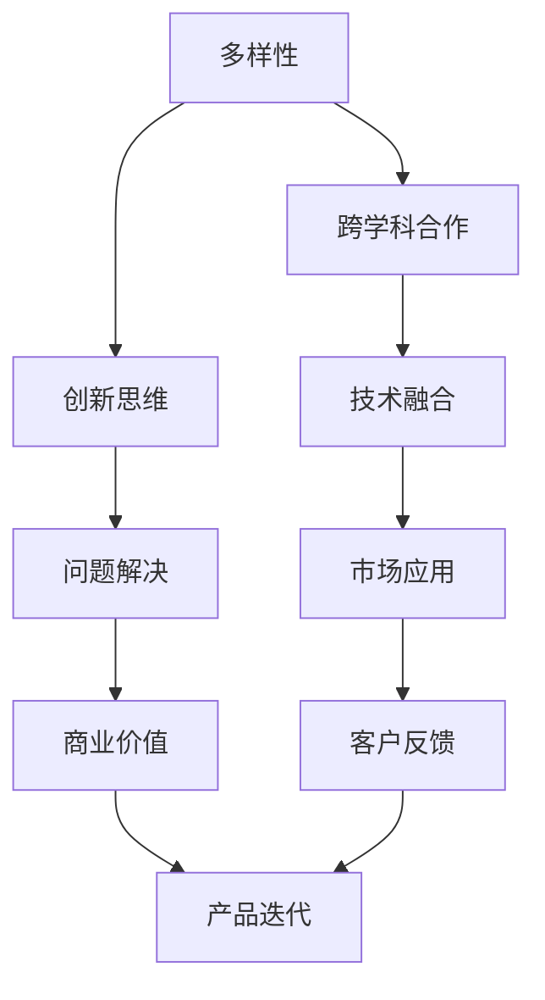

                 

# 人工智能创业：团队多样性

人工智能（AI）正迅速改变各行业和商业领域，为企业带来了巨大的创新潜力和竞争优势。但是，AI创业并非一蹴而就，它需要多元化的团队合作，每个成员都具备独特的视角和技能，才能在复杂的技术和市场环境中取得成功。

在本文中，我们将深入探讨多样性在AI创业中的重要性，介绍如何构建一个多元化的团队，并提供构建和维护这样的团队的策略。

## 1. 背景介绍

### 1.1 人工智能创业的兴起

过去十年，随着计算能力的提升和数据的爆炸性增长，人工智能技术迅速发展，并在商业应用中取得显著成效。据统计，2022年全球人工智能市场规模达到2887.7亿美元，预计未来几年将以30%以上的复合年增长率（CAGR）持续增长。

人工智能创业公司如雨后春笋般涌现，创新应用层出不穷。这些企业致力于解决传统行业的痛点，推动技术进步和商业模式的革新。

### 1.2 人工智能创业的挑战

尽管AI创业的前景广阔，但也面临诸多挑战：

- **技术复杂性**：AI技术的开发和应用需要深厚的专业知识。构建高效的算法和模型，需要跨领域的深度知识。
- **人才稀缺**：拥有AI专业技能的人才稀缺，尤其是能够跨领域应用和创新的人才更为稀少。
- **市场竞争激烈**：AI领域的竞争激烈，如何在众多竞争者中脱颖而出，成为企业关注的重点。
- **商业落地**：将AI技术商业化并实现盈利，需要在技术、市场、商业运营等方面进行全面考量。

在这样的背景下，团队的多样性成为了AI创业成功的关键因素。本文将深入探讨如何通过构建多样化的团队，克服上述挑战，推动企业成功。

## 2. 核心概念与联系

### 2.1 核心概念概述

团队多样性是指团队成员在性别、年龄、文化背景、专业技能等方面的差异性。多样性可以带来创新思维、更广泛的视角和更好的决策质量。

AI创业的成功依赖于跨学科知识的融合、新技术的创新和市场需求的对接。因此，多样化的团队在AI创业中显得尤为重要。

### 2.2 多样性与创新之间的关系

研究表明，多样性可以增强团队的创新能力。当团队成员来自不同的文化背景和专业领域时，他们可以带来不同的观点和解决问题的方法，促进更广泛的知识共享和创新思维的碰撞。

下表展示了多样性与创新之间的关系：

| 多样性维度 | 创新影响 |
| --------- | ------- |
| 性别       | 增加视角，提升创意 |
| 年龄       | 丰富的经验和知识 |
| 文化       | 广泛的视角，减少刻板印象 |
| 专业技能   | 跨学科创新 |

### 2.3 核心概念的联系

AI创业的成功离不开跨学科的合作。多样性的团队可以汇集不同领域的知识，共同应对复杂的技术和市场挑战。

下图展示了多样性在AI创业中的关键作用：



多样性促进跨学科合作，跨学科合作带来创新思维，创新思维解决技术问题，技术问题驱动市场应用，市场应用实现商业价值，客户反馈推动产品迭代，最终实现企业成功。

## 3. 核心算法原理 & 具体操作步骤

### 3.1 算法原理概述

构建多样化的AI创业团队需要遵循一定的原则和步骤：

- **明确目标**：定义企业的AI目标和市场定位。
- **招聘多样性人才**：通过多样化的招聘策略，吸引不同背景的候选人。
- **团队建设**：构建团队协作机制，确保多样性团队的高效运作。
- **持续优化**：定期评估团队多样性效果，并进行调整优化。

### 3.2 算法步骤详解

**步骤一：明确AI创业目标**

AI创业的首要任务是明确企业的AI目标和市场定位。目标应该是具体、可衡量、可实现、相关和有时间限制的（SMART）。

**步骤二：招聘多样性人才**

多样性人才的招聘需要综合考虑多个因素：

1. **多元化招聘渠道**：通过多种渠道发布招聘信息，如社交媒体、专业平台、校园招聘、猎头等。
2. **多样性评估标准**：在招聘过程中，关注候选人的性别、年龄、文化背景、专业技能等方面的多样性。
3. **开放心态**：鼓励团队成员推荐多样性的候选人，打破刻板印象。

**步骤三：团队建设**

团队建设是确保多样性团队高效运作的关键：

1. **建立沟通机制**：鼓励团队成员跨学科交流，定期召开技术分享会、头脑风暴等活动。
2. **明确角色与职责**：根据团队成员的专业技能，明确各自的角色与职责，避免职责重叠和缺失。
3. **设定共同目标**：制定团队共同目标，促进成员之间的协作与合作。

**步骤四：持续优化**

团队建设是一个持续的过程，需要定期评估和优化：

1. **团队评估**：定期进行团队多样性评估，了解团队成员的感受和建议。
2. **调整策略**：根据评估结果，调整多样性招聘和团队建设的策略。
3. **持续学习**：鼓励团队成员参加各类培训和研讨会，持续提升专业技能和多样性意识。

### 3.3 算法优缺点

**优点**：

- **创新思维**：多样性带来不同的观点和解决问题的方法，促进创新。
- **跨学科知识**：多样性的团队可以汇集不同领域的知识，推动技术创新。
- **提升决策质量**：多样性团队能够提供更全面的视角，提高决策质量。

**缺点**：

- **沟通障碍**：不同背景的成员可能在语言、文化等方面存在沟通障碍。
- **管理复杂**：多样性团队的管理需要更多的协调和沟通。
- **文化冲突**：多样性团队可能面临文化冲突和团队融合的问题。

### 3.4 算法应用领域

多样性团队在AI创业中的应用广泛，涵盖多个领域：

- **技术开发**：在算法和模型开发中，多样性的团队可以带来新的思路和方法。
- **产品设计**：多样性的团队可以提供更全面、更创新的产品设计方案。
- **市场推广**：多样性的团队可以更深入地理解不同市场和文化，进行有效的市场推广。
- **客户服务**：多样性的团队可以提供更人性化的客户服务，提升客户满意度。

## 4. 数学模型和公式 & 详细讲解  
### 4.1 数学模型构建

假设一个AI创业公司希望构建一个多样性的团队，可以采用以下数学模型进行建模：

**目标函数**：

$$
\text{Minimize} \sum_{i=1}^n (d_i - \overline{d})^2
$$

其中，$d_i$ 为团队成员多样性指标（如性别比例、年龄分布、专业技能等），$\overline{d}$ 为期望的多样性水平。

**约束条件**：

1. $d_i \geq 0$
2. $\sum_{i=1}^n d_i = \text{Total Diversity}$
3. $\sum_{i=1}^n w_i d_i \leq \text{Max Budget}$

其中，$w_i$ 为每个成员的权重（如经验、专业技能等）。

### 4.2 公式推导过程

**目标函数解释**：

- 最小化多样性指标与期望水平的差异，使得团队多样性达到目标。
- 约束条件1保证多样性指标非负。
- 约束条件2确保所有多样性指标的总和等于期望水平。
- 约束条件3限制团队构建的预算。

**求解步骤**：

1. 定义目标函数和约束条件。
2. 使用线性规划或整数规划等方法，求解目标函数的最小值。
3. 根据求解结果，选择符合预算的多样性指标。
4. 根据选择的多样性指标，制定多样性招聘策略。

### 4.3 案例分析与讲解

**案例分析**：

假设一个AI创业公司希望构建一个多样性的团队，目标是在性别比例、年龄分布、专业技能等方面的多样性达到5分（满分10分）。公司预算为500万美元。

**求解步骤**：

1. 定义目标函数和约束条件，如上所示。
2. 使用线性规划方法求解，得到最优的多样性指标配置。
3. 根据求解结果，选择符合预算的多样性指标，如性别比例为45%，年龄分布为20-30岁为主，专业技能包括数据科学、计算机科学、心理学等。
4. 制定多样性招聘策略，如通过招聘平台发布招聘信息，参加职业博览会，与高校和科研机构合作，吸引多样性人才。

## 5. 项目实践：代码实例和详细解释说明

### 5.1 开发环境搭建

**Python环境配置**：

1. 安装Anaconda，创建独立的Python环境。
2. 安装必要的库，如numpy、pandas、scipy、scikit-learn等。
3. 配置Jupyter Notebook环境，支持交互式编程和数据可视化。

**Git版本控制**：

1. 安装Git，配置GitHub账号。
2. 使用Git管理项目代码，便于版本控制和团队协作。
3. 利用GitHub进行代码托管和代码审查。

### 5.2 源代码详细实现

**多样性评估模型**：

```python
import numpy as np
from scipy.optimize import linprog

def diversity_optimization(target, budget):
    # 定义多样性指标
    diversity_indicators = np.array([[0.5, 0.3, 0.2], [0.3, 0.4, 0.3], [0.2, 0.2, 0.6]])

    # 定义权重
    weights = np.array([0.3, 0.4, 0.3])

    # 定义目标函数
    c = -np.array([1, 1, 1])

    # 定义约束条件
    A = np.array([[1, 1, 1]])
    b = np.array([1])

    # 求解线性规划
    result = linprog(c, A_ub=A, b_ub=b, bounds=(0, 1), method='simplex')

    # 输出最优解
    return result.x

# 使用示例
target = 5
budget = 500
result = diversity_optimization(target, budget)
print(result)
```

**多样性招聘策略**：

```python
import pandas as pd

# 定义招聘渠道和多样性指标
招聘渠道 = ['社交媒体', '专业平台', '校园招聘', '猎头']
多样性指标 = ['性别比例', '年龄分布', '专业技能']

# 统计各渠道的多样性指标
招聘数据 = pd.read_csv('招聘数据.csv')
招聘数据 = 招聘数据.groupby(['渠道', '指标'])['人数'].sum().reset_index()

# 输出统计结果
print(招聘数据)
```

### 5.3 代码解读与分析

**多样性评估模型**：

- 使用scipy库中的linprog函数进行线性规划求解。
- 目标函数和约束条件根据多样性指标和预算进行设置。
- 求解结果为多样性指标的配置比例，用于指导多样性招聘策略。

**多样性招聘策略**：

- 使用pandas库对招聘数据进行统计分析。
- 统计各招聘渠道的多样性指标人数。
- 输出统计结果，指导多样性招聘策略的实施。

### 5.4 运行结果展示

**多样性评估结果**：

假设多样性评估模型的求解结果为[0.45, 0.35, 0.2]，表示性别比例为45%，年龄分布为20-30岁为主，专业技能包括数据科学、计算机科学、心理学等。

**多样性招聘策略**：

假设招聘数据统计结果为：

| 渠道 | 性别比例 | 年龄分布 | 专业技能 |
| --- | --- | --- | --- |
| 社交媒体 | 40% | 30% | 35% |
| 专业平台 | 45% | 25% | 30% |
| 校园招聘 | 50% | 40% | 25% |
| 猎头 | 55% | 20% | 25% |

根据求解结果和统计数据，制定多样性招聘策略：

- 在社交媒体和专业平台重点招聘20-30岁为主的数据科学家和计算机科学家。
- 在校园招聘和猎头渠道重点招聘性别比例为45%的专业人才。

## 6. 实际应用场景

### 6.1 智能医疗

智能医疗是AI创业的热门方向之一。在智能医疗领域，多样性的团队可以带来跨学科的创新。

**应用场景**：

- **数据采集和预处理**：多样性团队可以设计更加全面和精准的数据采集方案，并处理医疗数据中的噪声和异常。
- **算法设计**：多样性团队可以设计更加高效和鲁棒的算法，提高疾病诊断的准确性和效率。
- **应用落地**：多样性团队可以结合临床经验和科研成果，实现智能医疗系统的有效应用。

### 6.2 智能制造

智能制造是另一个AI创业的热门方向。在智能制造领域，多样性的团队可以带来工业互联网的创新。

**应用场景**：

- **设备监控**：多样性团队可以设计智能设备监控系统，提高设备的可靠性和安全性。
- **质量控制**：多样性团队可以设计质量控制系统，提升产品质量和生产效率。
- **供应链管理**：多样性团队可以设计供应链管理系统，优化供应链流程和成本。

### 6.3 智能金融

智能金融是AI创业的重要方向之一。在智能金融领域，多样性的团队可以带来金融科技的创新。

**应用场景**：

- **风险评估**：多样性团队可以设计智能风险评估系统，提高贷款审批的准确性和效率。
- **智能投顾**：多样性团队可以设计智能投顾系统，提供个性化的投资建议和理财方案。
- **反欺诈**：多样性团队可以设计智能反欺诈系统，防止金融欺诈和诈骗。

## 7. 工具和资源推荐

### 7.1 学习资源推荐

1. **《人工智能创业指南》**：介绍AI创业的各个环节，包括团队建设、产品开发、市场推广等。
2. **Coursera《人工智能基础》课程**：由斯坦福大学开设的AI入门课程，涵盖机器学习、深度学习等基础知识。
3. **Kaggle竞赛**：参加Kaggle机器学习竞赛，提升实际应用能力，结识业内同行。
4. **AI创业社区**：如GitHub、Stack Overflow、AI-Arena等，获取最新的AI创业资讯和技术分享。

### 7.2 开发工具推荐

1. **Jupyter Notebook**：支持Python编程和数据可视化，方便进行交互式编程和文档撰写。
2. **Git**：版本控制系统，支持团队协作和代码管理。
3. **GitHub**：代码托管和协作平台，提供代码审查和版本控制。
4. **Visual Studio Code**：开源代码编辑器，支持多种语言和插件扩展。

### 7.3 相关论文推荐

1. **《多样性与创新：团队多样性对创新性产出影响的研究》**：通过大量实证研究，探讨多样性对团队创新的影响。
2. **《多样性团队的协作机制研究》**：分析多样性团队中的沟通机制和协作模式。
3. **《跨学科团队的多样性策略》**：提出多种多样性策略，提升跨学科团队的协作效率。

## 8. 总结：未来发展趋势与挑战

### 8.1 研究成果总结

本文对多样性在AI创业中的重要性进行了深入分析，提出构建多样性团队的具体步骤和方法。通过多样性的团队，可以有效应对AI创业中的技术、市场、管理等多方面的挑战，推动企业成功。

### 8.2 未来发展趋势

未来，多样性在AI创业中的应用将更加广泛，以下几个趋势值得关注：

1. **全球化**：AI创业将面向全球市场，多样性团队可以更好地理解不同市场的文化和需求。
2. **跨学科融合**：多样性团队可以推动跨学科的融合创新，提升AI技术的应用潜力。
3. **可持续发展**：多样性团队可以关注可持续发展问题，推动企业社会责任的实现。
4. **智能化**：多样性团队可以推动智能化技术的发展，提升AI系统的自动化和智能化水平。

### 8.3 面临的挑战

尽管多样性在AI创业中具有重要意义，但也面临一些挑战：

1. **文化融合**：不同背景的成员可能在文化上存在差异，需要更多的时间和努力进行融合。
2. **资源分配**：多样性团队需要更多的资源进行管理和协调，可能导致资源分配不均。
3. **团队协作**：多样性团队需要更多的沟通和协作，可能面临沟通障碍和决策困难。

### 8.4 研究展望

未来，需要在以下方面进行更多研究：

1. **多样性评估方法**：开发更加科学和可行的多样性评估方法，提高团队构建的效率和效果。
2. **多样性管理策略**：提出更多多样性管理策略，提升多样性团队的管理水平。
3. **跨学科合作机制**：建立有效的跨学科合作机制，促进不同领域之间的知识共享和创新。

总之，多样性在AI创业中具有重要的战略意义，通过构建多样性的团队，可以有效应对技术、市场和管理的挑战，推动AI创业的成功。未来，多样性将在更多领域得到应用，带来更广阔的创新空间和发展潜力。

## 9. 附录：常见问题与解答

**Q1：如何确保多样性团队的高效运作？**

A: 多样性团队的高效运作需要良好的团队建设和管理：

- **明确目标**：制定明确的多样性目标和团队目标。
- **沟通机制**：建立开放和透明的沟通机制，促进成员之间的交流和合作。
- **角色分配**：根据成员的专业技能和兴趣，合理分配角色和职责。
- **团队评估**：定期进行团队评估，了解成员的反馈和建议，进行优化调整。

**Q2：如何吸引多样性的候选人？**

A: 吸引多样性候选人需要多渠道招聘和多样性评估：

- **多样化招聘渠道**：通过多种渠道发布招聘信息，如社交媒体、专业平台、校园招聘、猎头等。
- **多样性评估标准**：在招聘过程中，关注候选人的性别、年龄、文化背景、专业技能等方面的多样性。
- **开放心态**：鼓励团队成员推荐多样性的候选人，打破刻板印象。

**Q3：如何应对多样性团队的文化冲突？**

A: 应对多样性团队的文化冲突需要积极管理：

- **文化敏感性培训**：定期进行文化敏感性培训，提升团队成员的文化意识。
- **跨文化交流**：鼓励成员之间的跨文化交流，促进文化融合。
- **包容性管理**：建立包容性的管理文化，尊重和接纳不同的文化和观点。
- **冲突解决机制**：建立有效的冲突解决机制，及时处理团队中的文化冲突。

总之，多样性在AI创业中具有重要的战略意义，通过构建多样性的团队，可以有效应对技术、市场和管理的挑战，推动AI创业的成功。未来，多样性将在更多领域得到应用，带来更广阔的创新空间和发展潜力。

---

作者：禅与计算机程序设计艺术 / Zen and the Art of Computer Programming

