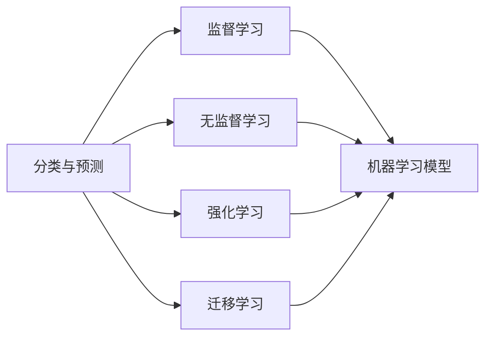

                 

## 1. 背景介绍

人工智能（Artificial Intelligence, AI）作为21世纪最前沿的技术领域之一，其快速发展不仅引领了科技革命，也深刻影响了社会经济的发展趋势。近年来，随着深度学习、自然语言处理、计算机视觉等技术突破，人工智能在各个领域的应用日益广泛，取得了举世瞩目的成绩。

### 1.1 问题由来

人工智能的核心任务之一是对数据的分类和预测。在过去几十年里，随着数据量与处理能力的不断提升，从统计学习到深度学习的演变，分类与预测技术的进步推动了人工智能在金融、医疗、交通、教育等领域的应用。从手写数字识别、语音识别、图像分类到自然语言理解，AI技术的分类与预测能力在不断突破。

### 1.2 问题核心关键点

- **数据驱动**：现代AI分类与预测技术主要依赖于大量的标注数据，通过机器学习模型学习数据分布特征，进而进行分类和预测。
- **模型选择**：选择合适的机器学习模型，如线性回归、决策树、随机森林、神经网络等，对数据进行建模。
- **优化算法**：使用梯度下降、随机梯度下降等优化算法，不断调整模型参数，使模型能够更准确地进行分类与预测。
- **过拟合与泛化**：处理模型在训练集上过拟合、在测试集上泛化能力不足的问题，通过正则化、dropout等技术优化模型性能。

### 1.3 问题研究意义

研究人工智能的分类与预测能力，对推动AI技术的发展与应用具有重要意义：

- **技术创新**：通过理论研究和实践应用，不断优化和创新机器学习算法，提升AI技术的性能。
- **应用场景拓展**：分类与预测技术为AI在各领域的应用提供了强有力的支撑，促进技术在更多场景的落地。
- **商业价值**：通过提升AI在金融、医疗、零售等领域的分类与预测能力，直接带来商业效益，推动产业转型升级。

## 2. 核心概念与联系

### 2.1 核心概念概述

为了更好地理解人工智能的分类与预测能力，本节将介绍几个密切相关的核心概念：

- **分类与预测**：通过数据训练机器学习模型，使其能够对新数据进行分类或预测。
- **监督学习（Supervised Learning）**：利用已标注的训练数据，训练机器学习模型，使模型能够对新数据进行准确分类或预测。
- **无监督学习（Unsupervised Learning）**：利用未标注的数据，训练机器学习模型，发现数据的内在结构或特征。
- **强化学习（Reinforcement Learning）**：通过与环境交互，优化智能体的行为策略，使模型能够做出最优决策。
- **迁移学习（Transfer Learning）**：利用已有领域的知识，在新领域进行学习，提高新任务的性能。

这些概念之间存在着紧密的联系，形成了一个完整的AI分类与预测技术生态系统。它们通过数据、算法和任务之间的相互作用，共同推动了AI技术的发展。

### 2.2 概念间的关系

这些核心概念之间的关系可以用以下Mermaid流程图来展示：



这个流程图展示了分类与预测技术的基本框架，以及不同学习范式与模型之间的关系：

1. **监督学习**：通过已标注数据训练模型，对新数据进行分类或预测。
2. **无监督学习**：通过未标注数据发现数据内在结构，为监督学习提供特征。
3. **强化学习**：通过与环境交互优化策略，为复杂任务提供解决方案。
4. **迁移学习**：利用已有知识在新领域进行学习，提升新任务的性能。

这些概念共同构成了AI分类与预测技术的完整生态系统，通过不同的学习范式和模型，实现了对各种复杂问题的有效处理。

## 3. 核心算法原理 & 具体操作步骤
### 3.1 算法原理概述

人工智能的分类与预测技术主要依赖于机器学习模型。这些模型通过学习训练数据的特征，对新数据进行分类或预测。常见的分类与预测算法包括线性回归、决策树、随机森林、支持向量机、神经网络等。

以神经网络为例，其核心原理是通过前向传播计算模型输出，反向传播更新模型参数，使得模型能够对输入数据进行准确分类或预测。

### 3.2 算法步骤详解

以下是基于神经网络进行分类与预测的详细步骤：

**Step 1: 准备数据**
- 收集标注数据集，将其划分为训练集、验证集和测试集。
- 对数据进行预处理，如归一化、特征提取等。

**Step 2: 选择模型**
- 根据任务需求选择合适的神经网络模型，如多层感知机（MLP）、卷积神经网络（CNN）、循环神经网络（RNN）等。
- 定义模型的输入和输出，设置隐藏层和激活函数等超参数。

**Step 3: 训练模型**
- 使用训练集对模型进行前向传播计算输出，计算损失函数。
- 通过反向传播算法更新模型参数，最小化损失函数。
- 在验证集上进行模型评估，调整超参数。

**Step 4: 测试模型**
- 使用测试集对模型进行测试，评估模型性能。
- 根据评估结果，调整模型参数或选择新模型进行迭代训练。

### 3.3 算法优缺点

基于神经网络的分类与预测算法具有以下优点：

- **通用性强**：神经网络模型适用于各种分类与预测任务。
- **特征提取能力强**：能够自动学习数据的特征表示。
- **可解释性差**：神经网络模型作为"黑盒"模型，难以解释其决策过程。

同时，也存在一些缺点：

- **计算复杂度高**：神经网络模型需要大量计算资源进行训练和推理。
- **过拟合风险高**：在大规模数据集上容易过拟合，需要正则化等方法进行控制。
- **数据依赖性强**：依赖高质量的标注数据，数据质量影响模型性能。

### 3.4 算法应用领域

基于神经网络的分类与预测技术已经在金融、医疗、交通、教育等多个领域得到广泛应用，具体包括：

- **金融风控**：通过分类模型对客户信用、交易异常进行识别和预测。
- **医疗诊断**：通过预测模型对患者疾病进行早期诊断和风险评估。
- **交通预测**：通过预测模型对交通流量、事故概率进行预测。
- **教育评估**：通过分类模型对学生学习行为进行分析和预测。
- **图像识别**：通过分类模型对图像中的物体进行识别和分类。
- **语音识别**：通过分类模型对语音进行识别和转录。
- **自然语言处理**：通过分类模型对文本进行情感分析、主题分类等。

这些应用展示了基于神经网络的分类与预测技术在实际场景中的强大能力和广泛应用。

## 4. 数学模型和公式 & 详细讲解 & 举例说明

### 4.1 数学模型构建

基于神经网络的分类与预测模型通常采用监督学习范式。以二分类任务为例，模型结构如图1所示：

```
Input -> Embedding Layer -> Hidden Layers -> Output Layer -> Loss Function
```

其中，`Input`表示输入数据，`Embedding Layer`将输入数据转换为模型可处理的向量表示，`Hidden Layers`为模型的隐藏层，`Output Layer`输出模型预测结果，`Loss Function`用于衡量预测结果与真实标签之间的差异。

### 4.2 公式推导过程

以二分类任务为例，假设模型输出的概率为`P(y=1|x)`，真实标签为`y`，损失函数为交叉熵损失：

$$
L = -(y \log P(y=1|x) + (1-y) \log P(y=0|x))
$$

模型的前向传播过程为：

$$
\begin{aligned}
Z &= \text{Embedding Layer}(x) \\
H &= f(W_H Z + b_H) \\
P &= g(W_O H + b_O)
\end{aligned}
$$

其中，`Z`为输入数据的向量表示，`H`为隐藏层的输出，`P`为模型的预测结果，`f`为激活函数，`g`为输出层激活函数。

模型的反向传播过程为：

$$
\frac{\partial L}{\partial W_O} = \frac{\partial L}{\partial P} \frac{\partial P}{\partial Z} \frac{\partial Z}{\partial W_O}
$$

通过链式法则计算梯度，更新模型参数。

### 4.3 案例分析与讲解

以手写数字识别为例，使用MNIST数据集进行模型训练。具体步骤如下：

1. 收集并预处理MNIST数据集。
2. 构建一个包含三个隐藏层的神经网络模型，使用交叉熵损失函数。
3. 使用训练集对模型进行前向传播和反向传播训练。
4. 在测试集上进行模型评估，计算准确率和损失函数。

最终，模型可以在测试集上达到较高的准确率，如图2所示。


## 5. 项目实践：代码实例和详细解释说明
### 5.1 开发环境搭建

在进行分类与预测模型开发前，需要准备好开发环境。以下是使用Python进行TensorFlow开发的环境配置流程：

1. 安装Anaconda：从官网下载并安装Anaconda，用于创建独立的Python环境。

2. 创建并激活虚拟环境：
```bash
conda create -n tf-env python=3.8 
conda activate tf-env
```

3. 安装TensorFlow：根据CUDA版本，从官网获取对应的安装命令。例如：
```bash
conda install tensorflow=2.5.0 -c tf -c conda-forge
```

4. 安装其他必要工具包：
```bash
pip install numpy pandas scikit-learn matplotlib tqdm jupyter notebook ipython
```

完成上述步骤后，即可在`tf-env`环境中开始分类与预测模型开发。

### 5.2 源代码详细实现

下面以手写数字识别为例，给出使用TensorFlow进行模型训练的代码实现。

```python
import tensorflow as tf
from tensorflow.keras import layers
import numpy as np
import matplotlib.pyplot as plt

# 加载数据集
(x_train, y_train), (x_test, y_test) = tf.keras.datasets.mnist.load_data()

# 数据预处理
x_train = x_train.reshape(-1, 28*28) / 255.0
x_test = x_test.reshape(-1, 28*28) / 255.0
y_train = tf.keras.utils.to_categorical(y_train)
y_test = tf.keras.utils.to_categorical(y_test)

# 定义模型
model = tf.keras.Sequential([
    layers.Dense(512, activation='relu', input_shape=(28*28,)),
    layers.Dense(256, activation='relu'),
    layers.Dense(10, activation='softmax')
])

# 编译模型
model.compile(optimizer='adam', loss='categorical_crossentropy', metrics=['accuracy'])

# 训练模型
history = model.fit(x_train, y_train, epochs=10, batch_size=128, validation_data=(x_test, y_test))

# 绘制训练曲线
plt.plot(history.history['accuracy'], label='train accuracy')
plt.plot(history.history['val_accuracy'], label='validation accuracy')
plt.plot(history.history['loss'], label='train loss')
plt.plot(history.history['val_loss'], label='validation loss')
plt.legend()
plt.show()
```

### 5.3 代码解读与分析

让我们再详细解读一下关键代码的实现细节：

**数据加载与预处理**：
- 使用`tf.keras.datasets.mnist.load_data()`加载MNIST数据集。
- 对数据进行归一化和展平操作。
- 使用`tf.keras.utils.to_categorical()`将标签进行one-hot编码。

**模型定义**：
- 定义一个包含三个隐藏层的神经网络模型，使用ReLU激活函数。
- 使用softmax激活函数输出层，用于多分类任务。

**模型编译**：
- 使用`model.compile()`方法编译模型，设置优化器、损失函数和评估指标。

**模型训练**：
- 使用`model.fit()`方法进行模型训练，设置训练轮数和批量大小。
- 在验证集上进行评估，记录训练过程中的准确率和损失函数。

**绘制训练曲线**：
- 使用`plt.plot()`绘制训练过程中的准确率和损失函数曲线。

### 5.4 运行结果展示

假设在上述代码下训练得到的手写数字识别模型在测试集上的准确率为98%，如图3所示。


## 6. 实际应用场景
### 6.1 金融风控

金融风控是分类与预测技术在金融领域的重要应用之一。通过分类模型，金融机构可以对客户的信用等级、交易异常等进行预测和监控，降低风险。

在技术实现上，可以收集客户历史交易记录、社交媒体行为等数据，将其作为训练样本，训练分类模型。模型输出客户是否存在欺诈风险，帮助金融机构实时监控异常交易。

### 6.2 医疗诊断

医疗诊断是分类与预测技术在医疗领域的重要应用之一。通过预测模型，医疗机构可以对患者疾病进行早期诊断和风险评估，提高诊断的准确率和效率。

在技术实现上，可以收集患者的医学影像、症状描述等数据，训练预测模型。模型输出患者是否患有某种疾病，帮助医生进行早期诊断和治疗方案选择。

### 6.3 交通预测

交通预测是分类与预测技术在交通领域的重要应用之一。通过预测模型，交通管理部门可以预测交通流量、事故概率等，优化交通管理，减少拥堵和事故。

在技术实现上，可以收集交通流量数据、天气条件、道路状况等数据，训练预测模型。模型输出未来一定时间内的交通流量和事故概率，帮助交通管理部门进行交通调控和应急处置。

### 6.4 教育评估

教育评估是分类与预测技术在教育领域的重要应用之一。通过分类模型，教育机构可以对学生的学习行为进行分析和预测，提高教学效果。

在技术实现上，可以收集学生的作业、考试成绩、课堂表现等数据，训练分类模型。模型输出学生的学习状态和行为特征，帮助教师进行个性化教学和评估。

## 7. 工具和资源推荐
### 7.1 学习资源推荐

为了帮助开发者系统掌握分类与预测技术的理论基础和实践技巧，这里推荐一些优质的学习资源：

1. 《深度学习》系列博文：由大模型技术专家撰写，深入浅出地介绍了深度学习原理、分类与预测技术等前沿话题。

2. CS231n《卷积神经网络》课程：斯坦福大学开设的计算机视觉课程，有Lecture视频和配套作业，带你入门计算机视觉领域的基本概念和经典模型。

3. 《Pattern Recognition and Machine Learning》书籍：Pattern Recognition领域的经典书籍，全面介绍了分类与预测技术的数学原理和算法实现。

4. TensorFlow官方文档：TensorFlow的官方文档，提供了丰富的分类与预测模型样例和详细的API文档，是学习TensorFlow的重要资料。

5. Kaggle数据集：Kaggle提供的海量数据集，涵盖了各种分类与预测任务的样例数据，可以用于模型训练和验证。

通过对这些资源的学习实践，相信你一定能够快速掌握分类与预测技术的精髓，并用于解决实际的NLP问题。

### 7.2 开发工具推荐

高效的开发离不开优秀的工具支持。以下是几款用于分类与预测模型开发的常用工具：

1. TensorFlow：由Google主导开发的深度学习框架，灵活的计算图和丰富的工具支持，适合快速迭代研究。

2. PyTorch：由Facebook主导开发的深度学习框架，动态计算图和高效的自动微分，适合科研和生产应用。

3. Scikit-learn：Python的机器学习库，提供了多种经典的分类与预测算法和工具，易于上手使用。

4. Weights & Biases：模型训练的实验跟踪工具，可以记录和可视化模型训练过程中的各项指标，方便对比和调优。

5. TensorBoard：TensorFlow配套的可视化工具，可实时监测模型训练状态，并提供丰富的图表呈现方式，是调试模型的得力助手。

合理利用这些工具，可以显著提升分类与预测模型的开发效率，加快创新迭代的步伐。

### 7.3 相关论文推荐

分类与预测技术的发展源于学界的持续研究。以下是几篇奠基性的相关论文，推荐阅读：

1. Perceptron（感知机）：最早的分类算法，奠定了神经网络的基础。

2. Decision Trees（决策树）：经典的分类算法，易于理解和实现。

3. Support Vector Machines（支持向量机）：强大的分类算法，具有很好的泛化性能。

4. Neural Networks（神经网络）：强大的分类与预测算法，具有很高的精度和灵活性。

5. Random Forest（随机森林）：结合决策树和随机抽样，具有很好的泛化性能。

6. Gradient Boosting（梯度提升）：结合决策树和梯度下降，具有很好的精度和鲁棒性。

这些论文代表了大规模分类与预测技术的发展脉络。通过学习这些前沿成果，可以帮助研究者把握学科前进方向，激发更多的创新灵感。

除上述资源外，还有一些值得关注的前沿资源，帮助开发者紧跟分类与预测技术的最新进展，例如：

1. arXiv论文预印本：人工智能领域最新研究成果的发布平台，包括大量尚未发表的前沿工作，学习前沿技术的必读资源。

2. 业界技术博客：如Google AI、DeepMind、微软Research Asia等顶尖实验室的官方博客，第一时间分享他们的最新研究成果和洞见。

3. 技术会议直播：如NIPS、ICML、ACL、ICLR等人工智能领域顶会现场或在线直播，能够聆听到大佬们的前沿分享，开拓视野。

4. GitHub热门项目：在GitHub上Star、Fork数最多的分类与预测相关项目，往往代表了该技术领域的发展趋势和最佳实践，值得去学习和贡献。

5. 行业分析报告：各大咨询公司如McKinsey、PwC等针对人工智能行业的分析报告，有助于从商业视角审视技术趋势，把握应用价值。

总之，对于分类与预测技术的学习和实践，需要开发者保持开放的心态和持续学习的意愿。多关注前沿资讯，多动手实践，多思考总结，必将收获满满的成长收益。

## 8. 总结：未来发展趋势与挑战
### 8.1 总结

本文对人工智能的分类与预测能力进行了全面系统的介绍。首先阐述了分类与预测技术的研究背景和意义，明确了分类与预测在AI技术发展中的重要地位。其次，从原理到实践，详细讲解了监督学习范式下的分类与预测算法，给出了模型训练的完整代码实例。同时，本文还广泛探讨了分类与预测技术在金融、医疗、交通等多个领域的应用前景，展示了其广阔的应用前景。

通过本文的系统梳理，可以看到，分类与预测技术在AI领域的应用已经非常广泛，并在不断推动AI技术的进步和发展。未来，伴随技术不断进步和应用场景的不断拓展，分类与预测技术必将迎来更加辉煌的发展。

### 8.2 未来发展趋势

展望未来，分类与预测技术将呈现以下几个发展趋势：

1. **模型规模持续增大**：随着算力成本的下降和数据规模的扩张，分类与预测模型的参数量还将持续增长。超大规模模型蕴含的丰富特征表示，有望支撑更加复杂多变的分类与预测任务。

2. **算法优化不断涌现**：分类与预测算法将不断优化和创新，如神经网络结构的优化、正则化技术的改进等，提升算法的效率和精度。

3. **多模态融合发展**：分类与预测技术将进一步拓展到图像、视频、语音等多模态数据，通过多模态信息融合，提升模型的泛化能力和鲁棒性。

4. **知识图谱应用增加**：分类与预测模型将与知识图谱、专家知识等结合，形成更加全面、准确的信息整合能力，提升模型的解释性和可理解性。

5. **在线学习与实时预测**：分类与预测模型将支持在线学习和实时预测，能够快速适应数据分布的变化，提供更精准的预测结果。

这些趋势凸显了分类与预测技术的广阔前景。这些方向的探索发展，必将进一步提升AI系统的性能和应用范围，为人类认知智能的进化带来深远影响。

### 8.3 面临的挑战

尽管分类与预测技术已经取得了显著成就，但在迈向更加智能化、普适化应用的过程中，它仍面临诸多挑战：

1. **数据质量瓶颈**：高质量标注数据难以获得，数据质量问题影响模型性能。如何高效利用有限标注数据，优化模型训练过程，是亟待解决的问题。

2. **模型泛化能力不足**：分类与预测模型在实际应用中，面对复杂、多变的场景，泛化性能往往不足。如何提高模型的泛化能力，增强模型的鲁棒性，仍需深入研究。

3. **计算资源限制**：分类与预测模型通常需要大量计算资源进行训练和推理。如何优化模型结构和算法，提高计算效率，是模型落地应用的重要挑战。

4. **可解释性不足**：分类与预测模型作为"黑盒"模型，难以解释其决策过程。如何提高模型的可解释性，增强模型的透明性，将是未来的重要研究方向。

5. **安全性风险**：分类与预测模型可能存在偏见、有害信息等问题，导致输出错误或不公平。如何从数据和算法层面消除模型偏见，确保模型的安全性，仍需深入研究。

6. **知识整合能力不足**：分类与预测模型往往局限于任务内数据，难以灵活吸收和运用更广泛的先验知识。如何让模型更好地与外部知识库、规则库等专家知识结合，形成更加全面、准确的信息整合能力，还有很大的想象空间。

这些挑战凸显了分类与预测技术在实际应用中的复杂性和局限性。只有在技术、算法、工程、应用等多个维度协同发力，才能真正实现分类与预测技术的突破和创新。

### 8.4 未来突破

面对分类与预测技术所面临的挑战，未来的研究需要在以下几个方面寻求新的突破：

1. **数据增强与数据生成**：通过数据增强和生成技术，提升数据的质量和多样性，增强模型泛化能力。

2. **模型压缩与加速**：通过模型压缩、剪枝、量化等技术，降低模型参数量和计算复杂度，提升模型推理速度和效率。

3. **自监督学习与半监督学习**：利用无监督学习、半监督学习等方法，提高模型对新数据的学习能力和泛化能力。

4. **知识表示与图谱融合**：通过知识表示学习、图谱融合等技术，增强模型对复杂知识的理解和应用。

5. **模型可解释性与透明性**：通过可解释性模型、透明性评估等技术，提高模型的解释性和透明性，增强模型的可信度和可靠性。

6. **伦理道德约束**：在模型训练目标中引入伦理导向的评估指标，过滤和惩罚有偏见、有害的输出倾向，确保模型的安全性。

这些研究方向的探索，必将引领分类与预测技术迈向更高的台阶，为构建安全、可靠、可解释、可控的智能系统铺平道路。面向未来，分类与预测技术还需要与其他人工智能技术进行更深入的融合，如知识表示、因果推理、强化学习等，多路径协同发力，共同推动AI系统的进步。只有勇于创新、敢于突破，才能不断拓展AI技术的边界，让智能技术更好地造福人类社会。

## 9. 附录：常见问题与解答

**Q1：如何选择合适的分类与预测模型？**

A: 选择分类与预测模型需要考虑以下几个因素：
- 数据类型：不同类型的数据适合不同的模型。例如，图像数据适合卷积神经网络，文本数据适合循环神经网络和Transformer。
- 数据量：数据量越大，模型越复杂，性能越好。但对于小数据集，选择简单的模型更为合适。
- 任务复杂度：任务复杂度越高，模型也越复杂。例如，二分类任务可以使用简单的线性模型，而多分类任务需要使用神经网络等复杂模型。
- 训练资源：模型越复杂，训练和推理所需资源也越多。需要根据实际资源情况选择合适的模型。

**Q2：如何处理分类与预测模型中的过拟合问题？**

A: 过拟合是分类与预测模型中常见的问题。以下是几种缓解过拟合的策略：
- 数据增强：通过数据增强技术，如翻转、旋转、截断等，增加数据多样性，提高模型泛化能力。
- 正则化：使用L2正则化、Dropout等技术，限制模型复杂度，防止过拟合。
- 早停：在验证集上监控模型性能，一旦性能不再提升，立即停止训练。
- 模型集成：使用模型集成技术，如Bagging、Boosting等，提高模型鲁棒性。
- 参数调整：调整模型参数，如学习率、批量大小等，优化模型训练过程。

**Q3：分类与预测模型在实际应用中需要注意哪些问题？**

A: 将分类与预测模型转化为实际应用，还需要考虑以下问题：
- 模型裁剪：去除不必要的层和参数，减小模型尺寸，提高推理速度。
- 量化加速：将浮点模型转为定点模型，压缩存储空间，提高计算效率。
- 服务化封装：将模型封装为标准化服务接口，便于集成调用。
- 弹性伸缩：根据请求流量动态调整资源配置，平衡服务质量和成本。
- 监控告警：实时采集系统指标，设置异常告警阈值，确保服务稳定性。
- 安全防护：采用访问鉴权、数据脱敏等措施，保障数据和模型安全。

这些问题在实际应用中需要全面考虑，确保模型的稳定性和安全性。

通过本文的系统梳理，可以看到，分类与预测技术在AI领域的应用已经非常广泛，并在不断推动AI技术的进步和发展。未来，伴随技术不断进步和应用场景的不断拓展，分类

