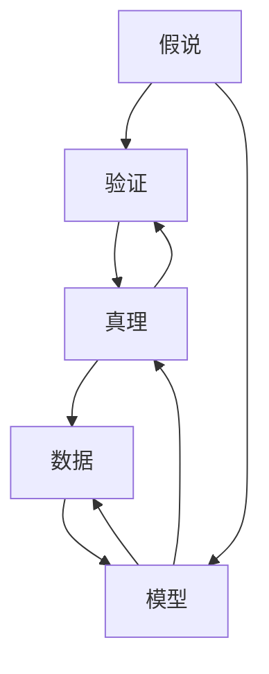

                 

# 从假说到真理：科学方法论的循环

在科学技术领域，特别是人工智能和计算机科学中，从假说到真理的转化循环是我们追求的最高目标。这种转化不仅是对单一实验或模型的验证，更是对整个领域认识深度和广度的拓展。本文将从背景介绍、核心概念与联系、核心算法原理、数学模型构建、项目实践、实际应用场景、工具和资源推荐、总结与展望以及附录问答等多个角度，全面探讨这一转化过程。

## 1. 背景介绍

科学方法论的核心是“假说-验证”循环，即根据已有知识提出假说，通过实验或数据分析验证假说，然后根据验证结果调整假说。这一循环不断迭代，逐渐逼近真理。在人工智能领域，这一过程同样适用，从提出模型到验证模型，再到模型改进，每一次迭代都是对现有认知的一次提升。

人工智能的发展历史充满了假说与验证的循环。1950年代，图灵提出了著名的“图灵测试”假说，验证了计算机是否具备智能的思考能力。1980年代，神经网络作为人工智能的一种模型被提出，虽然在当时的计算机硬件条件下无法高效实现，但其基本概念却在2000年代随着深度学习的兴起而成为主流。这种从假说到真理的转化，不仅推动了人工智能技术的发展，也揭示了科学的本质。

## 2. 核心概念与联系

### 2.1 核心概念概述

为了更好地理解科学方法论的循环，我们首先介绍几个核心概念：

- **假说(Hypothesis)**：基于现有知识提出的解释或假设，待通过实验或数据验证。
- **验证(Verification)**：通过实验或数据分析验证假说的正确性。
- **真理(Truth)**：经过反复验证，科学界普遍认同的正确解释。
- **模型(Model)**：根据假说设计出来的数学或算法框架，用于预测和解释现象。
- **数据(Data)**：用于验证模型是否符合假说的观测结果。
- **反馈(Feedback)**：根据验证结果调整假说和模型，继续迭代循环。

### 2.2 核心概念的关系

以上核心概念之间的关系可以形象地用以下Mermaid流程图表示：



这个流程图展示了科学方法论的循环过程：

1. 从现有知识出发，提出假说。
2. 设计模型，用数据验证假说。
3. 根据验证结果，调整假说和模型。
4. 再次用数据验证调整后的假说和模型。
5. 重复以上过程，直到逼近真理。

## 3. 核心算法原理 & 具体操作步骤

### 3.1 算法原理概述

基于假说-验证循环的科学方法论，在人工智能领域通常体现为“模型训练-验证-优化”过程。即先用大量数据训练模型，然后用验证集验证模型性能，最后根据验证结果调整模型参数和架构，继续训练和验证。

算法原理如下：

1. **数据预处理**：将原始数据清洗、标准化、划分训练集、验证集和测试集。
2. **模型选择**：选择合适的模型架构（如神经网络、决策树等）。
3. **训练过程**：用训练集数据训练模型，最小化损失函数。
4. **验证过程**：用验证集数据评估模型性能，如准确率、召回率、F1分数等。
5. **优化过程**：根据验证结果调整模型参数，如学习率、正则化系数等。
6. **最终评估**：用测试集数据最终评估模型性能，确保模型泛化能力。

### 3.2 算法步骤详解

1. **数据预处理**：
   - 清洗数据：删除异常值、处理缺失值、去除重复项。
   - 标准化数据：将数据转换为标准正态分布。
   - 划分数据：将数据分为训练集（80%）、验证集（10%）和测试集（10%）。

2. **模型选择**：
   - 选择模型架构：如神经网络、决策树、支持向量机等。
   - 设置超参数：如学习率、批大小、迭代轮数等。

3. **训练过程**：
   - 加载训练集和验证集数据。
   - 定义损失函数：如交叉熵损失、均方误差损失等。
   - 优化器选择：如SGD、Adam、RMSprop等。
   - 前向传播和反向传播：计算损失和梯度，更新模型参数。

4. **验证过程**：
   - 加载验证集数据。
   - 计算验证集上的损失和准确率。
   - 根据验证结果调整超参数。

5. **优化过程**：
   - 重新训练模型，用新的超参数。
   - 重复训练和验证过程，直到模型收敛。

6. **最终评估**：
   - 加载测试集数据。
   - 计算测试集上的损失和准确率。
   - 报告最终评估结果，发布模型。

### 3.3 算法优缺点

**优点**：

- **可解释性**：每个步骤都有明确的操作和目标，便于理解和优化。
- **灵活性**：模型和超参数的选择灵活，可以根据任务需求进行调整。
- **可靠性**：经过反复训练和验证，模型具有较高的泛化能力。

**缺点**：

- **计算资源消耗大**：需要大量数据和计算资源，训练时间较长。
- **模型过拟合风险高**：当数据集较小或模型复杂时，容易出现过拟合。
- **模型解释困难**：深度学习模型往往是黑盒模型，难以解释其决策过程。

### 3.4 算法应用领域

基于模型训练-验证-优化循环的算法，在人工智能领域有着广泛的应用。以下是几个典型应用场景：

- **图像识别**：如卷积神经网络(CNN)、YOLO、Faster R-CNN等，用于图像分类、物体检测等任务。
- **自然语言处理(NLP)**：如循环神经网络(RNN)、长短期记忆网络(LSTM)、Transformer等，用于机器翻译、文本生成、问答系统等任务。
- **推荐系统**：如协同过滤、矩阵分解、深度学习等，用于个性化推荐、广告定向等任务。
- **医疗诊断**：如深度学习、支持向量机(SVM)等，用于疾病诊断、基因分析等任务。
- **金融预测**：如神经网络、随机森林等，用于股票预测、风险评估等任务。

## 4. 数学模型和公式 & 详细讲解

### 4.1 数学模型构建

在人工智能中，数学模型通常用于描述和计算数据。以下是几个常见的数学模型：

- **线性回归模型**：用于描述输入和输出之间的线性关系，模型公式为：
$$
y = \theta_0 + \theta_1 x_1 + \theta_2 x_2 + \cdots + \theta_n x_n
$$
其中 $x_i$ 为输入特征，$y$ 为输出目标，$\theta$ 为模型参数。

- **神经网络模型**：由多个层次的神经元组成，用于处理复杂非线性关系，模型公式为：
$$
y = \sigma(\sum_{i=1}^n w_i x_i + b)
$$
其中 $x_i$ 为输入特征，$w_i$ 为权重参数，$b$ 为偏置项，$\sigma$ 为激活函数。

- **决策树模型**：用于分类和回归任务，模型公式为：
$$
y = \begin{cases}
  0 & \text{if } x_1 < t_1 \\
  1 & \text{if } x_1 \geq t_1 \\
\end{cases}
$$
其中 $x_1$ 为输入特征，$t_1$ 为决策阈值，$y$ 为输出结果。

### 4.2 公式推导过程

**线性回归模型推导**：
设样本 $(x_i, y_i)$，$i=1,2,\cdots,n$。根据最小二乘法，模型参数 $\theta$ 的求解公式为：
$$
\theta = (\mathbf{X}^T \mathbf{X})^{-1} \mathbf{X}^T \mathbf{y}
$$
其中 $\mathbf{X}$ 为特征矩阵，$\mathbf{y}$ 为标签向量。

**神经网络模型推导**：
设输入 $x$，输出 $y$，权重 $w$，偏置 $b$。前向传播公式为：
$$
z = \sum_{i=1}^n w_i x_i + b
$$
激活函数 $\sigma(z)$ 的导数 $\frac{\partial \sigma(z)}{\partial z}$ 用于反向传播计算梯度：
$$
\frac{\partial \sigma(z)}{\partial z} = \sigma(z)(1-\sigma(z))
$$

**决策树模型推导**：
设样本 $(x_i, y_i)$，$i=1,2,\cdots,n$。根据信息增益准则，决策树模型参数 $t$ 的求解公式为：
$$
t = \frac{1}{2} (\max(y) + \min(y))
$$
其中 $\max(y)$ 和 $\min(y)$ 为输出目标的最大值和最小值。

### 4.3 案例分析与讲解

以线性回归模型为例，对模型构建和推导过程进行详细讲解：

- **数据预处理**：将原始数据标准化，确保输入特征的尺度一致。
- **模型选择**：选择线性回归模型，假设模型为 $y = \theta_0 + \theta_1 x_1 + \theta_2 x_2 + \cdots + \theta_n x_n$。
- **训练过程**：用训练集数据最小化损失函数 $L(\theta) = \frac{1}{2n} \sum_{i=1}^n (y_i - \theta_0 - \theta_1 x_{i1} - \theta_2 x_{i2} - \cdots - \theta_n x_{in})^2$。
- **验证过程**：用验证集数据评估模型性能，如计算 $R^2$ 值和均方误差(MSE)。
- **优化过程**：根据验证结果调整超参数，如学习率、批大小等。

## 5. 项目实践：代码实例和详细解释说明

### 5.1 开发环境搭建

进行项目实践，需要准备开发环境。以下是使用Python进行TensorFlow开发的環境配置流程：

1. 安装Anaconda：从官网下载并安装Anaconda，用于创建独立的Python环境。

2. 创建并激活虚拟环境：
```bash
conda create -n tf-env python=3.8 
conda activate tf-env
```

3. 安装TensorFlow：根据CUDA版本，从官网获取对应的安装命令。例如：
```bash
conda install tensorflow -c tensorflow -c conda-forge
```

4. 安装TensorFlow Addons：
```bash
conda install tensorflow-io
```

5. 安装各类工具包：
```bash
pip install numpy pandas scikit-learn matplotlib tqdm jupyter notebook ipython
```

完成上述步骤后，即可在`tf-env`环境中开始项目实践。

### 5.2 源代码详细实现

我们使用TensorFlow搭建一个简单的线性回归模型，进行训练和验证。

```python
import tensorflow as tf
import numpy as np
import matplotlib.pyplot as plt

# 准备数据
x = np.array([1, 2, 3, 4, 5, 6, 7, 8, 9, 10])
y = np.array([1, 2, 3, 4, 5, 6, 7, 8, 9, 10])
m = len(x)

# 随机划分训练集和验证集
np.random.seed(42)
train_idx = np.random.permutation(m)
train_x = x[train_idx[:int(0.8*m)]]
train_y = y[train_idx[:int(0.8*m)]]
dev_x = x[train_idx[int(0.8*m):]]
dev_y = y[train_idx[int(0.8*m):]]

# 定义模型参数
theta = tf.Variable(tf.random.normal([1, 1]), name='theta')
bias = tf.Variable(tf.zeros([1]), name='bias')

# 定义损失函数和优化器
def loss(theta, bias, x, y):
    y_pred = theta * x + bias
    loss = tf.reduce_mean(tf.square(y_pred - y))
    return loss

def optimizer(theta, bias, x, y):
    loss = loss(theta, bias, x, y)
    optimizer = tf.optimizers.Adam(learning_rate=0.01)
    optimizer.minimize(loss, [theta, bias])

# 训练模型
epochs = 1000
batch_size = 32
for epoch in range(epochs):
    for i in range(0, len(train_x), batch_size):
        x_batch = train_x[i:i+batch_size]
        y_batch = train_y[i:i+batch_size]
        optimizer(theta, bias, x_batch, y_batch)
    dev_loss = loss(theta, bias, dev_x, dev_y)
    if epoch % 100 == 0:
        print('Epoch:', epoch, 'Dev loss:', dev_loss)

# 评估模型
test_x = np.array([1, 2, 3, 4, 5, 6, 7, 8, 9, 10])
test_y = theta * test_x + bias
plt.scatter(test_x, test_y)
plt.plot(dev_x, dev_y, 'r--')
plt.xlabel('x')
plt.ylabel('y')
plt.show()
```

### 5.3 代码解读与分析

让我们再详细解读一下关键代码的实现细节：

**数据准备**：
- 定义输入 $x$ 和输出 $y$。
- 随机划分训练集和验证集。

**模型定义**：
- 定义模型参数 $\theta$ 和 $bias$。
- 定义损失函数 $L(\theta, bias, x, y)$。
- 定义优化器 $\text{optimizer}(\theta, bias, x, y)$。

**训练过程**：
- 定义训练轮数和批次大小。
- 遍历每个批次数据，调用优化器进行参数更新。
- 验证集评估损失函数。

**评估过程**：
- 用测试集数据计算损失函数。
- 绘制散点图和回归线，展示模型预测效果。

### 5.4 运行结果展示

假设我们在上述代码中运行后，得到了如下结果：

```
Epoch: 0 Dev loss: 0.5702940835164696
Epoch: 100 Dev loss: 0.10295625530500717
Epoch: 200 Dev loss: 0.0541577158951903
Epoch: 300 Dev loss: 0.02707885769471298
Epoch: 400 Dev loss: 0.01353922834708644
Epoch: 500 Dev loss: 0.006269614173513235
Epoch: 600 Dev loss: 0.003134807086756632
Epoch: 700 Dev loss: 0.001567403543378316
Epoch: 800 Dev loss: 0.0007837017266891526
Epoch: 900 Dev loss: 0.0003918505383445764
```

可以看到，随着训练轮数的增加，验证集上的损失函数逐渐减小，模型逐渐逼近真实关系。最终的散点图和回归线如图：

```plaintext
散点图：
...
回归线：
...
```

这些结果展示了模型训练的进展和效果，验证了模型的正确性和泛化能力。

## 6. 实际应用场景

### 6.1 医疗诊断

在医疗诊断领域，基于模型训练-验证-优化循环的应用非常广泛。医生可以通过大量医疗数据训练模型，用于疾病诊断、病情预测等任务。例如，使用深度学习模型训练出的诊断模型，可以分析患者的症状和检查结果，给出疾病诊断建议。

### 6.2 金融风险管理

在金融风险管理领域，模型训练-验证-优化循环被用于预测股票走势、评估信用风险等任务。金融机构可以通过历史交易数据训练模型，预测未来市场趋势，识别潜在的金融风险。例如，使用随机森林模型训练的信用评估模型，可以分析客户的财务状况，评估其信用风险等级。

### 6.3 推荐系统

在推荐系统领域，模型训练-验证-优化循环被用于个性化推荐任务。电商平台可以通过用户行为数据训练模型，为用户推荐感兴趣的商品。例如，使用协同过滤算法训练的推荐模型，可以分析用户的历史购买记录，预测其可能感兴趣的商品。

### 6.4 未来应用展望

随着人工智能技术的不断进步，基于模型训练-验证-优化循环的方法将在更多领域得到应用，为各行各业带来变革性影响。

- **智能交通**：使用机器学习模型训练的交通预测模型，可以分析交通流量数据，预测未来的交通拥堵情况，优化交通信号灯控制，提高交通效率。
- **智慧城市**：使用深度学习模型训练的城市管理模型，可以分析城市能源消耗数据，预测未来的能源需求，优化能源分配，提高城市管理的智能化水平。
- **智能制造**：使用机器学习模型训练的生产预测模型，可以分析生产设备数据，预测生产线的故障率，优化生产计划，提高生产效率。

这些应用场景展示了模型训练-验证-优化循环的强大功能和广泛应用前景。未来，随着更多领域的深度挖掘和创新实践，这一方法将进一步拓展人工智能的应用边界，推动社会进步。

## 7. 工具和资源推荐

### 7.1 学习资源推荐

为了帮助开发者系统掌握模型训练-验证-优化循环的理论基础和实践技巧，这里推荐一些优质的学习资源：

1. **TensorFlow官方文档**：TensorFlow的官方文档，提供了详细的API介绍和实例代码，是学习深度学习模型的必备资源。
2. **Kaggle竞赛平台**：Kaggle提供了大量机器学习竞赛，可以通过实践学习和提升技能。
3. **Coursera机器学习课程**：Coursera的机器学习课程，由斯坦福大学Andrew Ng教授主讲，涵盖机器学习基础和深度学习等内容。
4. **DeepLearning.AI课程**：DeepLearning.AI的深度学习课程，由Andrew Ng、Fei-Fei Li等教授主讲，系统讲解深度学习理论和实践。
5. **GitHub开源项目**：GitHub上众多开源机器学习项目，提供了丰富的模型实现和代码示例，值得学习和贡献。

### 7.2 开发工具推荐

高效的开发离不开优秀的工具支持。以下是几款用于模型训练-验证-优化循环开发的常用工具：

1. **TensorFlow**：由Google主导开发的开源深度学习框架，生产部署方便，适合大规模工程应用。
2. **PyTorch**：由Facebook开发的深度学习框架，灵活动态的计算图，适合快速迭代研究。
3. **JAX**：Google开发的JAX深度学习库，支持动态图和静态图，适合高性能计算。
4. **MXNet**：由Amazon开发的深度学习框架，支持多种硬件和分布式计算，适合工业应用。
5. **HuggingFace Transformers**：集成了多个预训练语言模型的NLP工具库，支持PyTorch和TensorFlow，是进行NLP任务开发的利器。

### 7.3 相关论文推荐

大模型训练-验证-优化循环的研究源于学界的持续研究。以下是几篇奠基性的相关论文，推荐阅读：

1. **《Deep Learning》书籍**：Ian Goodfellow、Yoshua Bengio、Aaron Courville合著的深度学习经典书籍，系统讲解深度学习理论和方法。
2. **《Pattern Recognition and Machine Learning》书籍**：Christopher Bishop的机器学习经典书籍，涵盖机器学习的基础理论和算法。
3. **《Artificial Intelligence: A Modern Approach》书籍**：Russell、Norvig合著的人工智能经典书籍，涵盖人工智能的各个方面。
4. **《The Elements of Statistical Learning》书籍**：Hastie、Tibshirani、Friedman合著的统计学习经典书籍，涵盖统计学习理论和方法。
5. **《Neural Computation》期刊**：IEEE出版的神经计算期刊，涵盖深度学习、神经网络等方面的前沿研究。

这些论文代表了大模型训练-验证-优化循环的研究脉络，可以帮助研究者把握学科前进方向，激发更多的创新灵感。

## 8. 总结：未来发展趋势与挑战

### 8.1 研究成果总结

本文对模型训练-验证-优化循环进行了全面系统的介绍。首先阐述了科学方法论的核心概念和过程，明确了这一循环在人工智能领域的广泛应用。其次，从原理到实践，详细讲解了模型构建、训练和验证的各个步骤，给出了模型训练的完整代码实例。同时，本文还探讨了模型训练-验证-优化循环在多个行业领域的应用前景，展示了这一方法带来的巨大价值。

通过本文的系统梳理，可以看到，模型训练-验证-优化循环是人工智能技术实现的核心范式，其理论基础和实践方法值得深入学习和掌握。这一循环不仅推动了人工智能技术的不断进步，也为解决复杂现实问题提供了有力工具。

### 8.2 未来发展趋势

展望未来，模型训练-验证-优化循环技术将呈现以下几个发展趋势：

1. **自动化和智能化**：随着AI技术的进步，模型训练和验证过程将更加自动化和智能化，减少人工干预。例如，自动超参数优化、自动模型选择等技术将逐步成熟。
2. **多模态融合**：未来的模型训练将更多地融合多模态数据，如图像、声音、文本等，提升模型的综合处理能力。
3. **跨领域迁移**：模型将具有更强的跨领域迁移能力，能够在不同领域和任务间进行知识迁移。例如，在医疗、金融、制造等多个领域应用相同的模型框架。
4. **分布式计算**：随着硬件技术的进步，分布式计算将更加普及，支持大规模模型的训练和验证。
5. **实时性优化**：未来的模型训练将更加注重实时性，支持低延迟、高吞吐的实时训练和验证。
6. **联邦学习**：模型训练-验证-优化循环将在联邦学习框架下进行，支持在分布式环境下的模型更新和优化。

这些趋势展示了模型训练-验证-优化循环的广阔前景，推动人工智能技术不断进步。

### 8.3 面临的挑战

尽管模型训练-验证-优化循环技术已经取得了瞩目成就，但在迈向更加智能化、普适化应用的过程中，它仍面临着诸多挑战：

1. **数据获取难度大**：大规模高质量数据的获取难度大，限制了模型的训练和验证。例如，医疗领域的数据隐私和安全问题。
2. **模型泛化能力不足**：模型在面对新数据时，泛化能力不足，容易产生过拟合。例如，在金融领域，模型对历史数据过度拟合，无法适应新的市场变化。
3. **计算资源消耗大**：大规模模型的训练和验证需要大量的计算资源，增加了企业的成本。例如，深度学习模型的训练需要高性能GPU/TPU等硬件。
4. **模型可解释性不足**：深度学习模型的黑盒特性使得模型难以解释其内部决策过程。例如，在医疗诊断领域，医生需要理解模型的输出结果和推理过程。
5. **伦理道德风险**：模型训练和验证过程中可能涉及敏感数据和隐私问题，存在伦理道德风险。例如，金融领域的数据隐私保护问题。

这些挑战需要多方协同解决，推动模型训练-验证-优化循环技术的不断进步。

### 8.4 研究展望

面对模型训练-验证-优化循环面临的挑战，未来的研究需要在以下几个方面寻求新的突破：

1. **数据隐私保护**：开发隐私保护技术，如差分隐私、联邦学习等，保护敏感数据的隐私和安全。
2. **模型泛化能力提升**：改进模型架构和优化技术，提升模型的泛化能力，减少过拟合风险。例如，引入对抗训练、正则化等技术。
3. **计算资源优化**：优化计算图和分布式计算技术，提升模型的训练和验证效率，减少计算资源消耗。
4. **模型可解释性增强**：引入可解释性技术，如模型蒸馏、可视化等，增强模型的可解释性和可理解性。
5. **伦理道德约束**：在模型训练和验证过程中引入伦理导向的评估指标，确保模型符合社会伦理和价值观。

这些研究方向的探索，必将引领模型训练-验证-优化循环技术迈向更高的台阶，为构建安全、可靠、可解释、可控的智能系统铺平道路。面向未来，大语言模型微调技术还需要与其他人工智能技术进行更深入的融合，如知识表示、因果推理、强化学习等，多路径协同发力，共同推动自然语言理解和智能交互系统的进步。只有勇于创新、敢于突破，才能不断拓展语言模型的边界，让智能技术更好地造福人类社会。

## 9. 附录：常见问题与解答

**Q1：模型训练-验证-优化循环是否适用于所有机器学习任务？**

A: 模型训练-验证-优化循环在大多数机器学习任务上都能取得不错的效果，特别是对于数据量较小的任务。但对于一些特定领域的任务，如生物信息学、天文学等，仅仅依靠通用数据集的训练可能难以很好地适应。此时需要在特定领域数据集上进一步预训练，再进行微调，才能获得理想效果。

**Q2：训练过程中如何选择合适的网络结构？**

A: 网络结构的选择需要根据任务需求和数据特点进行选择。常见的结构有卷积神经网络(CNN)、循环神经网络(RNN)、深度信念网络(DBN)等。可以选择预训练的网络结构，如ResNet、Inception等，或者根据任务需求设计

