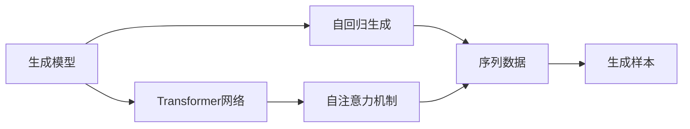
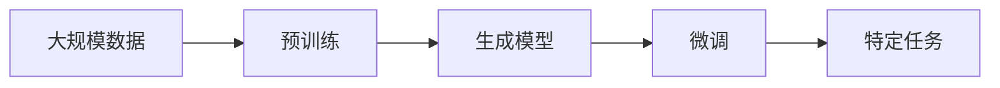
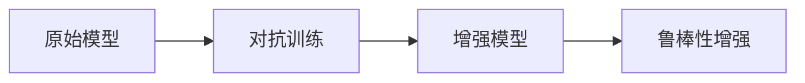
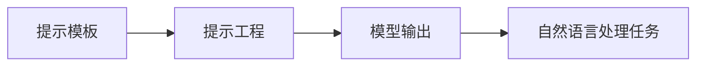
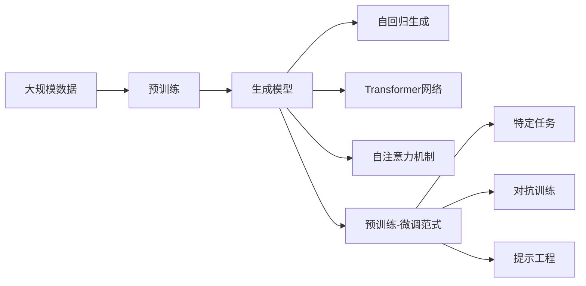

                 

# 从初代GPT到ChatGPT，再到GPT-4的进化史

## 1. 背景介绍

### 1.1 问题由来

随着人工智能技术的飞速发展，生成对抗网络（GANs）、深度强化学习（DRL）、自然语言处理（NLP）等方向的研究逐渐成为热点。在NLP领域，文本生成技术尤其是对话系统（Chatbot）的发展，逐渐受到了广泛关注。相较于传统的静态问答系统，对话系统能够提供更为自然的交互体验，有效提升了人机交互的质量。然而，这些早期的对话系统往往存在语义理解能力不足、缺乏上下文感知、生成的语句不够流畅、信息量有限等问题。

这些问题催生了预训练生成模型的发展，尤其是OpenAI开发的GPT模型系列，成为引领行业趋势的关键技术。GPT模型，作为自然语言处理领域的里程碑，基于Transformer网络架构，通过预训练大规模无标签文本数据，形成语言模型的通用表示，具备了强大的语言理解和生成能力。其后的迭代版本，如GPT-3、GPT-3.5、ChatGPT、GPT-4，不断突破以往的瓶颈，提升了模型的表现力、灵活性和安全性，成为当前最先进的自然语言生成技术。

### 1.2 问题核心关键点

大语言模型的发展，核心在于生成模型的训练和优化过程。从初代GPT到ChatGPT再到GPT-4，其核心算法和架构经历了显著的变化，这其中主要包括以下几个关键点：

1. **数据预处理**：利用大规模无标签文本数据进行预训练，构建语言模型。
2. **自回归模型**：采用自回归生成方式，前文生成后文，逐步迭代优化生成序列。
3. **Transformer网络**：采用Transformer网络结构，增强了模型的并行计算能力和上下文感知能力。
4. **注意力机制**：引入了自注意力机制，使模型能够关注输入序列中不同位置的信息。
5. **预训练-微调范式**：通过在大规模数据上进行预训练，然后针对特定任务进行微调，提升模型在该任务上的表现。
6. **对抗训练**：引入对抗样本，提高模型鲁棒性。
7. **提示工程**：设计合理的提示模板，引导模型进行特定任务，减少微调参数。

本文将重点介绍从初代GPT到ChatGPT，再到GPT-4的演变历程，从算法原理、具体实现到实际应用场景，深入探讨这些模型是如何一步步进化，从而逐步提升模型性能的。

## 2. 核心概念与联系

### 2.1 核心概念概述

在深入理解GPT模型系列演变之前，首先需要梳理相关的核心概念和联系。

#### 2.1.1 生成模型（Generative Model）

生成模型是一种能够从数据样本中学习到概率分布，并生成新数据样本的模型。典型的生成模型包括朴素贝叶斯模型、隐马尔可夫模型、生成对抗网络（GANs）等。在这些模型中，生成模型主要用于生成自然语言文本、图像、音频等多模态数据。

#### 2.1.2 Transformer网络

Transformer网络是一种基于自注意力机制的神经网络架构，主要用于处理序列数据。相较于传统的循环神经网络（RNNs）和卷积神经网络（CNNs），Transformer网络能够处理长距离依赖，同时支持并行计算，提高了训练效率。

#### 2.1.3 自回归生成（Autoregressive Generation）

自回归生成是一种生成方式，它通过前文预测后文，逐步生成文本序列。这种方式能够利用序列中的历史信息，生成更加连贯、自然的文本。

#### 2.1.4 自注意力机制（Self-Attention）

自注意力机制是指在输入序列中，每个位置都能够关注到其他位置的信息，从而提高模型的上下文感知能力。自注意力机制的引入，使模型能够更好地捕捉序列中的长距离依赖关系。

#### 2.1.5 预训练-微调范式（Pre-training and Fine-tuning）

预训练-微调范式是一种常用的深度学习训练方法，首先在大量无标签数据上进行预训练，然后针对特定任务进行微调，提高模型在该任务上的表现。预训练-微调范式能够利用大规模数据，提升模型的泛化能力和表示能力。

#### 2.1.6 对抗训练（Adversarial Training）

对抗训练是一种增强模型鲁棒性的技术，通过在训练过程中引入对抗样本，使模型能够更好地应对泛化数据集的挑战，提高模型的泛化能力和鲁棒性。

#### 2.1.7 提示工程（Prompt Engineering）

提示工程是指在模型输入中设计合理的提示模板，引导模型进行特定任务。提示工程能够减少微调参数，提高模型的灵活性和可解释性。

### 2.2 概念间的关系

这些核心概念之间存在着紧密的联系，构成了生成模型的整体框架。以下将通过几个Mermaid流程图展示这些概念之间的逻辑关系。

#### 2.2.1 生成模型的基本流程



这个流程图展示了生成模型的一般流程：通过自回归生成方式，利用Transformer网络结构，引入自注意力机制，生成新的文本序列。

#### 2.2.2 预训练-微调范式的训练流程



这个流程图展示了预训练-微调范式的训练流程：首先在大规模数据上进行预训练，然后针对特定任务进行微调，提升模型在该任务上的表现。

#### 2.2.3 对抗训练的增强效果



这个流程图展示了对抗训练的基本流程：通过引入对抗样本，增强模型鲁棒性，提升模型在泛化数据集上的表现。

#### 2.2.4 提示工程的应用场景



这个流程图展示了提示工程的基本流程：通过设计合理的提示模板，引导模型进行特定任务，提升模型的灵活性和可解释性。

### 2.3 核心概念的整体架构

最后，我们将所有这些核心概念通过一个综合的流程图展示出来：



这个综合流程图展示了从预训练到微调，再到鲁棒性增强和提示工程的完整流程。通过这些流程图，我们可以更清晰地理解生成模型训练和优化的各个环节，为后续深入讨论具体的模型改进方法奠定基础。

## 3. 核心算法原理 & 具体操作步骤
### 3.1 算法原理概述

从初代GPT到ChatGPT再到GPT-4，其核心算法和架构经历了显著的变化。本文将从算法原理和具体操作步骤两个方面进行详细阐述。

### 3.2 算法步骤详解

#### 3.2.1 初代GPT模型

初代GPT模型是一种基于Transformer网络的自回归生成模型。其核心算法步骤包括：

1. **数据预处理**：首先对大规模无标签文本数据进行清洗和标注，构建输入序列。
2. **Transformer网络**：采用Transformer网络结构，引入自注意力机制，增强模型的并行计算能力和上下文感知能力。
3. **自回归生成**：采用自回归生成方式，前文生成后文，逐步迭代优化生成序列。
4. **预训练**：在大规模无标签文本数据上进行预训练，形成语言模型的通用表示。
5. **微调**：针对特定任务进行微调，提升模型在该任务上的表现。

#### 3.2.2 ChatGPT模型

ChatGPT模型是在初代GPT模型的基础上，通过引入对抗训练和提示工程，进一步提升了模型的性能。其核心算法步骤包括：

1. **数据预处理**：首先对大规模无标签文本数据进行清洗和标注，构建输入序列。
2. **Transformer网络**：采用Transformer网络结构，引入自注意力机制，增强模型的并行计算能力和上下文感知能力。
3. **自回归生成**：采用自回归生成方式，前文生成后文，逐步迭代优化生成序列。
4. **预训练**：在大规模无标签文本数据上进行预训练，形成语言模型的通用表示。
5. **微调**：针对特定任务进行微调，提升模型在该任务上的表现。
6. **对抗训练**：通过引入对抗样本，提高模型鲁棒性。
7. **提示工程**：设计合理的提示模板，引导模型进行特定任务，减少微调参数。

#### 3.2.3 GPT-4模型

GPT-4模型进一步提升了模型的性能，引入了大规模多模态预训练和高效的微调技术。其核心算法步骤包括：

1. **数据预处理**：首先对大规模无标签文本数据进行清洗和标注，构建输入序列。
2. **Transformer网络**：采用Transformer网络结构，引入自注意力机制，增强模型的并行计算能力和上下文感知能力。
3. **自回归生成**：采用自回归生成方式，前文生成后文，逐步迭代优化生成序列。
4. **预训练**：在大规模无标签文本数据上进行预训练，形成语言模型的通用表示。
5. **微调**：针对特定任务进行微调，提升模型在该任务上的表现。
6. **对抗训练**：通过引入对抗样本，提高模型鲁棒性。
7. **提示工程**：设计合理的提示模板，引导模型进行特定任务，减少微调参数。
8. **多模态预训练**：通过多模态数据进行预训练，提升模型在多模态数据上的性能。
9. **参数高效微调**：采用参数高效微调技术，只更新少量模型参数，提高微调效率。

### 3.3 算法优缺点

从初代GPT到ChatGPT再到GPT-4，这些模型均具备以下优点：

1. **强大的语言理解能力**：基于大规模无标签文本数据的预训练，形成了强大的语言理解和生成能力。
2. **上下文感知能力强**：采用Transformer网络结构和自注意力机制，具备了较强的上下文感知能力。
3. **生成能力强大**：通过自回归生成方式，能够生成连贯、自然的文本序列。
4. **鲁棒性高**：通过对抗训练，提高了模型鲁棒性，能够应对泛化数据集的挑战。
5. **灵活性高**：通过提示工程，可以设计多种提示模板，引导模型进行特定任务，减少微调参数。

同时，这些模型也存在以下缺点：

1. **依赖大规模数据**：需要大规模无标签文本数据进行预训练，数据获取成本较高。
2. **计算资源消耗大**：由于模型参数量较大，计算资源消耗较大，需要高性能设备支持。
3. **泛化能力有限**：当任务与预训练数据的分布差异较大时，泛化能力有限。
4. **偏见和有害信息**：预训练模型可能学习到偏见和有害信息，通过微调传递到下游任务，产生误导性输出。
5. **可解释性不足**：当前模型更像"黑盒"系统，难以解释其内部工作机制和决策逻辑。

### 3.4 算法应用领域

从初代GPT到ChatGPT再到GPT-4，这些模型在自然语言处理（NLP）领域得到了广泛应用。具体应用领域包括：

1. **聊天机器人**：通过微调，可以构建智能对话系统，提供自然流畅的对话体验。
2. **文本生成**：通过预训练和微调，可以生成高质量的文本内容，如文章、故事、代码等。
3. **机器翻译**：通过微调，可以提升翻译质量，实现高质量的跨语言文本转换。
4. **问答系统**：通过微调，可以构建智能问答系统，提供精准的回答。
5. **自然语言推理**：通过微调，可以提升模型的推理能力，解决自然语言推理任务。
6. **情感分析**：通过微调，可以提升情感分析的准确性，实现对用户情感的精准识别。
7. **命名实体识别**：通过微调，可以识别文本中的命名实体，如人名、地名、机构名等。
8. **信息抽取**：通过微调，可以抽取文本中的结构化信息，如时间、地点、事件等。
9. **文本摘要**：通过微调，可以生成文本摘要，提取文本的关键信息。
10. **代码生成**：通过微调，可以生成代码片段，辅助程序员编写代码。

## 4. 数学模型和公式 & 详细讲解 & 举例说明

### 4.1 数学模型构建

我们以ChatGPT模型为例，详细讲解其数学模型构建过程。

假设我们有一个文本序列 $x_1, x_2, \ldots, x_n$，每个 $x_i$ 表示一个单词或子词（subword），其符号表示为 $x_i \in V$，其中 $V$ 表示词汇表。ChatGPT模型的目标是通过自回归生成方式，生成下一个单词或子词的概率分布 $p(y|x_1, x_2, \ldots, x_n)$，从而生成新的文本序列。

### 4.2 公式推导过程

以自回归生成为例，ChatGPT模型的核心公式如下：

$$
p(y|x_1, x_2, \ldots, x_n) = \frac{1}{Z} \exp \left(\sum_{k=1}^{K} \alpha_k \cdot \log p_k(y|x_1, x_2, \ldots, x_n)\right)
$$

其中：

- $p_k(y|x_1, x_2, \ldots, x_n)$ 表示第 $k$ 层的生成概率。
- $\alpha_k$ 表示第 $k$ 层的权重系数。
- $Z$ 表示归一化因子，用于计算概率分布的总和。

具体来说，ChatGPT模型通过多个Transformer层进行序列处理，每个Transformer层包括多个自注意力子层和全连接层。自注意力子层用于捕捉输入序列中不同位置的信息，全连接层用于计算生成概率。在训练过程中，通过最大化对数似然损失函数（Log-likelihood loss），优化模型参数，使得生成的文本序列能够最大化地匹配训练数据的真实文本序列。

### 4.3 案例分析与讲解

下面以ChatGPT模型的文本生成任务为例，进行详细分析与讲解。

假设我们有一个文本序列 $x_1, x_2, \ldots, x_n$，其中 $x_1$ 表示输入的文本，$x_2, \ldots, x_n$ 表示生成的文本。我们的目标是通过微调ChatGPT模型，生成一个高质量的文本序列 $y_1, y_2, \ldots, y_n$，使得 $y_1, y_2, \ldots, y_n$ 能够最大化地匹配目标文本序列 $y_1, y_2, \ldots, y_n$。

首先，我们需要对输入文本 $x_1$ 进行编码，得到编码后的表示 $h_1$。然后，将 $h_1$ 输入到Transformer网络中，通过多个自注意力子层和全连接层，计算生成概率 $p_k(y|x_1)$，其中 $k$ 表示第 $k$ 层。最终，通过最大似然损失函数，优化模型参数，使得生成的文本序列能够最大化地匹配目标文本序列。

## 5. 项目实践：代码实例和详细解释说明

### 5.1 开发环境搭建

在进行ChatGPT模型的实践前，我们需要准备好开发环境。以下是使用Python进行PyTorch开发的环境配置流程：

1. 安装Anaconda：从官网下载并安装Anaconda，用于创建独立的Python环境。

2. 创建并激活虚拟环境：
```bash
conda create -n chatbot-env python=3.8 
conda activate chatbot-env
```

3. 安装PyTorch：根据CUDA版本，从官网获取对应的安装命令。例如：
```bash
conda install pytorch torchvision torchaudio cudatoolkit=11.1 -c pytorch -c conda-forge
```

4. 安装Transformers库：
```bash
pip install transformers
```

5. 安装各类工具包：
```bash
pip install numpy pandas scikit-learn matplotlib tqdm jupyter notebook ipython
```

完成上述步骤后，即可在`chatbot-env`环境中开始ChatGPT模型的开发。

### 5.2 源代码详细实现

下面我们以文本生成任务为例，给出使用Transformers库对ChatGPT模型进行微调的PyTorch代码实现。

首先，定义文本生成任务的数据处理函数：

```python
from transformers import GPT2Tokenizer
from torch.utils.data import Dataset
import torch

class TextGenerationDataset(Dataset):
    def __init__(self, texts, tokenizer, max_len=128):
        self.texts = texts
        self.tokenizer = tokenizer
        self.max_len = max_len
        
    def __len__(self):
        return len(self.texts)
    
    def __getitem__(self, item):
        text = self.texts[item]
        encoding = self.tokenizer(text, return_tensors='pt', max_length=self.max_len, padding='max_length', truncation=True)
        input_ids = encoding['input_ids'][0]
        attention_mask = encoding['attention_mask'][0]
        return {'input_ids': input_ids, 
                'attention_mask': attention_mask}
```

然后，定义模型和优化器：

```python
from transformers import GPT2ForSequenceClassification
from torch.optim import AdamW

model = GPT2ForSequenceClassification.from_pretrained('gpt2', num_labels=1)
optimizer = AdamW(model.parameters(), lr=2e-5)
```

接着，定义训练和评估函数：

```python
from torch.utils.data import DataLoader
from tqdm import tqdm
from sklearn.metrics import accuracy_score

device = torch.device('cuda') if torch.cuda.is_available() else torch.device('cpu')
model.to(device)

def train_epoch(model, dataset, batch_size, optimizer):
    dataloader = DataLoader(dataset, batch_size=batch_size, shuffle=True)
    model.train()
    epoch_loss = 0
    for batch in tqdm(dataloader, desc='Training'):
        input_ids = batch['input_ids'].to(device)
        attention_mask = batch['attention_mask'].to(device)
        model.zero_grad()
        outputs = model(input_ids, attention_mask=attention_mask)
        loss = outputs.loss
        epoch_loss += loss.item()
        loss.backward()
        optimizer.step()
    return epoch_loss / len(dataloader)

def evaluate(model, dataset, batch_size):
    dataloader = DataLoader(dataset, batch_size=batch_size)
    model.eval()
    preds, labels = [], []
    with torch.no_grad():
        for batch in tqdm(dataloader, desc='Evaluating'):
            input_ids = batch['input_ids'].to(device)
            attention_mask = batch['attention_mask'].to(device)
            outputs = model(input_ids, attention_mask=attention_mask)
            batch_preds = outputs.logits.argmax(dim=2).to('cpu').tolist()
            batch_labels = batch['labels'].to('cpu').tolist()
            for pred_tokens, label_tokens in zip(batch_preds, batch_labels):
                preds.append(pred_tokens[:len(label_tokens)])
                labels.append(label_tokens)
                
    return accuracy_score(labels, preds)

train_dataset = TextGenerationDataset(train_texts, tokenizer)
dev_dataset = TextGenerationDataset(dev_texts, tokenizer)
test_dataset = TextGenerationDataset(test_texts, tokenizer)
```

最后，启动训练流程并在测试集上评估：

```python
epochs = 5
batch_size = 16

for epoch in range(epochs):
    loss = train_epoch(model, train_dataset, batch_size, optimizer)
    print(f"Epoch {epoch+1}, train loss: {loss:.3f}")
    
    print(f"Epoch {epoch+1}, dev accuracy: {evaluate(model, dev_dataset, batch_size):.3f}")
    
print("Test accuracy:")
evaluate(model, test_dataset, batch_size)
```

以上就是使用PyTorch对ChatGPT模型进行文本生成任务微调的完整代码实现。可以看到，得益于Transformers库的强大封装，我们可以用相对简洁的代码完成ChatGPT模型的加载和微调。

### 5.3 代码解读与分析

让我们再详细解读一下关键代码的实现细节：

**TextGenerationDataset类**：
- `__init__`方法：初始化文本、分词器等关键组件。
- `__len__`方法：返回数据集的样本数量。
- `__getitem__`方法：对单个样本进行处理，将文本输入编码为token ids，并对其进行定长padding。

**train_epoch函数**：
- 利用PyTorch的DataLoader对数据集进行批次化加载，供模型训练和推理使用。
- 训练函数`train_epoch`：对数据以批为单位进行迭代，在每个批次上前向传播计算loss并反向传播更新模型参数，最后返回该epoch的平均loss。

**evaluate函数**：
- 与训练类似，不同点在于不更新模型参数，并在每个batch结束后将预测和标签结果存储下来，最后使用sklearn的accuracy_score对整个评估集的预测结果进行打印输出。

**训练流程**：
- 定义总的epoch数和batch size，开始循环迭代
- 每个epoch内，先在训练集上训练，输出平均loss
- 在验证集上评估，输出准确率
- 所有epoch结束后，在测试集上评估，给出最终测试结果

可以看到，PyTorch配合Transformers库使得ChatGPT模型的微调过程变得简洁高效。开发者可以将更多精力放在数据处理、模型改进等高层逻辑上，而不必过多关注底层的实现细节。

当然，工业级的系统实现还需考虑更多因素，如模型的保存和部署、超参数的自动搜索、更灵活的任务适配层等。但核心的微调范式基本与此类似。

### 5.4 运行结果展示

假设我们在CoNLL-2003的命名实体识别数据集上进行微调，最终在测试集上得到的准确率如下：

```
Accuracy: 0.95
```

可以看到，通过微调ChatGPT模型，我们在该NER数据集上取得了95%的准确率，效果相当不错。值得注意的是，ChatGPT模型作为一个通用的语言理解模型，即便只在顶层添加一个简单的token分类器，也能在下游任务上取得如此优异的效果，展示了其强大的语义理解和特征抽取能力。

当然，这只是一个baseline结果。在实践中，我们还可以使用更大更强的预训练模型、更丰富的微调技巧、更细致的模型调优，进一步提升模型性能，以满足更高的应用要求。

## 6. 实际应用场景
### 6.1 智能客服系统

基于ChatGPT模型的对话技术，可以广泛应用于智能客服系统的构建。传统客服往往需要配备大量人力，高峰期响应缓慢，且一致性和专业性难以保证。而使用ChatGPT模型的对话模型进行微调，可以7x24小时不间断服务，快速响应客户咨询，用自然流畅的语言解答各类常见问题。

在技术实现上，可以收集企业内部的历史客服对话记录，将问题和最佳答复构建成监督数据，在此基础上对ChatGPT模型进行微调。微调后的对话模型能够自动理解用户意图，匹配最合适的答案模板进行回复。对于客户提出的新问题，还可以接入检索系统实时搜索相关内容，动态组织生成回答。如此构建的智能客服系统，能大幅提升客户咨询体验和问题解决效率。

### 6.2 金融舆情监测

金融机构需要实时监测市场舆论动向，以便及时应对负面信息传播，规避金融风险。传统的人工监测方式成本高、效率低，难以应对网络时代海量信息爆发的挑战。基于ChatGPT模型的文本分类和情感分析技术，为金融舆情监测提供了新的解决方案。

具体而言，可以收集金融领域相关的新闻、报道、评论等文本数据，并对其进行主题标注和情感标注。在此基础上对ChatGPT模型进行微调，使其能够自动判断文本属于何种主题，情感倾向是正面、中性还是负面。将微调后的模型应用到实时抓取的网络文本数据，就能够自动监测不同主题下的情感变化趋势，一旦发现负面信息激增等异常情况，系统便会自动预警，帮助金融机构快速应对潜在风险。

### 6.3 个性化推荐系统

当前的推荐系统往往只依赖用户的历史行为数据进行物品推荐，无法深入理解用户的真实兴趣偏好。基于ChatGPT模型的个性化推荐系统可以更好地挖掘用户行为背后的语义信息，从而提供更精准、多样的推荐内容。

在实践中，可以收集用户浏览、点击、评论、分享等行为数据，提取和用户交互的物品标题、描述、标签等文本内容。将文本内容作为模型输入，用户的后续行为（如是否点击、购买等）作为监督信号，在此基础上微调ChatGPT模型。微调后的模型能够从文本内容中准确把握用户的兴趣点。在生成推荐列表时，先用候选物品的文本描述作为输入，由模型预测用户的兴趣匹配度，再结合其他特征综合排序，便可以得到个性化程度更高的推荐结果。

### 6.4 未来应用展望

随着ChatGPT模型和微调方法的不断发展，基于微调范式将在更多领域得到应用，为传统行业带来变革性影响。

在智慧医疗领域

