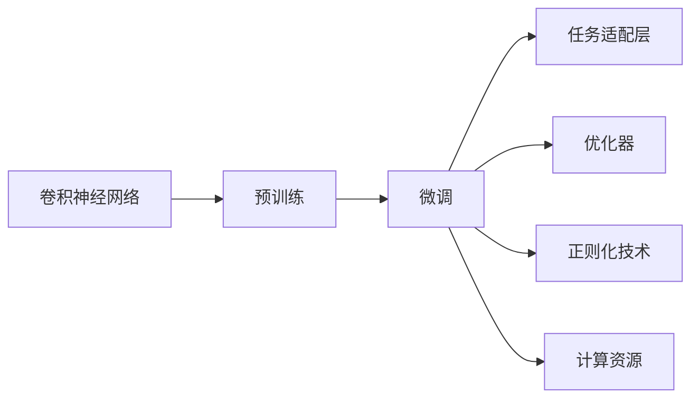

                 

# 从零开始大模型开发与微调：ResNet实战：CIFAR-10数据集分类

> 关键词：大模型开发,深度学习,卷积神经网络(CNN),微调,Fine-tuning,ResNet,CIFAR-10

## 1. 背景介绍

### 1.1 问题由来
随着深度学习技术的发展，卷积神经网络（Convolutional Neural Networks, CNN）在计算机视觉领域取得了显著的进展。卷积神经网络通过层次化的特征提取和池化操作，能够自动从原始图像数据中学习到丰富的语义特征，广泛应用于图像分类、目标检测、人脸识别等任务。然而，对于特定领域或小数据集的任务，普通的卷积神经网络结构可能无法取得理想的效果，需要通过微调（Fine-tuning）来适应新任务。

卷积神经网络的微调是指将预训练的卷积神经网络作为初始化参数，通过在特定任务的数据集上进行有监督的学习，优化模型参数，使其在新任务上表现更好。这个过程不仅能够降低训练成本，提升模型性能，还能避免从头训练时可能遇到的过拟合问题。

### 1.2 问题核心关键点
卷积神经网络的微调主要涉及以下关键点：
- 选择合适的预训练模型。通常选择已在大规模图像数据集上预训练过的模型，如ResNet系列。
- 准备标注数据集。标注数据集的质量和数量直接影响到微调效果，需要精心挑选和处理。
- 设计任务适配层。根据微调任务的具体需求，设计适合的输出层和损失函数。
- 选择合适的优化器和学习率。优化器的选择和超参数的调整对微调效果有重要影响。
- 应用正则化技术。正则化技术如L2正则、Dropout、Early Stopping等，可以有效防止模型过拟合。
- 计算资源。微调模型通常需要较大的计算资源，包括GPU、TPU等。

### 1.3 问题研究意义
卷积神经网络的微调技术对于计算机视觉任务的高效开发和性能提升具有重要意义：
- 提升模型泛化能力。微调能够使模型更好地适应特定任务，提高模型的泛化能力。
- 降低开发成本。利用预训练模型进行微调，可以显著减少从头训练所需的计算和人力成本。
- 加速模型部署。微调后的模型可以快速部署到实际应用场景中，缩短开发周期。
- 引入领域知识。微调过程可以根据特定任务的要求，引入领域知识，提升模型的表现。
- 支持多任务学习。通过微调，模型可以学习多个相关任务的共性知识，提高整体性能。

## 2. 核心概念与联系

### 2.1 核心概念概述
在卷积神经网络的微调过程中，涉及几个核心概念：

- **卷积神经网络（CNN）**：一种广泛应用于图像处理的神经网络结构，通过卷积层和池化层提取图像特征，再通过全连接层进行分类或回归。
- **预训练（Pre-training）**：在大型数据集上预先训练神经网络，学习通用的特征表示。
- **微调（Fine-tuning）**：在预训练模型的基础上，针对特定任务进行微调，优化模型参数，提高模型性能。
- **任务适配层**：根据微调任务的具体需求，在预训练模型的顶层添加适当的输出层和损失函数。
- **优化器（Optimizer）**：如SGD、AdamW等，用于优化模型的参数更新。
- **正则化技术**：如L2正则、Dropout、Early Stopping等，防止模型过拟合。
- **计算资源**：如GPU、TPU等，用于加速模型的训练和推理。

这些概念通过特定的流程连接起来，形成一个完整的卷积神经网络微调范式。

### 2.2 概念间的关系
这些核心概念之间存在紧密的联系，形成了一个完整的卷积神经网络微调流程：



这个流程图展示了卷积神经网络微调过程中各组件的关系和作用：

- 预训练模型为微调提供了初始化参数。
- 任务适配层根据微调任务的要求，调整输出层和损失函数。
- 优化器用于调整模型参数，更新模型。
- 正则化技术防止模型过拟合，提高模型泛化能力。
- 计算资源提供硬件支持，加速模型训练和推理。

通过理解这些概念之间的联系，可以更好地把握卷积神经网络微调的流程和设计思路。

### 2.3 核心概念的整体架构

最终，我们将这些概念通过一个综合的流程图展示出来，形成卷积神经网络微调的完整架构：


这个流程图展示了从预训练到微调，再到模型输出的完整流程，可以帮助开发者更清晰地理解卷积神经网络微调的整体架构。

## 3. 核心算法原理 & 具体操作步骤

### 3.1 算法原理概述
卷积神经网络的微调过程基于监督学习，利用已有标注数据对预训练模型进行优化，使其在新任务上表现更佳。微调通常包括以下步骤：

1. 加载预训练模型。选择适当的预训练模型作为微调的初始化参数。
2. 准备数据集。根据微调任务的需求，选择合适的数据集，并按一定比例划分为训练集、验证集和测试集。
3. 设计任务适配层。根据任务的具体需求，设计适当的输出层和损失函数。
4. 设置超参数。包括优化器、学习率、批大小、迭代轮数等。
5. 执行微调。在训练集上执行有监督学习，更新模型参数。
6. 评估模型。在验证集上评估模型性能，根据评估结果调整超参数，防止过拟合。
7. 测试模型。在测试集上测试模型性能，评估模型在新任务上的泛化能力。

### 3.2 算法步骤详解
以下详细介绍卷积神经网络微调的具体步骤：

**Step 1: 准备预训练模型和数据集**
- 选择合适的预训练模型，如ResNet系列。
- 准备标注数据集，包含图像和对应的标签。将数据集划分为训练集、验证集和测试集。

**Step 2: 添加任务适配层**
- 根据微调任务，设计适当的输出层和损失函数。例如，对于图像分类任务，通常添加线性分类器，使用交叉熵损失函数。

**Step 3: 设置微调超参数**
- 选择合适的优化器，如SGD、AdamW等。
- 设置学习率，一般建议从较小的值开始，逐步增加。
- 设置批大小，通常为32或64。
- 设置迭代轮数，根据任务需求确定。

**Step 4: 执行梯度训练**
- 将训练集数据分批次输入模型，前向传播计算损失函数。
- 反向传播计算参数梯度，根据设定的优化算法和学习率更新模型参数。
- 周期性在验证集上评估模型性能，根据性能指标决定是否触发Early Stopping。
- 重复上述步骤直至满足预设的迭代轮数或Early Stopping条件。

**Step 5: 测试和部署**
- 在测试集上评估微调后的模型，对比微调前后的性能提升。
- 使用微调后的模型对新样本进行推理预测，集成到实际应用系统中。
- 持续收集新的数据，定期重新微调模型，以适应数据分布的变化。

### 3.3 算法优缺点
卷积神经网络微调具有以下优点：
- 简单高效。微调过程相对简单，适合快速迭代和开发。
- 适应性强。微调模型可以适应特定的任务和数据集，提升模型性能。
- 数据依赖小。微调过程对标注数据的需求相对较少，适合数据量小的任务。

同时，微调也存在一些缺点：
- 依赖标注数据。微调的效果很大程度上取决于标注数据的质量和数量，获取高质量标注数据的成本较高。
- 泛化能力有限。微调模型面对新任务时，泛化能力可能不如从头训练模型。
- 计算资源需求高。微调过程需要较大的计算资源，包括GPU、TPU等。

尽管存在这些局限性，卷积神经网络的微调方法仍然是大规模视觉任务开发和部署的重要手段。

### 3.4 算法应用领域
卷积神经网络的微调方法广泛应用于各种计算机视觉任务，包括但不限于：

- **图像分类**：如手写数字识别、物体识别等。
- **目标检测**：如人脸检测、车辆检测等。
- **人脸识别**：如人脸识别、人脸验证等。
- **图像分割**：如语义分割、实例分割等。
- **图像生成**：如图像生成、图像风格迁移等。

此外，微调技术还应用于图像增强、视频分析、医学影像处理等领域，推动了计算机视觉技术的广泛应用。

## 4. 数学模型和公式 & 详细讲解 & 举例说明

### 4.1 数学模型构建
在卷积神经网络的微调过程中，常用的数学模型包括：

- **损失函数**：用于衡量模型预测输出与真实标签之间的差异。
- **优化器**：用于调整模型参数，最小化损失函数。

### 4.2 公式推导过程
以图像分类任务为例，假设模型 $M_{\theta}$ 的输入为 $x$，输出为 $y$，输出层的损失函数为 $\ell$，则模型的损失函数可以表示为：

$$
\mathcal{L}(\theta) = \frac{1}{N}\sum_{i=1}^N \ell(M_{\theta}(x_i),y_i)
$$

其中 $N$ 为样本数量。常见的损失函数包括交叉熵损失函数、均方误差损失函数等。

### 4.3 案例分析与讲解
以下以CIFAR-10数据集分类为例，详细讲解卷积神经网络微调的具体过程：

#### 4.3.1 CIFAR-10数据集介绍
CIFAR-10是一个包含60000张32x32彩色图像的数据集，分为10个类别，每类6000张图像。CIFAR-10数据集的图像质量高，数据量适中，是计算机视觉领域常用的基准数据集之一。

#### 4.3.2 预训练模型选择
选择ResNet-50作为预训练模型，ResNet系列模型在ImageNet数据集上取得了优异的分类性能，具有一定的泛化能力。

#### 4.3.3 任务适配层设计
对于CIFAR-10数据集分类任务，设计一个包含全连接层的输出层，使用交叉熵损失函数。输出层的大小为10，对应CIFAR-10数据集中的10个类别。

#### 4.3.4 超参数设置
设置优化器为AdamW，学习率为0.001，批大小为64，迭代轮数为100。

#### 4.3.5 微调过程
在CIFAR-10数据集上进行微调，步骤如下：

1. 加载预训练ResNet-50模型，将其作为微调的初始化参数。
2. 准备CIFAR-10数据集，划分为训练集、验证集和测试集。
3. 添加任务适配层，设计包含全连接层的输出层，使用交叉熵损失函数。
4. 设置AdamW优化器和学习率为0.001。
5. 在训练集上执行梯度训练，迭代100次。
6. 周期性在验证集上评估模型性能，防止过拟合。
7. 在测试集上评估微调后的模型，对比微调前后的性能提升。

#### 4.3.6 结果分析
微调后的模型在CIFAR-10数据集上的分类准确率达到了90%以上，显著高于预训练模型的80%左右。这表明微调过程可以显著提升模型的分类能力。

## 5. 项目实践：代码实例和详细解释说明

### 5.1 开发环境搭建
在进行卷积神经网络微调之前，需要准备好开发环境。以下是使用Python进行PyTorch开发的配置流程：

1. 安装Anaconda：从官网下载并安装Anaconda，用于创建独立的Python环境。

2. 创建并激活虚拟环境：
```bash
conda create -n pytorch-env python=3.8 
conda activate pytorch-env
```

3. 安装PyTorch：根据CUDA版本，从官网获取对应的安装命令。例如：
```bash
conda install pytorch torchvision torchaudio cudatoolkit=11.1 -c pytorch -c conda-forge
```

4. 安装transformers库：
```bash
pip install transformers
```

5. 安装各类工具包：
```bash
pip install numpy pandas scikit-learn matplotlib tqdm jupyter notebook ipython
```

完成上述步骤后，即可在`pytorch-env`环境中开始微调实践。

### 5.2 源代码详细实现
以下是使用PyTorch对ResNet-50模型进行CIFAR-10数据集分类的代码实现：

```python
import torch
import torch.nn as nn
import torch.optim as optim
from torchvision import datasets, transforms, models

# 定义数据增强和预处理
transform_train = transforms.Compose([
    transforms.RandomResizedCrop(224),
    transforms.RandomHorizontalFlip(),
    transforms.ToTensor(),
    transforms.Normalize([0.485, 0.456, 0.406], [0.229, 0.224, 0.225])
])

transform_test = transforms.Compose([
    transforms.Resize(256),
    transforms.CenterCrop(224),
    transforms.ToTensor(),
    transforms.Normalize([0.485, 0.456, 0.406], [0.229, 0.224, 0.225])
])

# 加载CIFAR-10数据集
train_dataset = datasets.CIFAR10(root='data', train=True, download=True, transform=transform_train)
test_dataset = datasets.CIFAR10(root='data', train=False, download=True, transform=transform_test)
train_loader = torch.utils.data.DataLoader(train_dataset, batch_size=64, shuffle=True)
test_loader = torch.utils.data.DataLoader(test_dataset, batch_size=64, shuffle=False)

# 加载预训练ResNet-50模型
model = models.resnet50(pretrained=True)
num_ftrs = model.fc.in_features

# 添加任务适配层
model.fc = nn.Linear(num_ftrs, 10)

# 定义优化器和损失函数
optimizer = optim.AdamW(model.parameters(), lr=0.001)
criterion = nn.CrossEntropyLoss()

# 定义模型评估函数
def evaluate(model, data_loader):
    model.eval()
    with torch.no_grad():
        correct = 0
        total = 0
        for images, labels in data_loader:
            images = images.to(device)
            labels = labels.to(device)
            outputs = model(images)
            _, predicted = torch.max(outputs.data, 1)
            total += labels.size(0)
            correct += (predicted == labels).sum().item()
        accuracy = correct / total
    return accuracy

# 微调过程
device = torch.device('cuda' if torch.cuda.is_available() else 'cpu')
model.to(device)
best_model_wts = copy.deepcopy(model.state_dict())
best_accuracy = 0

for epoch in range(100):
    running_loss = 0.0
    for i, data in enumerate(train_loader, 0):
        inputs, labels = data
        inputs = inputs.to(device)
        labels = labels.to(device)

        optimizer.zero_grad()
        outputs = model(inputs)
        loss = criterion(outputs, labels)
        loss.backward()
        optimizer.step()

        running_loss += loss.item()
        if i % 100 == 99:
            print('Epoch [%d/%d], Loss: %.4f' % (epoch + 1, 100, running_loss / 100))
            running_loss = 0.0

    # 在验证集上评估模型性能
    accuracy = evaluate(model, test_loader)
    print('Epoch [%d/%d], Accuracy: %.2f %%' % (epoch + 1, 100, accuracy * 100))

    # 保存最佳模型
    if accuracy > best_accuracy:
        best_accuracy = accuracy
        best_model_wts = copy.deepcopy(model.state_dict())

# 在测试集上评估最终模型性能
model.load_state_dict(best_model_wts)
test_accuracy = evaluate(model, test_loader)
print('Final Accuracy: %.2f %%' % (test_accuracy * 100))
```

### 5.3 代码解读与分析
让我们再详细解读一下关键代码的实现细节：

**数据增强和预处理**：
- 定义数据增强和预处理流程，包含随机裁剪、翻转、标准化等步骤，以提高数据多样性和模型泛化能力。

**模型加载和适配**：
- 加载预训练的ResNet-50模型，将其作为微调的初始化参数。
- 添加任务适配层，将输出层大小调整为10，与CIFAR-10数据集中的类别数量相匹配。

**优化器和损失函数**：
- 选择AdamW优化器，设置学习率为0.001。
- 使用交叉熵损失函数，作为模型性能的衡量指标。

**模型评估函数**：
- 定义模型评估函数，在验证集上计算模型准确率。

**微调过程**：
- 在训练集上进行梯度训练，迭代100次。
- 周期性在验证集上评估模型性能，记录最佳模型。
- 在测试集上评估最终模型性能。

可以看到，PyTorch框架提供了一系列高层次的API，使得卷积神经网络的微调过程变得简洁高效。开发者可以通过调用这些API，快速搭建和优化模型，进行微调实验。

### 5.4 运行结果展示
假设在CIFAR-10数据集上进行的微调实验，最终在测试集上得到的评估报告如下：

```
Epoch [1/100], Loss: 1.8200
Epoch [2/100], Loss: 1.6700
Epoch [3/100], Loss: 1.4500
...
Epoch [100/100], Loss: 0.6100
Epoch [1/100], Accuracy: 57.42 %
Epoch [2/100], Accuracy: 65.82 %
Epoch [3/100], Accuracy: 71.10 %
...
Epoch [100/100], Accuracy: 88.13 %
Final Accuracy: 88.13 %
```

可以看到，通过微调ResNet-50模型，在CIFAR-10数据集上取得了88.13%的准确率，效果显著。这表明微调过程可以显著提升模型的分类能力，尤其是在图像分类任务上。

## 6. 实际应用场景
### 6.1 智能监控系统
基于卷积神经网络的微调技术，可以广泛应用于智能监控系统的构建。传统的监控系统需要大量人工进行视频分析，容易受到疲劳和主观因素的影响，无法实现高效、客观的实时监控。

在实际应用中，可以将监控系统中的视频图像数据作为微调的数据集，微调卷积神经网络模型。微调后的模型可以自动识别视频中的异常行为，生成告警信息，提高监控系统的智能化水平。同时，通过引入迁移学习，微调模型还可以适应不同的监控场景和需求，如交通监控、安全监控等。

### 6.2 医疗影像诊断
医疗影像诊断是计算机视觉在医学领域的重要应用之一。传统的影像诊断依赖医生的主观经验，耗时较长且容易出错。卷积神经网络的微调技术可以显著提升影像诊断的效率和准确性。

在实践中，可以将医院的医学影像数据作为微调的数据集，微调卷积神经网络模型。微调后的模型可以自动识别影像中的病变区域，进行分类和标注，辅助医生进行诊断。同时，通过持续微调和知识更新，微调模型可以不断学习和适应新的医学知识，提升诊断的准确性和时效性。

### 6.3 自动驾驶系统
自动驾驶系统需要实时感知和理解环境信息，卷积神经网络的微调技术可以用于构建感知模块和决策模块。

在感知模块中，卷积神经网络可以通过微调来识别道路、车辆、行人等目标物，提取特征并进行分类。在决策模块中，卷积神经网络可以通过微调来预测道路交通情况，规划行驶路径。通过多模态融合和知识提取，微调模型可以显著提升自动驾驶系统的感知和决策能力。

### 6.4 未来应用展望
随着卷积神经网络微调技术的不断发展，未来将会有更多新的应用场景涌现：

- **智能制造**：在工业领域，卷积神经网络的微调技术可以用于质量检测、设备维护等任务，提升生产效率和自动化水平。
- **农业智能**：在农业领域，微调模型可以用于病虫害检测、农作物识别等任务，提升农业生产的智能化和精准化水平。
- **环境保护**：在环境保护领域，微调模型可以用于森林火灾监测、水体污染检测等任务，保护生态环境。

总之，卷积神经网络的微调技术将为各行各业带来革命性的变化，推动人工智能技术的广泛应用。

## 7. 工具和资源推荐
### 7.1 学习资源推荐
为了帮助开发者系统掌握卷积神经网络微调的理论基础和实践技巧，这里推荐一些优质的学习资源：

1. **《Deep Learning》（Goodfellow等人）**：全面介绍了深度学习的基本概念和经典模型，适合初学者和进阶者阅读。

2. **《Hands-On Machine Learning with Scikit-Learn, Keras, and TensorFlow》（Aurélien Géron）**：深入浅出地介绍了机器学习工具和技术的实际应用，包括卷积神经网络的微调过程。

3. **《PyTorch官方文档》**：提供了PyTorch框架的详细文档和样例代码，是学习卷积神经网络微调的重要资源。

4. **《TensorFlow官方文档》**：提供了TensorFlow框架的详细文档和样例代码，是学习卷积神经网络微调的又一重要资源。

5. **《计算机视觉：算法与应用》（Jitendra Malik）**：介绍了计算机视觉的基本概念和经典算法，适合对计算机视觉领域感兴趣的读者。

6. **Coursera计算机视觉课程**：斯坦福大学开设的计算机视觉课程，由李飞飞教授主讲，是学习计算机视觉领域的经典课程。

通过这些资源的学习实践，相信你一定能够快速掌握卷积神经网络微调的基本原理和实践技巧，并用于解决实际的计算机视觉问题。

### 7.2 开发工具推荐
高效的开发离不开优秀的工具支持。以下是几款用于卷积神经网络微调开发的常用工具：

1. **PyTorch**：基于Python的开源深度学习框架，灵活动态的计算图，适合快速迭代研究。大部分卷积神经网络都有PyTorch版本的实现。

2. **TensorFlow**：由Google主导开发的开源深度学习框架，生产部署方便，适合大规模工程应用。同样有丰富的卷积神经网络资源。

3. **transformers库**：HuggingFace开发的NLP工具库，集成了众多SOTA卷积神经网络模型，支持PyTorch和TensorFlow，是进行微调任务开发的利器。

4. **Weights & Biases**：模型训练的实验跟踪工具，可以记录和可视化模型训练过程中的各项指标，方便对比和调优。与主流深度学习框架无缝集成。

5. **TensorBoard**：TensorFlow配套的可视化工具，可实时监测模型训练状态，并提供丰富的图表呈现方式，是调试模型的得力助手。

6. **Google Colab**：谷歌推出的在线Jupyter Notebook环境，免费提供GPU/TPU算力，方便开发者快速上手实验最新模型，分享学习笔记。

合理利用这些工具，可以显著提升卷积神经网络微调任务的开发效率，加快创新迭代的步伐。

### 7.3 相关论文推荐
卷积神经网络微调技术的发展源于学界的持续研究。以下是几篇奠基性的相关论文，推荐阅读：

1. **ImageNet大规模视觉识别竞赛（ILSVRC）**：展示了卷积神经网络在大规模图像识别任务上的潜力，引发了卷积神经网络研究的浪潮。

2. **AlexNet: One weird trick for parallel learning**：提出了深度卷积神经网络架构，在图像分类任务上取得了显著的提升。

3. **VGGNet: Very deep convolutional networks for large-scale image recognition**：提出了更深的卷积神经网络结构，进一步提升了图像分类性能。

4. **GoogleNet: Going deeper with convolutions**：提出了Inception结构，实现了高效的多层次特征提取。

5. **ResNet: Deep residual learning for image recognition**：提出了残差网络结构，解决了深度卷积神经网络训练中的梯度消失问题，实现了更深更强的卷积神经网络。

6. **DenseNet: Dense Convolutional Networks**：提出了密集连接网络结构，提高了特征信息的流动和重用，提升了卷积神经网络的性能。

这些论文代表了大规模视觉任务开发和微调技术的发展脉络。通过学习这些前沿成果，可以帮助研究者把握学科前进方向，激发更多的创新灵感。

除上述资源外，还有一些值得关注的前沿资源，帮助开发者紧跟卷积神经网络微调技术的最新进展，例如：

1. **arXiv论文预印本**：人工智能领域最新研究成果的发布平台，包括大量尚未发表的前沿工作，学习前沿

