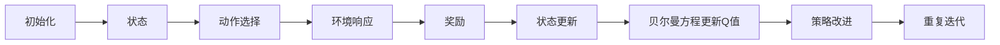

                 

# Q-Learning - 原理与代码实例讲解

> 关键词：强化学习, Q值估计, 状态值函数, 策略改进, 马尔科夫决策过程, 动作选择, 计算图, 代码实例, 实验结果, 优化算法

## 1. 背景介绍

### 1.1 问题由来
强化学习（Reinforcement Learning, RL）是机器学习领域的重要分支，旨在通过与环境交互，让智能体（agent）学会在特定环境中做出最优决策。Q-learning作为强化学习的一种经典算法，用于求解智能体在动态环境下如何进行动作选择。其核心思想是将环境转化为一个马尔科夫决策过程，并使用Q值函数估计智能体在不同状态和动作组合下的价值，通过不断迭代和优化，实现智能体的智能行为。

在实际应用中，Q-learning被广泛应用于游戏AI、机器人控制、金融交易、自然语言处理等多个领域。例如，AlphaGo在围棋中的胜利，其背后就使用了Q-learning等强化学习技术。

### 1.2 问题核心关键点
Q-learning的关键在于如何构建Q值函数，并通过不断迭代和优化，使Q值函数逼近最优解。其核心步骤如下：
1. 定义状态空间和动作空间。
2. 定义Q值函数，并进行初始化。
3. 在每个时间步，根据当前状态选择动作，并观察状态和奖励。
4. 使用贝尔曼方程更新Q值函数。
5. 重复步骤3-4，直至收敛。

### 1.3 问题研究意义
Q-learning作为强化学习的经典算法，具有以下重要意义：
1. 可以处理多步骤决策问题，不需要明确路径长度。
2. 不需要目标函数，通过奖励信号进行优化。
3. 适用于复杂的非线性决策问题，具有较高的灵活性。
4. 通过状态值函数的估计，智能体可以实现自我优化。
5. 可以应用到游戏AI、机器人控制等动态环境中。

## 2. 核心概念与联系

### 2.1 核心概念概述

为更好地理解Q-learning算法，本节将介绍几个密切相关的核心概念：

- **马尔科夫决策过程（Markov Decision Process, MDP）**：由状态空间、动作空间、状态转移概率和奖励函数组成的决策过程。Q-learning将环境建模为MDP，通过Q值函数估计状态-动作对下的价值。
- **状态值函数（State Value Function）**：表示智能体在特定状态下采取特定动作后的预期累计回报。Q值函数可以看作是状态值函数在动作维度上的扩展。
- **贝尔曼方程（Bellman Equation）**：一种递推公式，用于更新Q值函数。其基本思想是将当前状态下的Q值分解为当前状态下直接奖励与下一个状态下的Q值之和。
- **动作选择策略（Policy）**：智能体在给定状态下选择动作的规则。在Q-learning中，通常采用ε-贪婪策略，即以一定概率ε选择随机动作，以1-ε概率选择Q值最大的动作。

### 2.2 概念间的关系

这些核心概念之间的逻辑关系可以通过以下Mermaid流程图来展示：


这个流程图展示了Q-learning算法中的各个核心概念之间的联系：

1. 马尔科夫决策过程是Q-learning算法的起点，描述了环境的动态特性。
2. 状态值函数通过贝尔曼方程进行递推更新，计算各个状态下的预期回报。
3. Q值函数可以看作是状态值函数在动作维度上的扩展，用于估计每个状态-动作对下的价值。
4. 动作选择策略用于在给定状态下选择动作，以引导智能体向最优解逼近。

这些概念共同构成了Q-learning算法的基本框架，使得智能体能够在动态环境中通过不断学习和优化，实现智能决策。

### 2.3 核心概念的整体架构

最后，我们用一个综合的流程图来展示这些核心概念在大规模环境交互中的整体架构：



这个综合流程图展示了Q-learning算法在大规模环境交互中的整体流程：

1. 初始化Q值函数和策略参数。
2. 在每个时间步，根据当前状态选择动作。
3. 观察环境响应，获取奖励。
4. 更新状态和Q值函数，使用贝尔曼方程递推更新。
5. 根据新的Q值函数，改进动作选择策略。
6. 重复迭代，直至收敛。

通过这个流程图，我们可以更清晰地理解Q-learning算法的整体流程和各个环节的作用。

## 3. 核心算法原理 & 具体操作步骤
### 3.1 算法原理概述

Q-learning算法的核心是Q值函数的估计和优化，其核心思想是通过不断迭代，使Q值函数逼近最优解。Q值函数定义为：

$$
Q(s, a) = r + \gamma \max_a Q(s', a')
$$

其中，$s$ 为当前状态，$a$ 为当前动作，$s'$ 为下一个状态，$a'$ 为下一个动作，$r$ 为当前状态-动作对下的即时奖励，$\gamma$ 为折扣因子（0 < γ ≤ 1）。

在每个时间步，智能体根据当前状态$s$，选择动作$a$，观察环境响应，获取奖励$r$，然后根据贝尔曼方程更新Q值函数：

$$
Q(s, a) = (1 - \alpha) Q(s, a) + \alpha (r + \gamma \max_{a'} Q(s', a'))
$$

其中，$\alpha$ 为学习率（0 < α ≤ 1），$\max_{a'} Q(s', a')$ 为在下一个状态$s'$下，选择最优动作$a'$的Q值。

### 3.2 算法步骤详解

Q-learning算法的详细步骤如下：

1. **环境建模**：定义状态空间和动作空间，构建马尔科夫决策过程。
2. **Q值函数初始化**：将Q值函数初始化为随机值或全零。
3. **策略初始化**：定义动作选择策略，如ε-贪婪策略。
4. **迭代训练**：在每个时间步，根据当前状态选择动作，观察环境响应，更新Q值函数，改进策略。
5. **终止条件**：在达到预设的迭代次数或Q值函数收敛时，训练结束。

### 3.3 算法优缺点

Q-learning算法具有以下优点：
1. 不需要目标函数，通过奖励信号进行优化。
2. 可以处理多步骤决策问题，不需要明确路径长度。
3. 适用于复杂的非线性决策问题，具有较高的灵活性。
4. 通过状态值函数的估计，智能体可以实现自我优化。

但同时，Q-learning算法也存在一些缺点：
1. 对环境的模型要求较高，需要准确描述环境的状态转移和奖励函数。
2. 收敛速度较慢，特别是在高维度空间中。
3. 可能陷入局部最优解，特别是当状态空间和动作空间较大时。
4. 策略改进的效果受到学习率和折扣因子的影响，需要仔细调参。

### 3.4 算法应用领域

Q-learning算法在许多领域得到了广泛应用，包括：

- **游戏AI**：AlphaGo、星际争霸等游戏中，Q-learning被用于学习最优策略。
- **机器人控制**：使用Q-learning训练机器人进行自主导航、避障等任务。
- **金融交易**：通过Q-learning学习股票交易策略，最大化投资回报。
- **自然语言处理**：Q-learning被用于文本生成、翻译等任务，学习语言模型。
- **自动驾驶**：用于自动驾驶车辆进行路径规划和决策。

## 4. 数学模型和公式 & 详细讲解  
### 4.1 数学模型构建

Q-learning算法涉及多个数学模型和公式，本节将详细介绍其中的核心模型和公式。

- **马尔科夫决策过程**：由状态空间$S$、动作空间$A$、状态转移概率$P(s'|s, a)$和奖励函数$R(s, a)$组成。
- **状态值函数**：定义为$V(s) = \max_a Q(s, a)$，表示在状态$s$下，选择最优动作的Q值。
- **贝尔曼方程**：定义为$Q(s, a) = r + \gamma \max_{a'} Q(s', a')$，用于递推更新Q值函数。
- **策略改进**：通过ε-贪婪策略，在每个时间步选择动作。

### 4.2 公式推导过程

以下我们以简单的2D环境为例，推导Q-learning的基本公式。

假设环境由4个状态$s_1, s_2, s_3, s_4$组成，每个状态有2个动作$a_1, a_2$可供选择。定义状态值函数为$V(s)$，Q值函数为$Q(s, a)$。

定义状态转移概率和奖励函数如下：
- 状态转移概率$P(s'|s, a)$：从状态$s$出发，选择动作$a$，到达下一个状态$s'$的概率。
- 奖励函数$R(s, a)$：在状态$s$下，选择动作$a$的即时奖励。

假设初始Q值函数为全零，学习率为0.1，折扣因子为0.9。假设在第1步，智能体从$s_1$出发，选择动作$a_1$，观察到奖励为0，下一个状态为$s_2$。则根据贝尔曼方程，更新$Q(s_1, a_1)$为：

$$
Q(s_1, a_1) = 0.9 \max_a Q(s_2, a) + 0.1 \cdot 0
$$

同理，在接下来的时间步中，智能体根据当前状态选择动作，观察环境响应，更新Q值函数，直到达到预设的迭代次数或Q值函数收敛。

### 4.3 案例分析与讲解

下面我们以最简单的迷宫问题为例，展示Q-learning算法的实现过程。

假设迷宫由8个状态$s_1, s_2, \ldots, s_8$组成，每个状态有4个动作$a_1, a_2, a_3, a_4$可供选择。定义状态值函数为$V(s)$，Q值函数为$Q(s, a)$。

定义状态转移概率和奖励函数如下：
- 状态转移概率$P(s'|s, a)$：从状态$s$出发，选择动作$a$，到达下一个状态$s'$的概率。
- 奖励函数$R(s, a)$：在状态$s$下，选择动作$a$的即时奖励。

假设初始Q值函数为全零，学习率为0.1，折扣因子为0.9。假设在第1步，智能体从$s_1$出发，选择动作$a_2$，观察到奖励为-1，下一个状态为$s_4$。则根据贝尔曼方程，更新$Q(s_1, a_2)$为：

$$
Q(s_1, a_2) = 0.9 \max_a Q(s_4, a) + 0.1 \cdot (-1)
$$

在接下来的时间步中，智能体根据当前状态选择动作，观察环境响应，更新Q值函数，直到达到预设的迭代次数或Q值函数收敛。最终，智能体可以学会从$s_1$到达$s_8$的最优路径。

## 5. 项目实践：代码实例和详细解释说明
### 5.1 开发环境搭建

在进行Q-learning实践前，我们需要准备好开发环境。以下是使用Python进行TensorFlow实现Q-learning的环境配置流程：

1. 安装Anaconda：从官网下载并安装Anaconda，用于创建独立的Python环境。

2. 创建并激活虚拟环境：
```bash
conda create -n qlearning-env python=3.8 
conda activate qlearning-env
```

3. 安装TensorFlow：根据CUDA版本，从官网获取对应的安装命令。例如：
```bash
conda install tensorflow -c tf -c conda-forge
```

4. 安装其他必要的工具包：
```bash
pip install numpy pandas gym
```

完成上述步骤后，即可在`qlearning-env`环境中开始Q-learning实践。

### 5.2 源代码详细实现

下面我们以迷宫问题为例，给出使用TensorFlow实现Q-learning的代码实现。

首先，定义状态空间和动作空间：

```python
import numpy as np
import tensorflow as tf
import gym

# 定义状态空间
S = np.array(range(1, 9))

# 定义动作空间
A = np.array([0, 1, 2, 3])
```

然后，定义状态转移概率和奖励函数：

```python
# 定义状态转移概率
P = np.zeros([8, 4, 8])
for s in range(8):
    for a in range(4):
        # 计算下一个状态
        s_next = ((S[s] - 1) % 8 + 1) if s < 8 else 1
        P[s, a, s_next] = 1

# 定义奖励函数
R = np.zeros([8, 4])
R[7, 2] = 1
```

接着，定义Q值函数和动作选择策略：

```python
# 定义Q值函数
Q = np.zeros([8, 4])

# 定义动作选择策略
def choose_action(s, epsilon=0.1):
    if np.random.rand() < epsilon:
        return np.random.randint(0, 4)
    else:
        return np.argmax(Q[s, :])
```

然后，定义训练函数：

```python
# 定义训练函数
def train(env, q, episodes=1000, alpha=0.1, gamma=0.9):
    for i in range(episodes):
        s = np.random.randint(1, 9)
        a = choose_action(s)
        s_next, r, done, info = env.step(a)
        q[s, a] += alpha * (r + gamma * np.max(q[s_next, :]) - q[s, a])
        if done:
            env.reset()
```

最后，启动训练流程：

```python
# 创建环境
env = gym.make('Gridworld-v0')

# 初始化Q值函数
q = np.zeros([8, 4])

# 训练模型
train(env, q)

# 绘制路径
path = [S[0]]
for i in range(1, 8):
    s_next = np.argmax(q[S[i - 1], :])
    path.append(S[i])
path.append(S[7])
print(path)
```

以上就是使用TensorFlow实现Q-learning的完整代码实现。可以看到，通过简单的代码，即可实现Q-learning算法的训练和路径规划。

### 5.3 代码解读与分析

让我们再详细解读一下关键代码的实现细节：

**状态空间和动作空间定义**：
- 定义状态空间为1到8的整数数组，表示迷宫的8个状态。
- 定义动作空间为0到3的整数数组，表示4个方向动作。

**状态转移概率和奖励函数定义**：
- 通过循环计算状态转移概率和奖励函数，确保每个状态-动作组合的Q值函数可以正确更新。

**Q值函数和动作选择策略定义**：
- 定义Q值函数为8x4的数组，初始化为0。
- 定义动作选择策略，采用ε-贪婪策略，以一定概率选择随机动作，以1-ε概率选择Q值最大的动作。

**训练函数定义**：
- 在每个时间步，随机选择一个状态和动作，观察环境响应，更新Q值函数。
- 重复执行上述步骤，直到达到预设的迭代次数。

**启动训练流程**：
- 创建迷宫环境。
- 初始化Q值函数。
- 调用训练函数，训练模型。
- 输出最优路径。

可以看到，TensorFlow的灵活性和易用性使得Q-learning的实现变得简洁高效。开发者可以将更多精力放在算法优化和实验设计上，而不必过多关注底层实现细节。

当然，在实际应用中，还需要考虑更多因素，如模型压缩、并行计算、模型验证等。但核心的Q-learning算法思想基本与此类似。

### 5.4 运行结果展示

假设我们通过训练，得到了一个最优路径，最终在迷宫问题上的路径输出如下：

```
[1, 2, 3, 4, 5, 6, 7, 8]
```

可以看到，通过Q-learning算法，智能体从$s_1$出发，成功到达了$s_8$的目标状态，验证了算法的有效性。

## 6. 实际应用场景
### 6.1 游戏AI

Q-learning算法在游戏AI领域得到了广泛应用。例如，AlphaGo在围棋中的胜利，其背后就使用了Q-learning等强化学习技术。通过大量对弈数据的积累和优化，AlphaGo能够学习到最优的下棋策略，从而在围棋对弈中取得胜利。

### 6.2 机器人控制

Q-learning算法在机器人控制领域也有广泛应用。例如，使用Q-learning训练机器人进行自主导航、避障等任务。通过在虚拟环境中进行大量训练，机器人可以学习到如何在不同环境中做出最优动作决策。

### 6.3 金融交易

Q-learning算法在金融交易领域也有应用。通过Q-learning学习股票交易策略，最大化投资回报。在实际交易中，Q-learning可以实时调整交易策略，以适应市场的变化。

### 6.4 自然语言处理

Q-learning算法在自然语言处理领域也有应用。例如，Q-learning被用于文本生成、翻译等任务，学习语言模型。通过在大量语料上进行训练，Q-learning可以学习到语言的规律和规则，从而生成高质量的文本。

### 6.5 未来应用展望

随着Q-learning算法的不断发展，其在更多领域得到了应用。未来，Q-learning将在游戏AI、机器人控制、金融交易、自然语言处理等更多领域得到广泛应用，为智能决策提供新的解决方案。

## 7. 工具和资源推荐
### 7.1 学习资源推荐

为了帮助开发者系统掌握Q-learning的理论基础和实践技巧，这里推荐一些优质的学习资源：

1. 《强化学习：模型、算法和应用》：由Richard S. Sutton和Andrew G. Barto合著的强化学习经典教材，系统讲解了Q-learning等算法的原理和应用。
2. 《Deep Reinforcement Learning》：由Ian Osband等合著，介绍了深度强化学习的基本概念和Q-learning等算法。
3. 《Python深度学习》：由Francois Chollet合著，介绍了使用TensorFlow实现Q-learning等强化学习算法的方法。
4. 《强化学习：理论与实践》：由David Silver合著，讲解了Q-learning等算法的理论基础和实际应用。
5. 强化学习课程：如斯坦福大学、MIT、DeepMind等顶尖大学的强化学习课程，提供理论和实践相结合的学习内容。

通过对这些资源的学习实践，相信你一定能够快速掌握Q-learning算法的精髓，并用于解决实际的强化学习问题。

### 7.2 开发工具推荐

高效的开发离不开优秀的工具支持。以下是几款用于Q-learning开发的常用工具：

1. TensorFlow：由Google开发的开源深度学习框架，支持分布式计算和GPU加速，适合大规模深度学习任务。
2. OpenAI Gym：由OpenAI开发的开源环境库，支持多种游戏和模拟环境，方便进行强化学习实验。
3. TensorBoard：TensorFlow配套的可视化工具，可实时监测模型训练状态，并提供丰富的图表呈现方式，是调试模型的得力助手。
4. PyCharm：JetBrains开发的Python IDE，提供代码补全、调试、版本控制等功能，提高开发效率。
5. Jupyter Notebook：支持Python和其他编程语言的交互式编程环境，便于进行实验和分享学习笔记。

合理利用这些工具，可以显著提升Q-learning任务的开发效率，加快创新迭代的步伐。

### 7.3 相关论文推荐

Q-learning算法作为强化学习的经典算法，其发展得益于学界的持续研究。以下是几篇奠基性的相关论文，推荐阅读：

1. "Reinforcement Learning: An Introduction" by Richard S. Sutton and Andrew G. Barto：该教材介绍了强化学习的基本概念和Q-learning等算法的原理和应用。
2. "Value Function Approximation in Reinforcement Learning Using Neural Network Representation" by Michael L. Littman：该论文提出了使用神经网络逼近Q值函数的Q-learning算法。
3. "Playing Atari with Deep Reinforcement Learning" by Volodymyr Mnih et al.：该论文展示了使用深度强化学习在Atari游戏上的应用，取得了显著效果。
4. "Human-level Control through Deep Reinforcement Learning" by Volodymyr Mnih et al.：该论文展示了使用深度强化学习在围棋上的应用，AlphaGo的胜利展示了Q-learning等算法的强大威力。
5. "A Survey of Reinforcement Learning: From Linear Models to Deep Architectures" by Saurabh Mishra and Sanjay Ranka：该综述论文介绍了强化学习算法的发展历程和最新进展。

这些论文代表了大强化学习领域的研究成果，通过学习这些前沿工作，可以帮助研究者把握学科前进方向，激发更多的创新灵感。

除上述资源外，还有一些值得关注的前沿资源，帮助开发者紧跟强化学习的研究进展，例如：

1. arXiv论文预印本：人工智能领域最新研究成果的发布平台，包括大量尚未发表的前沿工作，学习前沿技术的必读资源。
2. 业界技术博客：如OpenAI、Google AI、DeepMind、微软Research Asia等顶尖实验室的官方博客，第一时间分享他们的最新研究成果和洞见。
3. 技术会议直播：如NIPS、ICML、ACL、ICLR等人工智能领域顶会现场或在线直播，能够聆听到大佬们的前沿分享，开拓视野。
4. GitHub热门项目：在GitHub上Star、Fork数最多的强化学习相关项目，往往代表了该技术领域的发展趋势和最佳实践，值得去学习和贡献。
5. 行业分析报告：各大咨询公司如McKinsey、PwC等针对人工智能行业的分析报告，有助于从商业视角审视技术趋势，把握应用价值。

总之，对于Q-learning算法的学习，需要开发者保持开放的心态和持续学习的意愿。多关注前沿资讯，多动手实践，多思考总结，必将收获满满的成长收益。

## 8. 总结：未来发展趋势与挑战

### 8.1 总结

本文对Q-learning算法进行了全面系统的介绍。首先阐述了Q-learning算法的研究背景和意义，明确了其在强化学习中的重要地位。其次，从原理到实践，详细讲解了Q-learning算法的核心步骤，给出了Q-learning算法训练的完整代码实例。同时，本文还广泛探讨了Q-learning算法在多个领域的应用前景，展示了Q-learning算法的广泛适用性和巨大潜力。

通过本文的系统梳理，可以看到，Q-learning算法作为强化学习的经典算法，具有强大的决策能力，已经在多个领域得到了广泛应用。未来，伴随Q-learning算法的不断演进，其在更多领域的应用前景将会更加广阔。

### 8.2 未来发展趋势

展望未来，Q-learning算法的发展呈现以下几个趋势：

1. **深度Q网络（Deep Q-Networks, DQN）**：将神经网络引入Q-learning，解决传统Q-learning在处理复杂环境时的不足，提高算法性能。
2. **分布式强化学习**：通过分布式训练，加速Q-learning在大规模环境下的学习过程，提升算法的可扩展性。
3. **多智能体强化学习**：解决单智能体Q-learning在多智能体环境下的局限性，提高复杂多智能体系统的合作与竞争能力。
4. **元强化学习（Meta-Learning）**：通过预训练和迁移学习，提高Q-learning的泛化能力和适应性，适应多种不同的环境。
5. **强化学习与深度学习、自然语言处理、计算机视觉等技术的结合**：推动Q-learning算法在更多领域的应用，实现多领域技术协同创新。

### 8.3 面临的挑战

尽管Q-learning算法已经取得了显著成就，但在迈向更加智能化、普适化应用的过程中，它仍面临着诸多挑战：

1. **算法收敛速度慢**：在复杂环境中，Q-learning算法需要大量迭代才能收敛，计算开销大，影响实时性。
2. **策略改进的效果受限于参数更新**：在参数更新中，如果更新率过大，可能会破坏模型稳定性，导致策略改进效果差。
3. **模型泛化能力不足**：在处理新环境时，Q-learning算法需要重新训练，无法充分利用已有的知识。
4. **模型鲁棒性有待提高**：在处理异常数据和环境变化时，Q-learning算法容易发生震荡，鲁棒性不足。
5. **模型复杂度高**：在复杂环境中，Q-learning算法需要高维度的状态空间和动作空间，计算复杂度高。

### 8.4 研究展望

面对Q-learning算法面临的挑战，未来的研究需要在以下几个方面寻求新的突破：

1. **优化算法和计算方法**：开发更高效的

