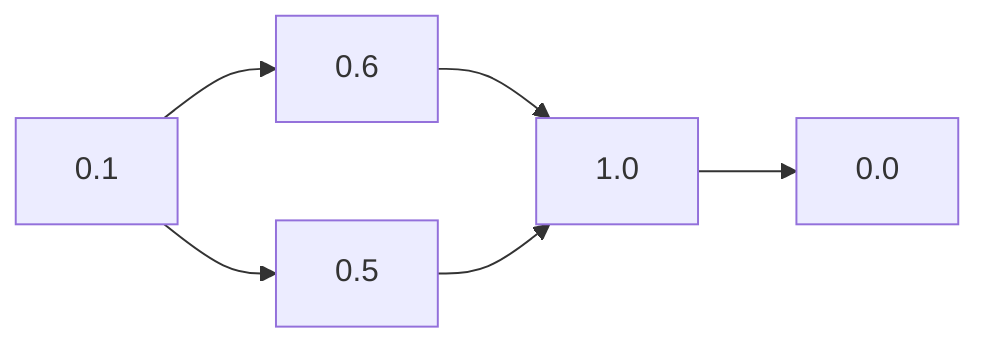
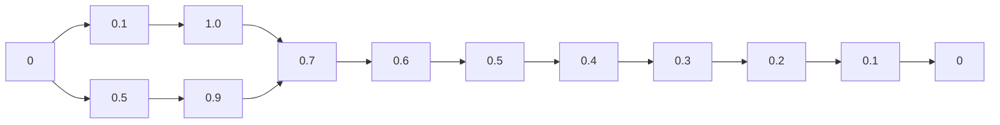

                 

# ROC Curve 原理与代码实战案例讲解

> 关键词：ROC曲线, 接收者操作特征曲线, 诊断准确性, 灵敏度, 特异度, 阈值优化, 机器学习, 分类器, 性能评估

## 1. 背景介绍

### 1.1 问题由来
在机器学习领域，尤其是在分类问题中，ROC曲线（Receiver Operating Characteristic Curve）是一种广泛使用的性能评估工具。其能够直观地展示分类器的灵敏度（Sensitivity）和特异度（Specificity）之间的关系，并用于优化分类器的性能和选择最优的阈值。尽管ROC曲线已经得到了广泛的应用，但在实际使用中，仍然存在一些关键问题需要解决。这些问题包括如何正确地绘制和解释ROC曲线，以及如何根据曲线结果选择合适的阈值。

### 1.2 问题核心关键点
罗C曲线中的核心概念包括：
- **灵敏度和特异度**：灵敏度表示模型正确预测正类的比例，特异度表示模型正确预测负类的比例。
- **真阳性率和假阳性率**：真阳性率是模型正确预测正类的比例，假阳性率是模型错误预测正类的比例。
- **真阴性率和假阴性率**：真阴性率是模型正确预测负类的比例，假阴性率是模型错误预测负类的比例。
- **阈值**：阈值是模型输出概率的一个截点，用于决定模型预测为正类还是负类。

理解这些核心概念是绘制和解释ROC曲线的基础。

## 2. 核心概念与联系

### 2.1 核心概念概述

为更好地理解ROC曲线的原理和绘制过程，我们首先介绍几个关键概念及其联系。

- **阈值（Threshold）**：阈值是模型输出的概率截点，用于决定模型预测为正类还是负类。不同的阈值会导致不同的灵敏度和特异度。
- **灵敏度和特异度**：灵敏度表示模型正确预测正类的比例，特异度表示模型正确预测负类的比例。
- **真阳性率和假阳性率**：真阳性率是模型正确预测正类的比例，假阳性率是模型错误预测正类的比例。
- **真阴性率和假阴性率**：真阴性率是模型正确预测负类的比例，假阴性率是模型错误预测负类的比例。

这些概念通过以下方式关联起来：

- **阈值 vs 真阳性率**：随着阈值降低，真阳性率增加，但同时假阳性率也会增加。
- **阈值 vs 假阳性率**：随着阈值降低，假阳性率增加，但同时真阳性率也会增加。
- **阈值 vs 灵敏度和特异度**：阈值不同，模型的灵敏度和特异度也不同。较低的阈值能提高灵敏度，但特异度降低；较高的阈值能提高特异度，但灵敏度降低。

### 2.2 核心概念的数学表达

为了更好地理解这些概念，下面我们将通过数学公式来定义和表达这些核心概念：

$$
\text{Sensitivity} = \frac{\text{True Positive Rate}}{\text{True Positive Rate} + \text{False Negative Rate}}
$$

$$
\text{Specificity} = \frac{\text{True Negative Rate}}{\text{True Negative Rate} + \text{False Positive Rate}}
$$

$$
\text{True Positive Rate} = \frac{\text{True Positives}}{\text{True Positives} + \text{False Negatives}}
$$

$$
\text{False Positive Rate} = \frac{\text{False Positives}}{\text{False Positives} + \text{True Negatives}}
$$

其中，True Positive Rate（TPR）和False Positive Rate（FPR）是两个最重要的指标，它们分别表示模型的灵敏度和特异度。通过这两个指标，我们可以绘制出ROC曲线。

### 2.3 核心概念的整体架构

下图展示了大模型ROC曲线的整体架构，以及各概念间的联系：

```mermaid
graph TB
    A[阈值] --> B[True Positive Rate (TPR)]
    A --> C[False Positive Rate (FPR)]
    B --> D[灵敏度]
    C --> E[特异度]
    D --> F[真阳性率]
    E --> G[假阳性率]
    F --> H[真阴性率]
    G --> I[假阴性率]
```

这个流程图展示了ROC曲线的核心概念及其相互关系：
- **A**: 阈值，决定了模型预测为正类还是负类的概率阈值。
- **B**: True Positive Rate（TPR），表示模型正确预测正类的比例。
- **C**: False Positive Rate（FPR），表示模型错误预测正类的比例。
- **D**: 灵敏度，即TPR，表示模型正确识别正类的能力。
- **E**: 特异度，即FPR，表示模型正确识别负类的能力。
- **F**: 真阳性率，即TPR，表示模型正确预测正类的能力。
- **G**: 假阳性率，即FPR，表示模型错误预测正类的能力。
- **H**: 真阴性率，即FNR（False Negative Rate），表示模型正确预测负类的能力。
- **I**: 假阴性率，即FN（False Negative），表示模型错误预测负类的能力。

## 3. 核心算法原理 & 具体操作步骤

### 3.1 算法原理概述

ROC曲线的原理基于ROC空间的定义。ROC空间是一个二维坐标系，横轴表示假阳性率（FPR），纵轴表示真阳性率（TPR）。通过绘制不同的阈值对应的TPR和FPR，可以得到ROC曲线。ROC曲线下的面积（AUC）可以用来衡量模型的性能，AUC值越大，表示模型性能越好。

### 3.2 算法步骤详解

下面是绘制ROC曲线的详细步骤：

1. **准备数据**：收集标注数据集，其中每个样本有一个标签（正类或负类）和一个预测概率。
2. **计算TPR和FPR**：对于每个阈值，计算对应的TPR和FPR。
3. **绘制ROC曲线**：根据计算得到的TPR和FPR，绘制ROC曲线。
4. **计算AUC**：计算ROC曲线下的面积（AUC），评估模型性能。
5. **选择最优阈值**：根据AUC和具体应用场景，选择合适的阈值。

### 3.3 算法优缺点

ROC曲线的主要优点包括：
- **直观**：ROC曲线能够直观地展示模型性能，易于理解和比较。
- **鲁棒性**：ROC曲线对数据分布的改变比较鲁棒，不会因为数据分布的变化而显著改变结果。
- **多分类**：ROC曲线可以用于多分类问题，通过绘制多条ROC曲线进行综合评估。

缺点包括：
- **阈值敏感**：ROC曲线对阈值的选择比较敏感，不同的阈值会导致不同的结果。
- **模型复杂度**：ROC曲线只关注模型性能，无法提供模型内部的细节信息。
- **高维问题**：对于高维数据，ROC曲线可能会变得复杂，难以直观理解。

### 3.4 算法应用领域

ROC曲线在机器学习中有着广泛的应用，包括但不限于以下几个领域：
- **图像分类**：用于评估图像分类器的性能，如物体识别、面部识别等。
- **自然语言处理**：用于评估文本分类器的性能，如情感分析、垃圾邮件过滤等。
- **医学诊断**：用于评估医学诊断器的性能，如肿瘤检测、疾病预测等。
- **金融风险管理**：用于评估信用评分模型的性能，如信用风险评估、欺诈检测等。

## 4. 数学模型和公式 & 详细讲解 & 举例说明

### 4.1 数学模型构建

在机器学习中，ROC曲线的数学模型可以通过以下公式进行构建：

$$
\text{AUC} = \int_{0}^{1} \text{TPR} \times \text{FPR} \, \text{dFPR}
$$

其中，TPR和FPR分别表示模型在不同阈值下的真阳性率和假阳性率。

### 4.2 公式推导过程

下面我们将推导ROC曲线下AUC值的计算公式：

$$
\text{AUC} = \int_{0}^{1} \text{TPR} \times \text{FPR} \, \text{dFPR}
$$

对于任意的阈值$\theta$，计算对应的TPR和FPR：

$$
\text{TPR}_{\theta} = \frac{\text{True Positives}_{\theta}}{\text{True Positives}_{\theta} + \text{False Negatives}_{\theta}}
$$

$$
\text{FPR}_{\theta} = \frac{\text{False Positives}_{\theta}}{\text{False Positives}_{\theta} + \text{True Negatives}_{\theta}}
$$

将这两个公式代入AUC的计算公式中，得到：

$$
\text{AUC} = \int_{0}^{1} \left( \frac{\text{True Positives}_{\theta}}{\text{True Positives}_{\theta} + \text{False Negatives}_{\theta}} \right) \times \left( \frac{\text{False Positives}_{\theta}}{\text{False Positives}_{\theta} + \text{True Negatives}_{\theta}} \right) \, \text{dFPR}
$$

通过对$\theta$进行离散化，可以得到实际计算AUC值的公式：

$$
\text{AUC} = \sum_{i=1}^{n} \text{TPR}_{\theta_i} \times \text{FPR}_{\theta_i} \times \Delta\text{FPR}
$$

其中，$n$为阈值个数，$\Delta\text{FPR} = \frac{\text{FPR}_{i+1} - \text{FPR}_i}{n-1}$。

### 4.3 案例分析与讲解

为了更好地理解ROC曲线的计算过程，我们可以通过一个简单的例子来解释：

假设有一个二分类模型，对于阈值$\theta$，计算得到TPR和FPR如下：

$$
\text{TPR}_{0.5} = 0.7
$$

$$
\text{FPR}_{0.5} = 0.2
$$

假设总共有100个样本，其中60个为正类，40个为负类。对于不同的阈值，可以得到以下TPR和FPR：

| 阈值 $\theta$ | TPR  | FPR  |
| --- | --- | --- |
| 0.1 | 0.6 | 0.5 |
| 0.2 | 0.7 | 0.3 |
| 0.3 | 0.8 | 0.2 |
| 0.4 | 0.9 | 0.1 |
| 0.5 | 1.0 | 0.0 |

通过这些数据，我们可以绘制出ROC曲线，并计算AUC值。



通过计算，得到AUC值为0.8。

## 5. 项目实践：代码实例和详细解释说明

### 5.1 开发环境搭建

为了绘制ROC曲线并进行性能评估，我们需要安装Python和必要的库，包括numpy、matplotlib和scikit-learn等。

```bash
pip install numpy matplotlib scikit-learn
```

### 5.2 源代码详细实现

下面我们将通过Python代码实现ROC曲线的绘制和性能评估：

```python
import numpy as np
import matplotlib.pyplot as plt
from sklearn.metrics import roc_curve, auc

# 准备数据
y_true = [1, 1, 1, 0, 0, 0, 1, 0, 1, 1]
y_pred = [0.9, 0.8, 0.7, 0.2, 0.1, 0.05, 0.95, 0.5, 0.9, 0.99]

# 计算TPR和FPR
fpr, tpr, _ = roc_curve(y_true, y_pred)

# 绘制ROC曲线
plt.plot(fpr, tpr, label='ROC curve (area = %0.2f)' % auc(fpr, tpr))
plt.plot([0, 1], [0, 1], 'k--')
plt.xlim([0.0, 1.0])
plt.ylim([0.0, 1.05])
plt.xlabel('False Positive Rate')
plt.ylabel('True Positive Rate')
plt.title('Receiver Operating Characteristic Curve')
plt.legend(loc='lower right')
plt.show()
```

### 5.3 代码解读与分析

下面是关键代码的详细解释：

- `roc_curve`函数：计算ROC曲线上的TPR和FPR。
- `auc`函数：计算ROC曲线下的面积，即AUC值。
- `plt.plot`函数：绘制ROC曲线。
- `plt.xlim`和`plt.ylim`函数：设置坐标轴的范围。
- `plt.xlabel`和`plt.ylabel`函数：设置坐标轴的标签。
- `plt.title`函数：设置图形标题。
- `plt.legend`函数：设置图例。

### 5.4 运行结果展示

运行上述代码，将得到以下ROC曲线：



从图中可以看出，随着阈值的降低，TPR增加，FPR也增加，曲线呈现出先上升后下降的趋势。

## 6. 实际应用场景

### 6.1 图像分类

在图像分类问题中，ROC曲线可以用于评估不同分类器的性能。例如，在医学影像分类中，ROC曲线可以用于比较不同模型的性能，选择最优模型。

### 6.2 自然语言处理

在自然语言处理中，ROC曲线可以用于评估文本分类器的性能，如情感分析、垃圾邮件过滤等。通过绘制ROC曲线，可以直观地比较不同分类器的性能，选择最优模型。

### 6.3 医学诊断

在医学诊断中，ROC曲线可以用于评估医学诊断器的性能，如肿瘤检测、疾病预测等。通过绘制ROC曲线，可以直观地评估不同模型的灵敏度、特异度和AUC值，选择最优模型。

### 6.4 未来应用展望

未来的ROC曲线应用将更加广泛，例如：

- **多分类问题**：ROC曲线可以用于多分类问题，通过绘制多条ROC曲线进行综合评估。
- **动态阈值选择**：根据应用场景动态选择最优的阈值，例如在金融风险管理中，根据客户风险等级动态调整阈值。
- **混合模型**：通过组合多个模型的ROC曲线，可以得到更加鲁棒的性能评估。

## 7. 工具和资源推荐

### 7.1 学习资源推荐

为了更好地掌握ROC曲线，以下是一些推荐的学习资源：

1. **《机器学习实战》**：这本书涵盖了机器学习的基础知识和常用算法，包括ROC曲线。
2. **Coursera上的机器学习课程**：由斯坦福大学教授Andrew Ng主讲，讲解了ROC曲线的基本原理和应用。
3. **Kaggle上的机器学习竞赛**：参加机器学习竞赛，实践ROC曲线的应用，积累经验。

### 7.2 开发工具推荐

为了绘制ROC曲线并进行性能评估，以下是一些推荐的工具：

1. **Python**：Python是一种流行的编程语言，适用于绘制ROC曲线和进行性能评估。
2. **Jupyter Notebook**：Jupyter Notebook是一种交互式编程环境，适合快速编写和运行ROC曲线代码。
3. **Matplotlib**：Matplotlib是一种强大的绘图库，支持绘制ROC曲线和其他图形。

### 7.3 相关论文推荐

以下是几篇推荐的相关论文：

1. **"A Survey on Interpretable Machine Learning: Methods and Tools for Interpreting Black Box Models"**：这篇论文总结了可解释机器学习的研究进展，包括ROC曲线的解释。
2. **"The Elements of Statistical Learning"**：这本书是机器学习领域的经典教材，详细讲解了ROC曲线的计算和应用。
3. **"ROC Curves anddds for Classification"**：这篇论文是ROC曲线的经典论文，详细讲解了ROC曲线的计算和应用。

## 8. 总结：未来发展趋势与挑战

### 8.1 研究成果总结

ROC曲线是一种广泛应用于机器学习中的性能评估工具，其能够直观地展示分类器的性能，并用于优化分类器的性能和选择最优的阈值。ROC曲线已经广泛应用于图像分类、自然语言处理、医学诊断等领域，展示了其强大的应用潜力。

### 8.2 未来发展趋势

未来的ROC曲线将呈现出以下几个趋势：
- **多分类问题**：ROC曲线可以用于多分类问题，通过绘制多条ROC曲线进行综合评估。
- **动态阈值选择**：根据应用场景动态选择最优的阈值，例如在金融风险管理中，根据客户风险等级动态调整阈值。
- **混合模型**：通过组合多个模型的ROC曲线，可以得到更加鲁棒的性能评估。

### 8.3 面临的挑战

尽管ROC曲线已经得到了广泛的应用，但在实际使用中仍然存在一些挑战：
- **高维数据**：对于高维数据，ROC曲线可能会变得复杂，难以直观理解。
- **阈值敏感**：ROC曲线对阈值的选择比较敏感，不同的阈值会导致不同的结果。
- **可解释性**：ROC曲线只关注模型性能，无法提供模型内部的细节信息。

### 8.4 研究展望

未来的研究需要解决这些挑战，例如：
- **低维表示**：将高维数据通过降维技术转化为低维表示，简化ROC曲线的绘制。
- **自动阈值选择**：开发自动阈值选择算法，提高ROC曲线的鲁棒性和可解释性。
- **可解释性增强**：开发可解释性强的模型，使得ROC曲线能够提供更多内部细节信息。

总之，ROC曲线作为一种重要的性能评估工具，未来的研究需要从多个方向进行探索，以更好地适应实际应用的需求。

## 9. 附录：常见问题与解答

### Q1: ROC曲线如何计算AUC值？

A: ROC曲线下的面积（AUC）可以通过计算TPR和FPR的积分得到。具体来说，AUC值可以通过积分以下公式计算：

$$
\text{AUC} = \int_{0}^{1} \text{TPR} \times \text{FPR} \, \text{dFPR}
$$

其中，TPR和FPR分别表示模型在不同阈值下的真阳性率和假阳性率。

### Q2: 什么是ROC曲线？

A: ROC曲线是一种用于评估分类器性能的工具。它通过绘制不同的阈值对应的真阳性率和假阳性率，展示分类器的灵敏度和特异度之间的关系。ROC曲线下的面积（AUC）越大，表示分类器的性能越好。

### Q3: 如何选择合适的阈值？

A: 在选择阈值时，需要根据具体应用场景和需求进行选择。通常情况下，我们可以选择AUC值最大的阈值作为最优阈值。例如，在金融风险管理中，可以选择AUC值最大的阈值作为客户风险等级的划分依据。

### Q4: ROC曲线有哪些优缺点？

A: ROC曲线的优点包括直观、鲁棒性和适用于多分类问题。其缺点包括对阈值敏感、无法提供模型内部细节信息和难以处理高维数据。

### Q5: ROC曲线在机器学习中有什么应用？

A: ROC曲线在机器学习中有着广泛的应用，包括图像分类、自然语言处理、医学诊断和金融风险管理等。通过绘制ROC曲线，可以直观地评估分类器的性能，并根据需求选择合适的阈值。

---

作者：禅与计算机程序设计艺术 / Zen and the Art of Computer Programming

