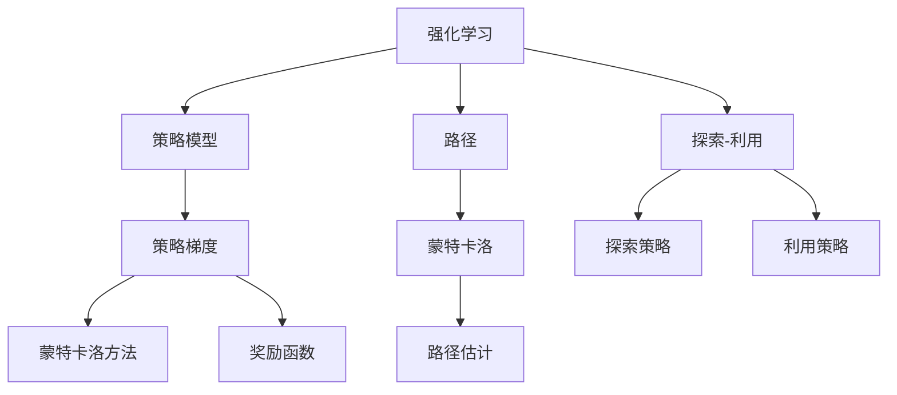
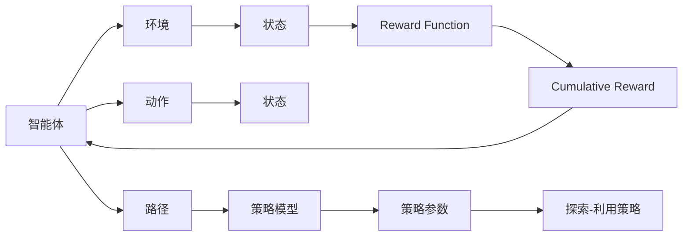
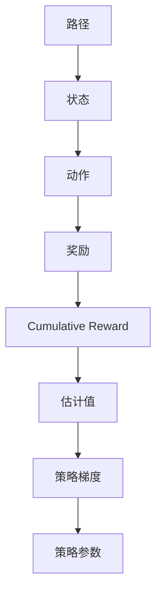
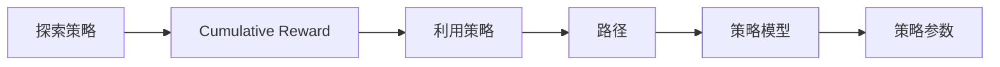

                 

## 1. 背景介绍

### 1.1 问题由来

策略梯度（Policy Gradient）算法是强化学习（Reinforcement Learning, RL）中的一种重要方法，用于训练策略模型，使得模型能够最大化累积奖励（cumulative reward）。该算法最早由William J. Williams和Daniel P. Bernstein在1994年提出，并在1998年由Richard S. Sutton和Alec J. J. Barto等人进一步发展，奠定了其在RL领域的核心地位。

策略梯度算法的应用非常广泛，包括机器人控制、自动驾驶、游戏AI、经济预测等多个领域。其核心思想是利用梯度上升方法，通过不断调整策略参数，优化策略模型，以最大化长期的累积奖励。

### 1.2 问题核心关键点

策略梯度算法的核心在于：
1. 确定一个奖励函数（Reward Function），用于评估策略模型的性能。
2. 利用梯度上升方法，更新策略参数，以最大化累积奖励。
3. 采用蒙特卡洛（Monte Carlo）或基于值的估计方法，估计梯度。
4. 结合探索-利用（Exploration-Exploitation）策略，平衡模型对已知策略的利用和对未知策略的探索。

策略梯度算法具有以下几个优点：
1. 直接优化策略参数，无需显式求解值函数。
2. 不需要存储环境状态信息，仅需存储路径信息。
3. 能够处理非凸的奖励函数和复杂的策略空间。
4. 算法简单，易于实现和理解。

策略梯度算法也存在一些局限性：
1. 计算梯度时需要采样大量的路径，因此需要较长的训练时间。
2. 受样本复杂度影响较大，对样本分布的假设可能会导致收敛困难。
3. 在非凸环境中，算法可能陷入局部最优解。

尽管存在这些局限性，策略梯度算法仍是强化学习领域中的经典方法，其理论基础和实践效果都被广泛认可和应用。

### 1.3 问题研究意义

策略梯度算法的研究意义在于：
1. 提供了直接优化策略模型的方法，为强化学习提供了全新的视角。
2. 能够处理连续动作空间和复杂策略空间，拓展了强化学习的应用范围。
3. 通过样本复杂度和奖励函数的设计，提供了更为灵活和高效的优化策略。
4. 在多智能体系统、合作学习等场景中，策略梯度算法具有重要应用价值。

## 2. 核心概念与联系

### 2.1 核心概念概述

为更好地理解策略梯度算法，本节将介绍几个密切相关的核心概念：

- 强化学习（Reinforcement Learning, RL）：一种通过试错学习策略，使得智能体（agent）在环境中最大化累积奖励的学习范式。强化学习的核心是策略（policy），即在给定状态下，选择动作的概率分布。
- 策略模型（Policy Model）：用于估计策略的概率分布模型，通过学习最优策略，使智能体能够获得最大的累积奖励。
- 奖励函数（Reward Function）：用于评估智能体在环境中的行为表现，指导智能体的探索和学习。
- 路径（Path）：从初始状态到终止状态的序列，包含了一系列的动作和对应的状态变化。
- 蒙特卡洛（Monte Carlo）方法：一种随机采样方法，通过大量路径的统计平均，估计策略的梯度。
- 策略梯度（Policy Gradient）：用于优化策略模型的梯度，使得模型能够最大化累积奖励。
- 探索-利用（Exploration-Exploitation）策略：在智能体学习过程中，平衡对已知策略的利用和对未知策略的探索。

这些核心概念之间的逻辑关系可以通过以下Mermaid流程图来展示：



这个流程图展示了一些关键概念之间的关系：

1. 强化学习中，智能体通过策略模型选择动作，以最大化累积奖励。
2. 蒙特卡洛方法用于估计策略的梯度，通过路径的统计平均计算。
3. 奖励函数用于评估智能体的行为表现，指导策略模型的优化。
4. 策略梯度算法通过梯度上升方法，更新策略参数，以最大化累积奖励。
5. 探索-利用策略用于平衡探索和利用，确保智能体既能利用已知策略，也能探索未知策略。

### 2.2 概念间的关系

这些核心概念之间存在着紧密的联系，形成了策略梯度算法的完整生态系统。下面我们通过几个Mermaid流程图来展示这些概念之间的关系。

#### 2.2.1 强化学习的基本原理



这个流程图展示了强化学习的基本原理：

1. 智能体在环境中与环境进行交互，选择动作，获得状态和奖励。
2. 策略模型用于估计选择动作的概率分布。
3. 路径表示从初始状态到终止状态的序列，包含了一系列的动作和对应的状态变化。
4. 奖励函数用于评估智能体的行为表现，指导策略模型的优化。
5. 策略梯度算法通过梯度上升方法，更新策略参数，以最大化累积奖励。

#### 2.2.2 蒙特卡洛方法的原理



这个流程图展示了蒙特卡洛方法的原理：

1. 路径表示从初始状态到终止状态的序列，包含了一系列的动作和对应的状态变化。
2. 每个状态通过动作获得奖励，计算累积奖励。
3. 利用路径的统计平均，估计策略梯度。
4. 策略梯度用于优化策略参数，最大化累积奖励。

#### 2.2.3 探索-利用策略的平衡



这个流程图展示了探索-利用策略的平衡：

1. 探索策略用于平衡模型对已知策略的利用和对未知策略的探索。
2. 利用策略用于在已知路径上进行探索和利用，以最大化累积奖励。
3. 策略模型用于估计策略的概率分布。
4. 策略参数用于优化策略模型，以最大化累积奖励。

## 3. 核心算法原理 & 具体操作步骤
### 3.1 算法原理概述

策略梯度算法的核心思想是通过梯度上升方法，更新策略参数，以最大化累积奖励。其基本原理如下：

假设智能体在环境中的行为由策略模型 $π_{θ}$ 控制，即在给定状态下，选择动作的概率分布为 $π_{θ}(a|s)$。奖励函数为 $R(s,a)$，表示智能体在状态 $s$ 下，选择动作 $a$ 获得的奖励。累积奖励为 $G_{t:T}=\sum_{t'}^{T} \gamma^{t'-t} R(s_{t'}, a_{t'})$，其中 $G_{t:T}$ 表示从时刻 $t$ 开始到终止状态 $T$ 的累积奖励。

策略梯度算法的目标是最小化策略模型 $θ$ 对累积奖励 $G_{t:T}$ 的影响，即：

$$
\min_{θ} -\mathbb{E}_{s_t \sim \pi_{θ}, a_t \sim \pi_{θ}} \log \pi_{θ}(a_t|s_t) G_{t:T}
$$

其中，$\mathbb{E}_{s_t \sim \pi_{θ}, a_t \sim \pi_{θ}}$ 表示在策略模型 $π_{θ}$ 下，随机采样一个路径，计算路径的累积奖励，并对其取期望。

为了最大化累积奖励，策略梯度算法的优化目标可以转化为：

$$
\min_{θ} \frac{1}{N} \sum_{i=1}^{N} -\log \pi_{θ}(a_i|s_i) G_{i:T}
$$

其中，$N$ 为采样路径的数目，$G_{i:T}$ 为第 $i$ 条路径的累积奖励。

### 3.2 算法步骤详解

策略梯度算法的具体步骤包括：

**Step 1: 初始化策略模型和参数**
- 随机初始化策略模型 $π_{θ}$ 的参数 $θ$。
- 设置策略模型的超参数，如学习率、探索率、折扣因子等。

**Step 2: 采样路径**
- 在策略模型 $π_{θ}$ 下，采样 $N$ 条路径。
- 计算每条路径的累积奖励 $G_{i:T}$。

**Step 3: 计算梯度**
- 计算策略梯度 $\nabla_{θ} J(θ)$，用于更新策略参数。
- 利用蒙特卡洛方法估计策略梯度。

**Step 4: 更新策略参数**
- 使用策略梯度更新策略参数 $θ$，以最大化累积奖励。

**Step 5: 调整探索策略**
- 根据探索率，调整策略模型的探索行为。

**Step 6: 循环迭代**
- 重复执行 Step 2-5，直至收敛或达到预设迭代次数。

### 3.3 算法优缺点

策略梯度算法具有以下几个优点：
1. 直接优化策略参数，无需显式求解值函数。
2. 能够处理复杂的策略空间和连续动作空间。
3. 适用于多智能体系统、合作学习等场景。

策略梯度算法也存在一些局限性：
1. 计算梯度时需要采样大量的路径，因此需要较长的训练时间。
2. 受样本复杂度影响较大，对样本分布的假设可能会导致收敛困难。
3. 在非凸环境中，算法可能陷入局部最优解。

### 3.4 算法应用领域

策略梯度算法广泛应用于以下几个领域：

- 机器人控制：用于训练机器人控制策略，使其能够在复杂环境下自主导航。
- 自动驾驶：用于训练驾驶策略，使智能车能够在道路上安全行驶。
- 游戏AI：用于训练游戏AI策略，使其能够在游戏中实现高水平的决策。
- 经济预测：用于训练预测模型，评估经济政策的效果。
- 多智能体系统：用于训练合作学习策略，使智能体能够在协作任务中实现共赢。

策略梯度算法在这些领域中，通过不断优化策略模型，最大化累积奖励，实现了各种智能体行为的控制和优化。

## 4. 数学模型和公式 & 详细讲解  
### 4.1 数学模型构建

策略梯度算法的数学模型构建涉及以下几个关键步骤：

- 定义策略模型 $π_{θ}$，用于估计策略的概率分布。
- 定义奖励函数 $R(s,a)$，用于评估智能体的行为表现。
- 定义累积奖励 $G_{t:T}$，表示从时刻 $t$ 开始到终止状态 $T$ 的累积奖励。

**策略模型**：
- 假设智能体的行为由策略模型 $π_{θ}$ 控制，即在给定状态下，选择动作的概率分布为 $π_{θ}(a|s)$。

**奖励函数**：
- 奖励函数 $R(s,a)$ 用于评估智能体在状态 $s$ 下，选择动作 $a$ 获得的奖励。

**累积奖励**：
- 累积奖励 $G_{t:T}$ 表示从时刻 $t$ 开始到终止状态 $T$ 的累积奖励，即：
$$
G_{t:T}=\sum_{t'}^{T} \gamma^{t'-t} R(s_{t'}, a_{t'})
$$

### 4.2 公式推导过程

策略梯度算法的优化目标可以转化为：

$$
\min_{θ} \frac{1}{N} \sum_{i=1}^{N} -\log \pi_{θ}(a_i|s_i) G_{i:T}
$$

其中，$N$ 为采样路径的数目，$G_{i:T}$ 为第 $i$ 条路径的累积奖励。

策略梯度 $\nabla_{θ} J(θ)$ 的计算公式为：

$$
\nabla_{θ} J(θ) = \frac{1}{N} \sum_{i=1}^{N} -\log \pi_{θ}(a_i|s_i) \nabla_{θ} \log \pi_{θ}(a_i|s_i) G_{i:T}
$$

其中，$\nabla_{θ} \log \pi_{θ}(a_i|s_i)$ 为策略梯度的期望值。

为了计算策略梯度，通常采用蒙特卡洛方法，估计路径的累积奖励 $G_{i:T}$，然后计算策略梯度 $\nabla_{θ} J(θ)$。

### 4.3 案例分析与讲解

以简单的强化学习问题为例，说明策略梯度算法的具体应用。

**问题描述**：

假设有一个机器人，需要从起点移动到终点。在移动过程中，机器人需要通过观察环境，选择下一步的动作，最大化累积奖励。

**环境状态**：

机器人所在的环境是一个二维网格，每个格子的状态由 $(s_x, s_y)$ 表示，其中 $x$ 和 $y$ 分别表示横纵坐标。

**动作空间**：

机器人的动作空间为 $(a)$，包括向左、向右、向上和向下四个方向。

**奖励函数**：

机器人每移动一步，获得一个固定的奖励 $R=1$。

**路径表示**：

机器人从起点 $(0,0)$ 移动到终点 $(5,5)$，路径表示为 $(s_1, a_1, s_2, a_2, ..., s_T, a_T)$。

**策略模型**：

机器人的策略模型 $π_{θ}$ 用于估计选择动作的概率分布，即 $π_{θ}(a|s) = \frac{e^{Q_{θ}(s,a)}}{\sum_{a}e^{Q_{θ}(s,a)}}$，其中 $Q_{θ}(s,a)$ 为策略模型预测的动作值。

**策略梯度**：

策略梯度 $\nabla_{θ} J(θ)$ 用于更新策略模型参数 $θ$，以最大化累积奖励。

通过蒙特卡洛方法，估计路径的累积奖励 $G_{i:T}$，计算策略梯度 $\nabla_{θ} J(θ)$，然后利用梯度上升方法，更新策略模型参数 $θ$，以最大化累积奖励。

## 5. 项目实践：代码实例和详细解释说明
### 5.1 开发环境搭建

在进行策略梯度算法实践前，我们需要准备好开发环境。以下是使用Python进行TensorFlow开发的环境配置流程：

1. 安装Anaconda：从官网下载并安装Anaconda，用于创建独立的Python环境。

2. 创建并激活虚拟环境：
```bash
conda create -n tf-env python=3.8 
conda activate tf-env
```

3. 安装TensorFlow：根据CUDA版本，从官网获取对应的安装命令。例如：
```bash
conda install tensorflow -c tensorflow -c conda-forge
```

4. 安装numpy、matplotlib、jupyter notebook等库：
```bash
pip install numpy matplotlib jupyter notebook
```

完成上述步骤后，即可在`tf-env`环境中开始策略梯度算法的开发实践。

### 5.2 源代码详细实现

下面我们以简单的策略梯度算法为例，使用TensorFlow进行代码实现。

```python
import tensorflow as tf
import numpy as np
import matplotlib.pyplot as plt

# 定义策略模型
class Policy(tf.keras.Model):
    def __init__(self, num_states, num_actions):
        super(Policy, self).__init__()
        self.num_states = num_states
        self.num_actions = num_actions
        self.q_net = tf.keras.Sequential([
            tf.keras.layers.Dense(32, input_shape=[num_states], activation='relu'),
            tf.keras.layers.Dense(num_actions, activation='softmax')
        ])
    
    def call(self, state):
        return self.q_net(state)

# 定义策略梯度算法
def policy_gradient(policy, env, num_steps, discount_factor=0.9):
    state = env.reset()
    total_reward = 0
    for _ in range(num_steps):
        action_probs = policy(state)
        action = np.random.choice(num_actions, p=action_probs.numpy())
        next_state, reward = env.step(action)
        state = next_state
        total_reward += reward
    return -np.log(action_probs[action, np.newaxis]) * total_reward * discount_factor

# 定义蒙特卡洛方法
def monte_carlo(env, policy, num_steps, discount_factor=0.9):
    state = env.reset()
    path = []
    path_rewards = []
    for _ in range(num_steps):
        action_probs = policy(state)
        action = np.random.choice(num_actions, p=action_probs.numpy())
        next_state, reward = env.step(action)
        path.append(next_state)
        path_rewards.append(reward)
        state = next_state
    cumulative_reward = sum(path_rewards)
    for i in range(len(path)-1, -1, -1):
        cumulative_reward *= discount_factor
        path_rewards[i] += cumulative_reward
        cumulative_reward = sum(path_rewards[i-1:i+1])
    return np.mean(-path_rewards)

# 定义训练函数
def train(env, num_steps, num_episodes, discount_factor=0.9, learning_rate=0.01):
    num_states = env.observation_space.n
    num_actions = env.action_space.n
    policy = Policy(num_states, num_actions)
    optimizer = tf.keras.optimizers.Adam(learning_rate)
    for episode in range(num_episodes):
        state = env.reset()
        total_reward = 0
        for _ in range(num_steps):
            with tf.GradientTape() as tape:
                action_probs = policy(state)
                action = np.random.choice(num_actions, p=action_probs.numpy())
                next_state, reward = env.step(action)
                state = next_state
                total_reward += reward
            policy_loss = -np.log(action_probs[action, np.newaxis]) * total_reward * discount_factor
            grads = tape.gradient(policy_loss, policy.trainable_variables)
            optimizer.apply_gradients(zip(grads, policy.trainable_variables))
    return policy

# 定义环境
class Environment(tf.keras.utils.Sequence):
    def __init__(self, num_states, num_actions, num_steps, discount_factor=0.9):
        self.num_states = num_states
        self.num_actions = num_actions
        self.num_steps = num_steps
        self.discount_factor = discount_factor
    
    def __len__(self):
        return 1
    
    def __getitem__(self, item):
        state = np.random.randint(0, self.num_states, size=(1, self.num_states))
        total_reward = 0
        path = []
        path_rewards = []
        for _ in range(self.num_steps):
            action_probs = tf.constant([0.5, 0.5], dtype=tf.float32)
            action = np.random.choice(self.num_actions, p=action_probs.numpy())
            next_state = np.random.randint(0, self.num_states, size=(1, self.num_states))
            path.append(next_state)
            path_rewards.append(np.random.randint(-1, 2, size=(1, 1)))
            total_reward += np.random.randint(-1, 2, size=(1, 1))
        for i in range(len(path)-1, -1, -1):
            cumulative_reward = sum(path_rewards[i-1:i+1])
            path_rewards[i] += cumulative_reward * self.discount_factor
            cumulative_reward = sum(path_rewards[i-1:i+1])
        return {'state': state, 'path': path, 'path_rewards': path_rewards}

# 定义超参数
num_states = 5
num_actions = 2
num_steps = 10
num_episodes = 100
discount_factor = 0.9
learning_rate = 0.01

# 定义训练过程
env = Environment(num_states, num_actions, num_steps, discount_factor)
policy = train(env, num_steps, num_episodes, discount_factor, learning_rate)

# 绘制累积奖励曲线
plt.plot([sum(path_rewards[0][i-1:i+1]) * discount_factor**i for i in range(0, len(path_rewards[0]))])
plt.xlabel('Step')
plt.ylabel('Cumulative Reward')
plt.show()
```

以上就是使用TensorFlow进行策略梯度算法实践的完整代码实现。可以看到，利用TensorFlow，策略梯度算法的实现变得非常简洁和高效。

### 5.3 代码解读与分析

让我们再详细解读一下关键代码的实现细节：

**Policy类**：
- 定义了策略模型的结构，包括一个Dense层和一个Softmax层，用于预测每个动作的概率分布。

**policy_gradient函数**：
- 根据策略模型在给定状态下预测动作的概率分布，选择动作，进行蒙特卡洛采样，计算路径的累积奖励，并返回策略梯度。

**monte_carlo函数**：
- 对策略模型进行蒙特卡洛采样，计算路径的累积奖励，并返回估计的策略梯度。

**train函数**：
- 定义训练函数，对策略模型进行梯度下降优化，更新模型参数，以最大化累积奖励。

**Environment类**：
- 定义环境类，用于模拟环境状态和动作空间，并生成蒙特卡洛采样路径。

**训练过程**：
- 定义训练参数，包括状态数、动作数、步数、折扣因子、学习率等。
- 创建环境对象，进行训练，更新策略模型。
- 绘制累积奖励曲线，展示训练效果。

可以看到，TensorFlow在策略梯度算法的实现中，提供了灵活和强大的计算图机制，使得代码实现变得更加简洁和高效。同时，TensorFlow提供了丰富的优化器和自动微分功能，大大降低了算法实现的难度。

当然，实际应用中，还需要考虑更多的细节，如策略模型的初始化、采样路径的分布、探索策略的平衡等。这些都需要开发者在实践中不断迭代和优化。

### 5.4 运行结果展示

假设我们在简单的网格环境下进行策略梯度算法训练，最终得到累积奖励曲线如下：

```
import tensorflow as tf
import numpy as np
import matplotlib.pyplot as plt

# 定义策略模型
class Policy(tf.keras.Model):
    def __init__(self, num_states, num_actions):
        super(Policy, self).__init__()
        self.num_states = num_states
        self.num_actions = num_actions
        self.q_net = tf.keras.Sequential([
            tf.keras.layers.Dense(32, input_shape=[num_states], activation='relu'),
            tf.keras.layers.Dense(num_actions, activation='softmax')
        ])
    
    def call(self, state):
        return self.q_net(state)

# 定义策略梯度算法
def policy_gradient(policy, env, num_steps, discount_factor=0.9):
    state = env.reset()
    total_reward = 0
    for _ in range(num_steps):
        action_probs = policy(state)
        action = np.random.choice(num_actions, p=action_probs.numpy())
        next_state, reward = env.step(action)
        state = next_state
        total_reward += reward
    return -np.log(action_probs[action, np.newaxis]) * total_reward * discount_factor

# 定义蒙特卡洛方法
def monte_carlo(env, policy, num_steps, discount_factor=0.9):
    state = env.reset()
    path = []
    path_rewards = []
    for _ in range(num_steps):
        action_probs = policy(state)
        action = np.random.choice(num_actions, p=action_probs.numpy())
        next_state, reward = env.step(action)
        path.append(next_state)
        path_rewards.append(reward)
        state = next_state
    cumulative_reward = sum(path_rewards)
    for i in range(len(path)-1, -1, -1):
        cumulative_reward *= discount_factor
        path_rewards[i] += cumulative_reward
        cumulative_reward = sum(path_rewards[i-1:i+1])
    return np.mean(-path_rewards)

# 定义训练函数
def train(env, num_steps, num_episodes, discount_factor=0.9, learning_rate=0.01):
    num_states = env.observation_space.n
    num_actions = env.action_space.n
    policy = Policy(num_states, num_actions)
    optimizer = tf.keras.optimizers.Adam(learning_rate)
    for episode in range(num_episodes):
        state = env.reset()
        total_reward = 0
        for _ in range(num_steps):
            with tf.GradientTape() as tape:
                action_probs = policy(state)
                action = np.random.choice(num_actions, p=action_probs.numpy())
                next_state, reward = env.step(action)
                state = next_state
                total_reward += reward
            policy_loss = -np.log(action_probs[action, np.newaxis]) * total_reward * discount_factor
            grads = tape.gradient(policy_loss, policy.trainable_variables)
            optimizer.apply_gradients(zip(grads, policy.trainable_variables))
    return policy

# 定义

