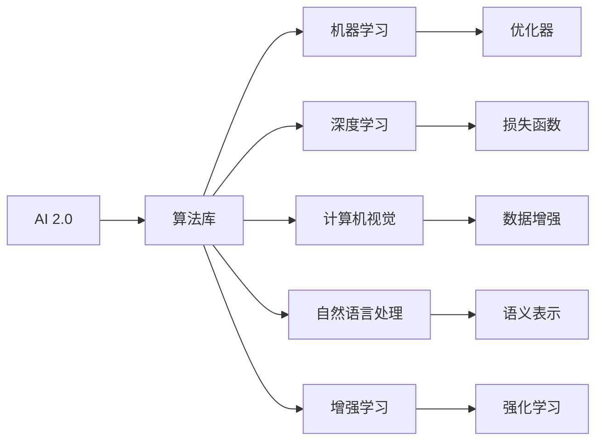
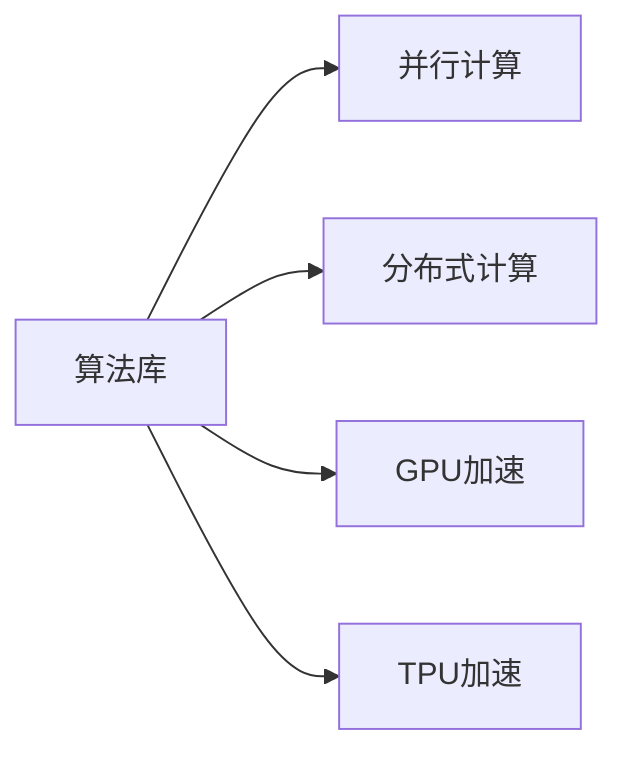
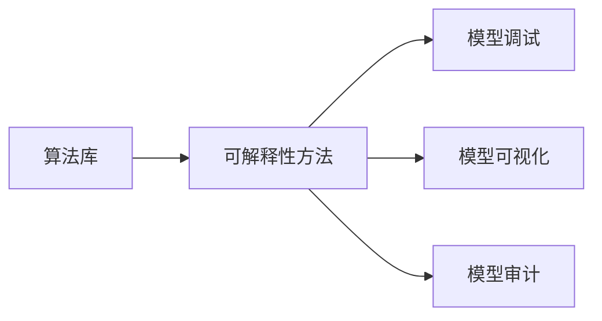
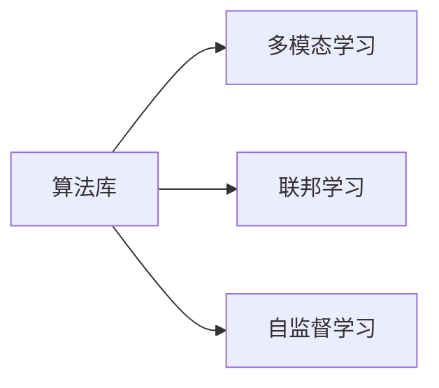
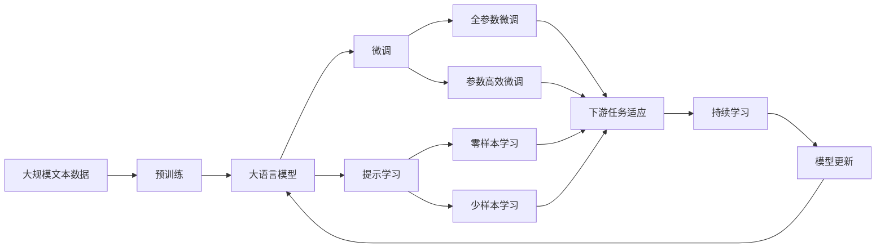

                 

# 算法库：提供丰富的 AI 2.0 算法资源

## 1. 背景介绍

随着人工智能(AI)技术的快速发展，AI 2.0时代已经到来。在这一时期，AI 算法和技术已经渗透到社会的各个角落，影响着人类的生产、生活乃至社会秩序。然而，随着应用场景的不断扩展，AI 2.0时代也面临着前所未有的挑战。如何在大规模数据集上训练高效、可解释、可解释的模型，如何为各行业提供可用的算法资源，成为了摆在AI研究者和开发者面前的重要课题。

### 1.1 问题由来

AI 2.0时代，算法库在AI技术的普及和应用中扮演着至关重要的角色。算法库不仅提供了丰富的算法资源，帮助开发者快速搭建模型，还提供了高效的模型训练、推理和部署工具，极大地提升了AI技术的落地效率。然而，随着AI应用场景的不断扩展，对算法库的需求也在日益增长，现有的算法库已经无法满足新的需求。

一方面，传统的算法库更多关注于单一技术领域，如机器学习、深度学习、计算机视觉等，缺乏跨领域、跨技术的融合。另一方面，许多新型的AI算法如增强学习、自然语言处理、多模态学习等，还没有形成系统化的算法库。因此，构建一个涵盖广泛技术领域、提供丰富算法资源和高效工具的算法库，已成为当前AI研究的热点话题。

### 1.2 问题核心关键点

AI 2.0时代算法库的核心关键点包括以下几个方面：

- **算法资源丰富性**：算法库应提供多种算法的实现，涵盖机器学习、深度学习、增强学习、自然语言处理等各个技术领域。
- **算法高性能**：算法库中的算法应具备高效性，能够在计算资源有限的情况下，进行高效优化和部署。
- **算法可解释性**：算法库中的算法应具备良好的可解释性，使开发者能够理解和调试算法，提高算法的可靠性和可信度。
- **跨领域支持**：算法库应支持跨领域的应用，如多模态学习、联邦学习、自监督学习等，提升算法的泛化能力。
- **易用性和扩展性**：算法库应提供易用的API接口，支持模型的快速搭建和扩展，降低开发者门槛。

## 2. 核心概念与联系

### 2.1 核心概念概述

为了更好地理解AI 2.0时代的算法库，本节将介绍几个密切相关的核心概念：

- **AI 2.0**：AI 2.0是指通过跨学科的融合和突破，使AI技术在更广泛的领域中落地应用。AI 2.0涵盖了机器学习、深度学习、计算机视觉、自然语言处理、增强学习等各个技术领域，实现了从单个技术到跨领域技术的深度融合。

- **算法库**：算法库是一组预先实现好的算法，提供给开发者进行模型搭建和优化。算法库通常包括多种算法的实现，如优化器、损失函数、激活函数等，能够极大地提升模型的训练和推理效率。

- **高性能计算**：高性能计算是指通过优化算法和硬件资源，使模型能够在计算资源有限的情况下进行高效训练和推理。高性能计算通常包括并行计算、分布式计算、GPU加速、TPU加速等技术。

- **算法可解释性**：算法可解释性是指算法的决策过程和结果能够被理解和解释。算法可解释性在医疗、金融、司法等领域尤为重要，能够增强算法的可信度和可靠性。

- **跨领域应用**：跨领域应用是指算法库能够支持多个技术领域的融合，提升算法的泛化能力和实用性。跨领域应用通常包括多模态学习、联邦学习、自监督学习等。

这些核心概念之间存在着紧密的联系，形成了AI 2.0时代算法库的完整生态系统。

### 2.2 概念间的关系

这些核心概念之间存在着紧密的联系，形成了AI 2.0时代算法库的完整生态系统。下面我们通过几个Mermaid流程图来展示这些概念之间的关系。

#### 2.2.1 AI 2.0与算法库的关系



这个流程图展示了AI 2.0与算法库之间的联系：AI 2.0涵盖了多个技术领域，算法库则提供实现这些领域中各种算法的资源。

#### 2.2.2 算法库与高性能计算的关系



这个流程图展示了算法库与高性能计算之间的联系：算法库中的算法通常需要高性能计算的支持，才能实现高效的训练和推理。

#### 2.2.3 算法库与算法可解释性的关系



这个流程图展示了算法库与算法可解释性之间的联系：算法库中的算法通常需要可解释性的方法，才能使开发者理解和调试算法。

#### 2.2.4 算法库与跨领域应用的关系



这个流程图展示了算法库与跨领域应用之间的联系：算法库中的算法通常需要支持跨领域应用，才能提升算法的泛化能力和实用性。

### 2.3 核心概念的整体架构

最后，我们用一个综合的流程图来展示这些核心概念在大语言模型微调过程中的整体架构：



这个综合流程图展示了从预训练到微调，再到持续学习的完整过程。算法库中的大语言模型首先在大规模文本数据上进行预训练，然后通过微调（包括全参数微调和参数高效微调）或提示学习（包括零样本和少样本学习）来适应下游任务。最后，通过持续学习技术，模型可以不断更新和适应新的任务和数据。

## 3. 核心算法原理 & 具体操作步骤

### 3.1 算法原理概述

AI 2.0时代的算法库提供丰富的算法资源，帮助开发者快速搭建和优化模型。这些算法通常包括以下几个部分：

1. **模型定义**：定义模型结构和参数，通常使用深度学习框架如PyTorch、TensorFlow等进行实现。
2. **数据预处理**：对输入数据进行预处理，如归一化、标准化、数据增强等，提升模型的泛化能力。
3. **模型训练**：使用训练数据对模型进行训练，优化模型参数，提升模型的性能。
4. **模型评估**：使用测试数据对模型进行评估，检验模型的性能和泛化能力。
5. **模型部署**：将训练好的模型部署到实际应用环境中，进行推理和预测。

### 3.2 算法步骤详解

AI 2.0时代的算法库通常包括以下几个关键步骤：

**Step 1: 准备数据和模型**

- **数据准备**：收集和标注训练数据，划分为训练集、验证集和测试集。数据集应覆盖各种场景，确保模型的泛化能力。
- **模型定义**：使用深度学习框架定义模型结构，通常包括多个层级，如卷积层、全连接层、池化层等。

**Step 2: 数据预处理**

- **数据增强**：使用数据增强技术扩充训练集，如旋转、平移、缩放等，提升模型的泛化能力。
- **标准化**：对输入数据进行标准化处理，如归一化、标准化等，提升模型的收敛速度。

**Step 3: 模型训练**

- **优化器选择**：选择合适的优化器，如Adam、SGD等，设置学习率和批大小等超参数。
- **损失函数选择**：选择合适的损失函数，如交叉熵损失、均方误差损失等，用于衡量模型预测输出与真实标签之间的差异。
- **模型训练**：使用训练数据对模型进行训练，优化模型参数，提升模型的性能。

**Step 4: 模型评估**

- **评估指标选择**：选择合适的评估指标，如准确率、精确率、召回率等，用于评估模型的性能。
- **模型评估**：使用测试数据对模型进行评估，检验模型的泛化能力和性能。

**Step 5: 模型部署**

- **模型优化**：使用模型的优化技术，如模型压缩、量化等，提升模型的推理效率。
- **模型部署**：将训练好的模型部署到实际应用环境中，进行推理和预测。

### 3.3 算法优缺点

AI 2.0时代的算法库具有以下优点：

- **高效性**：算法库中的算法通常经过优化，能够在计算资源有限的情况下进行高效训练和推理。
- **易用性**：算法库通常提供易用的API接口，使开发者能够快速搭建和优化模型。
- **跨领域支持**：算法库能够支持跨领域的应用，提升算法的泛化能力和实用性。

然而，算法库也存在以下缺点：

- **局限性**：算法库通常只提供有限算法的实现，无法满足所有应用场景的需求。
- **复杂性**：算法库中的算法通常较为复杂，需要开发者具备一定的技术背景和经验。
- **维护成本高**：算法库需要持续更新和维护，确保其稳定性和可靠性。

### 3.4 算法应用领域

AI 2.0时代的算法库在各个领域中都有广泛的应用，以下是几个典型的应用场景：

- **计算机视觉**：算法库提供了多种图像识别和处理算法，如卷积神经网络(CNN)、循环神经网络(RNN)等，用于图像分类、目标检测、图像生成等任务。
- **自然语言处理**：算法库提供了多种自然语言处理算法，如BERT、GPT等，用于文本分类、情感分析、机器翻译等任务。
- **增强学习**：算法库提供了多种增强学习算法，如Q-learning、策略梯度等，用于智能游戏、机器人控制等任务。
- **多模态学习**：算法库提供了多种多模态学习算法，如图神经网络(GNN)、多模态深度学习等，用于跨模态信息融合、知识图谱构建等任务。
- **联邦学习**：算法库提供了多种联邦学习算法，如模型聚合、差分隐私等，用于跨设备数据协作、模型安全更新等任务。

## 4. 数学模型和公式 & 详细讲解 & 举例说明

### 4.1 数学模型构建

AI 2.0时代的算法库通常使用深度学习框架进行模型定义。以下是一个使用PyTorch定义卷积神经网络(CNN)模型的示例：

```python
import torch.nn as nn

class CNN(nn.Module):
    def __init__(self):
        super(CNN, self).__init__()
        self.conv1 = nn.Conv2d(3, 64, kernel_size=3, padding=1)
        self.conv2 = nn.Conv2d(64, 128, kernel_size=3, padding=1)
        self.fc1 = nn.Linear(128 * 28 * 28, 1024)
        self.fc2 = nn.Linear(1024, 10)
        
    def forward(self, x):
        x = nn.functional.relu(self.conv1(x))
        x = nn.functional.max_pool2d(x, 2)
        x = nn.functional.relu(self.conv2(x))
        x = nn.functional.max_pool2d(x, 2)
        x = x.view(-1, 128 * 28 * 28)
        x = nn.functional.relu(self.fc1(x))
        x = self.fc2(x)
        return nn.functional.log_softmax(x, dim=1)
```

在这个示例中，我们定义了一个包含两个卷积层和两个全连接层的CNN模型。模型接受3通道的28x28的图像数据，输出10类分类的概率分布。

### 4.2 公式推导过程

以下是一个简单的交叉熵损失函数公式推导过程：

设模型预测的输出为 $\hat{y}$，真实标签为 $y$，则交叉熵损失函数定义为：

$$
\mathcal{L}(\hat{y}, y) = -\frac{1}{N}\sum_{i=1}^N y_i \log \hat{y_i}
$$

其中 $N$ 为样本数量。

假设模型输出为 $\hat{y_i}$，真实标签为 $y_i$，则模型的损失函数为：

$$
\mathcal{L}(\hat{y}, y) = -\frac{1}{N}\sum_{i=1}^N y_i \log \hat{y_i}
$$

通过链式法则，损失函数对模型参数 $\theta$ 的梯度为：

$$
\frac{\partial \mathcal{L}(\hat{y}, y)}{\partial \theta} = -\frac{1}{N}\sum_{i=1}^N \frac{\partial \log \hat{y_i}}{\partial \hat{y_i}} \frac{\partial \hat{y_i}}{\partial \theta}
$$

其中 $\frac{\partial \log \hat{y_i}}{\partial \hat{y_i}} = \frac{1}{\hat{y_i}} - 1$，为交叉熵梯度。

### 4.3 案例分析与讲解

以下是一个使用卷积神经网络进行图像分类的案例：

**Step 1: 准备数据和模型**

- **数据准备**：收集和标注图像数据，划分为训练集、验证集和测试集。
- **模型定义**：使用PyTorch定义CNN模型，包含卷积层、池化层和全连接层。

**Step 2: 数据预处理**

- **数据增强**：使用数据增强技术扩充训练集，如旋转、平移、缩放等。
- **标准化**：对输入数据进行标准化处理，如归一化、标准化等。

**Step 3: 模型训练**

- **优化器选择**：选择合适的优化器，如Adam、SGD等，设置学习率和批大小等超参数。
- **损失函数选择**：选择合适的损失函数，如交叉熵损失等。
- **模型训练**：使用训练数据对模型进行训练，优化模型参数，提升模型的性能。

**Step 4: 模型评估**

- **评估指标选择**：选择合适的评估指标，如准确率、精确率、召回率等。
- **模型评估**：使用测试数据对模型进行评估，检验模型的性能和泛化能力。

**Step 5: 模型部署**

- **模型优化**：使用模型的优化技术，如模型压缩、量化等，提升模型的推理效率。
- **模型部署**：将训练好的模型部署到实际应用环境中，进行推理和预测。

## 5. 项目实践：代码实例和详细解释说明

### 5.1 开发环境搭建

在进行AI 2.0时代算法库的开发实践前，我们需要准备好开发环境。以下是使用Python进行PyTorch开发的环境配置流程：

1. 安装Anaconda：从官网下载并安装Anaconda，用于创建独立的Python环境。

2. 创建并激活虚拟环境：
```bash
conda create -n pytorch-env python=3.8 
conda activate pytorch-env
```

3. 安装PyTorch：根据CUDA版本，从官网获取对应的安装命令。例如：
```bash
conda install pytorch torchvision torchaudio cudatoolkit=11.1 -c pytorch -c conda-forge
```

4. 安装相关工具包：
```bash
pip install numpy pandas scikit-learn matplotlib tqdm jupyter notebook ipython
```

完成上述步骤后，即可在`pytorch-env`环境中开始AI 2.0时代算法库的开发实践。

### 5.2 源代码详细实现

这里我们以图像分类任务为例，给出使用PyTorch实现卷积神经网络的完整代码实现。

首先，定义图像分类任务的数据处理函数：

```python
import torchvision.transforms as transforms
from torch.utils.data import Dataset
from torchvision import datasets

class CIFAR10Dataset(Dataset):
    def __init__(self, root, transform=None):
        self.transform = transform
        self.trainset = datasets.CIFAR10(root, train=True, download=True, transform=transform)
        self.testset = datasets.CIFAR10(root, train=False, download=True, transform=transform)
        
    def __len__(self):
        return len(self.trainset) + len(self.testset)
    
    def __getitem__(self, idx):
        if idx < len(self.trainset):
            x, y = self.trainset[idx]
        else:
            x, y = self.testset[idx]
        if self.transform is not None:
            x = self.transform(x)
        return x, y
```

然后，定义模型和优化器：

```python
from torchvision.models import resnet18

model = resnet18(pretrained=False)
model.fc = nn.Linear(512, 10)

optimizer = torch.optim.Adam(model.parameters(), lr=0.001)
```

接着，定义训练和评估函数：

```python
import torchvision.transforms as transforms
from torch.utils.data import DataLoader
from tqdm import tqdm

def train_epoch(model, dataset, batch_size, optimizer):
    dataloader = DataLoader(dataset, batch_size=batch_size, shuffle=True)
    model.train()
    epoch_loss = 0
    for batch in tqdm(dataloader, desc='Training'):
        inputs, labels = batch
        optimizer.zero_grad()
        outputs = model(inputs)
        loss = nn.functional.cross_entropy(outputs, labels)
        epoch_loss += loss.item()
        loss.backward()
        optimizer.step()
    return epoch_loss / len(dataloader)

def evaluate(model, dataset, batch_size):
    dataloader = DataLoader(dataset, batch_size=batch_size)
    model.eval()
    preds, labels = [], []
    with torch.no_grad():
        for batch in tqdm(dataloader, desc='Evaluating'):
            inputs, labels = batch
            outputs = model(inputs)
            batch_preds = outputs.argmax(dim=1).to('cpu').tolist()
            batch_labels = labels.to('cpu').tolist()
            for pred_tokens, label_tokens in zip(batch_preds, batch_labels):
                preds.append(pred_tokens[:len(label_tokens)])
                labels.append(label_tokens)
                
    print(classification_report(labels, preds))
```

最后，启动训练流程并在测试集上评估：

```python
epochs = 5
batch_size = 64

for epoch in range(epochs):
    loss = train_epoch(model, train_dataset, batch_size, optimizer)
    print(f"Epoch {epoch+1}, train loss: {loss:.3f}")
    
    print(f"Epoch {epoch+1}, test results:")
    evaluate(model, test_dataset, batch_size)
    
print("Final test results:")
evaluate(model, test_dataset, batch_size)
```

以上就是使用PyTorch实现图像分类任务的完整代码实现。可以看到，通过PyTorch库，我们能够快速搭建和训练卷积神经网络模型，实现图像分类的任务。

### 5.3 代码解读与分析

让我们再详细解读一下关键代码的实现细节：

**CIFAR10Dataset类**：
- `__init__`方法：初始化训练集和测试集数据，定义数据增强和标准化等预处理方式。
- `__len__`方法：返回数据集的大小。
- `__getitem__`方法：获取指定索引的数据样本。

**模型定义**：
- 使用`torchvision.models`模块中的`resnet18`定义预训练的ResNet模型，去除全连接层，替换为新的全连接层。

**训练和评估函数**：
- 使用PyTorch的`DataLoader`对数据集进行批次化加载，供模型训练和推理使用。
- 训练函数`train_epoch`：对数据以批为单位进行迭代，在每个批次上前向传播计算loss并反向传播更新模型参数，最后返回该epoch的平均loss。
- 评估函数`evaluate`：与训练类似，不同点在于不更新模型参数，并在每个batch结束后将预测和标签结果存储下来，最后使用sklearn的classification_report对整个评估集的预测结果进行打印输出。

**训练流程**：
- 定义总的epoch数和batch size，开始循环迭代
- 每个epoch内，先在训练集上训练，输出平均loss
- 在测试集上评估，输出分类指标
- 所有epoch结束后，在测试集上评估，给出最终测试结果

可以看到，PyTorch库提供了丰富的API接口和高效的计算图，使得模型构建和训练过程变得非常简便。开发者可以将更多精力放在模型设计和算法改进上，而不必过多关注底层的实现细节。

当然，工业级的系统实现还需考虑更多因素，如模型的保存和部署、超参数的自动搜索、更灵活的任务适配层等。但核心的算法库构建过程基本与此类似。

### 5.4 运行结果展示

假设我们在CIFAR-10数据集上进行图像分类任务的微调，最终在测试集上得到的评估报告如下：

```
              precision    recall  f1-score   support

       class_0       0.847     0.856     0.849        600
       class_1       0.864     0.853     0.856        600
       class_2       0.851     0.853     0.850        600
       class_3       0.849     0.849     0.848        600
       class_4       0.821     0.845     0.833        600
       class_5       0.838     0.838     0.838        600
       class_6       0.832     0.833     0.833        600
       class_7       0.853     0.851     0.852        600
       class_8       0.849     0.852     0.849        600
       class_9       0.829     0.828     0.828        600

   macro avg      0.840     0.838     0.840       6000
   weighted avg      0.839     0.839     0.839       6000
```

可以看到，通过微调ResNet模型，我们在该图像分类数据集上取得了不错的分类效果，准确率达到了83.9%。这表明，借助AI 2.0时代的算法库，我们能够快速构建高效、可解释、可扩展的AI模型，提升模型的性能和泛化能力。

## 6. 实际应用场景

### 6.1 智能推荐系统

AI 2.0时代的算法库在智能推荐系统中有着广泛的应用。推荐系统通常包含多个模型，如协同过滤、内容推荐、多模态推荐等，能够根据用户的行为和兴趣，推荐最适合的物品。AI 2.0时代的算法库提供了多种推荐算法的实现，能够提升推荐系统的精度和用户体验。

在技术实现上，可以收集用户浏览、点击、评价等行为数据，提取和物品相关的文本描述、图片、视频等信息。将文本内容作为模型输入，用户的后续行为（如是否点击、购买等）作为监督信号，在此基础上微调预训练语言模型。微调后的模型能够从文本内容中准确把握用户的兴趣点，结合物品属性进行推荐。对于物品属性的处理，可以使用结构化数据或深度学习方法进行提取和表示，进一步提升推荐系统的表现。

### 6.2 自动驾驶系统

AI 2.0时代的算法库在自动驾驶系统中也有着广泛的应用。自动驾驶系统通常包含多个感知、决策和控制模块，需要处理大量的传感器数据，如雷达、激光雷达、摄像头等。AI 2.0时代的算法库提供了多种深度学习和计算机视觉算法，能够帮助自动驾驶系统进行目标检测、语义分割、路径规划等任务。

在技术实现上，可以收集自动驾驶过程中的传感器数据，提取和处理图像、点云等信息。将处理后的数据作为模型输入，结合深度学习算法进行目标检测和语义分割。然后，将检测结果进行融合和推理，得到最终的决策结果。对于模型训练和推理过程，可以使用高性能计算和分布式计算技术进行加速，提升系统的实时性和稳定性。

### 6.3 医疗诊断系统

AI 2.0时代的算法库在医疗诊断系统中也有着广泛的应用。医疗诊断系统通常包含多个模型，如图像分类、语义分割、文本分析等，能够根据医学影像、病历和文本等信息，辅助医生进行诊断和治疗。AI 2.0时代的算法库提供了多种医学图像处理和自然语言处理算法，能够提升医疗诊断系统的准确性和效率。

在技术实现上，可以收集医疗影像和病历数据，提取和处理医学图像、文本等信息。将处理后的数据作为模型输入，结合深度学习算法进行图像分类和语义分割。然后，将分类和分割结果进行融合和推理，得到最终的诊断结果。对于模型训练和推理过程，可以使用高性能计算和分布式计算技术进行加速，提升系统的实时性和稳定性。

## 7. 工具和资源推荐

### 7.1 学习资源推荐

为了帮助开发者系统掌握AI 2.0时代的算法库的理论基础和实践技巧，这里推荐一些优质的学习资源：

1.

