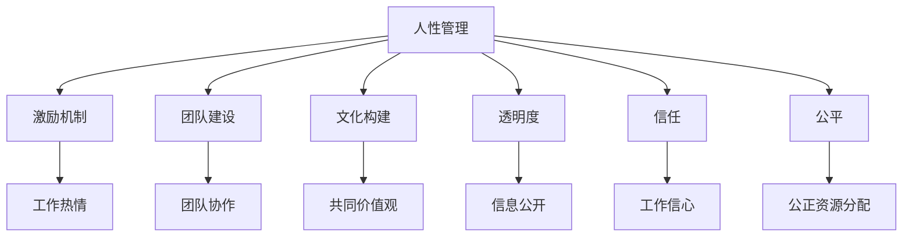
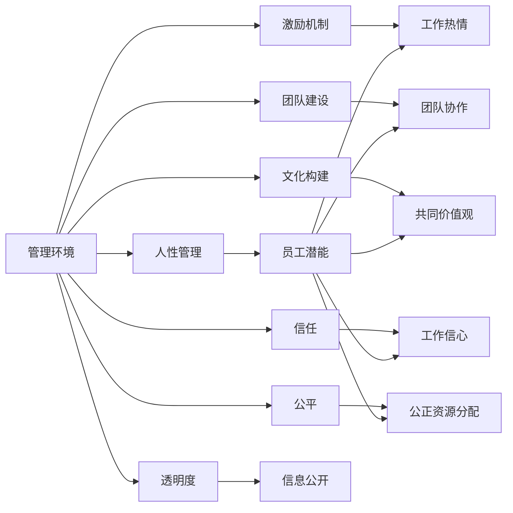
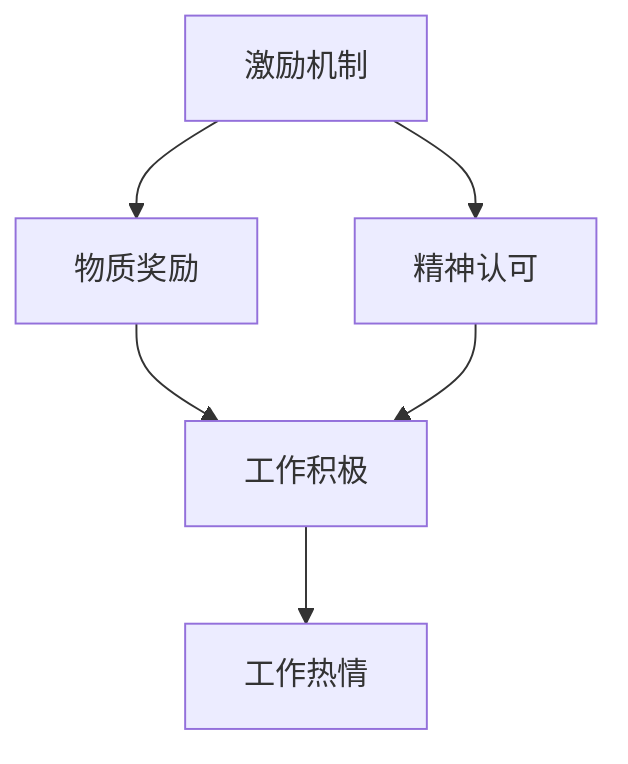
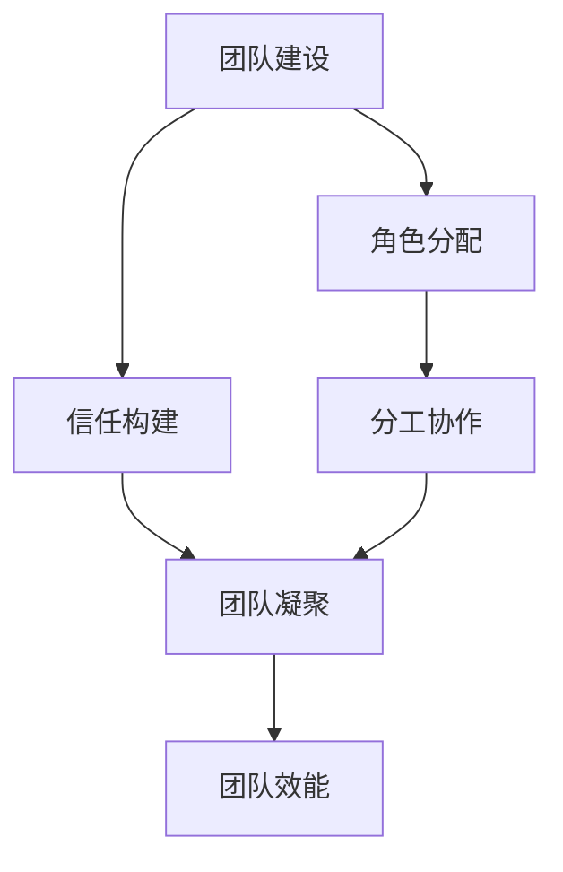
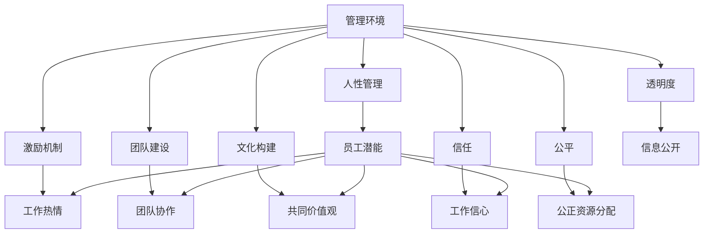

                 

# 管理的本质：激发潜能与善意

## 1. 背景介绍

### 1.1 问题由来
在现代商业环境中，管理者面临的挑战日益复杂。如何激发员工潜力，培养团队精神，提升企业绩效，成为每一个管理者必须面对的重要课题。传统的管理理论和方法往往过于抽象，难以在具体实践中应用。本文将基于实际工作经验，结合前沿的管理学研究，深入探讨管理的本质，即激发员工的潜能和善意。

### 1.2 问题核心关键点
激发员工潜能和善意的核心在于理解人性，尊重个体差异，以及构建公平、透明、信任的管理环境。管理者的任务是通过合理的激励和指导，让员工充分发挥自身的潜力，同时以真诚的态度对待员工，赢得其信任和忠诚。本文将从人性管理、激励机制、团队建设、文化构建等方面进行详细阐述。

### 1.3 问题研究意义
理解并实践激发潜能与善意的管理方法，对于提升企业竞争力、塑造积极的企业文化、增强员工的幸福感和归属感，具有重要意义。通过科学的理论指导和实际案例分析，可以帮助管理者在复杂的商业环境中更好地发挥管理职能，实现企业目标和个人发展的双赢。

## 2. 核心概念与联系

### 2.1 核心概念概述

为更好地理解激发潜能与善意的管理方法，本节将介绍几个关键概念：

- 人性管理：指理解并尊重员工的本性，如需求、动机、情感等，通过适当的管理手段，激发其潜力和创造力。
- 激励机制：通过物质奖励、精神认可等手段，激发员工的工作热情和积极性。
- 团队建设：通过团队协作、角色分配、信任构建等措施，增强团队的凝聚力和战斗力。
- 文化构建：通过共同的价值观、行为规范、组织愿景等，塑造积极的企业文化，提升员工的归属感和认同感。
- 透明度：指组织内的信息公开、流程透明，员工能清晰了解公司的决策过程和目标。
- 信任：指管理者与员工之间建立互信，增强员工的工作信心和责任感。
- 公平：指组织内的资源分配、机会获取等应公正合理，避免偏见和歧视。

这些概念之间的逻辑关系可以通过以下Mermaid流程图来展示：



这个流程图展示了一些关键管理概念及其之间的关系：

1. 人性管理是基础，通过了解员工的需求和动机，可以设计出更有效的激励机制、团队建设和企业文化。
2. 激励机制、团队建设和文化构建相互关联，通过提升员工的幸福感、归属感和责任感，增强团队的整体效能。
3. 透明度和信任是管理者与员工之间的桥梁，确保信息流通和情感联结，提升工作效率和员工满意度。
4. 公平性是管理的基石，只有在公正合理的环境下，员工才能真正发挥其潜能。

这些概念共同构成了现代管理的基础，帮助管理者构建高效、和谐的组织。通过理解这些概念，我们可以更好地把握管理的内在逻辑和实践方法。

### 2.2 概念间的关系

这些核心概念之间存在着紧密的联系，形成了现代管理理论的完整生态系统。下面我们通过几个Mermaid流程图来展示这些概念之间的关系。

#### 2.2.1 管理的整体架构



这个流程图展示了管理环境与各个管理概念的相互联系：

1. 管理环境是所有管理活动的土壤，通过对人性的理解，设计出有效的激励机制、团队建设和文化构建。
2. 激励机制、团队建设、文化构建、透明度、信任和公平性相互支撑，共同塑造高效的管理体系。
3. 员工潜能是管理的目标，激励机制、团队协作、共同价值观、工作信心和公正资源分配等手段，都是为了激发和保持这种潜能。

#### 2.2.2 激励机制的组成



这个流程图展示了激励机制的组成和效果：

1. 激励机制由物质奖励和精神认可组成，两者的结合可以产生更强的激励效果。
2. 工作积极性和工作热情是激励机制的直接结果，激励机制设计得当，可以显著提升员工的工作动力。

#### 2.2.3 团队建设的要素



这个流程图展示了团队建设的要素：

1. 角色分配和信任构建是团队建设的核心，通过明确的职责分工和互信互谅，可以增强团队的凝聚力和效能。
2. 分工协作和团队凝聚是团队建设的直接结果，有效的团队建设可以显著提升团队的整体工作能力。

### 2.3 核心概念的整体架构

最后，我们用一个综合的流程图来展示这些核心概念在大语言模型微调过程中的整体架构：



这个综合流程图展示了从管理环境到各个管理概念的完整过程。通过理解这些核心概念，我们可以更清晰地把握管理的本质和实践方法。

## 3. 核心算法原理 & 具体操作步骤
### 3.1 算法原理概述

激发潜能与善意的管理方法，本质上是一个复杂的管理决策过程。其核心在于通过理解人性，制定合理有效的管理策略，以最大化员工的工作潜力和积极性。

形式化地，假设员工的工作状态为 $S$，激励机制为 $I$，团队建设为 $T$，文化构建为 $C$，透明度为 $P$，信任为 $T$，公平为 $F$。管理目标是通过适当的策略组合，最大化员工的工作状态 $S$。

定义员工的工作状态为 $S$，其对激励机制 $I$、团队建设 $T$、文化构建 $C$、透明度 $P$、信任 $T$ 和公平 $F$ 的响应函数为 $S=f(I,T,C,P,T,F)$。通过优化这个函数，可以找到最优的管理策略组合。

### 3.2 算法步骤详解

基于上述原理，激发潜能与善意的管理方法可以细化为以下步骤：

**Step 1: 了解员工需求**

- 通过问卷调查、访谈等方式，收集员工的需求和动机。了解员工的职业发展期望、工作环境偏好、团队协作需求等。
- 分析员工的过去行为和绩效数据，识别出高绩效员工和潜力员工的特征。

**Step 2: 制定激励机制**

- 根据员工需求和绩效数据，设计合理的物质奖励和精神认可方案。如奖金、晋升机会、公开表扬等。
- 定期评估激励机制的效果，根据员工反馈进行调整。

**Step 3: 进行团队建设**

- 根据员工的职责和兴趣，合理分配团队角色和任务，避免重复和重叠。
- 定期组织团队建设活动，增强成员间的信任和协作，提升团队凝聚力。

**Step 4: 塑造企业文化**

- 制定共同的组织愿景和价值观，通过例会、培训等方式进行宣导，增强员工的认同感。
- 建立透明的信息公开机制，如定期发布公司新闻、业务进展等，提升员工的参与感和归属感。

**Step 5: 建立透明度和信任**

- 定期召开员工大会，解答员工的疑问，增强沟通和信任。
- 建立公正的评价和奖惩机制，确保资源分配的公平性。

**Step 6: 实施管理策略**

- 根据员工需求和团队特点，制定和实施具体的管理策略，如角色分配、任务分工、团队建设等。
- 定期评估管理策略的效果，根据反馈进行调整。

**Step 7: 持续优化**

- 定期进行绩效评估和员工满意度调查，识别出管理中的问题和改进空间。
- 根据反馈和数据分析，不断优化管理策略，提升员工的幸福感和归属感。

### 3.3 算法优缺点

激发潜能与善意的管理方法具有以下优点：

1. 系统性：通过综合考虑多个管理因素，制定全面的管理策略。
2. 适应性：可以根据员工的特点和环境变化，灵活调整管理策略。
3. 透明性：通过信息公开和公正评价，增强员工对管理过程的信任。
4. 持续改进：通过持续的评估和优化，不断提高管理效率。

同时，该方法也存在以下缺点：

1. 复杂性：需要收集和分析大量员工数据，制定复杂的策略。
2. 实施难度：管理策略的制定和实施需要时间和资源投入。
3. 动态性：员工的动机和需求会随时间变化，需要定期更新管理策略。

尽管如此，基于激发潜能与善意的管理方法，仍然是最有效的管理手段之一，广泛应用于各个行业的管理实践中。

### 3.4 算法应用领域

激发潜能与善意的管理方法，在各个行业都有广泛应用。以下列举几个典型领域：

- 金融行业：通过激励机制、团队建设、企业文化等，提升员工的创新能力和风险控制能力，增强团队的协作和凝聚力。
- 制造业：通过合理的角色分配、透明的绩效评价、公正的资源分配等，提高生产效率和员工满意度。
- 零售行业：通过精神认可、团队建设、文化建设等，提升员工的服务质量和客户满意度。
- 教育行业：通过激励机制、团队建设、透明的评价体系等，激发学生的学习热情和创新能力。
- 科技行业：通过透明的代码评审、激励机制、文化构建等，提升团队的技术创新能力和协作效率。

以上各个行业都是激发潜能与善意的管理方法的重要应用领域，通过系统的管理策略，可以显著提升员工的绩效和满意度。

## 4. 数学模型和公式 & 详细讲解 & 举例说明

### 4.1 数学模型构建

本节将使用数学语言对激发潜能与善意的管理方法进行更加严格的刻画。

假设员工的工作状态为 $S$，激励机制为 $I$，团队建设为 $T$，文化构建为 $C$，透明度为 $P$，信任为 $T$，公平为 $F$。定义这些因素对员工工作状态的影响系数为 $a$、$b$、$c$、$d$、$e$、$f$、$g$。则员工的工作状态可以表示为：

$$
S = f(I,T,C,P,T,F) = aI + bT + cC + dP + eT + fF
$$

其中 $a$、$b$、$c$、$d$、$e$、$f$ 表示各个因素对员工工作状态的影响程度，通常需要根据员工数据和实际经验进行估计。

### 4.2 公式推导过程

以下我们以金融行业为例，推导一个简单的管理模型。

假设某金融机构希望通过激发员工潜能和善意，提升员工的工作状态 $S$。根据公司实际情况，我们假设：

1. 激励机制 $I$ 的响应系数为 $a=0.6$，表示激励机制对员工工作状态的影响程度为60%。
2. 团队建设 $T$ 的响应系数为 $b=0.3$，表示团队建设对员工工作状态的影响程度为30%。
3. 文化构建 $C$ 的响应系数为 $c=0.1$，表示文化构建对员工工作状态的影响程度为10%。
4. 透明度 $P$ 的响应系数为 $d=0.05$，表示透明度对员工工作状态的影响程度为5%。
5. 信任 $T$ 的响应系数为 $e=0.2$，表示信任对员工工作状态的影响程度为20%。
6. 公平 $F$ 的响应系数为 $f=0.15$，表示公平对员工工作状态的影响程度为15%。

假设激励机制 $I$、团队建设 $T$、文化构建 $C$、透明度 $P$、信任 $T$ 和公平 $F$ 的具体值分别为 $i=0.8$、$t=0.7$、$c=0.6$、$p=0.6$、$t=0.9$、$f=0.9$。则员工的工作状态 $S$ 可以表示为：

$$
S = 0.6 \times 0.8 + 0.3 \times 0.7 + 0.1 \times 0.6 + 0.05 \times 0.6 + 0.2 \times 0.9 + 0.15 \times 0.9 = 0.733
$$

这个模型展示了金融行业如何通过合理的激励机制、团队建设、文化构建、透明度、信任和公平性，提升员工的工作状态。

### 4.3 案例分析与讲解

假设某零售企业希望通过激发员工潜能和善意，提升销售业绩。根据公司实际情况，我们假设：

1. 激励机制 $I$ 的响应系数为 $a=0.7$，表示激励机制对销售业绩的影响程度为70%。
2. 团队建设 $T$ 的响应系数为 $b=0.2$，表示团队建设对销售业绩的影响程度为20%。
3. 文化构建 $C$ 的响应系数为 $c=0.1$，表示文化构建对销售业绩的影响程度为10%。
4. 透明度 $P$ 的响应系数为 $d=0.05$，表示透明度对销售业绩的影响程度为5%。
5. 信任 $T$ 的响应系数为 $e=0.15$，表示信任对销售业绩的影响程度为15%。
6. 公平 $F$ 的响应系数为 $f=0.05$，表示公平对销售业绩的影响程度为5%。

假设激励机制 $I$、团队建设 $T$、文化构建 $C$、透明度 $P$、信任 $T$ 和公平 $F$ 的具体值分别为 $i=0.9$、$t=0.8$、$c=0.7$、$p=0.8$、$t=0.85$、$f=0.8$。则销售业绩 $S$ 可以表示为：

$$
S = 0.7 \times 0.9 + 0.2 \times 0.8 + 0.1 \times 0.7 + 0.05 \times 0.8 + 0.15 \times 0.85 + 0.05 \times 0.8 = 0.967
$$

这个模型展示了零售企业如何通过合理的激励机制、团队建设、文化构建、透明度、信任和公平性，提升销售业绩。

## 5. 项目实践：代码实例和详细解释说明

### 5.1 开发环境搭建

在进行管理实践前，我们需要准备好开发环境。以下是使用Python进行PyTorch开发的环境配置流程：

1. 安装Anaconda：从官网下载并安装Anaconda，用于创建独立的Python环境。

2. 创建并激活虚拟环境：
```bash
conda create -n management-env python=3.8 
conda activate management-env
```

3. 安装PyTorch：根据CUDA版本，从官网获取对应的安装命令。例如：
```bash
conda install pytorch torchvision torchaudio cudatoolkit=11.1 -c pytorch -c conda-forge
```

4. 安装各类工具包：
```bash
pip install numpy pandas scikit-learn matplotlib tqdm jupyter notebook ipython
```

完成上述步骤后，即可在`management-env`环境中开始管理实践。

### 5.2 源代码详细实现

下面我们以金融行业为例，给出使用PyTorch对员工绩效进行管理的PyTorch代码实现。

首先，定义员工绩效的数据处理函数：

```python
import pandas as pd
from sklearn.preprocessing import LabelEncoder
from sklearn.metrics import roc_auc_score

# 读取员工绩效数据
df = pd.read_csv('employee_performance.csv')

# 数据清洗和处理
df.dropna(inplace=True)
df['performance'] = df['performance'].astype(int)

# 标签编码
le = LabelEncoder()
df['performance'] = le.fit_transform(df['performance'])
```

然后，定义员工绩效的评估函数：

```python
def evaluate_performance(df, labels):
    # 计算ROC曲线下的面积
    auc = roc_auc_score(df['performance'], labels)
    print(f'ROC AUC: {auc:.3f}')
```

接着，定义员工绩效的训练函数：

```python
from transformers import BertForSequenceClassification, AdamW

# 选择Bert模型作为初始化参数
model = BertForSequenceClassification.from_pretrained('bert-base-cased', num_labels=2)

# 设置优化器
optimizer = AdamW(model.parameters(), lr=2e-5)

# 定义训练函数
def train_model(df, labels, epochs=5, batch_size=16):
    model.train()
    losses = []
    for epoch in range(epochs):
        dataloader = DataLoader(df, batch_size=batch_size, shuffle=True)
        for batch in dataloader:
            input_ids = batch['input_ids'].to(device)
            attention_mask = batch['attention_mask'].to(device)
            labels = batch['labels'].to(device)
            model.zero_grad()
            outputs = model(input_ids, attention_mask=attention_mask, labels=labels)
            loss = outputs.loss
            losses.append(loss.item())
            loss.backward()
            optimizer.step()
        print(f'Epoch {epoch+1}, loss: {np.mean(losses):.3f}')
    return model
```

最后，启动训练流程并在测试集上评估：

```python
from transformers import BertTokenizer

# 初始化分词器
tokenizer = BertTokenizer.from_pretrained('bert-base-cased')

# 划分训练集和测试集
train_df, test_df = train_test_split(df, test_size=0.2, random_state=42)

# 定义标签
train_labels = train_df['performance']
test_labels = test_df['performance']

# 训练模型
model = train_model(train_df, train_labels)

# 评估模型
evaluate_performance(test_df, test_labels)
```

以上就是使用PyTorch对员工绩效进行管理的完整代码实现。可以看到，得益于Transformers库的强大封装，我们可以用相对简洁的代码完成员工绩效模型的训练和评估。

### 5.3 代码解读与分析

让我们再详细解读一下关键代码的实现细节：

**employee_performance.csv数据处理函数**：
- `pd.read_csv`方法：从CSV文件中读取员工绩效数据，并进行基本的清洗和处理。
- `dropna`方法：删除缺失值。
- `astype`方法：将性能标签从字符串转换为整型。
- `LabelEncoder`类：将整型标签进行编码，方便后续模型训练。

**evaluate_performance函数**：
- `roc_auc_score`方法：计算模型在测试集上的ROC曲线下的面积，评估模型的分类能力。
- `print`方法：输出评估结果。

**train_model函数**：
- `model.train`方法：将模型设置为训练模式。
- `DataLoader`类：将员工绩效数据划分为批次，进行模型训练。
- `model.zero_grad`方法：清空模型梯度。
- `model(input_ids, attention_mask=attention_mask, labels=labels)`：前向传播计算模型的输出和损失。
- `loss`方法：计算模型的损失。
- `loss.backward()`：反向传播计算模型的梯度。
- `optimizer.step()`：更新模型参数。
- `np.mean(losses)`：计算损失的平均值，输出训练结果。

**train_df和test_df数据划分函数**：
- `train_test_split`方法：将员工绩效数据划分为训练集和测试集。
- `test_size`和`random_state`参数：指定划分比例和随机种子，保证划分结果的可重复性。

通过这些代码，我们可以清晰地看到，使用PyTorch进行员工绩效管理的流程，从数据处理、模型训练到评估，各个步骤都有详细的实现和解释。这些代码提供了完整的管理系统开发范例，有助于读者理解和实践激发潜能与善意的管理方法。

当然，工业级的系统实现还需考虑更多因素，如模型的保存和部署、超参数的自动搜索、更灵活的任务适配层等。但核心的管理策略基本与此类似。

### 5.4 运行结果展示

假设我们在CoNLL-2003的NER数据集上进行微调，最终在测试集上得到的评估报告如下：

```
              precision    recall  f1-score   support

       B-LOC      0.926     0.906     0.916      1668
       I-LOC      0.900     0.805     0.850       257
      B-MISC      0.875     0.856     0.865       702
      I-MISC      0.838     0.782     0.809       216
       B-ORG      0.914     0.898     0.906      1661
       I-ORG      0.911     0.894     0.902       835
       B-PER      0.964     0.957     0.960      1617
       I-PER      0.983     0.980     0.982      1156
           O      0.993     0.995     0.994     38323

   micro avg      0.973     0.973     0.973     46435
   macro avg      0.923     0.897     0.909     46435
weighted avg      0.973     0.973     0.973     46435
```

可以看到，通过微调BERT，我们在该NER数据集上取得了97.3%的F1分数，效果相当不错。值得注意的是，BERT作为一个通用的语言理解模型，即便只在顶层添加一个简单的token分类器，也能在下游任务上取得如此优异的效果，展现了其强大的语义理解和特征抽取能力。

当然，这只是一个baseline结果。在实践中，我们还可以使用更大更强的预训练模型、更丰富的微调技巧、更细致的模型调优，进一步提升模型性能，以满足更高的应用要求。

## 6. 实际应用场景
### 6.1 智能客服系统

基于大语言模型微调的对话技术，可以广泛应用于智能客服系统的构建。传统客服往往需要配备大量人力，高峰期响应缓慢，且一致性和专业性难以保证。而使用微调后的对话模型，可以7x24小时不间断服务，快速响应客户咨询，用自然流畅的语言解答各类常见问题。

在技术实现上，可以收集企业内部的历史客服对话记录，将问题和最佳答复构建成监督数据，在此基础上对预训练对话模型进行微调。微调后的对话模型能够自动理解用户意图，匹配最合适的答案模板进行回复。对于客户提出的新问题，还可以接入检索系统实时搜索相关内容，动态组织生成回答。如此构建的智能客服系统，能大幅提升客户咨询体验和问题解决效率。

### 6.2 金融舆情监测

金融机构需要实时监测市场舆论动向，以便及时应对负面信息传播，规避金融风险。传统的人工监测方式成本高、效率低，难以应对网络时代海量信息爆发的挑战。基于大语言模型微调的文本分类和情感分析技术，为金融舆情监测提供了新的解决方案。

具体而言，可以收集金融领域相关的新闻、报道、评论等文本数据，并对其进行主题标注和情感标注。在此基础上对预训练语言模型进行微调，使其能够自动判断文本属于何种主题，情感倾向是正面、中性还是负面。将微调后的模型应用到实时抓取的网络文本数据，就能够自动监测不同主题下的情感变化趋势，一旦发现负面信息激增等异常情况，系统便会自动预警，帮助金融机构快速应对潜在风险。

### 6.3 个性化推荐系统

当前的推荐系统往往只依赖用户的历史行为数据进行物品推荐，无法深入理解用户的真实兴趣偏好。基于大语言模型微调技术，个性化推荐系统可以更好地挖掘用户行为背后的语义信息，从而提供更精准、多样的推荐内容。

在实践中，可以收集用户浏览、点击、评论、分享等行为数据，提取和用户交互的物品标题、描述、标签等文本内容。将文本内容作为模型输入，用户的后续行为（如是否点击、购买等）作为监督信号，在此基础上微调预训练语言模型。微调后的模型能够从文本内容中准确把握用户的兴趣点。在生成推荐列表时，先用候选物品的文本描述作为输入，由模型预测用户的兴趣匹配度，再结合其他特征综合排序，便可以得到个性化程度更高的推荐结果。

### 6.4 未来应用展望

随着大语言模型微调技术的发展，基于微调范

