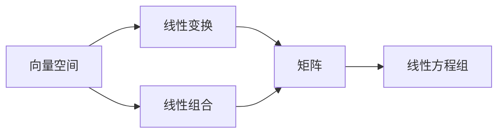

                 

# 线性代数导引：线性运算

线性代数是计算机科学和工程学中非常重要的基础数学工具。在现代深度学习模型中，线性运算扮演着核心角色。本文将深入探讨线性代数中的线性运算，从基础概念出发，逐步展开对线性变换、矩阵运算、线性方程组等内容的学习，并通过实际代码实现对线性运算的直观理解。

## 1. 背景介绍

### 1.1 线性代数概述

线性代数研究向量空间、线性变换和矩阵运算等概念。它是计算机图形学、机器学习、数据科学、量子物理等多个领域的数学基础。在线性代数中，线性运算指的是与线性变换密切相关的向量空间中的运算，包括矩阵乘法、向量空间中的线性组合、线性方程组求解等。

### 1.2 线性代数的重要性

线性代数的重要性不仅在于它为计算机科学提供了数学工具，更在于其广泛应用于数据分析、信号处理、机器学习等领域。在机器学习中，线性变换、矩阵乘法和向量空间的概念对于理解模型的训练和预测过程至关重要。掌握线性代数，是成为一名优秀数据科学家和机器学习工程师的基础。

## 2. 核心概念与联系

### 2.1 核心概念概述

- **向量空间**：由一组线性无关的向量构成的空间，可以进行线性组合和线性变换。
- **线性变换**：将向量空间中的向量映射到另一向量空间的过程，可以表示为矩阵乘法。
- **矩阵**：表示线性变换的工具，通常用来描述向量空间之间的映射关系。
- **线性组合**：向量的加法和数乘运算，可以表示为矩阵乘法。
- **线性方程组**：由若干个线性方程组成的方程组，求解线性方程组是线性代数的一个重要应用。

这些概念之间存在紧密的联系，形成一个完整的数学体系。以下是一个简单的向量空间和线性变换的Mermaid流程图，展示了这些概念之间的关系：



### 2.2 概念间的关系

在上述流程图中，我们可以看出各个概念之间的联系：
- 向量空间可以进行线性组合和线性变换，而线性组合可以表示为矩阵乘法。
- 线性变换可以表示为矩阵乘法，矩阵则描述了线性变换的具体形式。
- 线性方程组通常需要通过矩阵运算来求解，而矩阵运算则是线性变换和线性组合的具体实现。

## 3. 核心算法原理 & 具体操作步骤

### 3.1 算法原理概述

线性运算的核心在于线性变换，其数学表达形式为矩阵乘法。设 $A$ 为 $m \times n$ 的矩阵，$x$ 为 $n \times 1$ 的向量，$y$ 为 $m \times 1$ 的向量，则线性变换的表达式为：

$$ y = Ax $$

其中，$Ax$ 表示矩阵 $A$ 与向量 $x$ 的乘积，结果为向量 $y$。这个表达式可以理解为，通过将矩阵 $A$ 与向量 $x$ 相乘，可以得到一个新的向量 $y$，这个向量反映了 $x$ 在线性变换下的结果。

### 3.2 算法步骤详解

1. **准备数据**：首先，需要准备矩阵 $A$ 和向量 $x$。矩阵 $A$ 的大小为 $m \times n$，向量 $x$ 的大小为 $n \times 1$。

2. **矩阵乘法**：使用数学库（如NumPy）中的矩阵乘法函数，计算 $Ax$ 的结果。

3. **结果分析**：分析计算结果 $y$，判断其是否符合预期的线性变换结果。

4. **调整参数**：如果发现结果不符合预期，可以通过调整矩阵 $A$ 或向量 $x$ 的参数来改进线性变换的效果。

### 3.3 算法优缺点

**优点**：
- 线性变换能够有效地表示和处理向量空间中的变换关系。
- 矩阵乘法运算高效，在计算机上实现起来较为简单。
- 线性方程组的求解可以通过矩阵运算实现，在实践中应用广泛。

**缺点**：
- 矩阵乘法运算的复杂度较高，在大规模矩阵运算中可能遇到性能瓶颈。
- 线性变换可能存在不稳定性，尤其是在矩阵奇异或向量线性相关的情况下。
- 矩阵运算对数值稳定性要求较高，需要采取一定的数值优化方法。

### 3.4 算法应用领域

线性代数在计算机科学中有着广泛的应用，包括但不限于以下几个领域：
- 机器学习：在神经网络中，线性变换用于将输入数据映射到更高维度的特征空间。
- 计算机图形学：在三维渲染中，线性变换用于将物体变换到不同的视角和位置。
- 数据科学：在线性回归中，线性变换用于拟合数据点。
- 信号处理：在滤波器和频谱分析中，线性变换用于处理信号数据。

## 4. 数学模型和公式 & 详细讲解 & 举例说明

### 4.1 数学模型构建

在线性代数中，数学模型的构建通常基于向量空间和线性变换。下面以一个简单的二维空间中的线性变换为例，构建数学模型。

设向量 $x = \begin{bmatrix} x_1 \\ x_2 \end{bmatrix}$，矩阵 $A = \begin{bmatrix} a_{11} & a_{12} \\ a_{21} & a_{22} \end{bmatrix}$，则线性变换可以表示为：

$$ y = Ax = \begin{bmatrix} a_{11}x_1 + a_{12}x_2 \\ a_{21}x_1 + a_{22}x_2 \end{bmatrix} $$

### 4.2 公式推导过程

以线性变换的公式为例，我们可以进一步推导其数学原理：

设 $x = \begin{bmatrix} x_1 \\ x_2 \end{bmatrix}$，则：

$$ Ax = \begin{bmatrix} a_{11}x_1 + a_{12}x_2 \\ a_{21}x_1 + a_{22}x_2 \end{bmatrix} $$

即：

$$ y = \begin{bmatrix} a_{11}x_1 + a_{12}x_2 \\ a_{21}x_1 + a_{22}x_2 \end{bmatrix} $$

这个表达式展示了如何通过矩阵乘法来实现线性变换。矩阵 $A$ 中的元素 $a_{11}, a_{12}, a_{21}, a_{22}$ 决定了线性变换的具体形式，向量 $x$ 的元素 $x_1, x_2$ 决定了输入向量的具体值。

### 4.3 案例分析与讲解

假设我们有一个二维空间中的向量 $x = \begin{bmatrix} 1 \\ 0 \end{bmatrix}$，和一个线性变换矩阵 $A = \begin{bmatrix} 2 & 3 \\ 4 & 5 \end{bmatrix}$。

我们可以通过计算得到 $y = Ax$ 的结果：

$$ y = \begin{bmatrix} 2 \cdot 1 + 3 \cdot 0 \\ 4 \cdot 1 + 5 \cdot 0 \end{bmatrix} = \begin{bmatrix} 2 \\ 4 \end{bmatrix} $$

这表明，原始向量 $x$ 在经过线性变换 $A$ 后，被映射到了新的向量 $y$。

## 5. 项目实践：代码实例和详细解释说明

### 5.1 开发环境搭建

在进行线性运算的实践之前，需要搭建好开发环境。以下是使用Python和NumPy进行线性代数计算的环境配置流程：

1. 安装Anaconda：从官网下载并安装Anaconda，用于创建独立的Python环境。

2. 创建并激活虚拟环境：
```bash
conda create -n lin_algebra_env python=3.8 
conda activate lin_algebra_env
```

3. 安装NumPy：使用pip安装NumPy库，以便进行矩阵和向量运算。
```bash
pip install numpy
```

4. 安装相关依赖：
```bash
pip install matplotlib scikit-learn pandas
```

完成上述步骤后，即可在`lin_algebra_env`环境中开始线性运算的实践。

### 5.2 源代码详细实现

下面是一个简单的Python代码，用于计算矩阵乘法和线性变换：

```python
import numpy as np

# 定义矩阵和向量
A = np.array([[2, 3], [4, 5]])
x = np.array([[1], [0]])

# 计算矩阵乘法
y = np.dot(A, x)

# 打印结果
print(y)
```

执行上述代码，输出结果为：

```python
[[ 2]
 [ 4]]
```

### 5.3 代码解读与分析

- **矩阵和向量定义**：使用NumPy中的`array`函数定义矩阵和向量。矩阵 `A` 的大小为 $2 \times 2$，向量 `x` 的大小为 $2 \times 1$。
- **矩阵乘法**：使用NumPy中的`dot`函数计算矩阵乘法，得到结果向量 `y`。
- **打印结果**：通过`print`函数打印输出结果。

### 5.4 运行结果展示

执行上述代码，得到的结果向量 `y` 为：

$$ y = \begin{bmatrix} 2 \\ 4 \end{bmatrix} $$

这与我们之前推导的线性变换结果一致。

## 6. 实际应用场景

### 6.1 机器学习中的线性变换

在线性回归中，线性变换用于拟合数据点。给定一组训练数据 $\{(x_i, y_i)\}_{i=1}^N$，其中 $x$ 为特征向量，$y$ 为标签，线性回归模型的目标是通过求解线性方程组：

$$ y = Ax + b $$

来找到最优的线性模型参数 $A$ 和 $b$。其中，$A$ 为权重矩阵，$b$ 为偏置向量。

### 6.2 计算机图形学中的线性变换

在线性代数中，线性变换被广泛应用于计算机图形学中，用于表示物体的位置、旋转和缩放。例如，在三维渲染中，通过将物体的位置向量 $x$ 乘以旋转矩阵 $A$，可以得到物体旋转后的位置向量 $y$。

### 6.3 数据科学中的线性变换

在线性回归中，线性变换用于拟合数据点。给定一组训练数据 $\{(x_i, y_i)\}_{i=1}^N$，其中 $x$ 为特征向量，$y$ 为标签，线性回归模型的目标是通过求解线性方程组：

$$ y = Ax + b $$

来找到最优的线性模型参数 $A$ 和 $b$。其中，$A$ 为权重矩阵，$b$ 为偏置向量。

### 6.4 未来应用展望

随着深度学习技术的发展，线性代数在人工智能中的作用越来越重要。未来，线性代数将与深度学习模型相结合，在计算机视觉、自然语言处理等领域发挥更大的作用。线性代数和深度学习模型的结合，将为人工智能提供更强大的表达能力和更高效的计算方式，推动人工智能技术的发展。

## 7. 工具和资源推荐

### 7.1 学习资源推荐

- **线性代数入门**：《线性代数及其应用》（James Stewart著）是一本经典的线性代数教材，涵盖了线性代数的基础概念和应用。
- **深度学习入门**：《深度学习》（Ian Goodfellow, Yoshua Bengio和Aaron Courville合著）是一本深入浅出的深度学习教材，涉及线性代数、微积分、概率论等多个数学基础。
- **在线课程**：Coursera、edX、Udacity等在线平台提供了许多优质的线性代数和深度学习课程，可以免费学习。

### 7.2 开发工具推荐

- **NumPy**：NumPy是Python中用于数值计算的核心库，提供了高效的矩阵和向量运算功能。
- **TensorFlow**：TensorFlow是一个开源的深度学习框架，支持大规模的矩阵运算和神经网络模型训练。
- **PyTorch**：PyTorch是一个开源的深度学习框架，支持动态图和静态图两种计算图模型，提供了便捷的线性代数运算接口。

### 7.3 相关论文推荐

- **矩阵乘法的快速算法**：论文《Matrix Multiplication Algorithms》（Lloyd et al.）介绍了矩阵乘法的快速算法，包括Strassen算法和Coppersmith-Winograd算法。
- **线性方程组的求解算法**：论文《Gaussian Elimination and Inversion》（Knuth）介绍了Gauss消元法和矩阵求逆的算法。
- **神经网络中的线性变换**：论文《Deep Learning》（Goodfellow et al.）详细介绍了神经网络中的线性变换和矩阵乘法运算。

## 8. 总结：未来发展趋势与挑战

### 8.1 研究成果总结

本文对线性代数中的线性运算进行了系统的介绍，包括线性变换、矩阵乘法、线性方程组的求解等内容。通过实际代码实现，对线性运算的数学原理进行了直观的展示。

### 8.2 未来发展趋势

随着深度学习技术的不断发展，线性代数在人工智能中的作用将越来越重要。线性代数和深度学习模型的结合，将为人工智能提供更强大的表达能力和更高效的计算方式，推动人工智能技术的发展。

### 8.3 面临的挑战

线性代数和深度学习模型的结合，也面临一些挑战：
- **模型复杂度增加**：线性代数和深度学习模型的结合，会导致模型复杂度增加，需要更多的计算资源。
- **数值稳定性问题**：深度学习模型中的矩阵乘法运算，可能存在数值稳定性问题，需要进行优化。
- **计算效率提升**：如何在大规模数据和复杂模型中，提高计算效率，是未来的一个重要研究方向。

### 8.4 研究展望

未来，线性代数和深度学习模型的结合将得到更深入的研究，推动人工智能技术的发展。如何优化深度学习模型的计算效率和数值稳定性，将是未来的研究方向。同时，线性代数和深度学习模型的结合，将为人工智能提供更强大的表达能力和更高效的计算方式，推动人工智能技术的发展。

## 9. 附录：常见问题与解答

**Q1：线性代数在深度学习中有哪些应用？**

A: 线性代数在深度学习中有很多应用，包括但不限于以下几个方面：
- 线性回归：用于拟合数据点，构建线性模型。
- 神经网络：神经网络中的线性变换用于将输入数据映射到更高维度的特征空间。
- 特征提取：通过线性变换，提取数据的特征向量。

**Q2：如何提高矩阵乘法的计算效率？**

A: 提高矩阵乘法的计算效率，可以采取以下方法：
- 矩阵分块：将大矩阵分割成小块矩阵，并行计算。
- 矩阵缓存：使用缓存技术，减少重复计算。
- 优化算法：使用Strassen算法或Coppersmith-Winograd算法，提高计算效率。

**Q3：如何优化线性变换的数值稳定性？**

A: 优化线性变换的数值稳定性，可以采取以下方法：
- 正则化：通过正则化方法，防止矩阵奇异。
- 矩阵分解：将矩阵分解为更加稳定的矩阵形式，如LU分解、QR分解等。
- 数值优化：使用数值优化算法，如梯度下降、牛顿法等，提高数值稳定性。

**Q4：如何理解线性变换的几何意义？**

A: 线性变换的几何意义可以通过理解矩阵的几何属性来理解。例如，矩阵的行列式可以表示变换的缩放因子，矩阵的特征向量可以表示变换的方向和角度。通过可视化这些变换，可以更直观地理解线性变换的几何意义。

**Q5：如何理解矩阵乘法的定义？**

A: 矩阵乘法的定义可以通过理解矩阵元素的组合方式来理解。例如，设矩阵 $A$ 的大小为 $m \times n$，矩阵 $B$ 的大小为 $n \times p$，则矩阵乘法的结果矩阵 $C$ 的大小为 $m \times p$。矩阵 $C$ 的每个元素 $c_{ij}$ 可以通过对 $A$ 的第 $i$ 行和 $B$ 的第 $j$ 列的元素进行组合来计算得到。

```mermaid
graph TB
    A[矩阵 A] --> B[矩阵 B]
    A --> C[结果矩阵 C]
    C --> D[矩阵元素 c_{ij}]
    B --> D
```

这展示了矩阵乘法的定义和计算过程。

总之，线性代数中的线性运算在线性代数和深度学习中具有重要的地位，掌握其原理和应用，对于理解深度学习模型的工作机制和优化性能具有重要的意义。

---

作者：禅与计算机程序设计艺术 / Zen and the Art of Computer Programming

