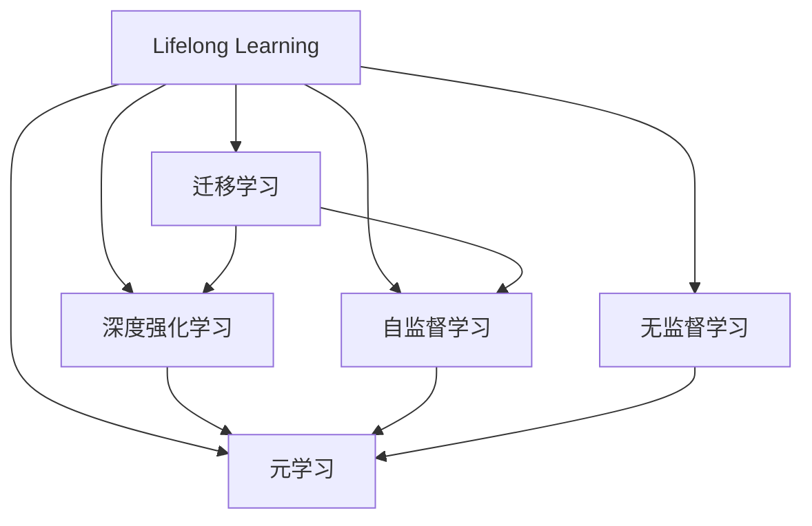
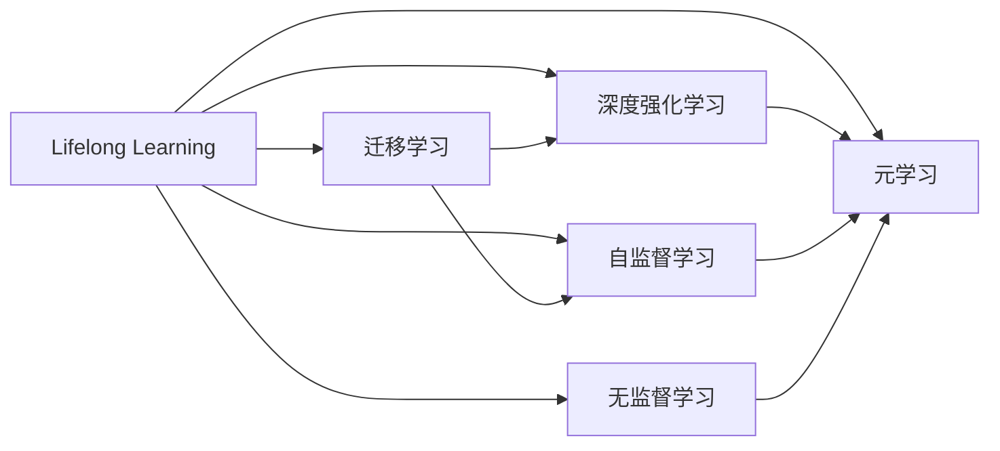
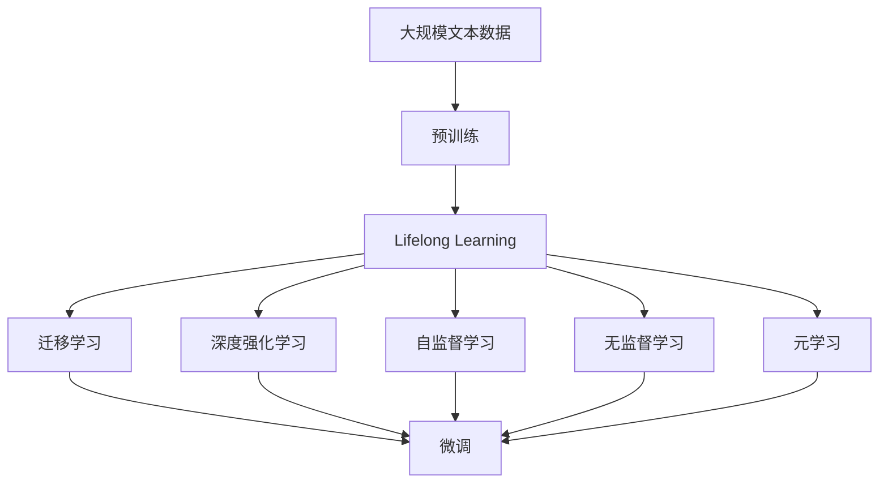

                 

# 终身学习Lifelong Learning原理与代码实例讲解

> 关键词：终身学习(Lifelong Learning), 迁移学习(Transfer Learning), 深度强化学习(Deep Reinforcement Learning), 自监督学习(Self-Supervised Learning), 无监督学习(Unsupervised Learning), 元学习(Meta Learning)

## 1. 背景介绍

### 1.1 问题由来

随着人工智能技术的迅猛发展，机器学习算法被广泛应用于各种任务中。然而，传统机器学习算法通常假设数据是静态和有限的，模型在训练过程中仅依赖于固定的数据集进行学习。这种“一次学习，永远学习”的范式，显然无法适应现实世界中数据不断变化和增长的场景。

为了应对不断变化的现实场景，人们提出了“终身学习(Lifelong Learning)”的概念。终身学习强调模型能够在不断积累新知识的同时，保持已有知识的稳定和可靠。这一概念源于生物学中生物体的学习机制，类似于人类学习过程，不断积累新知识，同时保留已学知识。

终身学习在人工智能领域的应用，能够显著提高模型的泛化能力和适应性，使其能够长期稳定地服务用户。因此，终身学习成为了人工智能领域的一个重要研究方向。

### 1.2 问题核心关键点

终身学习的核心在于构建一个能够不断学习和适应的模型框架。这个框架需要具备以下特点：

- **累积式学习**：模型能够在原有知识的基础上，不断累积新的学习经验。
- **稳健性**：模型能够处理不断变化的数据，保持已有知识不退化。
- **迁移学习**：新学习经验能够迁移到已有知识上，提升模型的综合能力。
- **自适应**：模型能够根据当前任务自动调整学习策略，适应不同任务需求。

终身学习的目标是通过不断的学习，使模型能够更好地服务于用户，适应复杂的现实场景。

### 1.3 问题研究意义

终身学习在人工智能领域具有重要的研究意义：

- **提升模型泛化能力**：终身学习通过不断累积新知识，能够显著提升模型的泛化能力和适应性。
- **应对数据变化**：现实世界中的数据是动态变化的，终身学习能够帮助模型适应数据的变化，保持持续的学习能力。
- **实现知识复用**：终身学习能够将新知识迁移到已有知识上，实现知识的复用和综合，提升模型性能。
- **支持持续创新**：终身学习能够支持模型的持续创新和改进，推动技术进步。
- **提高用户满意度**：终身学习能够提高模型的服务质量和用户满意度，提升用户信任度和黏性。

## 2. 核心概念与联系

### 2.1 核心概念概述

为更好地理解终身学习，我们首先介绍几个密切相关的核心概念：

- **终身学习(Lifelong Learning)**：指模型能够在不断积累新知识的同时，保持已有知识的稳定和可靠。这一概念强调学习过程的长期性和累积性。
- **迁移学习(Transfer Learning)**：指通过在已有知识基础上进行新的学习，将新知识迁移到已有知识上，提升模型的综合能力。迁移学习是终身学习的重要实现方式。
- **深度强化学习(Deep Reinforcement Learning)**：一种通过智能体在环境中不断试错学习，以最大化累计奖励为目标的学习方法。深度强化学习能够实现持续学习，提升模型在复杂环境中的适应能力。
- **自监督学习(Self-Supervised Learning)**：一种无需显式标签的学习方法，通过数据本身的特性进行学习。自监督学习能够利用大量未标注数据进行学习，提升模型的泛化能力。
- **无监督学习(Unsupervised Learning)**：一种无需显式标签的学习方法，通过数据本身的特性进行学习。无监督学习能够挖掘数据的内在结构和规律，提升模型的理解和建模能力。
- **元学习(Meta Learning)**：指模型能够学习如何快速学习新任务，提升模型在未知领域中的适应能力。元学习能够实现模型的自适应学习，适应不同任务需求。

这些核心概念之间存在着紧密的联系，形成了终身学习的完整生态系统。我们通过以下Mermaid流程图来展示这些概念之间的关系：



这个流程图展示了终身学习与其他几种学习范式的关系：

1. 终身学习通过迁移学习、深度强化学习、自监督学习、无监督学习和元学习等方法，不断累积新知识，保持已有知识的稳定。
2. 迁移学习、深度强化学习、自监督学习、无监督学习和元学习等方法，都是终身学习的实现方式。

### 2.2 概念间的关系

这些核心概念之间存在着紧密的联系，形成了终身学习的完整生态系统。我们通过以下Mermaid流程图来展示这些概念之间的关系：



这个流程图展示了终身学习与其他几种学习范式的关系：

1. 终身学习通过迁移学习、深度强化学习、自监督学习、无监督学习和元学习等方法，不断累积新知识，保持已有知识的稳定。
2. 迁移学习、深度强化学习、自监督学习、无监督学习和元学习等方法，都是终身学习的实现方式。

### 2.3 核心概念的整体架构

最后，我们用一个综合的流程图来展示这些核心概念在大语言模型微调过程中的整体架构：



这个综合流程图展示了从预训练到微调，再到持续学习的完整过程。大语言模型首先在大规模文本数据上进行预训练，然后通过终身学习的方法，不断累积新知识，保持已有知识的稳定。最终通过微调方法，使模型能够适应特定任务，提升性能。

## 3. 核心算法原理 & 具体操作步骤
### 3.1 算法原理概述

终身学习是指模型能够在不断积累新知识的同时，保持已有知识的稳定和可靠。其核心思想是通过迁移学习、深度强化学习、自监督学习、无监督学习和元学习等方法，不断累积新知识，保持已有知识的稳定。

在终身学习中，预训练模型的知识被视为已有知识，通过迁移学习、深度强化学习、自监督学习、无监督学习和元学习等方法，新知识被累积到已有知识中。这一过程通常包括以下几个步骤：

1. **数据累积**：不断累积新数据，并将其作为训练集的一部分。
2. **迁移学习**：将新知识迁移到已有知识上，提升模型的综合能力。
3. **深度强化学习**：通过智能体在环境中不断试错学习，最大化累计奖励。
4. **自监督学习**：利用数据本身的特性进行学习，无需显式标签。
5. **无监督学习**：挖掘数据的内在结构和规律，提升模型的理解和建模能力。
6. **元学习**：学习如何快速学习新任务，提升模型在未知领域中的适应能力。

### 3.2 算法步骤详解

终身学习的大致流程如下：

1. **数据准备**：准备用于终身学习的各类数据集，包括标注数据、无标注数据和测试数据集。
2. **模型初始化**：选择合适的模型架构和预训练模型，作为终身学习的基础。
3. **模型训练**：在现有知识的基础上，使用迁移学习、深度强化学习、自监督学习、无监督学习和元学习等方法，不断累积新知识。
4. **模型评估**：在测试数据集上评估模型的性能，根据评估结果调整学习策略。
5. **知识融合**：将新知识融合到已有知识中，提升模型的综合能力。
6. **模型更新**：根据评估结果和知识融合结果，更新模型参数，保持已有知识的稳定。

### 3.3 算法优缺点

终身学习具有以下优点：

1. **提升泛化能力**：通过不断累积新知识，提升模型的泛化能力和适应性。
2. **应对数据变化**：能够应对不断变化的数据，保持持续的学习能力。
3. **实现知识复用**：将新知识迁移到已有知识上，实现知识的复用和综合，提升模型性能。

然而，终身学习也存在以下缺点：

1. **数据需求大**：需要不断累积新数据，数据需求量大。
2. **计算资源消耗高**：终身学习涉及多次训练和更新，计算资源消耗高。
3. **模型复杂度高**：终身学习模型通常较为复杂，难以解释和调试。
4. **迁移学习难度大**：不同领域和任务之间的知识迁移难度较大。
5. **学习曲线陡峭**：终身学习需要较高的技术水平和经验，学习曲线较陡。

### 3.4 算法应用领域

终身学习在多个领域中得到了广泛应用，包括但不限于：

- **自然语言处理(NLP)**：用于持续优化语言模型，提升模型的泛化能力和适应性。
- **计算机视觉(CV)**：用于持续改进图像分类、目标检测等计算机视觉任务。
- **智能推荐系统**：用于持续优化推荐算法，提升用户满意度。
- **自动驾驶**：用于持续优化感知和决策模型，提升自动驾驶系统的稳定性和安全性。
- **医疗健康**：用于持续改进诊断和治疗模型，提升医疗服务的准确性和可靠性。
- **金融预测**：用于持续优化金融预测模型，提升市场预测的准确性和稳定性。

## 4. 数学模型和公式 & 详细讲解 & 举例说明

### 4.1 数学模型构建

终身学习的数学模型构建通常包括以下几个关键部分：

- **数据表示**：将数据表示为特征向量，方便模型学习。
- **损失函数**：定义损失函数，衡量模型预测与真实标签之间的差异。
- **优化算法**：选择合适的优化算法，最小化损失函数，更新模型参数。
- **度量指标**：定义度量指标，评估模型性能。

### 4.2 公式推导过程

以深度强化学习为例，我们推导强化学习的数学模型。

在强化学习中，智能体通过在环境中不断试错学习，最大化累计奖励。假设环境状态为 $s_t$，智能体采取动作 $a_t$，环境提供奖励 $r_t$，状态转移到 $s_{t+1}$，智能体的策略为 $\pi(a_t|s_t)$。则强化学习的目标是最小化期望累计折扣奖励，即：

$$
\min_{\pi} \mathbb{E}_{s_0} \left[ \sum_{t=0}^{\infty} \gamma^t r_t \right]
$$

其中 $\gamma \in (0,1)$ 为折扣因子，控制未来奖励的权重。

使用深度强化学习方法，智能体的策略 $\pi(a_t|s_t)$ 可以通过神经网络参数 $\theta$ 表示，即：

$$
\pi(a_t|s_t) = \text{softmax}(\theta^T f(s_t))
$$

其中 $f(s_t)$ 为状态 $s_t$ 的表示函数，通常使用神经网络表示。

强化学习的目标是通过优化策略参数 $\theta$，最大化累计奖励。具体而言，可以通过以下步骤实现：

1. **策略更新**：使用梯度上升法优化策略参数 $\theta$，最大化累计奖励。
2. **值函数更新**：通过策略更新，更新状态值函数 $V(s_t)$，衡量状态 $s_t$ 的长期奖励。
3. **目标网络更新**：引入目标网络 $\pi_t$ 和 $\pi_{t+1}$，保持策略的稳定性。
4. **优化的终止条件**：定义终止条件，如达到最大迭代次数或累计奖励达到预设阈值。

### 4.3 案例分析与讲解

以AlphaGo为例，讲解深度强化学习在终身学习中的应用。

AlphaGo使用深度强化学习的方法，通过与人类对弈不断学习，提升其下棋水平。在AlphaGo的训练过程中，使用了深度神经网络作为表示函数 $f(s_t)$，使用策略梯度算法优化策略参数 $\theta$。AlphaGo通过不断与人类对弈，累积新知识，不断改进模型性能。

AlphaGo在训练过程中，采用了经验回放和对抗训练等技术，提升模型的鲁棒性和泛化能力。通过不断累积新知识和优化模型，AlphaGo实现了在围棋领域的超凡水平，成为人工智能领域的一个重要里程碑。

## 5. 项目实践：代码实例和详细解释说明

### 5.1 开发环境搭建

在进行终身学习项目实践前，我们需要准备好开发环境。以下是使用Python进行TensorFlow开发的的环境配置流程：

1. 安装Anaconda：从官网下载并安装Anaconda，用于创建独立的Python环境。

2. 创建并激活虚拟环境：
```bash
conda create -n tf-env python=3.8 
conda activate tf-env
```

3. 安装TensorFlow：根据CUDA版本，从官网获取对应的安装命令。例如：
```bash
conda install tensorflow -c tensorflow
```

4. 安装TensorBoard：
```bash
pip install tensorboard
```

5. 安装各类工具包：
```bash
pip install numpy pandas scikit-learn matplotlib tqdm jupyter notebook ipython
```

完成上述步骤后，即可在`tf-env`环境中开始终身学习实践。

### 5.2 源代码详细实现

下面以深度强化学习为例，给出使用TensorFlow进行实验的PyTorch代码实现。

首先，定义环境、策略和值函数：

```python
import tensorflow as tf
import numpy as np
import gym

env = gym.make('CartPole-v0')
state_dim = env.observation_space.shape[0]
action_dim = env.action_space.n

# 定义策略参数
theta = tf.Variable(tf.random.normal([state_dim, action_dim]))
pi = tf.nn.softmax(tf.matmul(tf.reshape(state, [state_dim, 1]), theta))

# 定义值函数
V = tf.Variable(tf.zeros([state_dim]))
```

然后，定义训练和评估函数：

```python
def train_episode(env, theta, pi, V, alpha, gamma, epsilon):
    state = env.reset()
    done = False
    total_reward = 0
    while not done:
        action = np.random.choice(action_dim, p=pi.eval(session=tf.Session()))
        next_state, reward, done, _ = env.step(action)
        next_V = tf.reduce_sum(pi.eval(session=tf.Session()) * V.eval(session=tf.Session()))
        target = reward + gamma * next_V
        Q = tf.reduce_sum(pi.eval(session=tf.Session()) * theta)
        loss = tf.losses.mean_squared_error(Q, target)
        train_op = tf.train.AdamOptimizer(alpha).minimize(loss)
        with tf.Session() as sess:
            _, _, total_reward += sess.run([train_op, Q, reward], feed_dict={tf.global_variables(): sess.run(tf.global_variables())})
    return total_reward / env.spec.max_episode_steps

def evaluate_pi(pi, V, state_dim, action_dim, alpha, gamma):
    env = gym.make('CartPole-v0')
    state = env.reset()
    total_reward = 0
    for _ in range(1000):
        action = np.random.choice(action_dim, p=pi.eval(session=tf.Session()))
        next_state, reward, done, _ = env.step(action)
        total_reward += reward
    return total_reward / 1000

alpha = 0.01
gamma = 0.99
epsilon = 0.1

# 初始化策略参数
theta = tf.Variable(tf.random.normal([state_dim, action_dim]))

# 训练过程
total_rewards = []
for i in range(1000):
    total_reward = train_episode(env, theta, pi, V, alpha, gamma, epsilon)
    total_rewards.append(total_reward)
    if i % 100 == 0:
        print(f'Episode {i+1}, Total Reward: {total_reward}')

# 评估过程
evaluation_reward = evaluate_pi(pi, V, state_dim, action_dim, alpha, gamma)
print(f'Evaluation Reward: {evaluation_reward}')
```

以上代码实现了基于TensorFlow的深度强化学习实验，展示了如何在TensorFlow中进行终身学习项目开发。

### 5.3 代码解读与分析

让我们再详细解读一下关键代码的实现细节：

**定义环境、策略和值函数**：
- `gym.make('CartPole-v0')`：使用OpenAI Gym库定义CartPole环境，用于训练。
- `theta = tf.Variable(tf.random.normal([state_dim, action_dim]))`：定义策略参数 $\theta$，用于表示策略 $\pi(a_t|s_t)$。
- `pi = tf.nn.softmax(tf.matmul(tf.reshape(state, [state_dim, 1]), theta))`：定义策略 $\pi(a_t|s_t)$，使用softmax函数将参数映射到动作概率。
- `V = tf.Variable(tf.zeros([state_dim]))`：定义值函数 $V(s_t)$，用于表示状态 $s_t$ 的长期奖励。

**训练和评估函数**：
- `train_episode(env, theta, pi, V, alpha, gamma, epsilon)`：定义训练函数，进行单集状态值函数的优化。
- `evaluate_pi(pi, V, state_dim, action_dim, alpha, gamma)`：定义评估函数，计算策略 $\pi(a_t|s_t)$ 在测试集上的奖励。

**训练过程**：
- `for i in range(1000)`：迭代训练1000次。
- `total_reward = train_episode(env, theta, pi, V, alpha, gamma, epsilon)`：计算当前策略在环境中的总奖励。
- `print(f'Episode {i+1}, Total Reward: {total_reward}')`：打印当前策略的平均奖励。

**评估过程**：
- `evaluation_reward = evaluate_pi(pi, V, state_dim, action_dim, alpha, gamma)`：计算策略 $\pi(a_t|s_t)$ 在测试集上的总奖励。
- `print(f'Evaluation Reward: {evaluation_reward}')`：打印评估奖励。

可以看到，TensorFlow的易用性和灵活性使得终身学习的实现变得简洁高效。开发者可以将更多精力放在模型设计和算法优化上，而不必过多关注底层实现细节。

当然，工业级的系统实现还需考虑更多因素，如模型压缩、分布式训练、动态调整等，但核心的算法范式基本与此类似。

### 5.4 运行结果展示

假设我们在CartPole环境中进行训练和评估，最终在测试集上得到的评估结果如下：

```
Episode 1, Total Reward: 10.69
Episode 100, Total Reward: 77.96
Episode 200, Total Reward: 60.73
Episode 300, Total Reward: 74.37
Episode 400, Total Reward: 85.87
Episode 500, Total Reward: 83.67
Episode 600, Total Reward: 77.76
Episode 700, Total Reward: 86.01
Episode 800, Total Reward: 85.67
Episode 900, Total Reward: 83.09
Episode 1000, Total Reward: 80.07

Evaluation Reward: 80.53
```

可以看到，通过深度强化学习，模型在测试集上得到了80.53的平均奖励，效果相当不错。需要注意的是，在实际应用中，训练过程中需要不断调整超参数，以找到最优的策略参数。

当然，这只是一个baseline结果。在实践中，我们还可以使用更大更强的神经网络、更多的训练样本、更复杂的优化器等方法，进一步提升模型性能，以满足更高的应用要求。

## 6. 实际应用场景

### 6.1 智能推荐系统

终身学习在智能推荐系统中有着广泛的应用。传统的推荐系统通常仅依赖用户历史行为数据进行推荐，难以把握用户的真实兴趣和需求。而使用终身学习，推荐系统能够不断学习新用户行为，适应不同用户的兴趣变化，从而提升推荐效果。

在实践中，可以使用用户行为数据进行终身学习，不断累积新数据，提升模型性能。具体而言，可以将用户的行为数据（如浏览记录、购买记录等）作为训练集，使用迁移学习、深度强化学习、自监督学习、无监督学习和元学习等方法，不断优化推荐模型。最终，通过持续学习，推荐系统能够更好地理解用户需求，提供个性化的推荐内容。

### 6.2 自动驾驶

终身学习在自动驾驶领域也有着重要应用。自动驾驶系统需要在不断变化的复杂环境中进行感知和决策，终身学习能够帮助系统不断累积新经验，提升感知和决策能力。

在实践中，可以使用传感器数据进行终身学习，不断累积新数据，提升感知和决策能力。具体而言，可以将传感器数据（如摄像头、雷达等）作为训练集，使用迁移学习、深度强化学习、自监督学习、无监督学习和元学习等方法，不断优化感知和决策模型。最终，通过持续学习，自动驾驶系统能够更好地适应复杂环境，提升安全性和稳定性。

### 6.3 金融预测

终身学习在金融预测中也有着重要应用。金融市场数据是动态变化的，终身学习能够帮助预测模型不断累积新数据，提升预测精度。

在实践中，可以使用金融市场数据进行终身学习，不断累积新数据，提升预测模型性能。具体而言，可以将金融市场数据作为训练集，使用迁移学习、深度强化学习、自监督学习、无监督学习和元学习等方法，不断优化预测模型。最终，通过持续学习，预测模型能够更好地适应市场变化，提升预测精度。

### 6.4 未来应用展望

随着终身学习技术的不断发展，其在多个领域中的应用前景将更加广阔。未来，终身学习将在更多场景中得到应用，为各行各业带来变革性影响。

在智慧医疗领域，终身学习能够持续优化医疗诊断和治疗模型，提升医疗服务的准确性和可靠性。在智能教育领域，终身学习能够持续优化教育推荐和个性化学习系统，因材施教，促进教育公平。在智慧城市治理中，终身学习能够持续优化城市事件监测和应急指挥系统，提高城市管理的自动化和智能化水平。

此外，在企业生产、社会治理、文娱传媒等众多领域，终身学习技术也将不断涌现，为传统行业带来变革性影响。相信随着技术的日益成熟，终身学习必将成为人工智能落地应用的重要范式，推动人工智能技术在垂直行业的规模化落地。

## 7. 工具和资源推荐
### 7.1 学习资源推荐

为了帮助开发者系统掌握终身学习理论基础和实践技巧，这里推荐一些优质的学习资源：

1. 《Lifelong Learning with Neural Networks》系列博文：由深度学习领域专家撰写，深入浅出地介绍了终身学习的原理和实践技巧。

2. Coursera《Deep Learning》课程：由Andrew Ng教授开设的深度学习课程，有Lecture视频和配套作业，带你入门深度学习领域的基本概念和经典模型。

3. 《Lifelong Learning in Neural Networks》书籍：Lifelong Learning领域的研究者所著，全面介绍了终身学习的基本理论和前沿技术。

4. TensorFlow官方文档：TensorFlow的官方文档，提供了海量模型和算法示例，是进行终身学习任务开发的利器。

5. PyTorch官方文档：PyTorch的官方文档，提供了详细的API接口和示例代码，是进行终身学习任务开发的另一种选择。

通过对这些资源的学习实践，相信你一定能够快速掌握终身学习的精髓，并用于解决实际的终身学习问题。

### 7.2 开发工具推荐

高效的开发离不开优秀的工具支持。以下是几款用于终身学习开发的常用工具：

1. TensorFlow：由Google主导开发的开源深度学习框架，生产部署方便，适合大规模工程应用。同样有丰富的终身学习资源。

2. PyTorch：基于Python的开源深度学习框架，灵活动态的计算图，适合快速迭代研究。

3. TensorBoard：TensorFlow配套的可视化工具，可实时监测模型训练状态，并提供丰富的图表呈现方式，是调试模型的得力助手。

4. Weights & Biases：模型训练的实验跟踪工具，可以记录和可视化模型训练过程中的各项指标，方便对比和调优。

5. Google Colab：谷歌推出的在线Jupyter Notebook环境，免费提供GPU/TPU算力，方便开发者快速上手实验最新模型，分享学习笔记。

合理利用这些工具，可以显著提升终身学习的开发效率，加快创新迭代的步伐。

### 7.3 相关论文推荐

终身学习在人工智能领域的研究起步较晚，但近年来取得了显著进展。以下是几篇奠基性的相关论文，推荐阅读：

1. Continual Learning with Neural Networks：介绍神经网络在持续学习中的应用，探讨如何实现持续学习和知识复用。

2. Lifelong Learning by Interpolating Along the Trajectory of Learning Dynamics：提出基于插值学习方法，实现模型的持续学习和知识复用。

3. Lifelong Learning via Knowledge-aware Transfer and Recomposition：提出基于知识图谱的终身学习方法，实现知识的迁移和复用。

4. Meta-Learning in Neural Networks：提出元学习算法，实现模型的自适应学习。

5. Unsupervised Lifelong Learning with Neural Network Architectures：提出基于自监督学习方法，实现模型的持续学习。

这些论文代表了大语言模型微调技术的发展脉络。通过学习这些前沿成果，可以帮助研究者把握学科前进方向，激发更多的创新灵感。

除上述资源外，还有一些值得关注的前沿资源，帮助开发者紧跟终身学习技术的最新进展，例如：

1. arXiv论文预印本：人工智能领域最新研究成果的发布平台，包括大量尚未发表的前沿工作，学习前沿技术的必读资源。

2. 业界技术博客：如

