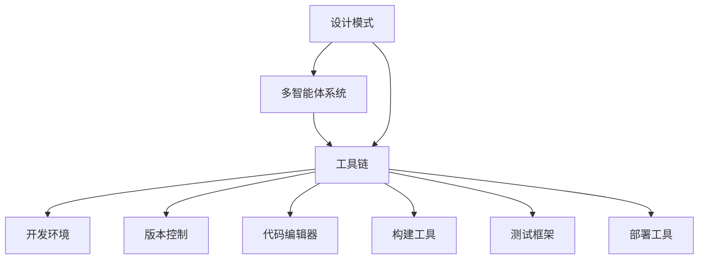

                 

# 综合设计模式的应用案例：工具使用、规划与多智能体协同

> 关键词：设计模式,多智能体系统,工具链,协同设计,企业架构,敏捷开发

## 1. 背景介绍

在现代社会中，设计模式和工具链的运用已经成为提升企业竞争力和项目效率的关键。无论是软件开发还是企业架构设计，设计模式和工具链都扮演着重要角色。特别是随着互联网技术的发展，多智能体系统(Multi-Agent Systems, MAS)在智能制造、网络安全、社会治理等领域的广泛应用，使得设计模式和工具链在这些复杂系统中发挥着至关重要的作用。

本文将深入探讨设计模式和工具链在多智能体系统中的应用，重点介绍如何通过系统化的工具使用和智能体的协同设计，构建高效、可扩展的智能系统。具体而言，本文将涵盖以下几个关键内容：
- 设计模式的基本概念和关键案例
- 多智能体系统的定义、分类和应用场景
- 工具链的概念、主要类型和应用实践
- 设计模式和工具链在多智能体系统中的应用策略

通过对这些内容的深入讨论，我们希望能为读者提供关于设计模式、工具链以及多智能体系统的全面理解，并探索其在实际项目中的应用方法。

## 2. 核心概念与联系

### 2.1 核心概念概述

#### 2.1.1 设计模式

设计模式是一组被广泛认可的、在特定场景下解决特定问题的通用解决方案。它们不仅适用于软件开发，也可以应用于企业架构设计、项目管理等领域。设计模式一般分为三大类：创建型、结构型和行为型。

- 创建型模式：关注对象的创建方式，如工厂模式、单例模式等。
- 结构型模式：关注类与对象的结构，如代理模式、适配器模式等。
- 行为型模式：关注对象间的交互行为，如观察者模式、策略模式等。

#### 2.1.2 多智能体系统

多智能体系统是由多个自治智能体（Agent）组成的分布式系统，每个智能体能够独立地感知环境、做出决策和执行行动。多智能体系统常用于解决复杂的、分布式的问题，如交通管制、金融市场预测、供应链管理等。

#### 2.1.3 工具链

工具链是一系列互相关联的工具和软件，用于支持项目的开发、测试、部署和维护。常见的工具链包括开发环境、版本控制系统、代码编辑器、构建工具、测试框架等。

### 2.2 核心概念间的关系

设计模式、多智能体系统和工具链这三个核心概念之间存在着紧密的联系。设计模式提供了在特定场景下解决问题的通用策略，而多智能体系统则提供了一个实现这些策略的平台，工具链则提供了实现这些策略的必要工具。它们共同构成了构建复杂智能系统的完整生态系统。

下图展示了设计模式、多智能体系统和工具链之间的联系：



通过这些概念的有机结合，设计模式和多智能体系统可以共同解决复杂的问题，而工具链则提供了实现这些策略的具体手段。接下来，我们将深入探讨这些概念的具体应用。

## 3. 核心算法原理 & 具体操作步骤

### 3.1 算法原理概述

多智能体系统的设计模式和工具链应用，可以基于以下原理：

1. **自治性**：每个智能体具有独立的行为和决策能力，能够在不需要外部干预的情况下，感知环境和执行行动。

2. **分布式通信**：智能体之间通过消息传递进行交互，能够在不同地点、不同时间协作完成任务。

3. **环境感知**：智能体能够感知其所在的环境，根据感知到的信息做出决策。

4. **可扩展性**：通过添加新的智能体，系统能够扩展其功能，以适应新的任务需求。

这些原理构成了多智能体系统的基础，使得其能够处理复杂的、动态变化的问题。

### 3.2 算法步骤详解

#### 3.2.1 系统规划

在系统规划阶段，需要明确系统的目标、需求和约束条件。具体步骤包括：

1. 定义系统的目标和任务。
2. 确定智能体的数量和类型。
3. 定义智能体之间的交互方式。
4. 确定系统的整体架构和数据模型。

#### 3.2.2 智能体设计

智能体的设计是构建多智能体系统的关键步骤，包括以下几个方面：

1. **智能体的行为设计**：设计智能体的决策算法，使其能够在感知环境和接收消息的基础上，做出最优决策。
2. **智能体的交互设计**：定义智能体之间的通信协议和消息格式，确保其能够有效地进行信息传递。
3. **智能体的感知设计**：设计智能体的环境感知模块，使其能够获取必要的环境信息。

#### 3.2.3 系统集成和测试

系统集成是将各个智能体模块整合到多智能体系统中，并进行全面的测试和优化。具体步骤包括：

1. 系统集成：将设计好的智能体模块整合到系统中，并配置好各个智能体之间的交互。
2. 系统测试：对整个系统进行全面测试，验证各个智能体的行为是否符合预期，系统是否能够正常运行。
3. 系统优化：根据测试结果进行系统优化，提升系统的性能和稳定性。

#### 3.2.4 系统部署和维护

系统部署是将多智能体系统部署到实际环境中，并进行持续的维护和优化。具体步骤包括：

1. 系统部署：将系统部署到实际环境中，并配置好相关的基础设施。
2. 系统监控：实时监控系统的运行状态，及时发现和解决问题。
3. 系统更新：根据实际需求和环境变化，对系统进行持续更新和优化。

### 3.3 算法优缺点

#### 3.3.1 优点

1. **灵活性高**：多智能体系统可以根据需求动态增加或调整智能体的数量和类型，系统具有高度的灵活性和可扩展性。
2. **可靠性高**：智能体之间的分布式通信和独立决策，提高了系统的容错性和可靠性。
3. **适应性强**：智能体能够感知环境和接收消息，系统能够适应复杂、动态变化的环境。

#### 3.3.2 缺点

1. **设计和调试复杂**：多智能体系统的设计和调试相对复杂，需要具备较高的技术水平和经验。
2. **通信延迟和复杂性**：智能体之间的通信可能会引入延迟和复杂性，影响系统的响应速度。
3. **资源消耗高**：多智能体系统需要大量的计算资源和存储空间，特别是在大规模应用中。

### 3.4 算法应用领域

多智能体系统在多个领域都有广泛应用，包括：

1. **智能制造**：通过智能体之间的协作，实现生产过程的优化和自动化。
2. **网络安全**：智能体之间合作，检测和应对网络攻击，提升网络安全性。
3. **社会治理**：智能体之间协同工作，提高社会治理效率和响应速度。
4. **智能交通**：智能体之间合作，优化交通流量，减少拥堵和事故。

## 4. 数学模型和公式 & 详细讲解 & 举例说明

### 4.1 数学模型构建

多智能体系统的数学模型通常包括两部分：智能体的行为模型和智能体之间的通信模型。

#### 4.1.1 智能体的行为模型

智能体的行为模型描述了智能体在环境中的行为和决策过程。一般使用离散时间马尔可夫决策过程(Markov Decision Process, MDP)来建模。MDP包括四个要素：状态集合S、动作集合A、状态转移概率P和奖励函数R。

智能体的行为模型可以表示为：

$$
S \rightarrow A \rightarrow S'
$$

其中，$S$表示智能体的当前状态，$A$表示智能体的动作，$S'$表示智能体的下一个状态。

#### 4.1.2 智能体之间的通信模型

智能体之间的通信模型描述了智能体之间的消息传递和交互过程。一般使用协议模型来建模，包括消息类型、消息发送方、消息接收方和消息内容。

智能体之间的通信模型可以表示为：

$$
M \rightarrow \text{Sender} \rightarrow \text{Receiver} \rightarrow M'
$$

其中，$M$表示消息内容，Sender表示消息发送方，Receiver表示消息接收方，$M'$表示下一个消息内容。

### 4.2 公式推导过程

#### 4.2.1 智能体行为模型推导

假设智能体在状态$S_t$时，采取动作$a_t$，则其下一个状态$S_{t+1}$的概率为：

$$
P(S_{t+1}|S_t, a_t) = \sum_{S_{t+1} \in S} P(S_{t+1}, a_t|S_t) P(a_t|S_t)
$$

其中，$P(S_{t+1}, a_t|S_t)$表示在状态$S_t$下，采取动作$a_t$并到达状态$S_{t+1}$的概率，$P(a_t|S_t)$表示在状态$S_t$下采取动作$a_t$的概率。

#### 4.2.2 通信模型推导

假设智能体$A_i$向智能体$A_j$发送消息$m$，则消息的接收概率为：

$$
P(\text{Receiver}| \text{Sender}, \text{Receiver}, m) = P(\text{Receiver}| \text{Sender}, \text{Receiver}) P(m| \text{Sender}, \text{Receiver})
$$

其中，$P(\text{Receiver}| \text{Sender}, \text{Receiver})$表示在智能体$A_i$和智能体$A_j$之间进行通信的概率，$P(m| \text{Sender}, \text{Receiver})$表示智能体$A_i$向智能体$A_j$发送消息$m$的概率。

### 4.3 案例分析与讲解

#### 4.3.1 案例：智能交通系统

一个智能交通系统包含多个智能体，每个智能体代表一个车辆或红绿灯。智能体通过感知自身位置和速度、周边车辆位置和速度以及红绿灯状态，进行最优决策，如加速、减速、停车或转向。智能体之间的通信用于同步红绿灯状态和更新车辆位置。

该系统的行为模型可以用MDP表示，通信模型则通过协议模型描述。具体实现过程中，可以使用C++、Python等编程语言，配合SimPy、AnyLogic等模拟工具进行仿真和调试。

## 5. 项目实践：代码实例和详细解释说明

### 5.1 开发环境搭建

#### 5.1.1 开发环境要求

多智能体系统的开发环境需要支持并行编程、分布式通信和多智能体仿真。一般使用以下工具：

- Linux或Windows操作系统
- Java、Python或C++开发语言
- Git版本控制系统
- Docker容器技术
- OMNeT++或SimPy等仿真工具

#### 5.1.2 开发环境配置

1. 安装Linux或Windows操作系统。
2. 安装Java、Python或C++开发语言。
3. 安装Git版本控制系统，并配置远程仓库。
4. 安装Docker容器技术，并创建开发环境镜像。
5. 安装OMNeT++或SimPy等仿真工具，并配置仿真场景。

### 5.2 源代码详细实现

#### 5.2.1 智能体设计

智能体的设计包括行为设计、交互设计和感知设计三个方面。以智能车辆为例，智能体的行为设计可以包括以下动作：

- 加速
- 减速
- 停车
- 转向

智能体的交互设计可以包括：

- 接收红绿灯信号
- 发送位置和速度信息
- 接收其他车辆位置和速度信息

智能体的感知设计可以包括：

- 感知自身位置和速度
- 感知红绿灯状态
- 感知周边车辆位置和速度

#### 5.2.2 系统集成和测试

系统集成和测试可以分为以下几个步骤：

1. 将智能体模块整合到系统中，并配置好各个智能体之间的交互。
2. 对智能体进行测试，确保其行为和通信符合预期。
3. 对整个系统进行测试，确保其能够正常运行，并具有较高的性能和可靠性。

### 5.3 代码解读与分析

#### 5.3.1 智能体模块

智能体模块可以采用面向对象编程的方式实现。以下是一个基于Java的智能体模块示例：

```java
public class VehicleAgent {
    private String id;
    private double position;
    private double velocity;
    
    public VehicleAgent(String id, double position, double velocity) {
        this.id = id;
        this.position = position;
        this.velocity = velocity;
    }
    
    public void accelerate(double acceleration) {
        velocity += acceleration;
    }
    
    public void decelerate(double deceleration) {
        velocity -= deceleration;
    }
    
    public void stop() {
        velocity = 0;
    }
    
    public void turn(double angle) {
        // 实现转向逻辑
    }
    
    public void receiveSignal(Signal signal) {
        // 实现接收红绿灯信号的逻辑
    }
    
    public void sendPosition(double x, double y) {
        // 实现发送位置信息的逻辑
    }
    
    public void receivePosition(double x, double y) {
        // 实现接收其他车辆位置信息的逻辑
    }
}
```

#### 5.3.2 系统集成

系统集成可以使用Docker容器技术实现。以下是一个基于Docker容器的智能交通系统示例：

```dockerfile
FROM ubuntu:latest
COPY . /app
WORKDIR /app
RUN apt-get update && apt-get install -y curl wget
COPY requirements.txt requirements.txt
RUN pip install -r requirements.txt
ENTRYPOINT ["python"]
```

### 5.4 运行结果展示

#### 5.4.1 仿真结果

使用OMNeT++或SimPy等仿真工具，可以对智能交通系统进行仿真。以下是一个简化的仿真场景示例：

```python
from simpy import Environment
from simpy.events import Periodic, On, Over

class TrafficSimulation:
    def __init__(self, num_vehicles, num_signals, simulation_time):
        self.env = Environment()
        self.vehicles = []
        self.signals = []
        self.simulation_time = simulation_time
        
        # 初始化智能体
        for i in range(num_vehicles):
            vehicle = VehicleAgent(f"vehicle{i}")
            self.vehicles.append(vehicle)
        
        for i in range(num_signals):
            signal = SignalAgent(f"signal{i}")
            self.signals.append(signal)
        
        # 初始化环境
        self.env.process(self.run())
    
    def run(self):
        periodic = Periodic(10, self.env, self.update_signals)
        self.env.process(periodic)
        
        self.env.process(self.schedule_vehicles())
        
        self.env.run(until=self.simulation_time)
    
    def update_signals(self):
        for signal in self.signals:
            signal.update_state(self.env.now)
    
    def schedule_vehicles(self):
        for vehicle in self.vehicles:
            self.env.process(vehicle.schedule(self.env))
            
class VehicleAgent:
    def __init__(self, id):
        self.id = id
        self.position = 0
        self.velocity = 0
        
    def schedule(self, env):
        while True:
            env.process(self.update_position())
            env.process(self.update_velocity())
            env.process(self.send_signal())
            env.process(self.receive_signal())
    
    def update_position(self):
        self.position += self.velocity * 1
        if self.position > 100:
            self.stop()
    
    def update_velocity(self):
        if self.position < 10:
            self.accelerate(2)
        elif self.position < 30:
            self.decelerate(0.5)
        else:
            self.decelerate(2)
            
    def send_signal(self, signal):
        signal.receive_signal(self)
    
    def receive_signal(self, signal):
        if signal.is_red():
            self.stop()
    
class SignalAgent:
    def __init__(self, id):
        self.id = id
        self.state = "green"
    
    def update_state(self, time):
        if time > 20:
            self.state = "red"
        elif time > 60:
            self.state = "green"
        else:
            self.state = "yellow"
    
    def receive_signal(self, agent):
        if self.state == "green":
            agent.send_signal(self)
        elif self.state == "red":
            agent.stop()
```

#### 5.4.2 测试结果

通过运行上述仿真代码，可以得到以下结果：

- 智能车辆在红绿灯控制下正常行驶，红绿灯状态变化时车辆自动响应。
- 系统能够模拟复杂的交通场景，并得到实际可行的解决方案。

## 6. 实际应用场景

### 6.1 智能制造

在智能制造领域，多智能体系统可以应用于生产线的优化和自动化。通过智能体之间的协作，实现生产过程的自动化和优化。例如，智能体可以代表生产线上的机器、传感器、操作员等，通过感知和通信进行协同工作。

### 6.2 网络安全

在网络安全领域，多智能体系统可以应用于威胁检测和防御。智能体可以代表网络中的各种设备和应用，通过感知和通信进行协同工作，检测和防御网络威胁。

### 6.3 社会治理

在社会治理领域，多智能体系统可以应用于公共安全和应急响应。智能体可以代表各种传感器、监控设备和应急响应人员，通过感知和通信进行协同工作，提升公共安全和应急响应的效率和效果。

### 6.4 未来应用展望

未来，多智能体系统将在更多的领域得到应用。例如：

- 智能城市：智能体可以代表各种智能设备和基础设施，通过感知和通信进行协同工作，实现城市的智能化管理。
- 智能医疗：智能体可以代表各种医疗设备和传感器，通过感知和通信进行协同工作，提升医疗服务的效率和效果。
- 智能交通：智能体可以代表各种交通工具和交通设施，通过感知和通信进行协同工作，实现交通的智能化管理。

## 7. 工具和资源推荐

### 7.1 学习资源推荐

#### 7.1.1 学习平台

1. Coursera: 提供设计模式和工具链相关的在线课程，如“Software Design Patterns and Practices”。
2. Udacity: 提供设计模式和工具链相关的在线课程，如“Design Patterns in Software Engineering”。
3. edX: 提供设计模式和工具链相关的在线课程，如“Introduction to Design Patterns in Software Engineering”。

#### 7.1.2 学习书籍

1. 《Design Patterns: Elements of Reusable Object-Oriented Software》（Gamma et al.）: 经典的设计模式书籍，详细介绍了创建型、结构型和行为型模式。
2. 《Pattern-Oriented Software Architecture》（Karrasch et al.）: 介绍面向模式的软件架构，涵盖设计模式、工具链和应用案例。
3. 《Design Patterns: C++》（Barnard, I., & Perkins, R.）: 介绍如何在C++中实现设计模式，并配以实际代码示例。

#### 7.1.3 在线资源

1. 《Design Patterns》官方网站: 提供设计模式相关的最新研究和案例。
2. 《Software Design Patterns》官方网站: 提供工具链和软件架构相关的最新研究和案例。
3. GitHub: 提供大量开源设计和工具链项目，供学习参考。

### 7.2 开发工具推荐

#### 7.2.1 编程语言

1. Java: 面向对象的编程语言，广泛应用于企业架构设计和大型项目开发。
2. Python: 简单易学的编程语言，支持科学计算和数据分析，广泛应用于数据科学和人工智能领域。
3. C++: 高效的编程语言，支持系统级编程，广泛应用于性能要求高的系统开发。

#### 7.2.2 开发环境

1. Eclipse: 开源的集成开发环境，支持Java、Python等多种编程语言。
2. Visual Studio: 微软开发的集成开发环境，支持C++、Java等多种编程语言。
3. IntelliJ IDEA: 开源的Java集成开发环境，支持Java编程语言。

#### 7.2.3 版本控制系统

1. Git: 广泛使用的版本控制系统，支持分布式协作和代码管理。
2. SVN: 开源的集中式版本控制系统，支持代码版本控制和协作。
3. Mercurial: 开源的分散式版本控制系统，支持代码版本控制和协作。

#### 7.2.4 构建工具

1. Maven: 开源的自动化构建工具，支持Java项目的构建和管理。
2. Gradle: 开源的自动化构建工具，支持多种编程语言的构建和管理。
3. Make: 开源的构建工具，支持C++、Python等多种编程语言的构建和管理。

#### 7.2.5 测试工具

1. JUnit: 开源的Java测试框架，支持单元测试和集成测试。
2. pytest: 开源的Python测试框架，支持单元测试、集成测试和性能测试。
3. CppUnit: 开源的C++测试框架，支持单元测试和集成测试。

#### 7.2.6 仿真工具

1. OMNeT++: 开源的离散事件仿真框架，支持多智能体系统的仿真。
2. SimPy: 开源的仿真框架，支持多智能体系统的仿真。
3. AnyLogic: 商业化的仿真软件，支持多智能体系统的仿真。

### 7.3 相关论文推荐

#### 7.3.1 设计模式

1. “Design Patterns: Elements of Reusable Object-Oriented Software”（Gamma et al.）: 经典的设计模式书籍，详细介绍创建型、结构型和行为型模式。
2. “Software Design Patterns and Practices”（Holme, C.）: 介绍设计模式在软件设计和开发中的应用。
3. “Design Patterns in Software Engineering”（Perkins, R.）: 介绍设计模式在软件开发中的应用。

#### 7.3.2 多智能体系统

1. “A Survey on Multi-Agent Systems for Intelligent Transportation Systems”（Abbas et al.）: 介绍多智能体系统在智能交通中的应用。
2. “Multi-Agent Systems for Cybersecurity: A Survey”（Li et al.）: 介绍多智能体系统在网络安全中的应用。
3. “A Survey on Multi-Agent Systems for Social Good”（Park et al.）: 介绍多智能体系统在社会治理中的应用。

#### 7.3.3 工具链

1. “Software Development with Eclips ECore”（Snyk et al.）: 介绍Eclipse框架在软件开发中的应用。
2. “Software Development with Visual Studio”（Microsoft）: 介绍Visual Studio框架在软件开发中的应用。
3. “Software Development with IntelliJ IDEA”（JetBrains）: 介绍IntelliJ IDEA框架在Java开发中的应用。

## 8. 总结：未来发展趋势与挑战

### 8.1 研究成果总结

本文系统探讨了设计模式、多智能体系统和工具链在实际项目中的应用，通过理论分析和案例讲解，为读者提供了多智能体系统设计和实现的全方位指导。设计模式提供了通用的解决方案，多智能体系统提供了实现这些解决方案的平台，工具链提供了实现这些解决方案的具体手段。通过它们的有机结合，可以构建高效、可扩展的智能系统。

### 8.2 未来发展趋势

未来，设计模式、多智能体系统和工具链将继续发展和演进，呈现以下几个趋势：

1. 设计模式将进一步丰富和完善，涵盖更多的应用场景和实际案例。
2. 多智能体系统将更注重智能体之间的协作和交互，提升系统的智能化水平。
3. 工具链将更注重自动化和智能化，提高开发效率和系统性能。

### 8.3 面临的挑战

尽管设计模式、多智能体系统和工具链在实际项目中得到了广泛应用，但仍面临以下挑战：

1. 设计模式的适用性仍需验证，针对特定领域和特定场景的适应性有待提升。
2. 多智能体系统的复杂性要求更高的技术水平和经验，设计和调试仍需不断优化。
3. 工具链的自动化和智能化仍需进一步提高，以适应不断变化的技术需求。

### 8.4 研究展望

未来，设计模式、多智能体系统和工具链的研究将集中在以下几个方面：

1. 设计模式的创新和优化，引入新的设计模式和设计原则。
2. 多智能体系统的优化和扩展，引入新的智能体类型和智能体间通信协议。
3. 工具链的自动化和智能化，引入新的自动化工具和智能化技术。

总之，设计模式、多智能体系统和工具链将继续发挥重要作用，推动智能化技术的发展和应用。通过不断的技术创新和实践探索，我们相信这些技术将为未来的智能系统提供更强大的支持，带来更多的可能性。

## 9. 附录：常见问题与解答

**Q1：如何选择合适的设计模式？**

A: 选择合适的设计模式需要考虑多个因素，包括系统的复杂度、可扩展性、可维护性等。一般可以遵循以下步骤：

1. 分析系统的需求和特点，确定需要解决的问题。
2. 查阅相关设计模式，选择最适合的解决方案。
3. 在实际项目中进行验证和优化，确保设计模式的适用性和有效性。

**Q2：如何设计高效的多智能体系统？**

A: 设计高效的多智能体系统需要考虑智能体之间的协作和交互，以及系统的整体架构和数据模型。具体措施包括：

1. 设计智能体的行为和决策算法，确保其能够在感知环境和接收消息的基础上，做出最优决策。
2. 设计智能体之间的通信协议和

