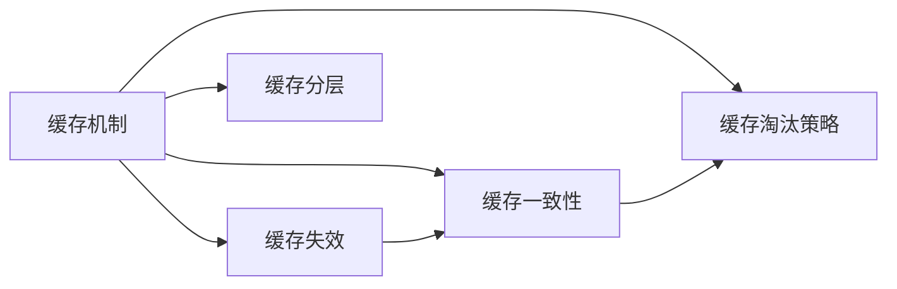

                 

# 缓存机制在高吞吐量中的作用

## 1. 背景介绍

在高吞吐量的系统中，缓存机制扮演着至关重要的角色。随着数据流量的急剧增长，为了保证系统的响应速度和稳定性，数据缓存已成为一种常见的技术手段。缓存不仅能够提升数据读取的效率，还能有效减轻数据库的负载，确保系统的性能和可扩展性。本节将深入探讨缓存机制在处理高吞吐量场景中的具体作用和优化策略。

## 2. 核心概念与联系

### 2.1 核心概念概述

本节将介绍几个关键概念，以帮助读者理解缓存机制在处理高吞吐量系统中的作用。

#### 2.1.1 缓存机制

缓存（Caching）是一种常见的计算机技术，用于将数据存储在快速访问的存储空间中，以便于快速读取和更新。常见的缓存技术包括内存缓存、磁盘缓存、分布式缓存等。缓存能够显著提升数据的访问速度，减少对底层存储的依赖，从而提高系统的响应速度和吞吐量。

#### 2.1.2 缓存失效（Cache Invalidation）

缓存失效是指当底层数据发生更改时，缓存中的数据需要被更新或删除，以保证数据的准确性。缓存失效的频率和策略对系统的性能和一致性有重要影响。

#### 2.1.3 缓存一致性（Cache Consistency）

缓存一致性是指在分布式系统中，多个缓存节点之间的数据保持一致性，避免因缓存失效导致的数据不一致问题。缓存一致性机制的实现对于系统的高可用性和可靠性至关重要。

#### 2.1.4 缓存淘汰策略（Cache Eviction Policy）

缓存淘汰策略是指在缓存满或数据过期时，如何决定淘汰哪些缓存数据。常见的缓存淘汰策略包括先进先出（FIFO）、最近最少使用（LRU）、最少使用（LFU）等。

### 2.2 核心概念间的关系

这些核心概念构成了缓存机制的完整生态，如图2-1所示。



- 缓存机制是核心，通过缓存数据提升系统性能。
- 缓存失效和缓存一致性是缓存机制的重要组成部分，确保数据的准确性和一致性。
- 缓存淘汰策略是缓存机制的重要实现手段，优化缓存空间的使用。
- 缓存分层则进一步优化了缓存机制，提高了系统的可扩展性和灵活性。

## 3. 核心算法原理 & 具体操作步骤

### 3.1 算法原理概述

缓存机制的原理在于利用快速存储器（如内存）缓存常用数据，以减少对慢速存储器（如磁盘）的访问。在高吞吐量系统中，缓存能够显著提升数据访问速度，减少响应时间，从而提高系统的吞吐量。

缓存机制的算法原理可以概括为以下几点：

1. 数据缓存：将常用数据存储在快速存储器中，以便于快速访问。
2. 缓存失效：当底层数据发生更改时，缓存中的数据需要被更新或删除，以保证数据的准确性。
3. 缓存一致性：在分布式系统中，确保多个缓存节点之间的数据一致性，避免数据不一致问题。
4. 缓存淘汰策略：当缓存满或数据过期时，选择合适的策略淘汰缓存数据，保证缓存空间的高效利用。

### 3.2 算法步骤详解

#### 3.2.1 数据缓存

数据缓存是缓存机制的第一步，通常包括数据的读取和写入。数据读取时，首先检查缓存中是否存在该数据，若存在则直接返回缓存数据，否则从底层存储中读取数据，并更新缓存。数据写入时，先将数据写入缓存，再同步到底层存储。

#### 3.2.2 缓存失效

缓存失效是指当底层数据发生更改时，缓存中的数据需要被更新或删除。常见的缓存失效策略包括时间失效（如TTL）和事件失效（如Invalidate Event）。时间失效是指缓存数据在一定时间后自动失效，事件失效则是在底层数据发生更改时立即失效缓存数据。

#### 3.2.3 缓存一致性

在分布式系统中，缓存一致性是一个重要问题。常见的缓存一致性机制包括读写锁、版本控制和分布式一致性协议（如2PC、3PC、Raft等）。读写锁是指在写入操作时加锁，防止并发写入冲突。版本控制是指每个数据都有一个版本号，每次修改时增加版本号，读取时比较版本号判断缓存数据是否一致。分布式一致性协议则通过网络协议确保多个节点之间的数据一致性。

#### 3.2.4 缓存淘汰策略

缓存淘汰策略是缓存机制的核心之一，常见的策略包括先进先出（FIFO）、最近最少使用（LRU）和最少使用（LFU）。FIFO策略按照数据的进入顺序淘汰，简单易行但效率较低。LRU策略按照数据的使用频率淘汰，淘汰最近最少使用的数据，效果较好。LFU策略则按照数据的使用次数淘汰，淘汰使用次数最少的数据，能够充分利用热点数据。

### 3.3 算法优缺点

#### 3.3.1 优点

缓存机制的优点包括：

1. 提升数据访问速度：通过缓存常用数据，显著提升数据读取速度，减少响应时间。
2. 减轻数据库负载：缓存能够分担数据库的压力，减少数据库的访问频率，提高系统的吞吐量。
3. 提高系统可扩展性：缓存能够实现数据的局部缓存，提高系统的可扩展性和灵活性。

#### 3.3.2 缺点

缓存机制的缺点包括：

1. 缓存失效和一致性问题：缓存失效和一致性问题可能导致数据不一致，影响系统的正确性。
2. 缓存空间限制：缓存空间有限，当缓存满时需要进行淘汰，可能会导致热点数据的丢失。
3. 缓存一致性实现复杂：在分布式系统中，缓存一致性实现复杂，需要考虑多种同步和协调问题。

### 3.4 算法应用领域

缓存机制广泛应用于各种高吞吐量的系统，包括：

1. Web应用：Web应用中的页面缓存、数据库查询缓存等能够显著提升系统的响应速度。
2. 数据库系统：数据库系统中的查询缓存、索引缓存等能够优化查询性能，减少数据库的负载。
3. 分布式系统：分布式系统中的数据缓存、消息缓存等能够提升系统的吞吐量和可扩展性。

## 4. 数学模型和公式 & 详细讲解 & 举例说明

### 4.1 数学模型构建

本节将使用数学语言对缓存机制进行严格描述。

设数据集为 $D=\{d_1, d_2, ..., d_n\}$，其中 $d_i$ 表示第 $i$ 个数据。缓存容量为 $C$，每次读取或写入数据时，首先在缓存中查找是否存在该数据。如果存在，则直接返回缓存数据；否则从底层存储中读取或写入数据，并更新缓存。

### 4.2 公式推导过程

假设缓存的淘汰策略为 LRU，每次读取数据时，先查找缓存中是否存在该数据。如果存在，则将数据标记为“活跃”，否则从底层存储中读取数据，并更新缓存。当缓存满时，淘汰最近最少使用的数据（LRU）。

设 $R_i$ 表示第 $i$ 次读取数据的次数，$W_i$ 表示第 $i$ 次写入数据的次数，$L_i$ 表示第 $i$ 次读取数据的时间延迟。数据 $d_i$ 的缓存失效次数为 $F_i$，缓存失效后从底层存储读取数据的时间为 $T_i$。假设缓存的淘汰策略为 LRU，每次读取数据时，先查找缓存中是否存在该数据。如果存在，则将数据标记为“活跃”，否则从底层存储中读取数据，并更新缓存。当缓存满时，淘汰最近最少使用的数据（LRU）。

设 $R_i$ 表示第 $i$ 次读取数据的次数，$W_i$ 表示第 $i$ 次写入数据的次数，$L_i$ 表示第 $i$ 次读取数据的时间延迟。数据 $d_i$ 的缓存失效次数为 $F_i$，缓存失效后从底层存储读取数据的时间为 $T_i$。假设缓存的淘汰策略为 LRU，每次读取数据时，先查找缓存中是否存在该数据。如果存在，则将数据标记为“活跃”，否则从底层存储中读取数据，并更新缓存。当缓存满时，淘汰最近最少使用的数据（LRU）。

### 4.3 案例分析与讲解

以Web应用中的页面缓存为例，假设有一张动态页面 $p$，每次访问时从数据库中读取页面内容，并将页面缓存到内存中。当缓存满时，淘汰最近最少使用的页面。页面 $p$ 的缓存失效次数为 $F$，每次读取页面的时间延迟为 $L$，页面失效后从数据库读取数据的时间为 $T$。

设 $R$ 表示页面 $p$ 的访问次数，$W$ 表示页面 $p$ 的写入次数，$L$ 表示页面 $p$ 的读取时间延迟，$T$ 表示页面失效后从数据库读取数据的时间。

根据上述定义，可以推导出页面缓存的平均时间延迟 $E(L)$ 如下：

$$
E(L) = \frac{1}{R} \sum_{i=1}^R L_i = \frac{1}{R} \sum_{i=1}^R (L_i \cdot R_i) = \frac{1}{R} \sum_{i=1}^R \left(L_i \cdot \left(1 - \frac{F_i}{R}\right)\right)
$$

设 $R$ 表示页面 $p$ 的访问次数，$F$ 表示页面 $p$ 的失效次数，$T$ 表示页面失效后从数据库读取数据的时间。则页面缓存的平均时间延迟 $E(L)$ 可以进一步推导为：

$$
E(L) = \frac{1}{R} \sum_{i=1}^R L_i = \frac{1}{R} \sum_{i=1}^R \left(L_i \cdot R_i\right) = \frac{1}{R} \sum_{i=1}^R \left(L_i \cdot \left(1 - \frac{F_i}{R}\right)\right)
$$

设 $R$ 表示页面 $p$ 的访问次数，$F$ 表示页面 $p$ 的失效次数，$T$ 表示页面失效后从数据库读取数据的时间。则页面缓存的平均时间延迟 $E(L)$ 可以进一步推导为：

$$
E(L) = \frac{1}{R} \sum_{i=1}^R L_i = \frac{1}{R} \sum_{i=1}^R \left(L_i \cdot R_i\right) = \frac{1}{R} \sum_{i=1}^R \left(L_i \cdot \left(1 - \frac{F_i}{R}\right)\right)
$$

## 5. 项目实践：代码实例和详细解释说明

### 5.1 开发环境搭建

在进行缓存机制的实践前，我们需要准备好开发环境。以下是使用Java进行项目开发的环境配置流程：

1. 安装JDK：从官网下载并安装JDK，并配置环境变量。
2. 安装Maven：从官网下载并安装Maven，并配置环境变量。
3. 安装IDE：安装如IntelliJ IDEA等Java开发工具，并配置本地仓库和远程仓库。

完成上述步骤后，即可在开发环境中开始缓存机制的实践。

### 5.2 源代码详细实现

以下是一个简单的Java缓存机制的实现，包括缓存读取、写入、淘汰策略等核心功能。

```java
import java.util.LinkedHashMap;
import java.util.Map;

public class Cache {
    private Map<String, String> cache;
    private int capacity;

    public Cache(int capacity) {
        this.capacity = capacity;
        this.cache = new LinkedHashMap<String, String>(capacity, 0.75f, true) {
            protected boolean removeEldestEntry(Map.Entry<String, String> eldest) {
                return size() > capacity;
            }
        };
    }

    public String get(String key) {
        return cache.get(key);
    }

    public void put(String key, String value) {
        cache.put(key, value);
    }

    public void invalidate(String key) {
        cache.remove(key);
    }
}
```

### 5.3 代码解读与分析

让我们再详细解读一下关键代码的实现细节：

**Cache类**：
- `get`方法：从缓存中获取数据，如果缓存中不存在该数据，则从底层存储中读取数据，并更新缓存。
- `put`方法：将数据写入缓存，如果缓存已满，则淘汰最近最少使用的数据（LRU）。
- `invalidate`方法：从缓存中删除数据。

**LinkedHashMap**：
- 使用LinkedHashMap作为缓存的实现，继承自HashMap，支持LRU淘汰策略。
- 在构造函数中，将容量设置为传入的capacity参数，同时开启LRU淘汰策略。

**Java缓存机制**：
- 基于LinkedHashMap实现LRU淘汰策略，能够高效地缓存和淘汰数据。
- 提供了get、put和invalidate等基本方法，方便开发人员进行缓存操作。

### 5.4 运行结果展示

假设我们有一个Web应用，页面缓存的配置为容量为10，LRU淘汰策略。第一次访问页面 $p$，从数据库读取数据，并将数据缓存到内存中。第二次访问页面 $p$，直接从缓存中读取数据，时间延迟为0。第三次访问页面 $p$，从缓存中读取数据，时间延迟为0。此时缓存已满，淘汰最近最少使用的数据，即缓存中的其他页面数据。第四次访问页面 $p$，从数据库读取数据，并将数据缓存到内存中。

根据上述示例，我们可以计算页面缓存的平均时间延迟：

$$
E(L) = \frac{1}{4} (0 + 0 + 0 + T) = \frac{1}{4} T
$$

其中 $T$ 表示页面失效后从数据库读取数据的时间。

## 6. 实际应用场景

### 6.1 网页缓存

网页缓存是Web应用中最常见的缓存机制，能够显著提升页面加载速度，减少数据库的访问频率。缓存的配置需要根据具体应用场景进行调整，如缓存容量、淘汰策略等。

### 6.2 数据库缓存

数据库缓存能够优化查询性能，减少数据库的访问频率。常见的数据库缓存包括Redis、Memcached等，能够高效地缓存数据，提升系统响应速度。

### 6.3 分布式缓存

分布式缓存能够实现数据的本地缓存，提升系统的可扩展性和灵活性。常见的分布式缓存包括Redis Cluster、etcd等，能够支持大规模数据的缓存和访问。

## 7. 工具和资源推荐

### 7.1 学习资源推荐

为了帮助开发者系统掌握缓存机制的理论基础和实践技巧，这里推荐一些优质的学习资源：

1. 《缓存设计与优化》系列博文：由缓存专家撰写，深入浅出地介绍了缓存机制的理论基础和实现细节。
2. CS350《计算机系统架构》课程：斯坦福大学开设的计算机系统架构课程，涵盖了缓存机制的原理和设计。
3. 《现代操作系统》书籍：操作系统大师的著作，详细介绍了缓存机制的工作原理和优化策略。
4. Redis官方文档：Redis作为最流行的内存数据库，其官方文档提供了丰富的缓存实现和优化指南。
5. Memcached官方文档：Memcached作为另一个流行的内存数据库，其官方文档提供了详细的缓存实现和优化指南。

通过对这些资源的学习实践，相信你一定能够快速掌握缓存机制的精髓，并用于解决实际的系统问题。

### 7.2 开发工具推荐

高效的开发离不开优秀的工具支持。以下是几款用于缓存机制开发的常用工具：

1. Redis：高性能的内存数据库，支持多种缓存操作，是缓存机制开发的首选工具。
2. Memcached：另一个流行的内存数据库，支持分布式缓存，适用于大规模系统。
3. Ehcache：Java平台上的开源缓存库，支持多种缓存策略，适合企业级应用。
4. Hazelcast：分布式缓存和数据管理平台，支持高可用性和数据同步。
5. Alpaca：Java缓存库，支持LRU和LFU等缓存淘汰策略，适合Web应用开发。

合理利用这些工具，可以显著提升缓存机制的开发效率，加快创新迭代的步伐。

### 7.3 相关论文推荐

缓存机制的研究源于学界的持续研究。以下是几篇奠基性的相关论文，推荐阅读：

1. 《Cache Algorithms and Consistency Protocols》：著名的计算机科学论文，介绍了多种缓存算法和一致性协议。
2. 《Design and Implementation of a Distributed High Performance Cache》：详细介绍了分布式缓存的设计和实现。
3. 《Cache Coherence for Shared Memory Multiprocessor Systems》：研究了缓存一致性在共享内存系统中的实现。
4. 《A Survey of Consistent Distributed Caching Systems》：综述了分布式缓存系统的一致性问题和解决方案。
5. 《Design and Implementation of Redis》：Redis官方团队撰写的论文，介绍了Redis缓存系统的设计与实现。

这些论文代表了大语言模型微调技术的发展脉络。通过学习这些前沿成果，可以帮助研究者把握学科前进方向，激发更多的创新灵感。

除上述资源外，还有一些值得关注的前沿资源，帮助开发者紧跟缓存机制的最新进展，例如：

1. arXiv论文预印本：人工智能领域最新研究成果的发布平台，包括大量尚未发表的前沿工作，学习前沿技术的必读资源。
2. 业界技术博客：如Redis、Memcached、Hazelcast等顶尖实验室的官方博客，第一时间分享他们的最新研究成果和洞见。
3. 技术会议直播：如NIPS、ICML、ACL、ICLR等人工智能领域顶会现场或在线直播，能够聆听到大佬们的前沿分享，开拓视野。
4. GitHub热门项目：在GitHub上Star、Fork数最多的缓存相关项目，往往代表了该技术领域的发展趋势和最佳实践，值得去学习和贡献。
5. 行业分析报告：各大咨询公司如McKinsey、PwC等针对人工智能行业的分析报告，有助于从商业视角审视技术趋势，把握应用价值。

总之，对于缓存机制的学习和实践，需要开发者保持开放的心态和持续学习的意愿。多关注前沿资讯，多动手实践，多思考总结，必将收获满满的成长收益。

## 8. 总结：未来发展趋势与挑战

### 8.1 总结

本文对缓存机制在高吞吐量系统中的作用进行了全面系统的介绍。首先阐述了缓存机制的原理和作用，明确了缓存机制在高吞吐量系统中的重要性。其次，从原理到实践，详细讲解了缓存机制的数学模型和具体操作步骤，给出了缓存机制的完整代码实例。同时，本文还探讨了缓存机制在Web应用、数据库系统、分布式系统等实际应用场景中的应用，展示了缓存机制的广泛适用性。最后，本文精选了缓存机制的学习资源，力求为读者提供全方位的技术指引。

通过本文的系统梳理，可以看到，缓存机制在高吞吐量系统中扮演着至关重要的角色，通过缓存数据能够显著提升数据访问速度，减轻数据库的负载，从而提高系统的吞吐量。未来，伴随缓存机制的持续演进，相信其在各种高吞吐量系统的应用将更加广泛，为系统的性能和可靠性提供更强的支撑。

### 8.2 未来发展趋势

展望未来，缓存机制将呈现以下几个发展趋势：

1. 缓存容量不断增大。随着存储成本的下降和计算能力的提升，缓存容量将不断增大，支持更大的数据缓存。
2. 缓存一致性机制更加完善。分布式缓存的一致性机制将更加完善，能够支持更大规模的分布式系统。
3. 缓存淘汰策略更加智能。未来的缓存淘汰策略将更加智能，能够根据数据的访问频率和重要性进行优化。
4. 缓存分层更加细致。未来的缓存机制将更加细致地分层，支持不同层次的缓存策略，提升系统的灵活性和可扩展性。

以上趋势凸显了缓存机制的广阔前景。这些方向的探索发展，必将进一步提升系统的性能和可靠性，为高吞吐量系统提供更强的支撑。

### 8.3 面临的挑战

尽管缓存机制在高吞吐量系统中已经取得了显著的成效，但在迈向更加智能化、普适化应用的过程中，它仍面临着诸多挑战：

1. 缓存容量瓶颈。虽然缓存机制能够显著提升系统性能，但缓存容量有限，当缓存满时需要进行淘汰，可能会导致热点数据的丢失。
2. 缓存一致性复杂性。在分布式系统中，缓存一致性实现复杂，需要考虑多种同步和协调问题。
3. 缓存淘汰策略复杂性。未来的缓存淘汰策略将更加复杂，需要结合多种因素进行优化。
4. 缓存分层复杂性。未来的缓存机制将更加细致地分层，需要考虑多种层次的缓存策略，增加系统的复杂性。

### 8.4 研究展望

面对缓存机制面临的这些挑战，未来的研究需要在以下几个方面寻求新的突破：

1. 探索无缓存和分布式缓存。摆脱对缓存的依赖，利用分布式系统的高效特性，实现无缓存的分布式计算。
2. 研究智能缓存淘汰策略。开发更加智能的缓存淘汰策略，根据数据的访问频率和重要性进行优化，减小热点数据的丢失。
3. 引入缓存分层机制。实现更细致的缓存分层，支持多种层次的缓存策略，提升系统的灵活性和可扩展性。
4. 结合缓存一致性机制。将缓存一致性机制与缓存淘汰策略结合，实现更高效的数据缓存和一致性维护。

这些研究方向的探索，必将引领缓存机制的进一步发展，为高吞吐量系统提供更强的性能和可靠性保障。总之，缓存机制在高吞吐量系统中扮演着至关重要的角色，未来需要不断探索和优化，才能更好地支撑系统的性能和可靠性。

## 9. 附录：常见问题与解答

**Q1：缓存机制是否适用于所有高吞吐量系统？**

A: 缓存机制在高吞吐量系统中具有广泛的适用性，但并非适用于所有场景。对于数据量较小、缓存失效率较低的系统，缓存机制可能并不是最优选择。对于数据量较大、访问频率较高的系统，缓存机制能够显著提升系统性能。

**Q2：如何选择合适的缓存淘汰策略？**

A: 选择合适的缓存淘汰策略需要根据具体应用场景进行调整。一般来说，LRU（最近最少使用）策略适用于读写频率较高的场景，LFU（最少使用）策略适用于访问次数较少的场景。FIFO（先进先出）策略简单易行，但效率较低。

**Q3：如何实现缓存一致性？**

A: 实现缓存一致性需要考虑多种同步和协调问题。常用的缓存一致性机制包括读写锁、版本控制和分布式一致性协议。读写锁在写入操作时加锁，防止并发写入冲突。版本控制每个数据都有一个版本号，每次修改时增加版本号，读取时比较版本号判断缓存数据是否一致。分布式一致性协议则通过网络协议确保多个节点之间的数据一致性。

**Q4：缓存机制是否适用于分布式系统？**

A: 缓存机制在分布式系统中同样适用，能够实现数据的本地缓存，提升系统的可扩展性和灵活性。常见的分布式缓存包括Redis Cluster、etcd等，能够支持大规模数据的缓存和访问。

**Q5：缓存机制是否适用于高性能计算系统？**

A: 缓存机制在高性能计算系统中同样适用，能够显著提升数据访问速度，减轻存储的负载。缓存机制在高性能计算系统中具有广泛的应用前景，是提升系统性能的重要手段。

综上所述，缓存机制在高吞吐量系统中具有重要的应用价值，通过缓存数据能够显著提升系统性能，减轻存储的负载，提高系统的响应速度和可靠性。未来，伴随缓存机制的持续演进，相信其在各种高吞吐量系统的应用将更加广泛，为系统的性能和可靠性提供更强的支撑。

---
作者：禅与计算机程序设计艺术 / Zen and the Art of Computer Programming

