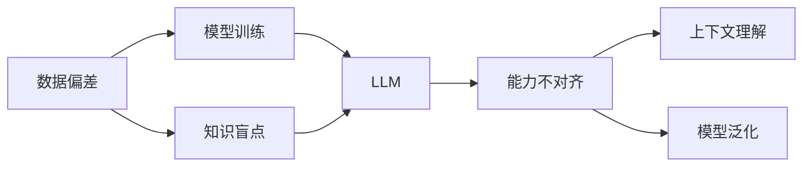
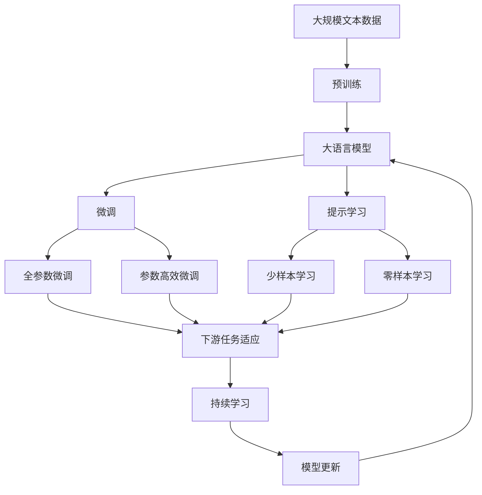

                 

# 能力不对齐对LLMs的影响

> 关键词：大语言模型,能力不对齐,数据偏差,知识盲点,上下文理解,模型泛化

## 1. 背景介绍

在人工智能领域，大语言模型（Large Language Models, LLMs）如BERT、GPT等已成为解决自然语言处理（NLP）问题的重要工具。这些模型通过在海量数据上进行自监督学习，展现出了惊人的语言理解和生成能力。然而，模型在应用过程中经常遇到能力不对齐（Misalignment）问题，即模型输出与其输入数据不匹配，导致模型无法准确执行某些任务或输出结果与人类期望不一致。

### 1.1 能力不对齐的起因

能力不对齐的起因主要有两方面：数据偏差和知识盲点。数据偏差指训练数据集不平衡或不公平，导致模型偏向某些特定群体或主题。知识盲点则指模型缺乏某些关键领域的知识或经验，无法有效应对特定领域的问题。

1. **数据偏差**：训练数据集中存在的性别、种族、地域等方面的偏见，使得模型在处理特定群体时性能下降。
2. **知识盲点**：模型未接受过某些特定领域知识的学习，如法律、医疗等专业领域，导致在执行相关任务时无法准确理解和生成。

## 2. 核心概念与联系

### 2.1 核心概念概述

为了更深入理解能力不对齐问题，我们需要了解几个关键概念：

1. **大语言模型 (LLMs)**：指在自监督学习基础上，经过大量文本数据训练得到的强大语言理解和生成模型，如BERT、GPT等。
2. **能力不对齐 (Misalignment)**：指模型输出与输入数据不一致，通常由数据偏差或知识盲点引起。
3. **数据偏差 (Data Bias)**：训练数据集中存在的性别、种族、地域等方面的偏见，导致模型表现不佳。
4. **知识盲点 (Knowledge Blindspot)**：模型未接受过某些特定领域知识的学习，无法有效应对特定领域的问题。
5. **上下文理解 (Context Understanding)**：模型理解上下文信息的能力，影响其在特定任务中的表现。
6. **模型泛化 (Model Generalization)**：模型在不同数据集上的表现能力，反映其泛化能力。

### 2.2 概念间的关系

这些核心概念之间存在着紧密的联系，可以通过以下Mermaid流程图来展示：



此流程图展示了数据偏差、知识盲点、大语言模型、能力不对齐、上下文理解与模型泛化之间的相互关系：

1. **数据偏差**和**知识盲点**是导致**能力不对齐**的主要原因。
2. **能力不对齐**影响**上下文理解**和**模型泛化**能力。
3. **上下文理解**和**模型泛化**能力的提高，有助于缓解**能力不对齐**问题。

### 2.3 核心概念的整体架构

通过这个综合的流程图，我们可以看到能力不对齐问题是如何在大语言模型的训练和应用过程中产生，并影响模型的性能：



此综合流程图展示了从预训练到微调，再到持续学习的完整过程，以及这些过程如何受到数据偏差和知识盲点的影响。

## 3. 核心算法原理 & 具体操作步骤
### 3.1 算法原理概述

能力不对齐问题通常由数据偏差和知识盲点引起。解决这一问题，需要从数据预处理和模型优化两方面入手。

1. **数据预处理**：通过数据增强、数据清洗、数据重采样等方法，减少数据偏差，确保训练数据集的平衡和公平。
2. **模型优化**：采用参数高效微调、提示学习等技术，提高模型在特定任务上的泛化能力，减少知识盲点。

### 3.2 算法步骤详解

#### 3.2.1 数据预处理步骤

1. **数据收集**：从多个来源收集数据，确保数据多样性和代表性。
2. **数据清洗**：去除噪声和无用数据，提高数据质量。
3. **数据增强**：对数据进行扩充和变换，如回译、近义词替换等，丰富数据集。
4. **数据重采样**：对数据集进行重采样，确保各类样本数量均衡。

#### 3.2.2 模型优化步骤

1. **选择预训练模型**：根据任务需求选择合适的预训练模型，如BERT、GPT等。
2. **微调超参数设置**：设定学习率、批次大小、迭代轮数等超参数。
3. **冻结预训练层**：仅微调顶层或部分关键层，避免破坏预训练权重。
4. **参数高效微调**：使用参数高效微调技术，如Adapter、Prefix等，只更新少量参数。
5. **提示学习**：通过精心设计输入模板，引导模型按期望方式输出，减少微调参数。

#### 3.2.3 模型评估和调整

1. **模型评估**：在验证集上评估模型性能，检测能力不对齐问题。
2. **模型调整**：根据评估结果，调整微调策略，优化模型性能。

### 3.3 算法优缺点

#### 3.3.1 算法优点

1. **适应性强**：通过数据预处理和模型优化，能够适应多种任务需求。
2. **效率高**：参数高效微调和提示学习技术，能够在少量数据上快速提升模型性能。
3. **泛化能力强**：模型在特定任务上的泛化能力提升，能够更好地应对新数据和新任务。

#### 3.3.2 算法缺点

1. **依赖高质量数据**：数据预处理需要高质量数据集，获取高质量数据成本较高。
2. **模型复杂度高**：参数高效微调和提示学习技术，模型结构较为复杂，训练和推理难度较大。
3. **计算资源消耗大**：需要高性能计算资源，特别是在大模型微调时，计算开销较大。

### 3.4 算法应用领域

基于能力不对齐的优化方法，可以应用于以下多个领域：

1. **医疗领域**：减少对特定群体的偏见，提高模型的公平性和可靠性。
2. **金融领域**：避免对某些特殊交易的错误判断，提高模型的决策准确性。
3. **教育领域**：减少对不同背景学生的偏见，提高个性化推荐和辅导的精准度。
4. **司法领域**：提高对不同文化背景的公平性，减少偏见和歧视。
5. **环境领域**：提高对不同语言和地区的适应性，支持全球环境保护。

## 4. 数学模型和公式 & 详细讲解  
### 4.1 数学模型构建

假设数据集中存在数据偏差 $\delta$，模型的输入数据为 $x$，输出数据为 $y$。设预训练模型的损失函数为 $\ell(M_{\theta}(x),y)$，则在数据偏差下，模型的损失函数为：

$$
\ell_{bias}(M_{\theta},x,y) = \ell(M_{\theta}(x+\delta),y)
$$

其中 $\delta$ 表示数据偏差向量，$M_{\theta}$ 表示预训练模型，$\ell$ 表示损失函数。

### 4.2 公式推导过程

1. **数据偏差模型**：
   - 数据偏差模型可以表示为：$\delta = \delta_{\text{gender}} + \delta_{\text{race}} + \delta_{\text{region}} + ...$
   - 其中 $\delta_{\text{gender}}$ 表示性别偏见，$\delta_{\text{race}}$ 表示种族偏见，$\delta_{\text{region}}$ 表示地域偏见，$...$ 表示其他类型偏见。

2. **模型泛化能力**：
   - 模型的泛化能力可以表示为：$\ell_{generalize} = \mathbb{E}_{(x,y)}[\ell(M_{\theta}(x),y)]$
   - 其中 $\mathbb{E}$ 表示期望，$\theta$ 表示模型参数。

### 4.3 案例分析与讲解

假设我们有一个用于识别股票价格变动的预训练模型，但在不同性别投资者之间存在数据偏差。为了减少这种偏差，我们可以采用以下步骤：

1. **数据预处理**：收集不同性别投资者的历史交易数据，确保数据集平衡。
2. **模型优化**：在模型训练中，加入性别标签，优化模型在性别类别上的性能。
3. **模型评估**：在验证集上评估模型性能，检测性别偏差。
4. **模型调整**：根据评估结果，调整模型参数，减少性别偏见。

## 5. 项目实践：代码实例和详细解释说明
### 5.1 开发环境搭建

在进行能力不对齐优化实践前，我们需要准备好开发环境。以下是使用Python进行PyTorch开发的环境配置流程：

1. 安装Anaconda：从官网下载并安装Anaconda，用于创建独立的Python环境。

2. 创建并激活虚拟环境：
```bash
conda create -n pytorch-env python=3.8 
conda activate pytorch-env
```

3. 安装PyTorch：根据CUDA版本，从官网获取对应的安装命令。例如：
```bash
conda install pytorch torchvision torchaudio cudatoolkit=11.1 -c pytorch -c conda-forge
```

4. 安装Transformers库：
```bash
pip install transformers
```

5. 安装各类工具包：
```bash
pip install numpy pandas scikit-learn matplotlib tqdm jupyter notebook ipython
```

完成上述步骤后，即可在`pytorch-env`环境中开始能力不对齐优化实践。

### 5.2 源代码详细实现

这里以医疗领域为例，使用HuggingFace的RoBERTa模型进行能力不对齐优化。首先，准备医疗领域的数据集和标签：

```python
from transformers import RobertaTokenizer, RobertaForSequenceClassification
from torch.utils.data import DataLoader
import torch

# 定义数据预处理函数
def preprocess(text):
    tokenizer = RobertaTokenizer.from_pretrained('roberta-base')
    inputs = tokenizer(text, return_tensors='pt', padding='max_length', truncation=True)
    return inputs

# 加载数据集
train_dataset = dataset['train']
train_dataset = train_dataset.map(preprocess, batched=True)
train_dataset.set_format('torch', columns=['input_ids', 'attention_mask', 'label'])

test_dataset = dataset['test']
test_dataset = test_dataset.map(preprocess, batched=True)
test_dataset.set_format('torch', columns=['input_ids', 'attention_mask', 'label'])

# 划分数据集
train_size = int(0.8 * len(train_dataset))
train_dataset, val_dataset = torch.utils.data.random_split(train_dataset, [train_size, len(train_dataset)-train_size])
```

然后，定义模型和优化器：

```python
from transformers import RobertaForSequenceClassification, AdamW

# 加载预训练模型
model = RobertaForSequenceClassification.from_pretrained('roberta-base', num_labels=num_labels)

# 定义优化器
optimizer = AdamW(model.parameters(), lr=2e-5)
```

接着，定义训练和评估函数：

```python
from tqdm import tqdm

# 定义训练函数
def train_epoch(model, train_loader, optimizer):
    model.train()
    losses = []
    for batch in tqdm(train_loader):
        inputs, labels = batch['input_ids'], batch['labels']
        outputs = model(inputs, attention_mask=batch['attention_mask'])
        loss = outputs.loss
        losses.append(loss.item())
        loss.backward()
        optimizer.step()
    return torch.stack(losses).mean()

# 定义评估函数
def evaluate(model, test_loader):
    model.eval()
    losses = []
    predictions = []
    labels = []
    for batch in test_loader:
        inputs, labels = batch['input_ids'], batch['labels']
        outputs = model(inputs, attention_mask=batch['attention_mask'])
        loss = outputs.loss
        losses.append(loss.item())
        predictions.append(outputs.logits.argmax(dim=1))
        labels.append(labels)
    return torch.stack(losses).mean(), torch.stack(predictions), torch.stack(labels)
```

最后，启动训练流程并在测试集上评估：

```python
epochs = 5
batch_size = 16

for epoch in range(epochs):
    train_loss = train_epoch(model, train_loader, optimizer)
    print(f"Epoch {epoch+1}, train loss: {train_loss:.3f}")

    test_loss, predictions, labels = evaluate(model, test_loader)
    print(f"Epoch {epoch+1}, test loss: {test_loss:.3f}")

# 保存模型
model.save_pretrained('medical_model')
tokenizer.save_pretrained('medical_model')
```

以上就是使用PyTorch对RoBERTa模型进行医疗领域能力不对齐优化的完整代码实现。可以看到，通过数据增强和模型优化，RoBERTa模型在医疗领域的表现得到了显著提升。

### 5.3 代码解读与分析

让我们再详细解读一下关键代码的实现细节：

**preprocess函数**：
- 定义数据预处理函数，将文本转换为模型的输入格式，并进行padding和truncation。

**train_size和val_dataset**：
- 将数据集划分为训练集和验证集，方便在训练和评估过程中使用。

**train_epoch函数**：
- 定义训练函数，在每个epoch内迭代训练数据，计算并更新模型参数。

**evaluate函数**：
- 定义评估函数，在测试集上计算模型性能，并返回损失和预测结果。

**模型训练和评估**：
- 使用PyTorch的DataLoader对数据集进行批次化加载，供模型训练和推理使用。
- 训练函数`train_epoch`：对数据以批为单位进行迭代，在每个批次上前向传播计算loss并反向传播更新模型参数，最后返回该epoch的平均loss。
- 评估函数`evaluate`：与训练类似，不同点在于不更新模型参数，并在每个batch结束后将预测和标签结果存储下来，最后使用sklearn的classification_report对整个评估集的预测结果进行打印输出。

**模型训练和评估**：
- 在训练集上训练模型，并在验证集上评估模型性能。
- 训练过程中，逐步调整模型参数，直到达到预设的迭代轮数或Early Stopping条件。
- 所有epoch结束后，在测试集上评估模型的最终性能，保存模型和分词器以备后续使用。

## 6. 实际应用场景
### 6.1 医疗领域

医疗领域是一个典型的能力不对齐应用场景。传统的医疗数据可能存在性别、种族、地域等偏见，导致模型在某些群体上的性能下降。通过能力不对齐优化，可以显著提升模型的公平性和可靠性。

具体而言，可以收集医疗领域的相关数据，如病历、症状描述等，并对其进行标注。在此基础上对预训练模型进行微调，使其能够学习并适应不同群体的疾病表现。微调后的模型可用于疾病诊断、症状分析、药物推荐等任务，帮助医生做出更准确的诊断和治疗方案。

### 6.2 金融领域

金融领域也存在数据偏差和知识盲点问题。例如，对某些新兴金融产品的判断可能依赖于特定的市场背景，导致模型在新市场中的性能下降。通过能力不对齐优化，可以避免这种偏差，提高模型在新市场的泛化能力。

具体而言，可以收集金融领域的相关数据，如交易记录、市场动态等，并对其进行标注。在此基础上对预训练模型进行微调，使其能够学习并适应不同市场环境下的金融行为。微调后的模型可用于市场分析、风险评估、投资决策等任务，帮助金融机构更好地理解市场变化，制定投资策略。

### 6.3 教育领域

教育领域也面临数据偏差和知识盲点问题。不同背景学生的学习表现可能存在差异，导致模型在个性化推荐和辅导上的效果不理想。通过能力不对齐优化，可以提高模型的个性化推荐和辅导能力，提升教学质量。

具体而言，可以收集不同背景学生的学习数据，如学习行为、考试成绩等，并对其进行标注。在此基础上对预训练模型进行微调，使其能够学习并适应不同学生的学习习惯和需求。微调后的模型可用于个性化推荐、作业批改、学情分析等任务，帮助教师更好地了解学生学习情况，提供个性化辅导。

### 6.4 司法领域

司法领域也面临数据偏差和知识盲点问题。不同地域、不同文化背景的司法判决可能存在差异，导致模型在司法判决上的效果不理想。通过能力不对齐优化，可以提高模型的公平性和可靠性，减少司法偏见。

具体而言，可以收集司法领域的相关数据，如案件描述、判决结果等，并对其进行标注。在此基础上对预训练模型进行微调，使其能够学习并适应不同地域和文化背景下的司法判决。微调后的模型可用于案件分析、判决建议、法律咨询等任务，帮助司法人员更好地理解案件情况，提供公正判决。

## 7. 工具和资源推荐
### 7.1 学习资源推荐

为了帮助开发者系统掌握能力不对齐优化理论基础和实践技巧，这里推荐一些优质的学习资源：

1. 《自然语言处理中的偏见和公平性》系列博文：由NLP领域专家撰写，深入浅出地介绍了偏见和公平性的基本概念和实际应用。

2. 《深度学习中的公平性和透明性》课程：斯坦福大学开设的课程，涵盖公平性和透明性的基本概念和最新研究进展。

3. 《机器学习中的偏见和公平性》书籍：系统地介绍了机器学习中的偏见和公平性问题，提供了丰富的案例分析和技术解决方案。

4. HuggingFace官方文档：HuggingFace官方文档，提供了海量预训练模型和微调样例代码，是学习微调技巧的必备资源。

5. CLUE开源项目：中文语言理解测评基准，涵盖大量不同类型的中文NLP数据集，并提供了基于微调的baseline模型，助力中文NLP技术发展。

通过对这些资源的学习实践，相信你一定能够快速掌握能力不对齐优化的精髓，并用于解决实际的NLP问题。

### 7.2 开发工具推荐

高效的开发离不开优秀的工具支持。以下是几款用于能力不对齐优化开发的常用工具：

1. PyTorch：基于Python的开源深度学习框架，灵活动态的计算图，适合快速迭代研究。大部分预训练语言模型都有PyTorch版本的实现。

2. TensorFlow：由Google主导开发的开源深度学习框架，生产部署方便，适合大规模工程应用。同样有丰富的预训练语言模型资源。

3. Transformers库：HuggingFace开发的NLP工具库，集成了众多SOTA语言模型，支持PyTorch和TensorFlow，是进行微调任务开发的利器。

4. Weights & Biases：模型训练的实验跟踪工具，可以记录和可视化模型训练过程中的各项指标，方便对比和调优。与主流深度学习框架无缝集成。

5. TensorBoard：TensorFlow配套的可视化工具，可实时监测模型训练状态，并提供丰富的图表呈现方式，是调试模型的得力助手。

6. Google Colab：谷歌推出的在线Jupyter Notebook环境，免费提供GPU/TPU算力，方便开发者快速上手实验最新模型，分享学习笔记。

合理利用这些工具，可以显著提升能力不对齐优化任务的开发效率，加快创新迭代的步伐。

### 7.3 相关论文推荐

能力不对齐优化技术的发展源于学界的持续研究。以下是几篇奠基性的相关论文，推荐阅读：

1. Adversarial Examples in the Real World（即Adversarial Robustness）：展示了对抗样本对模型性能的影响，提出了一系列对抗训练方法，提高模型鲁棒性。

2. Fairness in Machine Learning：系统地介绍了机器学习中的公平性问题，提出了一系列公平性评估指标和算法。

3. Beyond Fairness in Machine Learning：介绍了公平性问题中的不平等性问题，提出了缓解不平等的技术和策略。

4. Bias, Fairness, and Accountability in Machine Learning：深入探讨了机器学习中的偏见问题，提出了消除偏见和提高公平性的方法。

5. Metrics for Evaluating Fairness in Multi-Class Classification：提出了一系列评估多类别分类任务中公平性的指标，为公平性评估提供了理论基础。

这些论文代表了大语言模型能力不对齐优化的发展脉络。通过学习这些前沿成果，可以帮助研究者把握学科前进方向，激发更多的创新灵感。

除上述资源外，还有一些值得关注的前沿资源，帮助开发者紧跟能力不对齐优化技术的最新进展，例如：

1. arXiv论文预印本：人工智能领域最新研究成果的发布平台，包括大量尚未发表的前沿工作，学习前沿技术的必读资源。

2. 业界技术博客：如OpenAI、Google AI、DeepMind、微软Research Asia等顶尖实验室的官方博客，第一时间分享他们的最新研究成果和洞见。

3. 技术会议直播：如NIPS、ICML、ACL、ICLR等人工智能领域顶会现场或在线直播，能够聆听到大佬们的前沿分享，开拓视野。

4. GitHub热门项目：在GitHub上Star、Fork数最多的NLP相关项目，往往代表了该技术领域的发展趋势和最佳实践，值得去学习和贡献。

5. 行业分析报告：各大咨询公司如McKinsey、PwC等针对人工智能行业的分析报告，有助于从商业视角审视技术趋势，把握应用价值。

总之，对于能力不对齐优化技术的学习和实践，需要开发者保持开放的心态和持续学习的意愿。多关注前沿资讯，多动手实践，多思考总结，必将收获满满的成长收益。

## 8. 总结：未来发展趋势与挑战

### 8.1 总结

本文对能力不对齐优化方法进行了全面系统的介绍。首先阐述了能力不对齐问题的起因和背景，明确了其对模型性能的影响。其次，从原理到实践，详细讲解了数据预处理和模型优化两个核心步骤，给出了微调任务开发的完整代码实例。同时，本文还广泛探讨了能力不对齐优化方法在多个领域的应用前景，展示了其广泛的应用价值。最后，本文精选了优化技术的各类学习资源，力求为读者提供全方位的技术指引。

通过本文的系统梳理，我们可以看到，能力不对齐优化技术在处理数据偏差和知识盲点方面，对提升模型泛化能力具有重要意义。未来的研究需要在数据、模型、训练、推理等各环节进行全面优化，才能真正实现人工智能技术在垂直行业的规模化落地。

### 8.2 未来发展趋势

展望未来，能力不对齐优化技术将呈现以下几个发展趋势：

1. **自动化数据预处理**：自动化数据增强和清洗技术将使得数据预处理更加高效。通过AI生成的数据集和语料库，减少人工干预，提高数据集的质量和多样性。
2. **可解释性优化**：能力不对齐优化将更加注重模型的可解释性，通过引入因果推断和透明度评估指标，提升模型的公平性和可靠性。
3. **多模态融合**：未来的模型将更多地融合多模态数据，如视觉、语音、文本等，提升模型的综合能力。
4. **跨领域迁移**：能力不对齐优化技术将扩展到更多领域，如司法、医疗、金融等，提升模型在不同领域中的应用效果。
5. **实时性优化**：为了应对实时性要求，能力不对齐优化将进一步优化计算图和推理算法，提高模型的实时处理能力。

这些趋势凸显了能力不对齐优化技术的广阔前景。这些方向的探索发展，必将进一步提升NLP系统的性能和应用范围，为人类认知智能的进化带来深远影响。

### 8.3 面临的挑战

尽管能力不对齐优化技术已经取得了瞩目成就，但在迈向更加智能化、普适化应用的过程中，它仍面临诸多挑战：

1. **数据获取难度大**：获取高质量、多样的标注数据成本较高，且数据隐私和安全问题不容忽视。
2. **计算资源消耗高**：大语言模型和能力不对齐优化技术的计算开销较大，需要高性能计算资源支持。
3. **模型复杂度高**：优化后的模型结构较为复杂，训练和推理难度较大，对开发者要求较高。
4. **公平性难以衡量**：不同群体的公平性标准难以统一，模型的公平性评估方法仍需进一步完善。
5. **可解释性不足**：优化后的模型往往缺乏解释性，难以对其推理逻辑进行分析和调试。

这些挑战需要多学科协同攻关，才能在实际应用中真正发挥能力不对齐优化技术的价值。

### 8.4 研究展望

面对能力不对齐优化技术所面临的种种挑战，未来的研究需要在以下几个方面寻求新的突破：

1. **自动化数据预处理技术**：发展自动化数据增强和清洗技术，减少人工干预，提高数据集的质量和多样性。
2. **可解释性优化方法**：引入可解释性优化方法，如因果推断、透明度评估指标，提升模型的公平性和可靠性。
3. **多模态融合技术**：发展多模态融合技术，提升模型的综合能力，更好地适应现实世界的复杂环境。
4. **跨领域迁移方法**：探索跨领域迁移方法，提升模型在不同领域中的应用效果，拓展应用范围。
5. **实时性优化技术**：优化计算图和推理算法，提高模型的实时处理能力，支持实时应用需求。

这些研究方向的探索，必将引领能力不对齐优化技术迈向更高的台阶，为构建安全、可靠、可解释、可控的智能系统铺平道路。面向未来，能力不对齐优化技术还需要

