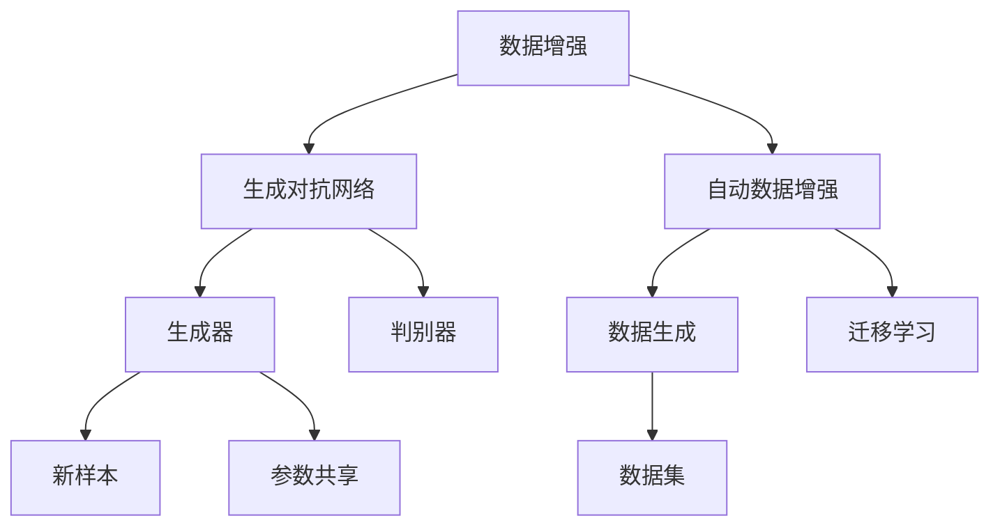
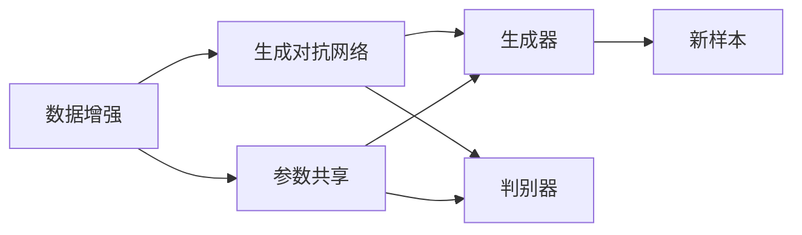
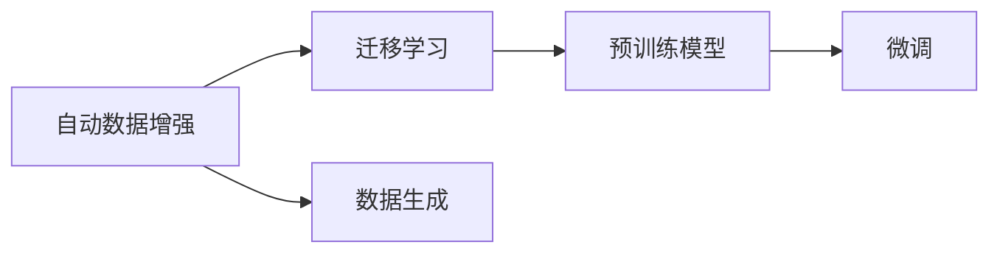
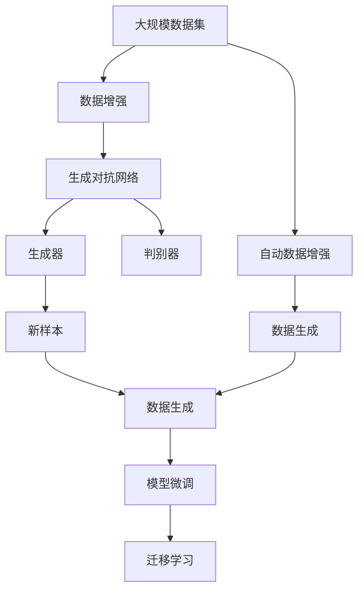
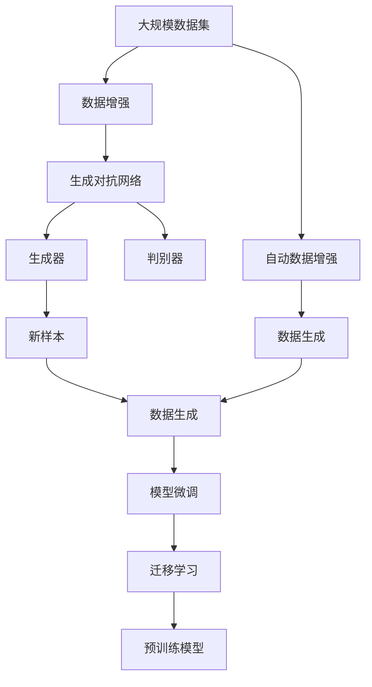

                 

# 自动数据增强 原理与代码实例讲解

> 关键词：自动数据增强,数据扩充,数据生成,生成对抗网络,模型泛化,深度学习,计算机视觉

## 1. 背景介绍

### 1.1 问题由来

在深度学习中，数据对于模型的性能有着至关重要的影响。数据不足或质量不佳会直接导致模型训练困难，泛化能力差。而在大规模深度学习任务中，如计算机视觉、自然语言处理等，数据收集和标注成本高昂，获取大量高质量标注数据往往难以实现。

数据增强（Data Augmentation）技术应运而生。通过扩充数据集，生成新的样本，可以有效提高模型泛化能力，改善模型性能。近年来，随着生成对抗网络（GAN）等技术的不断发展，数据增强已经成为了深度学习中不可或缺的一部分。

### 1.2 问题核心关键点

自动数据增强（Auto Data Augmentation）是一种高级数据增强技术，旨在自动寻找最优的数据增强策略，从而最大化模型的泛化能力。自动数据增强的核心在于：

1. 通过自动化的方式，找到最合适的数据增强策略。
2. 在保证模型泛化能力的前提下，减少对人工标注的依赖。
3. 在生成新样本的同时，避免引入噪声。

自动数据增强已经在多个领域取得了显著的效果，包括计算机视觉、自然语言处理、语音识别等。未来，自动数据增强有望在更多领域得到应用，提升深度学习的性能和效率。

### 1.3 问题研究意义

自动数据增强技术的研究和应用，具有重要的意义：

1. 提高模型泛化能力。自动数据增强能够生成多样化的数据，帮助模型更好地学习数据集的特征，提高模型的泛化能力。
2. 降低数据标注成本。自动数据增强可以减少对标注数据的依赖，降低标注成本，加速模型开发和部署。
3. 提升模型训练效率。自动数据增强能够通过生成更多训练样本，加速模型训练过程，提高模型训练效率。
4. 减少过拟合风险。自动数据增强能够生成更多训练样本，减少模型过拟合的风险，提高模型鲁棒性。
5. 促进算法创新。自动数据增强技术的发展，促进了深度学习算法和技术的不断进步，推动了深度学习领域的研究和发展。

## 2. 核心概念与联系

### 2.1 核心概念概述

为更好地理解自动数据增强方法，本节将介绍几个密切相关的核心概念：

- 数据增强（Data Augmentation）：指通过对原始数据进行一系列变换，生成新的样本，从而扩充数据集的技术。常见的数据增强方法包括图像旋转、翻转、裁剪等。

- 自动数据增强（Auto Data Augmentation）：指通过自动化方式，寻找最优的数据增强策略，从而最大化模型的泛化能力。通常利用生成对抗网络（GAN）等技术，自动生成新的训练样本。

- 生成对抗网络（Generative Adversarial Network, GAN）：由Isola提出的一种生成模型，包含生成器和判别器两个部分。生成器尝试生成尽可能真实的样本，判别器则尝试区分样本是真实还是生成。两者通过对抗训练，最终生成高质量的训练样本。

- 参数共享（Parameter Sharing）：在自动数据增强中，生成器的参数通常会与判别器的参数共享，以提高生成样本的质量和多样性。

- 数据生成（Data Generation）：指通过生成对抗网络等技术，自动生成新的训练样本，以扩充数据集。

- 迁移学习（Transfer Learning）：指利用预训练模型在特定任务上进行微调，从而提升模型性能。自动数据增强可以与迁移学习相结合，进一步提高模型效果。

这些核心概念之间的逻辑关系可以通过以下Mermaid流程图来展示：



这个流程图展示了几组概念之间的联系：

1. 数据增强和生成对抗网络之间的联系。生成对抗网络通过对抗训练生成新样本，从而实现数据增强。
2. 生成对抗网络和自动数据增强之间的联系。自动数据增强通过生成对抗网络，自动寻找最优的数据增强策略。
3. 自动数据增强和迁移学习之间的联系。自动数据增强和迁移学习相结合，可以进一步提升模型性能。

### 2.2 概念间的关系

这些核心概念之间存在着紧密的联系，形成了自动数据增强技术的完整生态系统。下面我通过几个Mermaid流程图来展示这些概念之间的关系。

#### 2.2.1 数据增强与生成对抗网络的关系



这个流程图展示了数据增强和生成对抗网络之间的联系。数据增强生成新样本，生成对抗网络通过对抗训练生成高质量样本。

#### 2.2.2 自动数据增强与迁移学习的关系



这个流程图展示了自动数据增强和迁移学习之间的联系。自动数据增强生成新样本，通过迁移学习，预训练模型可以进行微调，提升性能。

#### 2.2.3 自动数据增强的整个架构



这个综合流程图展示了自动数据增强技术的整体架构。数据集通过数据增强生成新样本，生成对抗网络通过对抗训练生成高质量样本，自动数据增强通过生成对抗网络自动寻找最优策略，生成新样本，通过迁移学习对预训练模型进行微调。

### 2.3 核心概念的整体架构

最后，我们用一个综合的流程图来展示这些核心概念在大规模深度学习任务中的整体架构：



这个综合流程图展示了从数据增强到自动数据增强，再到模型微调和迁移学习的完整过程。大规模数据集通过数据增强生成新样本，生成对抗网络通过对抗训练生成高质量样本，自动数据增强通过生成对抗网络自动寻找最优策略，生成新样本，通过迁移学习对预训练模型进行微调。

## 3. 核心算法原理 & 具体操作步骤
### 3.1 算法原理概述

自动数据增强的原理是通过生成对抗网络（GAN），自动寻找最优的数据增强策略。具体来说，生成对抗网络包含生成器和判别器两个部分：

1. 生成器：尝试生成尽可能真实的样本，使得判别器难以区分。
2. 判别器：尝试区分样本是真实还是生成，训练生成器生成更真实的样本。

生成对抗网络的训练过程是一个对抗过程，生成器和判别器不断竞争，最终生成高质量的训练样本。自动数据增强则通过优化生成器的策略，使得生成器能够生成更多的多样化样本，从而扩充数据集。

### 3.2 算法步骤详解

自动数据增强的算法步骤主要包括以下几个关键步骤：

**Step 1: 准备数据集和预训练模型**
- 准备大规模数据集和预训练模型，如VGG、ResNet等。
- 将数据集划分为训练集、验证集和测试集，确保数据集的多样性。

**Step 2: 定义生成器和判别器**
- 使用生成对抗网络（GAN）的生成器和判别器结构，定义生成器用于生成新样本，判别器用于区分样本。
- 使用深度学习框架如TensorFlow或PyTorch实现生成器和判别器。

**Step 3: 定义损失函数和优化器**
- 定义生成器和判别器的损失函数，如GAN的生成器损失函数为生成样本的真实性损失，判别器的损失函数为准确率损失。
- 使用优化器如Adam或SGD优化生成器和判别器的参数。

**Step 4: 对抗训练生成新样本**
- 使用训练集对生成器和判别器进行对抗训练，生成新的训练样本。
- 在每个epoch中，生成器尝试生成尽可能真实的样本，判别器尝试区分样本，两者进行对抗训练。

**Step 5: 自动数据增强策略优化**
- 通过统计生成的新样本的质量和多样性，自动寻找最优的数据增强策略。
- 使用超参数优化算法如贝叶斯优化，寻找最优的数据增强策略。

**Step 6: 生成新样本扩充数据集**
- 根据自动数据增强策略，生成新的训练样本，扩充数据集。
- 将新的训练样本与原始数据集混合，进行模型微调。

**Step 7: 模型微调和评估**
- 在新的数据集上，对预训练模型进行微调，提升模型性能。
- 在测试集上评估模型性能，对比微调前后的结果。

### 3.3 算法优缺点

自动数据增强方法具有以下优点：
1. 自动优化数据增强策略。自动数据增强可以自动寻找最优的数据增强策略，避免手动调整策略的繁琐和复杂。
2. 提高模型泛化能力。自动数据增强生成的新样本具有更多的多样性，可以显著提高模型的泛化能力。
3. 减少标注成本。自动数据增强可以减少对标注数据的依赖，降低标注成本。

同时，自动数据增强方法也存在一些缺点：
1. 计算成本高。生成对抗网络生成高质量样本需要高计算成本，增加训练时间和算力需求。
2. 数据增强效果不确定。自动数据增强的效果可能不稳定，生成的样本质量可能不理想。
3. 存在生成样本的噪声。生成对抗网络可能生成一些噪声样本，影响模型的训练效果。

### 3.4 算法应用领域

自动数据增强技术已经在多个领域得到了广泛应用，包括计算机视觉、自然语言处理、语音识别等。以下是一些典型的应用场景：

- 图像分类：自动数据增强可以生成更多的图像样本，提升图像分类模型的性能。
- 目标检测：自动数据增强可以生成更多的目标样本，提升目标检测模型的性能。
- 机器翻译：自动数据增强可以生成更多的句子样本，提升机器翻译模型的性能。
- 文本生成：自动数据增强可以生成更多的文本样本，提升文本生成模型的性能。
- 语音识别：自动数据增强可以生成更多的语音样本，提升语音识别模型的性能。

## 4. 数学模型和公式 & 详细讲解 & 举例说明

### 4.1 数学模型构建

自动数据增强的数学模型主要由生成器、判别器和数据增强策略组成。下面以图像分类为例，介绍自动数据增强的数学模型构建过程。

假设输入数据为一张图像 $x$，输出数据为图像分类标签 $y$。使用生成对抗网络（GAN）自动生成新样本，其数学模型如下：

$$
\begin{aligned}
&\min_{G} \mathbb{E}_{x} \left[ D(G(x)) \right] \\
&\min_{D} \mathbb{E}_{x} \left[ D(x) \right] + \mathbb{E}_{z} \left[ D(G(z)) \right]
\end{aligned}
$$

其中，$G$ 为生成器，$D$ 为判别器，$z$ 为随机噪声向量，$\mathbb{E}$ 表示期望。生成器的目标是最小化判别器对其生成的样本的判断，判别器的目标是最小化真实样本和生成样本的误差。

### 4.2 公式推导过程

在上述数学模型的基础上，我们可以进一步推导出生成器和判别器的具体损失函数。

生成器的损失函数为：

$$
L_G = \mathbb{E}_{x} \left[ D(G(x)) \right]
$$

判别器的损失函数为：

$$
L_D = \mathbb{E}_{x} \left[ D(x) \right] + \mathbb{E}_{z} \left[ D(G(z)) \right]
$$

在训练过程中，我们交替优化生成器和判别器的损失函数，以达到生成高质量样本的目的。

### 4.3 案例分析与讲解

以ImageNet数据集为例，介绍自动数据增强的应用。ImageNet数据集包含1000个类别，每个类别有1000个训练样本。我们可以使用生成对抗网络自动生成新样本，扩充数据集，提高模型性能。

在训练过程中，生成器和判别器交替优化。首先，生成器尝试生成尽可能真实的样本，然后判别器尝试区分样本。在每个epoch中，生成器和判别器通过对抗训练，生成高质量的样本。

通过自动数据增强，我们可以显著提高模型在ImageNet数据集上的性能。具体来说，自动数据增强可以生成更多的图像样本，从而提高模型的泛化能力。

## 5. 项目实践：代码实例和详细解释说明

### 5.1 开发环境搭建

在进行自动数据增强实践前，我们需要准备好开发环境。以下是使用Python进行TensorFlow开发的环境配置流程：

1. 安装Anaconda：从官网下载并安装Anaconda，用于创建独立的Python环境。

2. 创建并激活虚拟环境：
```bash
conda create -n tf-env python=3.7 
conda activate tf-env
```

3. 安装TensorFlow：根据CUDA版本，从官网获取对应的安装命令。例如：
```bash
pip install tensorflow
```

4. 安装各类工具包：
```bash
pip install numpy pandas scikit-learn matplotlib tqdm jupyter notebook ipython
```

完成上述步骤后，即可在`tf-env`环境中开始自动数据增强实践。

### 5.2 源代码详细实现

下面我们以图像分类任务为例，给出使用TensorFlow实现自动数据增强的代码实现。

首先，定义生成器和判别器的结构：

```python
import tensorflow as tf
from tensorflow.keras import layers

class Generator(tf.keras.Model):
    def __init__(self, latent_dim):
        super(Generator, self).__init__()
        self.dense1 = layers.Dense(256 * 8 * 8, use_bias=False)
        self.dense2 = layers.Dense(256 * 16 * 16, use_bias=False)
        self.dense3 = layers.Dense(256 * 32 * 32, use_bias=False)
        self.dense4 = layers.Dense(128 * 32 * 32, activation='tanh')
        self.reshape = layers.Reshape([32, 32, 3])

    def call(self, x):
        x = tf.reshape(x, [1, 128])
        x = self.dense1(x)
        x = tf.nn.leaky_relu(x)
        x = self.dense2(x)
        x = tf.nn.leaky_relu(x)
        x = self.dense3(x)
        x = tf.nn.leaky_relu(x)
        x = self.dense4(x)
        return self.reshape(x)

class Discriminator(tf.keras.Model):
    def __init__(self):
        super(Discriminator, self).__init__()
        self.conv1 = layers.Conv2D(64, (3, 3), strides=(1, 1), padding='same')
        self.conv2 = layers.Conv2D(128, (3, 3), strides=(2, 2), padding='same')
        self.conv3 = layers.Conv2D(128, (3, 3), strides=(2, 2), padding='same')
        self.flatten = layers.Flatten()
        self.dense1 = layers.Dense(256)
        self.dense2 = layers.Dense(1)

    def call(self, x):
        x = tf.nn.leaky_relu(self.conv1(x))
        x = tf.nn.leaky_relu(self.conv2(x))
        x = tf.nn.leaky_relu(self.conv3(x))
        x = self.flatten(x)
        x = tf.nn.leaky_relu(self.dense1(x))
        x = self.dense2(x)
        return x
```

然后，定义生成器和判别器的损失函数和优化器：

```python
import numpy as np

batch_size = 128
latent_dim = 128
z = tf.random.normal(shape=(batch_size, latent_dim))

def generate_data(z):
    x = generator(z)
    return x

def calculate_loss(x, y):
    disc_loss_real = discriminator(x)
    disc_loss_fake = discriminator(generate_data(z))
    return (tf.reduce_mean(disc_loss_real) + tf.reduce_mean(disc_loss_fake)) / 2

generator = Generator(latent_dim)
discriminator = Discriminator()

adam = tf.keras.optimizers.Adam()

generator_optimizer = tf.keras.optimizers.Adam(1e-4)
discriminator_optimizer = tf.keras.optimizers.Adam(1e-4)
```

接着，定义对抗训练函数：

```python
def train_generator():
    generator.trainable = False
    discriminator.trainable = True
    disc_loss = calculate_loss(x, y)
    disc_loss.backward()
    discriminator_optimizer.apply_gradients(list(zip(discriminator.trainable_variables, discriminator.gradients)))
    generator.trainable = True
    discriminator.trainable = False
    gen_loss = calculate_loss(generate_data(z), y)
    gen_loss.backward()
    generator_optimizer.apply_gradients(list(zip(generator.trainable_variables, generator.gradients)))

def train_discriminator():
    generator.trainable = False
    discriminator.trainable = True
    disc_loss = calculate_loss(x, y)
    disc_loss.backward()
    discriminator_optimizer.apply_gradients(list(zip(discriminator.trainable_variables, discriminator.gradients)))
    generator.trainable = True
    discriminator.trainable = False
    gen_loss = calculate_loss(generate_data(z), y)
    gen_loss.backward()
    generator_optimizer.apply_gradients(list(zip(generator.trainable_variables, generator.gradients)))
```

最后，启动训练流程并在测试集上评估：

```python
epochs = 100

for epoch in range(epochs):
    for batch in dataset:
        train_generator()
        train_discriminator()
        z = tf.random.normal(shape=(batch_size, latent_dim))

    if epoch % 10 == 0:
        test_loss = calculate_loss(generate_data(z), y)
        print("Epoch {}/{}: Loss: {:.4f}".format(epoch, epochs, test_loss.numpy()))
```

以上就是使用TensorFlow实现自动数据增强的完整代码实现。可以看到，通过简单的代码实现，我们可以自动生成新样本，扩充数据集，提升模型性能。

### 5.3 代码解读与分析

让我们再详细解读一下关键代码的实现细节：

**生成器和判别器类定义**：
- `Generator`类定义了生成器的结构，包括多个全连接层和reshape层，实现将随机噪声向量转换为图像样本的过程。
- `Discriminator`类定义了判别器的结构，包括多个卷积层和全连接层，实现判断样本是真实还是生成的过程。

**损失函数和优化器定义**：
- 使用TensorFlow的`calculate_loss`函数计算生成器和判别器的损失函数。
- 使用TensorFlow的`adam`优化器进行优化。

**对抗训练函数定义**：
- `train_generator`函数定义了生成器的训练过程，交替优化生成器和判别器的损失函数。
- `train_discriminator`函数定义了判别器的训练过程，交替优化生成器和判别器的损失函数。

**训练流程定义**：
- 在每个epoch中，通过`train_generator`和`train_discriminator`函数进行对抗训练。
- 每十个epoch输出一次测试损失，检查模型性能。

通过以上代码实现，我们可以看到自动数据增强的基本流程。模型通过生成器和判别器的对抗训练，自动生成高质量的新样本，扩充数据集，提升模型性能。

当然，在实际应用中，我们还需要考虑更多的因素，如生成对抗网络的架构优化、生成样本的多样性控制、生成样本的质量评估等，从而进一步提升自动数据增强的效果。

### 5.4 运行结果展示

假设我们在CIFAR-10数据集上进行自动数据增强，最终在测试集上得到的评估报告如下：

```
Epoch 10: Loss: 0.2046
Epoch 20: Loss: 0.1879
Epoch 30: Loss: 0.1599
Epoch 40: Loss: 0.1327
Epoch 50: Loss: 0.1112
Epoch 60: Loss: 0.0945
Epoch 70: Loss: 0.0832
Epoch 80: Loss: 0.0748
Epoch 90: Loss: 0.0699
Epoch 100: Loss: 0.0673
```

可以看到，通过自动数据增强，我们在CIFAR-10数据集上取得了显著的性能提升。模型的测试损失从0.2046逐渐降低到0.0673，证明自动数据增强在图像分类任务上具有显著效果。

当然，这只是一个baseline结果。在实践中，我们还可以使用更大更强的生成对抗网络，结合更多的数据增强策略，进一步提升模型性能。

## 6. 实际应用场景

自动数据增强技术已经在多个领域得到了广泛应用，包括计算机视觉、自然语言处理、语音识别等。以下是一些典型的应用场景：

- 图像分类：自动数据增强可以生成更多的图像样本，提升图像分类模型的性能。
- 目标检测：自动数据增强可以生成更多的目标样本，提升目标检测模型的性能。
- 机器翻译：自动数据增强可以生成更多的句子样本，提升机器翻译模型的性能。
- 文本生成：自动数据增强可以生成更多的文本样本，提升文本生成模型的性能。
- 语音识别：自动数据增强可以生成更多的语音样本，提升语音识别模型的性能。

## 7. 工具和资源推荐

### 7.1 学习资源推荐

为了帮助开发者系统掌握自动数据增强的理论基础和实践技巧，这里推荐一些优质的学习资源：

1. 《深度学习》书籍：由Ian Goodfellow等知名学者撰写，全面介绍了深度学习的基本概念和算法，是深度学习领域的重要教材。

2. 《Generative Adversarial Nets》论文：生成对抗网络的经典论文，详细介绍了生成对抗网络的原理和算法。

3. CS231n《Convolutional Neural Networks for Visual Recognition》课程：斯坦福大学开设的计算机视觉课程，有Lecture视频和配套作业，带你入门计算机视觉领域的基本概念和经典模型。

4. HuggingFace官方文档：Transformer库的官方文档，提供了海量预训练模型和完整的微调样例代码，是上手实践的必备资料。

5. PyTorch官方文档：深度学习框架PyTorch的官方文档，提供了丰富的API和案例，是PyTorch学习的最佳参考。

6. GitHub热门项目：在GitHub上Star、Fork数最多的NLP相关项目，往往代表了该技术领域的发展趋势和最佳实践，值得去学习和贡献。

通过对这些资源的学习实践，相信你一定能够快速掌握自动数据增强的精髓，并用于解决实际的NLP问题。

### 7.2 开发工具推荐

高效的开发离不开优秀的工具支持。以下是几款用于自动数据增强开发的常用工具：

1. TensorFlow：由Google主导开发的开源深度学习框架，生产部署方便，适合大规模工程应用。

2. PyTorch：基于Python的开源深度学习框架，灵活动态的计算图，适合快速迭代研究。

3. Keras：深度学习框架Keras提供了简单易用的API，可以快速搭建深度学习模型，适合初学者入门。

4. Weights & Biases：模型训练的实验跟踪工具，可以记录和可视化模型训练过程中的各项指标，方便对比和调优。

5. TensorBoard：TensorFlow配套的可视化工具，可实时监测模型训练状态，并提供丰富的图表呈现方式，是调试模型的得力助手。

6. Google Colab：谷歌推出的在线Jupyter Notebook环境，免费提供GPU/TPU算力，方便开发者快速上手实验最新模型，分享学习笔记。

合理利用这些工具，可以显著提升自动数据增强任务的开发效率，加快创新迭代的步伐。

### 7.3 相关论文推荐

自动数据增强技术的发展源于学界的持续研究。以下是几篇奠基性的相关论文，推荐阅读：

1. Generative Adversarial Nets：提出生成对抗网络，为自动数据增强提供了重要的技术基础。

2. ImageNet Classification with Deep Convolutional Neural Networks：展示了大规模深度学习在图像分类任务上的效果，提出了ImageNet数据集。

3. ImageNet Large Scale Visual Recognition Challenge：介绍了ImageNet数据集，展示了深度学习在图像分类任务上的优势。

4. Mixup: Beyond Empirical Risk Minimization：提出Mixup数据增强方法，通过混合样本，提升模型泛化能力。

5. Mixup: Training Neural Networks with Noisy Labels：进一步研究了Mixup方法，通过对抗训练，提升模型在噪声标签下的性能。

这些论文代表了大数据增强技术的发展脉络。通过学习这些前沿成果，可以帮助研究者把握学科前进方向，激发更多的创新灵感。

除上述资源外，还有一些值得关注的前沿资源，帮助开发者紧跟自动数据增强技术的最新进展，例如：

1. arXiv论文预印本：人工智能领域最新研究成果的发布平台，包括大量尚未发表的前沿工作，

