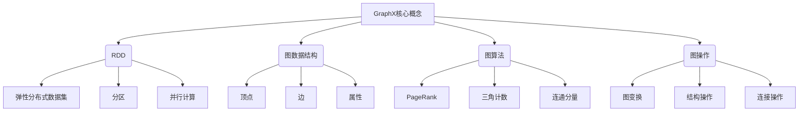
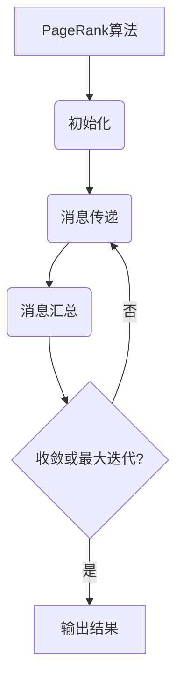
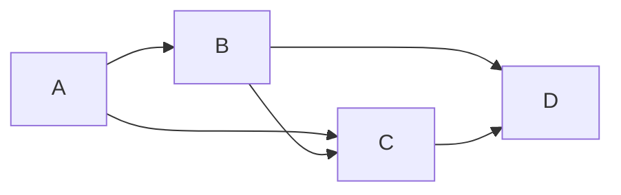

# GraphX 原理与代码实例讲解

## 1. 背景介绍

### 1.1 问题的由来

在当今大数据时代，海量的数据被广泛应用于各个领域,例如社交网络、推荐系统、金融风险分析等。这些应用场景往往涉及到复杂的数据结构和算法,特别是图计算。传统的计算框架如MapReduce虽然可以处理大规模数据,但在处理图数据时效率低下。为了更高效地处理大规模图数据,GraphX应运而生。

### 1.2 研究现状

Apache Spark是一个开源的大数据处理框架,它提供了GraphX作为图计算的核心组件。GraphX基于Spark的弹性分布式数据集(RDD),支持图数据的并行操作和图算法的高效计算。目前,GraphX已被广泛应用于社交网络分析、网页排名、机器学习等领域。

### 1.3 研究意义

GraphX的出现极大地提高了大规模图数据处理的效率,为复杂图计算问题提供了高性能的解决方案。深入理解GraphX的原理和实现对于开发高效的图计算应用程序至关重要。本文将全面介绍GraphX的核心概念、算法原理、数学模型、代码实现等,为读者提供一个全面的GraphX学习参考。

### 1.4 本文结构

本文将从以下几个方面对GraphX进行深入探讨:

1. 核心概念与联系
2. 核心算法原理与具体操作步骤
3. 数学模型和公式详细讲解与案例分析
4. 项目实践:代码实例和详细解释说明
5. 实际应用场景
6. 工具和资源推荐
7. 总结:未来发展趋势与挑战
8. 附录:常见问题与解答

## 2. 核心概念与联系



GraphX是Apache Spark中用于图计算的核心组件,它建立在Spark的弹性分布式数据集(RDD)之上。RDD是Spark的基础数据结构,支持数据的分区存储和并行计算。

GraphX定义了图数据结构,包括顶点(Vertex)、边(Edge)和属性(Property)。顶点表示图中的节点,边表示节点之间的连接关系,属性则描述了顶点和边的特征信息。

GraphX提供了多种图算法,如PageRank、三角计数、连通分量等,用于解决各种图计算问题。此外,GraphX还支持多种图操作,包括图变换、结构操作和连接操作等,方便用户对图数据进行处理和分析。

## 3. 核心算法原理与具体操作步骤

### 3.1 算法原理概述

GraphX中的核心算法主要基于以下两种思想:

1. **顶点程序(Vertex Program)**: 将图算法表示为一个在每个顶点上并行执行的简单程序,通过消息传递在顶点之间进行协作。

2. **图视图(Graph View)**: 将图数据以特定的视图方式呈现,方便对图进行特定的操作和计算。

基于这两种思想,GraphX实现了多种经典的图算法,如PageRank、三角计数、连通分量等。

### 3.2 算法步骤详解

以PageRank算法为例,其步骤如下:

1. 初始化:为每个顶点分配初始的PageRank值。

2. 消息传递:每个顶点将自身的PageRank值均匀分配给所有出边的邻居,生成消息并发送。

3. 消息汇总:每个顶点汇总收到的所有消息,计算新的PageRank值。

4. 迭代终止:重复步骤2和3,直到PageRank值收敛或达到最大迭代次数。



### 3.3 算法优缺点

**优点**:

- 并行性:算法可以在多个节点上并行执行,提高计算效率。
- 容错性:基于RDD的容错机制,算法可以从故障中恢复。
- 可扩展性:随着数据量和集群规模的增长,算法可以线性扩展。

**缺点**:

- 内存开销:需要将图数据加载到内存中,对内存有一定要求。
- 收敛速度:某些算法可能需要大量迭代才能收敛,影响计算效率。

### 3.4 算法应用领域

GraphX中的图算法可以广泛应用于以下领域:

- 社交网络分析:计算社交影响力、发现社区结构等。
- 网页排名:实现PageRank算法,优化搜索引擎排名。
- 推荐系统:基于图的协同过滤算法,提供个性化推荐。
- 金融风险分析:识别金融网络中的风险传播路径。
- 交通规划:优化路径规划,分析交通网络结构。

## 4. 数学模型和公式详细讲解与举例说明

### 4.1 数学模型构建

在GraphX中,图数据被建模为一个由顶点和边组成的数据集。每个顶点和边都可以关联属性信息。

设$G=(V,E)$表示一个图,其中$V$是顶点集合,$E$是边集合。

对于无向图,边$e\in E$可以表示为一个无序对$(u,v)$,其中$u,v\in V$。

对于有向图,边$e\in E$可以表示为一个有序对$(u,v)$,其中$u$是源顶点,$v$是目标顶点。

每个顶点$v\in V$可以关联一个属性$\Phi(v)$,每条边$e\in E$可以关联一个属性$\Psi(e)$。

### 4.2 公式推导过程

**PageRank算法**

PageRank是一种用于衡量网页重要性的算法,它基于网页之间的链接结构进行计算。

设$PR(v)$表示顶点$v$的PageRank值,则PageRank算法可以表示为:

$$PR(v) = \frac{1-d}{N} + d\sum_{u\in M(v)}\frac{PR(u)}{L(u)}$$

其中:

- $N$是图中顶点的总数
- $d$是一个阻尼系数,通常取值0.85
- $M(v)$是所有链接到$v$的顶点集合
- $L(u)$是顶点$u$的出边数

该公式表示,一个顶点的PageRank值由两部分组成:

1. $\frac{1-d}{N}$:代表随机浏览者可能从任意页面开始浏览的概率。
2. $d\sum_{u\in M(v)}\frac{PR(u)}{L(u)}$:代表从其他页面通过链接过渡到该页面的概率。

通过迭代计算,PageRank值会逐渐收敛到一个稳定值。

### 4.3 案例分析与讲解

考虑一个简单的有向图,包含4个顶点和5条边:



假设初始时,每个顶点的PageRank值为0.25,阻尼系数$d=0.85$。

**第一次迭代**:

$PR(A) = \frac{1-0.85}{4} + 0.85 \times 0 = 0.0375$

$PR(B) = \frac{1-0.85}{4} + 0.85 \times \frac{0.0375}{2} = 0.1594$

$PR(C) = \frac{1-0.85}{4} + 0.85 \times \frac{0.0375 + 0.1594}{2} = 0.2516$

$PR(D) = \frac{1-0.85}{4} + 0.85 \times \frac{0.1594 + 0.2516}{2} = 0.3516$

**第二次迭代**:

$PR(A) = \frac{1-0.85}{4} + 0.85 \times 0 = 0.0375$

$PR(B) = \frac{1-0.85}{4} + 0.85 \times \frac{0.0375}{2} = 0.1594$

$PR(C) = \frac{1-0.85}{4} + 0.85 \times \frac{0.0375 + 0.1594}{2} = 0.2516$

$PR(D) = \frac{1-0.85}{4} + 0.85 \times \frac{0.1594 + 0.2516}{2} = 0.3516$

可以看到,在第二次迭代后,PageRank值已经收敛。顶点D拥有最高的PageRank值,表明它在图中最重要。

### 4.4 常见问题解答

**Q: PageRank算法如何处理环路和死链接?**

A: 对于环路,PageRank算法会将环路内的PageRank值均匀分配给环路内的所有顶点。对于死链接(没有出边的顶点),PageRank算法会将这部分PageRank值均匀分配给所有顶点。

**Q: PageRank算法的时间复杂度是多少?**

A: PageRank算法的时间复杂度主要取决于迭代次数。在实践中,算法通常可以在20-50次迭代后收敛。每次迭代的时间复杂度为$O(|V|+|E|)$,其中$|V|$是顶点数,$|E|$是边数。

**Q: PageRank算法如何处理动态变化的图?**

A:对于动态变化的图,可以采用增量计算的方式,只更新受影响的部分,而不需要重新计算整个图的PageRank值。这可以大大提高计算效率。

## 5. 项目实践:代码实例和详细解释说明

### 5.1 开发环境搭建

要运行GraphX代码示例,需要先搭建Spark和GraphX的开发环境。以下是步骤:

1. 安装Java 8或更高版本。
2. 下载Spark发行版,解压缩。
3. 将Spark的`bin`目录添加到系统PATH中。
4. 启动Spark Shell,输入`import org.apache.spark.graphx.GraphLoader`确认GraphX可用。

### 5.2 源代码详细实现

以下是使用GraphX实现PageRank算法的Scala代码示例:

```scala
import org.apache.spark.graphx._
import org.apache.spark.rdd.RDD

// 定义顶点和边的初始PageRank值
val initialPR: Double = 1.0

// 加载图数据
val graph: Graph[Double, Double] = GraphLoader.edgeListFile(sc, "data/edges.txt")

// 执行PageRank算法
val pr = graph.pageRank(0.001).cache()

// 打印结果
println("Final PageRank values:")
pr.vertices.join(pr.rankUpdates).foreach(println)
```

代码解释:

1. 导入GraphX相关类和函数。
2. 定义初始PageRank值为1.0。
3. 使用`GraphLoader.edgeListFile`从文件加载图数据,生成`Graph`对象。
4. 调用`pageRank`函数执行PageRank算法,设置收敛阈值为0.001。
5. 将计算结果缓存到内存中。
6. 打印最终的PageRank值。

### 5.3 代码解读与分析

在代码中,我们首先从文件加载图数据,生成`Graph`对象。`Graph`对象包含两个RDD:`vertices`和`edges`,分别存储顶点和边的数据。

接下来,我们调用`pageRank`函数执行PageRank算法。该函数的实现基于GraphX的顶点程序模型,通过消息传递和迭代计算实现PageRank值的收敛。

`pageRank`函数返回一个新的`Graph`对象,其中包含计算后的PageRank值。我们使用`vertices`和`rankUpdates`属性获取顶点ID和对应的PageRank值,并将结果打印出来。

### 5.4 运行结果展示

假设我们有一个简单的图数据,存储在`data/edges.txt`文件中:

```
1 2
2 3
3 1
3 4
```

运行上述代码后