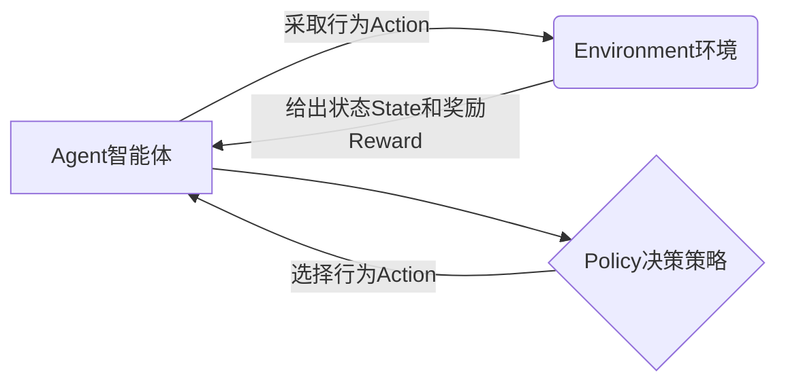
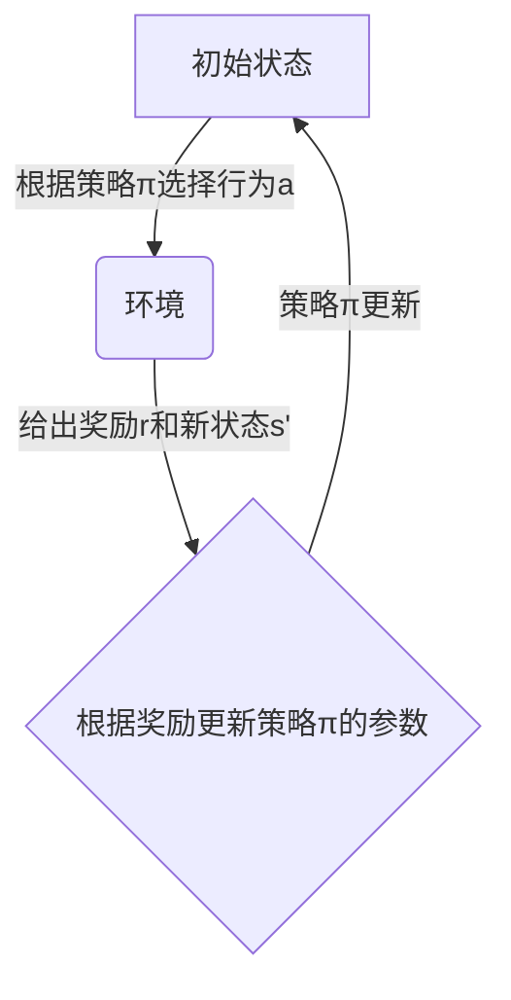
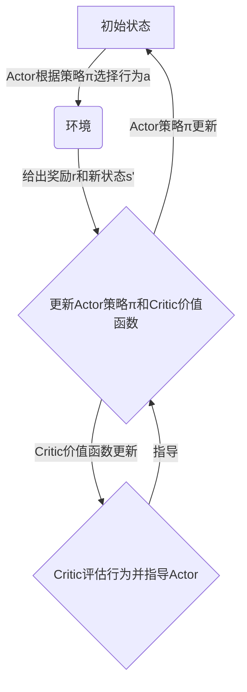

以下是《Reinforcement Learning 原理与代码实战案例讲解》这篇技术博客文章的正文内容：

# Reinforcement Learning 原理与代码实战案例讲解

## 1. 背景介绍

### 1.1 问题的由来

在人工智能领域中,机器学习算法一直是研究的热点和焦点。传统的监督学习和非监督学习算法在很多领域取得了巨大的成功,但是它们也存在一些局限性。监督学习需要大量精心标注的训练数据,而非监督学习则无法直接优化特定目标。这就催生了强化学习(Reinforcement Learning)这一全新的机器学习范式。

强化学习的核心思想是让智能体(Agent)通过与环境(Environment)不断试错互动,从环境反馈的奖惩信号(Reward)中自主学习,逐步优化自身的决策策略,最终获得最大化的长期累积奖励。这种学习方式更贴近人类和动物的学习过程,具有广阔的应用前景。

### 1.2 研究现状

近年来,强化学习理论和算法取得了长足的进步,在很多领域展现出了优异的性能。如AlphaGo战胜人类顶尖棋手、OpenAI的人工智能系统在多款Atari视频游戏中超越人类水平等,都是强化学习在实践中的杰出代表。

与此同时,结合深度学习技术的深度强化学习(Deep Reinforcement Learning)也日渐成熟,在连续控制、自然语言处理、计算机视觉等领域取得了突破性进展。但强化学习也面临着样本效率低下、reward设计困难、环境探索不足等诸多挑战。

### 1.3 研究意义

强化学习作为人工智能的一个重要分支,具有重大的理论意义和应用价值:

1. 理论层面,它为智能体在复杂环境中自主学习提供了有效的计算模型和学习框架。
2. 应用层面,强化学习可广泛应用于机器人控制、智能交通系统、智能制造、金融决策等诸多领域,有望带来革命性的影响。
3. 技术层面,强化学习与其他机器学习技术相结合,如深度学习、迁移学习等,可以相互促进,推动整个人工智能领域的发展。

因此,深入研究和掌握强化学习的原理和实践是非常有价值和意义的。

### 1.4 本文结构

本文将全面介绍强化学习的核心概念、关键算法、数学模型,并结合实战案例对算法原理和代码实现进行深入剖析,同时探讨强化学习在实际应用中的场景。最后对强化学习的发展趋势和面临的挑战进行展望和思考。全文共分为以下几个部分:

```
1. 背景介绍
2. 核心概念与联系
3. 核心算法原理与具体操作步骤
4. 数学模型和公式详细讲解与案例分析
5. 项目实践:代码实例和详细解释说明
6. 实际应用场景
7. 工具和资源推荐
8. 总结:未来发展趋势与挑战
9. 附录:常见问题与解答
```

## 2. 核心概念与联系

强化学习(Reinforcement Learning)是机器学习的一个重要分支,它的核心思想是让智能体(Agent)通过与环境(Environment)的交互作用,从环境反馈的奖惩信号(Reward)中学习,逐步优化自身的决策策略(Policy),以获得最大化的长期累积奖励。

强化学习系统由以下几个关键要素组成:



- **Agent(智能体)**: 在环境中与环境交互并学习的主体,根据当前状态选择行为,以期获得最大化的长期累积奖励。
- **Environment(环境)**: 智能体所处的外部世界,接收智能体的行为,并返回新的状态和对应的奖励信号。
- **State(状态)**: 环境的当前状况,可以是离散的或连续的。
- **Action(行为)**: 智能体根据当前状态采取的行动,可以是离散的或连续的。
- **Reward(奖励)**: 环境对智能体当前行为给予的反馈信号,可正可负,目标是最大化长期累积奖励。
- **Policy(决策策略)**: 智能体根据当前状态选择行为的策略,是强化学习算法需要学习优化的核心对象。

强化学习算法的目标就是通过智能体与环境的不断互动,学习到一个最优的Policy,使得在给定环境下,智能体可以获得最大化的长期累积奖励。

除了上述核心概念外,强化学习中还有一些其他重要概念,如价值函数(Value Function)、Q函数(Q-Function)、Markov决策过程(MDP)等,它们相互关联、环环相扣,共同构建了强化学习的理论基础和学习框架。我们将在后续章节中详细介绍和解释这些概念。

## 3. 核心算法原理与具体操作步骤

### 3.1 算法原理概述

强化学习算法可以分为基于价值函数(Value-based)、基于策略(Policy-based)和基于行为者-评论家(Actor-Critic)这三大类。每一类算法都有自己的特点和适用场景,下面我们对它们的核心原理进行概述:

1. **基于价值函数算法**

这类算法的核心思想是学习状态(或状态-行为对)的价值函数,并根据价值函数导出最优策略。典型的算法有Q-Learning、Sarsa、Deep Q-Network(DQN)等。

```mermaid
graph TD
    A[初始状态] -->|采取行为a| B(环境)
    B -->|给出奖励r和新状态s'| C{更新Q(s,a)价值函数}
    C -->|根据Q(s,a)选择最优行为| A
```

2. **基于策略算法**

这类算法直接对策略函数进行参数化建模,通过策略梯度的方式优化策略参数,使得在当前策略下获得的期望奖励最大化。典型的算法有REINFORCE、PPO、A3C等。



3. **基于行为者-评论家算法**

这类算法结合了价值函数和策略的优点,由两个模块组成:行为者(Actor)根据策略选择行为,评论家(Critic)评估行为并对策略进行指导。典型的算法有A2C、DDPG等。



不同类型的算法各有利弊,在具体问题中需要根据环境的特点和任务要求,选择合适的算法。我们将在后面详细介绍几种核心算法的原理和操作步骤。

### 3.2 算法步骤详解

接下来,我们以Q-Learning和Policy Gradient这两种核心算法为例,详细解释它们的工作原理和具体实现步骤。

#### 3.2.1 Q-Learning算法

Q-Learning是一种基于价值函数的强化学习算法,它直接对Q函数(状态-行为对的价值函数)进行估计和更新,并根据最大化Q值选择最优行为。算法步骤如下:

1. 初始化Q表格,对所有状态-行为对的Q值赋予一个较小的初始值。
2. 对于每一个时间步:
    - 根据当前状态s,选择一个行为a(如采用$\epsilon$-greedy策略)。
    - 执行行为a,获得奖励r和新状态s'。
    - 根据下式更新Q(s,a):

$$Q(s,a) \leftarrow Q(s,a) + \alpha[r + \gamma\max_{a'}Q(s',a') - Q(s,a)]$$

    其中,$\alpha$是学习率,$\gamma$是折扣因子。
3. 重复步骤2,直到Q值收敛。
4. 根据最终的Q值表,对于每个状态s,选择具有最大Q(s,a)值的行为a作为最优策略。

Q-Learning算法的关键在于通过不断更新Q值表,使其逐渐收敛到最优Q函数,从而导出最优策略。它的优点是理论上可以找到最优解,缺点是需要维护一张Q表,对于状态-行为对数量较大的问题,计算和存储开销都很大。

#### 3.2.2 Policy Gradient算法

Policy Gradient是一种基于策略的强化学习算法,它直接对策略函数进行参数化建模,通过计算策略梯度来优化策略参数,使得在当前策略下获得的期望奖励最大化。算法步骤如下:

1. 对策略函数$\pi_\theta(a|s)$进行参数化,其中$\theta$是策略参数。
2. 对于每一个episode:
    - 根据当前策略$\pi_\theta$与环境交互,生成一个episode的轨迹$\tau = (s_0,a_0,r_0,s_1,a_1,r_1,...,s_T)$。
    - 计算该episode的折扣累积奖励:$R(\tau) = \sum_{t=0}^{T}\gamma^tr_t$
    - 根据下式计算策略梯度:

$$\nabla_\theta J(\theta) = \mathbb{E}_{\tau\sim\pi_\theta}[R(\tau)\nabla_\theta\log\pi_\theta(\tau)]$$

    - 使用策略梯度上升法更新策略参数$\theta$:

$$\theta \leftarrow \theta + \alpha\nabla_\theta J(\theta)$$

    其中$\alpha$是学习率。
3. 重复步骤2,直到策略收敛。

Policy Gradient算法的关键是通过采样获得的episode轨迹,计算累积奖励的期望梯度,并沿着梯度方向更新策略参数。它的优点是可以直接对连续策略进行优化,适用于连续控制任务;缺点是需要大量样本才能获得较好的策略估计,收敛速度较慢。

除了上述两种经典算法,还有很多其他重要的强化学习算法,如Sarsa、DQN、A3C、PPO等,它们或结合了价值函数和策略的思想,或引入了深度神经网络进行函数逼近,在不同的应用场景下表现出色。我们将在后面的章节中对部分算法进行更深入的分析和讲解。

### 3.3 算法优缺点

不同的强化学习算法都有自身的优缺点,具体如下:

**基于价值函数算法:**
- 优点:
    - 理论上可以找到最优解
    - 算法相对简单,易于理解和实现
- 缺点:
    - 需要维护价值函数表格,对于状态-行为空间较大的问题,计算和存储开销很大
    - 收敛速度较慢,在大规模问题上可能不太实用

**基于策略算法:**
- 优点:
    - 可直接对连续策略进行优化,适用于连续控制任务
    - 无需维护价值函数表格,计算和存储开销较小
- 缺点:
    - 需要大量样本才能获得较好的策略估计,收敛速度较慢
    - 算法相对复杂,需要精心设计策略函数和梯度估计方法

**基于Actor-Critic算法:**
- 优点:
    - 结合了价值函数和策略的优点,可以同时利用两者的优势
    - 相比单一的价值函数或策略算法,收敛速度更快,性能更好
- 缺点:
    - 算法结构相对复杂,需要同时训练Actor和Critic两个模块
    - 对超参数的设置比较敏感,需要精心调试

总的来说,不同算法在不同场景下有不同的权衡取舍。在实际应用中,需要结合具体问题的特点,选择合适的算法并对其进行改进和优化。

### 3.4 算法应用