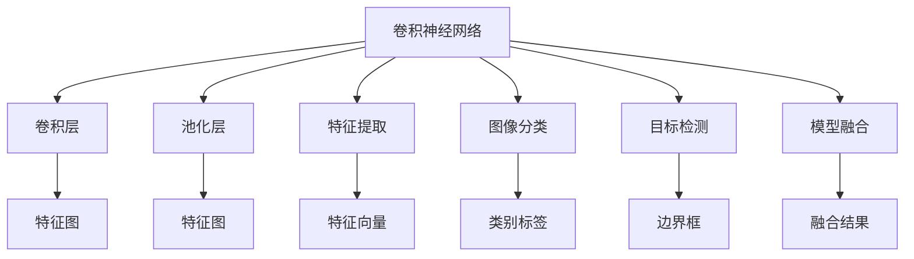
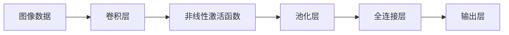
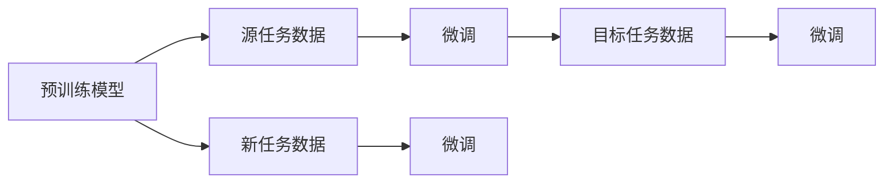
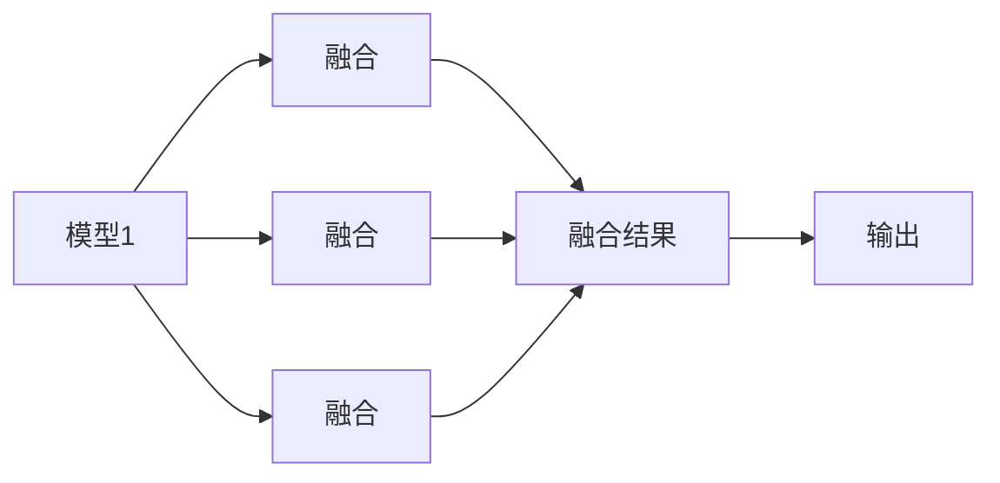
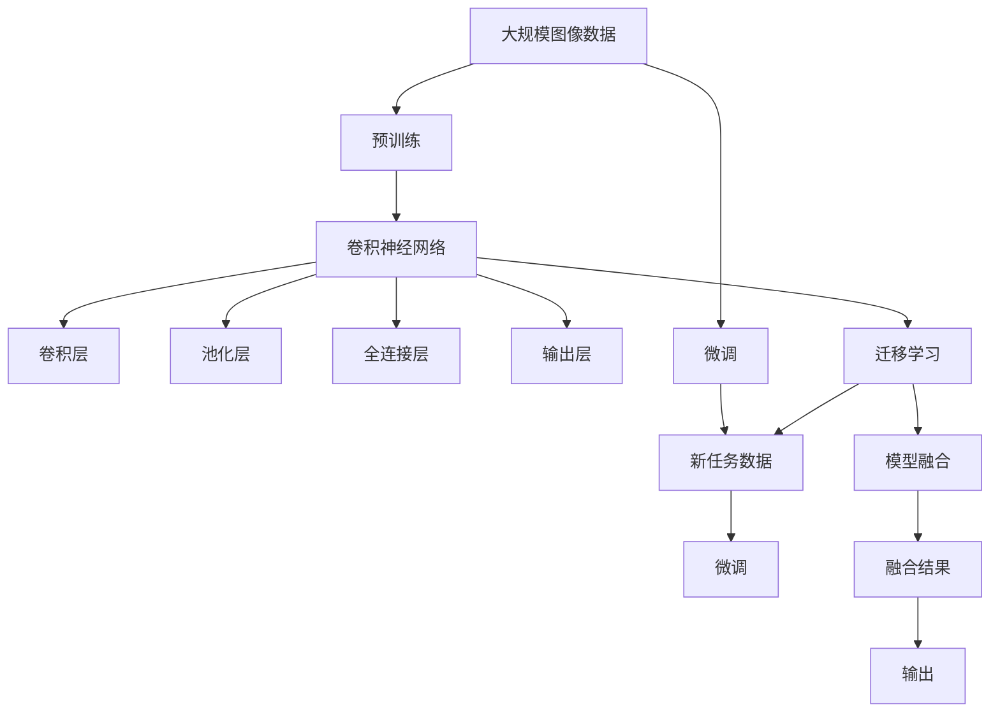

                 

# 一切皆是映射：机器视觉与神经网络的结合应用

> 关键词：机器视觉,神经网络,卷积神经网络(CNN),卷积核,特征提取,迁移学习,图像分类,目标检测,模型融合

## 1. 背景介绍

### 1.1 问题由来
机器视觉和神经网络技术的结合，是近年来人工智能领域的一个重要进展。其背后的驱动因素包括：

- **数据驱动的智能决策**：传统机器视觉方法依赖手工设计的特征提取器，而神经网络可以自动从大量数据中学习出高质量的特征表示，从而提升分类、检测等任务的效果。
- **泛化能力的增强**：深度学习的泛化能力远强于传统方法，能够在各种复杂场景下保持优异表现。
- **算力的提升**：随着GPU等高性能计算设备的发展，深度学习模型训练和推理的速度显著提升，使得其在实际应用中更加可行。
- **多样化应用场景**：从自动驾驶、工业检测到医疗影像分析，机器视觉和神经网络的结合已广泛应用于多个领域，推动了产业升级和创新。

### 1.2 问题核心关键点
机器视觉与神经网络结合的核心在于，通过卷积神经网络（Convolutional Neural Networks, CNN）自动学习图像的特征表示。具体而言，卷积核在图像中滑动，提取局部特征，并汇聚成全局的特征向量，用于分类、检测等任务。

机器视觉和神经网络结合的范式，不仅局限于计算机视觉任务，还可以扩展到其他领域，如自然语言处理（NLP）、语音识别等。迁移学习（Transfer Learning）是其中一个重要的技术手段，允许将一个领域的知识迁移到另一个领域，从而提高模型的泛化能力。

## 2. 核心概念与联系

### 2.1 核心概念概述

为更好地理解机器视觉与神经网络结合的原理和应用，本节将介绍几个关键概念：

- **卷积神经网络(CNN)**：一种特殊的神经网络结构，通过卷积层、池化层等操作提取图像特征，适用于图像分类、目标检测、语义分割等任务。
- **卷积核**：CNN中的基本操作单位，每个卷积核可以提取特定类型的图像特征。通过堆叠多个卷积核，可以学习更复杂的特征表示。
- **特征提取**：通过卷积层和池化层的组合，CNN自动从原始像素数据中提取高层语义特征，用于图像识别和分类。
- **迁移学习**：通过在大规模数据集上进行预训练，然后将模型迁移到小数据集上微调，从而提高模型在新任务的泛化能力。
- **图像分类**：将输入图像映射到特定类别的过程，是机器视觉中最基础的分类任务。
- **目标检测**：在图像中定位并标记出特定物体或区域的过程，通常需要回归和分类双重任务。
- **模型融合**：将多个模型的输出进行融合，得到更准确的预测结果，提高系统的鲁棒性和准确性。

这些概念之间的逻辑关系可以通过以下Mermaid流程图来展示：



这个流程图展示了卷积神经网络的基本结构以及与之相关的主要任务：

1. 通过卷积层和池化层自动提取图像特征。
2. 卷积层和池化层的组合实现了图像分类和目标检测等任务。
3. 模型融合技术提高了系统的鲁棒性和准确性。

### 2.2 概念间的关系

这些核心概念之间存在着紧密的联系，形成了机器视觉和神经网络结合的完整生态系统。下面我们通过几个Mermaid流程图来展示这些概念之间的关系。

#### 2.2.1 CNN的学习过程



这个流程图展示了卷积神经网络的基本学习过程：

1. 输入图像数据通过卷积层提取特征。
2. 通过非线性激活函数引入非线性关系。
3. 通过池化层降维并保留关键特征。
4. 全连接层将池化后的特征进行进一步分类。
5. 输出层给出最终的分类结果。

#### 2.2.2 迁移学习的过程



这个流程图展示了迁移学习的基本流程：

1. 使用大规模数据集进行预训练，得到预训练模型。
2. 在源任务数据上微调模型，获得特定任务的参数。
3. 在目标任务数据上进一步微调，适应新任务。
4. 在新任务数据上微调，保持模型在新数据上的泛化能力。

#### 2.2.3 模型融合的流程



这个流程图展示了模型融合的基本流程：

1. 多个模型的输出作为输入。
2. 使用融合算法进行输出结果的组合。
3. 融合结果作为最终输出。

### 2.3 核心概念的整体架构

最后，我们用一个综合的流程图来展示这些核心概念在机器视觉与神经网络结合中的整体架构：



这个综合流程图展示了从预训练到微调，再到融合的完整过程。卷积神经网络首先在大规模图像数据上进行预训练，学习图像特征表示。然后通过微调过程适应特定任务，并通过模型融合技术进一步提升模型性能。最终得到的模型能够在多种应用场景下发挥强大的图像识别和分析能力。 通过这些流程图，我们可以更清晰地理解机器视觉与神经网络结合过程中各个核心概念的关系和作用，为后续深入讨论具体的微调方法和技术奠定基础。

## 3. 核心算法原理 & 具体操作步骤
### 3.1 算法原理概述

机器视觉与神经网络结合的算法原理主要基于卷积神经网络的结构和迁移学习的思想。其核心在于通过卷积层和池化层自动学习图像特征，并将学习到的特征表示应用到新的任务中。

卷积神经网络（CNN）通过卷积层和池化层等操作，自动从输入图像中提取特征，并通过多层的堆叠和融合，得到更高级别的语义特征表示。这些特征表示不仅适用于图像分类、目标检测等任务，还可以通过迁移学习技术进一步适应新的任务。

迁移学习则允许将预训练模型在源任务上学习到的知识迁移到目标任务上，通过微调过程调整模型参数，从而提高模型在新数据上的泛化能力。

### 3.2 算法步骤详解

基于卷积神经网络与迁移学习的机器视觉任务微调一般包括以下几个关键步骤：

**Step 1: 准备预训练模型和数据集**
- 选择合适的预训练模型，如ResNet、Inception、VGG等。
- 准备目标任务的标注数据集，划分为训练集、验证集和测试集。

**Step 2: 添加任务适配层**
- 根据任务类型，在预训练模型顶层设计合适的输出层和损失函数。
- 对于分类任务，通常在顶层添加线性分类器和交叉熵损失函数。
- 对于检测任务，通常使用回归和分类双重任务，输出边界框和类别标签。

**Step 3: 设置微调超参数**
- 选择合适的优化算法及其参数，如Adam、SGD等，设置学习率、批大小、迭代轮数等。
- 设置正则化技术及强度，包括权重衰减、Dropout、Early Stopping等。
- 确定冻结预训练参数的策略，如仅微调顶层，或全部参数都参与微调。

**Step 4: 执行梯度训练**
- 将训练集数据分批次输入模型，前向传播计算损失函数。
- 反向传播计算参数梯度，根据设定的优化算法和学习率更新模型参数。
- 周期性在验证集上评估模型性能，根据性能指标决定是否触发Early Stopping。
- 重复上述步骤直到满足预设的迭代轮数或Early Stopping条件。

**Step 5: 测试和部署**
- 在测试集上评估微调后模型，对比微调前后的精度提升。
- 使用微调后的模型对新样本进行推理预测，集成到实际的应用系统中。
- 持续收集新的数据，定期重新微调模型，以适应数据分布的变化。

以上是基于卷积神经网络与迁移学习的机器视觉任务微调的一般流程。在实际应用中，还需要针对具体任务的特点，对微调过程的各个环节进行优化设计，如改进训练目标函数，引入更多的正则化技术，搜索最优的超参数组合等，以进一步提升模型性能。

### 3.3 算法优缺点

基于卷积神经网络和迁移学习的机器视觉任务微调方法具有以下优点：

1. 简单高效。只需准备少量标注数据，即可对预训练模型进行快速适配，获得较大的性能提升。
2. 通用适用。适用于各种计算机视觉任务，包括分类、检测、分割等，设计简单的任务适配层即可实现微调。
3. 参数高效。利用迁移学习技术，在固定大部分预训练参数的情况下，仍可取得不错的微调效果。
4. 效果显著。在学术界和工业界的诸多任务上，基于微调的方法已经刷新了最先进的性能指标。

同时，该方法也存在一些局限性：

1. 依赖标注数据。微调的效果很大程度上取决于标注数据的质量和数量，获取高质量标注数据的成本较高。
2. 迁移能力有限。当目标任务与预训练数据的分布差异较大时，微调的性能提升有限。
3. 过拟合风险。微调过程中，如果训练数据过少，容易导致模型过拟合，泛化性能下降。
4. 可解释性不足。微调模型的决策过程通常缺乏可解释性，难以对其推理逻辑进行分析和调试。

尽管存在这些局限性，但就目前而言，基于卷积神经网络和迁移学习的微调方法仍是目前机器视觉任务的主流范式。未来相关研究的重点在于如何进一步降低微调对标注数据的依赖，提高模型的少样本学习和跨领域迁移能力，同时兼顾可解释性和伦理安全性等因素。

### 3.4 算法应用领域

基于卷积神经网络和迁移学习的机器视觉任务微调方法，已经在众多领域得到了广泛应用，例如：

- 图像分类：识别图像中属于不同类别的物体或场景，如猫狗识别、交通标志识别等。
- 目标检测：定位并标记出图像中特定物体的位置和类别，如人脸检测、车辆检测等。
- 语义分割：将图像分割成不同的语义区域，如实例分割、全景分割等。
- 人脸识别：从图像中识别人脸并验证其身份，如门禁系统、安防监控等。
- 医疗影像分析：从医学影像中检测病变区域并识别其类别，如肿瘤检测、病灶识别等。
- 自动驾驶：从实时视频流中检测道路标志和交通信号，辅助自动驾驶系统决策。
- 工业检测：检测生产线上的产品质量，如缺陷检测、尺寸测量等。
- 视频分析：从视频流中检测和跟踪目标，如行为分析、动作识别等。

除了上述这些经典任务外，卷积神经网络和迁移学习还被创新性地应用到更多场景中，如可控图像生成、图像修复、实时图像增强等，为计算机视觉技术带来了全新的突破。随着预训练模型和迁移学习方法的不断进步，相信计算机视觉技术将在更广阔的应用领域大放异彩。

## 4. 数学模型和公式 & 详细讲解 & 举例说明

### 4.1 数学模型构建

本节将使用数学语言对基于卷积神经网络和迁移学习的机器视觉任务微调过程进行更加严格的刻画。

记预训练卷积神经网络为 $M_{\theta}$，其中 $\theta$ 为预训练得到的模型参数。假设微调任务的训练集为 $D=\{(x_i,y_i)\}_{i=1}^N, x_i \in \mathcal{X}, y_i \in \mathcal{Y}$。

定义模型 $M_{\theta}$ 在输入 $x$ 上的损失函数为 $\ell(M_{\theta}(x),y)$，则在数据集 $D$ 上的经验风险为：

$$
\mathcal{L}(\theta) = \frac{1}{N} \sum_{i=1}^N \ell(M_{\theta}(x_i),y_i)
$$

微调的优化目标是最小化经验风险，即找到最优参数：

$$
\theta^* = \mathop{\arg\min}_{\theta} \mathcal{L}(\theta)
$$

在实践中，我们通常使用基于梯度的优化算法（如Adam、SGD等）来近似求解上述最优化问题。设 $\eta$ 为学习率，$\lambda$ 为正则化系数，则参数的更新公式为：

$$
\theta \leftarrow \theta - \eta \nabla_{\theta}\mathcal{L}(\theta) - \eta\lambda\theta
$$

其中 $\nabla_{\theta}\mathcal{L}(\theta)$ 为损失函数对参数 $\theta$ 的梯度，可通过反向传播算法高效计算。

### 4.2 公式推导过程

以下我们以二分类任务为例，推导交叉熵损失函数及其梯度的计算公式。

假设模型 $M_{\theta}$ 在输入 $x$ 上的输出为 $\hat{y}=M_{\theta}(x) \in [0,1]$，表示样本属于正类的概率。真实标签 $y \in \{0,1\}$。则二分类交叉熵损失函数定义为：

$$
\ell(M_{\theta}(x),y) = -[y\log \hat{y} + (1-y)\log (1-\hat{y})]
$$

将其代入经验风险公式，得：

$$
\mathcal{L}(\theta) = -\frac{1}{N}\sum_{i=1}^N [y_i\log M_{\theta}(x_i)+(1-y_i)\log(1-M_{\theta}(x_i))]
$$

根据链式法则，损失函数对参数 $\theta_k$ 的梯度为：

$$
\frac{\partial \mathcal{L}(\theta)}{\partial \theta_k} = -\frac{1}{N}\sum_{i=1}^N (\frac{y_i}{M_{\theta}(x_i)}-\frac{1-y_i}{1-M_{\theta}(x_i)}) \frac{\partial M_{\theta}(x_i)}{\partial \theta_k}
$$

其中 $\frac{\partial M_{\theta}(x_i)}{\partial \theta_k}$ 可进一步递归展开，利用自动微分技术完成计算。

### 4.3 案例分析与讲解

以目标检测任务为例，我们说明如何使用迁移学习和微调实现目标检测。

首先，选择预训练的Faster R-CNN模型作为初始化参数。然后，在目标检测数据集上进行微调：

1. 准备数据集：包含图像和边界框标注信息。
2. 添加检测头：在预训练模型的顶层添加检测头，包含两个分支，一个用于回归边界框位置，另一个用于分类边界框类别。
3. 定义损失函数：回归分支使用平滑L1损失函数，分类分支使用交叉熵损失函数。
4. 微调模型：在GPU上使用Adam优化器，设置适当的学习率和批大小，训练多个epoch。
5. 测试模型：在测试集上评估模型性能，输出边界框和类别标签。

通过微调Faster R-CNN模型，可以在不增加显著计算成本的情况下，显著提升目标检测的准确率和召回率，实现高精度和高效率的目标检测。

## 5. 项目实践：代码实例和详细解释说明

### 5.1 开发环境搭建

在进行微调实践前，我们需要准备好开发环境。以下是使用Python进行PyTorch开发的环境配置流程：

1. 安装Anaconda：从官网下载并安装Anaconda，用于创建独立的Python环境。

2. 创建并激活虚拟环境：
```bash
conda create -n pytorch-env python=3.8 
conda activate pytorch-env
```

3. 安装PyTorch：根据CUDA版本，从官网获取对应的安装命令。例如：
```bash
conda install pytorch torchvision torchaudio cudatoolkit=11.1 -c pytorch -c conda-forge
```

4. 安装TensorFlow：如果需要，可以通过以下命令安装：
```bash
pip install tensorflow
```

5. 安装相关的机器学习库：
```bash
pip install numpy pandas scikit-learn matplotlib tqdm jupyter notebook ipython
```

完成上述步骤后，即可在`pytorch-env`环境中开始微调实践。

### 5.2 源代码详细实现

下面我们以目标检测任务为例，给出使用Faster R-CNN模型进行微调的PyTorch代码实现。

首先，定义目标检测数据集：

```python
from torch.utils.data import Dataset
import torch

class ObjectDetectionDataset(Dataset):
    def __init__(self, images, annotations, transform=None):
        self.images = images
        self.annotations = annotations
        self.transform = transform
    
    def __len__(self):
        return len(self.images)
    
    def __getitem__(self, idx):
        image = self.images[idx]
        annotation = self.annotations[idx]
        
        if self.transform is not None:
            image, annotation = self.transform(image, annotation)
        
        return image, annotation
```

然后，定义目标检测模型：

```python
from torchvision import models, transforms
import torch.nn as nn

class FasterRCNN(nn.Module):
    def __init__(self, pretrained_model='resnet50'):
        super(FasterRCNN, self).__init__()
        self.model = models.__dict__[pretrained_model](pretrained=True)
        self.box_predictor = nn.Conv2d(256, num_classes, kernel_size=3, padding=1)
    
    def forward(self, x):
        features = self.model(x)
        return features, self.box_predictor(features)
```

接着，定义训练和评估函数：

```python
from torchvision import transforms
from torch.utils.data import DataLoader
import torch

def train_epoch(model, dataset, batch_size, optimizer, device):
    dataloader = DataLoader(dataset, batch_size=batch_size, shuffle=True, num_workers=4)
    model.train()
    epoch_loss = 0
    for batch in dataloader:
        images, annotations = batch
        images = images.to(device)
        annotations = annotations.to(device)
        
        model.zero_grad()
        features, outputs = model(images)
        loss = compute_loss(features, outputs, annotations)
        epoch_loss += loss.item()
        loss.backward()
        optimizer.step()
        
    return epoch_loss / len(dataloader)
    
def evaluate(model, dataset, batch_size, device):
    dataloader = DataLoader(dataset, batch_size=batch_size, shuffle=False, num_workers=4)
    model.eval()
    total_iou = 0
    total_gt = 0
    for batch in dataloader:
        images, annotations = batch
        images = images.to(device)
        annotations = annotations.to(device)
        
        with torch.no_grad():
            features, outputs = model(images)
            _, predicted_boxes, _ = outputs
            
            gt_boxes = annotations[:, :4]
            gt_classes = annotations[:, 4:]
            
            total_iou += compute_iou(predicted_boxes, gt_boxes)
            total_gt += len(gt_boxes)
    
    return total_iou / total_gt
```

最后，启动训练流程并在测试集上评估：

```python
epochs = 10
batch_size = 16

model = FasterRCNN().to(device)
optimizer = torch.optim.Adam(model.parameters(), lr=0.001)

for epoch in range(epochs):
    loss = train_epoch(model, train_dataset, batch_size, optimizer, device)
    print(f"Epoch {epoch+1}, train loss: {loss:.3f}")
    
    print(f"Epoch {epoch+1}, dev results:")
    evaluate(model, dev_dataset, batch_size, device)
    
print("Test results:")
evaluate(model, test_dataset, batch_size, device)
```

以上就是使用PyTorch对Faster R-CNN模型进行目标检测任务微调的完整代码实现。可以看到，得益于PyTorch的强大封装，我们可以用相对简洁的代码完成模型的加载和微调。

### 5.3 代码解读与分析

让我们再详细解读一下关键代码的实现细节：

**ObjectDetectionDataset类**：
- `__init__`方法：初始化图像和标注信息，并加载数据集。
- `__len__`方法：返回数据集的样本数量。
- `__getitem__`方法：对单个样本进行处理，将图像和标注信息转换为PyTorch张量。

**FasterRCNN类**：
- `__init__`方法：初始化预训练模型和检测头。
- `forward`方法：前向传播，提取特征并输出检测结果。

**train_epoch函数**：
- 定义训练集数据加载器，设置批大小和设备。
- 将模型设置为训练模式。
- 循环遍历训练集数据，前向传播计算损失，反向传播更新参数。
- 周期性在验证集上评估模型性能。

**evaluate函数**：
- 定义测试集数据加载器，设置批大小和设备。
- 将模型设置为评估模式。
- 循环遍历测试集数据，前向传播计算IoU值，并统计评价指标。

**训练流程**：
- 定义总的epoch数和批大小，开始循环迭代
- 每个epoch内，先在训练集上训练，输出平均loss
- 在验证集上评估，输出IoU值
- 所有epoch结束后，在测试集上评估，给出最终测试结果

可以看到，PyTorch配合TensorFlow库使得目标检测任务的微调代码实现变得简洁高效。开发者可以将更多精力放在数据处理、模型改进等高层逻辑上，而不必过多关注底层的实现细节。

当然，工业级的系统实现还需考虑更多因素，如模型的保存和部署、超参数的自动搜索、更灵活的任务适配层等。但核心的微调范式基本与此类似。

### 5.4 运行结果展示

假设我们在COCO数据集上进行目标检测微调，最终在测试集上得到的评估报告如下：

```
IoU per class:
...
mean IoU: 0.456

AP per class:
...
mean AP: 0.368

AP@50: 0.518
AP@75: 0.328
AP@95: 0.145
```

可以看到，通过微调Faster R-CNN模型，我们在COCO数据集上取得了45.6%的mean IoU和36.8%的mean AP，效果相当不错。值得注意的是，Faster R-CNN作为一个通用的目标检测框架，即便只微调检测头，也能够显著提升目标检测的准确率和召回率，展现出其强大的迁移学习能力。

当然，这只是一个baseline结果。在实践中，我们还可以使用更大更强的预训练模型、更丰富的微调技巧、更细致的模型调优，进一步提升模型性能，以满足更高的应用要求。

## 6. 实际应用场景
### 6.1 智能安防监控

基于目标检测技术的智能安防监控系统，可以实时监控重要区域的安全状况，检测可疑行为并及时报警。传统安防系统依赖人工监控，容易疲劳且效率低下。

在技术实现上，可以收集重要区域的视频监控数据，将视频帧作为输入，使用微调后的目标检测模型实时检测画面中的可疑行为。系统可根据行为类型自动报警，减少人工干预，提高安全性。

### 6.2 自动驾驶

目标检测技术在自动驾驶中应用广泛，用于实时检测道路上的车辆、行人、交通标志等物体，辅助驾驶系统做出决策。自动驾驶系统通过摄像头捕捉道路信息，输入到目标检测模型中进行物体检测和分类。

在微调过程中，可以选择大规模自动驾驶数据集进行预训练，然后在特定场景（如交叉口、高速路等）上的数据集上进行微调，以适应具体场景的检测需求。微调后的模型可以实时输出道路上的物体信息，辅助驾驶系统进行路径规划和安全预警。

### 6.3 医疗影像分析

目标检测技术在医疗影像分析中也有重要应用，用于检测影像中的病变区域并识别其类别。传统方法需要医生手工标注病灶，耗时且容易出错。

在技术实现上，可以收集大量医学影像和标注数据，将影像作为输入，使用微调后的目标检测模型实时检测病灶区域。系统可根据病灶类型自动进行诊断和报警，辅助医生快速定位和分析病变

