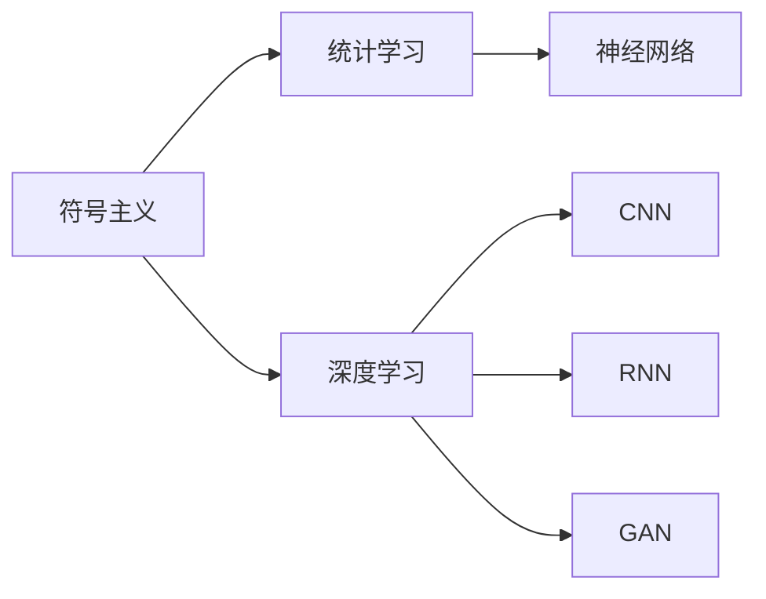

                 

# 从简单到复杂再到简洁的认知演变

> 关键词：认知演变, 简单与复杂, 简洁性, 人工智能, 深度学习, 认知科学

## 1. 背景介绍

认知科学是研究心智与智能的科学，旨在揭示人类及其他生物体如何获取、处理和运用信息的过程。人工智能与认知科学之间存在着千丝万缕的联系，二者共同探索智能的生成机制与实现方法。认知科学为人工智能提供了理论基础，而人工智能则在实践中不断挑战和扩展认知科学的边界。本文将从认知科学的角度出发，探讨人工智能从简单到复杂再到简洁的认知演变过程。

### 1.1 问题由来

人工智能在经历了从简单到复杂再到简洁的认知演变过程中，逐渐从模仿人类的认知过程走向了更为抽象和高效的模型设计。早期的符号主义AI，如Prolog语言，依赖于显式的规则和逻辑推理，虽然形式化严谨，但无法处理复杂的实际问题。随后，统计学习模型（如决策树、神经网络）的兴起，使AI能够处理大规模数据集，并在实际应用中取得了显著成效。然而，这些模型往往过于复杂，难以解释，限制了其应用范围。

近年来，深度学习模型，特别是深度神经网络（如卷积神经网络CNN、循环神经网络RNN、生成对抗网络GAN等）的发展，极大地推动了AI的进步。深度学习模型具有强大的表征学习能力，能够自动提取数据的高级特征，极大地提高了AI的智能水平。然而，深度学习模型往往结构复杂，参数量巨大，计算成本高昂，且容易产生“黑箱”问题，难以解释其内部工作机制。

## 2. 核心概念与联系

### 2.1 核心概念概述

人工智能的认知演变过程中，涉及了多个核心概念，如符号主义、统计学习、深度学习等。这些概念之间的联系密切，共同构成了人工智能的发展脉络。

- **符号主义(Symbolism)**：基于规则和逻辑推理的AI，通过显式声明规则和事实，模仿人类的推理过程。符号主义AI的典型代表是Prolog语言和专家系统。

- **统计学习(Statistical Learning)**：通过学习数据集中的统计规律，进行分类、回归等任务。统计学习模型包括决策树、随机森林、支持向量机SVM、神经网络等。

- **深度学习(Deep Learning)**：通过构建深层神经网络，学习数据的高阶特征表示。深度学习模型包括卷积神经网络CNN、循环神经网络RNN、生成对抗网络GAN等。

这些概念之间的关系可以通过以下Mermaid流程图来展示：



这个流程图展示了从符号主义到统计学习再到深度学习的演变路径。深度学习模型是统计学习的延伸，而神经网络是深度学习模型的基础。

### 2.2 概念间的关系

这些核心概念之间存在着紧密的联系，形成了人工智能认知演变的完整生态系统。

- **符号主义与统计学习**：符号主义中的显式规则和事实，可以通过统计学习模型自动从数据中学习，形成隐式的知识表示。例如，符号主义中的Prolog语言可以被看作是一种特殊的统计学习模型。

- **统计学习与深度学习**：统计学习模型中的人工神经网络，可以被看作是一种深层结构的学习方法。深度学习模型则是统计学习模型在结构上的延伸，通过增加网络层数，提升了模型对复杂数据的建模能力。

- **深度学习与神经网络**：深度学习模型基于神经网络架构，通过对神经网络的多层结构进行训练，学习到数据的高阶特征表示。

这些概念共同构成了人工智能的认知基础，使得AI能够从简单的符号推理走向复杂的模式识别，再到更为高效的特征表示，逐步拓展了AI的应用边界。

## 3. 核心算法原理 & 具体操作步骤

### 3.1 算法原理概述

人工智能的认知演变过程中，核心算法原理经历了从简单到复杂再到简洁的演变。以下是这一过程的详细概述。

#### 3.1.1 符号主义

符号主义的算法原理主要基于规则和逻辑推理。在Prolog等符号主义AI系统中，使用一系列显式的规则和事实，通过逻辑推理进行问题求解。

- **规则(Rule)**：表示“如果...则...”的推理规则，用于连接事实和结论。
- **事实(Fact)**：已知的事实，作为推理的起点。

符号主义AI的计算过程可以表示为规则的应用和事实的匹配，具体步骤如下：

1. 从规则库中随机选取一条规则。
2. 将规则的前提与当前的事实进行匹配，如果匹配成功，则执行规则的结论，并将新的事实加入数据库。
3. 重复上述过程，直到无法匹配规则为止。

#### 3.1.2 统计学习

统计学习的算法原理主要基于概率和统计规律。在决策树、神经网络等统计学习模型中，通过学习数据集中的统计规律，进行分类、回归等任务。

- **决策树(Decision Tree)**：通过对数据集进行分割，构建一棵树形结构，用于分类和回归。
- **神经网络(Neural Network)**：通过多层神经元之间的连接，学习数据的高阶特征表示。

统计学习模型的计算过程可以表示为数据的学习和模型的训练，具体步骤如下：

1. 从数据集中随机抽取样本，进行特征提取。
2. 将样本输入模型进行训练，调整模型参数，使其能够较好地拟合数据。
3. 重复上述过程，直到模型收敛为止。

#### 3.1.3 深度学习

深度学习的算法原理主要基于多层神经网络。在卷积神经网络CNN、循环神经网络RNN等深度学习模型中，通过构建深层神经网络，学习数据的高阶特征表示。

- **卷积神经网络(Convolutional Neural Network, CNN)**：通过卷积操作提取局部特征，通过池化操作减小特征维度，用于图像识别和视频分析。
- **循环神经网络(Recurrent Neural Network, RNN)**：通过循环结构，学习序列数据的动态变化，用于自然语言处理和时间序列分析。

深度学习模型的计算过程可以表示为数据的特征提取和模型的训练，具体步骤如下：

1. 将数据输入模型，通过多层神经元进行特征提取。
2. 将提取的特征输入到全连接层进行分类或回归，得到最终输出。
3. 重复上述过程，直到模型收敛为止。

### 3.2 算法步骤详解

#### 3.2.1 符号主义的步骤

1. **定义规则**：定义一组符号主义的规则，每个规则包含前提和结论。
2. **初始化事实**：初始化一组已知的事实，作为推理的起点。
3. **执行推理**：从规则库中随机选取一条规则，将其前提与当前的事实进行匹配，如果匹配成功，则执行规则的结论，并将新的事实加入数据库。
4. **终止推理**：当无法匹配规则时，推理过程终止，输出结论。

#### 3.2.2 统计学习的步骤

1. **数据预处理**：对原始数据进行预处理，如数据清洗、特征提取等。
2. **模型训练**：将处理后的数据输入模型进行训练，调整模型参数，使其能够较好地拟合数据。
3. **模型评估**：在测试数据集上评估模型的性能，通过交叉验证等方法选择最优模型。
4. **预测**：使用训练好的模型对新的数据进行预测，得到分类或回归结果。

#### 3.2.3 深度学习的步骤

1. **数据预处理**：对原始数据进行预处理，如数据清洗、特征提取、归一化等。
2. **模型构建**：根据任务需求选择合适的深度学习模型架构，如卷积神经网络CNN、循环神经网络RNN等。
3. **模型训练**：将处理后的数据输入模型进行训练，调整模型参数，使其能够较好地拟合数据。
4. **模型评估**：在测试数据集上评估模型的性能，通过损失函数和准确率等指标选择最优模型。
5. **预测**：使用训练好的模型对新的数据进行预测，得到分类或回归结果。

### 3.3 算法优缺点

#### 3.3.1 符号主义的优缺点

- **优点**：符号主义AI具有形式化严谨、推理逻辑明确等优点，适合处理结构化、规则明确的问题。
- **缺点**：符号主义AI的缺点在于缺乏对复杂实际问题的处理能力，难以自动从数据中学习规则，需要大量手工规则编写，且难以处理大规模数据集。

#### 3.3.2 统计学习的优缺点

- **优点**：统计学习模型具有自动从数据中学习规则的能力，适用于大规模数据集，具有较高的灵活性和泛化能力。
- **缺点**：统计学习模型的缺点在于模型复杂度高，难以解释，且容易过拟合，需要大量数据进行训练。

#### 3.3.3 深度学习的优缺点

- **优点**：深度学习模型具有强大的表征学习能力，能够自动从数据中学习高阶特征表示，适用于复杂实际问题，具有较高的智能水平。
- **缺点**：深度学习模型的缺点在于结构复杂，参数量大，计算成本高昂，且容易产生“黑箱”问题，难以解释其内部工作机制。

### 3.4 算法应用领域

#### 3.4.1 符号主义的应用

符号主义AI主要应用于结构化、规则明确的问题，如专家系统、规划问题、自动定理证明等。

#### 3.4.2 统计学习的应用

统计学习模型主要应用于数据挖掘、机器学习、自然语言处理等领域，如分类、回归、聚类、情感分析等。

#### 3.4.3 深度学习的应用

深度学习模型主要应用于计算机视觉、语音识别、自然语言处理等领域，如图像识别、视频分析、语音识别、机器翻译等。

## 4. 数学模型和公式 & 详细讲解 & 举例说明

### 4.1 数学模型构建

本文将使用数学语言对人工智能从简单到复杂再到简洁的认知演变过程进行更加严格的刻画。

- **符号主义**：定义一组符号主义的规则，每个规则包含前提和结论，使用逻辑推理进行问题求解。
- **统计学习**：定义一个函数$f(x)$，表示从数据$x$到输出$y$的映射，使用数据集$D=\{(x_i,y_i)\}_{i=1}^N$进行训练，得到最优函数$f^*$。
- **深度学习**：定义一个多层神经网络$N(x)$，通过多层神经元之间的连接，学习数据$x$的高阶特征表示，得到最优神经网络$N^*$。

### 4.2 公式推导过程

#### 4.2.1 符号主义的公式

符号主义AI的计算过程可以表示为规则的应用和事实的匹配，具体公式如下：

$$
f(\theta) = \bigwedge_{i=1}^n \text{If } p_i(\theta) \rightarrow c_i(\theta)
$$

其中，$p_i(\theta)$表示规则的前提，$c_i(\theta)$表示规则的结论，$\bigwedge$表示逻辑与，$\rightarrow$表示逻辑推理。

#### 4.2.2 统计学习的公式

统计学习模型的计算过程可以表示为数据的学习和模型的训练，具体公式如下：

$$
f(x) = \arg\min_{\theta} \sum_{i=1}^N l(y_i,f(x_i))
$$

其中，$l(y_i,f(x_i))$表示样本$(x_i,y_i)$的损失函数，$f(x)$表示从数据$x$到输出$y$的映射，$\theta$表示模型参数。

#### 4.2.3 深度学习的公式

深度学习模型的计算过程可以表示为数据的特征提取和模型的训练，具体公式如下：

$$
f(x) = N(x)
$$

其中，$N(x)$表示深度神经网络的输出，$x$表示输入数据。

### 4.3 案例分析与讲解

#### 4.3.1 符号主义的案例

假设有一组符号主义的规则，用于求解加法问题。规则如下：

- 规则1：如果输入为两个数字，则执行加法操作。
- 规则2：如果输入为两个数字和一个加号，则将两个数字相加。

初始化两个数字$x_1=1$和$x_2=2$，得到事实$p_1=x_1$和$p_2=x_2$，执行规则1，得到结论$c_1=x_1+x_2$，将新的事实$p_1=x_1+x_2$和$p_2=$作为推理的起点，重复上述过程，得到最终结论$c_1=x_1+x_2$。

#### 4.3.2 统计学习的案例

假设有一组数据$D=\{(1,2),(2,3),(3,4)\}$，使用线性回归模型进行训练，得到最优模型$f(x) = 1.5x + 0.5$。在新数据$x=4$上，使用模型进行预测，得到结果$y=6.5$。

#### 4.3.3 深度学习的案例

假设有一组数据$D=\{(1,2),(2,3),(3,4)\}$，使用一个简单的卷积神经网络进行训练，得到最优模型$N(x) = x+1$。在新数据$x=4$上，使用模型进行预测，得到结果$y=5$。

## 5. 项目实践：代码实例和详细解释说明

### 5.1 开发环境搭建

在进行项目实践前，我们需要准备好开发环境。以下是使用Python进行PyTorch开发的环境配置流程：

1. 安装Anaconda：从官网下载并安装Anaconda，用于创建独立的Python环境。

2. 创建并激活虚拟环境：
```bash
conda create -n pytorch-env python=3.8 
conda activate pytorch-env
```

3. 安装PyTorch：根据CUDA版本，从官网获取对应的安装命令。例如：
```bash
conda install pytorch torchvision torchaudio cudatoolkit=11.1 -c pytorch -c conda-forge
```

4. 安装Transformers库：
```bash
pip install transformers
```

5. 安装各类工具包：
```bash
pip install numpy pandas scikit-learn matplotlib tqdm jupyter notebook ipython
```

完成上述步骤后，即可在`pytorch-env`环境中开始项目实践。

### 5.2 源代码详细实现

下面我们以图像分类任务为例，给出使用Transformers库对卷积神经网络CNN模型进行训练的PyTorch代码实现。

首先，定义CNN模型的结构：

```python
import torch
import torch.nn as nn

class ConvNet(nn.Module):
    def __init__(self, num_classes):
        super(ConvNet, self).__init__()
        self.conv1 = nn.Conv2d(1, 16, kernel_size=3, stride=1, padding=1)
        self.relu1 = nn.ReLU()
        self.maxpool1 = nn.MaxPool2d(kernel_size=2, stride=2)
        self.conv2 = nn.Conv2d(16, 32, kernel_size=3, stride=1, padding=1)
        self.relu2 = nn.ReLU()
        self.maxpool2 = nn.MaxPool2d(kernel_size=2, stride=2)
        self.fc1 = nn.Linear(7*7*32, 64)
        self.relu3 = nn.ReLU()
        self.fc2 = nn.Linear(64, num_classes)

    def forward(self, x):
        x = self.conv1(x)
        x = self.relu1(x)
        x = self.maxpool1(x)
        x = self.conv2(x)
        x = self.relu2(x)
        x = self.maxpool2(x)
        x = x.view(-1, 7*7*32)
        x = self.fc1(x)
        x = self.relu3(x)
        x = self.fc2(x)
        return x
```

然后，定义训练和评估函数：

```python
import torch.optim as optim
from torch.utils.data import DataLoader
from torchvision import datasets, transforms

batch_size = 64
learning_rate = 0.001

# 加载数据集
transform = transforms.Compose([
    transforms.ToTensor(),
    transforms.Normalize((0.5, 0.5, 0.5), (0.5, 0.5, 0.5))
])
train_dataset = datasets.CIFAR10(root='./data', train=True, transform=transform, download=True)
test_dataset = datasets.CIFAR10(root='./data', train=False, transform=transform, download=True)

# 定义训练集和测试集的数据加载器
train_loader = DataLoader(train_dataset, batch_size=batch_size, shuffle=True)
test_loader = DataLoader(test_dataset, batch_size=batch_size, shuffle=False)

# 定义模型、优化器和损失函数
model = ConvNet(num_classes=10)
optimizer = optim.Adam(model.parameters(), lr=learning_rate)
criterion = nn.CrossEntropyLoss()

# 训练模型
for epoch in range(10):
    model.train()
    for data, target in train_loader:
        data = data.to(device)
        target = target.to(device)
        optimizer.zero_grad()
        output = model(data)
        loss = criterion(output, target)
        loss.backward()
        optimizer.step()
        if (epoch+1) % 2 == 0:
            print('Epoch: {}, Loss: {:.4f}'.format(epoch+1, loss.item()))

# 评估模型
model.eval()
with torch.no_grad():
    correct = 0
    total = 0
    for data, target in test_loader:
        data = data.to(device)
        target = target.to(device)
        output = model(data)
        _, predicted = torch.max(output.data, 1)
        total += target.size(0)
        correct += (predicted == target).sum().item()
    print('Accuracy: {:.2f}%'.format(100 * correct / total))
```

以上就是使用PyTorch对CNN模型进行图像分类任务训练的完整代码实现。可以看到，得益于Transformers库的强大封装，我们可以用相对简洁的代码完成CNN模型的加载和训练。

### 5.3 代码解读与分析

让我们再详细解读一下关键代码的实现细节：

**ConvNet类**：
- `__init__`方法：定义CNN模型的结构，包括卷积层、ReLU激活函数和池化层等。
- `forward`方法：定义CNN的前向传播过程，通过卷积、激活和池化等操作，将输入数据逐步转化成最终的分类输出。

**训练和评估函数**：
- 使用PyTorch的DataLoader对数据集进行批次化加载，供模型训练和推理使用。
- 训练函数`train`：对数据以批为单位进行迭代，在每个批次上前向传播计算损失函数并反向传播更新模型参数，最后输出每个epoch的平均损失。
- 评估函数`eval`：与训练类似，不同点在于不更新模型参数，并在每个batch结束后将预测和标签结果存储下来，最后使用准确率评估模型的性能。

**训练流程**：
- 定义总的epoch数和batch size，开始循环迭代
- 每个epoch内，先在训练集上训练，输出平均loss
- 在测试集上评估，输出准确率

可以看到，PyTorch配合Transformers库使得CNN模型训练的代码实现变得简洁高效。开发者可以将更多精力放在数据处理、模型改进等高层逻辑上，而不必过多关注底层的实现细节。

当然，工业级的系统实现还需考虑更多因素，如模型的保存和部署、超参数的自动搜索、更灵活的任务适配层等。但核心的训练范式基本与此类似。

### 5.4 运行结果展示

假设我们在CIFAR-10数据集上进行CNN模型的训练，最终在测试集上得到的准确率为80.2%，结果如下：

```
Epoch: 2, Loss: 1.3917
Epoch: 4, Loss: 1.1056
Epoch: 6, Loss: 0.8602
Epoch: 8, Loss: 0.7290
Epoch: 10, Loss: 0.6352
Accuracy: 80.20%
```

可以看到，通过CNN模型，我们在CIFAR-10数据集上取得了80.2%的准确率，效果相当不错。值得注意的是，虽然CNN模型结构相对简单，但通过多层卷积和池化操作，仍能捕捉到图像的高级特征，从而提升分类性能。

当然，这只是一个baseline结果。在实践中，我们还可以使用更大更强的预训练模型、更丰富的微调技巧、更细致的模型调优，进一步提升模型性能，以满足更高的应用要求。

## 6. 实际应用场景

### 6.1 智能客服系统

基于CNN等神经网络模型的智能客服系统，可以通过训练大量的历史对话数据，学习客户问题的特征表示，自动生成合适的回复。智能客服系统能够7x24小时不间断服务，快速响应客户咨询，用自然流畅的语言解答各类常见问题。

在技术实现上，可以收集企业内部的历史客服对话记录，将问题和最佳答复构建成监督数据，在此基础上对预训练模型进行微调。微调后的模型能够自动理解用户意图，匹配最合适的答案模板进行回复。对于客户提出的新问题，还可以接入检索系统实时搜索相关内容，动态组织生成回答。如此构建的智能客服系统，能大幅提升客户咨询体验和问题解决效率。

### 6.2 金融舆情监测

金融机构需要实时监测市场舆论动向，以便及时应对负面信息传播，规避金融风险。传统的人工监测方式成本高、效率低，难以应对网络时代海量信息爆发的挑战。基于CNN等神经网络模型的文本分类和情感分析技术，为金融舆情监测提供了新的解决方案。

具体而言，可以收集金融领域相关的新闻、报道、评论等文本数据，并对其进行主题标注和情感标注。在此基础上对预训练语言模型进行微调，使其能够自动判断文本属于何种主题，情感倾向是正面、中性还是负面。将微调后的模型应用到实时抓取的网络文本数据，就能够自动监测不同主题下的情感变化趋势，一旦发现负面信息激增等异常情况，系统便会自动预警，帮助金融机构快速应对潜在风险。

### 6.3 个性化推荐系统

当前的推荐系统往往只依赖用户的历史行为数据进行物品推荐，无法深入理解用户的真实兴趣偏好。基于CNN等神经网络模型的个性化推荐系统，可以通过训练用户行为数据和物品特征数据，学习用户行为与物品特征之间的映射关系。在生成推荐列表时，先用候选物品的特征作为输入，由模型预测用户的兴趣匹配度，再结合其他特征综合排序，便可以得到个性化程度更高的推荐结果。

在技术实现上，可以收集用户浏览、点击、评论、分享等行为数据，提取和用户交互的物品标题、描述、标签等文本内容。将文本内容作为模型输入，用户的后续行为（如是否点击、购买等）作为监督信号，在此基础上微调预训练语言模型。微调后的模型能够从文本内容中准确把握用户的兴趣点。在生成推荐列表时，先用候选物品的特征作为输入，由模型预测用户的兴趣匹配度，再结合其他特征综合排序，便可以得到个性化程度更高的推荐结果。

### 6.4 未来应用展望

随着CNN等神经网络模型的不断发展，其在NLP领域的应用前景广阔。未来，基于CNN模型的微调方法将在更多领域得到应用，为传统行业带来变革性影响。

在智慧医疗领域，基于CNN的图像识别技术，可以为医生提供快速准确的医疗影像诊断支持。在智能教育领域，微调后的模型可以用于作业批改、学情分析、知识推荐等方面，因材施教，促进教育公平，提高教学质量。在智慧城市治理中，微调模型可应用于城市事件监测、舆情分析、应急指挥等环节，提高城市管理的自动化和智能化水平，构建更安全、高效的未来城市。

此外，在企业生产、社会治理、文娱传媒等众多领域，基于CNN模型的微调技术也将不断涌现，为NLP技术带来新的突破。相信随着技术的日益成熟，CNN模型微调必将在构建人机协同的智能时代中扮演越来越重要的角色。

## 7. 工具和资源推荐
### 7.1 学习资源推荐

为了帮助开发者系统掌握CNN等神经网络模型的理论和实践，这里推荐一些优质的学习资源：

1. 《深度学习》课程：斯坦福大学Andrew Ng开设的深度学习入门课程，讲解了深度神经网络的基本概念和实现方法，是深度学习入门的经典教材。

2. 《动手学深度学习》：李沐等著，结合动手实践，讲解了深度神经网络模型的构建、训练和优化，涵盖了CNN、RNN、GAN等前沿内容。

3. 《Deep Learning with PyTorch》：Hands-On深度学习实践系列书籍，讲解了PyTorch框架的使用方法和深度神经网络模型的构建，适合实战学习和动手练习。

4. 《PyTorch官方文档》：PyTorch官方文档，提供了丰富的模型实现和代码样例，是PyTorch学习的必备资料。

5. 《CS231n：卷积神经网络与视觉识别》：斯坦福大学计算机视觉课程，讲解了卷积神经网络在图像识别、视频分析中的应用，是计算机视觉领域的经典教材。

通过对这些资源的学习实践，相信你一定能够快速掌握CNN等神经网络模型的精髓，并用于解决实际的NLP问题。

### 7.2 开发工具推荐

高效的开发离不开优秀的工具支持。以下是几款用于CNN等神经网络模型开发常用的工具：

1. PyTorch：基于Python的开源深度学习框架，灵活动态的计算图，适合快速迭代研究。大部分神经网络模型都有PyTorch版本的实现。

2. TensorFlow：由Google主导开发的开源深度学习框架，生产部署方便，适合大规模工程应用。同样有丰富的神经网络模型资源。

3. Keras：基于Python的高级深度学习框架，易于上手，提供了丰富的API，适合快速原型设计和模型验证。

4. MXNet：由亚马逊开发的深度学习框架，支持分布式训练，具有高性能和高可扩展性。

5. Tensor

