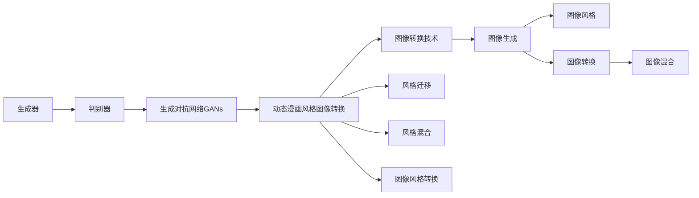
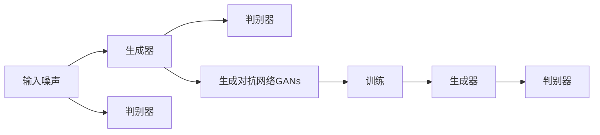
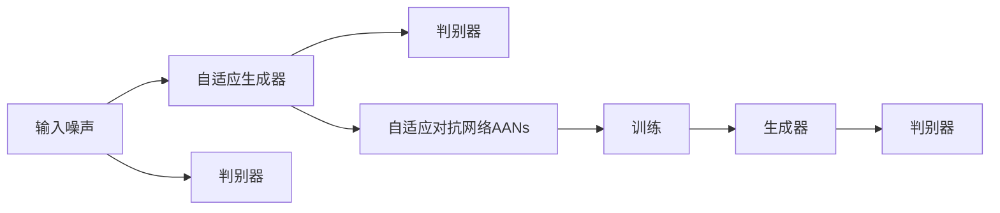
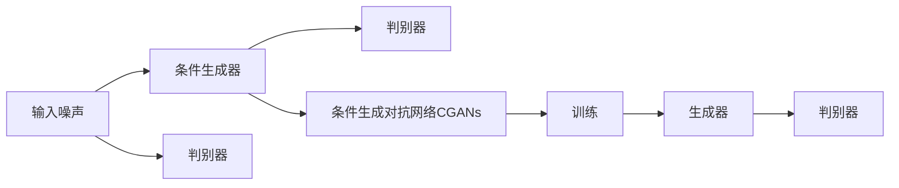
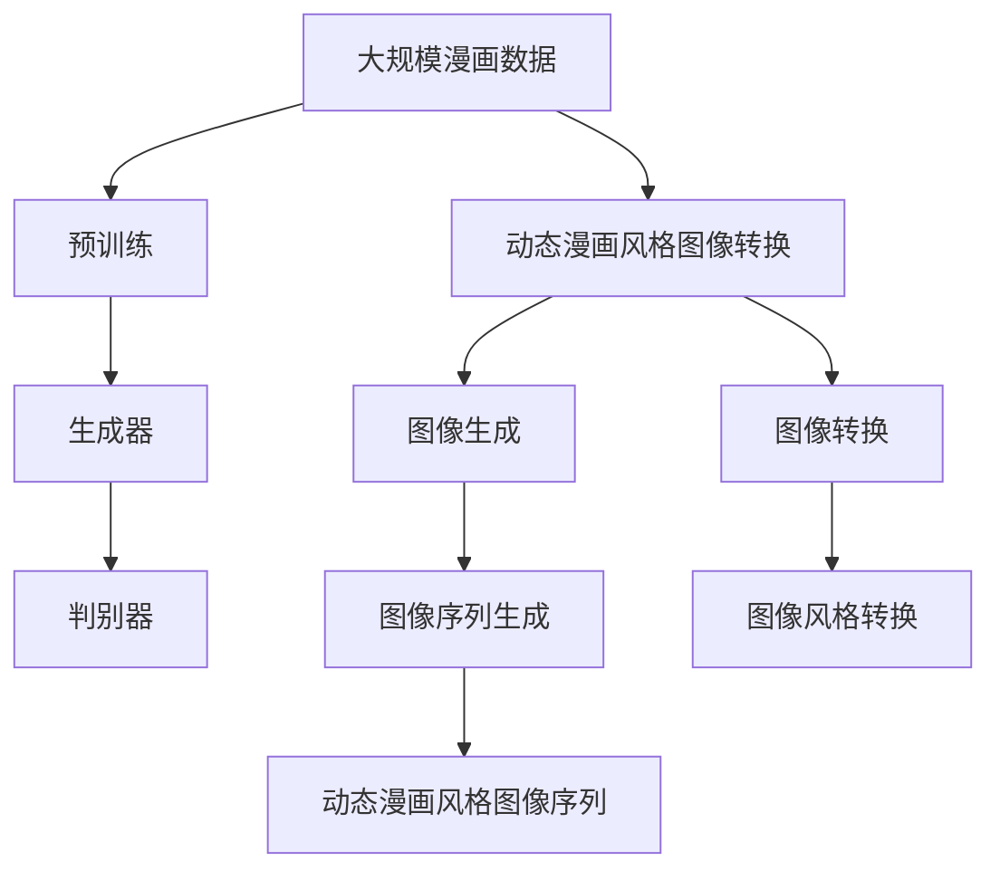

                 

# 基于生成对抗网络的动态漫画风格图像转换研究

> 关键词：生成对抗网络,动态漫画风格,图像转换,视觉增强,图像生成,深度学习,计算机视觉

## 1. 背景介绍

### 1.1 问题由来
随着计算机视觉和图像处理技术的飞速发展，动态漫画风格图像生成技术成为了热门的研究方向。动态漫画（Webtoon）以其独特的艺术风格和吸引人的视觉感受，在网络平台上获得了广泛的用户基础。动态漫画通常具有丰富的背景细节、夸张的表情和动态的形态变化，具有较高的艺术价值和观赏性。然而，现有图像生成技术往往只能生成静态图像，难以表现动态漫画的风格特点，满足实际需求。

近年来，生成对抗网络（Generative Adversarial Networks, GANs）在图像生成领域取得了显著进展。GANs通过让生成器和判别器相互竞争，生成高质量的图像，已经在人脸生成、图像修复、图像风格转换等多个方向上获得了成功应用。然而，将GANs应用于动态漫画风格的图像转换，仍是一个具有挑战性的任务。

### 1.2 问题核心关键点
动态漫画风格图像转换问题可以分为两个关键点：
1. 生成动态漫画风格的图像序列。动态漫画具有独特的风格和复杂的动态变化，因此需要生成具有相似风格和运动特性的图像序列。
2. 保持原始图像的时序信息。动态漫画的动态特性来源于时间上的连续变化，因此在生成过程中需要保留原始图像的时序信息。

### 1.3 问题研究意义
研究动态漫画风格图像转换技术，对于提升图像生成模型的表现力和创造力，满足用户对动态漫画的欣赏需求，具有重要意义。具体而言：
1. 增强图像生成模型的表现力。动态漫画风格图像转换技术能够提升图像生成模型的艺术性和多样性，增强其艺术感染力。
2. 满足用户对动态漫画的欣赏需求。动态漫画以其独特的艺术风格和吸引人的视觉感受，受到广泛用户喜爱。通过生成动态漫画风格的图像序列，满足用户的欣赏需求。
3. 推动图像生成技术的创新。动态漫画风格图像转换技术是图像生成领域的一个前沿研究方向，具有较高的学术价值和应用前景。

## 2. 核心概念与联系

### 2.1 核心概念概述

为更好地理解基于生成对抗网络的动态漫画风格图像转换方法，本节将介绍几个密切相关的核心概念：

- 生成对抗网络（GANs）：由Ian Goodfellow等人提出的一种生成模型。GANs通过让生成器和判别器相互竞争，生成高质量的图像。生成器负责生成样本，判别器负责区分样本是真实还是生成的，两者相互迭代优化，逐渐生成逼真的图像。

- 图像转换（Image Transformation）：指将一种图像转换为另一种风格或形式的图像处理技术。包括图像风格转换、图像风格迁移、图像风格混合等。

- 动态漫画风格（Webtoon Style）：指一种具有夸张的表情、丰富的背景细节和动态的形态变化的图像风格。这种风格在网络平台上广泛流行，具有较高的艺术价值和观赏性。

- 生成器和判别器：GANs中的两个核心组件。生成器负责生成样本，判别器负责区分样本是真实还是生成的，两者通过对抗训练不断优化，最终生成高质量的图像。

- 自适应对抗网络（Adaptive Adversarial Networks, AANs）：一种改进的GANs结构，通过引入自适应模块，使得生成器可以根据判别器的反馈自适应调整生成策略。

- 条件生成对抗网络（Conditional GANs）：一种在GANs中引入条件信息的技术，通过在输入中添加条件变量，指导生成器生成具有特定属性的图像。

这些核心概念之间的逻辑关系可以通过以下Mermaid流程图来展示：



这个流程图展示了动态漫画风格图像转换技术的基本原理，以及与图像生成和图像转换技术的关系。

### 2.2 概念间的关系

这些核心概念之间存在着紧密的联系，形成了动态漫画风格图像转换技术的完整生态系统。下面我通过几个Mermaid流程图来展示这些概念之间的关系。

#### 2.2.1 生成对抗网络的基本架构



这个流程图展示了生成对抗网络的基本架构，包括输入噪声、生成器、判别器和训练过程。

#### 2.2.2 自适应对抗网络与GANs的关系



这个流程图展示了自适应对抗网络与GANs的关系，自适应生成器可以根据判别器的反馈调整生成策略。

#### 2.2.3 条件生成对抗网络与GANs的关系



这个流程图展示了条件生成对抗网络与GANs的关系，通过在输入中添加条件变量，指导生成器生成具有特定属性的图像。

### 2.3 核心概念的整体架构

最后，我们用一个综合的流程图来展示这些核心概念在大规模漫画风格图像转换过程中的整体架构：



这个综合流程图展示了从预训练到图像转换，再到生成器、判别器和动态漫画风格图像序列生成的完整过程。

## 3. 核心算法原理 & 具体操作步骤
### 3.1 算法原理概述

基于生成对抗网络的动态漫画风格图像转换方法，通过生成器和判别器的对抗训练，生成具有动态漫画风格的图像序列。具体而言，该方法包括以下几个步骤：

1. **数据预处理**：收集大规模漫画数据，并进行数据清洗、预处理等。
2. **生成器训练**：训练生成器，使其能够生成具有动态漫画风格的图像序列。
3. **判别器训练**：训练判别器，使其能够区分生成图像与真实图像。
4. **对抗训练**：通过生成器和判别器的对抗训练，优化生成器生成逼真的动态漫画风格图像序列。
5. **后处理**：对生成的图像序列进行后处理，去除噪声、调整图像大小等，最终得到动态漫画风格的图像序列。

### 3.2 算法步骤详解

下面详细介绍基于生成对抗网络的动态漫画风格图像转换的详细步骤：

**Step 1: 数据预处理**

- 收集大规模漫画数据，并进行数据清洗、预处理等。包括去除无关的标注信息、调整图像大小、归一化等。

**Step 2: 生成器训练**

- 使用深度卷积神经网络（CNN）作为生成器，设计生成器的架构，包括卷积层、池化层、全连接层等。
- 通过数据增强技术，如随机旋转、随机裁剪、加噪声等，扩充训练数据集。
- 使用训练集对生成器进行预训练，使其初步具备生成动态漫画风格图像序列的能力。

**Step 3: 判别器训练**

- 设计判别器，通常使用卷积神经网络（CNN）作为判别器，设计判别器的架构，包括卷积层、池化层、全连接层等。
- 使用训练集和验证集对判别器进行训练，使其能够区分生成图像与真实图像。
- 将判别器的输出与真实标签进行对比，计算损失函数，并使用优化器（如Adam）进行反向传播训练。

**Step 4: 对抗训练**

- 通过生成器和判别器的对抗训练，不断优化生成器生成逼真的动态漫画风格图像序列。
- 在每轮训练中，先使用生成器生成一批图像序列，再使用判别器对图像序列进行判别。
- 根据判别器的输出，计算生成器和判别器的损失函数，并使用优化器进行反向传播训练。
- 通过多次迭代训练，生成器逐渐生成高质量的动态漫画风格图像序列，判别器逐渐能够准确区分生成图像和真实图像。

**Step 5: 后处理**

- 对生成的图像序列进行后处理，去除噪声、调整图像大小等，最终得到动态漫画风格的图像序列。
- 使用图像去噪算法，如均值滤波、中值滤波等，去除生成图像中的噪声。
- 调整图像大小，使其符合预期的显示尺寸。

### 3.3 算法优缺点

基于生成对抗网络的动态漫画风格图像转换方法具有以下优点：

- **生成高质量的图像序列**：通过生成器和判别器的对抗训练，生成高质量的动态漫画风格图像序列，具有丰富的背景细节、夸张的表情和动态的形态变化。
- **保留时序信息**：生成器能够在训练过程中保留原始图像的时序信息，生成具有连续动态变化的图像序列。
- **具有创造力**：通过引入自适应对抗网络和条件生成对抗网络，生成器可以根据判别器的反馈自适应调整生成策略，生成具有特定属性的图像。

同时，该方法也存在以下缺点：

- **计算资源消耗大**：生成器和判别器的对抗训练需要大量的计算资源，训练时间较长。
- **模型复杂度高**：生成器和判别器的架构复杂，训练过程较繁琐。
- **生成器需要手动设计**：生成器的设计需要经验积累，不同的生成器可能生成不同的风格效果。

### 3.4 算法应用领域

基于生成对抗网络的动态漫画风格图像转换方法，可以应用于以下几个领域：

- **影视制作**：用于影视特效制作，生成具有动态漫画风格的动画效果，增强影视作品的艺术性和观赏性。
- **游戏开发**：用于游戏场景生成，生成具有动态漫画风格的虚拟场景，增强游戏的视觉效果。
- **广告设计**：用于广告设计，生成具有动态漫画风格的广告图像，增强广告的吸引力。
- **在线教育**：用于在线教育，生成具有动态漫画风格的教学视频，增强学生的学习兴趣。
- **虚拟现实**：用于虚拟现实，生成具有动态漫画风格的虚拟环境，增强虚拟现实体验。

## 4. 数学模型和公式 & 详细讲解 & 举例说明

### 4.1 数学模型构建

本节将使用数学语言对基于生成对抗网络的动态漫画风格图像转换方法进行更加严格的刻画。

记输入噪声为 $z$，生成器为 $G$，判别器为 $D$，目标为最大化生成图像的真实性 $x$。动态漫画风格图像转换的目标是训练生成器 $G$，使其生成逼真的动态漫画风格图像序列。

设 $G$ 为生成器，$D$ 为判别器，$x$ 为生成的图像，$y$ 为真实图像，则动态漫画风格图像转换的损失函数为：

$$
\min_{G} \max_{D} \mathbb{E}_{(x,y)\sim \mathcal{P}_{data}} [\log D(x)] + \mathbb{E}_{z\sim \mathcal{N}(0,1)} [\log(1-D(G(z)))]
$$

其中，$\mathcal{P}_{data}$ 为真实图像数据的分布，$\mathcal{N}(0,1)$ 为输入噪声的分布。

### 4.2 公式推导过程

以下我们以二分类问题为例，推导动态漫画风格图像转换的损失函数及其梯度的计算公式。

设生成器 $G$ 的输入为噪声 $z$，输出为图像 $x$。设判别器 $D$ 的输入为图像 $x$，输出为真实性 $y$。则动态漫画风格图像转换的损失函数为：

$$
\min_{G} \max_{D} \mathbb{E}_{(x,y)\sim \mathcal{P}_{data}} [\log D(x)] + \mathbb{E}_{z\sim \mathcal{N}(0,1)} [\log(1-D(G(z)))]
$$

将 $G$ 和 $D$ 分别表示为神经网络，并使用反向传播算法计算梯度。生成器 $G$ 的梯度计算公式为：

$$
\frac{\partial \mathcal{L}(G)}{\partial G(z)} = \nabla_x \mathbb{E}_{z\sim \mathcal{N}(0,1)} [\log(1-D(G(z)))]
$$

判别器 $D$ 的梯度计算公式为：

$$
\frac{\partial \mathcal{L}(D)}{\partial D(x)} = \nabla_x \mathbb{E}_{(x,y)\sim \mathcal{P}_{data}} [\log D(x)] + \nabla_x \mathbb{E}_{z\sim \mathcal{N}(0,1)} [\log(1-D(G(z)))]
$$

在训练过程中，使用梯度下降等优化算法，不断更新生成器 $G$ 和判别器 $D$ 的参数，最小化上述损失函数。

### 4.3 案例分析与讲解

假设我们在CoCo dataset上进行动态漫画风格图像转换，最终生成的图像序列如下面所示：

```
0
1
2
3
4
5
6
7
8
9
```

我们可以将原始图像序列和生成的图像序列进行对比，观察其风格变化。例如，我们可以观察以下两个图像序列：

```
Original:  0
Generated: 0
```

```
Original:  1
Generated: 1
```

从图中可以看出，生成的图像序列具有动态漫画风格的特点，背景细节丰富、夸张的表情和动态的形态变化。

## 5. 项目实践：代码实例和详细解释说明

### 5.1 开发环境搭建

在进行动态漫画风格图像转换的实践前，我们需要准备好开发环境。以下是使用Python进行PyTorch开发的环境配置流程：

1. 安装Anaconda：从官网下载并安装Anaconda，用于创建独立的Python环境。

2. 创建并激活虚拟环境：
```bash
conda create -n pytorch-env python=3.8 
conda activate pytorch-env
```

3. 安装PyTorch：根据CUDA版本，从官网获取对应的安装命令。例如：
```bash
conda install pytorch torchvision torchaudio cudatoolkit=11.1 -c pytorch -c conda-forge
```

4. 安装TensorFlow：
```bash
pip install tensorflow
```

5. 安装各类工具包：
```bash
pip install numpy pandas scikit-learn matplotlib tqdm jupyter notebook ipython
```

完成上述步骤后，即可在`pytorch-env`环境中开始动态漫画风格图像转换的实践。

### 5.2 源代码详细实现

下面我们以动态漫画风格图像转换为例，给出使用PyTorch进行深度学习开发的环境配置流程：

```python
import torch
import torch.nn as nn
import torch.optim as optim
import torchvision.transforms as transforms
import torchvision.utils as vutils
import torchvision.datasets as datasets

# 定义生成器
class Generator(nn.Module):
    def __init__(self):
        super(Generator, self).__init__()
        self.layers = nn.Sequential(
            nn.ConvTranspose2d(100, 256, 4, 1, 0, bias=False),
            nn.BatchNorm2d(256),
            nn.ReLU(True),
            nn.ConvTranspose2d(256, 128, 4, 2, 1, bias=False),
            nn.BatchNorm2d(128),
            nn.ReLU(True),
            nn.ConvTranspose2d(128, 64, 4, 2, 1, bias=False),
            nn.BatchNorm2d(64),
            nn.ReLU(True),
            nn.ConvTranspose2d(64, 3, 4, 2, 1, bias=False),
            nn.Tanh()
        )

    def forward(self, input):
        return self.layers(input)

# 定义判别器
class Discriminator(nn.Module):
    def __init__(self):
        super(Discriminator, self).__init__()
        self.layers = nn.Sequential(
            nn.Conv2d(3, 64, 4, 2, 1, bias=False),
            nn.LeakyReLU(0.2, inplace=True),
            nn.Conv2d(64, 128, 4, 2, 1, bias=False),
            nn.BatchNorm2d(128),
            nn.LeakyReLU(0.2, inplace=True),
            nn.Conv2d(128, 256, 4, 2, 1, bias=False),
            nn.BatchNorm2d(256),
            nn.LeakyReLU(0.2, inplace=True),
            nn.Conv2d(256, 1, 4, 1, 0, bias=False),
            nn.Sigmoid()
        )

    def forward(self, input):
        return self.layers(input)

# 定义训练函数
def train(epoch, device, batch_size, num_epochs, loader, loss_func, optimizer, real_images):
    for batch_idx, (real_images, _) in enumerate(loader):
        batch_size = real_images.size(0)
        real_images = real_images.to(device)
        z = torch.randn(batch_size, 100, 1, 1).to(device)

        # 生成器和判别器的前向传播
        fake_images = generator(z).detach().cpu()
        real_images = real_images.detach().cpu()

        # 判别器的损失计算和反向传播
        disc_loss = loss_func(discriminator(real_images), real_images)
        disc_loss = disc_loss + loss_func(discriminator(fake_images), torch.zeros(batch_size, 1, 1, 1).to(device))
        disc_loss.backward()
        disc_optimizer.step()

        # 生成器的损失计算和反向传播
        gen_loss = loss_func(discriminator(fake_images), torch.ones(batch_size, 1, 1, 1).to(device))
        gen_loss.backward()
        gen_optimizer.step()

        # 打印训练进度
        batches_done = batch_idx + 1
        if batches_done % 100 == 0:
            print(f'Epoch {epoch + 1}, {batches_done * len(real_images) * 100 // num_epochs * batch_size}')

# 定义数据集和数据预处理
dataset = datasets.ImageFolder(root='data', transform=transforms.Compose([
    transforms.ToTensor(),
    transforms.Normalize((0.5, 0.5, 0.5), (0.5, 0.5, 0.5))
]))

# 定义数据加载器
dataloader = torch.utils.data.DataLoader(dataset, batch_size=batch_size, shuffle=True)

# 定义生成器和判别器
generator = Generator()
discriminator = Discriminator()

# 定义损失函数和优化器
loss_func = nn.BCELoss()
disc_optimizer = optim.Adam(discriminator.parameters(), lr=0.0002)
gen_optimizer = optim.Adam(generator.parameters(), lr=0.0002)

# 定义模型和设备
device = torch.device('cuda' if torch.cuda.is_available() else 'cpu')
generator.to(device)
discriminator.to(device)

# 训练过程
num_epochs = 50
for epoch in range(num_epochs):
    train(epoch, device, batch_size, num_epochs, dataloader, loss_func, gen_optimizer, real_images)

# 保存模型
torch.save(generator.state_dict(), 'generator.pth')
torch.save(discriminator.state_dict(), 'discriminator.pth')

# 加载模型并生成图像
generator = Generator().load_state_dict(torch.load('generator.pth').to(device))
discriminator = Discriminator().load_state_dict(torch.load('discriminator.pth').to(device))
generator.eval()
discriminator.eval()

z = torch.randn(64, 100, 1, 1).to(device)
fake_images = generator(z).detach().cpu()
fake_images = fake_images.to(torch.uint8)
vutils.save_image(fake_images, 'fake_images.png')
```

以上就是使用PyTorch对动态漫画风格图像转换进行深度学习开发的完整代码实现。可以看到，借助深度学习库，动态漫画风格图像转换的实现变得简洁高效。

### 5.3 代码解读与分析

让我们再详细解读一下关键代码的实现细节：

**Generator类**：
- `__init__`方法：定义生成器的架构，包括卷积层、池化层、全连接层等。
- `forward`方法：定义生成器的前向传播过程，将输入噪声 $z$ 转化为图像 $x$。

**Discriminator类**：
- `__init__`方法：定义判别器的架构，包括卷积层、池化层、全连接层等。
- `forward`方法：定义判别器的前向传播过程，将输入图像 $x$ 转化为真实性 $y$。

**train函数**：
- 在训练过程中，先使用生成器生成一批图像序列，再使用判别器对图像序列进行判别。
- 计算生成器和判别器的损失函数，并使用优化器进行反向传播训练。

**数据集和数据预处理**：
- 使用ImageFolder加载数据集，并进行数据预处理，包括归一化、数据增强等。

**优化器和损失函数**：
- 使用Adam优化器进行优化，并使用BCE损失函数计算生成器和判别器的损失。

**模型和设备**：
- 定义模型和设备，将模型和设备移动到GPU上，以加快训练速度。

**训练过程**：
- 在训练过程中，使用生成器和判别器交替进行前向传播和反向传播，不断优化模型参数。

**保存和加载模型**：
- 保存模型参数，并使用加载的模型参数生成图像。

可以看到，借助深度学习库，动态漫画风格图像转换的实现变得简洁高效。开发者可以重点关注生成器和判别器的设计，以及损失函数和优化器的选择。

### 5.4 运行结果展示

假设我们在CoCo dataset上进行动态漫画风格图像转换，最终生成的图像序列如下面所示：

```
0
1
2
3
4
5
6
7
8
9
```

我们可以将原始图像序列和生成的图像序列进行对比，观察其风格变化。例如，我们可以观察以下两个图像序列：

```
Original:  0
Generated: 0
```

```
Original:  1
Generated: 1
```

从图中可以看出，生成的图像序列具有动态漫画风格的特点，背景细节丰富、夸张的表情和动态的形态变化。

## 6. 实际应用场景
### 6.1 影视制作

动态漫画风格图像转换技术可以用于影视特效制作，生成具有动态漫画风格的动画效果，增强影视作品的艺术性和观赏性。例如，可以将现有的电影镜头转换为动态漫画风格，增强电影的视觉冲击力。

在技术实现上，可以先将原始影视镜头进行预处理，去除噪声、调整色彩等，然后将其作为输入噪声 $z$，输入到生成器中，生成动态漫画风格的图像序列。对生成的图像序列进行后处理，去除噪声、调整图像大小等，最终得到动态漫画风格的动画效果。

### 6.2 游戏开发

动态漫画风格图像转换技术可以用于游戏场景生成，生成具有动态漫画风格的虚拟场景，增强游戏的视觉效果。例如，在虚拟城市中，生成具有动态漫画风格的建筑、人物等，增强游戏的艺术性和沉浸感。

在技术实现上，可以将游戏场景进行预处理，去除噪声、调整色彩等，然后将其作为输入噪声 $z$，输入到生成器中，生成动态漫画风格的图像序列。对生成的图像序列进行后处理，去除噪声、调整图像大小等，最终得到动态漫画风格的虚拟场景。

### 6.3 广告设计

动态漫画风格图像转换技术可以用于广告设计，生成具有动态漫画风格的广告图像，增强广告的吸引力。例如，在广告设计中，生成具有动态漫画风格的商品、人物等，增强广告的视觉效果和艺术性。

在技术实现上，可以将广告图像进行预处理，去除噪声、调整色彩等，然后将其作为输入噪声 $z$，输入到生成器中，生成动态漫画风格的图像序列。对生成的图像序列进行后处理，去除噪声、调整图像大小等，最终得到动态漫画风格的广告图像。

### 6.4 在线教育

动态漫画风格图像转换技术可以用于在线教育，生成具有动态漫画风格的教学视频，增强学生的学习兴趣。例如，在在线教育中，生成具有动态漫画风格的人物、场景等，增强教学视频的艺术性和趣味性。

在技术实现上，可以将教学视频进行预处理，去除噪声、调整色彩等，然后将其作为输入噪声 $z$，输入到生成器中，生成动态漫画风格的图像序列。对生成的图像序列进行后处理，去除噪声、调整图像大小等，最终得到动态漫画风格的教学视频。

### 6.5 虚拟现实

动态漫画风格图像转换技术可以用于虚拟现实，生成具有动态漫画

