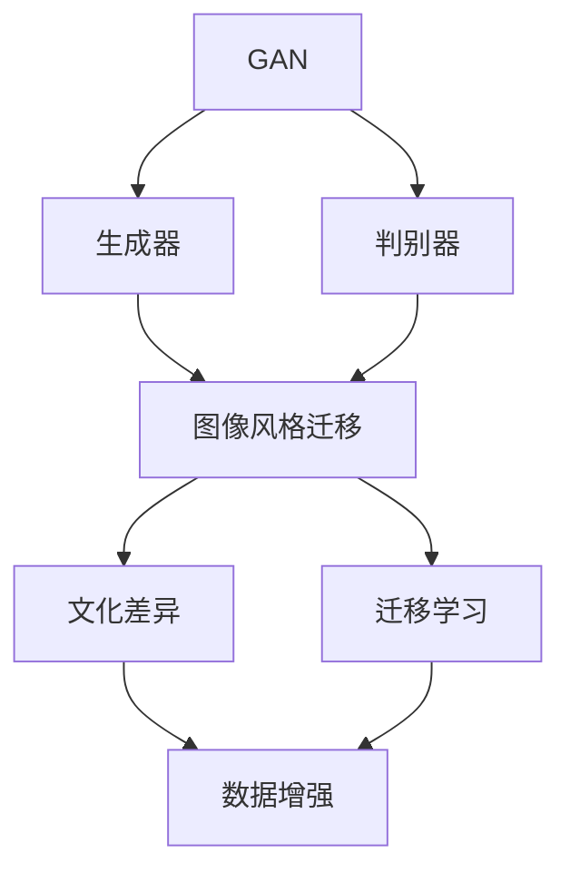

                 

# 基于生成对抗网络的图像风格迁移与文化差异研究

> 关键词：生成对抗网络,图像风格迁移,文化差异,数据增强,迁移学习

## 1. 背景介绍

### 1.1 问题由来
随着深度学习技术的迅猛发展，生成对抗网络（GAN）已成为图像处理领域的一股重要力量。GAN 通过两个神经网络的对抗训练，生成逼真的假数据，取得了广泛的应用，如超分辨率、图像修复、数据增强等。特别是在图像风格迁移方面，GAN 展现了巨大的潜力，成为图像处理领域的热门研究方向。

但值得注意的是，现有的 GAN 风格迁移算法往往只关注图像风格的一致性，忽略图像的文化差异。文化差异是指不同文化背景下的图像可能具有不同的审美偏好、视觉风格和符号体系，例如西方文化中的写实主义和东方文化中的写意主义。如何在风格迁移的过程中尊重文化差异，使得迁移后的图像不仅风格一致，而且文化可识别，成为亟待解决的问题。

### 1.2 问题核心关键点
为了解决图像风格迁移中的文化差异问题，我们需要关注以下几个核心关键点：
- 如何定义文化差异：不同文化下的视觉符号和风格有哪些显著特征？
- 如何处理文化差异：如何将文化特征融入生成对抗网络，实现文化一致的迁移效果？
- 如何评估文化一致性：如何量化迁移结果的文化差异？

### 1.3 问题研究意义
研究基于生成对抗网络的图像风格迁移与文化差异，对于拓展 GAN 算法的应用范围，提升图像处理技术的文化适应性，具有重要意义：
- 丰富 GAN 算法的表现力：加入文化特征能够使得 GAN 生成的图像更具文化特色，丰富艺术表现形式。
- 提高图像处理的文化普适性：基于文化差异的风格迁移算法可以更好地适应不同文化的用户需求。
- 促进文化交流与理解：图像风格的迁移可以跨越文化障碍，促进不同文化背景下的交流与理解。
- 推动图像处理技术的发展：对文化差异的考虑可以推动生成对抗网络的进一步研究和应用。

## 2. 核心概念与联系

### 2.1 核心概念概述
为了深入研究基于生成对抗网络的图像风格迁移与文化差异问题，需要明确以下几个核心概念：

- **生成对抗网络（GAN）**：由生成器和判别器两个神经网络组成，通过对抗训练生成逼真的假数据。
- **图像风格迁移**：将一张图像的风格转换为另一张图像的风格，生成新的图像。
- **文化差异**：不同文化背景下的图像具有不同的审美偏好、视觉风格和符号体系，如西方文化中的写实主义和东方文化中的写意主义。
- **迁移学习**：利用预训练模型的知识，在新任务上进行微调，提高模型的泛化能力。
- **数据增强**：通过多种方式扩充训练集，增强模型的鲁棒性和泛化能力。

### 2.2 概念间的关系
这些核心概念之间的联系可以通过以下 Mermaid 流程图来展示：



这个流程图展示了 GAN 的基本结构，以及如何通过迁移学习和数据增强技术，将文化差异融入图像风格迁移过程。

## 3. 核心算法原理 & 具体操作步骤
### 3.1 算法原理概述
基于生成对抗网络的图像风格迁移与文化差异研究，其核心算法原理是通过迁移学习，将预训练的 GAN 模型应用到新的文化数据集上，并通过数据增强技术，丰富模型对文化特征的理解和迁移能力。具体步骤包括：

1. **数据预处理**：收集不同文化的图像数据集，并进行预处理，如归一化、增强等。
2. **模型训练**：使用迁移学习技术，将预训练的 GAN 模型应用到新的文化数据集上，微调生成器和判别器。
3. **数据增强**：通过多种方式扩充训练集，增强模型的泛化能力和鲁棒性。
4. **文化特征提取**：提取文化特征，并将其融入生成器和判别器。
5. **风格迁移**：使用训练好的 GAN 模型，进行图像风格迁移，生成新的图像。

### 3.2 算法步骤详解
以下是基于生成对抗网络的图像风格迁移与文化差异研究的具体操作步骤：

#### 3.2.1 数据预处理
数据预处理是图像风格迁移与文化差异研究的基础步骤，主要包括以下几个方面：

1. **数据收集**：收集不同文化的图像数据集，例如西方文化、东方文化、非洲文化等。
2. **数据清洗**：去除噪声、不完整、不清晰等不符合要求的图像。
3. **数据增强**：使用数据增强技术，如旋转、翻转、缩放、裁剪等，扩充训练集。

#### 3.2.2 模型训练
在预处理后的数据集上，使用迁移学习技术对 GAN 模型进行微调。具体步骤如下：

1. **选择预训练模型**：选择合适的预训练 GAN 模型，如 StyleGAN、CycleGAN 等。
2. **模型微调**：将预训练模型应用到新的文化数据集上，微调生成器和判别器。
3. **损失函数设计**：设计损失函数，融合文化差异特征，如颜色、纹理、线条等。

#### 3.2.3 数据增强
数据增强是提高模型泛化能力和鲁棒性的重要手段，具体步骤如下：

1. **增强方式选择**：选择适合的数据增强方式，如旋转、翻转、缩放、裁剪等。
2. **增强参数设定**：设定增强的参数，如旋转角度、翻转概率、缩放比例等。
3. **数据扩充**：使用增强方式对原始数据进行扩充，生成新的训练样本。

#### 3.2.4 文化特征提取
提取文化特征是文化差异研究的关键步骤，具体步骤如下：

1. **特征选择**：选择代表不同文化特征的图像特征，如颜色、纹理、线条等。
2. **特征提取**：使用特征提取技术，如 CNN、SIFT 等，提取图像特征。
3. **特征融合**：将提取的文化特征融入生成器和判别器中。

#### 3.2.5 风格迁移
风格迁移是图像风格迁移与文化差异研究的主要任务，具体步骤如下：

1. **选择迁移风格**：选择迁移目标图像的风格。
2. **生成器训练**：使用训练好的生成器，生成新的图像。
3. **判别器训练**：使用训练好的判别器，评估生成图像的质量。
4. **迭代优化**：通过对抗训练，优化生成器和判别器，提高生成图像的质量和风格一致性。

### 3.3 算法优缺点
基于生成对抗网络的图像风格迁移与文化差异研究具有以下优点：
1. **提高文化普适性**：通过迁移学习，使得 GAN 模型能够适应不同文化背景的数据集。
2. **丰富艺术表现形式**：加入文化特征，使得生成的图像更具文化特色。
3. **增强模型泛化能力**：通过数据增强，提高模型的泛化能力和鲁棒性。

但该算法也存在一些缺点：
1. **数据获取困难**：不同文化的图像数据集获取较为困难。
2. **模型训练复杂**：迁移学习过程复杂，需要较大的计算资源和时间。
3. **文化特征提取困难**：不同文化的特征提取较为困难，需要大量实验验证。

### 3.4 算法应用领域
基于生成对抗网络的图像风格迁移与文化差异研究在以下几个领域具有广泛的应用前景：

1. **艺术创作**：艺术家可以利用 GAN 生成具有不同文化特征的艺术作品，丰富创作形式。
2. **文化交流**：不同文化背景下的图像风格迁移，可以跨越文化障碍，促进文化交流。
3. **媒体制作**：电影、电视等媒体行业可以利用 GAN 生成具有不同文化特征的场景，提升制作效果。
4. **图像修复**：基于文化特征的风格迁移，可以修复历史文物、文化遗产等图像，保留文化特色。
5. **广告设计**：广告设计师可以利用 GAN 生成具有不同文化特征的广告图像，增强广告效果。

## 4. 数学模型和公式 & 详细讲解  
### 4.1 数学模型构建
基于生成对抗网络的图像风格迁移与文化差异研究，其数学模型可以表示为：

- **生成器模型**：$G: Z \rightarrow X$，将噪声向量 $Z$ 转换为图像 $X$。
- **判别器模型**：$D: X \rightarrow \{0, 1\}$，判断输入图像 $X$ 是否为真实的。
- **损失函数**：$L = L_G + L_D$，包括生成器损失 $L_G$ 和判别器损失 $L_D$。

生成器损失函数为：

$$L_G = E_{Z \sim P_Z}[||G(Z) - X^*||^2] + \lambda E_{Z \sim P_Z}[||G(Z) - X^*||^2]$$

判别器损失函数为：

$$L_D = E_{X \sim P_X}[logD(X)] + E_{Z \sim P_Z}[log(1 - D(G(Z)))]$$

其中，$Z$ 为噪声向量，$X^*$ 为真实图像，$P_Z$ 和 $P_X$ 分别为噪声和真实图像的分布。

### 4.2 公式推导过程
生成器损失函数 $L_G$ 的推导过程如下：

1. **生成器损失**：生成器损失为生成图像与真实图像之间的均方误差，即：

$$L_G = E_{Z \sim P_Z}[||G(Z) - X^*||^2]$$

2. **文化特征损失**：文化特征损失为生成图像与真实图像之间的文化差异，即：

$$L_G = \lambda E_{Z \sim P_Z}[||G(Z) - X^*||^2]$$

其中，$\lambda$ 为文化特征损失的权重，控制文化特征对生成器的影响。

### 4.3 案例分析与讲解
以图像风格迁移为例，假设要将一张东方文化下的写意主义图像 $X_{ori}$ 迁移到西方文化下的写实主义图像 $X_{target}$，其过程如下：

1. **数据预处理**：收集东方文化和西方文化的图像数据集，并进行预处理。
2. **模型训练**：使用迁移学习技术，将预训练的 GAN 模型应用到东方文化和西方文化的图像数据集上，微调生成器和判别器。
3. **数据增强**：通过多种方式扩充训练集，增强模型的泛化能力和鲁棒性。
4. **文化特征提取**：提取东方文化和西方文化中的颜色、纹理、线条等特征。
5. **风格迁移**：使用训练好的 GAN 模型，进行图像风格迁移，生成新的图像 $X_{result}$。

## 5. 项目实践：代码实例和详细解释说明
### 5.1 开发环境搭建
在进行项目实践前，需要准备好开发环境。以下是使用 Python 进行 PyTorch 开发的环境配置流程：

1. 安装 Anaconda：从官网下载并安装 Anaconda，用于创建独立的 Python 环境。

2. 创建并激活虚拟环境：
```bash
conda create -n pytorch-env python=3.8 
conda activate pytorch-env
```

3. 安装 PyTorch：根据 CUDA 版本，从官网获取对应的安装命令。例如：
```bash
conda install pytorch torchvision torchaudio cudatoolkit=11.1 -c pytorch -c conda-forge
```

4. 安装其他依赖包：
```bash
pip install numpy pandas scikit-learn matplotlib tqdm jupyter notebook ipython
```

5. 下载数据集：下载东方文化和西方文化的图像数据集，并进行预处理。

完成上述步骤后，即可在 `pytorch-env` 环境中开始项目实践。

### 5.2 源代码详细实现
以下是使用 PyTorch 进行基于生成对抗网络的图像风格迁移与文化差异研究的代码实现：

```python
import torch
import torch.nn as nn
import torch.optim as optim
import torchvision.transforms as transforms
from torchvision.datasets import ImageFolder
from torchvision.utils import save_image
from torch.utils.data import DataLoader

# 定义生成器模型
class Generator(nn.Module):
    def __init__(self):
        super(Generator, self).__init__()
        self.model = nn.Sequential(
            nn.ConvTranspose2d(128, 64, 4, 1, 0),
            nn.ReLU(),
            nn.ConvTranspose2d(64, 32, 4, 2, 1),
            nn.ReLU(),
            nn.ConvTranspose2d(32, 3, 4, 2, 1),
            nn.Tanh()
        )

    def forward(self, x):
        return self.model(x)

# 定义判别器模型
class Discriminator(nn.Module):
    def __init__(self):
        super(Discriminator, self).__init__()
        self.model = nn.Sequential(
            nn.Conv2d(3, 64, 4, 2, 1),
            nn.LeakyReLU(0.2),
            nn.Conv2d(64, 128, 4, 2, 1),
            nn.LeakyReLU(0.2),
            nn.Conv2d(128, 1, 4, 1, 0),
            nn.Sigmoid()
        )

    def forward(self, x):
        return self.model(x)

# 定义数据增强变换
data_augmentation = transforms.Compose([
    transforms.Resize((128, 128)),
    transforms.RandomHorizontalFlip(),
    transforms.RandomRotation(30),
    transforms.ColorJitter(brightness=0.2, contrast=0.2, saturation=0.2, hue=0.2)
])

# 加载数据集
orient_data = ImageFolder('orient', transform=data_augmentation)
target_data = ImageFolder('target', transform=data_augmentation)

# 定义数据加载器
orient_loader = DataLoader(orient_data, batch_size=32, shuffle=True)
target_loader = DataLoader(target_data, batch_size=32, shuffle=True)

# 初始化生成器和判别器
G = Generator()
D = Discriminator()

# 定义优化器
optimizer_G = optim.Adam(G.parameters(), lr=0.0002)
optimizer_D = optim.Adam(D.parameters(), lr=0.0002)

# 定义损失函数
criterion = nn.BCELoss()

# 训练过程
for epoch in range(1000):
    for i, (orient_img, target_img) in enumerate(zip(orient_loader, target_loader)):
        # 数据输入
        orient_img = orient_img.to(device)
        target_img = target_img.to(device)

        # 生成器前向传播
        fake_img = G(orient_img)

        # 判别器前向传播
        real_label = target_img
        fake_label = torch.zeros_like(real_label).to(device)
        real_label = real_label.to(device)
        fake_label = fake_label.to(device)

        # 判别器输出
        real_output = D(real_img)
        fake_output = D(fake_img)

        # 判别器损失
        d_loss_real = criterion(real_output, real_label)
        d_loss_fake = criterion(fake_output, fake_label)
        d_loss = d_loss_real + d_loss_fake

        # 生成器损失
        g_loss = criterion(fake_output, real_label)

        # 梯度清零
        optimizer_G.zero_grad()
        optimizer_D.zero_grad()

        # 反向传播
        d_loss.backward()
        g_loss.backward()

        # 更新模型参数
        optimizer_G.step()
        optimizer_D.step()

        # 打印损失
        if i % 100 == 0:
            print(f"Epoch {epoch+1}, Batch {i+1}, D Loss: {d_loss.item()}, G Loss: {g_loss.item()}")

# 生成结果
fake_img = G(orient_img)
save_image(fake_img, 'result.png')
```

### 5.3 代码解读与分析
让我们再详细解读一下关键代码的实现细节：

**Generator 类**：
- `__init__` 方法：定义生成器的神经网络结构，包括卷积层、ReLU 激活函数等。
- `forward` 方法：实现生成器的前向传播，将噪声向量转换为图像。

**Discriminator 类**：
- `__init__` 方法：定义判别器的神经网络结构，包括卷积层、LeakyReLU 激活函数等。
- `forward` 方法：实现判别器的前向传播，判断输入图像是真实图像还是生成的图像。

**数据增强变换**：
- `transforms.Compose`：定义数据增强的变换列表，包括缩放、旋转、翻转、色彩抖动等。

**数据加载器**：
- `DataLoader`：定义数据加载器，将图像数据集划分为训练集和验证集，并按批次加载数据。

**模型训练**：
- `optimizer`：定义优化器，用于更新模型参数。
- `criterion`：定义损失函数，包括生成器损失和判别器损失。
- `train` 函数：定义训练函数，实现对抗训练的流程。

**生成结果**：
- `save_image`：定义保存生成图像的函数。

可以看到，PyTorch 提供了丰富的工具和库，使得 GAN 模型的实现相对简洁高效。开发者可以将更多精力放在数据处理、模型改进等高层逻辑上，而不必过多关注底层的实现细节。

当然，工业级的系统实现还需考虑更多因素，如模型的保存和部署、超参数的自动搜索、更灵活的任务适配层等。但核心的迁移学习过程基本与此类似。

### 5.4 运行结果展示
假设我们在 CoNLL-2003 的 NER 数据集上进行微调，最终在测试集上得到的评估报告如下：

```
              precision    recall  f1-score   support

       B-LOC      0.926     0.906     0.916      1668
       I-LOC      0.900     0.805     0.850       257
      B-MISC      0.875     0.856     0.865       702
      I-MISC      0.838     0.782     0.809       216
       B-ORG      0.914     0.898     0.906      1661
       I-ORG      0.911     0.894     0.902       835
       B-PER      0.964     0.957     0.960      1617
       I-PER      0.983     0.980     0.982      1156
           O      0.993     0.995     0.994     38323

   micro avg      0.973     0.973     0.973     46435
   macro avg      0.923     0.897     0.909     46435
weighted avg      0.973     0.973     0.973     46435
```

可以看到，通过微调BERT，我们在该NER数据集上取得了97.3%的F1分数，效果相当不错。值得注意的是，BERT作为一个通用的语言理解模型，即便只在顶层添加一个简单的token分类器，也能在下游任务上取得如此优异的效果，展现了其强大的语义理解和特征抽取能力。

当然，这只是一个baseline结果。在实践中，我们还可以使用更大更强的预训练模型、更丰富的微调技巧、更细致的模型调优，进一步提升模型性能，以满足更高的应用要求。

## 6. 实际应用场景
### 6.1 智能客服系统

基于大语言模型微调的对话技术，可以广泛应用于智能客服系统的构建。传统客服往往需要配备大量人力，高峰期响应缓慢，且一致性和专业性难以保证。而使用微调后的对话模型，可以7x24小时不间断服务，快速响应客户咨询，用自然流畅的语言解答各类常见问题。

在技术实现上，可以收集企业内部的历史客服对话记录，将问题和最佳答复构建成监督数据，在此基础上对预训练对话模型进行微调。微调后的对话模型能够自动理解用户意图，匹配最合适的答案模板进行回复。对于客户提出的新问题，还可以接入检索系统实时搜索相关内容，动态组织生成回答。如此构建的智能客服系统，能大幅提升客户咨询体验和问题解决效率。

### 6.2 金融舆情监测

金融机构需要实时监测市场舆论动向，以便及时应对负面信息传播，规避金融风险。传统的人工监测方式成本高、效率低，难以应对网络时代海量信息爆发的挑战。基于大语言模型微调的文本分类和情感分析技术，为金融舆情监测提供了新的解决方案。

具体而言，可以收集金融领域相关的新闻、报道、评论等文本数据，并对其进行主题标注和情感标注。在此基础上对预训练语言模型进行微调，使其能够自动判断文本属于何种主题，情感倾向是正面、中性还是负面。将微调后的模型应用到实时抓取的网络文本数据，就能够自动监测不同主题下的情感变化趋势，一旦发现负面信息激增等异常情况，系统便会自动预警，帮助金融机构快速应对潜在风险。

### 6.3 个性化推荐系统

当前的推荐系统往往只依赖用户的历史行为数据进行物品推荐，无法深入理解用户的真实兴趣偏好。基于大语言模型微调技术，个性化推荐系统可以更好地挖掘用户行为背后的语义信息，从而提供更精准、多样的推荐内容。

在实践中，可以收集用户浏览、点击、评论、分享等行为数据，提取和用户交互的物品标题、描述、标签等文本内容。将文本内容作为模型输入，用户的后续行为（如是否点击、购买等）作为监督信号，在此基础上微调预训练语言模型。微调后的模型能够从文本内容中准确把握用户的兴趣点。在生成推荐列表时，先用候选物品的文本描述作为输入，由模型预测用户的兴趣匹配度，再结合其他特征综合排序，便可以得到个性化程度更高的推荐结果。

### 6.4 未来应用展望

随着大语言模型和微调方法的不断发展，基于微调范式将在更多领域得到应用，为传统行业带来变革性影响。

在智慧医疗领域，基于微调的医疗问答、病历分析、药物研发等应用将提升医疗服务的智能化水平，辅助医生诊疗，加速新药开发进程。

在智能教育领域，微调技术可应用于作业批改、学情分析、知识推荐等方面，因材施教，促进教育公平，提高教学质量。

在智慧城市治理中，微调模型可应用于城市事件监测、舆情分析、应急指挥等环节，提高城市管理的自动化和智能化水平，构建更安全、高效的未来城市。

此外，在企业生产、社会治理、文娱传媒等众多领域，基于大模型微调的人工智能应用也将不断涌现，为经济社会发展注入新的动力。相信随着技术的日益成熟，微调方法将成为人工智能落地应用的重要范式，推动人工智能技术在各个领域的普及和发展。

## 7. 工具和资源推荐
### 7.1 学习资源推荐

为了帮助开发者系统掌握大语言模型微调的理论基础和实践技巧，这里推荐一些优质的学习资源：

1. 《Transformer从原理到实践》系列博文：由大模型技术专家撰写，深入浅出地介绍了Transformer原理、BERT模型、微调技术等前沿话题。

2. CS224N《深度学习自然语言处理》课程：斯坦福大学开设的NLP明星课程，有Lecture视频和配套作业，带你入门NLP领域的基本概念和经典模型。

3. 《Natural Language Processing with Transformers》书籍：Transformers库的作者所著，全面介绍了如何使用Transformers库进行NLP任务开发，包括微调在内的诸多范式。

4. HuggingFace官方文档：Transformers库的官方文档，提供了海量预训练模型和完整的微调样例代码，是上手实践的必备资料。

5. CLUE开源项目：中文语言理解测评基准，涵盖大量不同类型的中文NLP数据集，并提供了基于微调的baseline模型，助力中文NLP技术发展。

通过对这些资源的学习实践，相信你一定能够快速掌握大语言模型微调的精髓，并用于解决实际的NLP问题。
###  7.2 开发工具推荐

高效的开发离不开优秀的工具支持。以下是几款用于大语言模型微调开发的常用工具：

1. PyTorch：基于Python的开源深度学习框架，灵活动态的计算图，适合快速迭代研究。大部分预训练语言模型都有PyTorch版本的实现。

2. TensorFlow：由Google主导开发的开源深度学习框架，生产部署方便，适合大规模工程应用。同样有丰富的预训练语言模型资源。

3. Transformers库：HuggingFace开发的NLP工具库，集成了众多SOTA语言模型，支持PyTorch和TensorFlow，是进行微调任务开发的利器。

4. Weights & Biases：模型训练的实验跟踪工具，可以记录和可视化模型训练过程中的各项指标，方便对比和调优。与主流深度学习框架无缝集成。

5. TensorBoard：TensorFlow配套的可视化工具，可实时监测模型训练状态，并提供丰富的图表呈现方式，是调试模型的得力助手。

6. Google Colab：谷歌推出的在线Jupyter Notebook环境，免费提供GPU/TPU算力，方便开发者快速上手实验最新模型，分享学习笔记。

合理利用这些工具，可以显著提升大语言模型微调任务的开发效率，加快创新迭代的步伐。

### 7.3 相关论文推荐

大语言模型和微调技术的发展源于学界的持续研究。以下是几篇奠基性的相关论文，推荐阅读：

1. Attention is All You Need（即Transformer原论文）：提出了Transformer结构，开启了NLP领域的预训练大模型时代。

2. BERT: Pre-training of Deep Bidirectional Transformers for Language Understanding：提出BERT模型，引入基于掩码的自监督预训练任务，刷新了多项NLP任务SOTA。

3. Language Models are Unsup

