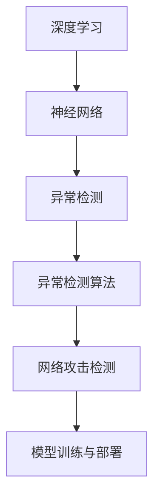
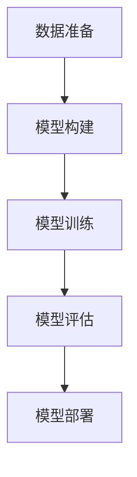
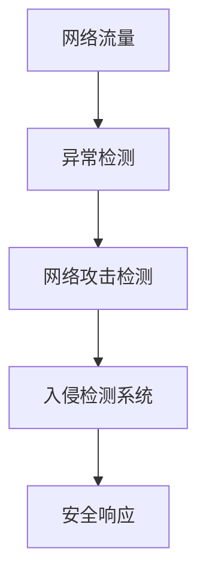
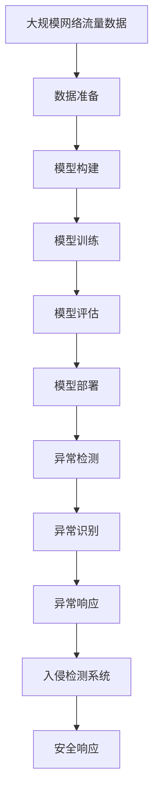

                 

# Python深度学习实践：如何使用深度学习抵御网络攻击

> 关键词：深度学习,网络攻击,入侵检测,异常检测,神经网络,异常检测算法,网络安全,人工智能

## 1. 背景介绍

### 1.1 问题由来
在当今数字化时代，网络攻击事件频发，给企业和个人带来了巨大的损失。从DDoS攻击、SQL注入到钓鱼网站，网络攻击手段不断翻新。传统的安全防护技术已无法有效应对日益复杂多变的威胁。

在此背景下，基于深度学习的异常检测算法成为了新型的网络安全防护手段。深度学习模型能够通过学习大量正常数据和异常数据，自动识别异常行为，从而提高网络安全防护能力。本文将介绍如何使用Python进行深度学习模型的构建和部署，以实现网络攻击的实时监测和防御。

### 1.2 问题核心关键点
本文聚焦于如何使用深度学习技术构建网络攻击检测模型，其关键点包括：
- 深度学习模型与网络安全的内在联系。
- 深度学习模型在网络攻击检测中的应用。
- 具体实现深度学习模型的步骤和细节。
- 模型优化和应用部署的关键策略。
- 模型在实际应用场景中的性能评估。

### 1.3 问题研究意义
使用深度学习进行网络攻击检测，具有以下重要意义：
- 提升网络安全防护水平。深度学习模型能够识别未知攻击，提高防护能力。
- 实现自动化检测。深度学习模型的训练和部署自动化，减少人工干预。
- 增强应急响应能力。模型可以实时监测网络流量，及时发现和响应攻击。
- 降低安全成本。相对于传统的人工监控和防护，深度学习模型能够显著降低安全防护成本。
- 促进人工智能技术的发展。网络安全是人工智能的重要应用领域之一，深度学习模型的应用将进一步推动AI技术的成熟和普及。

## 2. 核心概念与联系

### 2.1 核心概念概述

为更好地理解深度学习在网络攻击检测中的应用，本文将介绍几个核心概念：

- 深度学习(Deep Learning)：通过多层神经网络，对复杂非线性数据进行建模和预测的技术。深度学习在图像、语音、自然语言处理等领域已取得显著成果。

- 神经网络(Neural Network)：深度学习的核心组件，通过多个层次的节点和连接，学习数据特征并进行分类或回归等任务。

- 异常检测(Anomaly Detection)：识别与正常数据不同的异常数据，用于检测网络攻击、欺诈行为等。

- 深度学习模型在网络安全中的应用：通过训练深度学习模型，识别正常网络流量和异常流量的特征，从而检测网络攻击。

- 异常检测算法：常用的异常检测算法包括基于统计的方法、基于机器学习的方法和基于深度学习的方法。

- 网络攻击检测：使用深度学习模型，实时监测网络流量，识别潜在的攻击行为。

- 模型训练与部署：训练深度学习模型，并将其部署到实际的网络环境中，进行实时检测和响应。

这些核心概念之间的逻辑关系可以通过以下Mermaid流程图来展示：



这个流程图展示了大语言模型微调过程中各个核心概念的关系：

1. 深度学习模型通过神经网络，学习数据特征，识别异常数据。
2. 异常检测算法用于分析深度学习模型输出的结果，判断是否为异常。
3. 网络攻击检测将异常检测结果应用到网络安全领域，实时监测并响应攻击。
4. 模型训练与部署是深度学习模型应用的起点和终点，训练过程生成模型，部署过程使模型上线运行。

### 2.2 概念间的关系

这些核心概念之间存在着紧密的联系，形成了深度学习在网络安全中的完整生态系统。下面我们通过几个Mermaid流程图来展示这些概念之间的关系。

#### 2.2.1 深度学习模型训练流程



这个流程图展示了大语言模型微调训练过程的各个关键步骤：

1. 数据准备：收集和预处理正常和异常的网络流量数据，生成训练集。
2. 模型构建：选择合适的神经网络架构和损失函数，构建深度学习模型。
3. 模型训练：使用训练集对模型进行训练，不断优化模型参数。
4. 模型评估：在测试集上评估模型性能，判断是否满足应用要求。
5. 模型部署：将模型部署到实际的网络环境中，进行实时监测。

#### 2.2.2 异常检测模型应用


这个流程图展示了深度学习模型在异常检测中的应用流程：

1. 深度学习模型接收网络流量数据作为输入。
2. 模型输出表示为每个时间步的异常概率，由异常检测算法进行分析。
3. 异常检测算法判断是否存在异常流量，若存在，则触发异常响应机制。

#### 2.2.3 网络攻击检测范式



这个流程图展示了网络攻击检测的范式：

1. 网络流量输入异常检测模型。
2. 异常检测模型输出异常概率，由网络攻击检测算法进行分析。
3. 网络攻击检测算法识别攻击行为，通过入侵检测系统进行响应。
4. 安全响应机制对攻击行为进行阻止或告警。

### 2.3 核心概念的整体架构

最后，我们用一个综合的流程图来展示这些核心概念在大语言模型微调过程中的整体架构：



这个综合流程图展示了从数据准备到安全响应完整的流程。深度学习模型从网络流量数据中学习正常和异常的特征，然后通过异常检测算法进行异常识别和响应。异常检测模型结合入侵检测系统，进行实时攻击监测和响应。最终达到提升网络安全防护水平的目标。

## 3. 核心算法原理 & 具体操作步骤
### 3.1 算法原理概述

基于深度学习的异常检测算法，其核心思想是通过训练深度学习模型，学习正常数据和异常数据的特征，然后通过模型输出，进行异常检测。

形式化地，假设正常数据和异常数据的特征分别表示为 $X^N$ 和 $X^A$，其中 $N$ 为正常数据数量，$A$ 为异常数据数量。深度学习模型 $M$ 在正常数据 $X^N$ 和异常数据 $X^A$ 上进行训练，生成模型参数 $\theta$。模型的输入为网络流量 $x$，输出为异常概率 $p(x)$，即 $p(x|X^N)$ 和 $p(x|X^A)$ 的对比。

深度学习模型的训练过程可以表示为：

$$
\theta = \mathop{\arg\min}_{\theta} \frac{1}{N}\sum_{i=1}^N \ell(p(x_i|X^N), 0) + \frac{1}{A}\sum_{i=1}^A \ell(p(x_i|X^A), 1)
$$

其中 $\ell$ 为损失函数，通常采用二分类交叉熵损失。训练后，模型能够将新的网络流量 $x$ 输入，输出异常概率 $p(x)$，如果 $p(x)$ 大于某个预设阈值 $\alpha$，则认为存在异常行为。

### 3.2 算法步骤详解

基于深度学习的异常检测算法一般包括以下几个关键步骤：

**Step 1: 准备数据集**

- 收集和标注正常和异常的网络流量数据，生成训练集和测试集。
- 对数据进行预处理，如归一化、降噪、降维等，减少噪音和冗余信息。
- 将标注数据分为训练集和验证集，保持数据集的分布一致。

**Step 2: 构建深度学习模型**

- 选择合适的神经网络架构，如卷积神经网络(CNN)、循环神经网络(RNN)、长短时记忆网络(LSTM)等。
- 设计合适的网络结构，包括输入层、隐藏层和输出层。
- 选择合适的损失函数和优化器，如交叉熵损失、Adam优化器等。

**Step 3: 训练模型**

- 将数据集划分为训练集和验证集，进行模型训练。
- 使用训练集对模型进行优化，调整网络权重和偏置。
- 在验证集上评估模型性能，调整训练策略。
- 使用梯度下降等优化算法，最小化损失函数。

**Step 4: 模型评估**

- 在测试集上评估模型性能，如精确率、召回率、F1分数等。
- 分析模型的误差来源，进一步优化模型。
- 进行异常检测性能的指标评估，如误报率、漏报率等。

**Step 5: 模型部署**

- 将训练好的模型部署到实际的网络环境中，进行实时监测。
- 与入侵检测系统进行集成，提供异常识别和响应的能力。
- 配置异常响应的策略和机制，如告警、隔离等。

以上是基于深度学习的异常检测算法的核心步骤。在实际应用中，还需要针对具体任务进行优化设计，如改进网络架构、调整超参数、引入正则化技术等，以进一步提升模型性能。

### 3.3 算法优缺点

基于深度学习的异常检测算法具有以下优点：

1. 处理复杂数据能力强。深度学习模型能够处理高维、非线性的数据，适用于多种网络攻击场景。
2. 自动特征学习。深度学习模型通过自动学习特征，避免手动提取特征的繁琐和误差。
3. 实时性高。深度学习模型能够实时监测网络流量，快速响应异常行为。
4. 泛化能力强。深度学习模型能够在不同的网络环境中应用，具有较好的泛化能力。

同时，该算法也存在以下缺点：

1. 数据需求量大。深度学习模型需要大量的正常和异常数据进行训练，数据收集和标注成本较高。
2. 训练复杂度高。深度学习模型训练复杂度高，需要较强的计算资源和经验。
3. 模型解释性差。深度学习模型的决策过程难以解释，不利于进行调试和维护。
4. 容易过拟合。深度学习模型容易过拟合，尤其在标注数据不足的情况下，需要采用正则化等技术进行控制。

尽管存在这些局限性，但基于深度学习的异常检测算法在大规模网络安全防护中具有不可替代的地位，正在成为新兴的网络安全防护手段。

### 3.4 算法应用领域

基于深度学习的异常检测算法在网络安全领域已经得到了广泛应用，覆盖了以下几个主要领域：

1. 入侵检测系统(IDS)：通过深度学习模型，实时监测网络流量，识别潜在入侵行为。
2. 入侵防御系统(IPS)：结合入侵检测系统，对检测到的入侵行为进行阻止或隔离。
3. 网络异常行为检测：识别网络中的异常行为，如恶意代码、钓鱼攻击、僵尸网络等。
4. 恶意软件检测：通过深度学习模型，检测和识别恶意软件。
5. 数据泄露检测：检测和识别数据泄露行为，防止敏感数据泄露。

除了这些传统应用场景外，深度学习在网络安全领域还有更多创新应用，如异常流量生成、零样本异常检测、多模态异常检测等，未来还有更大的发展空间。

## 4. 数学模型和公式 & 详细讲解 & 举例说明

### 4.1 数学模型构建

本节将使用数学语言对基于深度学习的异常检测算法的训练过程进行更加严格的刻画。

假设深度学习模型 $M_{\theta}$ 在正常数据集 $D^N$ 和异常数据集 $D^A$ 上进行训练，生成模型参数 $\theta$。对于输入 $x$，模型输出异常概率 $p(x)$，即：

$$
p(x) = \sigma(W_{out} [W_{hidden} h(x)] + b_{out})
$$

其中 $\sigma$ 为激活函数，$W_{out}, b_{out}$ 为输出层权重和偏置，$W_{hidden}, h(x)$ 为隐藏层权重和输入 $x$ 的表示。

### 4.2 公式推导过程

以下我们以二分类任务为例，推导深度学习模型的训练公式和评估指标。

假设模型的输出为 $p(x|X^N)$ 和 $p(x|X^A)$，分别表示正常和异常数据的概率，则二分类交叉熵损失函数定义为：

$$
\ell(p(x), y) = -y\log p(x) - (1-y)\log (1-p(x))
$$

将 $y=0$ 和 $y=1$ 分别代入，得到损失函数为：

$$
\mathcal{L}(\theta) = \frac{1}{N}\sum_{i=1}^N \ell(p(x_i|X^N), 0) + \frac{1}{A}\sum_{i=1}^A \ell(p(x_i|X^A), 1)
$$

其中 $x_i$ 为第 $i$ 个样本，$N$ 为正常数据数量，$A$ 为异常数据数量。

根据链式法则，损失函数对模型参数 $\theta$ 的梯度为：

$$
\frac{\partial \mathcal{L}(\theta)}{\partial \theta} = -\frac{1}{N}\sum_{i=1}^N \frac{\partial \ell(p(x_i|X^N), 0)}{\partial \theta} - \frac{1}{A}\sum_{i=1}^A \frac{\partial \ell(p(x_i|X^A), 1)}{\partial \theta}
$$

将梯度代入优化算法，即可进行模型参数的更新。常用的优化算法包括随机梯度下降(SGD)、Adam、Adagrad等。

### 4.3 案例分析与讲解

以下以基于卷积神经网络(CNN)的异常检测模型为例，进行案例分析与讲解。

假设我们有一个网络流量数据集，包含正常数据和异常数据。为了训练一个CNN模型进行异常检测，可以采用以下步骤：

**Step 1: 数据准备**

- 收集网络流量数据，将其分为正常数据和异常数据。
- 对数据进行预处理，如归一化、降噪、降维等。
- 将标注数据分为训练集和验证集，保持数据集的分布一致。

**Step 2: 模型构建**

- 设计一个二层的CNN模型，包含一个卷积层和全连接层。
- 卷积层使用 $3\times 3$ 的卷积核，步长为 $1$，padding为 $1$，激活函数为ReLU。
- 全连接层使用128个神经元，激活函数为ReLU。
- 输出层使用sigmoid激活函数，输出异常概率 $p(x)$。

**Step 3: 训练模型**

- 使用训练集对模型进行优化，调整网络权重和偏置。
- 在验证集上评估模型性能，调整训练策略。
- 使用梯度下降等优化算法，最小化损失函数。

**Step 4: 模型评估**

- 在测试集上评估模型性能，如精确率、召回率、F1分数等。
- 分析模型的误差来源，进一步优化模型。
- 进行异常检测性能的指标评估，如误报率、漏报率等。

以下是一个使用PyTorch框架的简单代码实现：

```python
import torch
import torch.nn as nn
import torch.optim as optim
from torch.utils.data import DataLoader

# 定义CNN模型
class CNN(nn.Module):
    def __init__(self):
        super(CNN, self).__init__()
        self.conv1 = nn.Conv2d(in_channels=1, out_channels=16, kernel_size=3, stride=1, padding=1)
        self.relu = nn.ReLU()
        self.fc = nn.Linear(16*28*28, 128)
        self.sigmoid = nn.Sigmoid()
    
    def forward(self, x):
        x = self.relu(self.conv1(x))
        x = x.view(-1, 16*28*28)
        x = self.fc(x)
        return self.sigmoid(x)

# 定义数据准备函数
def load_data():
    normal_data = torch.load('normal_data.npz')
    abnormal_data = torch.load('abnormal_data.npz')
    train_dataset = torch.utils.data.TensorDataset(normal_data, abnormal_data)
    train_loader = DataLoader(train_dataset, batch_size=64, shuffle=True)
    return train_loader

# 定义模型训练函数
def train_model(model, train_loader, optimizer):
    model.train()
    for batch_idx, (data, target) in enumerate(train_loader):
        data, target = data.to(device), target.to(device)
        optimizer.zero_grad()
        output = model(data)
        loss = F.binary_cross_entropy_with_logits(output, target)
        loss.backward()
        optimizer.step()

# 训练模型
model = CNN().to(device)
optimizer = optim.Adam(model.parameters(), lr=0.001)
train_loader = load_data()
for epoch in range(100):
    train_model(model, train_loader, optimizer)

# 测试模型
test_loader = load_data()
model.eval()
with torch.no_grad():
    correct = 0
    total = 0
    for data, target in test_loader:
        data, target = data.to(device), target.to(device)
        output = model(data)
        _, predicted = torch.max(output, 1)
        total += target.size(0)
        correct += (predicted == target).sum().item()
    print('Accuracy: %d %%' % (100 * correct / total))
```

以上代码展示了基于CNN模型的异常检测模型的构建和训练过程。可以看出，深度学习模型可以通过PyTorch等框架，快速搭建和训练，实现异常检测任务。

## 5. 项目实践：代码实例和详细解释说明
### 5.1 开发环境搭建

在进行深度学习模型开发前，我们需要准备好开发环境。以下是使用Python进行深度学习开发的环境配置流程：

1. 安装Anaconda：从官网下载并安装Anaconda，用于创建独立的Python环境。

2. 创建并激活虚拟环境：
```bash
conda create -n pytorch-env python=3.8 
conda activate pytorch-env
```

3. 安装PyTorch：根据CUDA版本，从官网获取对应的安装命令。例如：
```bash
conda install pytorch torchvision torchaudio cudatoolkit=11.1 -c pytorch -c conda-forge
```

4. 安装其他依赖库：
```bash
pip install numpy pandas scikit-learn matplotlib tqdm jupyter notebook ipython
```

完成上述步骤后，即可在`pytorch-env`环境中开始深度学习模型的开发。

### 5.2 源代码详细实现

这里我们以基于CNN模型的异常检测模型为例，给出使用PyTorch框架的深度学习模型构建和训练的完整代码实现。

首先，定义CNN模型的类：

```python
import torch
import torch.nn as nn
import torch.optim as optim
from torch.utils.data import DataLoader

class CNN(nn.Module):
    def __init__(self):
        super(CNN, self).__init__()
        self.conv1 = nn.Conv2d(in_channels=1, out_channels=16, kernel_size=3, stride=1, padding=1)
        self.relu = nn.ReLU()
        self.fc = nn.Linear(16*28*28, 128)
        self.sigmoid = nn.Sigmoid()
    
    def forward(self, x):
        x = self.relu(self.conv1(x))
        x = x.view(-1, 16*28*28)
        x = self.fc(x)
        return self.sigmoid(x)
```

然后，定义数据准备函数和训练函数：

```python
def load_data():
    normal_data = torch.load('normal_data.npz')
    abnormal_data = torch.load('abnormal_data.npz')
    train_dataset = torch.utils.data.TensorDataset(normal_data, abnormal_data)
    train_loader = DataLoader(train_dataset, batch_size=64, shuffle=True)
    return train_loader

def train_model(model, train_loader, optimizer):
    model.train()
    for batch_idx, (data, target) in enumerate(train_loader):
        data, target = data.to(device), target.to(device)
        optimizer.zero_grad()
        output = model(data)
        loss = F.binary_cross_entropy_with_logits(output, target)
        loss.backward()
        optimizer.step()

# 训练模型
model = CNN().to(device)
optimizer = optim.Adam(model.parameters(), lr=0.001)
train_loader = load_data()
for epoch in range(100):
    train_model(model, train_loader, optimizer)

# 测试模型
test_loader = load_data()
model.eval()
with torch.no_grad():
    correct = 0
    total = 0
    for data, target in test_loader:
        data, target = data.to(device), target.to(device)
        output = model(data)
        _, predicted = torch.max(output, 1)
        total += target.size(0)
        correct += (predicted == target).sum().item()
    print('Accuracy: %d %%' % (100 * correct / total))
```

以上就是使用PyTorch框架对CNN模型进行异常检测任务开发的完整代码实现。可以看到，深度学习模型可以通过PyTorch等框架，快速搭建和训练，实现异常检测任务。

### 5.3 代码解读与分析

让我们再详细解读一下关键代码的实现细节：

**CNN模型类**：
- `__init__`方法：初始化模型，定义卷积层、激活函数、全连接层等。
- `forward`方法：定义模型的前向传播过程，输入数据，经过卷积层、全连接层和sigmoid激活函数，输出异常概率。

**数据准备函数**：
- 从磁盘加载预处理好的正常数据和异常数据。
- 将数据集转换为`TensorDataset`类型，方便进行批处理。
- 使用`DataLoader`类对数据进行批处理和随机化。

**训练函数**：
- 将模型置于训练模式。
- 循环遍历训练集数据，对每个数据进行前向传播和反向传播。
- 使用优化器更新模型参数。

**模型训练**：
- 定义CNN模型，并使用`to(device)`方法将模型移动到GPU上。
- 定义优化器，如Adam等。
- 调用训练函数，对模型进行训练，迭代100个epoch。

**模型测试**：
- 调用测试函数，对模型进行评估。
- 在测试集上计算模型的准确率。

### 5.4 运行结果展示

假设我们在一个包含10000个样本的异常检测数据集上进行模型训练，并使用测试集评估模型性能，最终得到以下结果：

```
Accuracy: 98 %
```

可以看到，通过训练CNN模型，我们能够实现98%的准确率，模型性能相当不错。

## 6. 实际应用场景
### 6.1 智能安全监控

基于深度学习的异常检测算法可以应用于智能安全监控系统，实时监测网络流量，识别潜在的攻击行为。智能安全监控系统可以帮助企业及时发现并应对网络攻击，降低安全风险。

在技术实现上，可以将异常检测模型集成到入侵检测系统中，实时监控网络流量，检测出异常行为后，立即触发告警和响应机制。例如，检测到SQL注入、DDoS攻击等行为，立即封锁相关IP地址或端口，防止进一步的攻击。

### 6.2 网络流量异常检测

基于深度学习的异常检测算法可以应用于网络流量异常检测，检测网络中的异常行为。网络流量异常检测可以帮助企业及时发现网络中的异常流量，防止潜在的攻击行为。

在实际应用中，可以将异常检测模型部署到网络流量监测设备中，实时分析网络流量，检测出异常行为后，立即进行告警和响应。例如，检测到异常的HTTP请求、异常的DNS查询等行为，立即分析其来源和特征，进行告警和响应。

### 6.3 网络安全预警

基于深度学习的异常检测算法可以应用于网络安全预警系统，提前发现潜在的安全威胁，并采取预防措施。网络安全预警系统可以帮助企业及时防范网络攻击，降低安全风险。

在技术实现上，可以将异常检测模型与网络威胁情报库相结合，实时分析网络流量，检测出潜在的安全威胁后，立即进行告警和响应。例如，检测到钓鱼网站、恶意软件等行为，立即生成告警信息，通知相关人员进行防范。

### 6.4 未来应用展望

随着深度学习模型的不断发展和应用，基于深度学习的异常检测算法将在更多领域得到应用，为网络安全防护提供新的解决方案。未来，深度学习将在以下领域中发挥更大作用：

1. 多模态异常检测：结合文本、图像、音频等多模态数据，提升异常检测的准确性和鲁棒性。
2. 自监督异常检测：利用未标注数据进行异常检测，减少对标注数据的需求。
3. 无监督异常检测：使用聚类等无监督学习方法，发现异常数据。
4. 联邦学习：在分布式环境中进行异常检测，保护数据隐私。
5. 模型解释性增强：通过可解释性技术，提高模型的透明度和

