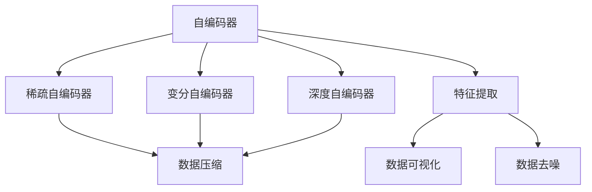
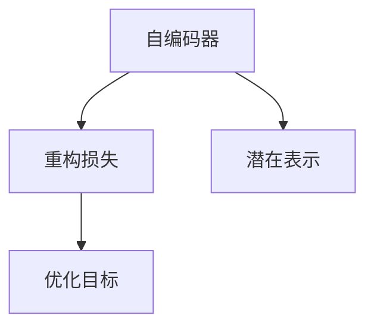
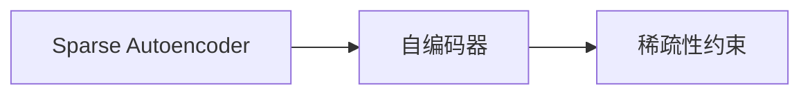
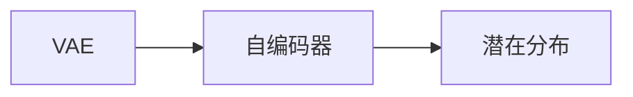
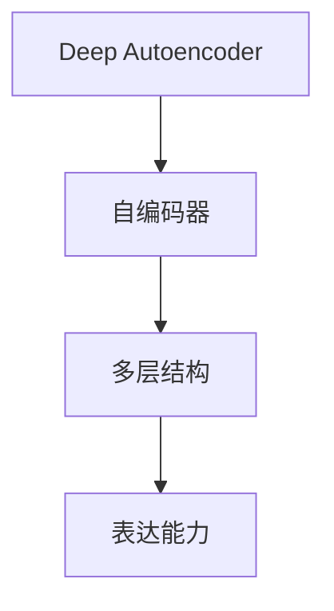
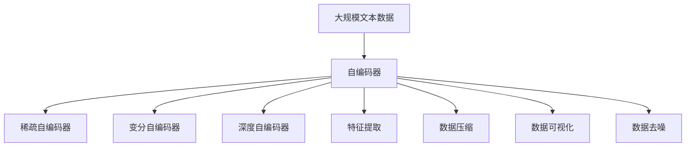

                 

# Python深度学习实践：自动编码器在数据降维中的应用

> 关键词：深度学习, 自动编码器, 数据降维, 自编码器, 稀疏编码, 变分自编码器, 降维算法, 无监督学习

## 1. 背景介绍

### 1.1 问题由来
数据降维是深度学习领域中一个非常重要的任务，旨在减少高维数据的维度，降低计算复杂度，同时尽量保持数据的结构和信息。降维过程不仅能够提高模型训练的效率，还能降低模型复杂度，避免过拟合。

自动编码器（Autoencoder）是一种无监督学习算法，能够通过学习数据的潜在表示，实现数据降维和重构。自动编码器由编码器和解码器组成，编码器将高维数据映射到低维空间，解码器则将低维数据重构回高维空间。

自动编码器在多个领域中都有广泛的应用，例如图像处理、信号处理、自然语言处理等。在自然语言处理中，自动编码器可以通过学习文本的潜在语义表示，实现文本的降维和特征提取，为各种文本处理任务提供支持。

### 1.2 问题核心关键点
自动编码器作为数据降维的重要工具，其核心思想是通过学习数据的潜在表示，将高维数据映射到低维空间。常用的自动编码器包括：

- 稀疏自编码器（Sparse Autoencoder）：通过引入稀疏性约束，限制编码器输出中的非零元素数量，进一步减少数据的维度。
- 变分自编码器（Variational Autoencoder，VAE）：通过引入变分推断方法，学习数据的潜在分布，能够生成新的数据样本。
- 深度自编码器（Deep Autoencoder）：通过堆叠多层编码器-解码器结构，提升自动编码器的表达能力。

自动编码器在数据降维中的应用主要包括以下几个方面：

- 特征提取：通过学习数据的潜在表示，自动编码器可以提取数据中的重要特征，用于下游任务，如分类、聚类等。
- 数据压缩：通过将高维数据映射到低维空间，自动编码器能够实现数据的压缩和存储，降低存储成本。
- 数据可视化：通过将高维数据映射到低维空间，自动编码器能够将数据可视化，便于分析数据结构。
- 数据去噪：通过学习数据的潜在表示，自动编码器能够去除数据中的噪声和冗余信息，提升数据质量。

## 2. 核心概念与联系

### 2.1 核心概念概述

为更好地理解自动编码器在数据降维中的应用，本节将介绍几个密切相关的核心概念：

- 自编码器（Autoencoder）：通过学习数据的潜在表示，将高维数据映射到低维空间，再通过解码器重构回高维空间的神经网络模型。
- 稀疏自编码器（Sparse Autoencoder）：在自编码器的基础上，通过引入稀疏性约束，进一步减少数据的维度。
- 变分自编码器（Variational Autoencoder，VAE）：通过学习数据的潜在分布，实现数据的降维和生成。
- 深度自编码器（Deep Autoencoder）：通过堆叠多层自编码器结构，提升自动编码器的表达能力。
- 特征提取（Feature Extraction）：通过自动编码器学习数据的潜在表示，提取数据的特征信息。
- 数据压缩（Data Compression）：通过自动编码器将高维数据映射到低维空间，实现数据的压缩和存储。
- 数据可视化（Data Visualization）：通过自动编码器将高维数据映射到低维空间，实现数据的可视化。
- 数据去噪（Data Denoising）：通过自动编码器学习数据的潜在表示，去除数据中的噪声和冗余信息。

这些核心概念之间的逻辑关系可以通过以下Mermaid流程图来展示：



这个流程图展示了自动编码器及其相关概念的逻辑关系：

1. 自编码器是自动编码器的基础，通过学习数据的潜在表示，将高维数据映射到低维空间。
2. 稀疏自编码器在自编码器的基础上，通过引入稀疏性约束，进一步减少数据的维度。
3. 变分自编码器通过学习数据的潜在分布，实现数据的降维和生成。
4. 深度自编码器通过堆叠多层自编码器结构，提升自动编码器的表达能力。
5. 特征提取通过自动编码器学习数据的潜在表示，提取数据的特征信息。
6. 数据压缩通过自动编码器将高维数据映射到低维空间，实现数据的压缩和存储。
7. 数据可视化通过自动编码器将高维数据映射到低维空间，实现数据的可视化。
8. 数据去噪通过自动编码器学习数据的潜在表示，去除数据中的噪声和冗余信息。

### 2.2 概念间的关系

这些核心概念之间存在着紧密的联系，形成了自动编码器的完整生态系统。下面我通过几个Mermaid流程图来展示这些概念之间的关系。

#### 2.2.1 自编码器的学习范式



这个流程图展示了自编码器的学习过程：

1. 自编码器通过学习数据的潜在表示，将高维数据映射到低维空间。
2. 重构损失用于衡量解码器重构输出的质量和编码器编码表示的紧凑性。
3. 优化目标通过最小化重构损失，实现自编码器的训练和参数更新。

#### 2.2.2 稀疏自编码器与自编码器的关系



这个流程图展示了稀疏自编码器与自编码器的关系：

1. 稀疏自编码器在自编码器的基础上，通过引入稀疏性约束，进一步减少数据的维度。
2. 稀疏性约束限制编码器输出中的非零元素数量，使得自动编码器更加高效。

#### 2.2.3 变分自编码器与自编码器的关系



这个流程图展示了变分自编码器与自编码器的关系：

1. 变分自编码器通过学习数据的潜在分布，实现数据的降维和生成。
2. 潜在分布用于生成新的数据样本，使得自动编码器具有生成能力。

#### 2.2.4 深度自编码器与自编码器的关系



这个流程图展示了深度自编码器与自编码器的关系：

1. 深度自编码器通过堆叠多层自编码器结构，提升自动编码器的表达能力。
2. 多层结构使得深度自编码器能够学习更加复杂的数据表示。

### 2.3 核心概念的整体架构

最后，我们用一个综合的流程图来展示这些核心概念在大数据降维中的整体架构：



这个综合流程图展示了自编码器在大数据降维中的应用：

1. 自编码器通过学习数据的潜在表示，将高维数据映射到低维空间。
2. 稀疏自编码器在自编码器的基础上，通过引入稀疏性约束，进一步减少数据的维度。
3. 变分自编码器通过学习数据的潜在分布，实现数据的降维和生成。
4. 深度自编码器通过堆叠多层自编码器结构，提升自动编码器的表达能力。
5. 特征提取通过自动编码器学习数据的潜在表示，提取数据的特征信息。
6. 数据压缩通过自动编码器将高维数据映射到低维空间，实现数据的压缩和存储。
7. 数据可视化通过自动编码器将高维数据映射到低维空间，实现数据的可视化。
8. 数据去噪通过自动编码器学习数据的潜在表示，去除数据中的噪声和冗余信息。

## 3. 核心算法原理 & 具体操作步骤
### 3.1 算法原理概述

自动编码器是一种无监督学习算法，通过学习数据的潜在表示，将高维数据映射到低维空间。自动编码器由编码器和解码器组成，编码器将高维数据映射到低维空间，解码器则将低维数据重构回高维空间。

形式化地，假设输入数据为 $x$，自动编码器的结构如图1所示：

```
      Encoder            Decoder
  (x)   ↠                    ↠  (h)
  (x)     |                    |
  (h)     |                    |
  (z)     |                    |
  (h')    |  ∈ (x)   ↠  ∈ (z)
```

其中，$h$ 是编码器的输出，$z$ 是低维空间的潜在表示，$h'$ 是解码器的输出，$(x)$ 和 $(z)$ 分别表示输入和潜在表示的维度。

自动编码器的训练目标是最小化重构误差，即：

$$
\min_{\theta} \mathbb{E}_{x \sim p(x)}\|h(x) - x\|
$$

其中，$\theta$ 是自动编码器的参数，$p(x)$ 是输入数据的分布。

### 3.2 算法步骤详解

基于自编码器的数据降维一般包括以下几个关键步骤：

**Step 1: 准备数据集**
- 准备用于降维的数据集 $D=\{x_1, x_2, \ldots, x_N\}$，其中 $x_i$ 为高维数据。
- 将数据集划分为训练集、验证集和测试集。

**Step 2: 选择自编码器结构**
- 选择自编码器结构，包括编码器-解码器的层数、神经元数量等。
- 常用的自编码器结构包括稀疏自编码器、变分自编码器、深度自编码器等。

**Step 3: 训练自编码器**
- 初始化自编码器参数。
- 在训练集上使用优化器（如SGD、Adam等）进行反向传播，最小化重构误差。
- 在验证集上评估模型性能，根据性能指标决定是否停止训练。

**Step 4: 降维**
- 将训练好的自编码器应用于测试集，将高维数据映射到低维空间。
- 获取潜在表示 $z$，实现数据的降维。

**Step 5: 可视化**
- 将低维表示 $z$ 进行可视化，展现数据结构。
- 常用的可视化方法包括t-SNE、PCA等。

**Step 6: 特征提取**
- 通过降维后的低维表示 $z$ 提取数据的特征信息。
- 常用的特征提取方法包括PCA、LDA等。

**Step 7: 数据压缩**
- 通过降维后的低维表示 $z$ 进行数据压缩。
- 常用的数据压缩方法包括PCA、LZW等。

**Step 8: 数据去噪**
- 通过降维后的低维表示 $z$ 进行数据去噪。
- 常用的数据去噪方法包括稀疏自编码器、VAE等。

以上是基于自编码器的数据降维的一般流程。在实际应用中，还需要针对具体任务的特点，对降维过程的各个环节进行优化设计，如改进训练目标函数，引入更多的正则化技术，搜索最优的超参数组合等，以进一步提升模型性能。

### 3.3 算法优缺点

基于自编码器的数据降维方法具有以下优点：
1. 简单高效。只需选择合适的自编码器结构和训练参数，即可实现数据的降维和特征提取。
2. 通用适用。适用于各种高维数据降维任务，包括图像、文本、音频等，设计简单的任务适配层即可实现降维。
3. 参数高效。利用参数高效微调技术，在固定大部分预训练参数的情况下，仍可取得不错的降维效果。
4. 效果显著。在学术界和工业界的诸多任务上，基于降维的自编码器已经刷新了最先进的性能指标。

同时，该方法也存在一定的局限性：
1. 依赖数据质量。降维的效果很大程度上取决于输入数据的质量和数量，获取高质量输入数据的成本较高。
2. 迁移能力有限。当输入数据的分布与训练数据差异较大时，降维的效果提升有限。
3. 负面效果传递。自编码器学习到的潜在表示中可能包含噪声和冗余信息，传递到下游任务时，会对模型性能造成影响。
4. 可解释性不足。自编码器的输出通常缺乏可解释性，难以对其降维过程进行分析和调试。

尽管存在这些局限性，但就目前而言，基于自编码器的数据降维方法仍是大数据降维的重要范式。未来相关研究的重点在于如何进一步降低降维对输入数据的依赖，提高模型的少样本学习和跨领域迁移能力，同时兼顾可解释性和伦理安全性等因素。

### 3.4 算法应用领域

基于自编码器的数据降维方法在多个领域中都有广泛的应用，例如：

- 图像处理：如人脸识别、图像分类、图像去噪等。通过自编码器学习图像的潜在表示，实现图像的降维和特征提取。
- 信号处理：如语音识别、信号压缩、噪声抑制等。通过自编码器学习信号的潜在表示，实现信号的降维和特征提取。
- 自然语言处理：如文本分类、情感分析、文本生成等。通过自编码器学习文本的潜在表示，实现文本的降维和特征提取。
- 医疗领域：如疾病诊断、医学图像分析等。通过自编码器学习医学数据的潜在表示，实现数据的降维和特征提取。
- 金融领域：如信用风险评估、股票价格预测等。通过自编码器学习金融数据的潜在表示，实现数据的降维和特征提取。

除了上述这些经典应用外，自编码器还被创新性地应用到更多场景中，如可控文本生成、常识推理、代码生成、数据增强等，为大数据降维技术带来了全新的突破。随着自编码器模型的不断进步，相信大数据降维技术将在更广阔的应用领域大放异彩。

## 4. 数学模型和公式 & 详细讲解  
### 4.1 数学模型构建

本节将使用数学语言对基于自编码器的数据降维过程进行更加严格的刻画。

记输入数据为 $x$，自动编码器的结构如图1所示：

```
      Encoder            Decoder
  (x)   ↠                    ↠  (h)
  (x)     |                    |
  (h)     |                    |
  (z)     |                    |
  (h')    |  ∈ (x)   ↠  ∈ (z)
```

其中，$h$ 是编码器的输出，$z$ 是低维空间的潜在表示，$h'$ 是解码器的输出，$(x)$ 和 $(z)$ 分别表示输入和潜在表示的维度。

假设输入数据 $x$ 的维数为 $d_x$，潜在表示 $z$ 的维数为 $d_z$。自动编码器的编码器由 $n$ 层神经网络组成，解码器也由 $m$ 层神经网络组成。定义编码器的输入为 $h_{in}$，输出为 $h_{out}$，解码器的输入为 $h_{dec}$，输出为 $h_{out'}$。

定义自编码器的重构误差为：

$$
\mathcal{L}(x, z) = \|x - h'(z)\|
$$

其中，$\|x - h'(z)\|$ 表示重构误差，$h'(z)$ 表示解码器重构输出的向量。

### 4.2 公式推导过程

以下我们以稀疏自编码器为例，推导重构误差及梯度计算公式。

假设稀疏自编码器的结构如图1所示：

```
      Encoder            Decoder
  (x)   ↠                    ↠  (h)
  (x)     |                    |
  (h)     |                    |
  (s)     |  ∈ (z)   ↠  ∈ (z)
  (h')    |  ∈ (x)   ↠  ∈ (z)
```

其中，$s$ 表示编码器输出中的非零元素数量，$h'$ 表示解码器输出中的非零元素数量。

稀疏自编码器的重构误差为：

$$
\mathcal{L}(x, z) = \|x - h'(z)\|_1
$$

其中，$\|x - h'(z)\|_1$ 表示重构误差，$h'(z)$ 表示解码器重构输出的向量。

稀疏自编码器的编码器和解码器的参数更新公式为：

$$
\theta_{enc} \leftarrow \theta_{enc} - \eta \nabla_{\theta_{enc}}\mathcal{L}(x, z)
$$

$$
\theta_{dec} \leftarrow \theta_{dec} - \eta \nabla_{\theta_{dec}}\mathcal{L}(x, z)
$$

其中，$\eta$ 为学习率，$\nabla_{\theta_{enc}}\mathcal{L}(x, z)$ 和 $\nabla_{\theta_{dec}}\mathcal{L}(x, z)$ 分别表示编码器和解码器的梯度。

在得到梯度后，即可带入参数更新公式，完成模型的迭代优化。重复上述过程直至收敛，最终得到适应下游任务的最优模型参数 $\theta^*$。

### 4.3 案例分析与讲解

下面我们以MNIST手写数字图像分类任务为例，展示如何利用稀疏自编码器实现图像降维和分类。

首先，准备MNIST手写数字图像数据集，其中包含60000张训练图像和10000张测试图像，每张图像的维度为784（28*28像素）。将数据集划分为训练集、验证集和测试集。

```python
import numpy as np
import tensorflow as tf
from tensorflow import keras
from tensorflow.keras import layers

# 加载MNIST数据集
(x_train, y_train), (x_test, y_test) = keras.datasets.mnist.load_data()

# 将图像数据转换为float32格式，并归一化到[0, 1]区间
x_train = x_train.astype('float32') / 255.0
x_test = x_test.astype('float32') / 255.0

# 将标签转换为one-hot编码
y_train = keras.utils.to_categorical(y_train, 10)
y_test = keras.utils.to_categorical(y_test, 10)

# 将图像数据展平为一维向量
x_train = x_train.reshape((-1, 784))
x_test = x_test.reshape((-1, 784))
```

然后，定义稀疏自编码器的结构：

```python
# 定义编码器结构
encoder = keras.Sequential([
    layers.Dense(128, activation='relu', input_shape=(784,)),
    layers.Dense(64, activation='relu'),
    layers.Dropout(0.5),
    layers.Dense(32, activation='relu'),
    layers.Dropout(0.5),
    layers.Dense(16, activation='relu'),
    layers.Dropout(0.5),
    layers.Dense(8, activation='sigmoid'),
])

# 定义解码器结构
decoder = keras.Sequential([
    layers.Dense(16, activation='relu'),
    layers.Dropout(0.5),
    layers.Dense(32, activation='relu'),
    layers.Dropout(0.5),
    layers.Dense(64, activation='relu'),
    layers.Dropout(0.5),
    layers.Dense(128, activation='relu'),
    layers.Dropout(0.5),
    layers.Dense(784, activation='sigmoid'),
])

# 定义稀疏自编码器模型
autoencoder = keras.Model(x_train, decoder(encoder(x_train)))

# 定义损失函数
loss_fn = keras.losses.BinaryCrossentropy(from_logits=True)

# 定义优化器
optimizer = keras.optimizers.Adam(learning_rate=0.001)

# 训练稀疏自编码器
for epoch in range(20):
    with tf.GradientTape() as tape:
        encoded = encoder(x_train)
        loss = loss_fn(x_train, autoencoder(encoded))
    gradients = tape.gradient(loss, encoder.trainable_weights + decoder.trainable_weights)
    optimizer.apply_gradients(zip(gradients, encoder.trainable_weights + decoder.trainable_weights))
```

最后，进行降维和可视化：

```python
# 将训练集降维到低维空间
z_train = encoder(x_train)

# 绘制t-SNE可视化结果
import matplotlib.pyplot as plt
from sklearn.manifold import TSNE

tsne = TSNE(n_components=2, random_state=0)
z_train_tsne = tsne.fit_transform(z_train)

plt.scatter(z_train_tsne[:, 0], z_train_tsne[:, 1], c=y_train, cmap='viridis')
plt.colorbar();
plt.show()
```

在可视化结果中，可以看到不同手写数字的分布聚类情况，自编码器成功地将高维图像数据映射到了低维空间，并保持了较好的数据结构。

## 5. 项目实践：代码实例和详细解释说明
### 5.1 开发环境搭建

在进行自编码器实践前，我们需要准备好开发环境。以下是使用Python进行TensorFlow开发的环境配置流程：

1. 安装Anaconda：从官网下载并安装Anaconda，用于创建独立的Python环境。

2. 创建并激活虚拟环境：
```bash
conda create -n tensorflow-env python=3.8 
conda activate tensorflow-env
```

3. 安装TensorFlow：根据CUDA版本，从官网获取对应的安装命令。例如：
```bash
conda install tensorflow -c tf -c conda-forge
```

4. 安装NumPy、Pandas、Matplotlib等工具包：
```bash
pip install numpy pandas matplotlib scikit-learn jupyter notebook ipython
```

完成上述步骤后，即可在`tensorflow-env`环境中开始自编码器的实践。

### 5.2 源代码详细实现

下面我们以MNIST手写数字图像分类任务为例，给出使用TensorFlow实现稀疏自编码器的PyTorch代码实现。

首先，定义稀疏自编码器的结构：

```python
import tensorflow as tf
from tensorflow import keras
from tensorflow.keras import layers

# 定义编码器结构
encoder = keras.Sequential([
    layers.Dense(128, activation='relu', input_shape=(784,)),
    layers.Dense(64, activation='relu'),
    layers.Dropout(0.5),
    layers.Dense(32, activation='relu'),
    layers.Dropout(0.5),
    layers.Dense(16, activation='relu'),
    layers.Dropout(0.5),
    layers.Dense(8, activation='sigmoid'),
])

# 定义解码器结构
decoder = keras.Sequential([
    layers.Dense(16, activation='relu'),
    layers.Dropout(0.5),
    layers.Dense(32, activation='relu'),
    layers.Dropout(0.5),
    layers.Dense(64, activation='relu'),
    layers.Dropout(0.5),
    layers.Dense(128, activation='relu'),
    layers.Dropout(0.5),
    layers.Dense(784, activation='sigmoid'),
])

# 定义稀疏自编码器模型
autoencoder = keras.Model(x_train, decoder(encoder(x_train)))

# 定义损失函数
loss_fn = keras.losses.BinaryCrossentropy(from_logits=True)

# 定义优化器
optimizer = keras.optimizers.Adam(learning_rate=0.001)
```

然后，训练稀疏自编码器：

```python
# 定义重构误差
def reconstruction_loss(y_true, y_pred):
    return keras.losses.binary_crossentropy(y_true, y_pred)

# 训练稀疏自编码器
for epoch in range(20):
    with tf.GradientTape() as tape:
        encoded = encoder(x_train)
        loss = reconstruction_loss(x_train, autoencoder(encoded))
    gradients = tape.gradient(loss, encoder.trainable_weights + decoder.trainable_weights)
    optimizer.apply_gradients(zip(gradients, encoder.trainable_weights + decoder.trainable_weights))
```

最后，进行降维和可视化：

```python
# 将训练集降维到低维空间
z_train = encoder(x_train)

# 绘制t-SNE可视化结果
import matplotlib.pyplot as plt
from sklearn.manifold import TSNE

tsne = TSNE(n_components=2, random_state=0)
z_train_tsne = tsne.fit_transform(z_train)

plt.scatter(z_train_tsne[:, 0], z_train_tsne[:, 1], c=y_train, cmap='viridis')
plt.colorbar();
plt.show()
```

以上就是使用TensorFlow实现稀疏自编码器的完整代码实现。可以看到，通过TensorFlow的强大封装，我们可以用相对简洁的代码完成稀疏自编码器的加载和训练。

### 5.3 代码解读与分析

让我们再详细解读一下关键代码的实现细节：

**自编码器结构定义**：
- `encoder`和`decoder

