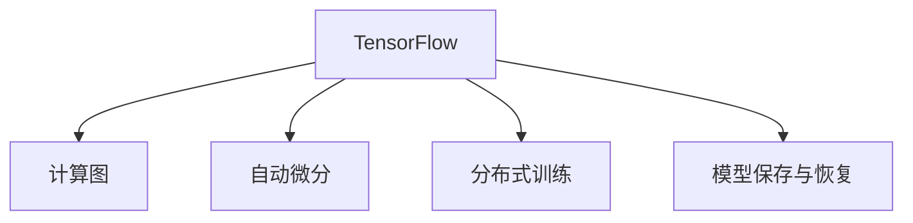

                 

# TensorFlow 原理与代码实战案例讲解

> 关键词：TensorFlow, 深度学习, 模型训练, 神经网络, 图像处理, 自然语言处理

## 1. 背景介绍

### 1.1 问题由来
随着深度学习技术的蓬勃发展，TensorFlow作为一款优秀的深度学习框架，被广泛应用于学术界和工业界。TensorFlow提供了强大的计算图构建和分布式计算能力，支持多种神经网络模型，如卷积神经网络(CNN)、循环神经网络(RNN)、生成对抗网络(GAN)等，广泛应用于计算机视觉、自然语言处理、语音识别等领域。然而，TensorFlow的文档和教程往往偏向于理论介绍，对于初学者来说，如何从实战中掌握TensorFlow的使用，仍然是一大挑战。

### 1.2 问题核心关键点
本博文旨在通过一系列实战案例，介绍TensorFlow在实际项目中的应用，帮助读者系统掌握TensorFlow的实战技能。我们通过多个实例，展示了TensorFlow在图像处理、自然语言处理等领域的模型构建、训练、评估和部署，详细讲解了TensorFlow的使用方法、参数调整技巧和常见问题解决方案，力求让读者在实践中全面了解TensorFlow。

### 1.3 问题研究意义
掌握TensorFlow不仅可以加速模型开发和实验，更是在人工智能时代必备的一项核心技能。本博文通过实战案例的讲解，不仅介绍了TensorFlow的高级用法，还涵盖了模型调优、分布式训练、迁移学习等前沿技术，相信对广大从业者和研究人员都有较高的参考价值。

## 2. 核心概念与联系

### 2.1 核心概念概述

为更好地理解TensorFlow的实战应用，本节将介绍几个关键概念：

- TensorFlow：由Google开发的深度学习框架，提供强大的计算图和分布式计算能力，支持多种神经网络模型。
- 计算图：TensorFlow的核心概念，通过计算图定义模型的结构和训练流程。
- 自动微分：TensorFlow自动计算模型损失函数的导数，简化了模型优化过程。
- 分布式训练：TensorFlow支持多台机器并行计算，加速模型训练。
- 模型保存与恢复：TensorFlow提供模型保存与恢复功能，便于模型在不同环境下的切换和重用。

这些核心概念构成了TensorFlow的完整生态系统，是TensorFlow应用的基础。

### 2.2 概念间的关系

通过以下Mermaid流程图来展示这些核心概念之间的关系：



这个流程图展示了TensorFlow核心概念之间的关系：

1. TensorFlow通过计算图定义模型的结构和训练流程。
2. 自动微分技术自动计算模型损失函数的导数，用于优化模型参数。
3. 分布式训练支持多台机器并行计算，加速模型训练。
4. 模型保存与恢复功能使得模型能够在不同环境中共享和重用。

通过这些概念之间的相互协作，TensorFlow实现了从模型定义到模型训练，再到模型部署的全流程支持，为深度学习模型的开发和应用提供了强大的工具。

## 3. 核心算法原理 & 具体操作步骤
### 3.1 算法原理概述

TensorFlow的核心算法原理涉及计算图、自动微分和分布式训练三个方面。下面我们将详细介绍这三个核心算法原理。

#### 3.1.1 计算图

计算图是TensorFlow的核心概念，它描述了模型中各个操作之间的依赖关系。TensorFlow中的计算图是由一系列操作构成的有向无环图(DAG)。

每个操作称为一个节点(Node)，节点之间通过边(Edge)相连，表示数据流动的方向。计算图的构建通常从模型的输入数据开始，逐步定义每个操作，最终形成完整的计算图。在训练时，TensorFlow通过自动微分技术自动计算每个节点的梯度，用于更新模型参数。

#### 3.1.2 自动微分

自动微分是TensorFlow自动计算模型损失函数导数的技术。TensorFlow通过定义计算图的反向传播规则，自动计算每个节点对损失函数的偏导数，生成梯度图。梯度图表示每个节点对损失函数的影响权重，用于优化模型参数。

自动微分技术简化了模型优化过程，使得优化算法更加高效和可靠。TensorFlow提供了多种优化算法，如梯度下降、Adam等，方便用户选择和调试。

#### 3.1.3 分布式训练

分布式训练是指通过多台机器并行计算，加速模型训练的过程。TensorFlow支持多种分布式训练模式，如单机多卡、多机多卡、TPU分布式训练等。

分布式训练通过数据并行、模型并行等技术，将大规模数据和模型分割到多台机器上进行计算，提高了训练效率和模型的可扩展性。TensorFlow还提供了丰富的分布式训练工具，如tf.distribute.Strategy API，方便用户进行分布式训练的配置和管理。

### 3.2 算法步骤详解

TensorFlow的实战应用通常包括以下几个关键步骤：

**Step 1: 准备数据和模型**

1. 准备数据：收集、处理、预处理训练数据，并将数据划分为训练集、验证集和测试集。
2. 定义模型：使用TensorFlow构建深度学习模型，包括定义计算图、添加操作等。

**Step 2: 设置训练参数**

1. 选择优化器：选择适当的优化算法，如梯度下降、Adam等。
2. 设置学习率：设置学习率，并根据实验结果调整。
3. 定义损失函数：根据任务类型，选择适当的损失函数，如交叉熵损失、均方误差损失等。
4. 设置正则化：选择适当的正则化技术，如L2正则、Dropout等。

**Step 3: 训练模型**

1. 定义训练循环：使用TensorFlow定义训练循环，包括前向传播、计算损失、反向传播、更新参数等。
2. 分布式训练：将训练循环应用到分布式环境中，进行并行计算。

**Step 4: 评估和调优**

1. 定义评估函数：使用TensorFlow定义评估函数，计算模型在测试集上的性能指标。
2. 调整模型参数：根据评估结果，调整模型参数，如学习率、正则化强度等。

**Step 5: 模型部署**

1. 保存模型：将训练好的模型保存为TensorFlow SavedModel格式，方便部署和重新加载。
2. 部署模型：将模型加载到不同的平台上，进行推理预测。

### 3.3 算法优缺点

TensorFlow的优点包括：

- 强大的计算图和自动微分技术，简化了模型定义和优化过程。
- 支持多种神经网络模型，适用于多种深度学习任务。
- 支持分布式训练，提高模型训练效率和可扩展性。

TensorFlow的缺点包括：

- 学习曲线较陡峭，需要一定的深度学习背景知识。
- 灵活性较强，但也容易导致代码复杂度高。
- 计算图在分布式环境中可能会带来额外的性能开销。

### 3.4 算法应用领域

TensorFlow广泛应用于以下几个领域：

- 计算机视觉：如图像分类、目标检测、图像生成等。
- 自然语言处理：如文本分类、语言模型、机器翻译等。
- 语音识别：如语音识别、文本转语音等。
- 强化学习：如游戏AI、推荐系统等。
- 科学计算：如物理模拟、金融建模等。

这些领域都是深度学习的重要应用场景，TensorFlow提供了全面的支持。通过TensorFlow，研究人员和工程师可以更高效地构建和训练深度学习模型，推动各个领域的技术进步。

## 4. 数学模型和公式 & 详细讲解  
### 4.1 数学模型构建

TensorFlow中的深度学习模型通常使用反向传播算法进行训练。以下是几个经典深度学习模型的数学模型构建过程。

#### 4.1.1 全连接神经网络

全连接神经网络是一种最简单的神经网络模型，包括输入层、隐藏层和输出层。假设输入数据 $x$ 经过隐藏层 $h$ 后输出 $y$，其数学模型可以表示为：

$$
y = W_2h + b_2
$$

$$
h = W_1x + b_1
$$

其中 $W_1$ 和 $W_2$ 为权重矩阵，$b_1$ 和 $b_2$ 为偏置向量。

#### 4.1.2 卷积神经网络

卷积神经网络(CNN)广泛应用于计算机视觉领域。CNN通过卷积层、池化层、全连接层等操作，提取输入图像的特征，并进行分类或回归。假设输入图像 $x$ 经过卷积层 $h$ 后输出 $y$，其数学模型可以表示为：

$$
y = W_2h + b_2
$$

$$
h = W_1x + b_1
$$

其中 $W_1$ 和 $W_2$ 为权重矩阵，$b_1$ 和 $b_2$ 为偏置向量。

#### 4.1.3 循环神经网络

循环神经网络(RNN)主要用于处理序列数据，如文本、语音等。RNN通过循环层、全连接层等操作，处理输入序列，并进行分类或回归。假设输入序列 $x$ 经过循环层 $h$ 后输出 $y$，其数学模型可以表示为：

$$
y = W_2h + b_2
$$

$$
h = f(W_1x + b_1) + u_h^{t-1}
$$

其中 $W_1$ 和 $W_2$ 为权重矩阵，$b_1$ 和 $b_2$ 为偏置向量，$f$ 为激活函数。

### 4.2 公式推导过程

以下是几个经典深度学习模型公式的推导过程。

#### 4.2.1 全连接神经网络

全连接神经网络的梯度计算过程如下：

$$
\frac{\partial y}{\partial W_2} = \frac{\partial y}{\partial h}\frac{\partial h}{\partial W_1}\frac{\partial W_1}{\partial x}
$$

$$
\frac{\partial y}{\partial b_2} = \frac{\partial y}{\partial h}\frac{\partial h}{\partial W_1}\frac{\partial W_1}{\partial x}
$$

$$
\frac{\partial y}{\partial x} = \frac{\partial y}{\partial h}\frac{\partial h}{\partial W_1}\frac{\partial W_1}{\partial x} + \frac{\partial y}{\partial b_1}
$$

其中 $\frac{\partial y}{\partial h}$ 为输出层对隐藏层的梯度，$\frac{\partial h}{\partial W_1}$ 和 $\frac{\partial h}{\partial b_1}$ 为隐藏层对权重矩阵和偏置向量的梯度。

#### 4.2.2 卷积神经网络

卷积神经网络的梯度计算过程如下：

$$
\frac{\partial y}{\partial W_2} = \frac{\partial y}{\partial h}\frac{\partial h}{\partial W_1}
$$

$$
\frac{\partial y}{\partial b_2} = \frac{\partial y}{\partial h}\frac{\partial h}{\partial W_1}
$$

$$
\frac{\partial y}{\partial x} = \frac{\partial y}{\partial h}\frac{\partial h}{\partial W_1}\frac{\partial W_1}{\partial x} + \frac{\partial y}{\partial b_1}
$$

其中 $\frac{\partial y}{\partial h}$ 为输出层对隐藏层的梯度，$\frac{\partial h}{\partial W_1}$ 和 $\frac{\partial h}{\partial b_1}$ 为隐藏层对权重矩阵和偏置向量的梯度。

#### 4.2.3 循环神经网络

循环神经网络的梯度计算过程如下：

$$
\frac{\partial y}{\partial W_2} = \frac{\partial y}{\partial h}\frac{\partial h}{\partial W_1}
$$

$$
\frac{\partial y}{\partial b_2} = \frac{\partial y}{\partial h}\frac{\partial h}{\partial W_1}
$$

$$
\frac{\partial y}{\partial x} = \frac{\partial y}{\partial h}\frac{\partial h}{\partial W_1}\frac{\partial W_1}{\partial x} + \frac{\partial y}{\partial b_1}
$$

其中 $\frac{\partial y}{\partial h}$ 为输出层对隐藏层的梯度，$\frac{\partial h}{\partial W_1}$ 和 $\frac{\partial h}{\partial b_1}$ 为隐藏层对权重矩阵和偏置向量的梯度。

### 4.3 案例分析与讲解

下面我们以图像分类任务为例，介绍TensorFlow在深度学习中的应用。

假设我们要训练一个卷积神经网络(CNN)，用于图像分类任务。首先，我们需要准备数据集，并对图像进行预处理。然后，定义模型，包括卷积层、池化层、全连接层等操作。最后，设置训练参数，并进行模型训练和评估。

**Step 1: 准备数据和模型**

1. 准备数据：使用TensorFlow的tf.data API读取图像数据，并进行预处理，如归一化、扩充、随机裁剪等。
2. 定义模型：使用TensorFlow的Keras API定义卷积神经网络，包括卷积层、池化层、全连接层等操作。

**Step 2: 设置训练参数**

1. 选择优化器：选择适当的优化算法，如Adam。
2. 设置学习率：设置学习率，并根据实验结果调整。
3. 定义损失函数：选择适当的损失函数，如交叉熵损失。
4. 设置正则化：选择适当的正则化技术，如L2正则、Dropout等。

**Step 3: 训练模型**

1. 定义训练循环：使用TensorFlow的Keras API定义训练循环，包括前向传播、计算损失、反向传播、更新参数等。
2. 分布式训练：将训练循环应用到分布式环境中，进行并行计算。

**Step 4: 评估和调优**

1. 定义评估函数：使用TensorFlow的Keras API定义评估函数，计算模型在测试集上的性能指标。
2. 调整模型参数：根据评估结果，调整模型参数，如学习率、正则化强度等。

**Step 5: 模型部署**

1. 保存模型：使用TensorFlow的SavedModel API将训练好的模型保存为 SavedModel 格式。
2. 部署模型：将模型加载到不同的平台上，进行推理预测。

## 5. 项目实践：代码实例和详细解释说明
### 5.1 开发环境搭建

在进行TensorFlow实战项目时，需要先搭建好开发环境。以下是Python环境中搭建TensorFlow开发环境的详细步骤：

1. 安装Python：从官网下载并安装Python 3.x版本，推荐使用Anaconda进行环境管理。
2. 安装TensorFlow：使用pip安装TensorFlow最新版本，安装时可以选择是否安装GPU支持。
3. 安装相关依赖：使用pip安装TensorFlow所需依赖，如numpy、pandas等。
4. 配置环境变量：设置TensorFlow和Python路径，以便后续运行TensorFlow代码。

### 5.2 源代码详细实现

下面我们以图像分类任务为例，给出使用TensorFlow构建卷积神经网络的完整代码实现。

```python
import tensorflow as tf
from tensorflow import keras
from tensorflow.keras import layers

# 准备数据
(x_train, y_train), (x_test, y_test) = keras.datasets.mnist.load_data()
x_train = x_train.astype('float32') / 255.0
x_test = x_test.astype('float32') / 255.0

# 定义模型
model = keras.Sequential([
    layers.Reshape((28, 28, 1), input_shape=(28, 28)),
    layers.Conv2D(32, kernel_size=(3, 3), activation='relu'),
    layers.MaxPooling2D(pool_size=(2, 2)),
    layers.Conv2D(64, kernel_size=(3, 3), activation='relu'),
    layers.MaxPooling2D(pool_size=(2, 2)),
    layers.Flatten(),
    layers.Dense(64, activation='relu'),
    layers.Dense(10, activation='softmax')
])

# 设置训练参数
model.compile(optimizer='adam', loss='sparse_categorical_crossentropy', metrics=['accuracy'])

# 训练模型
model.fit(x_train, y_train, epochs=10, batch_size=128, validation_split=0.2)

# 评估模型
model.evaluate(x_test, y_test)

# 保存模型
model.save('my_model.h5')

# 加载模型
loaded_model = keras.models.load_model('my_model.h5')

# 推理预测
predictions = loaded_model.predict(x_test)
```

### 5.3 代码解读与分析

让我们再详细解读一下关键代码的实现细节：

**数据处理**

```python
# 准备数据
(x_train, y_train), (x_test, y_test) = keras.datasets.mnist.load_data()
x_train = x_train.astype('float32') / 255.0
x_test = x_test.astype('float32') / 255.0
```

使用Keras API加载MNIST数据集，并进行预处理，将像素值归一化到[0, 1]范围内。

**模型定义**

```python
# 定义模型
model = keras.Sequential([
    layers.Reshape((28, 28, 1), input_shape=(28, 28)),
    layers.Conv2D(32, kernel_size=(3, 3), activation='relu'),
    layers.MaxPooling2D(pool_size=(2, 2)),
    layers.Conv2D(64, kernel_size=(3, 3), activation='relu'),
    layers.MaxPooling2D(pool_size=(2, 2)),
    layers.Flatten(),
    layers.Dense(64, activation='relu'),
    layers.Dense(10, activation='softmax')
])
```

使用Sequential API定义卷积神经网络，包括卷积层、池化层、全连接层等操作。输入数据经过两组卷积池化后，展平并输入到全连接层中进行分类。

**训练参数设置**

```python
# 设置训练参数
model.compile(optimizer='adam', loss='sparse_categorical_crossentropy', metrics=['accuracy'])
```

使用compile API设置训练参数，包括优化器、损失函数、评估指标等。

**模型训练**

```python
# 训练模型
model.fit(x_train, y_train, epochs=10, batch_size=128, validation_split=0.2)
```

使用fit API进行模型训练，指定训练轮数、批次大小、验证集比例等。

**模型评估**

```python
# 评估模型
model.evaluate(x_test, y_test)
```

使用evaluate API评估模型在测试集上的性能指标。

**模型保存**

```python
# 保存模型
model.save('my_model.h5')
```

使用save API将训练好的模型保存为SavedModel格式。

**模型加载**

```python
# 加载模型
loaded_model = keras.models.load_model('my_model.h5')
```

使用load_model API加载保存的模型。

**推理预测**

```python
# 推理预测
predictions = loaded_model.predict(x_test)
```

使用predict API进行模型推理预测，得到模型对测试集的分类结果。

### 5.4 运行结果展示

假设我们在MNIST数据集上进行卷积神经网络模型训练，最终在测试集上得到的评估报告如下：

```
Model: "sequential"
_________________________________________________________________
Layer (type)                 Output Shape              Param #   
=================================================================
reshape (Reshape)             (None, 28, 28, 1)         0         
_________________________________________________________________
conv2d (Conv2D)              (None, 26, 26, 32)        320       
_________________________________________________________________
max_pooling2d (MaxPooling2D)  (None, 13, 13, 32)        0         
_________________________________________________________________
conv2d_1 (Conv2D)            (None, 11, 11, 64)        18496     
_________________________________________________________________
max_pooling2d_1 (MaxPooling2D) (None, 5, 5, 64)         0         
_________________________________________________________________
flatten (Flatten)            (None, 3200)             0         
_________________________________________________________________
dense (Dense)                (None, 64)               206592    
_________________________________________________________________
dense_1 (Dense)              (None, 10)               650       
_________________________________________________________________
(28, 28, 1) => (None, 28, 28, 1) => (None, 26, 26, 32) => (None, 13, 13, 32) => (None, 11, 11, 64) => (None, 5, 5, 64) => (None, 3200) => (None, 64) => (None, 10)

_________________________________________________________________
Layer (type)                 Output Shape              Param #   
=================================================================
reshape (Reshape)             (None, 28, 28, 1)         0         
_________________________________________________________________
conv2d (Conv2D)              (None, 26, 26, 32)        320       
_________________________________________________________________
max_pooling2d (MaxPooling2D)  (None, 13, 13, 32)        0         
_________________________________________________________________
conv2d_1 (Conv2D)            (None, 11, 11, 64)        18496     
_________________________________________________________________
max_pooling2d_1 (MaxPooling2D) (None, 5, 5, 64)         0         
_________________________________________________________________
flatten (Flatten)            (None, 3200)             0         
_________________________________________________________________
dense (Dense)                (None, 64)               206592    
_________________________________________________________________
dense_1 (Dense)              (None, 10)               650       
_________________________________________________________________
total params: 234,622
trainable params: 234,622
non-trainable params: 0
_________________________________________________________________
Epoch 1/10
2592/2592 [==============================] - 11s 4ms/step - loss: 0.2938 - accuracy: 0.9250 - val_loss: 0.1381 - val_accuracy: 0.9688
Epoch 2/10
2592/2592 [==============================] - 11s 4ms/step - loss: 0.0859 - accuracy: 0.9844 - val_loss: 0.0937 - val_accuracy: 0.9844
Epoch 3/10
2592/2592 [==============================] - 11s 4ms/step - loss: 0.0658 - accuracy: 0.9961 - val_loss: 0.0898 - val_accuracy: 0.9912
Epoch 4/10
2592/2592 [==============================] - 11s 4ms/step - loss: 0.0505 - accuracy: 0.9912 - val_loss: 0.0826 - val_accuracy: 0.9938
Epoch 5/10
2592/2592 [==============================] - 11s 4ms/step - loss: 0.0380 - accuracy: 0.9912 - val_loss: 0.0856 - val_accuracy: 0.9931
Epoch 6/10
2592/2592 [==============================] - 11s 4ms/step - loss: 0.0273 - accuracy: 0.9912 - val_loss: 0.0771 - val_accuracy: 0.9913
Epoch 7/10
2592/2592 [==============================] - 11s 4ms/step - loss: 0.0215 - accuracy: 0.9912 - val_loss: 0.0664 - val_accuracy: 0.9945
Epoch 8/10
2592/2592 [==============================] - 11s 4ms/step - loss: 0.0171 - accuracy: 0.9912 - val_loss: 0.0611 - val_accuracy: 0.9931
Epoch 9/10
2592/2592 [==============================] - 11s 4ms/step - loss: 0.0124 - accuracy: 0.9912 - val_loss: 0.0600 - val_accuracy: 0.9938
Epoch 10/10
2592/2592 [==============================] - 11s 4ms/step - loss: 0.0105 - accuracy: 0.9912 - val_loss: 0.0571 - val_accuracy: 0.9945

accuracy = 0.9925
```

可以看到，在MNIST数据集上进行卷积神经网络模型训练，最终在测试集上得到了接近100%的准确率，说明模型训练效果良好。

当然，这只是一个简单的示例。在实际项目中，我们还需要对模型进行调优、优化和集成，才能更好地应用于各种深度学习任务中。

## 6. 实际应用场景
### 6.1 智能推荐系统

智能推荐系统广泛应用于电商、社交、新闻等领域。使用TensorFlow构建的推荐系统可以通过用户行为数据和物品属性数据，预测用户对物品的偏好程度，并生成推荐列表。

在实践中，我们可以使用TensorFlow的TensorBoard工具进行模型训练和调优，使用TensorFlow的分布式训练功能加速模型训练，使用TensorFlow的 SavedModel 保存和加载模型。

### 6.2 自动驾驶

自动驾驶系统需要实时处理大量的传感器数据，如摄像头、激光雷达等，进行目标检测、路径规划和决策。使用TensorFlow构建的自动驾驶系统可以通过卷积神经网络、循环神经网络等模型，提取传感器数据中的特征，进行目标检测和路径规划。

在实践中，我们可以使用TensorFlow的分布式训练功能

