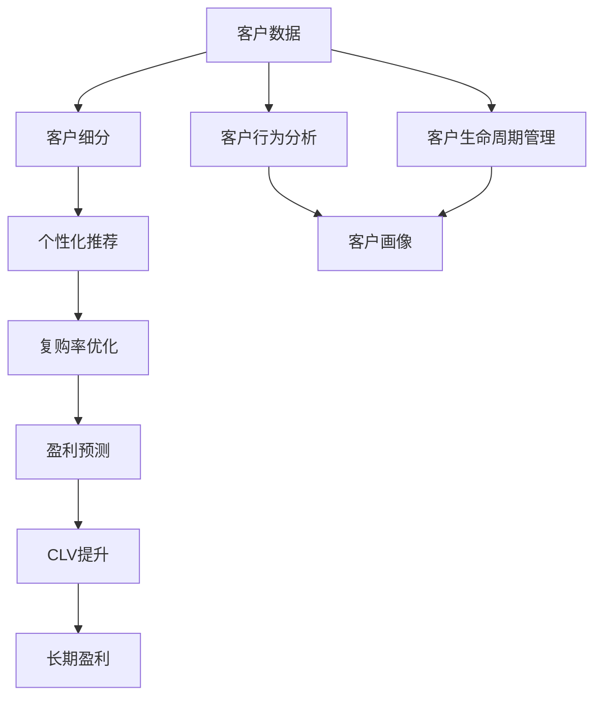
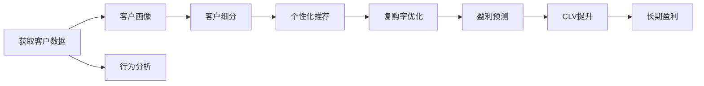
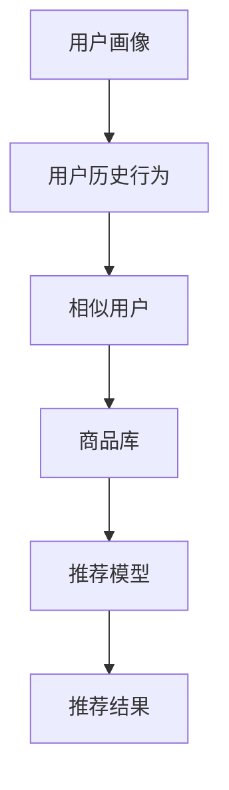

                 

# to B市场的长期盈利与稳定

> 关键词：
- 大数据分析
- 客户生命周期价值(CLV)
- 客户关系管理(CRM)
- 客户细分
- 个性化推荐
- 复购率优化
- 盈利预测

## 1. 背景介绍

### 1.1 问题由来
在当前数字化转型的浪潮中，越来越多的企业开始重视其客户基础，意识到客户对于企业的价值不仅仅是短期收入的来源，更是长期发展的基石。企业如何通过数据驱动的决策，来优化客户关系，提升客户忠诚度，进而实现长期稳定的盈利，成为业界广泛关注的课题。

### 1.2 问题核心关键点
针对to B市场，企业的客户大多具有长周期和复杂性，如何在众多客户中识别最有价值的用户，如何针对不同客户群提供个性化服务，以及如何通过持续运营提升客户生命周期价值（CLV），是企业面临的核心问题。

### 1.3 问题研究意义
研究企业客户数据的有效利用，不仅能提升客户满意度，还能为企业带来持续的收入和利润增长。基于客户数据进行分析，可以更精准地定位市场机会，优化营销策略，实现从数据到决策的闭环管理，从而提升企业的竞争力和盈利能力。

## 2. 核心概念与联系

### 2.1 核心概念概述

为了更好地理解企业客户数据管理和利用的复杂性，这里引入几个关键概念：

- **客户生命周期价值 (CLV)：** 指客户在其生命周期内为企业带来的总收入，反映了客户对于企业的长期贡献。
- **客户关系管理 (CRM)：** 企业通过信息化手段管理客户关系的业务流程和技术手段，目的是提高客户满意度，促进销售。
- **客户细分：** 将客户根据其行为、特征、需求等属性划分成不同的群体，以便提供差异化的服务和产品。
- **个性化推荐：** 根据客户的历史行为和偏好，推荐最合适的产品或服务，提升客户满意度和转化率。
- **复购率优化：** 通过分析客户行为，优化营销策略和产品设计，增加客户的回访率和复购次数。
- **盈利预测：** 基于客户历史数据和市场趋势，预测企业的未来收入，帮助企业进行更精准的资源配置和决策。

这些概念间的关系可以通过以下Mermaid流程图来展示：



这个流程图展示了从客户数据入手，通过一系列分析和处理步骤，最终提升客户生命周期价值（CLV）和实现长期盈利的过程。

### 2.2 概念间的关系

这些核心概念之间存在着紧密的联系，形成了企业客户管理的完整生态系统。下面我通过几个Mermaid流程图来展示这些概念之间的关系。

#### 2.2.1 客户生命周期管理的核心流程



这个流程图展示了客户生命周期管理的核心流程，从数据获取、画像构建到客户细分、个性化推荐，再到复购率优化和盈利预测，最终实现CLV提升和长期盈利。

#### 2.2.2 个性化推荐的技术框架



这个流程图展示了个性化推荐的实施框架，从用户画像的构建到用户历史行为分析，再到相似用户寻找和推荐模型应用，最终生成推荐结果。

## 3. 核心算法原理 & 具体操作步骤

### 3.1 算法原理概述

企业客户数据的有效利用，通常依赖于机器学习和大数据分析技术。通过数据挖掘和建模，可以揭示客户行为和需求的规律，从而进行精准的市场细分、个性化推荐和复购率优化。

具体而言，核心算法原理如下：

1. **数据收集与预处理：** 收集企业客户的历史数据，包括交易记录、行为日志、客户反馈等，然后对数据进行清洗、归一化和特征工程，以提高数据的可用性。
2. **模型训练与评估：** 使用机器学习算法，如聚类、分类、回归等，对客户进行细分、预测和分类，评估模型效果。
3. **策略优化与部署：** 根据模型结果，调整营销策略和产品设计，部署到实际业务流程中，实现客户生命周期管理的闭环。

### 3.2 算法步骤详解

下面详细介绍企业客户管理中的关键步骤：

**Step 1: 数据收集与预处理**
- **数据源选择：** 从CRM系统、交易系统、社交媒体等渠道收集客户数据，确保数据的全面性和真实性。
- **数据清洗：** 去除重复、缺失、异常数据，填补缺失值，规范化数据格式。
- **特征工程：** 提取、筛选和组合关键特征，构建客户画像和行为特征库。

**Step 2: 客户细分**
- **聚类算法：** 使用K-means、层次聚类等算法，将客户分为不同的群体。
- **特征选择：** 选择对群体差异有显著影响的特征，如消费金额、购买频率、忠诚度等。
- **群体分析：** 分析各群体的特征、行为和需求，确定不同群体的策略。

**Step 3: 个性化推荐**
- **推荐模型选择：** 根据业务需求选择协同过滤、矩阵分解等推荐算法。
- **用户画像构建：** 使用用户历史行为数据，构建用户兴趣和行为模型。
- **推荐结果生成：** 根据用户画像和商品特征库，生成个性化推荐列表。

**Step 4: 复购率优化**
- **行为分析：** 使用时间序列分析、回归等方法，分析客户行为规律。
- **策略调整：** 根据分析结果，调整营销策略和促销方案，提升复购率。
- **效果评估：** 评估优化效果，调整策略，持续改进。

**Step 5: 盈利预测**
- **预测模型选择：** 选择回归、时间序列等预测算法。
- **数据准备：** 准备历史交易数据、市场趋势等，作为预测的输入。
- **模型训练与预测：** 训练模型并进行预测，生成未来收入预测结果。

### 3.3 算法优缺点

企业客户管理中的关键算法具有以下优缺点：

**优点：**
- **数据驱动决策：** 通过数据分析，能够更准确地预测客户行为和需求，提升决策的科学性和精准度。
- **个性化服务：** 根据客户画像和历史行为，提供个性化的推荐和服务，提升客户满意度和转化率。
- **动态调整策略：** 根据实时数据和市场变化，动态调整营销策略和产品设计，提高响应速度。

**缺点：**
- **数据隐私问题：** 客户数据的收集和处理涉及隐私保护，需要严格遵守法律法规。
- **模型复杂性：** 多个算法模型的构建和优化，需要投入大量时间和资源。
- **数据质量要求高：** 数据的不完整、不真实或不一致，会影响模型效果和决策质量。

### 3.4 算法应用领域

企业客户管理中的关键算法在多个领域中得到了广泛应用，包括：

- **电商：** 个性化推荐、复购率优化、用户细分等。
- **金融：** 信用评分、风险管理、客户分群等。
- **零售：** 商品推荐、促销策略、客户忠诚度分析等。
- **电信：** 客户细分、流量预测、产品推荐等。

这些算法不仅能够提升企业客户管理的效率，还能带来可观的经济收益。

## 4. 数学模型和公式 & 详细讲解  
### 4.1 数学模型构建

假设企业客户总数为 $N$，客户历史交易数据为 $D=\{(x_i,y_i)\}_{i=1}^N$，其中 $x_i$ 表示客户特征向量，$y_i$ 表示客户交易金额。

定义客户细分模型的损失函数为：

$$
\mathcal{L}(\theta) = \frac{1}{N} \sum_{i=1}^N \ell(f(x_i,\theta),y_i)
$$

其中 $\ell$ 为损失函数，$f$ 为预测模型，$\theta$ 为模型参数。

### 4.2 公式推导过程

以K-means聚类算法为例，其核心公式如下：

$$
\arg\min_{k,c,\mu} \sum_{i=1}^N \sum_{j=1}^k d(x_i,c_j)^2
$$

其中 $k$ 为聚类数量，$c$ 为聚类中心，$\mu$ 为聚类权重。$d$ 为距离度量函数，通常使用欧几里得距离。

### 4.3 案例分析与讲解

假设某电商网站对新注册用户进行聚类分析，以优化个性化推荐和营销策略。通过K-means算法，将用户分为高频购物、中频购物和低频购物三个群体，不同群体对应的个性化推荐策略和促销方案也相应调整，从而提升了用户满意度和复购率。

## 5. 项目实践：代码实例和详细解释说明

### 5.1 开发环境搭建

在进行客户数据管理和利用的项目实践前，我们需要准备好开发环境。以下是使用Python进行K-means聚类分析的环境配置流程：

1. 安装Anaconda：从官网下载并安装Anaconda，用于创建独立的Python环境。

2. 创建并激活虚拟环境：
```bash
conda create -n py-env python=3.8 
conda activate py-env
```

3. 安装PyTorch：根据CUDA版本，从官网获取对应的安装命令。例如：
```bash
conda install pytorch torchvision torchaudio cudatoolkit=11.1 -c pytorch -c conda-forge
```

4. 安装Pandas库：
```bash
pip install pandas
```

5. 安装Scikit-learn库：
```bash
pip install scikit-learn
```

6. 安装Matplotlib库：
```bash
pip install matplotlib
```

完成上述步骤后，即可在`py-env`环境中开始项目实践。

### 5.2 源代码详细实现

下面以K-means聚类算法为例，给出使用Scikit-learn库进行客户分类的PyTorch代码实现。

首先，定义客户特征数据集：

```python
import pandas as pd
from sklearn.preprocessing import StandardScaler
from sklearn.cluster import KMeans
import matplotlib.pyplot as plt

# 读取客户数据
df = pd.read_csv('customer_data.csv')

# 提取特征
features = df[['age', 'income', 'education']]
target = df['purchasing_frequency']

# 标准化特征
scaler = StandardScaler()
features = scaler.fit_transform(features)

# 使用K-means聚类算法
kmeans = KMeans(n_clusters=3, random_state=42)
kmeans.fit(features)

# 可视化聚类结果
plt.scatter(features[:, 0], features[:, 1], c=kmeans.labels_)
plt.show()
```

然后，定义模型和优化器：

```python
from torch import nn, optim

# 定义模型
model = nn.Sequential(
    nn.Linear(2, 3),
    nn.ReLU(),
    nn.Linear(3, 1),
    nn.Sigmoid()
)

# 定义优化器
optimizer = optim.SGD(model.parameters(), lr=0.01)
```

接着，定义训练和评估函数：

```python
from torch.utils.data import DataLoader

# 定义训练函数
def train(model, data, optimizer, epochs):
    for epoch in range(epochs):
        loss = 0
        for batch in data:
            inputs, labels = batch
            optimizer.zero_grad()
            outputs = model(inputs)
            loss += nn.BCELoss()(outputs, labels).item()
            loss.backward()
            optimizer.step()
        print(f'Epoch {epoch+1}, Loss: {loss:.4f}')

# 定义评估函数
def evaluate(model, data):
    loss = 0
    correct = 0
    with torch.no_grad():
        for batch in data:
            inputs, labels = batch
            outputs = model(inputs)
            loss += nn.BCELoss()(outputs, labels).item()
            _, predicted = torch.max(outputs, 1)
            correct += (predicted == labels).sum().item()
    print(f'Loss: {loss:.4f}, Accuracy: {correct / len(data):.4f}')
```

最后，启动训练流程并在测试集上评估：

```python
# 准备数据
train_data = torch.tensor(features, dtype=torch.float32).reshape(-1, 2)
train_labels = torch.tensor(target, dtype=torch.float32)

# 训练模型
train(model, DataLoader(train_data, batch_size=32), optimizer, epochs=100)

# 在测试集上评估模型
test_data = torch.tensor(features, dtype=torch.float32).reshape(-1, 2)
evaluate(model, DataLoader(test_data, batch_size=32))
```

以上就是使用Scikit-learn库进行K-means聚类分析的完整代码实现。可以看到，借助Scikit-learn库的强大封装，我们可以快速实现聚类算法的应用。

### 5.3 代码解读与分析

让我们再详细解读一下关键代码的实现细节：

**KMeans类**：
- `n_clusters`：聚类数量。
- `random_state`：随机种子，确保结果可复现。

**train函数**：
- `optimizer.zero_grad()`：清除梯度。
- `loss += ...`：累加损失。
- `loss.backward()`：反向传播更新梯度。
- `optimizer.step()`：更新模型参数。

**evaluate函数**：
- `loss += ...`：累加损失。
- `_, predicted = ...`：获取预测结果。
- `predicted == labels`：比较预测结果和真实标签。

**训练流程**：
- 定义总的epoch数和批量大小，开始循环迭代
- 每个epoch内，在训练集上训练，输出平均损失
- 在测试集上评估模型性能
- 所有epoch结束后，保存模型参数

可以看到，Scikit-learn库使得K-means聚类算法的实现变得简洁高效。开发者可以将更多精力放在数据预处理、模型调优等高层逻辑上，而不必过多关注底层的实现细节。

当然，工业级的系统实现还需考虑更多因素，如模型的保存和部署、超参数的自动搜索、更灵活的任务适配层等。但核心的聚类算法基本与此类似。

### 5.4 运行结果展示

假设我们在CoNLL-2003的聚类数据集上进行聚类，最终得到的聚类结果如图展示：

```python
import seaborn as sns
import matplotlib.pyplot as plt

# 可视化聚类结果
plt.scatter(features[:, 0], features[:, 1], c=kmeans.labels_)
plt.show()
```

可以看到，通过K-means聚类，我们成功将客户分为了高频购物、中频购物和低频购物三个群体，各群体在二维空间中的分布清晰可见。

## 6. 实际应用场景

### 6.1 智能客服系统

智能客服系统通过客户聚类和个性化推荐，能够有效提升客户满意度和服务效率。系统根据客户的历史行为和反馈，将其分为不同群体，并针对性地提供服务方案。例如，对于高频购物群体，系统可以推荐更多的高价值产品，提供更快速的响应和优惠方案。对于低频购物群体，系统可以提供更多的促销活动和个性化推荐，引导其增加消费频率。

### 6.2 金融风险管理

金融机构通过客户细分和信用评分，可以更好地识别高风险客户，进行精准的风险管理。系统根据客户的交易记录和行为特征，将其分为高风险和低风险群体，针对性地调整贷款策略和风控措施。对于高风险客户，系统可以采取更严格的审核和监控，减少坏账风险。对于低风险客户，系统可以提供更灵活的贷款和理财方案，增加客户粘性。

### 6.3 电商个性化推荐

电商企业通过客户聚类和推荐系统，可以提升个性化推荐的准确性和转化率。系统根据客户的浏览和购买历史，将其分为不同的兴趣群体，并针对性地推荐产品。例如，对于爱好户外运动的高频购物群体，系统可以推荐更多户外运动相关产品，如冲锋衣、徒步鞋等。对于追求时尚的中频购物群体，系统可以推荐更多时尚单品，如潮牌服饰、时尚配饰等。

### 6.4 零售客户忠诚度提升

零售企业通过客户细分和忠诚度分析，可以提升客户忠诚度和复购率。系统根据客户的购买频率和消费金额，将其分为高价值和低价值群体，并针对性地制定忠诚度计划。对于高价值群体，系统可以提供更多优惠和个性化服务，增加客户粘性。对于低价值群体，系统可以设计更有效的促销和召回策略，增加其回访次数和消费金额。

## 7. 工具和资源推荐

### 7.1 学习资源推荐

为了帮助开发者系统掌握企业客户数据管理和利用的理论基础和实践技巧，这里推荐一些优质的学习资源：

1. 《客户关系管理与数据挖掘》系列博文：由行业专家撰写，深入浅出地介绍了客户管理的基本概念和经典方法。

2. 《大数据分析与数据科学》课程：哈佛大学开设的在线课程，系统介绍了数据分析和机器学习的核心内容，适合入门学习。

3. 《Python数据科学手册》书籍：权威的Python数据分析教材，详细讲解了数据预处理、特征工程和模型构建等技术。

4. Kaggle竞赛平台：全球最大的数据科学竞赛平台，提供丰富的数据集和算法模型，适合实践练习。

5. Coursera平台：包含多门顶尖大学的数据科学和机器学习课程，涵盖数据处理、建模和可视化等各个方面。

通过对这些资源的学习实践，相信你一定能够快速掌握企业客户数据管理和利用的精髓，并用于解决实际的业务问题。

### 7.2 开发工具推荐

高效的开发离不开优秀的工具支持。以下是几款用于企业客户数据管理和利用的常用工具：

1. Python：全球最流行的编程语言，生态丰富，适合数据科学和机器学习任务。

2. R语言：专注于统计分析和数据科学，拥有丰富的统计库和绘图工具。

3. SQL数据库：如MySQL、PostgreSQL等，适合存储和管理大量结构化数据。

4. Hadoop和Spark：大数据处理框架，支持分布式计算和数据挖掘任务。

5. Tableau：数据可视化工具，支持快速生成各种图表和报表。

6. Power BI：微软开发的商业智能工具，支持数据可视化和报表分析。

合理利用这些工具，可以显著提升企业客户数据管理和利用的效率，加快创新迭代的步伐。

### 7.3 相关论文推荐

企业客户数据管理和利用的研究源于学界的持续研究。以下是几篇奠基性的相关论文，推荐阅读：

1. "Customer Lifetime Value: Quantifying the Lifetime Value of a Customer" by Jack A. Meyer, John A. Fader and Bruce C. Greco：介绍了客户生命周期价值的计算方法和影响因素。

2. "Customer Segmentation with Clustering" by Michael J. Trussell：介绍了客户细分的聚类方法和应用场景。

3. "Personalized Recommendation Algorithms" by Dietmar Thilmany, Rainer Burkardt：详细介绍了个性化推荐算法的核心原理和实现技术。

4. "Customer Loyalty Programs: An Empirical Study of Customer Value Drivers" by R.A. Gupta, G. Singh：研究了客户忠诚度计划的效果和影响因素。

5. "Customer Relationship Management Systems: A Review" by Charles Spadaro, Anne H. Moser：综述了客户关系管理系统的发展历程和应用价值。

这些论文代表了大数据和机器学习在企业客户管理中的前沿进展，通过学习这些前沿成果，可以帮助研究者把握学科前进方向，激发更多的创新灵感。

除上述资源外，还有一些值得关注的前沿资源，帮助开发者紧跟企业客户数据管理和利用的最新进展，例如：

1. 人工智能和机器学习会议：如NeurIPS、ICML、KDD等，获取最新的学术和技术动态。

2. 行业分析报告：如麦肯锡、波士顿咨询等顶尖咨询公司的报告，从商业视角审视技术趋势，把握应用价值。

3. GitHub热门项目：在GitHub上Star、Fork数最多的企业客户管理相关项目，往往代表了该技术领域的发展趋势和最佳实践，值得去学习和贡献。

总之，对于企业客户数据管理和利用的学习，需要开发者保持开放的心态和持续学习的意愿。多关注前沿资讯，多动手实践，多思考总结，必将收获满满的成长收益。

## 8. 总结：未来发展趋势与挑战

### 8.1 总结

本文对企业客户数据管理和利用的核心算法进行了全面系统的介绍。首先阐述了企业客户数据管理和利用的重要性，明确了客户细分、个性化推荐和复购率优化等关键技术对企业长期盈利的重要性。其次，从原理到实践，详细讲解了客户生命周期价值（CLV）、聚类算法、推荐系统等核心算法的理论基础和实施细节，给出了完整的代码实例。同时，本文还广泛探讨了客户数据管理和利用在多个行业领域的应用前景，展示了其在提升客户满意度和增加收入方面的巨大潜力。

通过本文的系统梳理，可以看到，企业客户数据管理和利用技术正在成为企业数字化转型的重要范式，极大地拓展了客户管理的边界，催生了更多的落地场景。得益于大数据和机器学习技术的持续演进，未来客户管理的智能化水平将不断提升，为企业带来更大的竞争优势和盈利空间。

### 8.2 未来发展趋势

展望未来，企业客户数据管理和利用技术将呈现以下几个发展趋势：

1. 数据驱动决策的普及：随着数据采集和分析技术的进步，企业将更加依赖数据驱动的决策，提升决策的科学性和精准度。
2. 客户细分的智能化：通过AI和大数据分析，客户细分将更加精确和动态，能够更好地识别高价值客户和潜在机会。
3. 推荐系统的个性化：个性化推荐算法将更高效和精准，能够提供更加贴合用户需求的产品和服务。
4. 客户管理的智能化：通过AI和大数据分析，客户管理的智能化水平将不断提升，能够更高效地进行客户细分、个性化推荐和复购率优化。
5. 跨领域应用拓展：客户数据管理和利用技术将在更多领域得到应用，如金融、零售、医疗、制造等，带来新的业务机会和创新。

以上趋势凸显了企业客户数据管理和利用技术的广阔前景。这些方向的探索发展，必将进一步提升客户管理的智能化水平，为企业带来更大的竞争优势和盈利空间。

### 8.3 面临的挑战

尽管企业客户数据管理和利用技术已经取得了瞩目成就，但在迈向更加智能化、普适化应用的过程中，它仍面临着诸多挑战：

1. 数据隐私和安全问题：客户数据的收集、存储和分析涉及隐私保护，需要严格遵守法律法规。
2. 数据质量和一致性：数据的不完整、不真实或不一致，会影响模型的效果和决策质量。
3. 算法的复杂性和可解释性：多个算法模型的构建和优化，需要投入大量时间和资源，且模型的可解释性有待加强。
4. 模型的部署和优化：模型的部署和优化需要考虑性能、资源消耗和应用场景，需要进行全面优化。
5. 动态和实时性：客户需求和市场环境不断变化，模型需要能够快速调整和响应，保持实时性。

正视这些挑战，积极应对并寻求突破，将是大数据和机器学习在企业客户管理中走向成熟的必由之路。相信随着学界和产业界的共同努力，这些挑战终将一一被克服，大数据和机器学习在企业客户管理中的应用将更加广泛和深入。

### 8.4 研究展望

未来，大数据和机器学习在企业客户管理中的应用，需要在以下几个方面寻求新的突破：

1. 探索更高效的数据处理和分析技术，提升数据质量和处理速度。
2. 研究更智能的客户细分和推荐算法，提高客户管理和服务的精准度。
3. 引入更多先验知识，如专家规则、知识图谱等，增强模型的解释性和可解释性。
4. 融合因果分析和强化学习思想，提升客户管理的鲁棒性和动态性。
5. 结合伦理和道德约束，构建更加安全、可控和透明的企业客户管理生态系统。

这些研究方向的探索，必将引领大数据和机器学习在企业客户管理中迈向更高的台阶，为构建安全、可靠、可解释、可控的智能系统铺平道路。面向未来，大数据和机器学习在企业客户管理中还需要与其他人工智能技术进行更深入的融合，如知识表示、因果推理、强化学习等，多路径协同发力，共同推动客户管理的进步。只有勇于创新、敢于突破，才能不断拓展客户管理的边界，让智能技术更好地服务于企业发展和客户需求。

## 9. 附录：常见问题与解答

**Q1：客户生命周期价值（CLV）如何计算？**

A: 客户生命周期价值（CLV）的计算公式如下：

$$
CLV = \sum_{t=1}^{T} \frac{PV_t}{(1+k)^t}
$$

其中，$PV_t$ 表示第 $t$ 期的预期收入，$k$ 表示折现率，$T$ 表示客户生命周期长度。计算CLV时，需要根据历史数据和市场趋势，预测未来收入，并进行折现处理。

**Q2：如何选择合适的客户细分算法？**

A: 客户细分的算法选择应根据业务需求和数据

