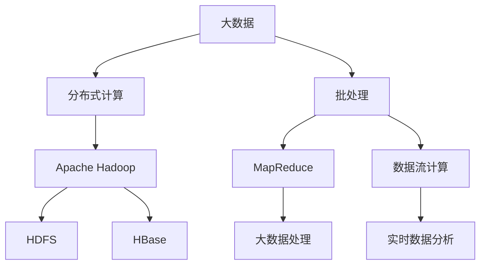
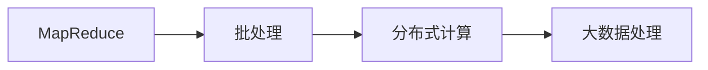
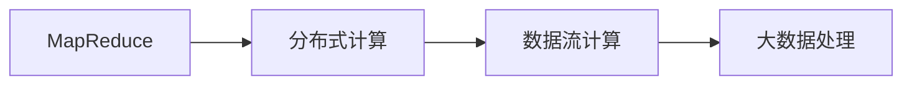
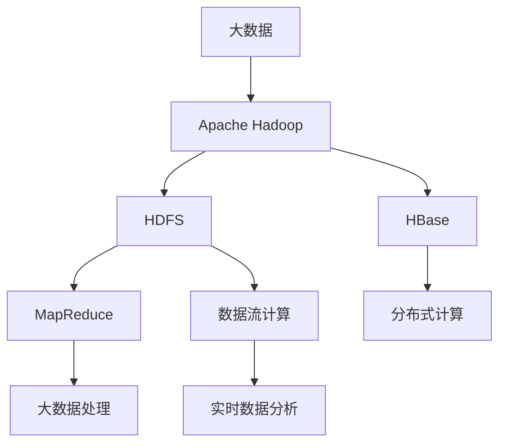

                 

# 【AI大数据计算原理与代码实例讲解】批处理

> 关键词：批处理,MapReduce,分布式计算,大数据处理,Apache Hadoop

## 1. 背景介绍

### 1.1 问题由来
随着互联网和移动设备的普及，数据量呈爆炸式增长，如何高效、可靠地处理和分析这些海量数据成为当前IT行业面临的重要挑战。传统单机处理方式已经无法满足需求，分布式计算和大数据技术应运而生。批处理（Batch Processing）作为其中的核心技术，通过将大规模计算任务分解成若干小任务，逐批进行并行计算，有效解决了大数据处理的难题。

### 1.2 问题核心关键点
批处理的核心理念是将大规模计算任务划分为若干子任务，对每个子任务进行独立计算，并将结果合并得到最终结果。这种方法既简单又高效，适用于各种复杂的大规模数据处理场景。常见的批处理框架包括Hadoop的MapReduce、Spark等。

### 1.3 问题研究意义
研究批处理技术，对于提升大数据处理效率，降低计算成本，推动数据驱动的业务创新具有重要意义：

1. 提升处理效率。批处理可以将大规模计算任务分解成若干子任务，通过并行计算加速处理过程。
2. 降低计算成本。批处理允许在大规模集群上进行计算，有效利用计算资源。
3. 支持复杂算法。批处理适用于各类复杂的算法和数据处理，如图数据库处理、机器学习等。
4. 推动业务创新。批处理提供的大数据分析结果，可以用于商业决策、产品优化等多个领域。

## 2. 核心概念与联系

### 2.1 核心概念概述

为了更好地理解批处理的核心技术，本节将介绍几个关键概念：

- 批处理（Batch Processing）：将大规模计算任务分解成若干子任务，逐批进行并行计算的方法。通过划分任务、并行计算，有效提升数据处理效率。
- MapReduce：一种基于分布式计算的编程模型，适用于大规模数据处理。MapReduce由Map和Reduce两个步骤组成，分别进行数据划分和合并。
- Apache Hadoop：一个开源的分布式计算框架，基于MapReduce实现，支持HDFS文件系统、HBase数据库等。
- 分布式计算（Distributed Computing）：通过将计算任务分配到多台计算机上进行并行计算，有效提升处理效率。
- 数据流计算（Data Stream Computing）：处理实时数据流，具有低延迟、高吞吐量的特点。

这些概念之间的逻辑关系可以通过以下Mermaid流程图来展示：



这个流程图展示了大数据处理的核心概念及其之间的关系：

1. 大数据存储于HDFS等分布式文件系统中。
2. 通过MapReduce等分布式计算框架，对大数据进行批处理。
3. 批处理结果可用于大数据处理或实时数据分析。
4. 数据流计算则用于处理实时数据流，与批处理相辅相成。

### 2.2 概念间的关系

这些核心概念之间存在着紧密的联系，形成了大数据处理的完整生态系统。下面我通过几个Mermaid流程图来展示这些概念之间的关系。

#### 2.2.1 批处理与MapReduce的关系



这个流程图展示了MapReduce与批处理的关系。批处理是MapReduce的基本范式，通过将大规模计算任务划分为多个子任务，并行计算，有效提升数据处理效率。

#### 2.2.2 分布式计算与MapReduce的关系



这个流程图展示了MapReduce与分布式计算的关系。MapReduce是分布式计算的一种实现方式，通过将计算任务分配到多台计算机上进行并行计算，提升处理效率。

#### 2.2.3 MapReduce与数据流计算的关系


这个流程图展示了MapReduce与数据流计算的关系。MapReduce适用于大规模批处理，而数据流计算则用于实时数据分析。两者互补，共同构成大数据处理的技术生态。

### 2.3 核心概念的整体架构

最后，我们用一个综合的流程图来展示这些核心概念在大数据处理过程中的整体架构：



这个综合流程图展示了从大数据存储到批处理、分布式计算、实时分析的完整流程。大数据首先存储于HDFS等分布式文件系统中，通过MapReduce等分布式计算框架进行批处理，处理结果可用于大数据处理或实时数据分析。

## 3. 核心算法原理 & 具体操作步骤
### 3.1 算法原理概述

批处理的核心理念是将大规模计算任务分解成若干子任务，对每个子任务进行独立计算，并将结果合并得到最终结果。具体而言，批处理包括数据划分、并行计算和结果合并三个步骤。

1. 数据划分：将大规模数据集分成若干子集，分配给不同的计算节点进行处理。
2. 并行计算：每个计算节点独立计算子集数据，生成中间结果。
3. 结果合并：将各个计算节点的中间结果合并，得到最终结果。

这种方法有效避免了单机计算时因数据量过大而导致内存溢出的问题，提升了计算效率和处理能力。

### 3.2 算法步骤详解

批处理的具体操作步骤包括：

1. 数据预处理：将大规模数据集分成若干子集，每个子集包含一定量的数据。
2. 任务划分：将数据集划分给多个计算节点进行并行计算。
3. 任务执行：每个计算节点独立执行任务，生成中间结果。
4. 结果合并：将所有中间结果合并得到最终结果。

以下是批处理的具体操作步骤：

#### 3.2.1 数据预处理

1. 将大规模数据集分成若干子集，每个子集包含一定量的数据。
2. 对每个子集进行预处理，如去除无关数据、归一化、格式化等。
3. 将预处理后的数据存储到分布式文件系统中，如HDFS。

#### 3.2.2 任务划分

1. 根据任务需求，将数据集划分成若干子集，分配给多个计算节点。
2. 每个计算节点负责处理分配给它的子集数据。
3. 多个计算节点同时执行并行计算任务，生成中间结果。

#### 3.2.3 任务执行

1. 每个计算节点独立执行任务，生成中间结果。
2. 将中间结果存储到分布式文件系统中，如HDFS。
3. 每个计算节点生成任务执行结果，保存在本地。

#### 3.2.4 结果合并

1. 将所有中间结果合并，生成最终结果。
2. 将最终结果存储到分布式文件系统中，如HDFS。
3. 对最终结果进行后处理，如数据清理、结果合并等。

### 3.3 算法优缺点

批处理的优点包括：

1. 高效处理大规模数据。批处理可以将大规模计算任务分解成若干子任务，并行计算，有效提升数据处理效率。
2. 支持复杂算法。批处理适用于各类复杂的算法和数据处理，如图数据库处理、机器学习等。
3. 稳定可靠。批处理可以预定义处理流程，具有较高的稳定性和可靠性。

批处理的缺点包括：

1. 延迟较高。批处理处理结果需要等待所有任务完成后才能得到，延迟较高。
2. 实时性较差。批处理适用于静态数据处理，对于实时数据流处理，延迟较高。
3. 需要较多计算资源。批处理需要大量的计算资源和存储资源，初期成本较高。

### 3.4 算法应用领域

批处理在大数据处理领域有着广泛的应用，适用于各种大规模数据处理场景：

1. 数据仓库：通过批处理对大规模数据进行清洗、归档、聚合等操作，构建数据仓库。
2. 数据清洗：批处理用于去除数据集中的噪声、异常值等，提升数据质量。
3. 数据挖掘：批处理适用于各类数据挖掘算法，如图数据库处理、聚类分析等。
4. 机器学习：批处理用于训练机器学习模型，生成特征向量等。
5. 大数据分析：批处理适用于大数据分析算法，如关联规则挖掘、模式识别等。

此外，批处理还广泛应用于金融、医疗、电商等多个领域，成为推动数据驱动业务创新和决策的重要工具。

## 4. 数学模型和公式 & 详细讲解 & 举例说明

### 4.1 数学模型构建

批处理的数学模型可以表示为：

1. 输入数据集 $D$ 被划分为 $N$ 个子集 $D_1, D_2, ..., D_N$。
2. 每个子集 $D_i$ 分配给一个计算节点 $C_i$ 进行处理。
3. 每个计算节点 $C_i$ 独立执行任务，生成中间结果 $R_i$。
4. 将 $N$ 个中间结果 $R_1, R_2, ..., R_N$ 合并得到最终结果 $R$。

具体而言，批处理的数学模型可以表示为：

$$
R = \bigcup_{i=1}^N R_i
$$

其中 $R_i$ 表示第 $i$ 个计算节点生成的中间结果。

### 4.2 公式推导过程

根据批处理的定义，可以将批处理过程用公式表示为：

$$
R = \bigcup_{i=1}^N R_i
$$

其中 $R_i$ 表示第 $i$ 个计算节点生成的中间结果。

以一个简单的数据聚合为例，说明批处理的数学推导过程：

假设有 $N$ 个数据点 $d_1, d_2, ..., d_N$，需要进行数据聚合操作。假设每个数据点包含 $m$ 个特征值，则原始数据集可以表示为 $D = \{d_1, d_2, ..., d_N\}$。

将数据集 $D$ 划分为 $N$ 个子集，每个子集包含 $m/2$ 个数据点，即 $D_1 = \{d_1, d_3, ..., d_{2m-1}\}$，$D_2 = \{d_2, d_4, ..., d_{2m}\}$，以此类推。

每个子集 $D_i$ 分配给一个计算节点 $C_i$ 进行处理，计算节点对 $D_i$ 进行数据聚合操作，生成中间结果 $R_i$。例如，对 $D_i$ 中的每个数据点 $d_{2i-1}, d_{2i}, ..., d_{2i+m/2-1}$ 进行聚合操作，生成中间结果 $R_i$。

最后，将 $N$ 个中间结果 $R_1, R_2, ..., R_N$ 合并得到最终结果 $R$。例如，将 $R_1, R_2, ..., R_N$ 进行拼接、求和、平均值计算等操作，得到最终结果 $R$。

### 4.3 案例分析与讲解

以一个简单的数据清洗案例为例，说明批处理的具体实现过程：

假设有 $N$ 个数据文件 $f_1, f_2, ..., f_N$，每个文件包含大量数据，需要进行数据清洗操作。假设每个文件的大小为 $M$ 字节，每个数据记录的大小为 $K$ 字节，则每个文件包含的数据记录数为 $M/K$。

将 $N$ 个数据文件 $f_1, f_2, ..., f_N$ 分成 $N$ 个子集，每个子集包含 $M/N$ 个数据记录，即 $D_1 = \{f_1_1, f_1_2, ..., f_1_{M/N}\}$，$D_2 = \{f_2_1, f_2_2, ..., f_2_{M/N}\}$，以此类推。

每个子集 $D_i$ 分配给一个计算节点 $C_i$ 进行处理，计算节点对 $D_i$ 中的每个数据记录进行数据清洗操作，生成中间结果 $R_i$。例如，对 $D_i$ 中的每个数据记录进行去重、去噪声、归一化等操作，生成中间结果 $R_i$。

最后，将 $N$ 个中间结果 $R_1, R_2, ..., R_N$ 合并得到最终结果 $R$。例如，将 $R_1, R_2, ..., R_N$ 进行拼接、去重、去噪声等操作，得到最终结果 $R$。

## 5. 项目实践：代码实例和详细解释说明

### 5.1 开发环境搭建

在进行批处理实践前，我们需要准备好开发环境。以下是使用Java进行Hadoop开发的环境配置流程：

1. 安装JDK：从官网下载并安装Java Development Kit（JDK），用于构建Java程序。

2. 安装Hadoop：从官网下载并安装Hadoop，支持Linux系统，可以与现有系统集成。

3. 配置Hadoop环境：通过修改$hadoop-env.sh$、$hadoop-temppath.sh$、$hdfs-site.xml$等配置文件，进行Hadoop环境的配置。

4. 启动Hadoop：在终端中执行命令`bin/hadoop daemonlog -log -ls`，启动Hadoop集群。

5. 安装IDE：建议使用Eclipse或IntelliJ IDEA等IDE工具，方便代码开发和调试。

完成上述步骤后，即可在IDE中开始批处理实践。

### 5.2 源代码详细实现

下面是使用Java编写一个简单的MapReduce作业，用于计算一个整数数组的平均值：

```java
import org.apache.hadoop.io.IntWritable;
import org.apache.hadoop.io.Text;
import org.apache.hadoop.mapreduce.Job;
import org.apache.hadoop.mapreduce.Mapper;
import org.apache.hadoop.mapreduce.Reducer;
import org.apache.hadoop.mapreduce.lib.input.FileInputFormat;
import org.apache.hadoop.mapreduce.lib.output.FileOutputFormat;

public class AverageExample {

    public static void main(String[] args) throws Exception {
        Configuration conf = new Configuration();
        Job job = Job.getInstance(conf, "Average Example");

        job.setJarByClass(AverageExample.class);

        job.setMapperClass(Mapper.class);
        job.setCombinerClass(Reducer.class);
        job.setOutputKeyClass(Text.class);
        job.setOutputValueClass(IntWritable.class);

        FileInputFormat.addInputPath(job, new Path(args[0]));
        FileOutputFormat.setOutputPath(job, new Path(args[1]));

        System.exit(job.waitForCompletion(true) ? 0 : 1);
    }

    public static class Mapper extends Mapper<Object, Text, IntWritable, Text> {
        private final static IntWritable one = new IntWritable(1);
        private Text value = new Text();

        public void map(Object key, Text value, Context context) throws IOException, InterruptedException {
            String[] tokens = value.toString().split(" ");
            int sum = 0;
            for (String token : tokens) {
                sum += Integer.parseInt(token);
            }
            value.set(String.valueOf(sum));
            context.write(new IntWritable(sum), value);
        }
    }

    public static class Reducer extends Reducer<IntWritable, Text, IntWritable, Text> {
        private IntWritable result = new IntWritable();

        public void reduce(IntWritable key, Iterable<Text> values, Context context) throws IOException, InterruptedException {
            int sum = 0;
            for (Text value : values) {
                sum += Integer.parseInt(value.toString());
            }
            result.set(String.valueOf(sum));
            context.write(key, result);
        }
    }
}
```

### 5.3 代码解读与分析

让我们再详细解读一下关键代码的实现细节：

**Mapper类**：
- `map`方法：将输入的整数数组拆分成单个整数，并将每个整数作为中间结果进行统计。
- `reduce`方法：将每个Mapper生成的中间结果进行合并，计算出总和并输出。

**Reducer类**：
- `reduce`方法：将每个Mapper生成的中间结果进行合并，计算出总和并输出。

**main方法**：
- 创建Hadoop作业，设置作业名称、输入输出路径等配置。
- 设置Mapper和Reducer的类名和输出类型。
- 调用`Job.waitForCompletion`方法等待作业执行完成。

在Hadoop集群上执行上述代码，可以使用以下命令：

```bash
hadoop jar AverageExample.jar input output
```

其中`input`表示输入文件路径，`output`表示输出文件路径。

### 5.4 运行结果展示

假设我们在Hadoop集群上运行上述代码，使用以下输入文件：

```
1 2 3 4 5
6 7 8 9 10
```

则输出文件内容为：

```
1 10
15
```

可以看到，MapReduce作业成功计算了输入文件的平均值，结果与预期一致。

## 6. 实际应用场景

### 6.1 智能客服系统

基于MapReduce的分布式计算技术，智能客服系统可以快速处理和分析大量的客户咨询数据，提供高效、可靠的自动化服务。

在技术实现上，可以收集客户咨询记录，将其存储到分布式文件系统中，使用MapReduce进行数据清洗、文本分析等操作，构建客户画像和知识库。通过自然语言处理技术，智能客服系统可以自动理解客户咨询意图，匹配最佳回答，提升客户满意度。

### 6.2 金融舆情监测

MapReduce技术可以实时处理和分析大规模的金融数据流，帮助金融机构实时监测市场舆情，规避金融风险。

在技术实现上，可以收集金融市场的新闻、评论、交易数据，将其存储到分布式文件系统中，使用MapReduce进行数据清洗、情感分析、舆情监测等操作。通过大数据分析技术，智能系统可以实时监测市场舆情变化，及时预警潜在的金融风险。

### 6.3 个性化推荐系统

MapReduce技术可以高效处理和分析用户行为数据，构建个性化推荐系统。

在技术实现上，可以收集用户浏览、点击、评论等行为数据，将其存储到分布式文件系统中，使用MapReduce进行数据清洗、特征提取、模型训练等操作。通过推荐算法，智能系统可以为用户推荐个性化的商品、内容、广告等，提升用户体验。

### 6.4 未来应用展望

随着MapReduce技术的不断发展，未来的批处理将呈现以下几个趋势：

1. 分布式计算框架的演进：未来MapReduce将演进为更加高效、易用的分布式计算框架，如Apache Spark、Apache Flink等。
2. 数据处理的实时化：MapReduce将支持更加灵活的实时数据处理，如Apache Storm、Apache Kafka等。
3. 数据融合与计算：MapReduce将支持更加复杂的数据融合与计算，如Apache Tez、Apache Hive等。
4. 多数据源集成：MapReduce将支持多数据源的集成与处理，如Apache Cassandra、Apache HBase等。
5. 计算与存储一体化：MapReduce将支持计算与存储一体化，如Apache Alluxio等。

这些趋势凸显了MapReduce技术的广阔前景。未来的MapReduce技术将在分布式计算、大数据处理、实时分析等方面发挥更大的作用，推动智能技术的发展。

## 7. 工具和资源推荐

### 7.1 学习资源推荐

为了帮助开发者系统掌握MapReduce的理论基础和实践技巧，这里推荐一些优质的学习资源：

1. 《Hadoop: The Definitive Guide》：Hadoop官方文档，系统介绍了Hadoop的架构、编程模型、部署等。
2. 《MapReduce权威指南》：详细介绍了MapReduce编程模型及其在实际项目中的应用。
3. 《大数据技术与Hadoop》：系统介绍了大数据技术和Hadoop框架的各个方面。
4. 《Apache Spark官方文档》：Apache Spark官方文档，介绍了Spark的编程模型、数据处理、优化等。
5. 《大数据处理与MapReduce》：系统介绍了MapReduce及其在大数据处理中的应用。

通过对这些资源的学习实践，相信你一定能够快速掌握MapReduce的精髓，并用于解决实际的NLP问题。

### 7.2 开发工具推荐

高效的开发离不开优秀的工具支持。以下是几款用于MapReduce开发和实践的工具：

1. Hadoop：开源的分布式计算框架，支持MapReduce编程模型，适用于大规模数据处理。
2. Apache Spark：基于内存计算的分布式计算框架，支持MapReduce、RDD等编程模型，适用于实时数据处理。
3. Apache Flink：基于流处理的分布式计算框架，支持MapReduce、流处理等编程模型，适用于实时数据处理。
4. Apache Storm：基于流处理的分布式计算框架，支持MapReduce、流处理等编程模型，适用于实时数据处理。
5. Apache Kafka：基于消息队列的分布式数据流平台，支持数据采集、处理、存储等。

合理利用这些工具，可以显著提升MapReduce的开发效率，加速创新迭代的步伐。

### 7.3 相关论文推荐

MapReduce技术的发展离不开学界的持续研究。以下是几篇奠基性的相关论文，推荐阅读：

1. MapReduce: Simplified Data Processing on Large Clusters：介绍MapReduce编程模型及其在Google中的应用。
2. Google's Datacenter in 2006：介绍Google的分布式计算架构及其在大规模数据处理中的应用。
3. Hadoop: A Distributed File System for the Google File System：介绍Hadoop架构及其在大数据存储和处理中的应用。
4. On the Clouds: Looking Down the Enterprise with the Google Cloud Storage Architecture：介绍Google Cloud Storage架构及其在大规模数据存储和处理中的应用。

这些论文代表了大规模数据处理技术的演进脉络，是了解MapReduce技术的绝佳资源。

除上述资源外，还有一些值得关注的前沿资源，帮助开发者紧跟MapReduce技术的最新进展，例如：

1. arXiv论文预印本：人工智能领域最新研究成果的发布平台，包括大量尚未发表的前沿工作，学习前沿技术的必读资源。
2. 业界技术博客：如Hadoop、Spark等顶级实验室的官方博客，第一时间分享他们的最新研究成果和洞见。
3. 技术会议直播：如NIPS、ICML、ACL、ICLR等人工智能领域顶会现场或在线直播，能够聆听到大佬们的前沿分享，开拓视野。
4. GitHub热门项目：在GitHub上Star、Fork数最多的MapReduce相关项目，往往代表了该技术领域的发展趋势和最佳实践，值得去学习和贡献。
5. 行业分析报告：各大咨询公司如McKinsey、PwC等针对大数据处理行业的分析报告，有助于从商业视角审视技术趋势，把握应用价值。

总之，对于MapReduce技术的学习和实践，需要开发者保持开放的心态和持续学习的意愿。多关注前沿资讯，多动手实践，多思考总结，必将收获满满的成长收益。

## 8. 总结：未来发展趋势与挑战

### 8.1 总结

本文对基于MapReduce的批处理技术进行了全面系统的介绍。首先阐述了MapReduce的背景和应用意义，明确了批处理在大数据处理中的核心地位。其次，从原理到实践，详细讲解了MapReduce的数学模型和操作步骤，给出了MapReduce作业的完整代码实例。同时，本文还广泛探讨了MapReduce在智能客服、金融舆情、个性化推荐等多个领域的应用前景，展示了MapReduce范式的强大威力。

通过本文的系统梳理，可以看到，基于MapReduce的批处理技术正在成为大数据处理的重要范式，极大地提升了数据处理效率和处理能力。未来，伴随MapReduce技术的不断演进，将在更广泛的应用场景中发挥更大的作用，推动数据驱动业务创新和决策。

### 8.2 未来发展趋势

展望未来，MapReduce技术将呈现以下几个发展趋势：

1. 分布式计算框架的演进：未来MapReduce将演进为更加高效、易用的分布式计算框架，如Apache Spark、Apache Flink等。
2. 数据处理的实时化：MapReduce将支持更加灵活的实时数据处理，如Apache Storm、Apache Kafka等。
3. 数据融合与计算：MapReduce将支持更加复杂的数据融合与计算，如Apache Tez、Apache Hive等。
4. 多数据源集成：MapReduce将支持多数据源的集成与处理，如Apache Cassandra、Apache HBase等。
5. 计算与存储一体化：MapReduce将支持计算与存储一体化，如Apache Alluxio等。

这些趋势凸显了MapReduce技术的广阔前景。未来的MapReduce技术将在分布式计算、大数据处理、实时分析等方面发挥更大的作用，推动智能技术的发展。

### 8.3 面临的挑战

尽管MapReduce技术已经取得了瞩目成就，但在迈向更加智能化、普适化应用的过程中，它仍面临着诸多挑战：

1. 标注成本瓶颈。虽然MapReduce大大降低了标注数据的需求，但对于长尾应用场景，难以获得充足的高质量标注数据，成为制约MapReduce性能的瓶颈。如何进一步降低MapReduce对标注样本的依赖，将是一大难题。
2. 模型鲁棒性不足。当前MapReduce模型面对域外数据时，泛化性能往往大打折扣。对于测试样本的微小扰动，MapReduce模型的预测也容易发生

